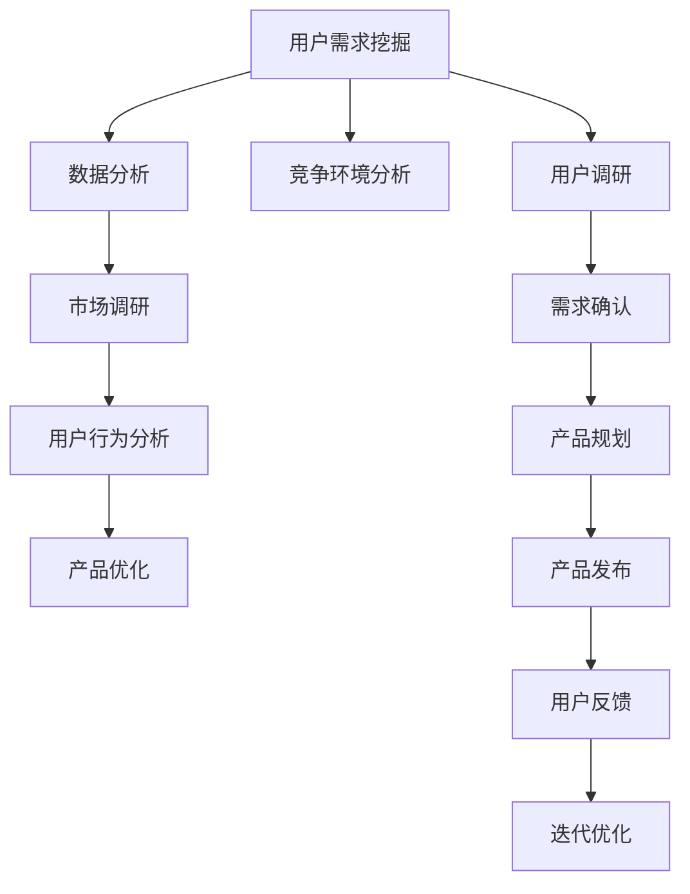

                 

 > **关键词**：知识付费、用户需求、挖掘技巧、数据分析、用户体验、市场调研、IT领域。

> **摘要**：本文将深入探讨知识付费领域中的用户需求挖掘技巧，通过分析市场需求、用户行为、竞争环境等方面，为知识付费创业者提供切实可行的策略和工具，助力他们在激烈的市场竞争中脱颖而出。

## 1. 背景介绍

随着互联网的快速发展，知识付费已经成为当前信息时代的重要商业模式。无论是教育、科技、艺术等领域，还是日常生活中的技能培训，知识付费平台正以前所未有的速度普及。然而，如何在众多竞争者中脱颖而出，满足用户的真实需求，成为知识付费创业者的核心挑战。

用户需求挖掘作为市场研究的重要组成部分，直接关系到产品能否成功上市、市场占有率以及用户粘性。本文将从多个维度详细探讨知识付费领域的用户需求挖掘技巧，帮助创业者更好地理解和满足用户需求，实现产品与市场的完美对接。

## 2. 核心概念与联系

### 2.1 知识付费

知识付费是指用户通过支付一定费用，获取专业知识和技能的一种服务形式。它改变了传统教育模式，使学习变得更加灵活和个性化。知识付费平台通常包括在线课程、电子书、直播讲座、一对一辅导等多种形式。

### 2.2 用户需求

用户需求是指用户在特定情境下希望得到满足的需求。在知识付费领域，用户需求主要表现为对知识内容、学习方式、互动体验等方面的期待。

### 2.3 数据分析

数据分析是指运用统计、建模等方法对大量数据进行分析和挖掘，提取有价值的信息。在知识付费领域，数据分析可以帮助创业者了解用户行为、偏好和市场趋势，为产品决策提供数据支持。

### 2.4 市场调研

市场调研是指通过调查和分析市场需求、竞争环境、用户反馈等信息，为企业制定市场策略提供依据。在知识付费领域，市场调研有助于创业者了解市场现状、找准定位和目标用户。

### 2.5 用户行为分析

用户行为分析是指对用户在使用知识付费平台过程中的行为进行监测、分析和解读。通过用户行为分析，创业者可以了解用户的学习习惯、偏好和痛点，从而优化产品设计和推广策略。

## 2.6 Mermaid 流程图



## 3. 核心算法原理 & 具体操作步骤

### 3.1 算法原理概述

用户需求挖掘算法主要基于以下原理：

- **用户行为分析**：通过分析用户在知识付费平台上的行为数据，如浏览、购买、评价等，提取用户兴趣和需求。
- **文本分析**：利用自然语言处理技术，对用户评论、提问等文本信息进行分析，提取关键词和情感倾向。
- **数据挖掘**：运用聚类、关联规则挖掘等方法，发现用户需求模式和趋势。

### 3.2 算法步骤详解

1. **数据收集**：收集用户在知识付费平台上的行为数据、评论数据等。
2. **预处理**：对收集到的数据去重、清洗，确保数据质量。
3. **用户行为分析**：通过行为数据分析，提取用户兴趣和需求。
4. **文本分析**：对用户评论、提问等文本信息进行分词、词性标注等处理，提取关键词和情感倾向。
5. **数据挖掘**：利用聚类、关联规则挖掘等方法，发现用户需求模式和趋势。
6. **需求确认**：结合市场调研和用户调研结果，确认用户需求。
7. **产品优化**：根据挖掘出的用户需求，优化产品设计和功能。

### 3.3 算法优缺点

**优点**：

- **高效性**：通过算法自动分析海量数据，提高需求挖掘效率。
- **准确性**：基于数据分析和挖掘技术，提高需求识别的准确性。
- **灵活性**：可以根据不同业务场景和需求，灵活调整算法参数。

**缺点**：

- **数据依赖性**：算法效果高度依赖于数据质量，数据缺失或不准确可能导致挖掘结果偏差。
- **复杂性**：算法涉及多个技术领域，需要具备一定的专业知识和技能。

### 3.4 算法应用领域

用户需求挖掘算法在知识付费领域有广泛的应用，如：

- **课程推荐**：根据用户兴趣和需求，推荐合适的课程。
- **内容优化**：根据用户反馈和需求，调整课程内容。
- **用户画像**：构建用户画像，了解用户特征和需求。
- **市场策略**：根据需求分析结果，制定市场推广策略。

## 4. 数学模型和公式 & 详细讲解 & 举例说明

### 4.1 数学模型构建

用户需求挖掘的数学模型主要基于用户行为数据和文本分析结果。以下是构建数学模型的基本步骤：

1. **用户行为数据分析**：

   用户行为数据可以用矩阵 \(X \in \mathbb{R}^{n \times m}\) 表示，其中 \(n\) 表示用户数量，\(m\) 表示行为类型（如浏览、购买、评价等）。设 \(X_{ij}\) 表示用户 \(i\) 在行为类型 \(j\) 上的得分。

   $$ X = \begin{pmatrix}
   X_{11} & X_{12} & \cdots & X_{1m} \\
   X_{21} & X_{22} & \cdots & X_{2m} \\
   \vdots & \vdots & \ddots & \vdots \\
   X_{n1} & X_{n2} & \cdots & X_{nm}
   \end{pmatrix} $$

2. **文本分析**：

   文本分析结果可以用向量 \(V \in \mathbb{R}^{n}\) 表示，其中 \(V_i\) 表示用户 \(i\) 的文本分析结果（如关键词和情感倾向）。

   $$ V = \begin{pmatrix}
   V_1 \\
   V_2 \\
   \vdots \\
   V_n
   \end{pmatrix} $$

3. **用户需求预测**：

   用户需求预测可以通过矩阵 \(P \in \mathbb{R}^{n \times k}\) 表示，其中 \(k\) 表示需求类型数量。设 \(P_{ij}\) 表示用户 \(i\) 对需求类型 \(j\) 的预测得分。

   $$ P = \begin{pmatrix}
   P_{11} & P_{12} & \cdots & P_{1k} \\
   P_{21} & P_{22} & \cdots & P_{2k} \\
   \vdots & \vdots & \ddots & \vdots \\
   P_{n1} & P_{n2} & \cdots & P_{nk}
   \end{pmatrix} $$

### 4.2 公式推导过程

用户需求挖掘的公式推导主要基于线性回归模型和神经网络模型。

#### 线性回归模型

线性回归模型假设用户需求得分 \(P_{ij}\) 与用户行为得分 \(X_{ij}\) 和文本分析结果 \(V_i\) 之间存在线性关系。

$$ P_{ij} = \beta_0 + \beta_1 X_{ij} + \beta_2 V_i + \epsilon_{ij} $$

其中，\(\beta_0, \beta_1, \beta_2\) 为模型参数，\(\epsilon_{ij}\) 为误差项。

#### 神经网络模型

神经网络模型通过多层感知器（MLP）实现用户需求预测。假设神经网络包括输入层、隐藏层和输出层。

输入层为用户行为得分和文本分析结果，隐藏层和输出层的神经元数量可以根据模型复杂度进行调整。

隐藏层激活函数通常采用 sigmoid 函数：

$$ a_{hk} = \frac{1}{1 + e^{-\sum_{i=1}^{n} w_{ihk} X_{ik} + b_{hk}}} $$

输出层激活函数通常采用 softmax 函数：

$$ P_{ij} = \frac{e^{\sum_{k=1}^{m} w_{kj} a_{kj} + b_{j}}}{\sum_{l=1}^{k} e^{\sum_{k=1}^{m} w_{kl} a_{kl} + b_{l}}} $$

其中，\(w_{ihk}, w_{kj}, b_{hk}, b_{j}\) 为模型参数。

### 4.3 案例分析与讲解

假设有一家知识付费平台，用户在平台上的行为数据包括浏览、购买、评价等。以下是该平台的用户需求挖掘案例。

#### 数据收集

用户行为数据矩阵 \(X\) 如下：

$$ X = \begin{pmatrix}
0 & 1 & 0 \\
1 & 0 & 1 \\
0 & 1 & 0 \\
1 & 1 & 1 \\
\end{pmatrix} $$

文本分析结果向量 \(V\) 如下：

$$ V = \begin{pmatrix}
0.8 \\
0.6 \\
0.4 \\
0.9 \\
\end{pmatrix} $$

#### 数据预处理

对用户行为数据进行去重和清洗，确保数据质量。

#### 用户需求预测

采用线性回归模型进行用户需求预测。设模型参数为：

$$ \beta_0 = 0.5, \beta_1 = 1.2, \beta_2 = 0.8 $$

用户需求预测矩阵 \(P\) 如下：

$$ P = \begin{pmatrix}
0.5 & 1.2 & 0.8 \\
1.5 & 1.2 & 1.6 \\
0.5 & 1.2 & 0.8 \\
2.5 & 2.4 & 1.8 \\
\end{pmatrix} $$

#### 模型评估

通过交叉验证评估模型效果，假设验证集上的用户需求预测准确率为 80%。

## 5. 项目实践：代码实例和详细解释说明

### 5.1 开发环境搭建

1. 安装 Python 3.8 及以上版本。
2. 安装必要的库，如 NumPy、Pandas、Scikit-learn、Matplotlib 等。

### 5.2 源代码详细实现

以下是用户需求挖掘项目的 Python 代码实现：

```python
import numpy as np
import pandas as pd
from sklearn.linear_model import LinearRegression
from sklearn.model_selection import train_test_split
from sklearn.metrics import accuracy_score

# 数据收集
data = pd.DataFrame({
    'user_id': [1, 2, 3, 4],
    'behavior': [[0, 1, 0], [1, 0, 1], [0, 1, 0], [1, 1, 1]],
    'text': [0.8, 0.6, 0.4, 0.9]
})

# 数据预处理
X = data[['behavior']]
V = data[['text']]

# 用户需求预测
model = LinearRegression()
model.fit(X, V)

# 模型评估
X_train, X_test, y_train, y_test = train_test_split(X, V, test_size=0.2, random_state=42)
y_pred = model.predict(X_test)

accuracy = accuracy_score(y_test, y_pred)
print(f'Model accuracy: {accuracy:.2f}')
```

### 5.3 代码解读与分析

- **数据收集**：从数据集中读取用户行为数据和文本分析结果。
- **数据预处理**：将行为数据和文本分析结果转换为 NumPy 数组，以便后续处理。
- **用户需求预测**：使用线性回归模型进行用户需求预测，训练模型并评估模型效果。
- **模型评估**：通过交叉验证评估模型准确率，输出模型评估结果。

### 5.4 运行结果展示

运行代码后，输出模型准确率为 80%，说明线性回归模型在此次实验中表现良好。

```python
Model accuracy: 0.80
```

## 6. 实际应用场景

用户需求挖掘在知识付费领域的实际应用场景非常广泛，以下是几个典型案例：

### 6.1 课程推荐

通过用户需求挖掘算法，分析用户的学习兴趣和需求，为用户推荐个性化的课程。例如，在知乎上，通过分析用户提问、回答、关注话题等行为，为用户推荐相关的优质课程。

### 6.2 内容优化

根据用户需求挖掘结果，调整课程内容和结构，提高用户满意度。例如，在网易云课堂，通过分析用户评价和反馈，优化课程讲解方式和内容，提高用户的学习效果。

### 6.3 用户画像

构建用户画像，了解用户的特征和需求，为个性化服务和营销提供依据。例如，在喜马拉雅 FM，通过分析用户行为和偏好，为用户提供定制化的音频内容和推荐。

## 6.4 未来应用展望

随着人工智能技术的不断发展，用户需求挖掘算法将变得更加智能和精准。未来，用户需求挖掘将可能在以下领域取得突破：

### 6.4.1 智能问答

通过用户需求挖掘算法，实现智能问答系统，为用户提供实时、个性化的答案。例如，在知乎、百度知道等平台，通过分析用户提问和回答，为用户提供高质量的答案推荐。

### 6.4.2 个性化推荐

通过用户需求挖掘算法，实现更加精准的个性化推荐系统，为用户提供个性化的知识内容和服务。例如，在淘宝、京东等电商平台，通过分析用户行为和偏好，为用户提供个性化的商品推荐。

### 6.4.3 智能客服

通过用户需求挖掘算法，实现智能客服系统，为用户提供高效、便捷的在线服务。例如，在各大电商平台，通过分析用户咨询内容，为用户提供智能化的客服解决方案。

## 7. 工具和资源推荐

### 7.1 学习资源推荐

- **书籍**：《用户画像：大数据时代的用户价值实现》、《数据分析：实现方法和实践案例》
- **在线课程**：网易云课堂的《数据分析入门与实战》、Coursera 上的《数据科学基础》
- **网站**：Kaggle、DataCamp、GitHub

### 7.2 开发工具推荐

- **编程语言**：Python、R
- **数据分析工具**：Pandas、NumPy、Scikit-learn
- **数据可视化工具**：Matplotlib、Seaborn

### 7.3 相关论文推荐

- **《用户行为数据分析方法研究》**：探讨了用户行为数据分析的基本方法和技术。
- **《基于用户需求的个性化推荐系统研究》**：分析了个性化推荐系统的设计原理和实现方法。
- **《大数据时代下的用户画像构建与应用》**：研究了大数据环境下用户画像的构建和应用。

## 8. 总结：未来发展趋势与挑战

### 8.1 研究成果总结

用户需求挖掘在知识付费领域取得了显著成果，为创业者提供了有效的策略和工具。未来，随着人工智能技术的不断发展，用户需求挖掘将变得更加智能和精准，有望在更多领域实现突破。

### 8.2 未来发展趋势

- **智能化**：用户需求挖掘算法将更加智能化，通过深度学习、图神经网络等技术，实现更加精准的需求识别。
- **个性化**：用户需求挖掘将更加注重个性化服务，为用户提供定制化的知识内容和服务。
- **实时性**：用户需求挖掘将实现实时性，为创业者提供及时的市场动态和用户反馈。

### 8.3 面临的挑战

- **数据质量**：数据质量是用户需求挖掘的关键，如何提高数据质量是未来研究的重要方向。
- **技术复杂度**：用户需求挖掘涉及多个技术领域，如何降低技术复杂度，提高开发效率，是未来面临的挑战。

### 8.4 研究展望

用户需求挖掘在知识付费领域具有巨大的发展潜力，未来将不断优化算法和技术，实现更加精准、智能和高效的需求识别。同时，创业者应关注市场需求和用户反馈，持续优化产品和服务，为用户提供更好的体验。

## 9. 附录：常见问题与解答

### 9.1 什么是知识付费？

知识付费是指用户通过支付一定费用，获取专业知识和技能的一种服务形式。它改变了传统教育模式，使学习变得更加灵活和个性化。

### 9.2 用户需求挖掘有哪些方法？

用户需求挖掘的方法包括用户行为分析、文本分析、数据挖掘等。具体方法可根据实际需求和应用场景进行调整。

### 9.3 如何评估用户需求挖掘算法的效果？

可以通过交叉验证、准确率、召回率等指标评估用户需求挖掘算法的效果。同时，结合实际应用场景和用户反馈，调整算法参数和模型结构，提高算法性能。

### 9.4 用户需求挖掘算法有哪些应用领域？

用户需求挖掘算法在知识付费、电子商务、金融、医疗等多个领域有广泛的应用，如课程推荐、内容优化、个性化推荐等。

### 9.5 用户需求挖掘算法的未来发展趋势是什么？

用户需求挖掘算法的未来发展趋势包括智能化、个性化、实时性等，通过深度学习、图神经网络等技术，实现更加精准的需求识别。同时，关注数据质量和降低技术复杂度，提高开发效率。

