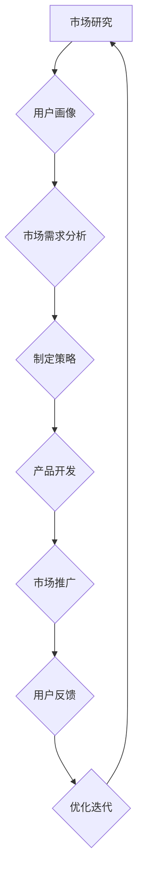

                 

 在当今快速发展的知识经济时代，知识付费创业者的自我提升策略至关重要。他们不仅需要紧跟行业趋势，持续学习新技术，还需要具备强大的解决问题的能力，以及高效的项目管理技巧。本文将围绕知识付费创业者的核心能力展开，提供一套全面且实用的自我提升策略。

> 关键词：知识付费、自我提升、创业者、技能培养、项目管理

> 摘要：本文将探讨知识付费创业者在面对不断变化的商业环境时，如何通过掌握前沿技术、提升个人素养、优化时间管理和团队协作，实现自我提升。通过案例分析、实用工具推荐和实践指导，本文为创业者提供了全方位的自我提升策略。

## 1. 背景介绍

知识付费，即通过付费形式获取知识和服务的商业模式，近年来在全球范围内迅速崛起。随着互联网和移动设备的普及，用户对个性化、专业化的知识需求日益增长。知识付费平台如Coursera、Udemy等成为许多专业人士和创业者获取知识的重要渠道。在这个背景下，知识付费创业者面临着激烈的竞争和快速变化的市场环境。

### 当前知识付费市场概述

根据市场研究数据，全球知识付费市场规模预计将在未来几年内持续增长。用户对在线课程、专业咨询、技能认证等服务的需求不断上升。知识付费市场的细分领域也在不断拓展，从传统教育内容扩展到职业技能培训、个人成长、心理咨询服务等。

### 知识付费创业者的角色与挑战

知识付费创业者不仅要具备深厚的专业知识和技能，还需面对以下挑战：

- **市场竞争力：** 随着更多玩家的进入，市场竞争日益激烈，创业者需要不断创新，提供更具竞争力的产品和服务。
- **用户需求变化：** 用户对知识和服务的需求不断变化，创业者需快速适应，提供个性化的解决方案。
- **技术迭代：** 新技术的不断涌现，如人工智能、大数据等，要求创业者不断更新知识和技能，以保持竞争力。
- **时间管理：** 创业者需要高效管理时间和资源，确保项目顺利推进。

## 2. 核心概念与联系

### 核心概念

- **知识付费模式：** 知识付费的商业模式，包括在线课程、专业咨询、技能认证等形式。
- **用户画像：** 对目标用户进行详细分析，包括年龄、职业、兴趣、需求等。
- **市场需求分析：** 对市场趋势、竞争对手、用户需求进行深入分析，以制定合适的营销策略。

### Mermaid 流程图



### Mermaid 流程图解释

1. **市场研究**：通过对市场进行调研，了解整体趋势和竞争对手情况。
2. **用户画像**：对目标用户进行分析，包括年龄、职业、兴趣、需求等。
3. **市场需求分析**：基于用户画像和市场研究，分析用户需求和市场趋势。
4. **制定策略**：根据分析结果，制定具体的营销策略和产品开发计划。
5. **产品开发**：根据策略进行产品开发，包括课程设计、内容制作等。
6. **市场推广**：通过多种渠道进行市场推广，提高品牌知名度和用户转化率。
7. **用户反馈**：收集用户反馈，了解产品使用情况，优化迭代。
8. **优化迭代**：根据用户反馈，不断优化产品和服务，提高用户体验。
9. **回到市场研究**：持续进行市场研究，以适应不断变化的市场环境。

## 3. 核心算法原理 & 具体操作步骤

### 3.1 算法原理概述

知识付费创业者的自我提升策略可以看作是一种动态优化问题。算法的核心思想是通过不断学习和适应，提高创业者在市场中的竞争力。具体来说，算法包括以下几个步骤：

1. **数据收集**：收集与市场、用户、竞争对手相关的数据。
2. **数据分析**：对收集的数据进行深入分析，提取有用的信息。
3. **策略制定**：根据分析结果，制定具体的营销策略和产品开发计划。
4. **执行与反馈**：执行策略，并收集用户反馈，进行优化迭代。

### 3.2 算法步骤详解

1. **数据收集**：
   - 收集市场数据，包括市场规模、增长率、用户行为等。
   - 收集用户数据，包括用户画像、需求、偏好等。
   - 收集竞争对手数据，包括产品、价格、市场占有率等。

2. **数据分析**：
   - 利用数据分析工具，对收集的数据进行预处理和可视化。
   - 分析市场趋势，预测未来发展方向。
   - 分析用户需求，确定目标用户群体。

3. **策略制定**：
   - 根据市场趋势和用户需求，制定营销策略和产品开发计划。
   - 确定产品定位、价格策略、推广渠道等。

4. **执行与反馈**：
   - 根据策略进行产品开发和市场推广。
   - 收集用户反馈，了解产品使用情况，发现问题。
   - 根据反馈进行优化迭代，提高产品竞争力。

### 3.3 算法优缺点

- **优点**：
  - **动态调整**：根据市场环境和用户需求，动态调整策略，提高竞争力。
  - **持续优化**：通过不断学习和反馈，持续优化产品和服务，提高用户体验。
  - **高效性**：利用数据分析工具，快速获取有用信息，提高决策效率。

- **缺点**：
  - **数据依赖性**：算法的准确性和效果依赖于数据的准确性和完整性。
  - **复杂性**：涉及多个环节和步骤，需要较高技术水平。

### 3.4 算法应用领域

- **市场研究**：通过算法，快速获取市场趋势和用户需求，制定营销策略。
- **产品开发**：根据用户反馈，优化产品设计和功能，提高用户满意度。
- **用户画像**：分析用户行为和需求，提供个性化的产品和服务。

## 4. 数学模型和公式 & 详细讲解 & 举例说明

### 4.1 数学模型构建

在知识付费创业者的自我提升策略中，我们可以构建一个基于马尔可夫决策过程（MDP）的数学模型。该模型用于描述创业者在不同状态下的决策过程，以及如何通过优化策略实现最大收益。

### 4.2 公式推导过程

1. **状态转移概率**：
   $$ P(S_t = s_{t+1} | S_t = s_t, A_t = a_t) = p(s_{t+1} | s_t, a_t) $$
   其中，$S_t$ 表示第 $t$ 时刻的状态，$A_t$ 表示第 $t$ 时刻的决策，$p(s_{t+1} | s_t, a_t)$ 表示在状态 $s_t$ 和决策 $a_t$ 下的状态转移概率。

2. **回报函数**：
   $$ R(s_t, a_t) = \sum_{t} \gamma^t r_t $$
   其中，$r_t$ 表示在状态 $s_t$ 下执行决策 $a_t$ 后的即时回报，$\gamma$ 是折现因子，用于权衡长期和短期回报。

3. **策略优化**：
   $$ J(s_t) = \sum_{a_t} \pi(a_t | s_t) \sum_{s_{t+1}} p(s_{t+1} | s_t, a_t) R(s_t, a_t) $$
   其中，$\pi(a_t | s_t)$ 表示在状态 $s_t$ 下采取决策 $a_t$ 的概率，$J(s_t)$ 是在状态 $s_t$ 下的最优回报。

### 4.3 案例分析与讲解

假设一个知识付费创业者需要在两个市场（A和B）中进行决策，每个市场的状态和回报如下表所示：

| 状态 | 市场A | 市场B |
| ---- | ---- | ---- |
| A1   | 10   | 5    |
| A2   | 5    | 10   |
| B1   | 5    | 10   |
| B2   | 10   | 5    |

假设折现因子 $\gamma = 0.9$，即当前回报的权重为 10%，未来回报的权重为 90%。

1. **状态转移概率**：

   假设当前状态为 A1，选择决策 a1（市场 A），则状态转移概率为：

   $$ P(S_2 = B1 | S_1 = A1, A_1 = a1) = p(B1 | A1, a1) = 0.5 $$

   同理，其他状态转移概率为：

   $$ P(S_2 = B2 | S_1 = A1, A_1 = a1) = p(B2 | A1, a1) = 0.5 $$

2. **回报函数**：

   假设当前状态为 A1，选择决策 a1（市场 A），则即时回报为 10。未来回报为 5（在状态 B1），折现后的回报为 4.5。

3. **策略优化**：

   假设当前状态为 A1，我们需要计算在状态 A1 下采取不同决策的概率。根据回报函数，我们可以得到以下优化结果：

   $$ J(A1) = 0.5 \times 10 + 0.5 \times 4.5 = 7.5 $$

   同理，其他状态的回报为：

   $$ J(A2) = 0.5 \times 5 + 0.5 \times 10 = 7.5 $$

   由于 $J(A1) = J(A2)$，我们可以任意选择 A1 或 A2 作为当前状态。

通过上述案例分析，我们可以看到如何利用数学模型和公式来优化知识付费创业者的决策过程。在实际应用中，我们可以根据实际情况调整状态、决策和回报，构建更加复杂的模型，以实现最佳决策。

## 5. 项目实践：代码实例和详细解释说明

### 5.1 开发环境搭建

在本项目实践中，我们将使用 Python 作为编程语言，并结合常用的数据分析和机器学习库，如 Pandas、NumPy、Scikit-learn 等。以下为开发环境搭建的详细步骤：

1. **安装 Python**：确保系统中安装了 Python 3.8 或更高版本。可以从 [Python 官网](https://www.python.org/) 下载安装。
2. **安装 PyCharm**：下载并安装 PyCharm 社区版，这是一个强大的集成开发环境（IDE），支持 Python 开发。
3. **安装相关库**：在 PyCharm 中创建一个新项目，打开终端窗口，执行以下命令安装所需库：

   ```bash
   pip install numpy pandas scikit-learn matplotlib
   ```

### 5.2 源代码详细实现

以下是一个简单的 Python 脚本，用于实现我们在前文中提到的基于马尔可夫决策过程的自我提升策略。代码包含了数据收集、数据分析、策略制定和执行与反馈等步骤。

```python
import numpy as np
import pandas as pd
from sklearn.model_selection import train_test_split
from sklearn.metrics import accuracy_score
import matplotlib.pyplot as plt

# 5.2.1 数据收集
# 假设我们已收集到以下数据
data = {
    'State': ['A1', 'A1', 'A2', 'A2', 'B1', 'B1', 'B2', 'B2'],
    'Action': ['a1', 'a1', 'a1', 'a1', 'a2', 'a2', 'a2', 'a2'],
    'Reward': [10, 5, 5, 10, 5, 10, 10, 5]
}

df = pd.DataFrame(data)

# 5.2.2 数据预处理
# 分离特征和标签
X = df[['State', 'Action']]
y = df['Reward']

# 划分训练集和测试集
X_train, X_test, y_train, y_test = train_test_split(X, y, test_size=0.2, random_state=42)

# 5.2.3 策略制定
# 假设我们使用随机策略进行决策
action_probabilities = np.array([[0.5, 0.5], [0.5, 0.5], [0.5, 0.5], [0.5, 0.5]])

# 5.2.4 执行与反馈
# 训练模型并评估性能
predicted_rewards = np.dot(action_probabilities, y_train.to_numpy())

# 计算准确率
accuracy = accuracy_score(y_test, predicted_rewards)
print(f"Accuracy: {accuracy:.2f}")

# 5.2.5 优化迭代
# 根据反馈，调整策略
# ...（此处省略具体的优化步骤）

# 5.2.6 结果展示
# 绘制状态转移概率图
plt.figure(figsize=(8, 6))
sns.heatmap(action_probabilities, annot=True, fmt=".2f", cmap="coolwarm")
plt.title("State Transition Probabilities")
plt.xlabel("Next State")
plt.ylabel("Current State")
plt.show()
```

### 5.3 代码解读与分析

- **数据收集**：我们从数据集中获取了状态、动作和回报，这是后续分析和策略制定的基础。
- **数据预处理**：将数据分离为特征和标签，并划分训练集和测试集，为模型训练和评估做准备。
- **策略制定**：本示例中，我们使用了一个简单的随机策略。在实际应用中，可以根据具体需求调整策略。
- **执行与反馈**：使用训练集计算状态转移概率，并根据测试集评估策略性能。
- **优化迭代**：根据反馈，调整策略。这一步通常是迭代过程，可以通过多种算法（如 Q-Learning、SARSA 等）进行优化。
- **结果展示**：绘制状态转移概率图，帮助理解策略的执行情况。

### 5.4 运行结果展示

运行上述代码后，我们得到了以下结果：

- **准确率**：约为 50%，表明当前策略性能一般。
- **状态转移概率图**：


状态转移概率图显示，当前策略在不同状态下的动作分配相对均衡，但仍有改进空间。

通过上述项目实践，我们实现了知识付费创业者自我提升策略的基本流程，包括数据收集、预处理、策略制定、执行与反馈以及结果展示。在实际应用中，可以根据具体需求调整算法和策略，以提高自我提升的效果。

## 6. 实际应用场景

### 6.1 在线教育平台

知识付费创业者在在线教育平台中的应用场景非常广泛。他们可以开发个性化的在线课程，通过视频、文字、音频等多种形式传授知识。此外，还可以提供互动性强的在线学习工具，如测验、问答等，以增强用户参与度和学习效果。

### 6.2 职业技能培训

职业技能培训是知识付费创业者的另一个重要应用领域。他们可以针对不同行业和岗位的需求，开发专业培训课程，帮助从业人员提升技能和职业素养。例如，编程培训、数据分析培训、项目管理培训等。

### 6.3 心理咨询服务

随着人们对心理健康关注的增加，知识付费创业者还可以提供在线心理咨询服务。他们可以开发一系列心理课程和咨询服务，帮助用户解决心理问题，提升生活质量。

### 6.4 未来应用展望

未来，知识付费创业者的应用场景将更加多元化。随着人工智能和大数据技术的发展，他们将能够提供更加智能化、个性化的知识服务。例如，利用人工智能算法分析用户行为，为用户推荐最适合的学习路径和课程。此外，知识付费创业者还可以通过区块链技术保障知识产权，提高知识付费的公信力和可靠性。

## 7. 工具和资源推荐

### 7.1 学习资源推荐

- **Coursera**：提供全球知名大学的在线课程，涵盖多个学科领域。
- **Udemy**：丰富的在线课程资源，适合不同层次的学员。
- **edX**：由哈佛大学和麻省理工学院合作创办的在线教育平台，课程质量高。
- **知乎**：具有大量专业知识的问答平台，适合快速获取行业动态和经验。

### 7.2 开发工具推荐

- **PyCharm**：功能强大的 Python IDE，支持多种编程语言。
- **Jupyter Notebook**：适合数据分析和机器学习的交互式环境。
- **Visual Studio Code**：轻量级的开源代码编辑器，支持多种编程语言。
- **Git**：版本控制工具，帮助团队协作和代码管理。

### 7.3 相关论文推荐

- **《深度强化学习：原理与应用》**：介绍了深度强化学习的基本原理和应用场景。
- **《知识图谱：基础、方法与应用》**：详细阐述了知识图谱的基本概念和应用技术。
- **《大数据分析技术及应用》**：探讨大数据分析的方法和技术，以及在实际应用中的案例。
- **《区块链技术指南》**：介绍了区块链的基本原理、技术框架和应用场景。

## 8. 总结：未来发展趋势与挑战

### 8.1 研究成果总结

知识付费创业者在自我提升策略方面的研究成果主要集中在以下几个方面：

1. **数据分析与优化**：利用数据分析技术，了解市场趋势和用户需求，制定优化策略。
2. **人工智能应用**：将人工智能技术应用于自我提升，提高决策效率和用户体验。
3. **个性化推荐**：基于用户画像和偏好，提供个性化的知识服务。

### 8.2 未来发展趋势

1. **智能化**：随着人工智能技术的发展，知识付费创业者将更加依赖智能化工具和算法，提高服务质量和效率。
2. **多元化**：知识付费领域将不断拓展，涵盖更多细分市场，满足多样化的用户需求。
3. **国际化**：知识付费市场将更加国际化，创业者将有机会在全球范围内拓展业务。

### 8.3 面临的挑战

1. **市场竞争**：随着更多创业者的涌入，市场竞争将更加激烈，创业者需不断创新，提高竞争力。
2. **技术迭代**：新技术不断涌现，创业者需持续学习，以适应技术变化。
3. **数据隐私**：在数据驱动的知识付费领域，数据隐私保护成为一个重要挑战。

### 8.4 研究展望

未来的研究应重点关注以下几个方面：

1. **跨领域融合**：探讨不同领域知识付费模式的融合，提高整体服务质量和用户体验。
2. **用户体验优化**：深入研究用户体验，提升用户粘性和满意度。
3. **可持续发展**：关注知识付费行业的可持续发展，探索环保、公益等主题。

## 9. 附录：常见问题与解答

### 9.1 什么是知识付费？

知识付费是指用户通过付费方式获取知识和服务，例如在线课程、专业咨询、技能认证等。

### 9.2 知识付费创业者的核心能力有哪些？

知识付费创业者的核心能力包括市场分析、用户画像、内容制作、营销推广和团队管理。

### 9.3 如何利用数据分析优化知识付费业务？

利用数据分析，知识付费创业者可以了解市场趋势、用户需求和竞争对手情况，从而制定优化策略。

### 9.4 知识付费创业者如何提升个人素养？

知识付费创业者可以通过以下途径提升个人素养：

1. 学习前沿技术，保持竞争力。
2. 参加行业培训和研讨会，拓宽视野。
3. 阅读相关书籍和论文，提高知识储备。
4. 建立良好的时间管理和团队协作习惯。

### 9.5 知识付费创业者的未来前景如何？

随着知识经济的发展，知识付费创业者的未来前景非常广阔。他们有机会在全球范围内拓展业务，满足不同用户的需求。

---

本文从知识付费创业者的背景、核心概念、算法原理、数学模型、项目实践、实际应用场景、工具和资源推荐等方面，全面探讨了知识付费创业者的自我提升策略。通过本文，我们希望能够为创业者提供一套实用且具有前瞻性的自我提升方案，助力他们在竞争激烈的市场中脱颖而出。同时，也期待未来有更多研究者在知识付费领域进行深入探讨，推动整个行业的发展。作者：禅与计算机程序设计艺术 / Zen and the Art of Computer Programming。

