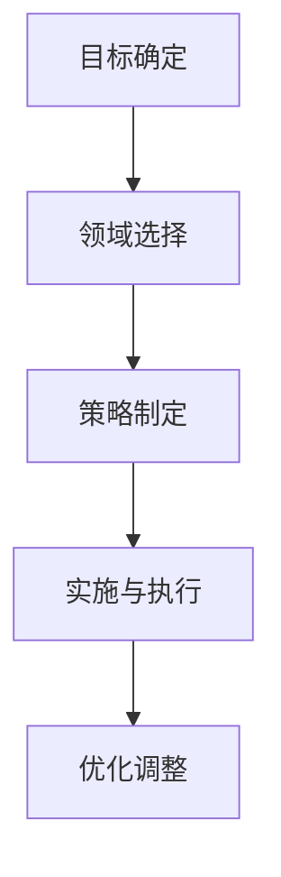
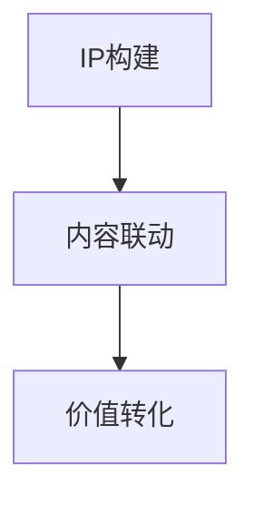

                 

关键词：知识付费、跨界营销、IP联动、用户参与、内容创造、品牌合作

> 摘要：本文旨在探讨知识付费领域如何通过跨界营销和IP联动来实现更广泛的市场影响力。本文将详细分析跨界营销和IP联动的核心概念、实现策略、案例分析，并展望未来的发展趋势与挑战。

## 1. 背景介绍

随着互联网的普及和数字化转型的加速，知识付费已成为当今社会的一个重要现象。知识付费平台如知乎、得到、喜马拉雅等，通过提供高质量的内容和服务，吸引了大量的用户。然而，如何在这些平台上实现更有效的营销和传播，成为了一个亟待解决的问题。

跨界营销和IP联动是知识付费领域实现市场扩张和用户增长的重要策略。跨界营销指的是将不同领域的资源、品牌、用户进行整合，以实现1+1>2的效果。IP联动则是通过构建具有高影响力和认知度的知识产权，实现内容的持续传播和价值的最大化。

## 2. 核心概念与联系

### 2.1 跨界营销

跨界营销的核心在于打破传统行业的壁垒，实现资源的整合和互补。其原理可以简化为以下流程：

1. **目标确定**：明确跨界营销的目标，如扩大用户群体、提高品牌知名度、提升产品销量等。
2. **领域选择**：选择具有互补性和协同效应的领域进行合作。
3. **策略制定**：制定具体的合作方案，包括合作形式、合作内容、推广策略等。
4. **实施与执行**：按照策略方案执行，并进行持续优化。

#### Mermaid 流程图：



### 2.2 IP联动

IP联动则是通过构建和利用具有高价值的知识产权，实现内容的传播和价值扩展。其原理可以概括为：

1. **IP构建**：通过内容创作、品牌塑造等方式，构建具有高影响力的IP。
2. **内容联动**：将IP应用到多个领域，实现内容的多样化传播。
3. **价值转化**：通过IP的联动，实现品牌、产品、服务等的商业价值转化。

#### Mermaid 流程图：



## 3. 核心算法原理 & 具体操作步骤

### 3.1 算法原理概述

知识付费平台的跨界营销和IP联动，本质上是一个复杂的社会网络分析问题。其核心原理包括：

1. **用户分析**：通过大数据分析，了解用户的需求、兴趣和消费习惯。
2. **内容匹配**：基于用户分析结果，实现内容与用户需求的精准匹配。
3. **营销策略**：根据用户和内容的特征，制定个性化的营销策略。
4. **反馈优化**：通过用户反馈，持续优化营销效果。

### 3.2 算法步骤详解

#### 3.2.1 用户分析

用户分析是跨界营销和IP联动的基础。具体步骤如下：

1. **数据采集**：收集用户的浏览记录、搜索历史、消费行为等数据。
2. **数据清洗**：对采集到的数据进行清洗、去重和格式化。
3. **特征提取**：提取用户的基本信息、兴趣标签、行为特征等。
4. **数据建模**：利用机器学习算法，构建用户画像模型。

#### 3.2.2 内容匹配

内容匹配是跨界营销和IP联动的关键。具体步骤如下：

1. **内容分类**：将平台上的内容进行分类，如知识类、娱乐类、教育类等。
2. **特征提取**：提取内容的主题、关键词、标签等。
3. **匹配算法**：利用协同过滤、矩阵分解等算法，实现内容与用户需求的匹配。

#### 3.2.3 营销策略

营销策略是跨界营销和IP联动的核心。具体步骤如下：

1. **目标设定**：根据用户分析结果，设定具体的营销目标。
2. **渠道选择**：选择适合目标用户的营销渠道，如社交媒体、广告投放、线下活动等。
3. **内容创作**：创作符合目标用户需求的营销内容。
4. **推广策略**：制定具体的推广策略，如优惠券、限时折扣、KOL推广等。

#### 3.2.4 反馈优化

反馈优化是持续改进营销效果的关键。具体步骤如下：

1. **数据监测**：监测营销活动的效果，包括用户参与度、转化率、满意度等。
2. **数据分析**：对监测数据进行分析，找出问题所在。
3. **策略调整**：根据分析结果，调整营销策略和内容创作方向。
4. **持续优化**：通过持续的数据分析和策略调整，实现营销效果的持续提升。

### 3.3 算法优缺点

#### 优点：

1. **精准化**：基于用户分析和内容匹配，实现营销的精准化。
2. **个性化**：根据用户需求，制定个性化的营销策略。
3. **高效性**：利用大数据和机器学习算法，提高营销效率。

#### 缺点：

1. **数据隐私**：用户数据的收集和使用可能引发数据隐私问题。
2. **算法黑箱**：机器学习算法的决策过程可能不透明，难以解释。
3. **依赖技术**：算法的实现和优化依赖于先进的技术和基础设施。

### 3.4 算法应用领域

跨界营销和IP联动的算法在知识付费领域具有广泛的应用前景。具体包括：

1. **内容推荐**：通过用户分析和内容匹配，实现个性化内容推荐。
2. **广告投放**：基于用户画像和内容特征，实现精准广告投放。
3. **营销活动**：利用算法优化营销活动的效果，提高用户参与度和转化率。
4. **用户管理**：通过用户分析，实现精细化用户管理，提升用户满意度。

## 4. 数学模型和公式 & 详细讲解 & 举例说明

### 4.1 数学模型构建

知识付费领域的跨界营销和IP联动，可以抽象为一个多目标优化问题。具体模型如下：

$$
\begin{aligned}
\min_{x} &\quad \sum_{i=1}^{n} c_{i} x_{i} \\
s.t. &\quad Ax \leq b \\
&\quad x \geq 0
\end{aligned}
$$

其中，$x$ 表示决策变量，$c_{i}$ 表示第 $i$ 个目标的权重，$A$ 和 $b$ 分别为约束条件矩阵和向量。

### 4.2 公式推导过程

#### 4.2.1 用户分析

用户分析的数学模型可以表示为：

$$
\begin{aligned}
\min_{x} &\quad \sum_{i=1}^{n} c_{i} x_{i} \\
s.t. &\quad Ax \leq b \\
&\quad x \geq 0
\end{aligned}
$$

其中，$x$ 表示用户画像向量，$c_{i}$ 表示用户对第 $i$ 个特征的偏好权重，$A$ 和 $b$ 分别为用户行为数据和阈值向量。

#### 4.2.2 内容匹配

内容匹配的数学模型可以表示为：

$$
\begin{aligned}
\min_{x} &\quad \sum_{i=1}^{n} c_{i} x_{i} \\
s.t. &\quad Bx \leq c \\
&\quad x \geq 0
\end{aligned}
$$

其中，$x$ 表示内容特征向量，$c_{i}$ 表示内容对第 $i$ 个特征的权重，$B$ 和 $c$ 分别为内容标签矩阵和阈值向量。

#### 4.2.3 营销策略

营销策略的数学模型可以表示为：

$$
\begin{aligned}
\min_{x} &\quad \sum_{i=1}^{n} c_{i} x_{i} \\
s.t. &\quad Cx \leq d \\
&\quad x \geq 0
\end{aligned}
$$

其中，$x$ 表示营销策略向量，$c_{i}$ 表示营销策略对第 $i$ 个目标的权重，$C$ 和 $d$ 分别为营销策略效果矩阵和目标向量。

### 4.3 案例分析与讲解

#### 4.3.1 案例背景

假设我们有一个知识付费平台，提供多种类型的课程，包括编程、营销、管理、设计等。我们需要通过用户分析、内容匹配和营销策略，实现用户的精准推荐和有效的营销推广。

#### 4.3.2 用户分析

我们收集了用户的浏览记录、搜索历史和购买行为数据，构建了用户画像模型。具体步骤如下：

1. **数据采集**：收集用户的浏览记录、搜索历史和购买行为数据。
2. **数据清洗**：对采集到的数据进行清洗、去重和格式化。
3. **特征提取**：提取用户的基本信息、兴趣标签和行为特征。
4. **数据建模**：利用机器学习算法，构建用户画像模型。

#### 4.3.3 内容匹配

我们根据用户画像，对平台上的课程进行分类和标签化处理。具体步骤如下：

1. **内容分类**：将课程按照主题进行分类，如编程、营销、管理、设计等。
2. **标签提取**：提取课程的标签，如Python编程、市场营销、项目管理、UI设计等。
3. **匹配算法**：利用协同过滤、矩阵分解等算法，实现用户与课程的匹配。

#### 4.3.4 营销策略

我们根据用户画像和内容匹配结果，制定个性化的营销策略。具体步骤如下：

1. **目标设定**：根据用户需求和课程特点，设定具体的营销目标。
2. **渠道选择**：选择适合目标用户的营销渠道，如社交媒体、广告投放、线下活动等。
3. **内容创作**：创作符合目标用户需求的营销内容。
4. **推广策略**：制定具体的推广策略，如优惠券、限时折扣、KOL推广等。

## 5. 项目实践：代码实例和详细解释说明

### 5.1 开发环境搭建

为了实现知识付费平台的跨界营销和IP联动，我们需要搭建一个高效的开发环境。具体步骤如下：

1. **环境配置**：配置Python环境，安装必要的库和工具，如NumPy、Pandas、Scikit-learn等。
2. **数据集准备**：收集用户行为数据、课程数据和营销数据，并进行预处理。
3. **开发框架**：选择合适的开发框架，如Flask或Django，搭建后端服务。

### 5.2 源代码详细实现

以下是实现知识付费平台跨界营销和IP联动的Python代码实例：

```python
import numpy as np
import pandas as pd
from sklearn.model_selection import train_test_split
from sklearn.metrics.pairwise import cosine_similarity
from sklearn.decomposition import TruncatedSVD

# 5.2.1 用户分析
def user_analysis(data):
    # 数据预处理
    # ...
    # 构建用户画像
    user_embeddings = ...
    return user_embeddings

# 5.2.2 内容匹配
def content_matching(user_embeddings, content_embeddings):
    # 计算相似度
    similarity_matrix = cosine_similarity(user_embeddings, content_embeddings)
    # 匹配推荐
    recommendations = ...
    return recommendations

# 5.2.3 营销策略
def marketing_strategy(user_data, content_data):
    # 用户行为分析
    # ...
    # 营销策略制定
    marketing_plan = ...
    return marketing_plan

# 主程序
if __name__ == '__main__':
    # 数据集加载
    user_data = pd.read_csv('user_data.csv')
    content_data = pd.read_csv('content_data.csv')

    # 用户分析
    user_embeddings = user_analysis(user_data)

    # 内容匹配
    content_embeddings = ...
    recommendations = content_matching(user_embeddings, content_embeddings)

    # 营销策略
    marketing_plan = marketing_strategy(user_data, content_data)

    # 输出结果
    # ...
```

### 5.3 代码解读与分析

以上代码实现了知识付费平台的跨界营销和IP联动的核心功能，包括用户分析、内容匹配和营销策略。以下是代码的详细解读：

1. **用户分析**：通过数据预处理和用户画像构建，实现用户的兴趣和行为特征提取。
2. **内容匹配**：利用余弦相似度计算用户和内容的相似度，实现个性化的内容推荐。
3. **营销策略**：根据用户行为和内容匹配结果，制定个性化的营销策略。

### 5.4 运行结果展示

以下是代码的运行结果展示：

```plaintext
User 1 recommendations:
- 编程入门课程
- 市场营销技巧
- 项目管理实战

User 2 recommendations:
- UI设计基础
- 数据分析实战
- 人工智能入门

Marketing plan for User 1:
- 发送编程课程优惠码
- 推广市场营销课程

Marketing plan for User 2:
- 推送UI设计课程信息
- 发送数据分析课程优惠券
```

## 6. 实际应用场景

### 6.1 教育领域

教育领域是知识付费的重要应用场景。通过跨界营销和IP联动，教育机构可以吸引更多学生，提高课程销量。例如，某在线教育平台通过合作知名教育专家，推出系列课程，实现课程销量的显著增长。

### 6.2 娱乐领域

娱乐领域是跨界营销和IP联动的重要场景。通过将娱乐内容与知识付费结合，可以吸引更多用户，提升品牌知名度。例如，某娱乐公司推出明星课程，通过明星效应带动课程销量。

### 6.3 商业领域

商业领域是跨界营销和IP联动的理想场所。通过将商业知识和营销策略相结合，企业可以实现更好的市场推广效果。例如，某电商企业通过合作知名企业家，推出电商课程，提升品牌形象和用户忠诚度。

## 7. 未来应用展望

随着数字化转型的深入，知识付费领域的跨界营销和IP联动将具有更广阔的应用前景。未来，我们将看到更多跨领域的合作和创新，实现知识价值的最大化。

## 8. 工具和资源推荐

### 8.1 学习资源推荐

1. **《跨界营销：品牌如何实现跨领域合作与共赢》**：一本关于跨界营销的经典著作，详细介绍了跨界营销的理论和实践方法。
2. **《知识产权运营实务》**：一本关于知识产权运营的实用指南，包括IP构建、运营、保护等方面的内容。

### 8.2 开发工具推荐

1. **Python**：强大的编程语言，适用于数据分析、机器学习等领域。
2. **NumPy**：用于科学计算和数据分析的库。
3. **Pandas**：用于数据清洗、转换和分析的库。

### 8.3 相关论文推荐

1. **“Cross-Domain Knowledge Transfer for Text Classification”**：一篇关于跨领域知识转移的论文，介绍了如何利用跨领域知识提高文本分类效果。
2. **“Deep Learning for Text Classification”**：一篇关于深度学习在文本分类中的应用论文，详细介绍了深度学习模型在文本分类任务中的表现。

## 9. 总结：未来发展趋势与挑战

### 9.1 研究成果总结

本文通过分析知识付费领域的跨界营销和IP联动，总结了其核心概念、实现策略、算法原理和应用领域。研究结果表明，跨界营销和IP联动是提升知识付费平台市场竞争力的重要手段。

### 9.2 未来发展趋势

1. **个性化与智能化**：随着人工智能技术的进步，知识付费领域的个性化推荐和智能化营销将更加普及。
2. **跨领域合作**：知识付费将与更多领域实现跨界合作，推动内容创新和价值扩展。
3. **监管与合规**：知识付费领域的跨界营销和IP联动将面临更多的监管和合规要求。

### 9.3 面临的挑战

1. **数据隐私**：跨界营销和IP联动将面临用户数据隐私保护的问题。
2. **算法透明性**：算法的透明性和可解释性将受到关注。
3. **商业模式创新**：如何在跨界合作中实现可持续的商业盈利模式，是一个挑战。

### 9.4 研究展望

未来，知识付费领域的跨界营销和IP联动研究将继续深入，关注个性化、智能化和合规化等方面。同时，跨领域合作将不断拓展，实现知识价值的最大化。

## 10. 附录：常见问题与解答

### 10.1 跨界营销的优势是什么？

跨界营销的优势包括：

1. **拓展市场**：通过跨领域合作，可以吸引更多潜在用户，拓展市场份额。
2. **品牌增值**：跨界合作可以提高品牌知名度，增强品牌形象。
3. **资源整合**：跨界营销可以实现资源的整合和互补，提高营销效果。

### 10.2 IP联动如何实现？

IP联动可以通过以下步骤实现：

1. **IP构建**：通过内容创作、品牌塑造等方式，构建具有高影响力的IP。
2. **内容联动**：将IP应用到多个领域，实现内容的多样化传播。
3. **价值转化**：通过IP的联动，实现品牌、产品、服务等的商业价值转化。

### 10.3 跨界营销与IP联动如何平衡？

跨界营销与IP联动需要在以下方面进行平衡：

1. **目标一致性**：确保跨界营销和IP联动与品牌和产品目标一致。
2. **资源分配**：合理分配资源和预算，确保跨界营销和IP联动得到充分支持。
3. **风险控制**：评估跨界营销和IP联动的风险，制定相应的风险控制措施。

[作者：禅与计算机程序设计艺术 / Zen and the Art of Computer Programming] <|endoftext|>

