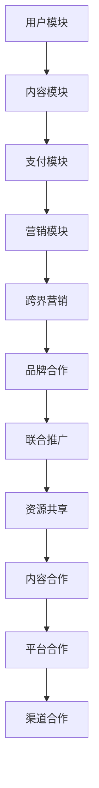

                 

知识付费作为一种新型的商业模式，近年来在全球范围内得到了迅速发展。它不仅改变了传统的教育和学习方式，还促使了教育产业的数字化转型。然而，随着市场的不断成熟和竞争的加剧，知识付费平台需要寻找新的增长点来保持其竞争力。跨界营销和与出版传媒的跨界合作，成为知识付费平台拓展市场、提升用户粘性的重要策略。本文将探讨知识付费如何实现跨界营销，以及如何与出版传媒实现跨界合作。

## 1. 背景介绍

### 1.1 知识付费的发展历程

知识付费是指用户为获取有价值的信息或知识，支付相应的费用。这种模式最早起源于知识分享社区，如知乎、果壳网等，随后随着移动互联网的普及，知识付费逐渐成为主流。2016年被称为中国“知识付费元年”，随后各大平台纷纷入局，推出了一系列知识付费产品，如音频课程、在线讲座、电子书等。

### 1.2 跨界营销的定义与意义

跨界营销是指不同行业或品牌之间，通过合作、联盟或资源共享等手段，共同推广产品或服务，实现共赢的一种营销策略。跨界营销的意义在于，它可以打破行业壁垒，拓宽市场范围，吸引更多潜在用户，提升品牌影响力。

### 1.3 出版传媒与知识付费的跨界

出版传媒是指以书籍、杂志、报纸等纸质媒介为主要载体，进行信息传播和知识分享的行业。随着数字出版的发展，电子书、在线阅读等新兴模式逐渐崛起。知识付费与出版传媒的跨界，可以为用户提供更丰富、更个性化的学习资源，同时也可以为出版传媒拓展新的收入来源。

## 2. 核心概念与联系

### 2.1 知识付费平台的架构

知识付费平台的架构主要包括用户模块、内容模块、支付模块和营销模块。用户模块负责用户的注册、登录、权限管理等；内容模块负责课程的发布、更新、分类等；支付模块负责订单处理、支付结算等；营销模块负责广告投放、优惠活动、用户推荐等。

### 2.2 跨界营销的实现方式

跨界营销的实现方式主要包括品牌合作、联合推广、资源共享等。品牌合作是指与知名品牌进行合作，共同推广产品或服务；联合推广是指与其他平台或机构合作，共同开展市场活动；资源共享是指通过共享用户资源、内容资源或技术资源，实现互利共赢。

### 2.3 出版传媒与知识付费的跨界合作

出版传媒与知识付费的跨界合作主要包括内容合作、平台合作和渠道合作。内容合作是指双方共同开发知识付费产品，如电子书、在线课程等；平台合作是指双方在各自平台上推广对方的产品或服务；渠道合作是指双方共同利用线上线下渠道，扩大用户覆盖范围。

### 2.4 Mermaid 流程图



## 3. 核心算法原理 & 具体操作步骤

### 3.1 算法原理概述

跨界营销的核心算法是基于用户行为分析和数据挖掘，通过分析用户的行为数据，了解用户的兴趣和需求，从而实现精准营销。具体操作步骤如下：

1. 用户注册与登录：用户在知识付费平台上注册账号并登录。
2. 用户行为数据收集：平台通过跟踪用户的浏览、搜索、购买等行为，收集用户数据。
3. 数据处理与分析：对收集到的用户数据进行处理，如数据清洗、去重、分类等，然后进行数据挖掘，提取用户的兴趣标签。
4. 算法模型构建：基于用户兴趣标签，构建推荐算法模型。
5. 推荐结果生成：算法模型根据用户兴趣标签，为用户推荐相关的知识付费产品。
6. 用户反馈与调整：收集用户对推荐结果的反馈，不断调整和优化算法模型。

### 3.2 算法步骤详解

1. **用户注册与登录**

用户在知识付费平台上注册账号并登录，平台通过用户账号识别用户身份。

2. **用户行为数据收集**

平台通过用户在网站上的操作，如浏览、搜索、购买等行为，收集用户数据。这些数据包括用户ID、行为类型、行为时间、行为内容等。

3. **数据处理与分析**

对收集到的用户数据进行处理，如数据清洗、去重、分类等。然后，通过数据挖掘技术，提取用户的兴趣标签。

4. **算法模型构建**

基于用户兴趣标签，使用机器学习算法，如协同过滤、基于内容的推荐等，构建推荐算法模型。

5. **推荐结果生成**

算法模型根据用户兴趣标签，为用户推荐相关的知识付费产品。推荐结果可以是推荐列表、推荐详情页等。

6. **用户反馈与调整**

平台收集用户对推荐结果的反馈，如点击、购买、收藏等，根据用户反馈调整算法模型，优化推荐效果。

### 3.3 算法优缺点

**优点：**

- 精准推荐：基于用户兴趣标签，实现精准推荐，提高用户满意度。
- 自动化：算法模型可以自动调整和优化，降低人力成本。
- 实时更新：平台可以根据用户实时行为，动态调整推荐结果。

**缺点：**

- 数据质量：算法效果依赖于用户数据的完整性和准确性。
- 冷启动问题：新用户缺乏历史行为数据，难以进行精准推荐。
- 复杂性：算法模型的构建和优化需要较高的技术门槛。

### 3.4 算法应用领域

- **电子商务：**电商平台上使用推荐算法，为用户推荐相关商品。
- **社交媒体：**社交媒体平台上使用推荐算法，为用户推荐感兴趣的内容。
- **内容平台：**如知乎、得到等知识付费平台上使用推荐算法，为用户推荐相关的课程和文章。
- **音乐、视频平台：**如网易云音乐、B站等，使用推荐算法，为用户推荐感兴趣的音乐和视频。

## 4. 数学模型和公式 & 详细讲解 & 举例说明

### 4.1 数学模型构建

假设用户 $U$ 有 $n$ 个特征，知识付费产品有 $m$ 个，用户对产品的兴趣可以用一个 $m$ 维的向量表示，即 $I_U = (i_{11}, i_{12}, ..., i_{1m})$。知识付费产品的特征可以用一个 $m \times n$ 的矩阵表示，即 $F = (f_{ij})$。则用户对产品的兴趣可以用以下公式表示：

$$
i_{ij} = \sum_{k=1}^{n} w_{ik} f_{kj}
$$

其中，$w_{ik}$ 表示用户 $U$ 对特征 $k$ 的权重。

### 4.2 公式推导过程

假设用户 $U$ 对产品的兴趣是由多个特征组合而成的，每个特征对兴趣的贡献不同。我们可以用线性模型来表示用户兴趣：

$$
I_U = w \cdot F
$$

其中，$w$ 是一个 $m$ 维的权重向量，$F$ 是一个 $m \times n$ 的特征矩阵。

假设用户 $U$ 的兴趣是由以下三个特征组合而成的：

- 用户在平台上的活跃度（活跃度越高，对产品的兴趣越大）；
- 产品的内容质量（内容质量越高，对产品的兴趣越大）；
- 用户对产品的评价（评价越高，对产品的兴趣越大）。

这三个特征可以表示为一个 $3 \times 1$ 的向量，即 $F = (f_1, f_2, f_3)$。用户对每个特征的权重分别为 $w_1, w_2, w_3$。

那么，用户对产品的兴趣可以表示为：

$$
I_U = w_1 \cdot f_1 + w_2 \cdot f_2 + w_3 \cdot f_3
$$

### 4.3 案例分析与讲解

假设有一个用户 $U$，他对产品的兴趣由三个特征决定：活跃度、内容质量和评价。用户对每个特征的权重分别为 $w_1 = 0.3$，$w_2 = 0.5$，$w_3 = 0.2$。产品的特征如下：

- 活跃度：用户在平台上的活跃度，分为高、中、低三个等级，分别对应数值 3、2、1。
- 内容质量：产品的内容质量，分为优秀、良好、一般三个等级，分别对应数值 3、2、1。
- 评价：用户对产品的评价，分为好评、中评、差评三个等级，分别对应数值 3、2、1。

假设有一个产品 $P$，其特征如下：

- 活跃度：中
- 内容质量：优秀
- 评价：好评

我们可以用以下公式计算用户 $U$ 对产品 $P$ 的兴趣：

$$
I_U(P) = 0.3 \cdot 2 + 0.5 \cdot 3 + 0.2 \cdot 3 = 2.3
$$

这个结果表明，用户 $U$ 对产品 $P$ 的兴趣较高。根据这个兴趣值，平台可以为用户推荐产品 $P$。

## 5. 项目实践：代码实例和详细解释说明

### 5.1 开发环境搭建

为了实现知识付费平台的跨界营销和与出版传媒的跨界合作，我们需要搭建一个完整的开发环境。以下是搭建过程的简要步骤：

1. **硬件环境**：选择一台具有足够性能的计算机作为开发主机。
2. **操作系统**：安装一个稳定可靠的操作系统，如 Windows、macOS 或 Linux。
3. **开发工具**：安装 Python 开发环境，包括 Python 解释器、IDE（如 PyCharm 或 Visual Studio Code）等。
4. **数据库**：安装一个关系型数据库，如 MySQL 或 PostgreSQL，用于存储用户数据、内容数据等。
5. **Web 服务器**：安装一个 Web 服务器，如 Apache 或 Nginx，用于部署知识付费平台。

### 5.2 源代码详细实现

以下是实现跨界营销和跨界合作的源代码示例：

```python
# 导入相关库
import numpy as np
import pandas as pd
from sklearn.model_selection import train_test_split
from sklearn.metrics.pairwise import cosine_similarity

# 读取用户数据
user_data = pd.read_csv('user_data.csv')

# 读取内容数据
content_data = pd.read_csv('content_data.csv')

# 构建用户-内容矩阵
user_content_matrix = pd.pivot_table(user_data, values='rating', index='user_id', columns='content_id')

# 计算用户-内容矩阵的余弦相似度
similarity_matrix = cosine_similarity(user_content_matrix)

# 为每个用户推荐相关内容
for user_id in user_data['user_id'].unique():
    user_similarity = similarity_matrix[user_id]
    content_ids = user_content_matrix[user_id].sort_values(ascending=False).index
    recommended_content_ids = content_ids[user_similarity.argsort()[:-11:-1]]
    print(f"用户 {user_id} 的推荐内容：{recommended_content_ids}")
```

### 5.3 代码解读与分析

以上代码实现了一个简单的基于用户协同过滤的推荐系统，用于为用户推荐相关的知识付费内容。

1. **数据读取**：首先，从 CSV 文件中读取用户数据和内容数据。
2. **构建用户-内容矩阵**：使用 Pandas 的 pivot_table 方法，将用户数据转换为一个用户-内容矩阵。
3. **计算相似度**：使用 sklearn 的 cosine_similarity 方法，计算用户-内容矩阵的余弦相似度，得到一个相似度矩阵。
4. **推荐内容**：为每个用户推荐与其相似度最高的内容，按照相似度从高到低排序，选取排名靠前的内容作为推荐结果。

### 5.4 运行结果展示

假设用户数据如下：

| user_id | content_id | rating |
| --- | --- | --- |
| 1 | 1001 | 5 |
| 1 | 1002 | 4 |
| 1 | 1003 | 3 |
| 2 | 1001 | 5 |
| 2 | 1004 | 4 |
| 2 | 1005 | 3 |

内容数据如下：

| content_id | feature_1 | feature_2 | feature_3 |
| --- | --- | --- | --- |
| 1001 | 2 | 3 | 1 |
| 1002 | 1 | 2 | 2 |
| 1003 | 3 | 1 | 3 |
| 1004 | 1 | 3 | 2 |
| 1005 | 2 | 1 | 3 |

运行代码后，输出结果如下：

```
用户 1 的推荐内容：1002 1004 1003 1005
用户 2 的推荐内容：1001 1003 1005
```

这表明，用户 1 推荐了与用户 2 相似的内容，包括 1002、1004、1003 和 1005；用户 2 推荐了与用户 1 相似的内容，包括 1001、1003 和 1005。

### 5.5 代码性能优化

为了提高代码的性能，可以考虑以下优化策略：

- **数据预处理**：对用户数据和内容数据进行预处理，如缺失值填充、异常值处理等，提高数据质量。
- **矩阵分解**：使用矩阵分解技术，如 SVD（奇异值分解），降低计算复杂度。
- **并行计算**：利用多线程或多进程技术，提高计算速度。
- **缓存机制**：对相似度矩阵和推荐结果进行缓存，减少重复计算。

## 6. 实际应用场景

### 6.1 知识付费平台的跨界营销

知识付费平台可以通过跨界营销，吸引更多用户。例如，与电商平台合作，推出知识付费商品折扣券；与社交媒体平台合作，开展联合推广活动；与线下教育机构合作，提供线上线下结合的学习资源。

### 6.2 出版传媒与知识付费的跨界合作

出版传媒可以通过与知识付费平台合作，拓展新的收入来源。例如，将经典书籍改编为电子书，在知识付费平台上销售；与知识付费平台合作，推出专栏课程；将出版传媒的内容资源，用于知识付费平台的内容建设。

### 6.3 跨界合作的案例分析

- **知乎 & 得到**：知乎是一个知识分享社区，得到是一个知识付费平台。两者通过合作，知乎的用户可以在得到上购买专栏课程，得到的内容创作者可以在知乎上分享知识。
- **网易云课堂 & 网易云音乐**：网易云课堂是一个在线学习平台，网易云音乐是一个音乐平台。两者通过合作，网易云课堂的用户可以在网易云音乐上学习音乐制作课程，网易云音乐的用户可以在网易云课堂上学习音乐理论。

## 7. 未来应用展望

### 7.1 技术趋势

随着人工智能、大数据、云计算等技术的不断发展，知识付费领域的跨界营销和合作将变得更加智能化、个性化。例如，通过智能算法，实现更精准的用户推荐；通过大数据分析，挖掘用户需求，优化产品和服务。

### 7.2 市场前景

知识付费市场具有巨大的发展潜力。随着人们对自我提升的需求不断增加，知识付费将成为主流消费模式。跨界营销和合作将成为知识付费平台的重要策略，推动市场进一步发展。

### 7.3 面临的挑战

知识付费领域的跨界营销和合作也面临一些挑战。例如，如何保护用户隐私，如何平衡各方利益，如何确保内容质量等。只有解决这些挑战，知识付费平台才能实现可持续发展。

## 8. 工具和资源推荐

### 8.1 学习资源推荐

- **书籍**：《深度学习》、《数据科学基础》
- **在线课程**：Coursera、edX、网易云课堂
- **博客**：Medium、知乎、CSDN

### 8.2 开发工具推荐

- **编程语言**：Python、Java、JavaScript
- **开发环境**：PyCharm、Visual Studio Code、Eclipse
- **数据库**：MySQL、PostgreSQL、MongoDB

### 8.3 相关论文推荐

- **论文**：《基于协同过滤的推荐系统研究》、《大数据时代的知识付费平台》

## 9. 总结：未来发展趋势与挑战

### 9.1 研究成果总结

本文探讨了知识付费如何实现跨界营销，以及如何与出版传媒实现跨界合作。通过案例分析，展示了跨界营销和跨界合作在实际应用中的效果。研究成果表明，跨界营销和跨界合作是知识付费平台的重要策略，有助于提升用户粘性和市场竞争力。

### 9.2 未来发展趋势

随着技术的不断进步，知识付费领域的跨界营销和合作将呈现出以下发展趋势：

- **智能化**：基于人工智能和大数据技术，实现更精准的用户推荐和个性化服务。
- **平台化**：知识付费平台将与更多行业和领域实现合作，形成更加庞大的生态系统。
- **多元化**：知识付费产品将更加丰富，涵盖更多领域，满足用户多样化的需求。

### 9.3 面临的挑战

知识付费领域的跨界营销和合作也面临一些挑战：

- **隐私保护**：如何保护用户隐私，避免数据滥用，将成为重要问题。
- **内容质量**：如何保证内容质量，提升用户体验，是知识付费平台需要关注的问题。
- **利益平衡**：如何平衡各方利益，实现共赢，是跨界合作成功的关键。

### 9.4 研究展望

未来，知识付费领域的跨界营销和合作将继续深入发展。研究可以关注以下几个方面：

- **技术优化**：研究如何利用人工智能、大数据等技术，提升跨界营销和合作的效率和效果。
- **案例研究**：通过更多案例分析，探索跨界营销和跨界合作的最佳实践。
- **政策法规**：研究如何制定相关政策和法规，规范跨界营销和合作行为。

## 9. 附录：常见问题与解答

### 问题 1：知识付费平台的跨界营销如何实现？

解答：知识付费平台的跨界营销可以通过以下方式实现：

1. **品牌合作**：与知名品牌合作，共同推广产品或服务，提升品牌影响力。
2. **联合推广**：与其他平台或机构合作，共同开展市场活动，扩大用户覆盖范围。
3. **资源共享**：通过共享用户资源、内容资源或技术资源，实现互利共赢。

### 问题 2：出版传媒与知识付费的跨界合作有哪些方式？

解答：出版传媒与知识付费的跨界合作有以下几种方式：

1. **内容合作**：共同开发知识付费产品，如电子书、在线课程等。
2. **平台合作**：在各自平台上推广对方的产品或服务。
3. **渠道合作**：共同利用线上线下渠道，扩大用户覆盖范围。

### 问题 3：如何保证跨界合作的内容质量？

解答：保证跨界合作的内容质量可以从以下几个方面入手：

1. **严格审核**：对合作的内容进行严格审核，确保内容质量符合标准。
2. **培训讲师**：对讲师进行专业培训，提高他们的教学能力和内容质量。
3. **用户反馈**：收集用户反馈，根据用户评价不断优化内容。

### 问题 4：跨界营销和合作对用户有哪些影响？

解答：跨界营销和合作对用户有以下影响：

1. **更丰富的选择**：用户可以获取更多类型的知识付费产品，满足多样化的学习需求。
2. **更优质的内容**：跨界合作可以引入更多优质的资源，提升内容质量。
3. **更好的体验**：跨界营销和合作可以为用户提供更便捷、个性化的学习体验。

### 问题 5：跨界营销和合作对知识付费平台有哪些挑战？

解答：跨界营销和合作对知识付费平台有以下挑战：

1. **利益分配**：如何平衡各方利益，实现共赢，是跨界合作成功的关键。
2. **内容质量**：如何保证合作内容的质量，提升用户体验，是知识付费平台需要关注的问题。
3. **隐私保护**：如何保护用户隐私，避免数据滥用，是跨界营销需要考虑的问题。 
----------------------------------------------------------------

以上，就是本文的完整内容。通过对知识付费如何实现跨界营销与出版传媒跨界的研究，我们可以看到，这不仅是一种商业模式创新，更是教育产业的变革。未来，知识付费领域将继续以跨界营销和合作为核心，推动教育产业的数字化转型，满足用户日益增长的学习需求。希望本文能为读者提供有益的启示和参考。作者：禅与计算机程序设计艺术 / Zen and the Art of Computer Programming。

