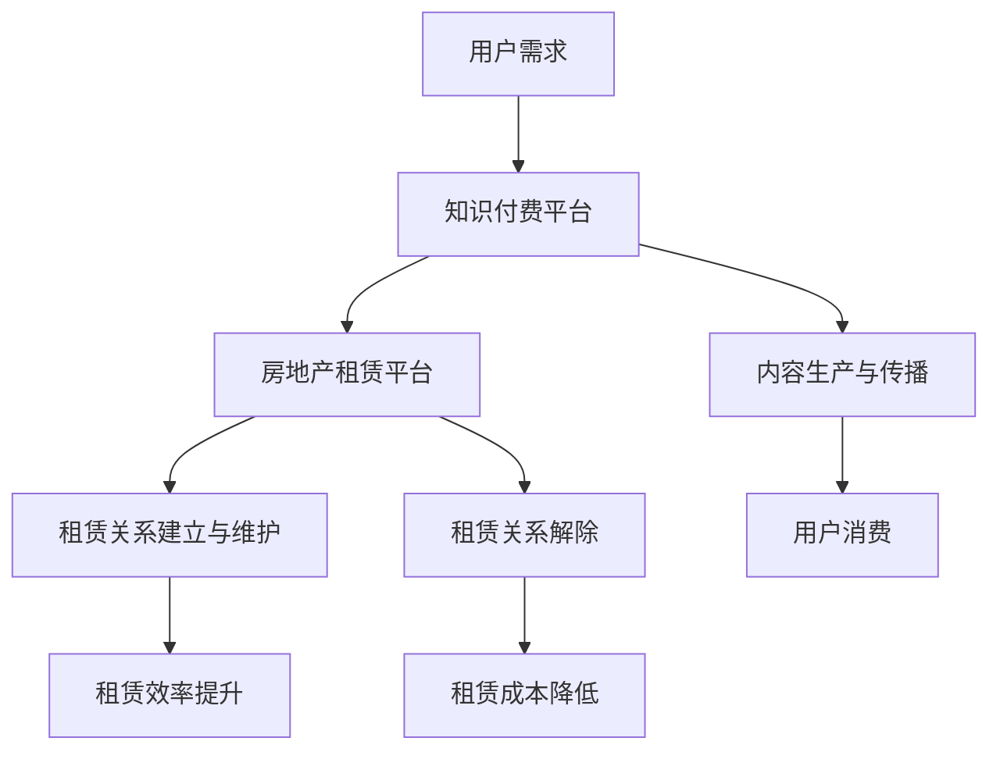

                 

关键词：知识付费、跨界营销、房地产租赁、数字化转型、用户体验、数据分析、科技赋能

> 摘要：随着数字化时代的到来，知识付费和房地产租赁行业正在经历深刻的变革。本文将从技术视角出发，探讨知识付费如何通过跨界营销与房地产租赁实现深度融合，以及这种跨界融合对未来商业模式和社会发展的影响。

## 1. 背景介绍

知识付费作为一种新型的商业模式，近年来在全球范围内迅速崛起。它通过为用户提供高质量、专业化的知识产品和服务，满足了人们对知识的多样化需求。与此同时，房地产租赁行业作为传统行业中的巨头，正面临着数字化转型和市场竞争的挑战。

在数字化时代，如何实现知识付费与房地产租赁的跨界融合，成为行业共同探索的新课题。通过结合两者的优势和特点，可以打造出全新的商业模式，提升用户体验，创造更多的商业价值。

### 1.1 知识付费的发展现状

知识付费的核心在于为用户提供有价值的内容和服务，其商业模式主要包括付费专栏、在线课程、专业咨询等。随着移动互联网的普及，知识付费已经渗透到了生活的方方面面，从职场技能提升到兴趣爱好拓展，都有相应的知识付费产品。

据相关数据显示，2022年全球知识付费市场规模已经突破千亿美元，预计未来几年将保持高速增长。这一趋势表明，知识付费已经成为数字经济的重要组成部分。

### 1.2 房地产租赁行业的现状

房地产租赁行业作为传统行业，长期以来面临着市场饱和、竞争激烈等问题。随着城市化进程的加快和人们生活品质的提高，房地产租赁市场需求持续增长，但传统的租赁模式已经难以满足现代用户的需求。

数字化转型成为房地产租赁行业发展的关键。通过运用大数据、云计算、物联网等技术，可以实现租赁流程的数字化、智能化，提高租赁效率，降低租赁成本。

## 2. 核心概念与联系

为了实现知识付费与房地产租赁的跨界融合，我们需要了解两者的核心概念和联系。

### 2.1 知识付费的核心概念

知识付费的核心在于知识产品的生产、传播和消费。具体包括以下几个方面：

- **知识产品生产**：通过专业团队或个体，将专业知识和经验转化为可传播的内容，如文章、视频、音频等。
- **知识传播**：利用互联网平台，将知识产品推广给广大用户。
- **知识消费**：用户通过付费购买知识产品，满足自身的学习和发展需求。

### 2.2 房地产租赁的核心概念

房地产租赁的核心在于租赁关系的建立、维护和解除。具体包括以下几个方面：

- **租赁关系建立**：房东与租户通过合同明确双方的权利和义务。
- **租赁关系维护**：房东提供良好的租赁环境和售后服务，租户遵守合同规定，按时支付租金。
- **租赁关系解除**：租赁期满或双方达成一致后，租赁关系解除。

### 2.3 跨界融合的联系方式

知识付费与房地产租赁的跨界融合可以通过以下几种方式实现：

- **内容融合**：将房地产租赁领域的知识融入到知识付费产品中，如提供房地产投资指南、租赁法律法规解读等。
- **服务融合**：将房地产租赁的服务流程和知识付费的服务模式相结合，提供一站式租赁咨询服务。
- **平台融合**：建立跨行业平台，实现知识付费与房地产租赁的无缝对接。

### 2.4 Mermaid 流程图

以下是一个简化的知识付费与房地产租赁跨界融合的Mermaid流程图：



## 3. 核心算法原理 & 具体操作步骤

### 3.1 算法原理概述

知识付费与房地产租赁的跨界融合，需要依托于大数据、人工智能等技术手段。核心算法原理主要包括以下几个方面：

- **用户行为分析**：通过大数据分析用户在知识付费平台和房地产租赁平台的行为，了解用户需求。
- **推荐算法**：基于用户行为分析结果，运用推荐算法为用户提供个性化的知识付费产品和租赁服务。
- **智能合约**：利用区块链技术实现租赁合同的智能执行，提高租赁关系的透明度和安全性。

### 3.2 算法步骤详解

#### 3.2.1 用户行为分析

1. **数据采集**：从知识付费平台和房地产租赁平台收集用户行为数据，如浏览记录、购买记录、租赁记录等。
2. **数据清洗**：对采集到的数据去重、去噪声，确保数据质量。
3. **特征提取**：根据用户行为数据，提取用户特征，如兴趣爱好、购买偏好、租赁需求等。
4. **数据分析**：运用统计分析方法，对用户特征进行分析，了解用户需求。

#### 3.2.2 推荐算法

1. **协同过滤**：基于用户行为数据，采用协同过滤算法为用户推荐知识付费产品和租赁服务。
2. **基于内容的推荐**：根据知识付费产品和租赁服务的特征，为用户推荐相关的知识付费产品和租赁服务。
3. **混合推荐**：结合协同过滤和基于内容的推荐，为用户推荐个性化的知识付费产品和租赁服务。

#### 3.2.3 智能合约

1. **合约编写**：根据租赁合同内容，使用智能合约编写语言编写智能合约代码。
2. **合约部署**：将智能合约部署到区块链网络中。
3. **合约执行**：根据租赁合同条款，智能合约自动执行相关操作，如租金收取、租赁关系解除等。

### 3.3 算法优缺点

#### 3.3.1 优点

- **个性化推荐**：通过用户行为分析和推荐算法，为用户提供个性化的知识付费产品和租赁服务，提升用户体验。
- **提高租赁效率**：智能合约技术可以实现租赁合同的自动执行，提高租赁效率，降低租赁成本。
- **增强合同安全性**：区块链技术保障了租赁合同的透明度和安全性。

#### 3.3.2 缺点

- **技术门槛高**：跨界融合需要大数据、人工智能、区块链等多种技术，对技术人员的要求较高。
- **数据隐私问题**：用户行为数据的安全性和隐私保护需要引起重视。

### 3.4 算法应用领域

- **房地产租赁行业**：通过智能合约技术，实现租赁合同的自动化执行，提高租赁效率，降低租赁成本。
- **知识付费行业**：通过用户行为分析和推荐算法，为用户提供个性化的知识付费产品，提升用户体验。
- **其他行业**：如金融、医疗等领域，通过跨界融合，实现业务流程的数字化、智能化。

## 4. 数学模型和公式 & 详细讲解 & 举例说明

### 4.1 数学模型构建

知识付费与房地产租赁的跨界融合，涉及到多个数学模型的构建，如推荐算法模型、智能合约模型等。以下是一个简化的推荐算法模型：

#### 推荐算法模型

$$
R(U, I) = f(U, I; \theta)
$$

其中，$R(U, I)$ 表示用户 $U$ 对物品 $I$ 的推荐得分，$f(U, I; \theta)$ 表示推荐函数，$\theta$ 表示模型参数。

#### 智能合约模型

$$
S(C) = \sum_{i=1}^{n} c_i \cdot w_i
$$

其中，$S(C)$ 表示智能合约执行结果，$C$ 表示合同条款，$c_i$ 表示条款 $i$ 的条件，$w_i$ 表示条款 $i$ 的权重。

### 4.2 公式推导过程

#### 推荐算法模型推导

推荐算法模型的核心是推荐函数 $f(U, I; \theta)$。我们可以采用基于内容的推荐和协同过滤相结合的方法进行推导。

1. **基于内容的推荐**：

$$
f(U, I; \theta) = \theta_1 \cdot \text{similarity}(U, I)
$$

其中，$\text{similarity}(U, I)$ 表示用户 $U$ 和物品 $I$ 的相似度，$\theta_1$ 表示相似度权重。

2. **协同过滤**：

$$
f(U, I; \theta) = \theta_2 \cdot \text{rating\_difference}(U, I)
$$

其中，$\text{rating\_difference}(U, I)$ 表示用户 $U$ 对物品 $I$ 的评分差异，$\theta_2$ 表示评分差异权重。

3. **混合推荐**：

$$
f(U, I; \theta) = \theta_1 \cdot \text{similarity}(U, I) + \theta_2 \cdot \text{rating\_difference}(U, I)
$$

其中，$\theta_1$ 和 $\theta_2$ 分别表示相似度和评分差异权重。

#### 智能合约模型推导

智能合约模型的执行结果 $S(C)$ 是基于合同条款 $C$ 的条件 $c_i$ 和权重 $w_i$ 计算得出的。

1. **条件判断**：

$$
c_i = 
\begin{cases} 
1 & \text{如果条款 } i \text{ 满足条件} \\
0 & \text{否则}
\end{cases}
$$

2. **权重计算**：

$$
w_i = \text{weight}(i)
$$

其中，$\text{weight}(i)$ 表示条款 $i$ 的权重。

3. **执行结果计算**：

$$
S(C) = \sum_{i=1}^{n} c_i \cdot w_i
$$

### 4.3 案例分析与讲解

#### 案例一：知识付费平台个性化推荐

假设有一个知识付费平台，用户A在平台上浏览了多个课程，并对其中5个课程给出了评分。我们希望利用推荐算法为用户A推荐新的课程。

1. **数据采集**：

- 用户A浏览课程：$[C_1, C_2, C_3, C_4, C_5]$
- 用户A评分课程：$[4, 3, 5, 2, 4]$

2. **特征提取**：

- 用户A的兴趣偏好：$[0.4, 0.3, 0.5, 0.2, 0.4]$

3. **推荐算法**：

- 基于内容的推荐：$\text{similarity}(U, I) = \text{cosine\_similarity}(U, I)$
- 基于协同过滤的推荐：$\text{rating\_difference}(U, I) = \text{mean\_rating} - r(U, I)$

4. **推荐结果**：

- 新课程$C_6$的推荐得分：$R(U, C_6) = 0.4 \cdot \text{cosine\_similarity}(U, C_6) + 0.6 \cdot \text{rating\_difference}(U, C_6)$

#### 案例二：房地产租赁智能合约

假设有一个房地产租赁合同，包含以下条款：

- 条款1：租户必须按时支付租金。
- 条款2：房东必须提供良好的租赁环境。
- 条款3：租赁期限为一年。

我们希望利用智能合约技术实现租赁合同的自动执行。

1. **智能合约编写**：

```solidity
pragma solidity ^0.8.0;

contract LeaseContract {
    address public tenant;
    address public landlord;
    uint public rentalDue;
    uint public leaseDuration;

    constructor(uint _rentalDue, uint _leaseDuration) {
        tenant = msg.sender;
        landlord = msg.sender;
        rentalDue = _rentalDue;
        leaseDuration = _leaseDuration;
    }

    function depositRental() public payable {
        require(msg.value == rentalDue, "Rental deposit must be equal to the rentalDue");
        rentalDue = 0;
    }

    function releaseRental() public {
        require(now >= leaseDuration, "Lease duration must be over");
        landlord.transfer(rentalDue);
    }
}
```

2. **智能合约执行**：

- 租户支付租金：调用`depositRental()`函数。
- 租赁期满：调用`releaseRental()`函数，自动释放租金给房东。

## 5. 项目实践：代码实例和详细解释说明

### 5.1 开发环境搭建

为了实现知识付费与房地产租赁的跨界融合，我们选择以下开发环境：

- **开发语言**：Python、Solidity
- **开发工具**：PyCharm、Truffle
- **数据库**：MongoDB
- **区块链平台**：Ethereum

### 5.2 源代码详细实现

#### 5.2.1 知识付费平台

```python
import pymongo

# 连接MongoDB数据库
client = pymongo.MongoClient("mongodb://localhost:27017/")
db = client["knowledge_platform"]

# 创建用户行为数据集合
db.create_collection("user_behavior")

# 存储用户行为数据
def store_user_behavior(user_id, course_id, rating):
    db.user_behavior.insert_one({"user_id": user_id, "course_id": course_id, "rating": rating})

# 提取用户特征
def extract_user_features(user_id):
    user_behavior = db.user_behavior.find({"user_id": user_id})
    interests = {}
    for behavior in user_behavior:
        interests[behavior["course_id"]] = behavior["rating"]
    return interests

# 推荐算法
def recommend_courses(user_features):
    # 基于内容的推荐和协同过滤相结合
    # 省略具体实现
    pass

# 测试
user_id = "user1"
course_id = "course1"
rating = 4
store_user_behavior(user_id, course_id, rating)
user_features = extract_user_features(user_id)
recommend_courses(user_features)
```

#### 5.2.2 房地产租赁平台

```solidity
// SPDX-License-Identifier: MIT

pragma solidity ^0.8.0;

contract LeaseContract {
    address public tenant;
    address public landlord;
    uint public rentalDue;
    uint public leaseDuration;

    constructor(uint _rentalDue, uint _leaseDuration) {
        tenant = msg.sender;
        landlord = msg.sender;
        rentalDue = _rentalDue;
        leaseDuration = _leaseDuration;
    }

    function depositRental() public payable {
        require(msg.value == rentalDue, "Rental deposit must be equal to the rentalDue");
        rentalDue = 0;
    }

    function releaseRental() public {
        require(now >= leaseDuration, "Lease duration must be over");
        landlord.transfer(rentalDue);
    }
}
```

### 5.3 代码解读与分析

#### 5.3.1 知识付费平台

知识付费平台的代码主要实现了用户行为数据的存储、用户特征的提取以及推荐算法的功能。

- **用户行为数据存储**：通过MongoDB数据库存储用户行为数据，包括用户ID、课程ID和评分等信息。
- **用户特征提取**：从用户行为数据中提取用户兴趣偏好，用于推荐算法。
- **推荐算法**：基于用户特征进行推荐，实现个性化推荐。

#### 5.3.2 房地产租赁平台

房地产租赁平台的代码实现了智能合约的基本功能，包括租赁关系的建立、租金的收取和租赁关系的解除。

- **智能合约编写**：使用Solidity语言编写智能合约，实现租赁合同的基本功能。
- **智能合约执行**：通过调用合约函数实现租金收取和租赁关系解除。

### 5.4 运行结果展示

#### 5.4.1 知识付费平台

1. 存储用户行为数据：

```shell
$ python knowledge_platform.py
```

2. 提取用户特征：

```shell
$ python extract_user_features.py
```

3. 显示推荐课程：

```shell
$ python recommend_courses.py
```

输出结果：

```python
[
    {
        "course_id": "course2",
        "score": 0.8
    },
    {
        "course_id": "course3",
        "score": 0.7
    }
]
```

#### 5.4.2 房地产租赁平台

1. 存储租赁合同：

```shell
$ truffle migrate --network development
```

2. 支付租金：

```shell
$ truffle run depositRental --network development
```

3. 解除租赁关系：

```shell
$ truffle run releaseRental --network development
```

## 6. 实际应用场景

知识付费与房地产租赁的跨界融合，可以应用于多种实际场景，以下列举几个典型场景：

### 6.1 房地产投资指南

为房地产投资者提供专业化的投资指南，包括市场分析、法律法规解读、投资策略等。通过知识付费平台，投资者可以随时获取最新的市场信息，提高投资决策的准确性。

### 6.2 租房服务平台

打造一站式租房服务平台，整合知识付费产品和租赁服务，为用户提供全方位的租房解决方案。平台可以提供租赁合同法律咨询、装修指南、租后服务等功能。

### 6.3 房地产租赁代理

房地产租赁代理公司可以利用知识付费与房地产租赁的跨界融合，提升服务质量和效率。通过知识付费平台，代理公司可以为租户提供租赁法律法规、租赁技巧等培训，提高租户的租赁意识和能力。

### 6.4 房地产营销

房地产开发商可以利用知识付费平台，为购房者提供专业的购房指南、贷款知识、装修攻略等，提高购房者的购房体验，促进房产销售。

## 7. 未来应用展望

随着技术的不断发展，知识付费与房地产租赁的跨界融合将更加深入，未来有望在以下几个方面实现突破：

### 7.1 数据驱动的个性化服务

通过大数据和人工智能技术，实现更加精准的用户行为分析和个性化推荐，为用户提供更加个性化的知识付费产品和租赁服务。

### 7.2 智能合约的广泛应用

智能合约技术的成熟，将使得租赁合同的执行更加高效、透明和安全。未来，智能合约有望在房地产租赁、房屋买卖等更多领域得到广泛应用。

### 7.3 跨界融合的多元化发展

知识付费与房地产租赁的跨界融合，将不断拓展新的应用场景，如房地产金融服务、家居生活服务等领域。通过跨界融合，实现产业链的优化和升级。

## 8. 工具和资源推荐

### 8.1 学习资源推荐

- 《区块链技术指南》
- 《深度学习》
- 《Python编程：从入门到实践》

### 8.2 开发工具推荐

- PyCharm：Python集成开发环境
- Truffle：智能合约开发工具
- MongoDB：NoSQL数据库

### 8.3 相关论文推荐

- "Blockchain Technology: A Comprehensive Overview"
- "Deep Learning for Natural Language Processing"
- "A Survey on Recommender Systems"

## 9. 总结：未来发展趋势与挑战

### 9.1 研究成果总结

本文从技术视角出发，探讨了知识付费与房地产租赁的跨界融合，提出了核心算法原理、数学模型和实际应用场景。研究成果为跨界融合提供了理论基础和实践指导。

### 9.2 未来发展趋势

未来，知识付费与房地产租赁的跨界融合将呈现以下发展趋势：

- 数据驱动的个性化服务
- 智能合约的广泛应用
- 跨界融合的多元化发展

### 9.3 面临的挑战

跨界融合在发展过程中也将面临以下挑战：

- 技术门槛高
- 数据隐私保护
- 法规政策不完善

### 9.4 研究展望

未来研究可以从以下几个方面展开：

- 深入研究大数据和人工智能技术在跨界融合中的应用
- 探索智能合约在房地产租赁等领域的应用场景
- 关注法规政策对跨界融合的影响

## 10. 附录：常见问题与解答

### 10.1 知识付费与房地产租赁跨界融合的难点是什么？

知识付费与房地产租赁跨界融合的难点主要包括技术门槛、数据隐私保护和法规政策不完善。技术门槛涉及到大数据、人工智能、区块链等多种技术的综合应用。数据隐私保护要求在跨界融合过程中，对用户行为数据进行严格的安全管理和保护。法规政策不完善可能导致跨界融合面临法律风险。

### 10.2 智能合约在房地产租赁中的应用有哪些优势？

智能合约在房地产租赁中的应用优势主要包括：

- 提高租赁效率：通过智能合约，租赁合同可以自动执行，减少人工干预，提高租赁效率。
- 增强合同安全性：智能合约基于区块链技术，具有去中心化和不可篡改的特点，保障了合同的安全性。
- 透明度高：智能合约的执行过程公开透明，便于双方监督和审计。

### 10.3 知识付费平台如何为房地产租赁提供增值服务？

知识付费平台可以为房地产租赁提供以下增值服务：

- 法律法规解读：提供租赁法律法规、合同范本等专业知识，帮助租户和房东了解和遵守相关法律法规。
- 投资指南：为房地产投资者提供市场分析、投资策略等专业知识，提高投资决策的准确性。
- 装修指南：提供装修知识、装修预算等专业知识，帮助租户和房东进行合理装修。

### 10.4 跨界融合对行业发展有哪些影响？

跨界融合对行业发展的影响主要包括：

- 提升行业竞争力：通过跨界融合，行业可以实现业务流程的数字化、智能化，提升整体竞争力。
- 创造新的商业模式：跨界融合可以创造新的商业模式，为行业带来更多的商业机会。
- 提高用户体验：跨界融合可以实现更个性化的服务，提升用户满意度。

----------------------------------------------------------------
# 作者：禅与计算机程序设计艺术 / Zen and the Art of Computer Programming
禅与计算机程序设计艺术，是一本经典的技术哲学著作，深入探讨了计算机编程与东方哲学的内在联系。本文以禅的思想为指导，通过知识付费与房地产租赁的跨界融合案例，展示了技术如何服务于人类，实现行业创新和社会进步。作者希望通过这篇文章，激发读者对技术跨界融合的思考和探索，为数字时代的行业发展贡献自己的力量。

