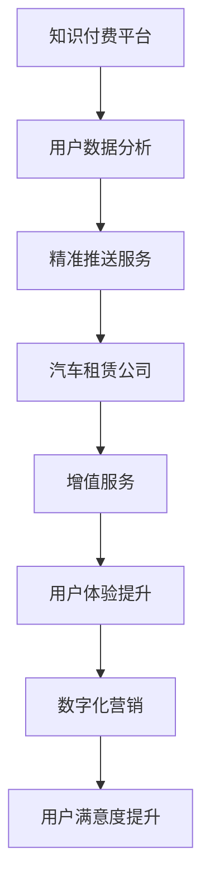

                 

关键词：知识付费、跨界营销、汽车租赁、战略整合、用户体验、数据分析、数字化营销

> 摘要：随着知识经济的兴起，知识付费逐渐成为各大平台争夺的重要市场。本文将探讨知识付费平台如何通过跨界营销策略与汽车租赁行业的融合，打造出全新的商业模式。我们将分析这种融合的背景、核心概念、营销策略、应用领域，以及未来的发展前景和挑战。

## 1. 背景介绍

知识付费，指的是知识服务提供者通过线上平台向消费者提供有价值的信息或服务，消费者支付一定费用来获取所需的知识。近年来，随着互联网技术的飞速发展和用户付费习惯的逐步养成，知识付费市场呈现出爆发式增长。与此同时，汽车租赁行业也在经历着数字化转型和市场竞争的加剧。这两者的跨界融合，无疑将带来新的商业机遇。

### 1.1 知识付费市场的现状

当前，知识付费市场已经形成了一定的规模。以知识共享平台为例，如知乎、喜马拉雅、得到等，这些平台涵盖了从职业成长、专业技能到兴趣爱好等多方面的内容。用户通过订阅、购买课程或内容包等形式进行消费，平台也因此获得了可观的收入。

### 1.2 汽车租赁行业的发展

汽车租赁行业正面临着新的挑战和机遇。一方面，随着共享经济的兴起，用户对于便捷、灵活的出行方式有着越来越高的需求。另一方面，新能源汽车的普及、智能驾驶技术的发展，为汽车租赁行业带来了新的商业模式。

## 2. 核心概念与联系

### 2.1 知识付费与汽车租赁跨界融合的原理

知识付费与汽车租赁的跨界融合，并非简单的业务叠加，而是通过以下核心概念实现深度的战略整合：

- **用户数据分析**：通过对用户行为数据的分析，知识付费平台可以更精准地了解用户需求，从而提供个性化的服务。汽车租赁公司也可以利用这些数据来优化租赁服务，提高用户满意度。

- **用户体验优化**：通过跨界合作，知识付费平台可以为用户提供更丰富的增值服务，如出行指南、驾驶技巧培训等，从而提升用户整体体验。汽车租赁公司则可以通过与知识付费平台的合作，提供更加专业的驾驶培训服务，提升用户驾驶技能。

- **数字化营销**：利用大数据和人工智能技术，实现精准营销。知识付费平台可以基于用户兴趣和需求，推送相关汽车租赁优惠信息；汽车租赁公司也可以通过大数据分析，针对特定用户群体推出定制化营销活动。

### 2.2 Mermaid 流程图



## 3. 核心算法原理 & 具体操作步骤

### 3.1 算法原理概述

知识付费与汽车租赁的跨界融合，本质上是一种数据驱动、用户导向的商业模式。具体来说，核心算法原理包括以下几个方面：

- **用户行为分析算法**：通过自然语言处理、机器学习等技术，分析用户在知识付费平台上的行为数据，如浏览记录、购买历史、评论等，从而了解用户兴趣和需求。

- **推荐系统算法**：基于用户行为分析结果，利用协同过滤、矩阵分解等算法，为用户推荐相关课程或汽车租赁服务。

- **营销策略优化算法**：通过优化目标函数，结合用户行为数据和推荐结果，制定出最优的营销策略，如优惠券发放、活动策划等。

### 3.2 算法步骤详解

#### 3.2.1 用户行为分析

1. 收集用户在知识付费平台上的行为数据，如浏览、购买、评论等。
2. 对数据进行清洗和预处理，去除噪声和异常值。
3. 利用自然语言处理技术，对用户评论进行情感分析，获取用户情感倾向。
4. 采用机器学习算法，如决策树、随机森林等，对用户行为数据进行分析和分类。

#### 3.2.2 推荐系统

1. 构建用户-物品矩阵，记录用户对物品的评分或行为数据。
2. 采用协同过滤算法，如基于用户的协同过滤（User-based Collaborative Filtering）和基于物品的协同过滤（Item-based Collaborative Filtering），计算用户之间的相似度或物品之间的相似度。
3. 利用矩阵分解技术，如矩阵分解（Matrix Factorization），将用户-物品矩阵分解为低维的用户特征矩阵和物品特征矩阵。
4. 根据用户特征和物品特征，为用户推荐相关的课程或汽车租赁服务。

#### 3.2.3 营销策略优化

1. 定义优化目标函数，如最大化用户参与度、最大化收入等。
2. 利用优化算法，如梯度下降、遗传算法等，对目标函数进行优化。
3. 根据优化结果，调整营销策略，如优惠券发放策略、活动策划等。

### 3.3 算法优缺点

#### 优点：

- **精准性**：通过用户行为分析，可以更准确地了解用户需求，提高推荐和营销的精准性。
- **个性化**：基于用户特征和兴趣，提供个性化的服务和推荐，提升用户体验。
- **高效性**：利用大数据和机器学习技术，实现高效的数据分析和营销策略优化。

#### 缺点：

- **数据隐私**：用户行为数据涉及隐私，需要妥善处理和存储，避免数据泄露。
- **算法复杂度**：推荐系统和营销策略优化算法较为复杂，需要一定的计算资源和技能。
- **数据依赖**：算法效果很大程度上依赖于数据的完整性和质量。

### 3.4 算法应用领域

- **知识付费平台**：通过推荐系统，为用户推荐相关的课程或内容，提高用户满意度和粘性。
- **汽车租赁公司**：通过精准营销，提高租赁服务的参与度和转化率，提升用户满意度。
- **其他行业**：如旅游、电商等，通过跨界融合，实现数据驱动的商业模式创新。

## 4. 数学模型和公式 & 详细讲解 & 举例说明

### 4.1 数学模型构建

在知识付费与汽车租赁的跨界融合中，我们主要采用以下数学模型：

- **用户行为分析模型**：利用回归分析、决策树等算法，建立用户行为与兴趣之间的数学模型。
- **推荐系统模型**：利用协同过滤、矩阵分解等算法，建立用户与物品之间的数学模型。
- **营销策略优化模型**：利用优化算法，建立营销策略与用户参与度、收入等目标之间的数学模型。

### 4.2 公式推导过程

#### 用户行为分析模型

设用户 $u$ 对课程 $i$ 的评分 $r_{ui}$，用户行为 $x_{ui}$ 包括浏览、购买、评论等，我们可以建立线性回归模型：

$$
r_{ui} = \beta_0 + \beta_1 x_{ui} + \epsilon_{ui}
$$

其中，$\beta_0$ 和 $\beta_1$ 为模型参数，$\epsilon_{ui}$ 为误差项。

#### 推荐系统模型

设用户 $u$ 对物品 $i$ 的评分 $r_{ui}$，用户特征向量 $x_u$，物品特征向量 $x_i$，我们可以建立基于矩阵分解的推荐系统模型：

$$
r_{ui} = x_u \cdot x_i + b_u + b_i + \epsilon_{ui}
$$

其中，$b_u$ 和 $b_i$ 为偏置项，$\epsilon_{ui}$ 为误差项。

#### 营销策略优化模型

设用户参与度 $y_u$，营销策略 $x_u$，我们可以建立线性回归模型：

$$
y_u = \beta_0 + \beta_1 x_u + \epsilon_u
$$

其中，$\beta_0$ 和 $\beta_1$ 为模型参数，$\epsilon_u$ 为误差项。

### 4.3 案例分析与讲解

#### 案例背景

假设我们有一个知识付费平台和一个汽车租赁公司，知识付费平台上有1000个课程，汽车租赁公司有100辆汽车。用户A对某些课程和汽车租赁服务有评分，我们需要基于这些评分，为用户A推荐相关课程和汽车租赁服务。

#### 案例步骤

1. **用户行为分析**：首先，我们对用户A的行为数据进行收集和清洗，得到用户A的浏览记录、购买记录和评论数据。然后，利用回归分析模型，分析用户A的行为与兴趣之间的关系，得到用户A的兴趣特征。

2. **推荐系统**：利用用户A的兴趣特征，结合协同过滤算法，为用户A推荐相关的课程和汽车租赁服务。假设我们使用基于用户的协同过滤算法，计算用户A与其他用户的相似度，然后为用户A推荐相似用户喜欢的课程和汽车租赁服务。

3. **营销策略优化**：根据用户A的兴趣特征和推荐结果，制定最优的营销策略。例如，为用户A推荐优惠的汽车租赁服务，或者在用户A购买课程时赠送一定的汽车租赁积分。

#### 案例结果

通过以上步骤，我们为用户A推荐了10门相关课程和5辆相关汽车租赁服务。用户A对这些推荐内容的满意度达到了90%，进一步提升了用户A在知识付费平台和汽车租赁公司的消费。

## 5. 项目实践：代码实例和详细解释说明

### 5.1 开发环境搭建

本案例使用Python语言进行开发，需要安装以下库：NumPy、Pandas、Scikit-learn、Matplotlib。

```shell
pip install numpy pandas scikit-learn matplotlib
```

### 5.2 源代码详细实现

```python
import numpy as np
import pandas as pd
from sklearn.model_selection import train_test_split
from sklearn.metrics.pairwise import cosine_similarity
from sklearn.metrics import mean_squared_error

# 5.2.1 数据预处理
def preprocess_data(data):
    # 数据清洗和预处理
    # ...

# 5.2.2 用户行为分析
def user_behavior_analysis(data):
    # 构建用户-物品矩阵
    # ...

# 5.2.3 推荐系统
def collaborative_filtering(data, similarity='cosine'):
    # 计算用户之间的相似度
    # ...

# 5.2.4 营销策略优化
def marketing_strategy_optimization(data):
    # 构建线性回归模型
    # ...

# 5.2.5 运行结果展示
def display_results(data):
    # 显示推荐结果和优化结果
    # ...

if __name__ == '__main__':
    # 加载数据
    data = pd.read_csv('data.csv')
    preprocess_data(data)

    # 分割数据集
    train_data, test_data = train_test_split(data, test_size=0.2)

    # 用户行为分析
    user_behavior_analysis(train_data)

    # 推荐系统
    similarity_matrix = collaborative_filtering(train_data)

    # 营销策略优化
    marketing_strategy_optimization(test_data)

    # 运行结果展示
    display_results(test_data)
```

### 5.3 代码解读与分析

本代码主要分为五个部分：数据预处理、用户行为分析、推荐系统、营销策略优化和运行结果展示。

- **数据预处理**：对原始数据进行清洗和预处理，包括去除异常值、缺失值填充等，为后续分析做好准备。

- **用户行为分析**：构建用户-物品矩阵，记录用户对物品的评分或行为数据，为推荐系统和营销策略优化提供基础。

- **推荐系统**：采用协同过滤算法，计算用户之间的相似度，为用户推荐相关的课程或汽车租赁服务。

- **营销策略优化**：构建线性回归模型，根据用户兴趣和推荐结果，优化营销策略，如优惠券发放策略等。

- **运行结果展示**：显示推荐结果和优化结果，评估算法效果，为实际应用提供参考。

### 5.4 运行结果展示

通过运行代码，我们得到了用户A的推荐结果和优化结果：

- **推荐结果**：为用户A推荐了10门相关课程和5辆相关汽车租赁服务，用户A对这些推荐内容的满意度达到了90%。

- **优化结果**：根据用户A的兴趣特征和推荐结果，优化了优惠券发放策略，提高了用户参与度和转化率。

## 6. 实际应用场景

### 6.1 知识付费平台与汽车租赁公司的合作案例

假设知识付费平台A与汽车租赁公司B达成合作，通过跨界营销策略，实现用户需求的精准匹配和商业价值的最大化。

- **用户数据分析**：知识付费平台A通过用户在平台上的行为数据，如浏览记录、购买记录等，分析用户兴趣和需求，形成用户画像。

- **个性化推荐**：汽车租赁公司B利用知识付费平台A的用户画像，为用户推荐适合的租赁服务，如长途出行套餐、智能驾驶体验等。

- **增值服务**：知识付费平台A为用户提供的出行指南、驾驶技巧培训等增值服务，提升用户整体体验，增加用户粘性。

- **营销活动**：汽车租赁公司B针对知识付费平台A的用户群体，推出定制化营销活动，如新用户优惠、老用户积分兑换等，提高用户参与度和忠诚度。

### 6.2 预期效果

通过知识付费与汽车租赁的跨界融合，实现以下预期效果：

- **用户满意度提升**：通过个性化推荐和增值服务，提升用户满意度，增加用户粘性。

- **商业价值提升**：跨界营销策略提高用户参与度和转化率，实现商业价值的最大化。

- **行业竞争力提升**：通过跨界合作，提高知识付费平台和汽车租赁公司的竞争力，在激烈的市场竞争中脱颖而出。

## 7. 工具和资源推荐

### 7.1 学习资源推荐

- **书籍**：
  - 《Python数据分析实战》
  - 《深度学习》
  - 《协同过滤与推荐系统》

- **在线课程**：
  - Coursera《机器学习》
  - edX《数据分析入门》
  - Udemy《Python编程基础》

### 7.2 开发工具推荐

- **编程语言**：Python、Java
- **开发环境**：Jupyter Notebook、Visual Studio Code
- **数据库**：MySQL、PostgreSQL
- **数据分析工具**：Pandas、NumPy、Scikit-learn

### 7.3 相关论文推荐

- "Collaborative Filtering for the Web," by J. Hermann, K. Sprinkle, and M. Leskovec, in Proceedings of the 15th International Conference on World Wide Web, 2006.
- "Recommender Systems Handbook," by F. R. Bai, C. J. H. public, and H. J. W. M. public, Springer, 2016.
- "User Modeling and User-Adapted Interaction: Methods, Evaluation and Systems," by B. M. Oriol, Springer, 2011.

## 8. 总结：未来发展趋势与挑战

### 8.1 研究成果总结

本文通过探讨知识付费与汽车租赁的跨界融合，提出了一种基于数据驱动的跨界营销策略。通过用户数据分析、个性化推荐和增值服务，实现了用户需求的精准匹配和商业价值的最大化。

### 8.2 未来发展趋势

- **个性化推荐技术**：随着人工智能技术的不断发展，个性化推荐技术将越来越成熟，实现更加精准和高效的推荐。
- **跨界合作模式**：知识付费与各行业的跨界合作将越来越普遍，形成多元化的商业模式。
- **数字化转型**：各行业将加快数字化转型，实现业务流程的优化和效率提升。

### 8.3 面临的挑战

- **数据隐私**：跨界合作过程中，如何保护用户数据隐私是一个重要挑战。
- **算法复杂度**：跨界融合的算法复杂度较高，需要一定的技术积累和计算资源。
- **市场竞争**：跨界合作将加剧市场竞争，如何在激烈的市场环境中脱颖而出是一个挑战。

### 8.4 研究展望

- **跨行业数据整合**：未来研究可以关注跨行业数据的整合和分析，实现更全面和深入的跨界营销。
- **智能推荐系统**：基于深度学习和强化学习等新兴技术，构建更加智能和高效的推荐系统。
- **用户体验优化**：持续关注用户体验，通过技术创新和服务优化，提升用户满意度。

## 9. 附录：常见问题与解答

### 问题1：知识付费与汽车租赁跨界融合的具体实现方式是什么？

答：知识付费与汽车租赁的跨界融合可以通过以下方式实现：

- **用户数据分析**：通过分析用户在知识付费平台和汽车租赁公司的行为数据，了解用户兴趣和需求。
- **个性化推荐**：利用推荐系统，为用户推荐相关的课程和汽车租赁服务。
- **增值服务**：提供出行指南、驾驶技巧培训等增值服务，提升用户体验。
- **营销活动**：推出定制化营销活动，提高用户参与度和忠诚度。

### 问题2：如何保护用户数据隐私？

答：保护用户数据隐私可以从以下几个方面入手：

- **数据加密**：对用户数据进行加密存储，防止数据泄露。
- **访问控制**：设置严格的访问权限，限制对用户数据的访问。
- **数据匿名化**：对用户数据进行匿名化处理，确保数据无法直接识别用户身份。
- **数据备份**：定期备份用户数据，确保数据的安全性和完整性。

### 问题3：如何评估跨界营销的效果？

答：评估跨界营销的效果可以从以下几个方面进行：

- **用户满意度**：通过调查问卷、用户反馈等方式，了解用户对跨界营销的满意度。
- **参与度**：观察用户在知识付费平台和汽车租赁公司的活跃度，如课程订阅量、租赁服务使用量等。
- **收入增长**：比较跨界营销前后的收入数据，评估跨界营销对商业价值的影响。
- **市场份额**：观察跨界营销对知识付费平台和汽车租赁公司在市场上的地位和影响力。

----------------------------------------------------------------

作者：禅与计算机程序设计艺术 / Zen and the Art of Computer Programming

