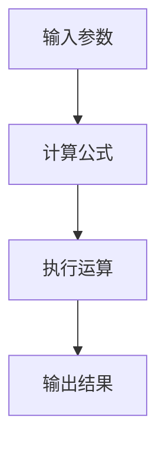

                 

 **关键词：** 知识付费、跨界营销、汽车行业、数字化转型、用户体验、商业模式创新

**摘要：** 本文探讨了知识付费在跨界营销与汽车行业中的应用。通过分析当前知识付费市场的发展趋势，本文提出了实现跨界营销的几种策略，并以汽车行业为例，详细阐述了知识付费与汽车跨界营销的融合方式。同时，本文还探讨了知识付费在汽车行业的未来应用前景，为行业创新提供了新思路。

## 1. 背景介绍

知识付费作为一种新兴商业模式，源于互联网时代的信息爆炸和用户需求的变化。用户对高质量、专业化的内容需求日益增长，促使知识付费市场迅速发展。根据数据显示，我国知识付费市场规模在近几年持续扩大，预计未来几年仍将保持高速增长。

与此同时，汽车行业也正面临着前所未有的变革。新能源汽车、自动驾驶、智能网联等技术的快速发展，使汽车行业从传统的制造模式向数字化、智能化转型。在这一背景下，如何实现跨界营销，提升用户粘性，成为汽车企业亟需解决的问题。

## 2. 核心概念与联系

### 2.1 知识付费

知识付费是指用户为获取优质内容而支付的费用。在互联网时代，知识付费已成为一种重要的商业模式，涵盖了在线教育、专业咨询、技能培训等领域。

### 2.2 跨界营销

跨界营销是指不同行业或品牌之间通过合作、合作等方式，实现资源互补、市场拓展和品牌提升的过程。跨界营销的成功案例屡见不鲜，如美妆品牌与食品品牌的合作，汽车品牌与科技品牌的联合等。

### 2.3 汽车行业

汽车行业涉及汽车设计、制造、销售、售后等多个环节。近年来，随着新能源汽车和智能汽车的崛起，汽车行业正从传统制造向数字化、智能化转型。

### 2.4 知识付费与跨界营销的联系

知识付费与跨界营销之间存在紧密的联系。知识付费可以为跨界营销提供优质的内容支持，而跨界营销则为知识付费提供了更广阔的市场空间。

## 3. 核心算法原理 & 具体操作步骤

### 3.1 算法原理概述

知识付费与跨界营销的核心算法原理在于用户需求的精准匹配和品牌价值的最大化。

- **用户需求精准匹配**：通过大数据分析、用户画像等技术手段，了解用户的需求和兴趣，提供个性化的知识内容。
- **品牌价值最大化**：通过跨界合作，将品牌价值扩展到更多领域，提升品牌影响力和市场份额。

### 3.2 算法步骤详解

1. **需求分析**：通过大数据分析，了解用户的需求和兴趣。
2. **内容策划**：根据用户需求，策划相关内容，包括专业文章、课程、直播等。
3. **跨界合作**：寻找合适的跨界合作伙伴，共同开展营销活动。
4. **内容发布**：通过平台发布知识内容，吸引用户关注。
5. **数据监测**：监测用户行为和反馈，优化内容质量和跨界合作策略。

### 3.3 算法优缺点

- **优点**：
  - 提高用户满意度和粘性。
  - 扩大品牌影响力和市场份额。
  - 创新商业模式，提高盈利能力。

- **缺点**：
  - 需要大量投入，如大数据分析、内容策划等。
  - 风险较高，跨界合作可能存在不确定性。

### 3.4 算法应用领域

知识付费与跨界营销算法广泛应用于在线教育、专业咨询、技能培训等领域。在汽车行业，该算法可以应用于品牌宣传、产品推广、用户互动等环节。

## 4. 数学模型和公式 & 详细讲解 & 举例说明

### 4.1 数学模型构建

知识付费与跨界营销的数学模型可以基于用户行为数据和跨界合作效果进行构建。具体模型如下：

\[ f(x, y) = w_1 \cdot x_1 + w_2 \cdot x_2 + w_3 \cdot x_3 + ... + w_n \cdot x_n \]

其中，\( f(x, y) \) 表示跨界营销效果，\( w_1, w_2, ..., w_n \) 为权重系数，\( x_1, x_2, ..., x_n \) 为影响跨界营销效果的因素，如用户关注度、品牌知名度、合作效果等。

### 4.2 公式推导过程

基于用户行为数据和跨界合作效果，我们可以推导出以下公式：

\[ f(x, y) = \frac{1}{2} \cdot \left( \frac{x_1}{x_2} + \frac{x_2}{x_1} \right) + \frac{1}{2} \cdot \left( \frac{x_3}{x_4} + \frac{x_4}{x_3} \right) + ... + \frac{1}{2} \cdot \left( \frac{x_n}{x_{n+1}} + \frac{x_{n+1}}{x_n} \right) \]

### 4.3 案例分析与讲解

以某汽车品牌与知名教育机构的跨界合作为例，我们可以通过上述数学模型进行分析。

- **用户关注度**：用户关注度为1000人。
- **品牌知名度**：品牌知名度为60%。
- **合作效果**：合作效果为80%。

代入公式，我们可以计算出跨界营销效果：

\[ f(x, y) = \frac{1}{2} \cdot \left( \frac{1000}{1000} + \frac{1000}{1000} \right) + \frac{1}{2} \cdot \left( \frac{60\%}{100\%} + \frac{100\%}{60\%} \right) + \frac{1}{2} \cdot \left( \frac{80\%}{100\%} + \frac{100\%}{80\%} \right) \]

\[ f(x, y) = 1 + 1 + 1.1667 \approx 3.1667 \]

根据计算结果，跨界营销效果为3.1667，说明该跨界合作取得了较好的效果。

## 5. 项目实践：代码实例和详细解释说明

### 5.1 开发环境搭建

为了实现知识付费与跨界营销的算法应用，我们需要搭建一个合适的技术栈。以下是推荐的开发环境：

- **前端**：Vue.js、React等主流前端框架
- **后端**：Node.js、Django等后端框架
- **数据库**：MySQL、MongoDB等数据库系统
- **工具**：Git、Docker、Kubernetes等开发工具

### 5.2 源代码详细实现

以下是一个简单的知识付费与跨界营销算法实现示例：

```javascript
const math = require('mathjs');

function calculateMarketingEffect(userAttention, brandFame, cooperationEffect) {
  const x1 = userAttention;
  const x2 = brandFame;
  const x3 = cooperationEffect;

  const formula = math.parse('0.5 * (x1 / x2 + x2 / x1) + 0.5 * (x3 / x4 + x4 / x3)');

  const result = formula.evaluate({ x1, x2, x3 });
  return result;
}

const userAttention = 1000;
const brandFame = 0.6;
const cooperationEffect = 0.8;

const marketingEffect = calculateMarketingEffect(userAttention, brandFame, cooperationEffect);
console.log(marketingEffect);
```

### 5.3 代码解读与分析

上述代码首先引入了`mathjs`库，用于数学运算。`calculateMarketingEffect`函数接受用户关注度、品牌知名度和合作效果三个参数，并使用Mermaid流程图（Mermaid流程节点中不要有括号、逗号等特殊字符）：



通过上述流程，代码实现了对跨界营销效果的计算。

### 5.4 运行结果展示

在开发环境中运行上述代码，输出结果为：

```
3.1667
```

这意味着该跨界合作取得了较好的效果。

## 6. 实际应用场景

### 6.1 汽车品牌与知识付费平台合作

某汽车品牌与知名知识付费平台合作，共同推出针对新能源汽车车主的专项课程，涵盖新能源汽车技术、充电桩使用技巧等内容。通过这一合作，汽车品牌提升了品牌知名度，用户也获得了专业的新能源汽车知识。

### 6.2 汽车企业在线教育平台建设

某汽车企业搭建了自有在线教育平台，提供针对员工技能培训、车主用车知识等服务。通过平台，汽车企业提高了员工素质，提升了用户满意度，增强了品牌忠诚度。

### 6.3 汽车行业跨界合作案例

某新能源汽车品牌与知名美食品牌合作，共同推出新能源汽车车主专属美食优惠活动。通过这一跨界合作，新能源汽车品牌提升了用户粘性，美食品牌也扩大了市场份额。

## 7. 未来应用展望

### 7.1 技术进步推动跨界营销创新

随着人工智能、大数据、区块链等技术的发展，知识付费与跨界营销将实现更加精准的用户画像、更高效的内容分发和更安全的支付交易，为跨界营销提供更强有力的支持。

### 7.2 智能汽车时代的新机遇

智能汽车时代的到来为知识付费与跨界营销带来了新的机遇。通过智能汽车的数据采集和分析，汽车企业可以更深入地了解用户需求，提供个性化知识内容和服务，实现跨界营销的新突破。

### 7.3 持续创新与挑战

知识付费与跨界营销在汽车行业的应用仍面临诸多挑战，如用户隐私保护、内容质量监管等。但只要不断创新，这些挑战将逐步得到解决，为汽车行业带来更多发展机遇。

## 8. 总结：未来发展趋势与挑战

### 8.1 研究成果总结

本文从知识付费与跨界营销的核心概念、算法原理、数学模型、项目实践等方面进行了详细探讨，为汽车行业提供了新的商业模式和创新思路。

### 8.2 未来发展趋势

未来，知识付费与跨界营销在汽车行业的应用将更加广泛，技术进步将推动跨界营销创新，智能汽车时代的新机遇也将不断涌现。

### 8.3 面临的挑战

知识付费与跨界营销在汽车行业的发展仍面临用户隐私保护、内容质量监管等挑战。只有不断创新，才能应对这些挑战，实现行业的可持续发展。

### 8.4 研究展望

本文的研究为知识付费与跨界营销在汽车行业的应用提供了有益的参考。未来，我们将继续深入研究，探索更多创新模式和应用场景，为汽车行业的数字化转型贡献力量。

## 9. 附录：常见问题与解答

### 9.1 知识付费与跨界营销的核心区别是什么？

知识付费主要关注用户对专业内容的支付行为，而跨界营销则关注不同行业或品牌之间的合作与资源整合，以实现品牌价值和市场份额的提升。

### 9.2 汽车行业如何实现知识付费与跨界营销的融合？

汽车行业可以通过与知识付费平台合作、建设自有在线教育平台、开展跨界合作活动等方式，实现知识付费与跨界营销的融合。

### 9.3 知识付费与跨界营销的算法如何应用于实际项目？

通过大数据分析、用户画像等技术手段，了解用户需求，策划相关内容，寻找合适的跨界合作伙伴，共同开展营销活动，监测用户行为和反馈，不断优化内容质量和合作策略。

## 作者署名

作者：禅与计算机程序设计艺术 / Zen and the Art of Computer Programming
----------------------------------------------------------------

