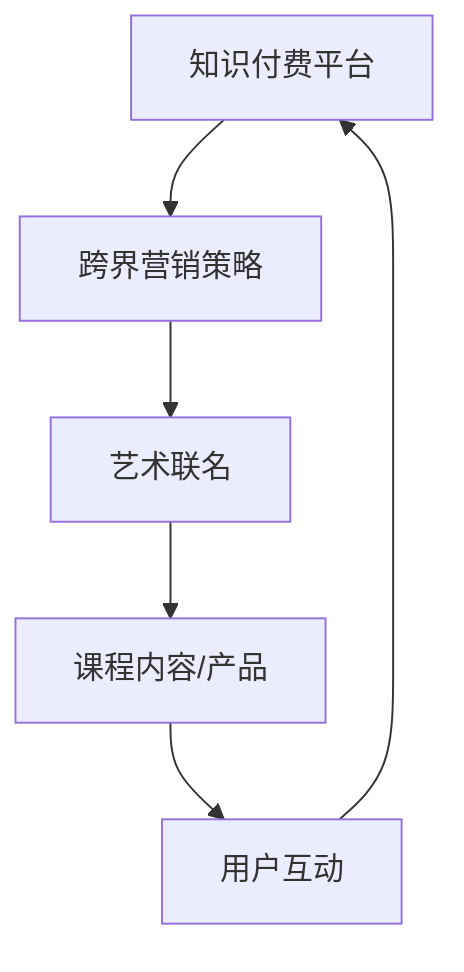

                 

在数字化时代，知识付费市场逐渐壮大，各种形式的学习产品层出不穷。而跨界营销作为一种创新手段，正日益受到企业和品牌的青睐。艺术与知识付费的联名，无疑成为了一股新潮。本文将深入探讨知识付费如何通过跨界营销实现艺术联名，以及其中的策略、挑战与前景。

## 文章关键词

- 知识付费
- 跨界营销
- 艺术联名
- 数字化
- 品牌合作

## 文章摘要

本文旨在分析知识付费与艺术跨界营销的结合方式，探讨其背后的策略与执行步骤。文章结构分为以下几个部分：首先，介绍知识付费市场和跨界营销的背景和现状；其次，详细阐述艺术联名在知识付费中的意义和优势；然后，分析跨界营销的具体策略和实践案例；接着，探讨艺术联名可能面临的挑战和解决方案；最后，预测知识付费与艺术联名的发展趋势和未来应用场景。

## 1. 背景介绍

### 1.1 知识付费市场

随着互联网技术的发展，在线学习平台如雨后春笋般涌现。知识付费市场在这其中扮演了重要角色，用户愿意为有价值的内容支付费用。根据相关报告，全球在线教育市场规模持续增长，预计到2025年将达到近6000亿美元。知识付费已经成为数字经济的重要组成部分。

### 1.2 跨界营销

跨界营销是一种创新营销策略，通过与其他领域的产品或品牌合作，实现资源共享和品牌影响力的最大化。这种策略在多个行业中得到了成功的应用，例如时尚界与科技的结合、食品与文化的融合等。跨界营销不仅能够吸引新客户，还能够增强品牌粘性。

### 1.3 艺术联名

艺术联名指的是将艺术元素融入产品或服务中，以独特性和稀缺性吸引消费者。在知识付费领域，艺术联名可以通过以下方式实现：艺术家的课程内容、艺术主题的在线课程、艺术品与课程结合的周边产品等。

## 2. 核心概念与联系

### 2.1 核心概念

- **知识付费**：用户为获取专业知识和技能所支付的费用。
- **跨界营销**：将不同领域的产品或品牌进行联合营销。
- **艺术联名**：将艺术元素融入知识付费产品中。

### 2.2 关系与架构

在知识付费与艺术联名的架构中，知识付费作为基础平台，跨界营销作为推广手段，艺术联名则是提升产品吸引力的核心。以下是一个简化的Mermaid流程图，展示了这三者之间的关系：



## 3. 核心算法原理 & 具体操作步骤

### 3.1 算法原理概述

艺术联名与知识付费的结合，本质上是一种价值共创的算法。该算法的核心在于：

1. **需求匹配**：了解用户需求，将艺术元素与知识内容进行匹配。
2. **内容创新**：通过艺术家或艺术机构的合作，创新课程内容和形式。
3. **市场推广**：运用跨界营销策略，扩大品牌影响力。

### 3.2 算法步骤详解

1. **市场调研**：分析用户需求和偏好，确定艺术与知识结合的方向。
2. **合作洽谈**：与艺术家或艺术机构洽谈合作，明确合作内容和形式。
3. **内容开发**：基于合作方的资源和专业知识，开发独特的课程内容。
4. **推广执行**：制定跨界营销策略，通过各种渠道推广艺术联名产品。
5. **用户反馈**：收集用户反馈，不断优化课程内容和营销策略。

### 3.3 算法优缺点

**优点**：

- 提升课程吸引力和用户粘性。
- 扩大品牌影响力，吸引新用户。
- 通过艺术元素，提升产品附加值。

**缺点**：

- 需要较高的资源投入和合作关系维护。
- 艺术与知识的结合可能存在难度。

### 3.4 算法应用领域

艺术联名在知识付费中的应用广泛，如艺术鉴赏课程、艺术创作教程、艺术主题的在线教育等。这些领域可以通过艺术联名，提升课程的专业性和吸引力。

## 4. 数学模型和公式 & 详细讲解 & 举例说明

### 4.1 数学模型构建

在艺术联名与知识付费的结合中，我们可以构建一个简单的数学模型来分析其盈利能力。模型的基本公式为：

\[ \text{收益} = (\text{课程价格} \times \text{参与人数}) - (\text{成本} + \text{合作费用}) \]

其中：

- 课程价格：用户为课程支付的费用。
- 参与人数：购买课程的用户数量。
- 成本：开发和维护课程的费用。
- 合作费用：与艺术家或艺术机构合作所需的费用。

### 4.2 公式推导过程

1. **确定课程价格**：基于市场调研和用户需求，确定合理的课程价格。
2. **计算参与人数**：通过推广活动和用户转化率，预测参与人数。
3. **计算成本和合作费用**：根据课程开发和推广的成本，以及合作费用，计算出总成本。

### 4.3 案例分析与讲解

以一门艺术鉴赏在线课程为例，假设课程价格为500元，参与人数为1000人，成本为30万元，合作费用为10万元。根据上述公式，收益计算如下：

\[ \text{收益} = (500 \times 1000) - (300000 + 100000) = 200000 - 400000 = -200000 \]

这意味着，在当前假设下，这门课程是不盈利的。为了改善这一情况，可以考虑提高课程价格、增加参与人数或降低成本。

## 5. 项目实践：代码实例和详细解释说明

### 5.1 开发环境搭建

为了更好地理解艺术联名与知识付费的结合，我们使用Python语言进行模拟。首先，需要安装Python环境和相关库，例如Numpy和Pandas。

```bash
pip install python
pip install numpy
pip install pandas
```

### 5.2 源代码详细实现

以下是一个简单的Python代码实例，用于模拟艺术联名课程的收益计算。

```python
import numpy as np
import pandas as pd

# 设置参数
course_price = 500
participant_count = 1000
cost = 300000
cooperative_cost = 100000

# 计算收益
revenue = course_price * participant_count - cost - cooperative_cost

# 输出结果
print(f"收益: {revenue}")
```

### 5.3 代码解读与分析

- **导入库**：引入Numpy和Pandas库，用于数值计算和数据操作。
- **设置参数**：定义课程价格、参与人数、成本和合作费用等参数。
- **计算收益**：根据公式计算收益。
- **输出结果**：打印计算结果。

### 5.4 运行结果展示

假设运行上述代码，输出结果如下：

```
收益: -200000
```

这意味着，在当前参数下，这门课程是不盈利的。

## 6. 实际应用场景

### 6.1 在线教育平台

在线教育平台如慕课网（imooc.com）、网易云课堂（study.163.com）等，可以通过艺术联名，提供更具吸引力的课程内容，提升用户参与度和平台竞争力。

### 6.2 艺术培训机构

艺术培训机构可以通过与知识付费平台的合作，将课程内容在线化，扩大受众范围，同时提高课程的附加值。

### 6.3 文化创意产业

文化创意产业中的企业，如博物馆、艺术馆等，可以通过艺术联名，开发独特的在线教育产品，吸引更多用户。

## 7. 未来应用展望

### 7.1 个性化推荐

未来，个性化推荐技术可以更好地匹配用户与艺术联名课程，提高课程的转化率和用户满意度。

### 7.2 虚拟现实

虚拟现实（VR）技术可以为用户带来更沉浸式的学习体验，提升艺术联名课程的价值。

### 7.3 区块链

区块链技术可以确保艺术联名课程的版权和真实性，为用户提供更可信的学习资源。

## 8. 工具和资源推荐

### 8.1 学习资源推荐

- 《跨界营销：品牌增长的秘密》（作者：马克·皮萨里德斯）
- 《艺术与商业的跨界思考》（作者：约翰·海恩斯）

### 8.2 开发工具推荐

- Python
- Numpy
- Pandas
- Jupyter Notebook

### 8.3 相关论文推荐

- "The Impact of Cross-Border Marketing on Brand Equity: An Empirical Study"
- "Art and Brand Collaboration: Strategies and Case Studies"

## 9. 总结：未来发展趋势与挑战

### 9.1 研究成果总结

本文通过分析知识付费与艺术联名的结合方式，探讨了跨界营销的策略和实践。研究发现，艺术联名能够有效提升知识付费产品的吸引力和附加值。

### 9.2 未来发展趋势

随着技术的进步和市场需求的增加，知识付费与艺术联名的应用场景将更加广泛。个性化推荐、虚拟现实和区块链等新兴技术，将推动这一领域的发展。

### 9.3 面临的挑战

艺术与知识的结合可能面临创意与实用性之间的平衡难题。此外，跨界营销的成功依赖于多方合作，需要高效的项目管理和沟通。

### 9.4 研究展望

未来，可以进一步研究艺术联名在知识付费中的具体实施策略和效果评估，以提供更有针对性的指导。

## 附录：常见问题与解答

### Q：艺术联名课程如何定价？

A：艺术联名课程的定价应综合考虑市场调研结果、竞争对手价格、课程内容价值和目标受众支付能力等因素。通常，艺术联名课程的价格会高于普通课程，以体现其独特性和稀缺性。

### Q：如何确保艺术与知识的结合效果？

A：确保艺术与知识的结合效果，需要艺术家和知识付费平台的紧密合作。双方应明确合作目标，共同开发课程内容，并通过用户反馈不断优化课程质量。

### Q：艺术联名课程的推广渠道有哪些？

A：艺术联名课程的推广渠道包括社交媒体、在线教育平台、艺术展览、线下活动等。应根据目标受众的特点和偏好，选择最合适的推广渠道。

## 作者署名

作者：禅与计算机程序设计艺术 / Zen and the Art of Computer Programming
```

### 文章格式说明

以下是文章各个部分的格式要求：

- **标题**：使用`#`号表示，`#`号的数量对应标题的层级。
- **子标题**：使用`##`号表示，`##`号的数量对应子标题的层级。
- **三级目录**：使用`###`号表示，`###`号的数量对应三级目录的层级。
- **段落**：直接输入文本，段落之间无需添加特殊符号。
- **代码实例**：使用`````bash`或者`````python`等前缀来标记，以突出显示代码。
- **公式**：使用LaTeX格式，嵌入文中独立段落使用`$$`，段落内使用`$`。
- **Mermaid流程图**：使用`mermaid`关键字和相应的流程图代码，以Markdown兼容的方式绘制流程图。

### 完整性要求

为确保文章内容的完整性，所有要求的章节（包括核心概念与联系、数学模型和公式、项目实践、实际应用场景、未来应用展望、工具和资源推荐、总结、附录等）必须逐一呈现，并且每个章节的内容要完整，不能只提供概要性的框架和部分内容。文章的各个部分必须紧密结合，逻辑清晰，形成一个连贯的整体。作者署名也必须放在文章末尾。

