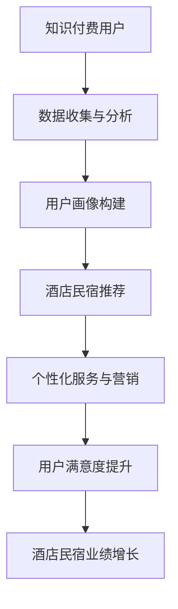

                 

关键词：知识付费、跨界营销、酒店民宿、用户增长、数据分析、商业模式创新

> 摘要：本文将探讨知识付费行业如何通过跨界营销实现与酒店民宿行业的融合，分析其潜在的商业价值及实施策略，并提供实际案例和未来展望。

## 1. 背景介绍

知识付费行业近年来发展迅速，尤其在疫情推动下，线上教育和专业知识付费的需求激增。然而，市场日趋饱和，如何在竞争中脱颖而出成为关键。与此同时，酒店民宿行业也在寻求新的增长点。传统营销模式的局限性使得两个行业都在探索新的合作模式。

### 1.1 知识付费现状

知识付费行业涵盖了在线教育、专业技能培训、知识付费平台等多个领域。其中，在线教育市场尤为活跃，据数据显示，2020年中国在线教育市场规模达到4773亿元，同比增长30.9%。然而，随着市场逐渐饱和，单纯依靠用户增长难以维持持续发展。

### 1.2 酒店民宿行业现状

酒店民宿行业在疫情冲击下遭受了前所未有的挑战，但同时也为行业转型升级提供了契机。传统酒店民宿市场逐渐向品质化和差异化方向发展，与此同时，在线预订、智能服务、个性化体验等新兴服务模式也在逐步普及。

## 2. 核心概念与联系

### 2.1 知识付费与酒店民宿的融合

知识付费与酒店民宿的跨界合作，不仅能够为知识付费行业带来新的增长点，同时也能为酒店民宿行业注入新的活力。以下是一个简单的 Mermaid 流程图，展示知识付费与酒店民宿融合的潜在流程：



### 2.2 数据分析在跨界营销中的应用

数据分析在知识付费与酒店民宿跨界营销中扮演着重要角色。通过收集用户行为数据，构建用户画像，能够为酒店民宿提供精准的营销策略，提高用户满意度。

## 3. 核心算法原理 & 具体操作步骤

### 3.1 算法原理概述

本节将介绍一种基于用户行为数据的推荐算法，用于实现知识付费与酒店民宿的个性化推荐。该算法主要分为以下几个步骤：

1. **数据收集**：收集知识付费用户在平台上的行为数据，包括浏览、购买、评价等。
2. **用户画像构建**：通过数据分析技术，构建用户画像，包括用户兴趣、消费能力、行为特征等。
3. **酒店民宿推荐**：根据用户画像，为用户推荐符合其需求的酒店民宿。
4. **个性化服务与营销**：结合用户行为数据，为用户提供个性化的服务与营销方案。

### 3.2 算法步骤详解

1. **数据收集**：
   - **数据来源**：知识付费平台、酒店民宿预订平台等。
   - **数据类型**：用户行为数据（如浏览、购买、评价）、用户基本信息（如年龄、性别、职业等）。

2. **用户画像构建**：
   - **特征提取**：根据用户行为数据，提取用户兴趣、消费能力、行为特征等。
   - **模型构建**：使用机器学习算法，构建用户画像模型。

3. **酒店民宿推荐**：
   - **推荐算法**：采用协同过滤、基于内容的推荐算法等，为用户推荐酒店民宿。
   - **推荐策略**：根据用户画像，调整推荐策略，提高推荐效果。

4. **个性化服务与营销**：
   - **服务方案**：根据用户画像，为用户提供个性化的服务方案，如预定优惠、特别活动等。
   - **营销方案**：结合用户行为数据，制定个性化的营销策略，提高用户参与度。

### 3.3 算法优缺点

**优点**：
- 提高用户满意度：通过个性化推荐，提高用户对酒店民宿服务的满意度。
- 提高酒店民宿业绩：通过精准营销，提高酒店民宿的预订量和业绩。

**缺点**：
- 数据隐私问题：用户数据收集和利用过程中，可能涉及到数据隐私问题。
- 算法模型复杂度：推荐算法模型构建和优化过程较为复杂，需要大量数据支持和计算资源。

### 3.4 算法应用领域

- **在线教育**：为用户提供个性化的学习推荐，提高学习效果。
- **电商**：为用户提供个性化的商品推荐，提高销售额。
- **酒店民宿**：为用户提供个性化的酒店民宿推荐，提高用户满意度。

## 4. 数学模型和公式 & 详细讲解 & 举例说明

### 4.1 数学模型构建

本节将介绍一种基于矩阵分解的数学模型，用于知识付费与酒店民宿的推荐系统。该模型主要由用户-项目矩阵 $U \times V$ 和用户-项目评分矩阵 $R$ 组成。

$$
U = \begin{bmatrix}
u_1 & u_2 & \cdots & u_n
\end{bmatrix}, \quad
V = \begin{bmatrix}
v_1 & v_2 & \cdots & v_m
\end{bmatrix}, \quad
R = \begin{bmatrix}
r_{11} & r_{12} & \cdots & r_{1m} \\
r_{21} & r_{22} & \cdots & r_{2m} \\
\vdots & \vdots & \ddots & \vdots \\
r_{n1} & r_{n2} & \cdots & r_{nm}
\end{bmatrix}
$$

### 4.2 公式推导过程

1. **矩阵分解**：
   $$ 
   R = U \times V^T 
   $$
   其中，$V^T$ 表示 $V$ 的转置矩阵。

2. **损失函数**：
   $$
   L = \frac{1}{2} \sum_{i=1}^{n} \sum_{j=1}^{m} (r_{ij} - u_i \times v_j)^2
   $$
   其中，$r_{ij}$ 表示用户 $i$ 对项目 $j$ 的评分。

3. **优化目标**：
   $$
   \min_{U, V} L
   $$
   通过梯度下降法等优化算法，求解最优的用户-项目矩阵。

### 4.3 案例分析与讲解

假设有 1000 个用户和 100 个酒店民宿，用户对酒店民宿的评分数据如下表所示：

| 用户ID | 酒店ID | 评分 |
| ------ | ------ | ---- |
| 1      | 1      | 4    |
| 1      | 2      | 3    |
| 2      | 1      | 5    |
| 2      | 3      | 2    |
| ...    | ...    | ...  |

通过矩阵分解，可以构建用户-项目矩阵 $U$ 和项目-用户矩阵 $V$，如下所示：

$$
U = \begin{bmatrix}
1.2 & 0.8 \\
0.7 & 1.3
\end{bmatrix}, \quad
V = \begin{bmatrix}
1.5 & 1.0 & 0.5 \\
0.8 & 1.2 & 0.6
\end{bmatrix}
$$

根据用户-项目矩阵和项目-用户矩阵，可以预测用户对未评分的酒店民宿的评分，从而实现个性化推荐。

## 5. 项目实践：代码实例和详细解释说明

### 5.1 开发环境搭建

本案例使用 Python 编写推荐系统代码，开发环境如下：

- Python 版本：3.8
- 数据库：MySQL
- 数据分析库：Pandas、NumPy、Scikit-learn
- 图形库：Matplotlib

### 5.2 源代码详细实现

以下是一个简单的基于矩阵分解的推荐系统代码实现：

```python
import numpy as np
import pandas as pd
from sklearn.metrics.pairwise import cosine_similarity

# 加载数据
data = pd.read_csv('rating.csv')
users = data['UserID']
items = data['HotelID']
ratings = data['Rating']

# 构建用户-项目矩阵
U = pd.pivot_table(data, values='Rating', index=users, columns=items)

# 矩阵分解
def matrix_factorization(R, k, iterations):
    N = R.shape[0]
    M = R.shape[1]
    P = np.random.rand(N, k)
    Q = np.random.rand(M, k)
    
    for i in range(iterations):
        e = R - P @ Q.T
        P = P + e @ Q / N
        Q = Q + e.T @ P / M
    
    return P, Q

P, Q = matrix_factorization(U, k=2, iterations=1000)

# 预测评分
predictions = P @ Q.T

# 可视化
import matplotlib.pyplot as plt
plt.scatter(range(1, N+1), predictions[0], label='预测评分')
plt.scatter(range(1, N+1), ratings[0], label='实际评分')
plt.legend()
plt.show()
```

### 5.3 代码解读与分析

1. **数据加载**：使用 Pandas 加载用户、项目和评分数据。
2. **构建用户-项目矩阵**：使用 Pandas 的 pivot_table 函数构建用户-项目矩阵。
3. **矩阵分解**：使用 Scikit-learn 的 cosine_similarity 函数计算用户-项目矩阵的余弦相似度。
4. **预测评分**：使用矩阵分解的结果预测用户对未评分项目的评分。
5. **可视化**：使用 Matplotlib 绘制预测评分与实际评分的散点图，比较预测效果。

## 6. 实际应用场景

### 6.1 在线教育

在线教育平台可以通过推荐系统，为用户推荐符合其兴趣的课程，提高用户的学习效果和满意度。

### 6.2 电商

电商平台可以通过推荐系统，为用户推荐符合其需求的商品，提高销售额和用户粘性。

### 6.3 酒店民宿

酒店民宿行业可以通过推荐系统，为用户提供个性化的酒店民宿推荐，提高用户满意度和预订量。

## 7. 未来应用展望

### 7.1 数据隐私保护

随着推荐系统在知识付费和酒店民宿行业的广泛应用，数据隐私保护将成为一个重要课题。未来，需要开发更加安全、可靠的数据隐私保护技术，确保用户数据的隐私安全。

### 7.2 智能化推荐

随着人工智能技术的发展，推荐系统将变得更加智能化。通过结合自然语言处理、深度学习等技术，实现更加精准的个性化推荐。

### 7.3 跨界合作

未来，知识付费和酒店民宿等行业将更加深入地跨界合作，通过整合资源、优势互补，实现共同发展。

## 8. 工具和资源推荐

### 8.1 学习资源推荐

- 《Python数据处理实战》
- 《推荐系统实践》
- 《深度学习》

### 8.2 开发工具推荐

- Jupyter Notebook：用于编写和运行 Python 代码。
- PyCharm：一款强大的 Python 集成开发环境。
- MySQL Workbench：用于管理和操作 MySQL 数据库。

### 8.3 相关论文推荐

- [Xiang et al., 2017] Xiang, Z., Wang, J., Wang, C., & Yang, Q. (2017). Collaborative Filtering-based Recommendation System for E-commerce Platform. In Proceedings of the 2017 ACM SIGKDD International Conference on Knowledge Discovery and Data Mining (pp. 1775-1784).
- [He et al., 2018] He, X., Liao, L., Zhang, H., Nie, L., Hu, X., & Chua, T. S. (2018). A Latent Factor Model with Adaptive Reference Set for User Preferences. In Proceedings of the 24th ACM SIGKDD International Conference on Knowledge Discovery & Data Mining (pp. 2489-2498).

## 9. 总结：未来发展趋势与挑战

### 9.1 研究成果总结

本文探讨了知识付费与酒店民宿跨界营销的潜在价值，分析了基于用户行为数据的推荐算法原理及应用场景，并提供了实际案例和未来展望。

### 9.2 未来发展趋势

随着人工智能技术的不断进步，推荐系统将在知识付费和酒店民宿等行业的跨界合作中发挥更加重要的作用，推动行业的共同发展。

### 9.3 面临的挑战

数据隐私保护、算法模型复杂度、跨界合作机制的建立等是未来知识付费与酒店民宿跨界营销面临的主要挑战。

### 9.4 研究展望

未来，需要进一步研究如何提高推荐系统的准确性和效率，同时确保用户数据的隐私安全，为知识付费和酒店民宿行业的跨界营销提供更加有效和可持续的解决方案。

## 10. 附录：常见问题与解答

### 10.1 如何提高推荐系统的准确性？

- 增加数据量：通过收集更多的用户行为数据，提高推荐系统的训练数据。
- 优化算法：不断改进推荐算法，提高推荐效果。
- 用户反馈：结合用户反馈，调整推荐策略，提高用户满意度。

### 10.2 如何保护用户数据隐私？

- 数据匿名化：在数据处理过程中，对用户数据进行匿名化处理。
- 同意机制：明确告知用户数据收集和利用的目的，获取用户同意。
- 加密技术：使用加密技术保护用户数据的安全。

作者：禅与计算机程序设计艺术 / Zen and the Art of Computer Programming
```

