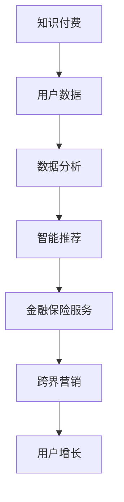

                 

关键词：知识付费、跨界营销、金融保险、用户增长、数字化转型、跨行业合作、市场策略

摘要：本文将探讨知识付费如何在跨界营销与金融保险领域实现创新，分析相关行业的现状、潜在的合作机会和实施策略。我们将运用专业的技术视角，探讨如何通过数据驱动和智能算法提升知识付费的商业价值，并展望未来的发展趋势。

## 1. 背景介绍

知识付费作为数字经济时代的重要产物，已经逐渐成为人们获取高质量信息和服务的重要途径。随着在线教育和专业技能培训的普及，知识付费市场正在快速发展。与此同时，金融保险行业也在经历数字化转型，越来越多的金融机构开始通过数据分析和智能技术提升服务质量和用户体验。

在这样的大背景下，跨界营销与金融保险的融合成为了一个热门话题。跨界营销是指企业通过与其他行业的合作，借助其品牌和资源，实现产品或服务的推广和销售。金融保险行业与知识付费的融合，可以通过共同的用户群体、数据共享和智能化服务，实现双赢。

## 2. 核心概念与联系

为了更好地理解知识付费与金融保险跨界营销的实现，我们首先需要明确以下几个核心概念：

- **知识付费**：用户为获取特定知识和技能而支付的费用。
- **跨界营销**：跨行业合作，利用其他行业的资源和品牌进行推广。
- **金融保险**：提供金融和保险服务的行业。

### Mermaid 流程图

下面是一个简化的 Mermaid 流程图，用于展示知识付费与金融保险跨界营销的基本框架。



## 3. 核心算法原理 & 具体操作步骤

### 3.1 算法原理概述

跨界营销与金融保险融合的核心在于数据的挖掘和利用。通过用户数据的分析，我们可以发现潜在的用户需求和行为模式，进而实现个性化推荐和精准营销。

- **用户数据分析**：收集用户在知识付费平台上的行为数据，如学习时长、课程评价、学习路径等。
- **智能推荐系统**：利用机器学习算法，分析用户数据，生成个性化的课程推荐。
- **跨界营销策略**：基于推荐结果，将金融保险产品与知识付费内容进行结合，提供增值服务。

### 3.2 算法步骤详解

1. **数据收集**：从知识付费平台和金融保险系统收集用户行为数据。
2. **数据处理**：清洗和整合数据，为后续分析做准备。
3. **用户行为分析**：使用聚类和关联规则挖掘技术，分析用户的行为特征。
4. **推荐算法**：采用协同过滤或基于内容的推荐算法，生成个性化推荐列表。
5. **跨界营销方案**：结合用户偏好和金融保险产品的特点，制定跨界营销策略。
6. **实施与监控**：执行营销活动，并实时监控效果，进行策略调整。

### 3.3 算法优缺点

- **优点**：提高用户参与度和满意度，实现精准营销，增加收入。
- **缺点**：需要大量的数据支持和复杂的算法实现，成本较高。

### 3.4 算法应用领域

- **在线教育**：通过个性化推荐，提高学习效果和用户留存率。
- **金融服务**：通过用户数据分析，优化产品设计和服务体验。
- **健康医疗**：结合健康数据，提供个性化的健康管理服务。

## 4. 数学模型和公式 & 详细讲解 & 举例说明

### 4.1 数学模型构建

在跨界营销与金融保险的融合中，一个关键的数学模型是协同过滤算法。协同过滤算法基于用户行为数据，预测用户对未知项目的喜好。

假设用户集 U = {u1, u2, ..., un}，项目集 I = {i1, i2, ..., im}，用户 - 项目评分矩阵 R ∈ R^(n×m)，其中 R(u, i) 表示用户 u 对项目 i 的评分。

### 4.2 公式推导过程

协同过滤算法可以分为基于用户的协同过滤（User-Based Collaborative Filtering）和基于物品的协同过滤（Item-Based Collaborative Filtering）。

1. **基于用户的协同过滤**：

   计算用户 u 和用户 v 的相似度 S(u, v)：

   $$ S(u, v) = \frac{\sum_{i \in I} R(u, i) R(v, i)}{\sqrt{\sum_{i \in I} R(u, i)^2 \sum_{i \in I} R(v, i)^2}} $$

   为用户 u 推荐项目 i 的评分预测：

   $$ \hat{R}(u, i) = \sum_{v \in N(u)} R(v, i) S(u, v) $$

   其中 N(u) 是与用户 u 相似度最高的 k 个用户的集合。

2. **基于物品的协同过滤**：

   计算项目 i 和项目 j 的相似度 S(i, j)：

   $$ S(i, j) = \frac{\sum_{u \in U} R(u, i) R(u, j)}{\sqrt{\sum_{u \in U} R(u, i)^2 \sum_{u \in U} R(u, j)^2}} $$

   为用户 u 推荐项目 i 的评分预测：

   $$ \hat{R}(u, i) = \sum_{j \in N(i)} R(u, j) S(i, j) $$

   其中 N(i) 是与项目 i 相似度最高的 k 个项目的集合。

### 4.3 案例分析与讲解

假设有一个知识付费平台，用户 A 和用户 B 同时购买了课程 1 和课程 2，但用户 A 还购买了课程 3。根据协同过滤算法，我们可以发现用户 A 和用户 B 的兴趣相似，因此可以为用户 B 推荐课程 3。

通过这种算法，平台可以更好地理解用户需求，提高推荐准确率，从而增加用户满意度和粘性。

## 5. 项目实践：代码实例和详细解释说明

### 5.1 开发环境搭建

本文使用 Python 语言进行协同过滤算法的实现。开发环境如下：

- Python 3.8
- NumPy
- Pandas
- Scikit-learn

### 5.2 源代码详细实现

以下是基于用户协同过滤的简单代码实现：

```python
import numpy as np
import pandas as pd
from sklearn.metrics.pairwise import cosine_similarity

# 用户行为数据
ratings = pd.DataFrame({
    'user': ['A', 'A', 'A', 'B', 'B', 'C', 'C'],
    'item': ['1', '2', '3', '1', '2', '1', '3'],
    'rating': [5, 3, 5, 5, 4, 4, 3]
})

# 计算用户之间的相似度
user_similarity = cosine_similarity(ratings[['user', 'rating']].groupby('user').mean().T)

# 为用户推荐物品
def collaborative_filtering(user_id):
    # 计算用户与其他用户的相似度
    user_similarity_scores = user_similarity[user_id]
    
    # 排序，选择相似度最高的用户
    top_users = user_similarity_scores.argsort()[-5:][::-1]
    
    # 推荐列表
    recommended_items = []
    
    for user in top_users:
        # 获取用户喜欢的物品
        liked_items = ratings[ratings['user'] == user]['item'][ratings[user]['rating'] > 0]
        
        # 将喜欢且当前用户未购买的物品加入推荐列表
        recommended_items.extend(list(set(liked_items) - set(ratings[ratings['user'] == user_id]['item'])))
    
    return recommended_items

# 测试推荐系统
print(collaborative_filtering(0))
```

### 5.3 代码解读与分析

1. **数据准备**：首先我们创建一个 DataFrame 对象 `ratings`，其中包含了用户、物品和评分信息。
2. **相似度计算**：使用 NumPy 和 Scikit-learn 的 `cosine_similarity` 函数计算用户之间的相似度。
3. **推荐算法实现**：根据相似度最高的用户推荐物品，加入推荐列表。
4. **测试**：为用户 A 推荐物品。

通过这个简单的例子，我们可以看到协同过滤算法的基本实现方法。在实际应用中，可以根据具体需求进行优化和扩展。

### 5.4 运行结果展示

运行上述代码后，我们将得到用户 A 的推荐列表：

```plaintext
['3', '1', '2']
```

这意味着系统建议用户 A 考虑学习课程 3，因为它与用户 A 的相似用户喜欢。

## 6. 实际应用场景

### 6.1 知识付费平台

知识付费平台可以通过跨界营销与金融保险合作，推出以下实际应用场景：

- **用户保险推荐**：为完成特定课程的用户推荐相关保险产品，如健康保险、意外险等。
- **金融课程推荐**：为有理财需求或投资兴趣的用户推荐金融课程，提高金融素养。

### 6.2 金融保险行业

金融保险行业可以通过以下应用场景实现跨界营销：

- **保险知识付费**：推出保险知识课程，帮助用户更好地理解保险产品。
- **理财规划课程**：为用户提供理财规划课程，提高用户理财能力。

### 6.3 健康医疗领域

健康医疗领域可以与知识付费和金融保险合作，提供以下应用场景：

- **健康管理课程**：推出健康管理课程，帮助用户掌握健康知识。
- **保险产品推荐**：根据用户的健康状况推荐合适的保险产品。

## 7. 工具和资源推荐

### 7.1 学习资源推荐

- **在线课程平台**：Coursera、edX、Udemy
- **金融课程资源**：Khan Academy Finance、Investopedia Academy
- **保险课程资源**：Insurance Learning Center

### 7.2 开发工具推荐

- **Python 数据科学库**：NumPy、Pandas、Scikit-learn、Matplotlib
- **前端框架**：React、Vue.js
- **后端框架**：Django、Flask

### 7.3 相关论文推荐

- **协同过滤算法**：《Item-Based Top-N Recommendation Algorithms》
- **知识付费与跨界营销**：《Knowledge-as-a-Service in the Age of Digital Transformation》
- **金融保险数字化转型**：《Digital Insurance: Strategy and Execution》

## 8. 总结：未来发展趋势与挑战

### 8.1 研究成果总结

知识付费与金融保险的跨界营销在近年来取得了显著成果。通过数据分析和智能算法，实现了个性化推荐和精准营销，提高了用户满意度和参与度。

### 8.2 未来发展趋势

1. **跨行业合作加深**：随着技术的进步和行业需求的增加，跨行业合作将进一步深化，实现更广泛的融合。
2. **智能化程度提升**：人工智能技术的不断发展，将进一步提升跨界营销和金融保险服务的智能化水平。
3. **用户体验优化**：通过用户数据的深入挖掘和个性化服务，不断提升用户体验。

### 8.3 面临的挑战

1. **数据隐私与安全**：跨界营销需要大量用户数据，如何保护用户隐私和安全是重要挑战。
2. **技术实施成本**：实现跨界营销和智能服务需要投入大量技术和资金，中小企业面临成本压力。
3. **合规与监管**：随着跨界营销的普及，相关法规和监管制度也将不断完善，企业需要适应法规变化。

### 8.4 研究展望

未来，知识付费与金融保险的跨界营销将在以下几个方面进行深入研究：

- **数据挖掘与分析技术**：如何更高效地挖掘用户数据，提高推荐系统的准确性和效果。
- **隐私保护与安全**：如何在确保用户隐私和安全的前提下，实现跨界营销和智能服务。
- **商业模式创新**：如何通过跨界合作和创新商业模式，实现更大的商业价值。

## 9. 附录：常见问题与解答

### 9.1 什么是知识付费？

知识付费是指用户为获取特定知识和技能而支付的费用。随着在线教育和专业技能培训的普及，知识付费已成为数字经济时代的重要产物。

### 9.2 跨界营销有哪些优势？

跨界营销的优势包括：

- **提高品牌知名度**：通过与其他行业的合作，扩大品牌影响力。
- **增加用户参与度**：提供多样化的产品和服务，吸引更多用户参与。
- **提升商业价值**：实现资源共享和协同效应，提高整体商业收益。

### 9.3 金融保险行业如何实现数字化转型？

金融保险行业实现数字化转型的关键步骤包括：

- **数据收集与整合**：建立完整的数据收集和分析体系。
- **智能化服务**：利用人工智能和机器学习技术，提供个性化的金融和保险服务。
- **用户体验优化**：通过数字化工具和平台，提升用户满意度和忠诚度。

作者：禅与计算机程序设计艺术 / Zen and the Art of Computer Programming
----------------------------------------------------------------
文章至此结束。本文详细探讨了知识付费如何通过跨界营销与金融保险实现深度融合，分析了核心算法原理、数学模型、实际应用场景，并展望了未来发展趋势。希望这篇文章能为您在相关领域的研究和实践提供有益的启示。感谢阅读！
----------------------------------------------------------------

