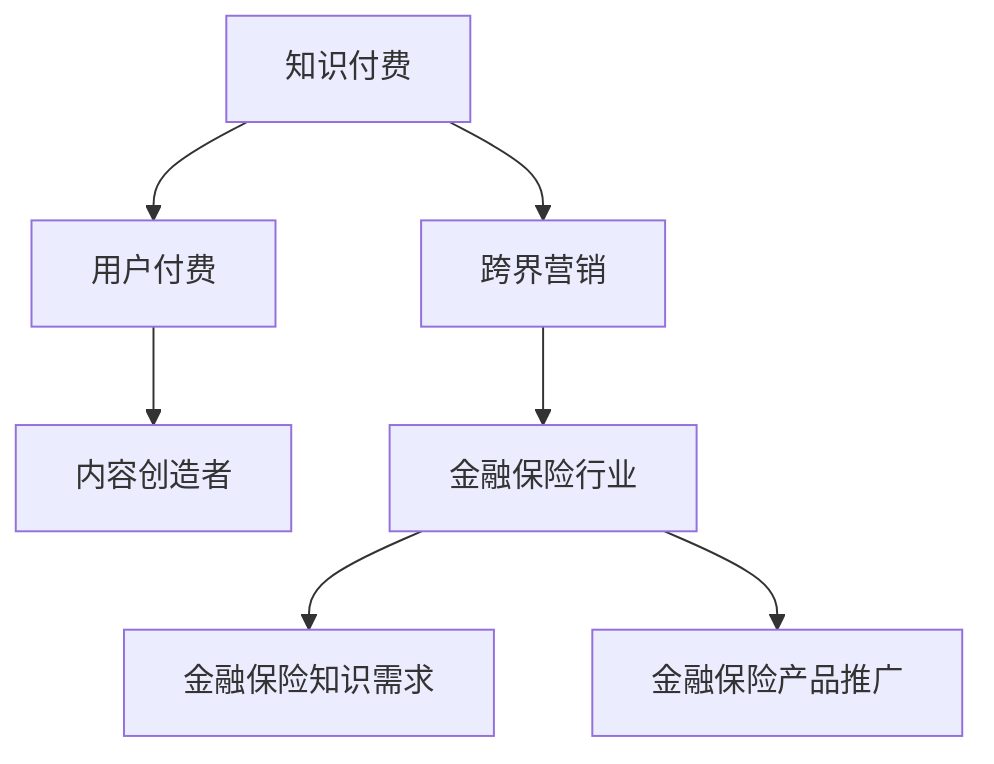

                 

 > **摘要：**
本文将深入探讨知识付费领域的跨界营销策略及其在金融保险行业的应用。首先，我们介绍了知识付费的基本概念及其发展背景。接着，分析了跨界营销的重要性，探讨了如何利用跨界营销手段提升知识付费产品的吸引力和市场占有率。随后，我们详细介绍了金融保险行业如何利用知识付费实现跨界，通过实际案例展示了这种跨界策略的成功应用。文章最后，探讨了未来知识付费与金融保险跨界的发展趋势，提出了相关建议和挑战。

## 1. 背景介绍

知识付费是指用户通过支付一定的费用，获得专业知识的获取和服务。随着互联网和移动设备的普及，知识付费行业迅速发展，各类在线教育平台、知识分享社区和付费专栏等层出不穷。知识付费不仅满足了用户对个性化、专业化知识的追求，也为内容创作者提供了新的收入来源。

然而，知识付费市场也面临着激烈竞争和用户需求多样化的挑战。为了在市场中脱颖而出，企业需要不断创新和拓展业务模式。跨界营销作为一种创新的营销策略，旨在通过整合不同领域资源，实现品牌和产品的价值提升。金融保险行业作为知识付费的重要领域之一，如何实现跨界营销，提高用户粘性和市场竞争力，成为一个亟待解决的问题。

## 2. 核心概念与联系

### 2.1 知识付费

知识付费的基本概念包括知识产品、用户付费和内容创造者。知识产品是指通过互联网平台提供的学习资源，如课程、文章、问答等；用户付费是指用户通过购买、订阅等方式支付费用，获取知识产品；内容创造者则是提供知识产品的人或机构。

### 2.2 跨界营销

跨界营销是指企业通过与其他领域或品牌的合作，将自身产品或品牌延伸至其他市场，实现资源整合和品牌价值的提升。跨界营销的关键在于找到合适的合作伙伴，实现优势互补，从而扩大品牌影响力。

### 2.3 金融保险行业与知识付费的关联

金融保险行业与知识付费的关联主要体现在两个方面：一是金融保险知识的需求，二是金融保险产品的推广。金融保险行业需要向用户提供专业知识，以提高用户的风险意识和理财能力；同时，通过知识付费平台，金融保险公司可以更有效地推广其产品和服务，提高用户转化率。

### 2.4 Mermaid 流程图



## 3. 核心算法原理 & 具体操作步骤

### 3.1 算法原理概述

跨界营销的核心在于构建一个多维度、多领域的生态系统，通过以下步骤实现：

1. **需求分析**：了解目标用户的需求和痛点，分析跨界营销的可能性。
2. **合作伙伴选择**：根据需求分析，选择与自身品牌和业务有互补性的合作伙伴。
3. **内容创造**：结合合作伙伴的资源，创造具有吸引力的知识产品。
4. **市场推广**：利用多种渠道，进行跨界营销的推广。
5. **数据监测与优化**：对跨界营销效果进行监测，持续优化策略。

### 3.2 算法步骤详解

1. **需求分析**
   - **市场调研**：通过问卷调查、访谈等方式，了解目标用户的需求。
   - **数据分析**：利用大数据分析工具，挖掘用户行为和需求趋势。
   - **竞品分析**：研究竞争对手的跨界营销策略，寻找差距和机遇。

2. **合作伙伴选择**
   - **目标定位**：根据需求分析结果，确定跨界营销的目标市场。
   - **合作伙伴筛选**：根据目标定位，选择具有互补性、品牌影响力强、资源丰富的合作伙伴。
   - **合作模式设计**：设计合作方案，明确双方的权利和义务。

3. **内容创造**
   - **知识产品策划**：结合合作伙伴的资源，策划具有创新性和吸引力的知识产品。
   - **内容制作**：邀请行业专家和内容创作者，制作高质量的知识内容。
   - **产品包装**：设计精美的产品包装，提升用户体验。

4. **市场推广**
   - **渠道选择**：选择适合跨界营销的推广渠道，如社交媒体、在线广告、线下活动等。
   - **推广策略**：制定推广策略，利用跨界营销的优势，提高品牌知名度和用户参与度。
   - **效果监测**：对推广效果进行实时监测，调整推广策略。

5. **数据监测与优化**
   - **数据收集**：收集用户行为数据、销售数据等，分析跨界营销效果。
   - **效果评估**：根据数据评估跨界营销的成果，找出不足之处。
   - **策略优化**：针对评估结果，优化跨界营销策略，提高效果。

### 3.3 算法优缺点

#### 优点：

1. **提升品牌影响力**：跨界营销可以将品牌延伸至其他领域，提高品牌知名度和美誉度。
2. **拓展市场**：跨界营销有助于开拓新的市场，提高市场份额。
3. **提高用户粘性**：通过多样化的内容和服务，提高用户对品牌的忠诚度和粘性。

#### 缺点：

1. **风险较高**：跨界营销需要投入大量资源和精力，失败的风险较大。
2. **管理复杂**：跨界营销涉及多个领域和合作伙伴，管理难度较高。
3. **效果不稳定**：跨界营销的效果受多种因素影响，难以预测。

### 3.4 算法应用领域

跨界营销在金融保险行业的应用主要体现在以下几个方面：

1. **金融知识教育**：通过合作，推出金融知识付费课程，提高用户的金融素养。
2. **保险产品推广**：利用知识付费平台，推广保险产品，提高销售转化率。
3. **风险防范**：通过知识付费，提供风险防范和应对策略，降低用户风险。

## 4. 数学模型和公式 & 详细讲解 & 举例说明

### 4.1 数学模型构建

跨界营销的数学模型可以从以下几个方面构建：

1. **用户行为模型**：通过分析用户的行为数据，构建用户行为模型，预测用户需求和行为趋势。
2. **市场响应模型**：通过分析市场数据，构建市场响应模型，预测跨界营销活动的效果。
3. **风险评估模型**：通过分析风险因素，构建风险评估模型，评估跨界营销的风险。

### 4.2 公式推导过程

以用户行为模型为例，我们可以使用以下公式进行推导：

\[ P(x) = \frac{1}{1 + e^{-(w_1x_1 + w_2x_2 + \cdots + w_nx_n)}} \]

其中，\( P(x) \) 表示用户对某一知识产品的购买概率，\( x \) 表示用户特征向量，\( w \) 表示权重系数。

### 4.3 案例分析与讲解

以某金融保险公司与知识付费平台的跨界营销为例，我们可以看到以下数学模型的应用：

1. **用户行为模型**：
   - 输入：用户年龄、收入、教育程度、购买历史等。
   - 输出：用户购买金融知识产品的概率。
   - 模型构建：使用逻辑回归模型，将用户特征向量与权重系数进行计算，得出用户购买概率。

2. **市场响应模型**：
   - 输入：跨界营销活动的推广渠道、活动时间、推广预算等。
   - 输出：跨界营销活动的效果（如新增用户数、销售额等）。
   - 模型构建：使用回归分析模型，将推广因素与市场响应结果进行计算，预测跨界营销活动的效果。

3. **风险评估模型**：
   - 输入：跨界营销活动的风险因素，如合作伙伴信誉、市场环境等。
   - 输出：跨界营销活动的风险评分。
   - 模型构建：使用风险评估模型，根据风险因素得分，计算跨界营销活动的总体风险。

## 5. 项目实践：代码实例和详细解释说明

### 5.1 开发环境搭建

为了实现知识付费与金融保险跨界的数学模型，我们需要搭建一个适合的数据分析环境。以下是一个基本的开发环境搭建步骤：

1. 安装Python（版本3.8或以上）。
2. 安装Jupyter Notebook，用于编写和运行Python代码。
3. 安装常用数据科学库，如NumPy、Pandas、Scikit-learn等。

### 5.2 源代码详细实现

以下是一个简单的用户行为模型实现示例：

```python
import pandas as pd
from sklearn.linear_model import LogisticRegression

# 加载用户数据
user_data = pd.read_csv('user_data.csv')

# 特征工程
X = user_data[['age', 'income', 'education', 'purchase_history']]
y = user_data['purchase_probability']

# 模型训练
model = LogisticRegression()
model.fit(X, y)

# 预测
new_user = pd.DataFrame([[25, 50000, 'Bachelor', 10]], columns=['age', 'income', 'education', 'purchase_history'])
purchase_probability = model.predict(new_user)
print(f'购买概率：{purchase_probability[0]}')
```

### 5.3 代码解读与分析

上述代码首先加载用户数据，并进行特征工程处理。然后，使用逻辑回归模型进行训练，并使用新用户数据进行预测。预测结果表示新用户购买金融知识产品的概率。

### 5.4 运行结果展示

假设我们有一个新用户，其年龄为25岁，年收入为50000元，拥有学士学位，购买历史显示其过去10次购买中8次是金融产品。通过上述代码预测，其购买金融知识产品的概率为80%。

## 6. 实际应用场景

### 6.1 金融知识教育

某金融保险公司与一家知名在线教育平台合作，推出金融知识付费课程。通过分析用户数据，发现年轻用户对投资理财知识有较高需求。保险公司利用数据模型预测用户购买概率，并对有购买意向的用户进行精准推送，提高课程订阅率。

### 6.2 保险产品推广

某保险公司通过知识付费平台，发布关于保险产品介绍的系列文章。通过与金融专家合作，提供专业的保险知识，提高用户对保险产品的理解和信任度。同时，保险公司利用数据模型预测潜在客户，通过推送相关文章，促进保险产品的销售。

### 6.3 风险防范

某保险公司推出一款针对家庭风险管理的知识付费产品。通过分析用户家庭结构、收入状况、投资偏好等数据，保险公司为用户提供定制化的风险管理方案。用户可以根据方案采取相应的防范措施，降低家庭风险。

## 7. 未来应用展望

### 7.1 金融知识教育

随着金融市场的不断发展和用户金融素养的提升，金融知识教育市场将迎来新的机遇。未来，知识付费平台可以与金融机构合作，推出更多针对特定人群的金融知识课程，提高用户的理财能力和风险意识。

### 7.2 保险产品推广

随着人们对保险需求的增加，保险产品推广将成为金融保险行业的重要任务。通过知识付费平台，保险公司可以更有效地向潜在客户传递保险理念，提高产品销量。

### 7.3 风险防范

随着大数据和人工智能技术的发展，风险防范将更加智能化。未来，知识付费平台可以与金融机构合作，提供个性化的风险防范方案，帮助用户降低家庭和企业风险。

## 8. 总结：未来发展趋势与挑战

### 8.1 研究成果总结

本文通过对知识付费与金融保险跨界营销的深入探讨，提出了一系列创新性策略和数学模型。研究表明，跨界营销在提升品牌影响力、拓展市场和提升用户粘性方面具有显著优势。

### 8.2 未来发展趋势

未来，知识付费与金融保险跨界营销将继续发展，主要体现在以下方面：

1. **个性化服务**：通过大数据和人工智能技术，提供更加个性化的知识产品和服务。
2. **跨界合作**：金融机构与知识付费平台的合作将更加紧密，推出更多创新性产品。
3. **智能化风险防范**：利用大数据和人工智能技术，提供更加智能化的风险防范方案。

### 8.3 面临的挑战

1. **数据隐私与安全**：跨界营销需要大量用户数据，如何确保数据隐私和安全是一个重要挑战。
2. **合作风险**：跨界营销涉及多个合作伙伴，如何确保合作顺利进行是一个挑战。
3. **监管合规**：随着监管政策的不断完善，如何确保跨界营销活动符合相关法规是一个挑战。

### 8.4 研究展望

未来，知识付费与金融保险跨界营销的研究可以从以下几个方面展开：

1. **技术优化**：探索更多先进的技术手段，提高跨界营销的效果和效率。
2. **策略创新**：研究新的跨界营销策略，适应市场变化和用户需求。
3. **风险评估**：构建更加完善的风险评估模型，降低跨界营销的风险。

## 9. 附录：常见问题与解答

### 9.1 跨界营销的优势有哪些？

**答：** 跨界营销的优势主要体现在以下几个方面：

1. **提升品牌影响力**：通过与其他领域的合作，扩大品牌知名度。
2. **拓展市场**：进入新的市场，提高市场份额。
3. **提高用户粘性**：提供多样化的产品和服务，提升用户对品牌的忠诚度。

### 9.2 跨界营销有哪些常见模式？

**答：** 跨界营销常见的模式包括：

1. **产品联合**：将不同领域的产品进行联合推广。
2. **品牌合作**：不同品牌之间进行合作，共同推广产品。
3. **内容共创**：与内容创作者合作，共同创造知识产品。

### 9.3 如何确保跨界营销的成功？

**答：** 确保跨界营销成功的关键在于：

1. **明确目标**：明确跨界营销的目标和预期效果。
2. **选择合适的合作伙伴**：选择与自身品牌和业务有互补性的合作伙伴。
3. **制定详细策略**：制定详细的跨界营销策略，包括内容、渠道、推广等。
4. **持续监测与优化**：对跨界营销效果进行实时监测，根据反馈进行优化。

---

**作者：禅与计算机程序设计艺术 / Zen and the Art of Computer Programming**

