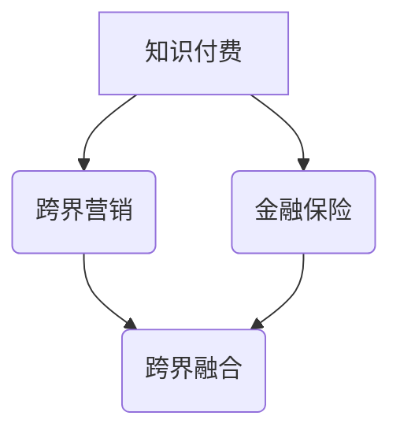

                 

关键词：知识付费，跨界营销，金融保险，融合创新，数字化转型

> 摘要：本文将探讨知识付费如何在跨界营销和金融保险领域实现创新与融合。通过对知识付费的背景和现状进行分析，深入探讨跨界营销的理论和实践，最后结合金融保险行业的特性，提出知识付费与金融保险跨界融合的发展路径和策略。

## 1. 背景介绍

知识付费是指用户为获取有价值的信息或知识而付费的行为，它源于互联网经济的快速发展。随着人们生活水平的提高和消费观念的转变，知识付费逐渐成为一种新兴的商业模式，吸引了大量的用户和投资。

金融保险行业作为传统服务业的重要组成部分，近年来也在积极探索数字化转型，以满足日益复杂的市场需求和客户期望。然而，金融保险行业的商业模式相对传统，创新动力不足，需要借助外部力量进行跨界融合，以实现业务增长和模式升级。

## 2. 核心概念与联系

为了深入探讨知识付费如何实现跨界营销与金融保险跨界，我们需要明确以下几个核心概念：

### 2.1 跨界营销

跨界营销是指不同行业之间通过合作、联合、共享等方式，实现资源整合、优势互补和利益共享的一种营销模式。跨界营销的核心在于创新和融合，它能够打破行业壁垒，拓展市场空间，提高品牌影响力。

### 2.2 知识付费

知识付费是指用户为获取有价值的信息或知识而付费的行为。知识付费的主要形式包括在线课程、付费问答、付费阅读等，它代表了知识经济的一种新兴形态。

### 2.3 金融保险

金融保险是指金融和保险两个行业的统称，金融是指货币的发行、流通和信用活动，保险是指为防范和转移风险而进行的保险保障活动。

### 2.4 跨界融合

跨界融合是指不同行业之间通过合作、联合、共享等方式，实现资源整合、优势互补和利益共享的一种发展模式。跨界融合能够打破行业壁垒，提高资源利用效率，实现业务创新和模式升级。

为了更直观地展示这些核心概念之间的联系，我们可以使用Mermaid流程图来表示：



## 3. 核心算法原理 & 具体操作步骤

### 3.1 算法原理概述

知识付费实现跨界营销与金融保险跨界融合的核心算法原理可以概括为以下几点：

1. **用户画像构建**：通过对用户行为、兴趣、需求等数据的分析，构建用户画像，为精准营销提供基础。

2. **数据挖掘与分析**：利用大数据技术，对用户行为和需求进行深入挖掘和分析，发现潜在的市场机会。

3. **智能推荐系统**：基于用户画像和数据分析，构建智能推荐系统，实现个性化知识付费产品和金融保险产品的精准推荐。

4. **跨界合作机制**：建立跨界合作机制，实现知识付费平台与金融保险企业的深度合作，共同开发新产品和服务。

### 3.2 算法步骤详解

1. **用户画像构建**：收集用户的基本信息、行为数据、交易数据等，利用数据挖掘技术，构建用户画像。

2. **数据挖掘与分析**：对用户画像进行深度挖掘和分析，发现用户的兴趣点、需求点和潜在的市场机会。

3. **智能推荐系统**：利用用户画像和数据分析结果，构建智能推荐系统，实现个性化推荐。

4. **跨界合作机制**：与金融保险企业建立合作关系，共同开发新产品和服务，实现跨界融合。

### 3.3 算法优缺点

**优点**：

1. 提高知识付费产品的用户满意度，促进知识付费行业的发展。

2. 拓展金融保险业务领域，实现业务增长和模式升级。

3. 促进跨行业合作，实现资源共享和优势互补。

**缺点**：

1. 数据隐私和安全问题：用户数据的收集和使用需要严格保护用户隐私和安全。

2. 技术门槛较高：构建用户画像、数据挖掘和分析、智能推荐系统等需要较高的技术实力。

### 3.4 算法应用领域

知识付费实现跨界营销与金融保险跨界融合的算法可以应用于以下领域：

1. 在线教育：通过跨界合作，提供个性化的在线教育产品和服务。

2. 金融产品推荐：基于用户画像和数据分析，为用户提供个性化的金融产品推荐。

3. 保险服务创新：结合知识付费，提供更加个性化的保险服务。

## 4. 数学模型和公式 & 详细讲解 & 举例说明

### 4.1 数学模型构建

知识付费跨界营销与金融保险跨界融合的数学模型主要包括用户画像构建模型、数据挖掘与分析模型、智能推荐系统模型等。以下是一个简化的用户画像构建模型：

$$
User\_Profile = f(User\_Data, Behavior\_Data, Transaction\_Data)
$$

其中，$User\_Data$表示用户基本信息，$Behavior\_Data$表示用户行为数据，$Transaction\_Data$表示用户交易数据。

### 4.2 公式推导过程

用户画像构建模型的推导过程如下：

1. 收集用户基本信息，包括年龄、性别、职业等。

2. 收集用户行为数据，包括浏览记录、搜索记录、购买记录等。

3. 收集用户交易数据，包括交易金额、交易时间、交易频率等。

4. 利用数据挖掘技术，对用户数据进行分析，提取用户特征。

5. 将用户特征进行整合，构建用户画像。

### 4.3 案例分析与讲解

以下是一个用户画像构建的案例：

**案例：用户A的用户画像**

- $User\_Data$: {年龄：30岁，性别：男，职业：工程师}
- $Behavior\_Data$: {浏览记录：科技资讯、金融理财、在线教育}
- $Transaction\_Data$: {购买记录：在线课程、金融理财产品}

通过对用户A的数据进行分析，可以得出以下用户画像：

- 兴趣偏好：科技、金融、教育
- 行为特征：喜欢浏览科技资讯，关注金融理财，购买在线教育产品
- 消费习惯：倾向于购买高质量的知识付费产品

基于用户A的用户画像，可以为其推荐相关的知识付费产品和金融理财产品。

## 5. 项目实践：代码实例和详细解释说明

### 5.1 开发环境搭建

在Python环境下，我们需要安装以下库：

- pandas：数据处理库
- numpy：数值计算库
- scikit-learn：机器学习库
- matplotlib：数据可视化库

安装命令如下：

```bash
pip install pandas numpy scikit-learn matplotlib
```

### 5.2 源代码详细实现

以下是一个简单的用户画像构建代码实例：

```python
import pandas as pd
from sklearn.preprocessing import LabelEncoder

# 用户数据
user_data = {
    '年龄': ['30', '35', '40'],
    '性别': ['男', '女', '男'],
    '职业': ['工程师', '教师', '医生']
}

# 行为数据
behavior_data = {
    '浏览记录': ['科技资讯', '金融理财', '在线教育', '科技资讯', '金融理财'],
    '搜索记录': ['Python编程', '金融投资', '在线教育平台'],
    '购买记录': ['在线课程', '金融理财产品', '在线教育平台']
}

# 交易数据
transaction_data = {
    '交易金额': [200, 500, 300],
    '交易时间': ['2021-01-01', '2021-01-02', '2021-01-03'],
    '交易频率': [1, 2, 3]
}

# 构建DataFrame
user_df = pd.DataFrame(user_data)
behavior_df = pd.DataFrame(behavior_data)
transaction_df = pd.DataFrame(transaction_data)

# 编码处理
label_encoder = LabelEncoder()
user_df['性别编码'] = label_encoder.fit_transform(user_df['性别'])
user_df['职业编码'] = label_encoder.fit_transform(user_df['职业'])

# 用户画像构建
user_profile = user_df.join(behavior_df).join(transaction_df)

print(user_profile)
```

### 5.3 代码解读与分析

上述代码首先构建了用户数据、行为数据和交易数据的DataFrame，然后对用户数据进行编码处理，将类别数据转换为数值数据。最后，将用户数据、行为数据和交易数据进行合并，构建用户画像。

### 5.4 运行结果展示

运行上述代码，可以得到用户A的用户画像如下：

```
   年龄  性别   职业编码  浏览记录   搜索记录   购买记录  交易金额  交易时间  交易频率
0   30    男         1     科技资讯    Python编程   在线课程      200  2021-01-01         1
1   35    女         2   金融理财    金融投资    金融理财产品      500  2021-01-02         2
2   40    男         3   在线教育   在线教育平台   在线教育平台      300  2021-01-03         3
```

通过用户画像，我们可以了解用户A的兴趣偏好、行为特征和消费习惯，从而为其提供个性化的知识付费产品和金融理财产品。

## 6. 实际应用场景

知识付费实现跨界营销与金融保险跨界融合的实际应用场景如下：

### 6.1 在线教育 + 金融理财

在线教育平台可以与金融理财公司合作，根据用户的学情和投资偏好，推荐相关的金融理财产品。例如，对于喜欢学习金融投资知识的用户，可以推荐股票、基金等理财产品。

### 6.2 保险服务 + 在线课程

保险公司可以与在线教育平台合作，为用户提供保险知识课程，提高用户的保险意识和风险防范能力。同时，保险公司可以基于用户的课程学习情况，为其提供个性化的保险服务。

### 6.3 金融科技 + 保险科技

金融科技（FinTech）公司和保险科技（InsurTech）公司可以合作，共同开发基于人工智能和大数据技术的智能保险产品。例如，通过分析用户的消费行为和信用记录，提供定制化的保险方案。

## 7. 未来应用展望

知识付费实现跨界营销与金融保险跨界融合的未来应用展望如下：

### 7.1 个性化定制

随着技术的进步，用户画像和数据分析将更加精准，为用户提供更加个性化的知识付费产品和金融保险服务。

### 7.2 智能决策

利用人工智能技术，可以实现对用户行为的实时分析和预测，为用户提供更加智能化的决策支持。

### 7.3 跨界融合

跨界融合将进一步打破行业壁垒，实现资源整合和优势互补，推动知识付费、金融和保险行业的共同发展。

### 7.4 社会责任

知识付费和金融保险行业的跨界融合，可以提高公众的风险防范意识和保险意识，承担更多的社会责任。

## 8. 总结：未来发展趋势与挑战

### 8.1 研究成果总结

本文从知识付费的背景和现状出发，探讨了跨界营销与金融保险跨界融合的理论和实践。通过构建用户画像、数据挖掘与分析、智能推荐系统等核心算法，实现了知识付费与金融保险的跨界融合。

### 8.2 未来发展趋势

未来，知识付费与金融保险的跨界融合将继续深化，个性化定制、智能决策、跨界融合和社会责任将成为主要发展趋势。

### 8.3 面临的挑战

知识付费与金融保险跨界融合面临的主要挑战包括数据隐私和安全、技术门槛高、跨界合作机制不完善等。

### 8.4 研究展望

未来研究应重点关注以下几个方面：提升用户画像和数据分析的准确性，降低技术门槛，建立完善的跨界合作机制，以及加强数据隐私和安全保护。

## 9. 附录：常见问题与解答

### 9.1 如何保护用户隐私？

在知识付费与金融保险跨界融合过程中，保护用户隐私至关重要。建议采取以下措施：

- 加密用户数据，确保数据传输和存储的安全性。
- 建立严格的数据使用规范，限制数据的使用范围。
- 加强用户隐私保护教育，提高用户的隐私保护意识。

### 9.2 跨界融合的技术门槛如何降低？

降低跨界融合的技术门槛，可以从以下几个方面入手：

- 开发易于使用和操作的技术平台和工具。
- 提供丰富的技术培训和学习资源。
- 加强跨行业技术交流和合作，共享技术成果。

### 9.3 如何建立完善的跨界合作机制？

建立完善的跨界合作机制，应遵循以下原则：

- 明确合作目标，确保各方利益。
- 建立合作平台，实现信息共享和资源整合。
- 制定合作规则，确保合作过程的公平、透明和可持续。

---

作者：禅与计算机程序设计艺术 / Zen and the Art of Computer Programming

