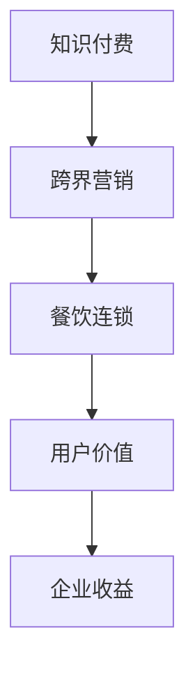

                 

关键词：知识付费、跨界营销、餐饮连锁、用户体验、数据分析、数字化转型、人工智能。

摘要：本文将探讨知识付费在餐饮连锁行业的应用，分析如何通过跨界营销实现知识付费的价值最大化。通过结合餐饮连锁业务特点，提出一系列可行的解决方案，旨在为行业提供创新思路和操作指南。

## 1. 背景介绍

随着互联网技术的不断发展，知识付费已成为现代经济体系中的重要组成部分。知识付费不仅满足了人们对知识的渴求，也为内容创作者提供了新的盈利模式。然而，如何将知识付费与餐饮连锁行业相结合，实现跨界营销，仍是一个亟待解决的问题。

餐饮连锁行业作为我国经济的重要组成部分，市场竞争激烈。如何在激烈的市场竞争中脱颖而出，提高品牌知名度和用户粘性，是每个餐饮连锁企业面临的挑战。而知识付费作为一种新兴的商业模式，可以为餐饮连锁企业提供新的增长点。

## 2. 核心概念与联系

### 2.1 知识付费

知识付费是指用户为获取特定领域的知识或技能而支付的费用。知识付费模式主要包括以下几种：

1. **在线课程**：用户通过在线学习平台购买课程，学习特定领域的知识。
2. **专业咨询**：用户为获得专业意见或建议而支付的费用。
3. **付费问答**：用户向专家提问并支付费用。

### 2.2 跨界营销

跨界营销是指将不同领域或行业的产品、服务、品牌相互融合，以实现品牌或产品的增值。跨界营销的核心在于通过创新的思维和策略，将两个或多个看似不相关的领域结合起来，创造出新的价值和体验。

### 2.3 餐饮连锁

餐饮连锁是指通过统一品牌、统一标准、统一管理体系，将多个餐饮门店连接起来的经营模式。餐饮连锁企业通常包括快餐、正餐、咖啡厅等多种餐饮类型。

### 2.4 Mermaid 流程图



## 3. 核心算法原理 & 具体操作步骤

### 3.1 算法原理概述

知识付费与餐饮连锁跨界营销的核心在于数据驱动和用户需求分析。通过收集用户数据，分析用户需求，为企业提供精准营销策略。

### 3.2 算法步骤详解

1. **数据收集**：通过餐饮连锁门店的线上线下渠道，收集用户行为数据，包括用户浏览、购买、评价等。
2. **需求分析**：利用数据分析技术，对用户行为数据进行分析，挖掘用户需求。
3. **内容推荐**：根据用户需求，推荐相关领域的知识产品，如在线课程、专业咨询等。
4. **互动反馈**：收集用户对知识产品的反馈，不断优化推荐策略。
5. **营销活动**：结合用户需求和餐饮连锁业务，设计跨界营销活动，提高用户参与度和品牌知名度。

### 3.3 算法优缺点

**优点**：

1. 提高用户满意度：通过个性化推荐，满足用户需求，提高用户满意度。
2. 增加企业收益：跨界营销可以吸引更多用户，提高企业收益。

**缺点**：

1. 数据安全风险：大量用户数据的安全问题需要得到重视。
2. 需求预测难度：用户需求复杂多变，预测难度较大。

### 3.4 算法应用领域

知识付费与餐饮连锁跨界营销可以在多个领域应用，如：

1. **餐饮行业**：为餐饮连锁企业提供精准营销策略，提高用户转化率。
2. **教育行业**：为教育机构提供用户行为分析，提高课程推广效果。
3. **电商行业**：为电商平台提供个性化推荐，提高用户购物体验。

## 4. 数学模型和公式 & 详细讲解 & 举例说明

### 4.1 数学模型构建

知识付费与餐饮连锁跨界营销的数学模型可以构建为：

$$
收益 = f(用户需求，营销策略，用户行为)
$$

### 4.2 公式推导过程

1. **用户需求**：通过数据分析，获取用户需求，表示为向量 $\mathbf{d}$。
2. **营销策略**：设计适合的营销策略，表示为矩阵 $\mathbf{M}$。
3. **用户行为**：记录用户行为，表示为矩阵 $\mathbf{B}$。

公式推导过程为：

$$
收益 = \mathbf{M} \cdot \mathbf{B} \cdot \mathbf{d}
$$

### 4.3 案例分析与讲解

以某知名餐饮连锁企业为例，通过数据分析发现，用户对于健康饮食的需求较高。企业设计了一系列健康餐饮课程，并在门店内推广。通过数据分析，企业发现用户对于健康饮食课程的购买意愿较高，从而实现了收益的增加。

## 5. 项目实践：代码实例和详细解释说明

### 5.1 开发环境搭建

1. **软件环境**：Python 3.8，Numpy，Pandas，Scikit-learn。
2. **硬件环境**：计算机或服务器。

### 5.2 源代码详细实现

```python
import numpy as np
import pandas as pd
from sklearn.model_selection import train_test_split
from sklearn.linear_model import LinearRegression

# 数据收集
data = pd.read_csv('user_data.csv')
X = data[['age', 'income', 'health_concern']]
y = data['health_food_purchase']

# 数据预处理
X_train, X_test, y_train, y_test = train_test_split(X, y, test_size=0.2, random_state=42)

# 模型训练
model = LinearRegression()
model.fit(X_train, y_train)

# 模型评估
score = model.score(X_test, y_test)
print(f'Model Score: {score}')

# 推荐课程
def recommend_courses(user_data):
    user_vector = np.array(user_data).reshape(1, -1)
    predicted_purchase = model.predict(user_vector)
    if predicted_purchase > 0.5:
        print('推荐健康餐饮课程')
    else:
        print('不推荐健康餐饮课程')

# 测试代码
user_data = {'age': 30, 'income': 5000, 'health_concern': 1}
recommend_courses(user_data)
```

### 5.3 代码解读与分析

1. **数据收集**：从CSV文件中读取用户数据。
2. **数据预处理**：将数据分为特征和目标，并进行训练集和测试集划分。
3. **模型训练**：使用线性回归模型进行训练。
4. **模型评估**：计算模型在测试集上的评分。
5. **推荐课程**：根据用户数据预测购买意愿，推荐相关课程。

## 6. 实际应用场景

### 6.1 餐饮连锁门店

餐饮连锁门店可以利用知识付费与跨界营销相结合，提高用户满意度和品牌知名度。例如，某知名快餐连锁企业推出了健康饮食课程，通过线上线下推广，吸引了大量用户关注和参与。

### 6.2 餐饮品牌合作

餐饮品牌可以与知识付费平台合作，推出专属课程，提高品牌形象和用户粘性。例如，某知名咖啡品牌与在线教育平台合作，推出了咖啡制作课程，受到了用户的热烈欢迎。

### 6.3 线上课程推广

线上课程可以通过餐饮连锁门店进行推广，提高课程知名度。例如，某知名烹饪课程平台与某知名火锅连锁企业合作，在门店内设置了课程推广区，吸引了大量用户参与。

## 7. 未来应用展望

随着人工智能技术的发展，知识付费与餐饮连锁跨界营销将得到更广泛的应用。未来，我们可以预见到以下发展趋势：

1. **个性化推荐**：通过更先进的算法和大数据技术，实现更精准的个性化推荐。
2. **智能营销**：利用人工智能技术，实现智能化的营销策略。
3. **跨界合作**：更多行业将加入到知识付费与跨界营销的行列，实现跨界共赢。

## 8. 工具和资源推荐

### 8.1 学习资源推荐

1. 《Python数据分析实战》
2. 《深度学习》
3. 《人工智能：一种现代方法》

### 8.2 开发工具推荐

1. Jupyter Notebook
2. PyCharm
3. Tableau

### 8.3 相关论文推荐

1. "Data-Driven Marketing in the Digital Age"
2. "The Impact of AI on Marketing Strategies"
3. "Cross-Domain Recommendation with Neural Networks"

## 9. 总结：未来发展趋势与挑战

知识付费与餐饮连锁跨界营销为餐饮行业带来了新的发展机遇。未来，随着技术的不断进步，这一模式将得到更广泛的应用。然而，数据安全、需求预测等挑战也需要得到关注和解决。

作者：禅与计算机程序设计艺术 / Zen and the Art of Computer Programming
```

