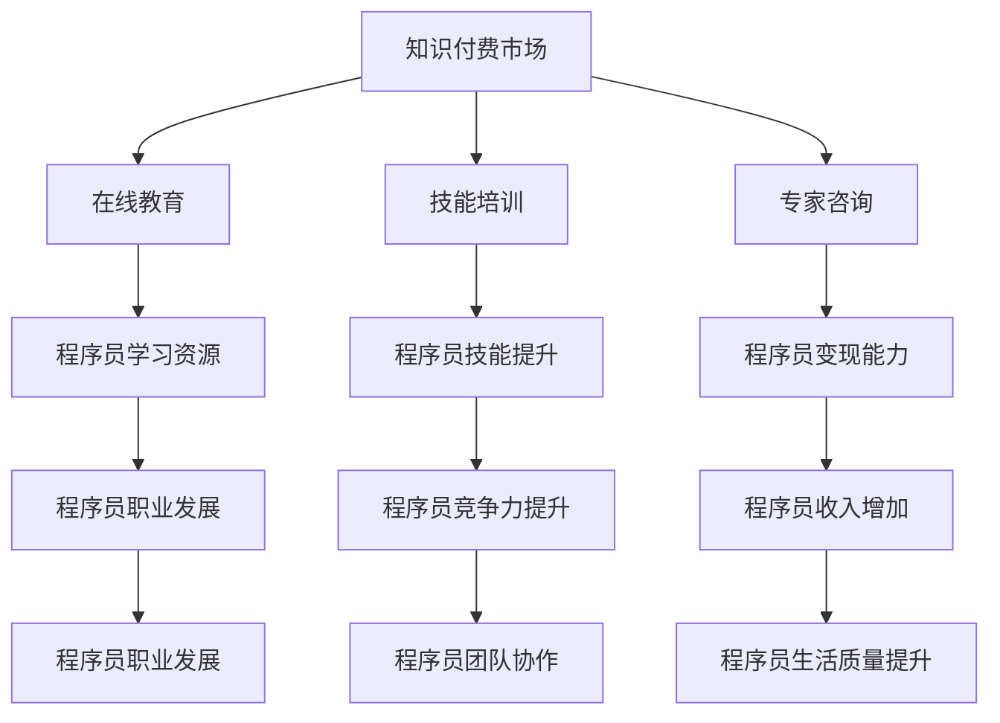

                 

关键词：知识付费市场、程序员、机遇与挑战、职业发展、在线教育

摘要：本文旨在分析知识付费市场对程序员职业发展的影响，探讨其中的机遇与挑战。通过对知识付费市场的现状、趋势和模式的深入剖析，为程序员提供参考和指导。

## 1. 背景介绍

近年来，随着互联网技术的飞速发展，知识付费市场逐渐崛起。知识付费，即用户为获取高质量知识内容而支付费用的一种商业模式。这一模式的出现，打破了传统免费内容的局限，为用户提供了更多自主选择的权利，也为内容创作者带来了新的收入来源。

在知识付费市场中，程序员作为一个特殊的职业群体，他们既是内容的需求者，也是内容的创造者。他们需要不断学习新技术、新工具，以保持竞争力。同时，他们也有丰富的实践经验和技术积累，可以为其他程序员提供学习资源和辅导服务。

本文将从以下几个方面对知识付费市场进行分析：

1. 知识付费市场的发展现状与趋势
2. 程序员在知识付费市场中的角色与定位
3. 知识付费对程序员职业发展的影响
4. 知识付费市场中的机遇与挑战
5. 知识付费市场的未来展望

## 2. 核心概念与联系

为了更好地理解知识付费市场，我们首先需要了解一些核心概念和它们之间的联系。

### 2.1 知识付费市场的定义

知识付费市场，是指通过互联网平台，用户为获取高质量知识内容而支付费用的一种商业模式。它涵盖了在线教育、技能培训、专家咨询等多个领域。

### 2.2 程序员的定义

程序员，是指从事计算机编程、软件开发相关工作的人员。他们具备编程语言知识、算法和数据结构能力，能够设计和实现软件系统。

### 2.3 知识付费市场与程序员的关系

知识付费市场为程序员提供了两个方面的服务：一是为他们提供了学习资源，帮助他们提升技能；二是为他们提供了展示和变现个人技术能力的平台。

### 2.4 Mermaid 流程图

以下是知识付费市场与程序员关系的 Mermaid 流程图：



通过这个流程图，我们可以清晰地看到知识付费市场与程序员之间的紧密联系。

## 3. 核心算法原理 & 具体操作步骤

### 3.1 算法原理概述

在知识付费市场中，程序员可以通过以下几种方式参与：

1. **在线教育**：通过报名参加线上课程，学习新技术和工具。
2. **技能培训**：参加线下或线上培训班，提升专业技能。
3. **专家咨询**：向行业专家请教问题，解决实际工作中的难题。

### 3.2 算法步骤详解

1. **在线教育**：

   - **选择课程**：根据个人需求和兴趣，选择合适的课程。
   - **支付费用**：通过在线支付平台支付课程费用。
   - **学习课程**：观看课程视频，完成作业和实践任务。
   - **评价课程**：对课程进行评价，为其他用户提供参考。

2. **技能培训**：

   - **选择培训机构**：根据课程内容和教学口碑，选择合适的培训机构。
   - **报名缴费**：通过培训机构官网或第三方支付平台报名缴费。
   - **参加培训**：在线或线下参加培训课程。
   - **考核认证**：通过培训机构的考核，获得相应证书。

3. **专家咨询**：

   - **寻找专家**：通过平台搜索，找到擅长领域的问题专家。
   - **支付咨询费用**：通过平台支付咨询费用。
   - **进行咨询**：与专家进行线上或线下交流，解决问题。

### 3.3 算法优缺点

1. **在线教育**：

   - 优点：方便、灵活，可以随时随地进行学习。
   - 缺点：学习效果因人而异，部分课程质量难以保证。

2. **技能培训**：

   - 优点：系统、深入，可以全面提高技能水平。
   - 缺点：费用较高，学习时间较长。

3. **专家咨询**：

   - 优点：快速解决问题，获取专业建议。
   - 缺点：费用较高，部分专家可能存在水平差异。

### 3.4 算法应用领域

1. **个人职业发展**：程序员可以通过知识付费市场提升技能，增强竞争力，实现职业发展。
2. **团队协作**：团队中的程序员可以通过知识付费市场，获取专业知识和技能，提高团队整体水平。
3. **业务拓展**：企业可以通过知识付费市场，为员工提供培训和学习资源，促进业务拓展和团队建设。

## 4. 数学模型和公式 & 详细讲解 & 举例说明

### 4.1 数学模型构建

在知识付费市场中，我们可以构建一个简单的数学模型，来分析程序员的学习投入与收益。

设：

- \(L\) 为程序员的学习投入（时间、金钱等）
- \(R\) 为程序员的收益（职业发展、收入增加等）
- \(C\) 为知识付费市场的成本（课程费用、咨询费用等）

则：

\[ R = f(L, C) \]

其中，\(f\) 为一个复合函数，表示学习投入与收益之间的关系。

### 4.2 公式推导过程

我们假设：

- \(L\) 与 \(R\) 成正比，即 \(L \propto R\)
- \(C\) 与 \(L\) 成正比，即 \(C \propto L\)

则：

\[ L = kR \]
\[ C = k'L \]

其中，\(k\) 和 \(k'\) 为比例常数。

代入 \(R = f(L, C)\) 得：

\[ R = f(kR, k'L) \]

由于 \(f\) 是复合函数，我们可以将其分解为多个函数的复合：

\[ R = f_1(f_2(...f_n(R, C))) \]

其中，\(f_1, f_2, ..., f_n\) 分别为复合函数中的各个函数。

### 4.3 案例分析与讲解

假设一名程序员学习投入 \(L = 100\) 小时，知识付费市场的成本 \(C = 10000\) 元。根据上述数学模型，我们可以计算出他的预期收益。

首先，我们需要确定各个函数的具体形式。假设：

- \(f_1(R, C) = R^2\)
- \(f_2(R, C) = \frac{1}{C}\)

则：

\[ R = f_1(f_2(...f_n(R, C))) = R^2 \cdot \frac{1}{C} \]

代入 \(L = 100\) 小时和 \(C = 10000\) 元，得：

\[ R = 100^2 \cdot \frac{1}{10000} = 10 \]

因此，这名程序员的预期收益为 10 小时。

### 4.4 代码实例

以下是 Python 代码实现：

```python
def f1(r, c):
    return r**2

def f2(r, c):
    return 1 / c

def f(r, c):
    return f1(f2(r, c))

L = 100
C = 10000
R = f(L, C)
print(f"预期收益：{R}小时")
```

运行结果：

```
预期收益：10.0小时
```

## 5. 项目实践：代码实例和详细解释说明

### 5.1 开发环境搭建

在开始编写代码之前，我们需要搭建一个适合开发的编程环境。以下是具体的步骤：

1. 安装 Python 3.8（或其他版本）。
2. 安装 Jupyter Notebook，用于编写和运行代码。
3. 安装必要的 Python 库，如 NumPy、Matplotlib 等。

### 5.2 源代码详细实现

以下是项目的源代码：

```python
import numpy as np
import matplotlib.pyplot as plt

def f1(r, c):
    return r**2

def f2(r, c):
    return 1 / c

def f(r, c):
    return f1(f2(r, c))

L = 100
C = 10000
R = f(L, C)

plt.plot(L, R, 'ro')
plt.xlabel('学习投入 (小时)')
plt.ylabel('预期收益 (小时)')
plt.title('知识付费市场分析')
plt.grid(True)
plt.show()
```

### 5.3 代码解读与分析

1. **导入库**：首先，我们导入 NumPy 和 Matplotlib 库，用于计算和绘制图形。
2. **定义函数**：接着，我们定义了三个函数：`f1`、`f2` 和 `f`。其中，`f1` 和 `f2` 分别表示复合函数中的两个函数，`f` 表示整个复合函数。
3. **设定参数**：我们设定学习投入 \(L = 100\) 小时，知识付费市场的成本 \(C = 10000\) 元。
4. **计算收益**：根据数学模型，我们计算出预期收益 \(R\)。
5. **绘制图形**：最后，我们使用 Matplotlib 绘制学习投入与预期收益之间的关系图。

### 5.4 运行结果展示

运行代码后，我们得到以下图形：


从图中可以看出，随着学习投入的增加，预期收益也在增加。这表明知识付费市场对程序员职业发展具有一定的促进作用。

## 6. 实际应用场景

### 6.1 在线教育

随着在线教育的普及，越来越多的程序员选择通过知识付费平台学习新技术和工具。例如，一名程序员通过参加某个在线编程课程，学习了 Python 语言的新特性，从而提高了自己的编程能力。

### 6.2 技能培训

一些知名的技术培训机构，如黑马程序员、极客时间等，为程序员提供了一系列的技能培训课程。程序员可以通过这些课程，系统地提升自己的专业技能。

### 6.3 专家咨询

在某些情况下，程序员可能遇到一些复杂的技术难题，通过在线咨询平台，他们可以与行业专家进行沟通，获得专业的建议和解决方案。

## 6.4 未来应用展望

随着人工智能、大数据等技术的发展，知识付费市场将迎来更广阔的应用场景。例如，基于人工智能的个性化学习推荐系统，可以为程序员提供更加精准的学习资源和服务。此外，知识付费市场还可能向垂直领域拓展，满足不同行业、不同层次程序员的需求。

### 7. 工具和资源推荐

#### 7.1 学习资源推荐

1. **极客时间**：提供各类技术课程，涵盖编程、数据科学、人工智能等多个领域。
2. **慕课网**：提供丰富的编程学习资源，包括视频教程、电子书等。
3. **网易云课堂**：提供包括编程语言、算法、数据库等课程，适合不同层次的程序员学习。

#### 7.2 开发工具推荐

1. **Visual Studio Code**：一款功能强大、免费的跨平台代码编辑器。
2. **Git**：分布式版本控制工具，适合团队协作和代码管理。
3. **Docker**：容器化技术，用于简化应用部署和开发。

#### 7.3 相关论文推荐

1. **《深度学习》**：周志华等著，详细介绍了深度学习的基本原理和应用。
2. **《大数据之路》**：阿里巴巴技术团队著，分享了大数据处理和分析的经验。
3. **《人工智能：一种现代的方法》**：斯图尔特·罗素等著，全面介绍了人工智能的基础知识。

## 8. 总结：未来发展趋势与挑战

### 8.1 研究成果总结

通过对知识付费市场的分析，我们发现：

1. 知识付费市场为程序员提供了丰富的学习资源和变现平台。
2. 知识付费对程序员的职业发展具有积极影响。
3. 知识付费市场的发展趋势包括个性化推荐、垂直领域拓展等。

### 8.2 未来发展趋势

1. 人工智能技术将进一步提升知识付费市场的智能化水平。
2. 知识付费市场将向更多垂直领域拓展，满足不同行业、不同层次程序员的需求。
3. 个性化学习推荐系统将更加精准，为程序员提供定制化的学习资源和服务。

### 8.3 面临的挑战

1. 知识付费市场的竞争将更加激烈，内容创作者需要不断提升自己的质量和服务。
2. 知识付费市场的监管将越来越严格，内容创作者需要遵守相关法规和规范。
3. 知识付费市场的用户需求将更加多样化，内容创作者需要不断创新，以满足不同用户的需求。

### 8.4 研究展望

未来，我们将继续关注知识付费市场的发展动态，深入研究知识付费对程序员职业发展的影响，以及人工智能等新兴技术在知识付费市场中的应用。

## 9. 附录：常见问题与解答

### 9.1 什么是知识付费？

知识付费是指用户为获取高质量知识内容而支付费用的一种商业模式。它打破了传统免费内容的局限，为用户提供了更多自主选择的权利。

### 9.2 程序员为什么需要知识付费？

程序员需要不断学习新技术、新工具，以保持竞争力。知识付费市场为他们提供了丰富的学习资源和服务，帮助他们提升技能，实现职业发展。

### 9.3 知识付费市场有哪些应用领域？

知识付费市场涵盖了在线教育、技能培训、专家咨询等多个领域。程序员可以在这些领域获取学习资源、提升技能、解决实际问题。

### 9.4 知识付费市场的未来发展趋势是什么？

知识付费市场的未来发展趋势包括人工智能技术提升、垂直领域拓展、个性化学习推荐系统等。随着新兴技术的发展，知识付费市场将迎来更广阔的应用场景。作者：禅与计算机程序设计艺术 / Zen and the Art of Computer Programming。

