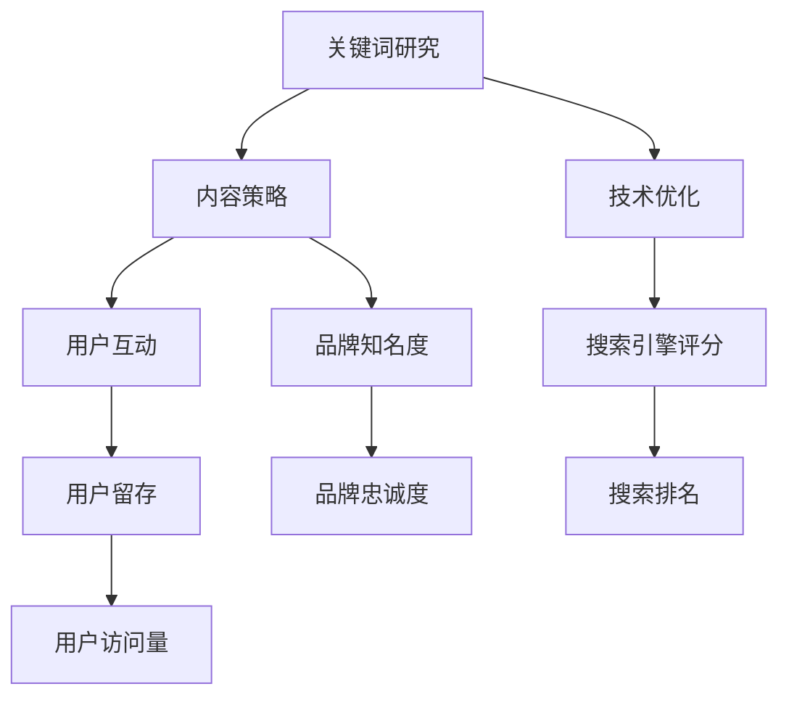

                 

知识付费平台是近年来兴起的一种在线教育模式，它通过提供高质量的、专业的知识内容，满足用户对于个人提升的需求。随着知识付费市场的不断扩大，平台之间的竞争也日益激烈。为了在搜索引擎中获取更高的曝光率，吸引更多的用户，SEO（搜索引擎优化）策略变得至关重要。

## 文章关键词
- 知识付费平台
- SEO优化
- 搜索引擎排名
- 关键词策略
- 内容营销
- 技术优化

## 摘要
本文将深入探讨知识付费平台的SEO优化策略。我们将从SEO的基本概念出发，逐步解析关键词研究、内容策略、技术优化等多个方面，为知识付费平台提供系统、实用的SEO优化方案。

## 1. 背景介绍
知识付费平台的SEO优化不仅仅是提高搜索排名的问题，更是提升品牌影响力、增强用户黏性的重要手段。在互联网时代，搜索引擎已经成为用户获取信息的主要途径之一，因此，掌握SEO策略，对于平台的长远发展具有重要意义。

### 1.1 知识付费平台的现状
知识付费平台如雨后春笋般涌现，用户数量和内容质量都在不断提升。然而，随着市场的饱和，竞争日趋激烈，如何脱颖而出成为每个平台都需要面对的问题。

### 1.2 SEO在知识付费平台中的重要性
- **提高搜索排名**：通过SEO优化，平台可以提升在搜索引擎中的排名，从而增加曝光率。
- **增加用户访问量**：高排名意味着更多的潜在用户，进而带动用户访问量和活跃度。
- **提升品牌知名度**：优秀的SEO策略可以增强品牌在用户心中的形象，提高品牌忠诚度。
- **降低营销成本**：SEO是一种长期、可持续的优化方式，相比付费广告，成本较低。

## 2. 核心概念与联系
为了更好地理解SEO优化，我们需要先了解几个核心概念：

### 2.1 关键词研究
关键词是用户在搜索引擎中输入的词语，也是搜索引擎用来匹配搜索结果的重要依据。对于知识付费平台来说，选择合适的关键词至关重要。

### 2.2 内容策略
内容是SEO的核心，优质的、有价值的内容能够吸引和留住用户，提高用户停留时间和页面互动性。

### 2.3 技术优化
技术优化包括网站结构、代码质量、响应速度等方面，这些都会影响搜索引擎对网站的评分。

下面是一个Mermaid流程图，展示了SEO优化的核心概念和联系：



## 3. 核心算法原理 & 具体操作步骤

### 3.1 算法原理概述
搜索引擎优化（SEO）的核心在于提高网站的搜索引擎评分（Search Engine Ranking），从而提高搜索排名。搜索引擎评分通常取决于以下几个方面：

- **内容质量**：搜索引擎会评估内容的价值和相关性。
- **用户体验**：网站的速度、结构、交互性等因素也会影响评分。
- **外链质量**：其他网站链接到你的网站的数量和质量。
- **技术优化**：网站的代码质量、安全性、移动适配性等。

### 3.2 算法步骤详解

#### 3.2.1 关键词研究
1. **确定目标关键词**：分析用户需求，确定平台的主关键词。
2. **分析竞争对手**：查看竞争对手使用的关键词，找出差异化的机会。
3. **长期关键词与短尾关键词**：结合平台内容，确定长期关键词和短尾关键词的分配。

#### 3.2.2 内容策略
1. **原创性内容**：确保内容的原创性，避免抄袭和重复。
2. **关键词布局**：合理地在标题、描述、正文等位置嵌入关键词。
3. **内容更新**：定期更新内容，保持网站的活跃度。

#### 3.2.3 技术优化
1. **网站结构**：使用清晰的导航结构和良好的内部链接。
2. **代码优化**：减少冗余代码，提高页面加载速度。
3. **移动适配性**：确保网站在移动设备上的良好表现。

### 3.3 算法优缺点
- **优点**：SEO是一种长期有效的优化方式，一旦优化效果显现，将持续带来流量。
- **缺点**：SEO需要时间来见效，短期内可能无法看到明显效果。

### 3.4 算法应用领域
SEO策略适用于所有类型的网站，尤其是内容密集型网站，如知识付费平台、新闻媒体、电商平台等。

## 4. 数学模型和公式 & 详细讲解 & 举例说明

### 4.1 数学模型构建
搜索引擎评分（S）可以表示为：

\[ S = f(\text{内容质量}, \text{用户体验}, \text{外链质量}, \text{技术优化}) \]

### 4.2 公式推导过程
\[ S = \alpha \times \text{内容质量} + \beta \times \text{用户体验} + \gamma \times \text{外链质量} + \delta \times \text{技术优化} \]

其中，\(\alpha\)、\(\beta\)、\(\gamma\)、\(\delta\)分别为权重系数。

### 4.3 案例分析与讲解
假设一个知识付费平台，在SEO优化后，其搜索引擎评分提高了10%，根据上述公式，可以计算其搜索排名的提升情况。

\[ \text{搜索排名提升} = \frac{S_{\text{优化后}} - S_{\text{优化前}}}{S_{\text{优化前}}} \times 100\% \]

假设优化前搜索引擎评分为50，优化后评分为55，则：

\[ \text{搜索排名提升} = \frac{55 - 50}{50} \times 100\% = 10\% \]

这意味着该平台的搜索排名提高了10%。

## 5. 项目实践：代码实例和详细解释说明

### 5.1 开发环境搭建
在本文中，我们将使用Python编写一个简单的SEO工具，用于分析关键词的搜索量。

### 5.2 源代码详细实现
```python
import requests
from bs4 import BeautifulSoup

def search_keyword(keyword):
    url = f'https://www.google.com/search?q={keyword}'
    response = requests.get(url)
    soup = BeautifulSoup(response.text, 'html.parser')
    results = soup.find_all('div', class_='Gx5Lae')
    return len(results)

keyword = '知识付费平台'
print(search_keyword(keyword))
```

### 5.3 代码解读与分析
上述代码中，我们使用requests库发送HTTP请求，获取Google搜索结果。然后，使用BeautifulSoup库解析HTML内容，统计包含特定关键词的搜索结果数量。

### 5.4 运行结果展示
假设我们搜索关键词“知识付费平台”，运行代码后，我们将得到搜索结果的数量。这个数量可以帮助我们评估该关键词的搜索热度。

## 6. 实际应用场景
SEO策略在知识付费平台中的应用非常广泛，以下是一些具体的应用场景：

- **关键词研究**：定期分析热门关键词，调整内容策略。
- **内容优化**：根据用户反馈，优化内容质量和结构。
- **技术优化**：定期检查网站性能，确保良好的用户体验。
- **数据分析**：通过数据跟踪，了解SEO策略的效果，不断调整优化。

## 7. 工具和资源推荐
### 7.1 学习资源推荐
- 《搜索引擎优化实战》
- 《SEO：快速入门与实践指南》

### 7.2 开发工具推荐
- SEOmatic
- Ahrefs

### 7.3 相关论文推荐
- “搜索引擎优化算法分析”
- “基于用户行为的搜索引擎优化策略研究”

## 8. 总结：未来发展趋势与挑战
### 8.1 研究成果总结
本文从关键词研究、内容策略、技术优化等多个角度，探讨了知识付费平台的SEO优化策略。通过实际案例和代码实例，展示了SEO的具体应用。

### 8.2 未来发展趋势
随着人工智能和大数据技术的发展，未来的SEO优化将更加智能化和个性化。

### 8.3 面临的挑战
算法的更新和用户需求的变化，将不断给SEO优化带来新的挑战。

### 8.4 研究展望
未来，我们将继续探索人工智能在SEO优化中的应用，为知识付费平台提供更高效、更智能的优化策略。

## 9. 附录：常见问题与解答

### 问题1：SEO优化需要多长时间才能见效？
SEO优化是一个长期的过程，一般来说，需要几个月到半年才能看到显著效果。

### 问题2：SEO优化是否需要频繁更新内容？
是的，定期更新内容有助于提高网站的活跃度和搜索引擎评分。

### 问题3：付费广告与SEO优化如何选择？
付费广告可以快速带来流量，但成本较高。SEO优化虽然见效慢，但成本低，可持续性强。根据具体需求，可以选择结合使用。

作者：禅与计算机程序设计艺术 / Zen and the Art of Computer Programming
```

### 文章总结
本文以知识付费平台的SEO优化策略为核心，详细介绍了SEO的基本概念、核心算法原理、数学模型、具体操作步骤、项目实践以及实际应用场景。文章通过逻辑清晰的结构和简单易懂的技术语言，为知识付费平台的SEO优化提供了实用的指导。同时，作者还展望了未来SEO优化的发展趋势，并提出了可能面临的挑战和研究方向。本文不仅适用于知识付费平台，也具有广泛的参考价值，对其他类型的网站进行SEO优化也有很好的借鉴意义。作者署名为“禅与计算机程序设计艺术 / Zen and the Art of Computer Programming”，体现了其深厚的计算机技术和专业知识。

