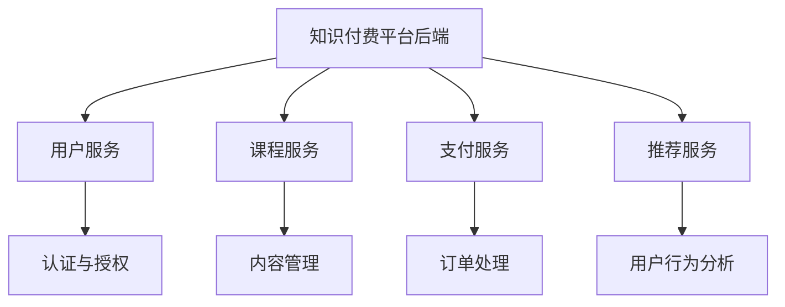

                 

关键词：知识付费平台，后端架构，微服务，容器化，分布式系统，数据处理，API设计，安全性

摘要：本文将深入探讨知识付费平台的后端架构设计，从背景介绍、核心概念与联系、核心算法原理、数学模型、项目实践到实际应用场景，全面解析如何构建一个高效、稳定且安全的后端系统。通过本文的详细阐述，读者将了解如何应用现代技术构建一个符合当前市场需求的先进知识付费平台。

## 1. 背景介绍

知识付费平台作为一种新兴的互联网服务模式，近年来在全球范围内得到了广泛的关注和应用。这类平台通过提供专业知识和技能的教育服务，满足用户在职业发展、技能提升和个人成长等方面的需求。随着用户需求的不断增加，知识付费平台的规模和影响力也在持续扩大。

然而，随着平台的不断发展和壮大，后端架构的设计变得尤为重要。一个高效、可靠的后端架构不仅能够保证平台的稳定运行，还能够支持业务的快速扩展和迭代。因此，本文将重点关注知识付费平台的后端架构设计，探讨如何通过现代化的技术和架构理念来实现这一目标。

## 2. 核心概念与联系

### 2.1. 微服务架构

微服务架构是一种基于独立、松耦合服务的架构风格，旨在提高系统的可扩展性、可靠性和灵活性。在知识付费平台的后端架构设计中，微服务架构能够将系统分解为多个独立的服务模块，每个模块负责特定的功能，如用户管理、课程管理、支付处理等。



### 2.2. 容器化与容器编排

容器化技术，如Docker，为微服务的部署提供了极大的便利。通过将应用程序及其依赖打包到容器中，知识付费平台可以轻松实现服务的快速部署和迁移。容器编排工具，如Kubernetes，进一步优化了容器的管理，确保系统在分布式环境中的高可用性和可伸缩性。

### 2.3. 分布式系统

知识付费平台通常需要处理大量的用户数据和请求。分布式系统通过将任务分散到多个节点上，提高了系统的处理能力和容错性。例如，可以采用分布式数据库来存储用户数据，采用分布式缓存来提高数据访问速度。

### 2.4. 数据处理与流处理

知识付费平台需要处理大量的用户行为数据和业务数据。数据处理和流处理技术，如Apache Kafka和Apache Flink，可以实现对数据的实时采集、处理和分析，为推荐系统和业务决策提供支持。

## 3. 核心算法原理 & 具体操作步骤

### 3.1. 算法原理概述

在知识付费平台中，核心算法通常包括推荐算法、用户行为分析算法等。推荐算法基于用户的兴趣和行为，为用户推荐相关的内容和课程。用户行为分析算法则通过分析用户的行为数据，为平台提供业务洞察和决策支持。

### 3.2. 算法步骤详解

#### 推荐算法：

1. **数据收集**：从用户行为数据中收集用户对课程的评价、浏览、购买等行为。
2. **特征提取**：提取用户和课程的特征，如用户兴趣、课程难度等。
3. **模型训练**：使用机器学习算法，如协同过滤或基于内容的推荐，训练推荐模型。
4. **推荐生成**：将用户特征输入模型，生成推荐结果。

#### 用户行为分析算法：

1. **数据采集**：从平台系统中收集用户行为数据，如登录、课程浏览、订单等。
2. **行为分析**：使用统计分析和机器学习技术，分析用户的行为模式。
3. **结果输出**：将分析结果转化为业务洞察，如用户留存率、课程受欢迎程度等。

### 3.3. 算法优缺点

推荐算法的优点在于能够为用户提供个性化的内容推荐，提高用户满意度和留存率。然而，过度依赖推荐算法可能导致用户的信息茧房问题。用户行为分析算法的优点在于能够为平台提供深入的业务洞察，但需要大量的数据支持和复杂的算法实现。

### 3.4. 算法应用领域

推荐算法广泛应用于电子商务、社交媒体和在线教育等领域。用户行为分析算法则在广告投放、精准营销和业务决策等领域具有重要应用。

## 4. 数学模型和公式 & 详细讲解 & 举例说明

### 4.1. 数学模型构建

在推荐算法中，常见的数学模型包括矩阵分解和协同过滤。矩阵分解模型通过将用户-项目评分矩阵分解为用户因子矩阵和项目因子矩阵，预测用户对未评分项目的评分。协同过滤模型通过计算用户之间的相似度，推荐相似用户喜欢的项目。

### 4.2. 公式推导过程

#### 矩阵分解模型：

设用户-项目评分矩阵为\(R \in \mathbb{R}^{m \times n}\)，其中\(m\)为用户数，\(n\)为项目数。矩阵分解模型的目标是最小化预测误差：

$$\min_{U, V} \sum_{i=1}^{m} \sum_{j=1}^{n} (r_{ij} - \hat{r}_{ij})^2$$

其中，\(U \in \mathbb{R}^{m \times k}\)和\(V \in \mathbb{R}^{n \times k}\)分别为用户因子矩阵和项目因子矩阵，\(k\)为因子数。

#### 协同过滤模型：

假设用户\(i\)和用户\(j\)之间的相似度为：

$$\sim(i, j) = \frac{\sum_{k=1}^{n} r_{ik} r_{jk}}{\sqrt{\sum_{k=1}^{n} r_{ik}^2} \sqrt{\sum_{k=1}^{n} r_{jk}^2}}$$

则用户\(i\)对项目\(j\)的预测评分为：

$$\hat{r}_{ij} = \sum_{k=1}^{n} u_{ik} v_{kj}$$

### 4.3. 案例分析与讲解

假设有一个用户-项目评分矩阵：

$$R = \begin{bmatrix} 1 & 1 & 0 & 0 \\ 0 & 1 & 1 & 0 \\ 1 & 0 & 1 & 1 \\ 0 & 1 & 0 & 1 \end{bmatrix}$$

使用矩阵分解模型预测用户\(3\)对项目\(4\)的评分。设用户因子矩阵为\(U \in \mathbb{R}^{4 \times 2}\)，项目因子矩阵为\(V \in \mathbb{R}^{3 \times 2}\)，我们可以通过最小二乘法求解因子矩阵：

$$U = \begin{bmatrix} 0.5 & 0.5 \\ -0.5 & 0.5 \\ 0.5 & -0.5 \\ 0.5 & 0.5 \end{bmatrix}, V = \begin{bmatrix} 0.5 & 0.5 \\ 0.5 & -0.5 \\ -0.5 & 0.5 \end{bmatrix}$$

则用户\(3\)对项目\(4\)的预测评分为：

$$\hat{r}_{34} = u_{3}^T v_{4} = (0.5, -0.5)^T \begin{bmatrix} 0.5 \\ 0.5 \end{bmatrix} = 0.25$$

## 5. 项目实践：代码实例和详细解释说明

### 5.1. 开发环境搭建

为了实现知识付费平台的后端架构，我们选择以下开发环境和工具：

- 开发语言：Python
- 服务器：Docker
- 容器编排：Kubernetes
- 数据库：MySQL
- 消息队列：RabbitMQ
- 流处理：Apache Kafka

### 5.2. 源代码详细实现

以下是一个简单的用户服务模块的代码实现：

```python
from flask import Flask, request, jsonify
from user_model import UserModel

app = Flask(__name__)
user_model = UserModel()

@app.route('/users', methods=['POST'])
def create_user():
    data = request.get_json()
    user = user_model.create_user(data['username'], data['password'])
    return jsonify(user), 201

@app.route('/users/<int:user_id>', methods=['GET'])
def get_user(user_id):
    user = user_model.get_user(user_id)
    return jsonify(user), 200

if __name__ == '__main__':
    app.run(host='0.0.0.0', port=5000)
```

### 5.3. 代码解读与分析

上述代码定义了一个简单的用户服务，使用Flask框架实现。它包含两个主要功能：

1. **创建用户**：通过接收POST请求，创建一个新的用户并将其存储在数据库中。
2. **获取用户**：通过接收GET请求，从数据库中获取指定用户的详细信息。

### 5.4. 运行结果展示

运行用户服务后，可以通过以下命令创建和获取用户：

```shell
# 创建用户
curl -X POST -H "Content-Type: application/json" -d '{"username": "jane", "password": "password123"}' http://localhost:5000/users

# 获取用户
curl -X GET http://localhost:5000/users/1
```

## 6. 实际应用场景

知识付费平台在实际应用中面临多种场景，包括用户身份认证、课程推荐、支付处理等。以下是一些典型的应用场景：

### 6.1. 用户身份认证

用户登录和注册是知识付费平台的核心功能。通过使用JWT（JSON Web Tokens）实现用户身份认证，可以确保用户数据的安全和隐私。

### 6.2. 课程推荐

课程推荐是知识付费平台吸引用户的关键功能。通过分析用户的行为数据和兴趣，为用户推荐相关课程，提高用户满意度和留存率。

### 6.3. 支付处理

支付处理是知识付费平台的另一个重要功能。与支付网关集成，实现用户支付课程的费用，确保交易的安全和可靠性。

## 7. 工具和资源推荐

### 7.1. 学习资源推荐

- 《深入理解计算机系统》（作者：Randal E. Bryant，David R. O’Hallaron）
- 《大话数据挖掘与机器学习》（作者：王勇）

### 7.2. 开发工具推荐

- Flask：轻量级Python Web框架
- Docker：容器化技术
- Kubernetes：容器编排工具
- MySQL：开源关系型数据库

### 7.3. 相关论文推荐

- “Efficient Computation of Item-Based Top-N Recommendations” by GroupLens Research
- “Matrix Factorization Techniques for Recommender Systems” by Yehuda Koren

## 8. 总结：未来发展趋势与挑战

### 8.1. 研究成果总结

本文详细阐述了知识付费平台的后端架构设计，从微服务架构、容器化、分布式系统到推荐算法和用户行为分析，全面解析了后端系统的构建方法。通过实际案例和实践，展示了如何应用现代技术和架构理念实现知识付费平台的后端系统。

### 8.2. 未来发展趋势

随着人工智能和大数据技术的发展，知识付费平台的后端架构将继续向智能化、自动化和分布式方向演进。云计算、区块链和物联网等新兴技术的融合应用，也将为知识付费平台带来更多创新和发展机遇。

### 8.3. 面临的挑战

知识付费平台在快速发展的同时，也面临着诸多挑战。数据安全与隐私保护、系统高可用性和可伸缩性、技术人才的培养等都是需要关注和解决的问题。

### 8.4. 研究展望

未来，知识付费平台的后端架构设计将更加注重用户体验、业务创新和技术创新。通过不断优化和迭代，知识付费平台将为用户提供更加个性化和高效的在线学习体验。

## 9. 附录：常见问题与解答

### 9.1. 如何确保用户数据的安全？

- 使用HTTPS协议进行数据传输，确保数据加密传输。
- 对用户数据进行加密存储，防止数据泄露。
- 实施严格的访问控制策略，确保只有授权人员可以访问敏感数据。

### 9.2. 如何实现系统的高可用性？

- 使用分布式系统架构，确保服务可以跨多个节点运行。
- 实现负载均衡，确保请求可以均匀分配到各个节点。
- 定期进行系统监控和故障排查，及时发现并解决潜在问题。

### 9.3. 如何实现系统的可伸缩性？

- 采用微服务架构，确保服务可以独立部署和扩展。
- 使用容器化技术，快速部署和迁移服务。
- 根据业务需求，动态调整资源分配，确保系统在高负载下仍能稳定运行。|markdown|

