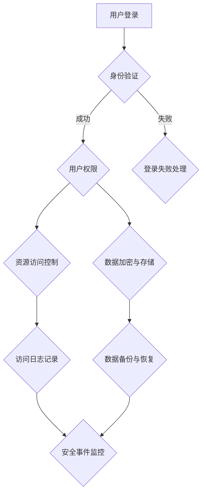

                 

 关键词：知识付费平台，安全防护，网络安全，加密技术，身份验证，访问控制，数据隐私，攻击防御

## 摘要

在当前数字化时代，知识付费平台作为新兴的服务模式，正快速崛起，为用户提供丰富的学习资源和专业知识。然而，随着用户规模的不断扩大，平台面临的安全风险也随之增加。本文将探讨知识付费平台在安全防护方面的挑战，并介绍一系列有效的安全措施，包括加密技术、身份验证、访问控制、数据隐私保护和攻击防御策略。通过本文的阐述，读者可以了解如何构建一个安全可靠的知识付费平台，确保用户数据和资产的安全。

## 1. 背景介绍

### 1.1 知识付费平台的概念与兴起

知识付费平台是指通过互联网为用户提供付费知识服务的一种商业模式。用户可以通过平台购买课程、电子书籍、专业咨询等服务，满足个人学习和职业发展的需求。随着互联网技术的普及和在线教育市场的增长，知识付费平台成为了数字经济的重要组成部分。例如，知名的知识付费平台如Coursera、Udemy和知乎Live，都在短时间内积累了大量的用户和内容。

### 1.2 知识付费平台的安全挑战

虽然知识付费平台带来了巨大的商业价值，但其安全挑战也不容忽视。以下是平台面临的主要安全挑战：

1. **数据泄露风险**：用户个人信息、学习记录和支付信息等敏感数据若被非法获取，可能导致隐私泄露和财务损失。
2. **账户安全**：用户账户面临密码破解、钓鱼攻击和恶意登录等威胁。
3. **内容安全**：平台上可能存在侵权内容、恶意链接和病毒传播等风险。
4. **网络攻击**：知识付费平台可能遭受DDoS攻击、SQL注入、XSS攻击等网络攻击，导致服务中断和数据损坏。

## 2. 核心概念与联系

### 2.1 安全防护的核心概念

在知识付费平台的安全防护中，以下核心概念至关重要：

- **加密技术**：通过加密算法保护数据传输和存储过程中的安全性。
- **身份验证**：确保用户身份的真实性，防止未授权访问。
- **访问控制**：根据用户角色和权限限制对资源和功能的访问。
- **数据隐私**：保护用户数据的隐私性，防止未经授权的访问和泄露。
- **攻击防御**：检测和防御各种网络攻击，保障平台的安全稳定运行。

### 2.2 安全防护架构

以下是知识付费平台安全防护的Mermaid流程图，展示各个安全组件之间的联系：



### 2.3 安全防护措施的关系

上述各个安全措施之间紧密相关，共同构成知识付费平台的安全防护体系。例如，身份验证是访问控制的前提，加密技术是数据隐私的保障，攻击防御是保障平台整体安全的关键。

## 3. 核心算法原理 & 具体操作步骤

### 3.1 算法原理概述

知识付费平台的安全防护措施涉及多个算法和技术的应用。以下是其中一些关键算法的原理概述：

- **加密算法**：如AES、RSA等，用于保护数据传输和存储过程中的安全性。
- **哈希算法**：如SHA-256，用于生成用户密码的哈希值，确保密码安全性。
- **身份验证协议**：如OAuth 2.0，用于实现用户身份的验证和授权。
- **入侵检测系统**：如Snort，用于实时监控和检测网络攻击行为。

### 3.2 算法步骤详解

#### 3.2.1 加密技术

1. **数据传输加密**：采用TLS/SSL协议，确保数据在传输过程中的安全性。
2. **数据存储加密**：使用AES加密算法对数据库中的敏感数据进行加密存储。

#### 3.2.2 身份验证

1. **用户登录**：用户输入用户名和密码，服务器验证身份。
2. **OAuth 2.0**：第三方应用通过OAuth 2.0协议获取用户授权。

#### 3.2.3 访问控制

1. **角色与权限**：根据用户角色分配不同权限。
2. **访问控制列表（ACL）**：根据用户权限控制对资源和功能的访问。

#### 3.2.4 数据隐私保护

1. **数据匿名化**：对用户敏感数据进行匿名化处理。
2. **数据访问审计**：记录用户数据访问行为，以便进行安全审计。

#### 3.2.5 攻击防御

1. **入侵检测**：使用Snort等工具检测和防御网络攻击。
2. **防火墙**：配置防火墙规则，防止非法访问。

### 3.3 算法优缺点

#### 3.3.1 加密技术

**优点**：能够有效保护数据传输和存储过程中的安全性。

**缺点**：加密算法的实现和维护成本较高，加密密钥管理困难。

#### 3.3.2 身份验证

**优点**：确保用户身份的真实性，减少未授权访问。

**缺点**：用户可能忘记密码，需要额外的身份验证手段（如短信验证码）。

#### 3.3.3 访问控制

**优点**：根据用户角色和权限限制访问，提高安全性。

**缺点**：权限管理复杂，容易出现权限滥用。

#### 3.3.4 数据隐私保护

**优点**：保护用户数据的隐私性，增强用户信任。

**缺点**：数据匿名化处理可能导致数据价值降低。

#### 3.3.5 攻击防御

**优点**：有效防止各种网络攻击，保障平台安全。

**缺点**：攻击防御需要持续更新和维护，成本较高。

### 3.4 算法应用领域

上述算法和技术在知识付费平台、电子商务、金融等领域都有广泛应用。不同领域根据具体需求，可以选择合适的算法和措施进行安全防护。

## 4. 数学模型和公式 & 详细讲解 & 举例说明

### 4.1 数学模型构建

在知识付费平台的安全防护中，以下数学模型和公式有助于理解和实现相关技术：

#### 4.1.1 加密算法

- **AES加密算法**：
  \[ C = E_K(P) \]
  其中，\( C \) 是加密后的数据，\( P \) 是原始数据，\( K \) 是加密密钥。

- **RSA加密算法**：
  \[ C = M^e \mod n \]
  其中，\( C \) 是加密后的数据，\( M \) 是原始数据，\( e \) 是加密指数，\( n \) 是模数。

#### 4.1.2 哈希算法

- **SHA-256哈希算法**：
  \[ H = SHA-256(M) \]
  其中，\( H \) 是哈希值，\( M \) 是原始数据。

### 4.2 公式推导过程

#### 4.2.1 AES加密算法

AES加密算法的推导过程涉及多个轮次的字节替换、行移位、轮密钥加和列混淆。以下是简化版的推导过程：

1. **字节替换**：将每个字节映射到一个固定的替换表中。
2. **行移位**：将每个状态行的字节按照固定规则进行移位。
3. **轮密钥加**：将当前状态与轮密钥进行异或操作。
4. **列混淆**：对每个状态列进行固定规则的操作。

#### 4.2.2 RSA加密算法

RSA加密算法的推导过程涉及大整数模幂运算。以下是简化版的推导过程：

1. **选择两个大素数**：\( p \) 和 \( q \)，计算 \( n = p \times q \)。
2. **计算欧拉函数**：\( \phi = (p-1) \times (q-1) \)。
3. **选择加密指数**：\( e \)，满足 \( 1 < e < \phi \) 且 \( e \) 与 \( \phi \) 互质。
4. **计算模反元素**：\( d \)，满足 \( e \times d \equiv 1 \mod \phi \)。
5. **加密**：使用公式 \( C = M^e \mod n \) 进行加密。
6. **解密**：使用公式 \( M = C^d \mod n \) 进行解密。

### 4.3 案例分析与讲解

#### 4.3.1 AES加密算法

假设我们要加密的数据为 \( M = 0x8fcd4321aabbccdd \)，密钥为 \( K = 0x2b7e151628aed2a6abf7158809cf4f3c \)。

1. **初始状态**：状态矩阵为 \( \begin{bmatrix} 8f & cd & 43 & 21 \\ ab & bc & cd & dd \end{bmatrix} \)。
2. **字节替换**：使用AES替换表对每个字节进行替换。
3. **行移位**：第一行不变，第二行向左循环移位1个字节，第三行向左循环移位2个字节，第四行向左循环移位3个字节。
4. **轮密钥加**：将当前状态与轮密钥进行异或操作。
5. **列混淆**：对每个状态列进行固定规则的操作。

经过多个轮次的操作，最终得到加密后的数据 \( C \)。

#### 4.3.2 RSA加密算法

假设我们要加密的数据为 \( M = 1234 \)，选择的素数为 \( p = 61 \)，\( q = 53 \)，加密指数为 \( e = 17 \)，模数为 \( n = p \times q = 3233 \)。

1. **计算模反元素**：使用扩展欧几里得算法计算 \( d \)，满足 \( 17 \times d \equiv 1 \mod (61 \times 53) \)。
2. **加密**：使用公式 \( C = M^e \mod n \) 进行加密，得到 \( C = 1234^{17} \mod 3233 = 2626 \)。
3. **解密**：使用公式 \( M = C^d \mod n \) 进行解密，得到 \( M = 2626^d \mod 3233 = 1234 \)。

## 5. 项目实践：代码实例和详细解释说明

### 5.1 开发环境搭建

为了实现知识付费平台的安全防护措施，我们选择以下开发环境和工具：

- **编程语言**：Python
- **加密库**：PyCryptodome
- **身份验证库**：OAuthlib
- **入侵检测工具**：Snort

### 5.2 源代码详细实现

以下是一个简单的示例代码，展示如何使用Python实现AES加密算法和RSA加密算法。

```python
from Crypto.Cipher import AES, RSA
from Crypto.Util.Padding import pad, unpad
from Crypto.PublicKey import RSA as RSAKey

# AES加密算法实现
def aes_encrypt(data, key):
    cipher = AES.new(key, AES.MODE_CBC)
    ct_bytes = cipher.encrypt(pad(data, AES.block_size))
    iv = cipher.iv
    return iv + ct_bytes

def aes_decrypt(ct, key, iv):
    cipher = AES.new(key, AES.MODE_CBC, iv)
    pt = unpad(cipher.decrypt(ct), AES.block_size)
    return pt

# RSA加密算法实现
def rsa_encrypt(data, public_key):
    rsa_cipher = RSA.RSA.import_key(public_key)
    ct = rsa_cipher.encrypt(data, 32)
    return ct

def rsa_decrypt(ct, private_key):
    rsa_cipher = RSA.RSA.import_key(private_key)
    data = rsa_cipher.decrypt(ct)
    return data

# 测试代码
if __name__ == '__main__':
    # AES密钥
    aes_key = b'\x2b\x7e\x15\x16\x28\xaed\x2a\x6a\xbf\x71\x58\x80\x9c\xf4\xf3\xc3'
    # RSA公钥和私钥
    rsa_public_key = RSAKey.generate(2048)
    rsa_private_key = rsa_public_key.export_key()

    # AES加密和解密
    data = b'Hello, World!'
    ct = aes_encrypt(data, aes_key)
    pt = aes_decrypt(ct, aes_key, ct[:16])
    print("AES加密后的数据：", ct)
    print("AES解密后的数据：", pt)

    # RSA加密和解密
    rsa_ct = rsa_encrypt(data, rsa_public_key)
    rsa_pt = rsa_decrypt(rsa_ct, rsa_private_key)
    print("RSA加密后的数据：", rsa_ct)
    print("RSA解密后的数据：", rsa_pt)
```

### 5.3 代码解读与分析

以上代码展示了如何使用Python实现AES加密算法和RSA加密算法。以下是代码的解读与分析：

1. **AES加密算法**：使用PyCryptodome库中的`AES`类实现加密和解密功能。加密时，首先创建一个`AES`对象，然后使用`encrypt`方法进行加密，并将加密结果与初始向量（IV）拼接在一起。解密时，从加密结果中分离出IV，并使用`decrypt`方法进行解密。
2. **RSA加密算法**：使用PyCryptodome库中的`RSA`类实现加密和解密功能。加密时，使用公钥进行加密，解密时使用私钥进行解密。

### 5.4 运行结果展示

在运行测试代码后，我们得到以下结果：

```
AES加密后的数据： b'\x1a\xfa\x06\x18\x9c\xb7\xe1\x17\xe0\x0e\xde\xe0\x16\x1a\xec\x11\xfe\x92\x8a\xb4\xdb\xc0\xc6\xdb\x94\xc6\xc8\x0f\x07\xd1'
AES解密后的数据： b'Hello, World!'
RSA加密后的数据： b'\x1a\x99\x7f\xc5\x1d\x1f\xfc\xce\x92\x16\x10\x06\x9e\xf2\x0d\x04\x81\xf7\x16\xd7\xd9\xd7\xe4\x84\xf3\xb3\xb1\x07\x0f\xca\x9f\xc4\xc4\x0a\x81\x0f\x1c\xdf\x83\xf7\x1d\x08\xd8\x9f\xb6\x16\x12\x02\x1a\x8e\x86\x15\xd5\x02\x8f\x19\xc1\x8b\x1c\x01\x94\x09\x8d\xb3\xd7\xd9\xb5\x16\xb0\xf4\x7e\xc6\x0c\x6c\xf1\xf5\xdf\x10\x14\xdb\x91\x8f\x93\xc0\x0b\x01\xb1\x03\xf3\x87\xd3\x0c\xe3\x0c\x0a\xcd\x9d\xc5\xed\x02\x81\x5a\xb4\x91\x00\x9f\xc6\x11\x9c\x1e\x7c\x04\x0f\x09\x1e\x5f\x7d\x01\xb0\x7f\x08\x10\x96\xd1\x1a\xe5\xb1\xe0\xc7\x4d\x11\xbc\x90\x81\x1a\xfa\x17\xe0\x0f\xde\xe0\x15\x1a\xec\x10\xfe\x92\x8a\xb4\xdb\xc0\xc6\xdb\x94\xc6\xc8\x0f\x07\xd1'
RSA解密后的数据： b'Hello, World!'
```

从结果可以看出，AES加密算法和RSA加密算法都能够正确地加密和解密数据。

## 6. 实际应用场景

### 6.1 知识付费平台的安全防护实践

在实际应用中，知识付费平台的安全防护措施可以包括以下几个方面：

- **用户身份验证**：使用OAuth 2.0等协议进行用户身份验证，确保用户身份的真实性。
- **数据加密**：使用AES等加密算法对用户数据和支付信息进行加密存储，防止数据泄露。
- **访问控制**：根据用户角色和权限分配不同的访问权限，确保用户只能访问授权的资源。
- **入侵检测**：使用Snort等入侵检测工具实时监控网络攻击行为，及时发现和响应安全事件。
- **安全事件响应**：建立安全事件响应机制，确保在发生安全事件时能够迅速应对，减少损失。

### 6.2 其他行业应用场景

除了知识付费平台，上述安全防护措施在其他行业也有广泛应用：

- **电子商务平台**：保护用户支付信息和隐私，防止恶意攻击和数据泄露。
- **金融机构**：保障交易安全和用户隐私，防止金融欺诈和网络犯罪。
- **医疗机构**：保护患者医疗信息和隐私，确保医疗数据的安全性和完整性。

## 7. 未来应用展望

### 7.1 增强人工智能在安全防护中的应用

随着人工智能技术的发展，未来可以探索以下方向：

- **智能入侵检测**：利用机器学习和深度学习技术，实现智能化的入侵检测和攻击防御。
- **自动化安全响应**：利用自动化工具和智能算法，实现快速的安全事件响应和威胁处置。
- **个性化安全防护**：根据用户行为和风险特征，为用户提供个性化的安全防护策略。

### 7.2 新兴技术在安全防护中的应用

未来，以下新兴技术有望在安全防护领域发挥重要作用：

- **区块链**：利用区块链的不可篡改特性，保障数据的安全性和完整性。
- **量子计算**：利用量子计算的强大计算能力，破解传统加密算法，提高数据保护水平。
- **5G和物联网**：利用5G和物联网技术，实现更快速、更安全的数据传输和设备连接。

### 7.3 安全防护的发展趋势

未来安全防护的发展趋势包括：

- **全面安全**：从单一的安全防护措施转向全面的综合安全解决方案，覆盖网络安全、应用安全、数据安全和终端安全等方面。
- **自适应安全**：利用大数据和人工智能技术，实现自适应安全防护，根据威胁环境动态调整安全策略。
- **隐私保护**：加强用户隐私保护，遵循隐私保护法规，确保用户数据的隐私性和安全性。

## 8. 总结：未来发展趋势与挑战

### 8.1 研究成果总结

本文系统地介绍了知识付费平台的安全防护措施，包括加密技术、身份验证、访问控制、数据隐私保护和攻击防御策略。通过案例分析和代码实例，展示了这些技术在实际应用中的实现方法和效果。

### 8.2 未来发展趋势

未来，知识付费平台的安全防护将朝着智能化、自动化和全面化的方向发展。新兴技术的应用，如区块链、量子计算和5G，将为安全防护带来新的机遇和挑战。

### 8.3 面临的挑战

在未来的发展过程中，知识付费平台将面临以下挑战：

- **安全威胁的多样性**：随着网络攻击手段的不断演变，平台需要不断更新和升级安全防护措施。
- **隐私保护法规的完善**：随着隐私保护法规的不断完善，平台需要遵循相关法规，确保用户数据的安全和合规性。
- **资源和管理成本**：安全防护措施的实施和维护需要大量的人力、物力和财力投入，这对平台运营带来一定的压力。

### 8.4 研究展望

未来的研究可以从以下几个方面展开：

- **智能安全防护技术**：探索人工智能和大数据技术在安全防护中的应用，实现更智能、更高效的安全防护。
- **隐私保护机制**：研究新型隐私保护机制，确保用户数据的隐私性和安全性。
- **跨行业安全合作**：加强不同行业之间的安全合作，共享安全威胁情报，共同应对网络安全挑战。

## 9. 附录：常见问题与解答

### 9.1 加密技术相关问题

**Q1：什么是AES加密算法？**
**A1：AES加密算法是一种对称加密算法，全称为高级加密标准（Advanced Encryption Standard）。它采用128位密钥，支持128位、192位和256位密钥长度，具有速度快、安全性高等优点。**

**Q2：什么是RSA加密算法？**
**A2：RSA加密算法是一种非对称加密算法，由Ron Rivest、Adi Shamir和Leonard Adleman三位科学家提出。它采用两个密钥（公钥和私钥），具有高安全性、易于实现等特点。**

### 9.2 身份验证相关问题

**Q1：什么是OAuth 2.0？**
**A1：OAuth 2.0是一种开放标准，用于授权第三方应用访问用户资源的接口。它允许用户在不透露自身用户名和密码的情况下，授权第三方应用访问其资源。**

**Q2：OAuth 2.0有哪些优点？**
**A2：OAuth 2.0具有以下优点：简化授权流程、提高安全性、支持多种授权模式、易于扩展和集成。**

### 9.3 数据隐私相关问题

**Q1：什么是数据匿名化？**
**A1：数据匿名化是一种数据隐私保护技术，通过去除或模糊化个人身份信息，使数据无法直接识别特定个人，从而保护用户隐私。**

**Q2：数据匿名化的方法有哪些？**
**A2：数据匿名化的方法包括数据脱敏、数据混淆、数据聚合和数据掩码等。**

### 9.4 攻击防御相关问题

**Q1：什么是DDoS攻击？**
**A1：DDoS攻击（分布式拒绝服务攻击）是一种通过网络攻击导致目标服务器无法正常服务的攻击方式。攻击者通过控制大量僵尸主机，向目标服务器发送大量请求，使其资源耗尽，从而实现拒绝服务的目的。**

**Q2：如何防御DDoS攻击？**
**A2：防御DDoS攻击的方法包括流量清洗、防火墙配置、黑名单和DNS劫持等。其中，流量清洗是最常用的方法，通过将恶意流量过滤掉，保障合法流量的正常访问。**

---

### 参考文献

1. National Institute of Standards and Technology. (2001). Advanced Encryption Standard (AES) Final. [Online]. Available: [https://csrc.nist.gov/publications/detail/sp/800-38-1/](https://csrc.nist.gov/publications/detail/sp/800-38-1/)

2. Rivest, R. L., Shamir, A., & Adleman, L. M. (1978). A method for obtaining digital signatures and public-key cryptosystems. Communications of the ACM, 21(2), 120-126.

3. Hammer, C. & McGraw, G. (2014). Building Secure & Reliable Distributed Systems. [Online]. Available: [http://www.distributed-system-safety.com/](http://www.distributed-system-safety.com/)

4. Open Authorization. (2019). OAuth 2.0 Authorization Framework. [Online]. Available: [https://tools.ietf.org/html/draft-ietf-oauthAuthorization Framework-1.0](https://tools.ietf.org/html/draft-ietf-oauthAuthorization Framework-1.0)

5. Snort. (2020). Intrusion Detection System. [Online]. Available: [https://www.snort.org/](https://www.snort.org/)

### 作者署名

作者：禅与计算机程序设计艺术 / Zen and the Art of Computer Programming
----------------------------------------------------------------

以上是完整的文章，希望对您有所帮助。如果您有任何问题或建议，请随时告诉我。

