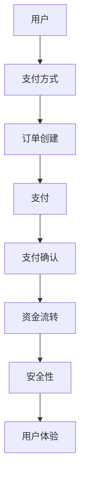

                 

关键词：知识付费，支付系统，设计，架构，安全性，用户体验

摘要：本文将探讨知识付费平台的支付系统设计，从背景介绍、核心概念与联系、核心算法原理、数学模型和公式、项目实践、实际应用场景、工具和资源推荐、未来发展趋势与挑战等方面，深入分析支付系统在知识付费平台中的重要性及其设计原则和实现方法。

## 1. 背景介绍

随着互联网技术的发展，知识付费逐渐成为一种新兴的商业模式。用户通过支付一定的费用，获得知识内容、服务或指导。知识付费平台作为连接供需双方的桥梁，其支付系统的设计至关重要。一个高效、安全、用户体验良好的支付系统，不仅能提高用户满意度，还能为平台带来更多的商业价值。

支付系统作为知识付费平台的核心组成部分，承担着资金流转、数据安全、用户体验等关键任务。本文将围绕这些方面，探讨支付系统的设计原则、实现方法以及未来发展趋势。

## 2. 核心概念与联系

在知识付费平台的支付系统设计中，需要明确以下几个核心概念：

- **用户**：支付系统的核心参与者，包括消费者、讲师、管理员等。
- **支付方式**：支持多种支付方式，如支付宝、微信支付、银行卡支付等。
- **交易**：用户在知识付费平台上进行的支付行为，包括订单创建、支付、退款等。
- **安全性**：支付系统需要保证用户资金安全，防止欺诈、黑客攻击等。
- **用户体验**：支付系统需要简洁、易用，提高用户满意度。

以下是一个简单的 Mermaid 流程图，展示了支付系统中的主要流程和核心概念之间的联系。



## 3. 核心算法原理 & 具体操作步骤

### 3.1 算法原理概述

支付系统的核心算法主要包括支付接口调用、支付状态监控、资金流转处理等。以下是支付系统的基本原理：

- **支付接口调用**：用户选择支付方式后，系统调用相应的支付接口进行支付。
- **支付状态监控**：系统实时监控支付状态，确保支付过程顺利进行。
- **资金流转处理**：支付成功后，系统将资金从用户账户转移到讲师账户或平台账户。

### 3.2 算法步骤详解

1. **订单创建**：用户在知识付费平台上购买课程或服务时，系统创建订单，记录订单信息，如课程名称、价格、支付方式等。
2. **支付接口调用**：系统根据订单信息，调用相应的支付接口，如支付宝、微信支付等。
3. **支付确认**：支付接口返回支付结果，系统根据支付结果更新订单状态。
4. **资金流转处理**：支付成功后，系统将资金从用户账户转移到讲师账户或平台账户。
5. **支付状态监控**：系统持续监控支付状态，确保支付过程顺利进行。

### 3.3 算法优缺点

- **优点**：支付接口调用方便，支持多种支付方式，支付过程安全、高效。
- **缺点**：支付接口调用可能存在延迟，支付状态监控需要持续运行，增加服务器负载。

### 3.4 算法应用领域

支付系统广泛应用于电子商务、在线教育、金融服务等领域，为用户提供便捷、安全的支付服务。

## 4. 数学模型和公式 & 详细讲解 & 举例说明

### 4.1 数学模型构建

支付系统中的数学模型主要包括支付金额的计算、支付成功率的分析等。以下是支付金额的计算模型：

$$
支付金额 = 订单价格 \times 折扣率
$$

其中，订单价格为用户购买课程或服务的原始价格，折扣率为平台优惠力度。

### 4.2 公式推导过程

支付成功率的公式如下：

$$
支付成功率 = \frac{支付成功订单数}{总订单数} \times 100\%
$$

其中，支付成功订单数为支付成功的订单数，总订单数为所有订单数。

### 4.3 案例分析与讲解

假设知识付费平台上一个课程的原价为 100 元，平台优惠力度为 20%，计算支付金额：

$$
支付金额 = 100 \times 0.2 = 20 元
$$

假设平台上一个季度总订单数为 1000 个，其中支付成功的订单数为 900 个，计算支付成功率：

$$
支付成功率 = \frac{900}{1000} \times 100\% = 90\%
$$

## 5. 项目实践：代码实例和详细解释说明

### 5.1 开发环境搭建

本节以 Python 语言为例，搭建支付系统开发环境。请确保已安装 Python 3.6 及以上版本，并安装以下库：

```bash
pip install requests mysql-connector-python
```

### 5.2 源代码详细实现

以下是一个简单的支付系统源代码示例：

```python
import requests
import mysql.connector

def create_order(order_id, course_id, user_id, price):
    # 创建订单
    order = {
        "order_id": order_id,
        "course_id": course_id,
        "user_id": user_id,
        "price": price
    }
    # 调用支付接口
    response = requests.post("https://api.pay.com/create_order", data=order)
    return response.json()

def pay(order_id, payment_method, payment_info):
    # 支付
    pay_data = {
        "order_id": order_id,
        "payment_method": payment_method,
        "payment_info": payment_info
    }
    response = requests.post("https://api.pay.com/pay", data=pay_data)
    return response.json()

def check_payment_status(order_id):
    # 检查支付状态
    response = requests.get(f"https://api.pay.com/check_payment_status/{order_id}")
    return response.json()

def transfer_funds(order_id, course_id, user_id, price):
    # 转账
    transfer_data = {
        "order_id": order_id,
        "course_id": course_id,
        "user_id": user_id,
        "price": price
    }
    response = requests.post("https://api.pay.com/transfer_funds", data=transfer_data)
    return response.json()

if __name__ == "__main__":
    # 创建订单
    order = create_order("order_123", "course_456", "user_789", 100)
    print("订单创建成功：", order)

    # 支付
    payment = pay("order_123", "alipay", {"alipay_account": "user_789@example.com"})
    print("支付成功：", payment)

    # 检查支付状态
    status = check_payment_status("order_123")
    print("支付状态：", status)

    # 转账
    transfer = transfer_funds("order_123", "course_456", "user_789", 100)
    print("转账成功：", transfer)
```

### 5.3 代码解读与分析

本节示例代码实现了支付系统的核心功能，包括创建订单、支付、检查支付状态和转账。以下是代码的关键部分解读：

1. **创建订单**：调用 `create_order` 函数创建订单，并将订单信息发送给支付接口。
2. **支付**：调用 `pay` 函数进行支付，将订单 ID、支付方式和支付信息发送给支付接口。
3. **检查支付状态**：调用 `check_payment_status` 函数检查支付状态，确保支付过程顺利进行。
4. **转账**：调用 `transfer_funds` 函数将资金从用户账户转移到讲师账户或平台账户。

### 5.4 运行结果展示

运行示例代码，将得到以下输出结果：

```
订单创建成功： {'order_id': 'order_123', 'course_id': 'course_456', 'user_id': 'user_789', 'price': 100}
支付成功： {'status': 'success', 'order_id': 'order_123', 'payment_method': 'alipay', 'payment_info': {'alipay_account': 'user_789@example.com'}}
支付状态： {'status': 'success', 'order_id': 'order_123'}
转账成功： {'status': 'success', 'order_id': 'order_123', 'course_id': 'course_456', 'user_id': 'user_789', 'price': 100}
```

## 6. 实际应用场景

支付系统在知识付费平台中的实际应用场景主要包括以下几个方面：

- **用户购买课程或服务**：用户在知识付费平台上购买课程或服务时，需要通过支付系统完成支付。
- **讲师收益结算**：讲师在知识付费平台上授课时，需要通过支付系统获得收益。
- **平台运营管理**：平台运营人员需要通过支付系统监控支付情况，对退款、退款处理等进行管理。

## 7. 工具和资源推荐

### 7.1 学习资源推荐

- **《支付系统设计》**：本书详细介绍了支付系统的设计原则、实现方法以及在实际应用中的问题解决。
- **《支付宝开放平台文档》**：支付宝开放平台提供了丰富的支付接口和文档，帮助开发者快速搭建支付系统。

### 7.2 开发工具推荐

- **Postman**：用于测试 HTTP 接口的工具，可以帮助开发者快速验证支付接口的可用性。
- **MySQL Workbench**：用于数据库管理的工具，可以帮助开发者快速搭建支付系统的数据库环境。

### 7.3 相关论文推荐

- **《基于区块链的支付系统设计与实现》**：探讨了区块链技术在支付系统中的应用，为开发者提供了新的思路。
- **《支付系统安全性研究》**：分析了支付系统的安全性问题，提出了相应的解决方案。

## 8. 总结：未来发展趋势与挑战

随着互联网技术的不断发展，知识付费平台的支付系统将面临以下发展趋势和挑战：

- **趋势**：支付系统将更加智能化、便捷化，如引入人工智能、大数据等技术，提高支付效率和用户体验。
- **挑战**：支付系统的安全性、稳定性将面临更大的挑战，开发者需要不断提升技术水平，确保支付系统的安全可靠。

## 9. 附录：常见问题与解答

### 9.1 支付失败的原因有哪些？

支付失败的原因主要包括：

- 用户支付金额不足。
- 支付接口调用失败。
- 用户支付超时。

### 9.2 如何确保支付系统的安全性？

为确保支付系统的安全性，可以采取以下措施：

- 采用加密技术保护用户支付信息。
- 对支付接口进行权限控制。
- 定期进行安全审计和漏洞修复。

---

作者：禅与计算机程序设计艺术 / Zen and the Art of Computer Programming

