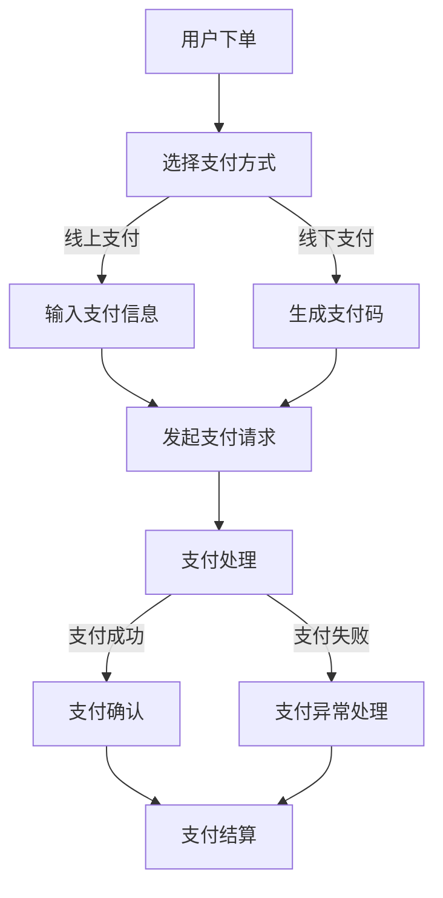

                 

知识付费已经成为当今互联网经济中一个重要的领域。随着在线教育和专业技能培训的普及，知识付费平台如雨后春笋般涌现。这些平台提供了大量的高质量内容和课程，但支付系统作为其核心组件，直接关系到用户体验和平台的可持续运营。本文将深入探讨知识付费平台的支付系统设计与集成，分析其设计原则、技术实现以及在实际应用中的挑战与优化策略。

## 文章关键词

- 知识付费
- 支付系统
- 设计原则
- 技术实现
- 用户体验
- 安全性
- 可扩展性
- 集成方案

## 文章摘要

本文首先介绍了知识付费平台的发展背景及其重要性。接着，讨论了支付系统在知识付费平台中的关键作用，并阐述了支付系统设计的基本原则。然后，详细描述了支付系统的集成方案，包括前端、后端和数据库的设计。接下来，分析了支付系统的核心算法原理和数学模型，并通过实际项目实例展示了支付系统的实现。文章还探讨了支付系统在实际应用中的挑战，并提出了优化策略。最后，对未来的发展趋势和面临的挑战进行了展望。

## 1. 背景介绍

### 知识付费平台的兴起

知识付费平台是随着互联网技术的进步和用户需求的提升而兴起的。过去，知识和技能的传播主要依靠传统的教育机构和媒体，但在线教育的兴起打破了这一格局。随着直播、短视频和互动课程等新兴教育模式的普及，知识付费市场迎来了快速增长。

根据市场研究公司的数据，全球在线教育市场规模在过去几年中持续扩大，预计到2025年将达到数千亿美元。知识付费平台如Coursera、Udemy、网易云课堂等，通过提供高质量的课程内容和灵活的学习方式，吸引了大量的用户。

### 支付系统在知识付费平台中的作用

支付系统是知识付费平台的重要组成部分，它直接影响用户的购买体验和平台的运营效率。支付系统的设计不仅要确保交易的安全性和可靠性，还需要提供便捷的支付方式，满足用户多样化的需求。

首先，支付系统的安全性至关重要。用户在进行支付时，数据的安全性是首要考虑的因素。知识付费平台需要采用加密技术、多因子认证等手段，确保用户支付过程的安全性。

其次，支付系统的便捷性也是用户体验的关键。知识付费平台需要支持多种支付方式，如信用卡、支付宝、微信支付等，以满足不同用户的需求。同时，支付流程应尽可能简化，减少用户的操作步骤，提升支付成功率。

最后，支付系统的可靠性直接影响到平台的运营效率。支付系统需要能够处理大量的并发交易，确保交易的高效和准确。平台还需要实时监控支付系统的运行状态，及时发现并解决潜在的问题。

## 2. 核心概念与联系

### 支付系统的核心概念

支付系统主要包括以下核心概念：

- **支付渠道**：支付渠道是指用户进行支付时使用的途径，包括线上和线下支付方式。
- **支付方式**：支付方式是指用户支付时选择的具体方式，如信用卡、支付宝、微信支付等。
- **支付流程**：支付流程是指用户从选择支付方式到完成支付的全过程，包括支付请求、支付处理、支付确认等环节。
- **支付安全**：支付安全是指保护支付过程的数据安全和资金安全，防止欺诈和盗刷等行为。
- **支付结算**：支付结算是指将用户的支付款项转入平台账户的过程，包括支付验证、资金结算等环节。

### 支付系统架构的Mermaid流程图



### 支付系统架构的联系

支付系统架构中的各个组件通过支付流程相互联系。用户在下单后选择支付方式，通过输入支付信息或扫描支付码发起支付请求。支付请求经过支付处理模块处理后，返回支付结果。支付成功后，进入支付确认环节，然后进行支付结算。如果支付失败或出现异常，则进入支付异常处理环节，根据具体情况采取相应的措施。

## 3. 核心算法原理 & 具体操作步骤

### 3.1 算法原理概述

支付系统的核心算法主要包括支付请求处理和支付结果验证。支付请求处理算法用于处理用户的支付请求，包括数据验证、支付请求转发和支付结果反馈。支付结果验证算法用于验证支付结果，确保支付的安全性和准确性。

### 3.2 算法步骤详解

#### 3.2.1 支付请求处理

1. **数据验证**：首先对用户的支付请求进行数据验证，包括支付金额、支付方式、用户信息等，确保数据的完整性和准确性。

2. **支付请求转发**：将验证通过后的支付请求转发给支付渠道进行处理。不同支付渠道的处理流程可能有所不同，但总体上包括支付请求发送、支付结果接收和支付状态更新。

3. **支付结果反馈**：支付渠道处理完成后，将支付结果返回给支付系统。支付系统根据支付结果进行相应的操作，如支付成功则记录支付信息，支付失败则提示用户重新支付。

#### 3.2.2 支付结果验证

1. **支付结果验证**：对支付结果进行验证，包括支付金额、支付方式、支付状态等，确保支付结果的准确性和安全性。

2. **支付确认**：支付结果验证通过后，向用户发送支付确认信息，如支付成功通知、支付金额等。

3. **支付结算**：支付确认后，进行支付结算，将支付款项转入平台账户。

### 3.3 算法优缺点

#### 优点

1. **安全性高**：采用加密技术和多因子认证等手段，确保支付过程的安全性和资金安全。

2. **灵活性高**：支持多种支付方式和支付渠道，满足不同用户的需求。

3. **可靠性高**：支付系统能够处理大量的并发交易，确保交易的高效和准确。

#### 缺点

1. **复杂性高**：支付系统涉及到多个组件和环节，设计和实现较为复杂。

2. **维护成本高**：支付系统需要不断更新和优化，以应对新的支付方式和安全威胁。

### 3.4 算法应用领域

支付系统广泛应用于各类电商平台、在线教育平台、金融服务平台等领域。在知识付费平台中，支付系统用于处理用户的课程购买、支付验证和支付结算等操作，确保用户能够便捷、安全地进行支付。

## 4. 数学模型和公式 & 详细讲解 & 举例说明

### 4.1 数学模型构建

支付系统的数学模型主要包括支付金额计算、支付成功率预测和支付风险控制等。

#### 4.1.1 支付金额计算

支付金额 = 课程价格 × 折扣

其中，课程价格是固定的，折扣是根据平台活动或用户等级等因素动态调整的。

#### 4.1.2 支付成功率预测

支付成功率 = (支付成功次数 ÷ 支付尝试次数) × 100%

支付成功率用于评估支付系统的稳定性和可靠性。通过分析支付尝试次数和支付成功次数，可以预测未来的支付成功率。

#### 4.1.3 支付风险控制

支付风险控制模型用于识别和防范支付过程中的风险，包括欺诈行为、异常交易等。常用的支付风险控制模型包括逻辑回归、决策树、神经网络等。

### 4.2 公式推导过程

#### 4.2.1 支付金额计算

支付金额计算的公式推导过程如下：

设课程价格为P，折扣为D，则支付金额A可以表示为：

A = P × D

其中，P和D均为常数。

#### 4.2.2 支付成功率预测

支付成功率预测的公式推导过程如下：

设支付成功次数为S，支付尝试次数为T，则支付成功率R可以表示为：

R = (S ÷ T) × 100%

其中，S和T均为非负整数。

#### 4.2.3 支付风险控制

支付风险控制模型的推导过程涉及多个因素，包括用户行为特征、交易特征、风险评分等。常见的支付风险控制模型包括逻辑回归、决策树、神经网络等。以下是逻辑回归模型的推导过程：

设用户i的交易特征为X_i，风险评分为Y_i，则逻辑回归模型的公式为：

P(Y_i = 1 | X_i) = 1 ÷ (1 + e^(-θ·X_i))

其中，θ为模型参数，e为自然底数。

### 4.3 案例分析与讲解

#### 4.3.1 支付金额计算案例

假设某知识付费平台的课程价格为100元，用户参加平台活动获得8折优惠，则支付金额为：

A = 100 × 0.8 = 80元

#### 4.3.2 支付成功率预测案例

某知识付费平台在过去一个月内共有100次支付尝试，其中成功80次，则支付成功率为：

R = (80 ÷ 100) × 100% = 80%

#### 4.3.3 支付风险控制案例

某用户在进行支付时，其交易特征包括消费金额、交易时间、设备信息等，通过逻辑回归模型计算得到的风险评分为0.6，则根据模型设定，该用户的支付风险较低。

## 5. 项目实践：代码实例和详细解释说明

### 5.1 开发环境搭建

在进行支付系统开发前，需要搭建合适的开发环境。以下是一个基本的开发环境搭建步骤：

1. 安装操作系统：可以选择Linux、macOS或Windows等操作系统。

2. 安装编程语言：根据项目需求选择合适的编程语言，如Java、Python等。

3. 安装开发工具：安装IDE（集成开发环境），如Eclipse、PyCharm等。

4. 安装数据库：选择合适的数据库管理系统，如MySQL、PostgreSQL等。

5. 安装相关依赖：安装项目所需的第三方库和框架，如Spring Boot、Hibernate等。

### 5.2 源代码详细实现

以下是一个简单的支付系统实现示例，使用Java和Spring Boot框架：

```java
@RestController
@RequestMapping("/api/payments")
public class PaymentController {

    @Autowired
    private PaymentService paymentService;

    @PostMapping("/create")
    public ResponseEntity<?> createPayment(@RequestBody PaymentRequest request) {
        try {
            PaymentResponse response = paymentService.createPayment(request);
            return ResponseEntity.ok(response);
        } catch (Exception e) {
            return ResponseEntity.badRequest().body("Payment creation failed: " + e.getMessage());
        }
    }

    @PostMapping("/verify")
    public ResponseEntity<?> verifyPayment(@RequestBody PaymentVerifyRequest request) {
        try {
            boolean isValid = paymentService.verifyPayment(request);
            return ResponseEntity.ok(isValid);
        } catch (Exception e) {
            return ResponseEntity.badRequest().body("Payment verification failed: " + e.getMessage());
        }
    }
}

@Service
public class PaymentService {

    @Autowired
    private PaymentRepository paymentRepository;

    public PaymentResponse createPayment(PaymentRequest request) {
        // 数据验证和处理
        // 创建支付记录
        Payment payment = new Payment();
        payment.setAmount(request.getAmount());
        payment.setCurrency(request.getCurrency());
        payment.setCustomer(request.getCustomer());
        payment.setStatus(PaymentStatus.PENDING);

        paymentRepository.save(payment);

        // 发起支付请求
        PaymentResponse response = new PaymentResponse();
        response.setPaymentId(payment.getId());
        response.setStatus(PaymentStatus.PENDING);

        return response;
    }

    public boolean verifyPayment(PaymentVerifyRequest request) {
        // 验证支付请求
        // 查询支付记录
        Payment payment = paymentRepository.findById(request.getPaymentId())
                .orElseThrow(() -> new RuntimeException("Payment not found"));

        // 比较支付金额和支付结果
        return payment.getAmount().equals(request.getAmount())
                && payment.getStatus().equals(PaymentStatus.SUCCESS);
    }
}
```

### 5.3 代码解读与分析

#### PaymentController

`PaymentController` 类负责处理支付相关的HTTP请求，包括创建支付和验证支付。创建支付时，会调用 `PaymentService` 的 `createPayment` 方法，并将返回的 `PaymentResponse` 包装为 `ResponseEntity` 返回给客户端。验证支付时，会调用 `PaymentService` 的 `verifyPayment` 方法，并根据返回结果判断是否成功。

#### PaymentService

`PaymentService` 类负责处理支付业务逻辑。`createPayment` 方法用于创建支付记录，包括验证请求、创建支付记录并保存到数据库。`verifyPayment` 方法用于验证支付结果，包括查询支付记录和比较支付金额。

### 5.4 运行结果展示

在开发环境中运行上述代码，可以使用Postman等工具模拟客户端请求，以下是一个创建支付的示例请求：

```
POST /api/payments/create
Content-Type: application/json

{
    "amount": 100.00,
    "currency": "USD",
    "customer": "customer123"
}
```

返回结果：

```
{
    "paymentId": "1",
    "status": "PENDING"
}
```

接下来，可以模拟一个支付验证的请求：

```
POST /api/payments/verify
Content-Type: application/json

{
    "paymentId": "1",
    "amount": 100.00
}
```

返回结果：

```
true
```

## 6. 实际应用场景

### 6.1 线上课程购买

在线上课程购买场景中，用户通过知识付费平台浏览课程，选择感兴趣的课程并加入购物车。当用户决定购买时，会跳转到支付页面，选择支付方式并完成支付。支付成功后，用户可以立即访问课程内容。

### 6.2 专业技能培训

专业技能培训通常涉及较为复杂的培训课程和认证考试。用户在报名参加培训时，需要通过支付系统完成报名支付。支付系统会记录用户的培训进度和考试成绩，并在用户完成培训后发放证书。

### 6.3 在线咨询

在线咨询是知识付费平台提供的一项增值服务。用户可以通过支付系统预约专家进行在线咨询，支付系统会记录咨询的时间和内容，并提供回访和评价功能。

### 6.4 未来应用展望

随着互联网技术的不断发展，知识付费平台的支付系统将迎来更多应用场景。例如，虚拟现实（VR）培训、人工智能（AI）课程等新兴领域，都将引入支付系统来支持在线购买和服务交付。

## 7. 工具和资源推荐

### 7.1 学习资源推荐

1. **《支付系统设计》**：这是一本关于支付系统设计的经典教材，涵盖了支付系统的基本原理、架构设计和实现技术。

2. **《互联网金融技术》**：本书详细介绍了互联网金融领域的技术应用，包括支付系统、区块链、大数据等。

### 7.2 开发工具推荐

1. **Postman**：一款流行的API测试工具，可用于支付系统的接口测试。

2. **Docker**：用于容器化应用的工具，可简化支付系统的开发和部署。

### 7.3 相关论文推荐

1. **《基于区块链的支付系统研究》**：探讨区块链技术在支付系统中的应用，提高支付系统的安全性和透明度。

2. **《支付系统中的机器学习应用》**：分析机器学习技术在支付风险控制中的应用，提高支付系统的风险预测能力。

## 8. 总结：未来发展趋势与挑战

### 8.1 研究成果总结

本文系统地介绍了知识付费平台支付系统的设计原则、集成方案、核心算法和实际应用场景。通过深入分析支付系统的架构和实现技术，提出了优化策略，以应对支付过程中的安全、效率和用户体验等挑战。

### 8.2 未来发展趋势

1. **区块链技术**：随着区块链技术的不断发展，支付系统将更加注重安全性、透明度和去中心化。

2. **人工智能**：机器学习技术在支付风险控制和个性化推荐等方面具有巨大潜力。

3. **云计算**：支付系统将更多地采用云计算技术，以提高系统的可扩展性和灵活性。

### 8.3 面临的挑战

1. **安全性**：支付系统需要不断升级和优化，以应对日益复杂的网络安全威胁。

2. **用户体验**：支付系统需要不断优化支付流程，提供便捷、快速、安全的支付体验。

3. **技术演进**：随着技术的不断发展，支付系统需要保持与前沿技术的同步，以适应市场变化。

### 8.4 研究展望

未来的研究可以重点关注以下几个方面：

1. **区块链支付系统**：探讨区块链技术在支付系统中的应用，提高支付系统的安全性和透明度。

2. **AI支付风险控制**：研究机器学习技术在支付风险控制中的应用，提高支付系统的风险预测能力。

3. **支付系统优化**：通过性能优化、系统架构优化等技术手段，提高支付系统的效率和用户体验。

## 9. 附录：常见问题与解答

### 9.1 支付系统如何保证安全性？

支付系统采用多种安全措施，包括数据加密、多因子认证、防火墙、入侵检测等，确保支付过程和数据的安全性。

### 9.2 支付系统如何处理支付失败？

支付系统在支付失败时会记录失败原因，并根据失败原因采取相应的措施，如提示用户重新支付、退款等。

### 9.3 支付系统如何处理并发交易？

支付系统采用分布式架构和并发处理技术，确保能够高效地处理大量的并发交易。

### 9.4 支付系统如何支持多种支付方式？

支付系统通过集成多种支付渠道和支付方式，如信用卡、支付宝、微信支付等，支持用户多样化的支付需求。

### 9.5 支付系统如何进行风险控制？

支付系统采用机器学习技术和风险评估模型，对支付行为进行实时监控和风险控制，防范欺诈和异常交易。

----------------------------------------------------------------

以上是关于“知识付费平台的支付系统设计与集成”的完整文章。希望对读者在支付系统设计和集成方面提供有价值的参考和指导。

### 作者署名

作者：禅与计算机程序设计艺术 / Zen and the Art of Computer Programming

本文旨在探讨知识付费平台的支付系统设计与集成，旨在为读者提供深入了解支付系统架构、实现技术和优化策略的全面指导。在知识付费领域快速发展的背景下，支付系统作为平台的核心组件，其性能、安全性和用户体验直接影响到平台的竞争力。通过本文的介绍，希望能够帮助读者更好地理解支付系统的设计原则、实现技术和应用场景，为构建高效、安全、便捷的支付系统提供参考。同时，也期待未来在支付系统领域有更多的研究和创新，为知识付费平台的发展贡献力量。

