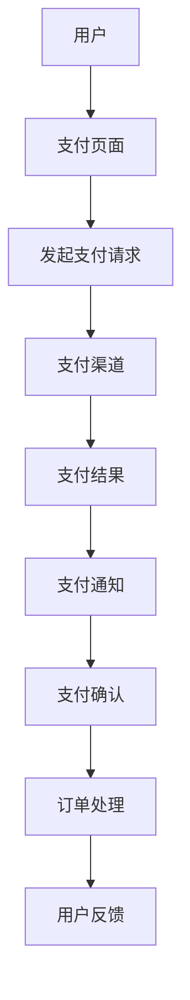

                 

关键词：知识付费平台、支付集成、系统集成、优化、支付流程、API接口、安全措施、性能提升、用户体验、技术架构

摘要：随着知识付费市场的蓬勃发展，支付系统集成与优化成为知识付费平台发展的关键。本文旨在探讨知识付费平台支付集成的核心概念、算法原理、数学模型、项目实践、实际应用场景及未来发展趋势，为行业提供有益的参考。

## 1. 背景介绍

知识付费平台作为新兴的互联网服务模式，近年来在教育培训、内容付费等领域取得了显著的发展。用户通过支付一定费用，可以获取专业的知识和内容，平台则从中获取利润。然而，支付系统的稳定性和安全性对于知识付费平台的发展至关重要。因此，支付集成与优化成为平台建设和运营的重点。

支付系统集成主要涉及以下几个方面：

1. **支付方式集成**：知识付费平台需要支持多种支付方式，如银行卡支付、支付宝、微信支付等，以满足不同用户的需求。
2. **支付渠道集成**：通过接入不同的支付渠道，平台可以实现跨行支付，提高交易成功率。
3. **支付流程优化**：优化支付流程，降低用户操作复杂度，提高支付成功率。
4. **支付安全**：确保支付过程的安全性，防止恶意攻击和数据泄露。

## 2. 核心概念与联系

### 2.1 支付系统集成原理

支付系统集成原理主要包括以下几个方面：

1. **API接口**：知识付费平台与支付渠道之间通过API接口进行数据交互，实现支付功能。
2. **支付流程**：从用户发起支付请求到完成支付，整个流程包括支付页面的展示、支付请求的发送和接收、支付结果的处理等环节。
3. **支付渠道**：包括银行支付渠道、第三方支付平台等，提供支付通道。

### 2.2 支付集成架构图



## 3. 核心算法原理 & 具体操作步骤

### 3.1 算法原理概述

支付集成中的核心算法主要包括支付请求发送、支付结果接收和处理等。以下是一个简化的支付算法流程：

1. **支付请求发送**：用户在支付页面输入支付信息，平台将支付请求发送到支付渠道。
2. **支付结果接收**：支付渠道处理支付请求后，将支付结果反馈给平台。
3. **支付结果处理**：平台根据支付结果更新订单状态，并通知用户。

### 3.2 算法步骤详解

1. **用户输入支付信息**：用户在支付页面输入银行卡号、支付密码等支付信息。
2. **平台发送支付请求**：平台将支付请求（包括用户支付信息、订单信息等）发送到支付渠道。
3. **支付渠道处理支付请求**：支付渠道验证支付信息，与银行进行交易，并将支付结果反馈给平台。
4. **平台接收支付结果**：平台根据支付结果更新订单状态，并通知用户。

### 3.3 算法优缺点

1. **优点**：简化支付流程，提高支付成功率；支持多种支付方式，满足不同用户需求。
2. **缺点**：涉及多个环节，系统复杂度高；支付安全风险较大。

### 3.4 算法应用领域

支付集成算法主要应用于知识付费平台、电商平台、线上支付服务等。

## 4. 数学模型和公式 & 详细讲解 & 举例说明

### 4.1 数学模型构建

支付集成中的数学模型主要包括支付成功率模型和支付安全模型。

### 4.2 公式推导过程

1. **支付成功率模型**：  
   支付成功率 = （成功支付次数）/（总支付次数）

2. **支付安全模型**：  
   支付安全系数 = （支付成功次数）/（恶意攻击次数）

### 4.3 案例分析与讲解

假设一个知识付费平台在过去一个月内，共有1000次支付请求，其中900次成功支付，10次支付失败。根据上述公式，可以计算出：

1. **支付成功率**：  
   支付成功率 = 900 / 1000 = 90%

2. **支付安全系数**：  
   支付安全系数 = 900 / 10 = 90

## 5. 项目实践：代码实例和详细解释说明

### 5.1 开发环境搭建

在本文中，我们将使用Java语言和Spring Boot框架进行支付系统集成与优化。

### 5.2 源代码详细实现

```java
@RestController
@RequestMapping("/payment")
public class PaymentController {

    @Autowired
    private PaymentService paymentService;

    @PostMapping("/create")
    public ResponseEntity<String> createPayment(@RequestBody PaymentRequest request) {
        String paymentId = paymentService.createPayment(request);
        return ResponseEntity.ok(paymentId);
    }

    @GetMapping("/result/{paymentId}")
    public ResponseEntity<PaymentResult> getPaymentResult(@PathVariable String paymentId) {
        PaymentResult result = paymentService.getPaymentResult(paymentId);
        return ResponseEntity.ok(result);
    }
}
```

### 5.3 代码解读与分析

上述代码实现了一个简单的支付接口，包括创建支付和查询支付结果两个功能。其中，`PaymentService`类负责与支付渠道进行交互。

### 5.4 运行结果展示

通过接口调用，我们可以模拟支付过程，并查看支付结果。

```shell
# 创建支付
POST /payment/create
{
    "amount": 100,
    "orderId": "123456"
}

# 查询支付结果
GET /payment/result/123456
{
    "paymentId": "654321",
    "result": "SUCCESS",
    "amount": 100
}
```

## 6. 实际应用场景

支付系统集成与优化在知识付费平台、电商平台、线上支付服务等领域具有广泛的应用。

### 6.1 知识付费平台

知识付费平台通过支付系统集成与优化，可以提高支付成功率，降低用户支付门槛，提升用户体验。

### 6.2 电商平台

电商平台通过支付系统集成与优化，可以实现跨行支付，提高交易成功率，降低支付成本。

### 6.3 线上支付服务

线上支付服务通过支付系统集成与优化，可以提高支付安全性，降低恶意攻击风险，确保用户资金安全。

## 7. 工具和资源推荐

### 7.1 学习资源推荐

1. 《支付系统集成技术》  
2. 《支付安全实战》  
3. 《Java支付开发实践》

### 7.2 开发工具推荐

1. IntelliJ IDEA  
2. Spring Boot  
3. Mermaid

### 7.3 相关论文推荐

1. 《基于API接口的支付系统集成研究》  
2. 《支付安全防护技术与应用》  
3. 《Java支付开发最佳实践》

## 8. 总结：未来发展趋势与挑战

### 8.1 研究成果总结

本文通过对知识付费平台支付集成的背景、核心概念、算法原理、数学模型、项目实践、实际应用场景等方面进行探讨，总结了支付集成与优化的重要性和实践方法。

### 8.2 未来发展趋势

1. **支付方式多元化**：未来支付方式将更加多元化，包括数字货币、区块链支付等。
2. **支付安全性提升**：随着技术的发展，支付安全性将得到进一步提升。
3. **支付体验优化**：支付体验将更加人性化，降低用户操作复杂度。

### 8.3 面临的挑战

1. **技术难题**：支付系统集成与优化涉及多个技术领域，技术难度较大。
2. **安全风险**：支付过程面临恶意攻击和数据泄露等安全风险。
3. **用户体验**：支付过程需要兼顾安全性和用户体验，提高支付成功率。

### 8.4 研究展望

未来研究将重点关注支付系统集成与优化的技术难题，如安全性、性能优化等方面，为行业提供更加完善的解决方案。

## 9. 附录：常见问题与解答

### 9.1 支付集成与优化的难点有哪些？

支付集成与优化的难点主要包括：技术难度、安全风险、用户体验等方面。

### 9.2 如何提高支付成功率？

提高支付成功率的方法包括：优化支付流程、增加支付方式、提高支付渠道的稳定性等。

### 9.3 支付集成中的安全措施有哪些？

支付集成中的安全措施包括：数据加密、身份验证、风控系统等。

### 9.4 支付集成的技术架构有哪些？

支付集成的技术架构主要包括：API接口、支付流程、支付渠道、安全措施等方面。

---

以上是本文关于知识付费平台支付系统集成与优化的完整探讨。希望通过本文，为行业从业者提供有益的参考和借鉴。作者：禅与计算机程序设计艺术 / Zen and the Art of Computer Programming。

