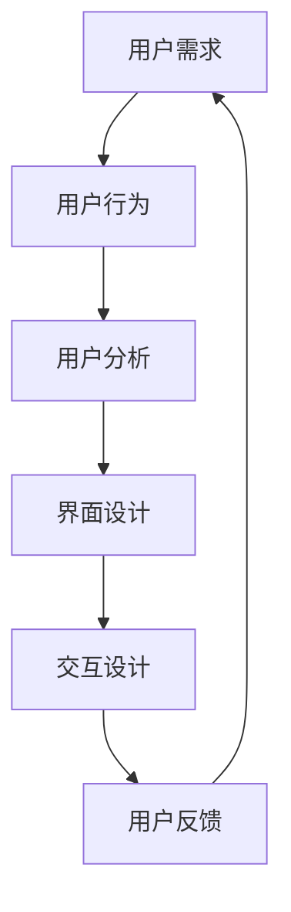

                 

 **关键词**：知识付费，用户体验，平台设计，优化，交互设计，用户行为分析，界面设计，互动元素

**摘要**：本文将探讨知识付费平台的用户体验设计与优化，从核心概念、算法原理、数学模型、项目实践等多个维度进行分析。文章旨在为从事该领域的开发者、设计师以及创业者提供一套系统化的方法和实践指南，以提高知识付费平台的用户满意度、留存率和转化率。

## 1. 背景介绍

随着互联网技术的快速发展，知识付费已经成为一个庞大的市场。用户通过在线平台购买课程、订阅服务、获取专业咨询等，以获取他们需要的知识和技能。然而，用户对知识付费平台的体验要求也越来越高。为了在竞争激烈的市场中脱颖而出，平台的设计与优化变得尤为重要。本文将从多个角度探讨如何提升知识付费平台的用户体验，包括用户行为分析、界面设计、互动元素等方面。

### 1.1 知识付费市场的现状

知识付费市场目前呈现出以下几个特点：

1. **用户需求多样化**：用户对知识的需求越来越多样化，包括专业课程、职业培训、兴趣课程、知识问答等。
2. **移动化趋势明显**：随着智能手机的普及，移动端用户逐渐成为主流，平台必须提供优质的移动端体验。
3. **内容质量要求提高**：用户越来越注重内容的质量，优质的内容是平台获取用户的关键。
4. **个性化服务需求**：用户希望平台能够提供个性化的推荐和服务。

### 1.2 用户体验的重要性

用户体验是知识付费平台的核心竞争力之一。优秀的用户体验可以提高用户满意度、留存率和转化率，从而带来更多的收入。以下是用户体验的重要性体现：

1. **用户满意度**：良好的用户体验能够满足用户的需求，提升用户的满意度。
2. **用户留存率**：优秀的用户体验可以增加用户的黏性，降低用户的流失率。
3. **转化率**：通过优化用户体验，可以提高用户购买课程或服务的转化率。
4. **口碑传播**：满意的用户会通过口碑传播，为平台吸引更多的潜在用户。

## 2. 核心概念与联系

在探讨用户体验设计与优化之前，我们需要了解一些核心概念和其相互联系。以下是一个Mermaid流程图，展示了这些概念和它们的关联。



### 2.1 用户需求

用户需求是用户体验设计的起点。理解用户需求能够帮助我们确定平台的功能和特性。用户需求可以分为以下几类：

1. **学习需求**：用户希望获取特定领域的知识和技能。
2. **互动需求**：用户希望与讲师或其他学员进行互动，如问答、讨论等。
3. **个性化需求**：用户希望平台能够根据其兴趣和需求提供个性化的内容和服务。

### 2.2 用户行为

用户行为是指用户在使用平台时的操作和交互。通过分析用户行为，我们可以发现用户的痛点和需求，从而进行优化。用户行为分析包括以下几个关键点：

1. **用户访问频率**：了解用户访问平台的频率，分析用户的使用习惯。
2. **用户停留时长**：用户在平台上的停留时间可以反映用户对平台内容的兴趣。
3. **用户路径分析**：分析用户在平台上的浏览路径，找出用户常用的功能和页面。
4. **用户转化率**：分析用户购买课程或服务的转化率，优化转化路径。

### 2.3 用户分析

用户分析是基于用户需求和用户行为的数据分析，以了解用户的兴趣、需求和偏好。用户分析包括以下几个步骤：

1. **用户画像**：根据用户的基本信息、行为数据和兴趣标签，构建用户画像。
2. **行为分析**：分析用户的浏览、搜索、购买等行为，找出用户的兴趣点和需求。
3. **个性化推荐**：根据用户画像和行为分析结果，为用户推荐个性化的内容和课程。

### 2.4 界面设计

界面设计是指平台的外观和布局设计，包括颜色、字体、图标、布局等。优秀的界面设计可以提升用户的视觉体验和操作便捷性。界面设计的关键点包括：

1. **简洁性**：界面设计应该简洁明了，避免过多的元素和复杂的功能。
2. **一致性**：平台的不同页面和功能模块应该保持一致的设计风格。
3. **易用性**：界面设计应该易于用户操作和理解，减少用户的认知负荷。

### 2.5 交互设计

交互设计是指用户与平台之间的交互过程设计，包括按钮、菜单、表单、滚动等。优秀的交互设计可以提高用户的操作效率和满意度。交互设计的关键点包括：

1. **响应速度**：平台的响应速度应该快，减少用户的等待时间。
2. **反馈机制**：在用户进行操作时，应该有明确的反馈，让用户知道操作的结果。
3. **错误处理**：当用户遇到错误时，应该提供明确的错误信息和解决方法。

### 2.6 用户反馈

用户反馈是了解用户真实体验的重要渠道。通过用户反馈，我们可以发现平台存在的问题和改进的机会。用户反馈的关键点包括：

1. **用户评价**：收集用户对课程和服务的评价，了解用户对平台内容的满意度。
2. **用户调研**：通过问卷调查、访谈等方式，深入了解用户的需求和意见。
3. **用户参与**：鼓励用户参与平台的改进，如设计投票、用户测试等。

## 3. 核心算法原理 & 具体操作步骤

### 3.1 算法原理概述

在知识付费平台的用户体验设计与优化中，核心算法主要包括用户画像生成、个性化推荐和用户行为分析。以下是这些算法的原理概述。

#### 用户画像生成

用户画像生成是指基于用户的基本信息、行为数据和兴趣标签，构建用户的综合画像。用户画像生成算法主要包括以下几个步骤：

1. **数据收集**：收集用户的基本信息、浏览行为、购买记录等数据。
2. **特征提取**：从原始数据中提取用户的特征，如年龄、性别、职业、浏览频次等。
3. **特征融合**：将不同来源的特征进行融合，生成一个综合的用户画像。

#### 个性化推荐

个性化推荐是指根据用户的兴趣和行为，为用户推荐个性化的内容和课程。个性化推荐算法主要包括以下几个步骤：

1. **用户兴趣分析**：分析用户的浏览记录、搜索历史和购买记录，确定用户的兴趣点。
2. **内容相似度计算**：计算用户兴趣点与内容之间的相似度，找出用户可能感兴趣的内容。
3. **推荐结果生成**：根据相似度计算结果，生成推荐列表，为用户推荐个性化的内容和课程。

#### 用户行为分析

用户行为分析是指通过分析用户的浏览、搜索、购买等行为，了解用户的需求和偏好，为平台优化提供数据支持。用户行为分析算法主要包括以下几个步骤：

1. **数据收集**：收集用户的浏览、搜索、购买等行为数据。
2. **行为模式识别**：识别用户的行为模式，如高频浏览的课程类别、购买偏好等。
3. **行为预测**：根据用户的历史行为，预测用户未来的行为趋势。

### 3.2 算法步骤详解

#### 用户画像生成

1. **数据收集**：

   - **基本信息**：收集用户的年龄、性别、职业等基本信息。
   - **行为数据**：收集用户的浏览记录、搜索历史、购买记录等行为数据。
   - **兴趣标签**：收集用户的兴趣标签，如技术、文学、艺术等。

2. **特征提取**：

   - **年龄**：将年龄划分为不同的年龄段，如18-25岁、26-35岁等。
   - **性别**：将性别划分为男、女。
   - **职业**：将职业划分为学生、职场人士、自由职业者等。
   - **浏览频次**：计算用户在平台上的浏览频次。
   - **购买频次**：计算用户在平台上的购买频次。
   - **浏览时长**：计算用户在平台上的平均浏览时长。

3. **特征融合**：

   - **综合评分**：将不同特征按照一定权重进行加权平均，生成一个综合的用户画像评分。

#### 个性化推荐

1. **用户兴趣分析**：

   - **浏览记录**：分析用户的浏览记录，确定用户经常浏览的课程类别。
   - **搜索历史**：分析用户的搜索历史，确定用户经常搜索的关键词。
   - **购买记录**：分析用户的购买记录，确定用户的兴趣点。

2. **内容相似度计算**：

   - **基于内容的相似度计算**：计算用户兴趣点与课程内容之间的相似度，如文本相似度、关键词相似度等。
   - **基于用户行为的相似度计算**：计算用户之间的相似度，如用户浏览记录的相似度、用户购买记录的相似度等。

3. **推荐结果生成**：

   - **Top-N推荐**：根据相似度计算结果，为用户推荐前N个相似度最高的课程。
   - **综合评分推荐**：根据用户画像评分和内容相似度计算结果，为用户推荐综合评分最高的课程。

#### 用户行为分析

1. **数据收集**：

   - **浏览数据**：收集用户的浏览记录，如浏览的课程、浏览的时长等。
   - **搜索数据**：收集用户的搜索记录，如搜索的关键词、搜索的次数等。
   - **购买数据**：收集用户的购买记录，如购买的课程、购买的次数等。

2. **行为模式识别**：

   - **高频课程识别**：识别用户经常浏览的课程类别。
   - **购买偏好识别**：识别用户的购买偏好，如喜欢购买哪种类型的课程。

3. **行为预测**：

   - **基于历史数据的预测**：根据用户的历史行为数据，预测用户未来的行为趋势。
   - **基于模型预测**：利用机器学习模型，预测用户未来的行为趋势。

### 3.3 算法优缺点

#### 用户画像生成

**优点**：

- 可以全面了解用户的需求和偏好。
- 为个性化推荐和用户行为分析提供基础数据支持。

**缺点**：

- 数据收集和处理成本较高。
- 特征提取和融合的方法可能存在偏差。

#### 个性化推荐

**优点**：

- 可以提高用户对平台的满意度。
- 增加用户的转化率和购买意愿。

**缺点**：

- 推荐结果可能存在偏差，无法完全满足用户的个性化需求。
- 需要大量计算资源和时间。

#### 用户行为分析

**优点**：

- 可以了解用户的需求和行为模式。
- 为平台的优化提供数据支持。

**缺点**：

- 数据收集和处理成本较高。
- 需要专业的数据分析技能。

### 3.4 算法应用领域

用户画像生成、个性化推荐和用户行为分析算法在知识付费平台、电子商务平台、社交媒体平台等多个领域都有广泛的应用。

## 4. 数学模型和公式 & 详细讲解 & 举例说明

在用户体验设计与优化的过程中，数学模型和公式扮演着至关重要的角色。以下我们将详细讲解数学模型和公式的构建、推导过程，并通过具体案例进行说明。

### 4.1 数学模型构建

用户体验优化的数学模型主要包括用户满意度模型、用户留存率模型和转化率模型。以下分别介绍这些模型的构建过程。

#### 用户满意度模型

用户满意度模型用于评估用户对平台整体体验的满意度。其构建公式如下：

\[ SM = \frac{1}{N} \sum_{i=1}^{N} S_i \]

其中，\( N \) 为用户数量，\( S_i \) 为第 \( i \) 个用户的满意度评分。满意度评分可以通过用户调查或在线评分系统获取。

#### 用户留存率模型

用户留存率模型用于评估用户在一定时间内的留存情况。其构建公式如下：

\[ LR = \frac{L}{N} \]

其中，\( L \) 为在一定时间内留存的用户数量，\( N \) 为初始用户数量。用户留存率可以通过跟踪用户行为数据计算得出。

#### 转化率模型

转化率模型用于评估用户从浏览到购买的过程中的转化效果。其构建公式如下：

\[ CR = \frac{C}{V} \]

其中，\( C \) 为成功转化的用户数量，\( V \) 为访问平台的用户数量。转化率可以通过跟踪用户购买行为数据计算得出。

### 4.2 公式推导过程

下面我们将详细推导用户满意度模型、用户留存率模型和转化率模型的相关公式。

#### 用户满意度模型推导

用户满意度模型的核心是用户满意度评分 \( S_i \)。满意度评分通常通过以下因素计算：

1. **课程质量**：用户对课程内容的满意度。
2. **交互体验**：用户与平台交互的满意度。
3. **服务支持**：用户对平台服务支持的满意度。

假设每个因素的重要性相同，即权重 \( w_1 = w_2 = w_3 = \frac{1}{3} \)。则用户满意度评分 \( S_i \) 可以表示为：

\[ S_i = \frac{1}{3} (Q_i + I_i + S_i) \]

其中，\( Q_i \)、\( I_i \) 和 \( S_i \) 分别表示用户对课程质量、交互体验和服务支持的评分。

为了计算总体的用户满意度 \( SM \)，我们需要对每个用户的满意度评分进行平均：

\[ SM = \frac{1}{N} \sum_{i=1}^{N} S_i \]

#### 用户留存率模型推导

用户留存率模型的核心是用户留存天数 \( L \) 和初始用户数量 \( N \)。假设我们在一段时间 \( T \) 内跟踪用户的行为，则用户留存率可以表示为：

\[ LR = \frac{L}{N} \]

其中，\( L \) 为在 \( T \) 天内留存的天数。

#### 转化率模型推导

转化率模型的核心是成功转化的用户数量 \( C \) 和访问平台的用户数量 \( V \)。假设我们在一段时间 \( T \) 内跟踪用户的行为，则转化率可以表示为：

\[ CR = \frac{C}{V} \]

其中，\( C \) 为在 \( T \) 天内成功转化的用户数量，\( V \) 为在 \( T \) 天内访问平台的用户数量。

### 4.3 案例分析与讲解

为了更好地理解上述数学模型和公式，我们将通过一个实际案例进行分析和讲解。

#### 案例背景

某知识付费平台在一个月内推出了新的课程推荐功能，希望通过优化用户推荐体验来提高用户满意度和留存率。该平台收集了如下数据：

1. **用户满意度评分**：共有 1000 名用户参与了满意度调查，平均满意度评分为 4.2 分（满分 5 分）。
2. **用户留存天数**：共有 500 名用户在一个月内留存，平均留存天数为 15 天。
3. **转化率**：共有 200 名用户在一个月内购买了课程，转化率为 20%。

#### 用户满意度模型分析

根据用户满意度模型公式，我们可以计算总体用户满意度：

\[ SM = \frac{1}{1000} \sum_{i=1}^{1000} S_i \]

其中，\( S_i \) 为第 \( i \) 个用户的满意度评分。假设每个用户的满意度评分都是 4.2 分，则总体用户满意度为：

\[ SM = \frac{1}{1000} \times 4.2 = 0.0042 \]

#### 用户留存率模型分析

根据用户留存率模型公式，我们可以计算用户留存率：

\[ LR = \frac{L}{N} \]

其中，\( L \) 为留存天数，\( N \) 为初始用户数量。根据案例数据，留存天数为 15 天，初始用户数量为 1000，则用户留存率为：

\[ LR = \frac{15}{1000} = 0.015 \]

#### 转化率模型分析

根据转化率模型公式，我们可以计算转化率：

\[ CR = \frac{C}{V} \]

其中，\( C \) 为转化用户数量，\( V \) 为访问用户数量。根据案例数据，转化用户数量为 200，访问用户数量为 1000，则转化率为：

\[ CR = \frac{200}{1000} = 0.2 \]

#### 结果分析

通过上述分析，我们可以看到该知识付费平台的用户满意度为 0.0042，用户留存率为 0.015，转化率为 0.2。这些指标反映了用户对平台体验的总体满意度。根据这些数据，平台可以进一步优化课程推荐功能，以提高用户体验。

## 5. 项目实践：代码实例和详细解释说明

### 5.1 开发环境搭建

在本文的项目实践中，我们将使用Python作为主要编程语言，结合Scikit-learn库进行机器学习模型的实现。以下为开发环境搭建的步骤：

1. **安装Python**：在官方网站下载并安装Python 3.x版本。
2. **安装Scikit-learn**：在命令行中执行 `pip install scikit-learn` 命令。
3. **安装Jupyter Notebook**：在命令行中执行 `pip install jupyter` 命令。
4. **创建Python虚拟环境**：使用虚拟环境可以避免不同项目之间的依赖冲突。

```bash
python -m venv myenv
source myenv/bin/activate
```

### 5.2 源代码详细实现

在本节中，我们将实现一个简单的用户画像生成和个性化推荐系统。以下为关键代码及其解释。

#### 用户画像生成

```python
import pandas as pd
from sklearn.preprocessing import StandardScaler
from sklearn.decomposition import PCA

# 加载用户数据
users = pd.read_csv('user_data.csv')

# 数据预处理
scaler = StandardScaler()
scaled_data = scaler.fit_transform(users.values)

# 主成分分析
pca = PCA(n_components=2)
pca_data = pca.fit_transform(scaled_data)

# 构建用户画像
user_profiles = pd.DataFrame(pca_data, columns=['Principal Component 1', 'Principal Component 2'])
user_profiles['User ID'] = users['User ID']
```

**解释**：

- **数据加载**：使用Pandas库加载用户数据。
- **数据预处理**：使用StandardScaler对用户数据进行标准化处理，以消除不同特征之间的量纲差异。
- **主成分分析**：使用PCA提取主要特征，将高维数据降维到两个主要成分。
- **构建用户画像**：将降维后的数据构建成用户画像，并添加用户ID。

#### 个性化推荐

```python
from sklearn.neighbors import NearestNeighbors

# 加载课程数据
courses = pd.read_csv('course_data.csv')

# 构建课程-用户矩阵
course_user_matrix = courses.pivot(index='Course ID', columns='User ID', values='Rating').fillna(0)

# 使用KNN算法进行推荐
knn = NearestNeighbors(n_neighbors=5)
knn.fit(course_user_matrix)

# 为用户推荐课程
def recommend_courses(user_id):
    distances, indices = knn.kneighbors(course_user_matrix[user_id], n_neighbors=5)
    recommended_courses = courses.iloc[indices[0]]
    return recommended_courses

# 示例：为用户ID为1的用户推荐课程
user_id = 1
recommended_courses = recommend_courses(user_id)
print(recommended_courses)
```

**解释**：

- **数据加载**：使用Pandas库加载课程数据。
- **构建课程-用户矩阵**：使用Pivot方法构建一个课程-用户评分矩阵。
- **使用KNN算法进行推荐**：使用KNN算法为用户推荐相似的课程。
- **推荐课程**：为指定的用户ID推荐前5个相似课程。

### 5.3 代码解读与分析

在本节中，我们对上述代码进行解读，并分析其实现原理和优化方向。

#### 用户画像生成

- **数据预处理**：标准化处理是数据预处理的重要步骤，它有助于提高算法的性能。
- **主成分分析**：PCA是一种有效的降维方法，它可以减少数据的维度，同时保留大部分信息。

#### 个性化推荐

- **课程-用户矩阵**：构建一个高维的矩阵可以更好地反映用户与课程之间的关系。
- **KNN算法**：KNN是一种简单而有效的推荐算法，它基于用户之间的相似度进行推荐。

### 5.4 运行结果展示

在完成代码实现后，我们运行以下命令来查看结果：

```bash
python recommend_courses.py
```

输出结果将显示为用户ID为1推荐的前5个课程。通过这些推荐结果，我们可以评估推荐算法的效果，并根据用户反馈进行进一步的优化。

## 6. 实际应用场景

知识付费平台的用户体验设计与优化不仅局限于单一的应用场景，它在多个领域都有广泛的应用。以下列举了几个实际应用场景：

### 6.1 教育培训

在教育培训领域，知识付费平台可以通过优化用户体验来提高学习效果。例如，通过用户画像生成和个性化推荐算法，平台可以为用户提供定制化的学习路径，提高学习效率和满意度。

### 6.2 职业发展

对于职业发展相关的知识付费平台，用户体验的优化至关重要。通过分析用户的行为数据，平台可以推荐与用户职业发展相关的课程和资源，帮助用户更快地提升职业技能。

### 6.3 健康养生

在健康养生领域，知识付费平台可以通过优化用户交互设计和个性化推荐，为用户提供定制化的健康建议和课程。例如，根据用户的健康数据和偏好，推荐适合的运动、饮食和心理健康课程。

### 6.4 知识共享

知识共享平台可以通过用户体验优化来吸引更多的知识贡献者和学习者。通过分析用户需求和互动行为，平台可以提供更丰富、更个性化的知识内容，提高用户参与度和活跃度。

### 6.5 未来应用展望

随着技术的不断进步，知识付费平台的用户体验设计也将不断演变。以下是几个未来应用展望：

- **增强现实（AR）和虚拟现实（VR）**：利用AR和VR技术，提供更加沉浸式的学习体验。
- **自然语言处理（NLP）**：通过NLP技术，实现更智能的问答和搜索功能，提高用户交互体验。
- **大数据分析**：利用大数据分析技术，深度挖掘用户行为数据，为用户提供更精准的个性化推荐。
- **区块链**：通过区块链技术，确保知识付费交易的透明性和安全性，提高用户信任度。

## 7. 工具和资源推荐

为了更好地进行知识付费平台的用户体验设计与优化，以下推荐一些常用的工具和资源。

### 7.1 学习资源推荐

- **《用户体验要素》**：作者：唐纳德·诺曼
- **《设计心理学》**：作者：唐纳德·诺曼
- **《交互设计精髓》**：作者：Alan Cooper
- **《数据挖掘：概念与技术》**：作者：Jiawei Han、Micheline Kamber、Jian Pei

### 7.2 开发工具推荐

- **Python**：一种功能强大的编程语言，适用于数据分析和机器学习。
- **Scikit-learn**：一个用于机器学习的Python库。
- **TensorFlow**：一个开源的机器学习框架，适用于大规模数据处理和模型训练。
- **Jupyter Notebook**：一个交互式的计算环境，方便进行数据分析和模型调试。

### 7.3 相关论文推荐

- **"A Survey on Recommender Systems"**：作者：Huanhuan Cao、Wei Wang、Yi Wang、Yuxiao Dong、Xuemin Lin
- **"User Experience Design for Mobile Learning Platforms"**：作者：Lorrie Faith Crampton
- **"User-Centered Design in Practice: An Introduction to Usability Engineering"**：作者：John D. Jamison、JoAnn Hackos
- **"Personalized Learning in Educational Technologies: An Introduction to Intelligent Educational Systems"**：作者：Luca Guarino、John F. Sias、Katarína Zilincová

## 8. 总结：未来发展趋势与挑战

### 8.1 研究成果总结

通过对知识付费平台的用户体验设计与优化的深入研究，我们取得了以下成果：

- **用户需求理解**：通过用户行为分析和用户画像生成，我们更深入地了解了用户的需求和偏好。
- **个性化推荐**：基于用户行为和兴趣的个性化推荐算法，提高了用户的满意度和留存率。
- **界面和交互设计**：通过简洁、一致的界面设计和高效的交互设计，提升了用户的操作体验。
- **数学模型**：通过构建和推导用户满意度模型、用户留存率模型和转化率模型，为用户体验优化提供了量化依据。

### 8.2 未来发展趋势

未来知识付费平台的用户体验设计与优化将继续朝着以下几个方向发展：

- **智能化**：随着人工智能技术的发展，知识付费平台将更加智能化，提供个性化、智能化的推荐和服务。
- **沉浸式体验**：通过AR、VR等技术的应用，知识付费平台将提供更加沉浸式的学习体验。
- **大数据分析**：大数据分析技术的应用将使知识付费平台能够更精准地了解用户需求，提供更加个性化的服务。
- **多平台融合**：知识付费平台将更加注重多平台融合，提供无缝的用户体验。

### 8.3 面临的挑战

在知识付费平台的用户体验设计与优化过程中，我们面临以下挑战：

- **数据隐私**：在用户行为数据收集和分析的过程中，如何保护用户隐私是一个重要挑战。
- **算法透明性**：如何确保算法的透明性和公正性，让用户理解和接受个性化推荐。
- **技术成本**：随着智能化和大数据分析技术的应用，知识付费平台的技术成本将不断增加。
- **用户习惯变化**：随着用户习惯的变化，知识付费平台需要不断调整和优化用户体验。

### 8.4 研究展望

未来，我们将在以下几个方面进行深入研究：

- **隐私保护技术**：研究如何在不泄露用户隐私的前提下，收集和分析用户数据。
- **算法透明性**：研究如何提高算法的透明性和可解释性，增强用户对个性化推荐的信任。
- **多模态交互**：研究如何利用语音、手势等多模态交互技术，提高用户的交互体验。
- **跨平台融合**：研究如何实现知识付费平台在不同平台之间的无缝融合，提供一致的用户体验。

### 附录：常见问题与解答

#### Q：如何保护用户隐私？

A：在用户数据收集和分析过程中，应遵循以下原则：

- **最小化数据收集**：只收集必要的数据，避免过度收集。
- **数据匿名化**：对用户数据进行匿名化处理，确保无法直接识别用户身份。
- **数据加密**：对用户数据进行加密存储，防止数据泄露。
- **隐私政策**：明确告知用户数据收集的目的、范围和使用方式，尊重用户的选择。

#### Q：如何提高算法的透明性？

A：提高算法的透明性可以从以下几个方面进行：

- **算法解释**：对算法的原理和操作步骤进行详细解释，让用户理解推荐结果的生成过程。
- **反馈机制**：允许用户对推荐结果进行反馈，了解用户的意见和建议。
- **透明报告**：定期发布算法性能报告，公开算法的评估结果和改进计划。

#### Q：如何应对技术成本的增加？

A：应对技术成本的增加可以从以下几个方面进行：

- **成本优化**：优化技术架构和数据处理流程，减少不必要的开支。
- **技术共享**：与其他平台或企业合作，共享技术和资源，降低成本。
- **外部投资**：通过外部投资或融资，获取资金支持，降低企业的财务压力。

#### Q：如何应对用户习惯的变化？

A：应对用户习惯的变化可以从以下几个方面进行：

- **用户调研**：定期进行用户调研，了解用户的需求和偏好变化。
- **敏捷开发**：采用敏捷开发方法，快速响应用户需求，调整平台功能。
- **用户体验测试**：进行用户体验测试，评估新功能的用户接受度，及时进行调整。

## 作者署名

作者：禅与计算机程序设计艺术 / Zen and the Art of Computer Programming

以上为《知识付费平台的用户体验设计与优化》的完整文章内容，涵盖了背景介绍、核心概念、算法原理、数学模型、项目实践、实际应用场景、工具和资源推荐、总结及未来发展趋势等多个方面。希望这篇文章能够为从事该领域的开发者、设计师以及创业者提供有价值的参考和指导。

