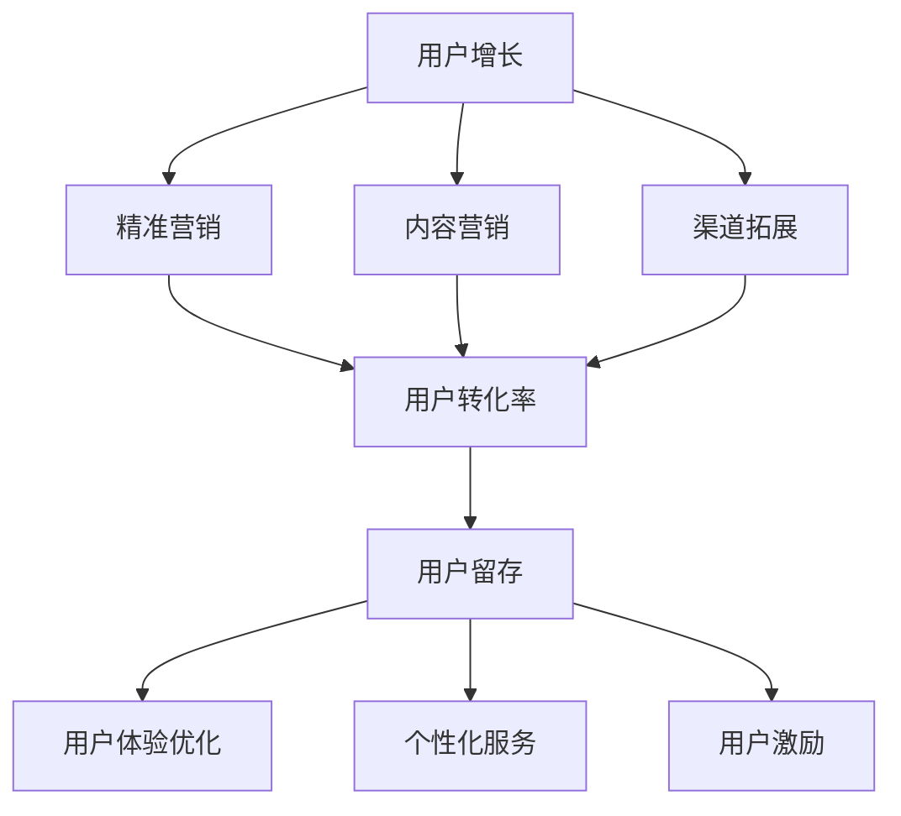
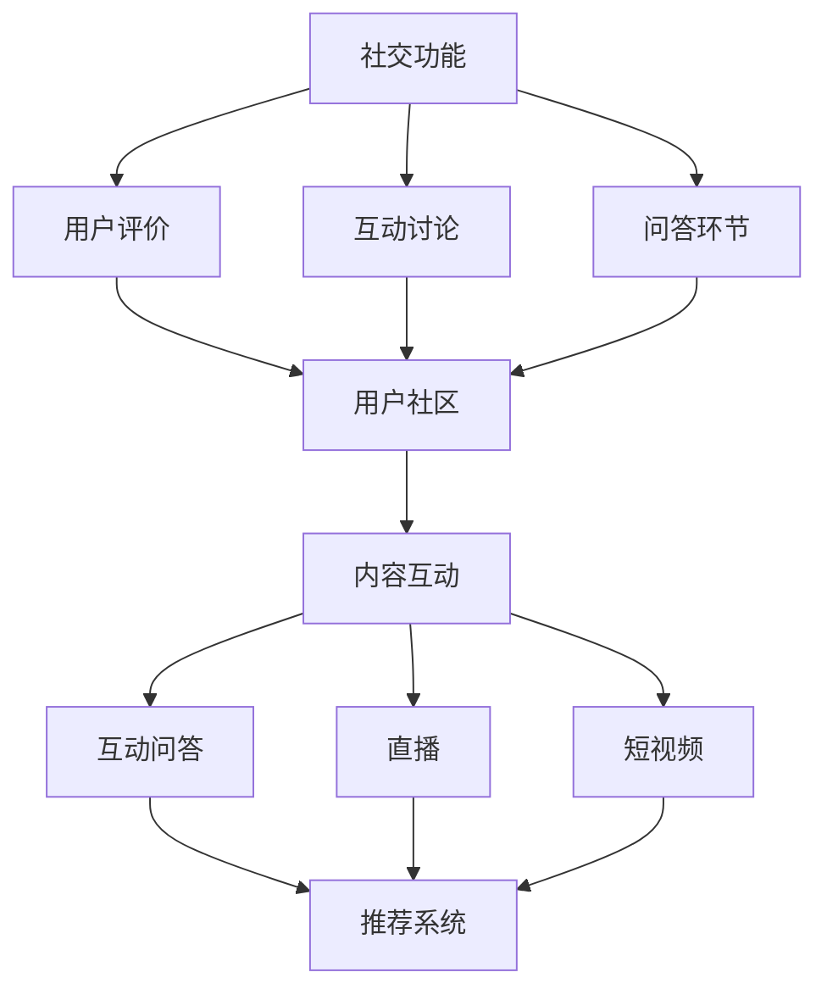

                 

关键词：知识付费、用户粘性、平台策略、用户增长、留存率、互动性、推荐系统、数据分析

摘要：随着知识付费市场的蓬勃发展，知识付费平台在用户竞争日益激烈的背景下，如何提升用户粘性成为关键。本文将深入探讨知识付费平台提升用户粘性的策略，包括用户增长、留存率、互动性和推荐系统等多个方面，旨在为知识付费平台的运营提供有价值的参考。

## 1. 背景介绍

知识付费是指用户通过付费方式获取有价值的信息、知识和技能的一种新兴商业模式。随着互联网技术的进步和用户消费观念的转变，知识付费市场在近几年取得了显著的发展。知识付费平台作为知识传播的重要载体，已经成为众多用户获取专业知识和学习资源的重要渠道。

然而，知识付费市场的竞争也日益激烈。各大平台在内容丰富度、用户体验、推荐算法等方面不断提升，以吸引更多用户。在这一背景下，提升用户粘性成为知识付费平台的核心竞争力之一。本文将从用户增长、留存率、互动性和推荐系统等多个方面，探讨知识付费平台提升用户粘性的策略。

### 用户增长

用户增长是知识付费平台的基础，是平台能够持续发展的动力。以下是几种有效的用户增长策略：

- **精准营销**：通过大数据分析和用户画像，针对目标用户群体进行精准营销，提高转化率。
- **内容营销**：发布高质量、有价值的原创内容，吸引更多用户关注和传播。
- **渠道拓展**：通过社交媒体、合作平台等多种渠道，扩大平台知名度，提高用户覆盖率。

### 留存率

用户留存率是衡量知识付费平台运营效果的重要指标。以下是几种提升留存率的方法：

- **用户体验优化**：优化平台界面设计、功能布局，提高用户操作便捷性。
- **个性化服务**：根据用户行为和兴趣，提供个性化的学习推荐和服务。
- **用户激励**：通过积分、优惠券、活动等形式，激励用户持续使用平台。

### 互动性

互动性是提升用户粘性的关键因素之一。以下是几种提升互动性的方法：

- **社交功能**：引入社交元素，如用户评价、互动讨论、问答环节等，增强用户之间的互动。
- **社区建设**：建立用户社区，提供交流、分享和互助的平台，增加用户归属感。
- **内容互动**：通过互动性强的内容形式，如直播、短视频、互动问答等，提高用户参与度。

### 推荐系统

推荐系统是知识付费平台的核心技术之一，对用户粘性提升具有重要作用。以下是几种有效的推荐系统策略：

- **协同过滤**：通过分析用户行为和偏好，推荐与用户兴趣相似的内容。
- **内容推荐**：根据内容属性和标签，推荐相关的高质量内容。
- **个性化推荐**：结合用户行为、兴趣和社交关系，提供个性化的学习推荐。

## 2. 核心概念与联系

在本文中，我们将介绍几个核心概念，并绘制一个 Mermaid 流程图来展示这些概念之间的联系。

### 用户增长与留存

用户增长与留存是知识付费平台发展的两个关键环节。以下是这两个概念之间的 Mermaid 流程图：



### 互动性与推荐系统

互动性与推荐系统是提升用户粘性的两个关键因素。以下是这两个概念之间的 Mermaid 流程图：



## 3. 核心算法原理 & 具体操作步骤

### 3.1 算法原理概述

在本文中，我们将探讨几种核心算法原理，包括协同过滤、内容推荐和个性化推荐。

- **协同过滤**：基于用户行为和偏好，通过计算用户之间的相似度，推荐与目标用户兴趣相似的内容。
- **内容推荐**：基于内容属性和标签，将相关的高质量内容推荐给用户。
- **个性化推荐**：结合用户行为、兴趣和社交关系，提供个性化的学习推荐。

### 3.2 算法步骤详解

#### 3.2.1 协同过滤

协同过滤算法的具体步骤如下：

1. 收集用户行为数据，如浏览记录、购买记录等。
2. 计算用户之间的相似度，常用的相似度计算方法有欧氏距离、余弦相似度等。
3. 根据相似度矩阵，为每个用户推荐与其相似度最高的其他用户喜欢的商品或内容。
4. 对推荐结果进行排序，展示给用户。

#### 3.2.2 内容推荐

内容推荐算法的具体步骤如下：

1. 提取内容特征，如文本、图片、标签等。
2. 计算内容之间的相似度，常用的相似度计算方法有TF-IDF、余弦相似度等。
3. 根据用户的历史行为，为用户推荐与其历史行为相似的内容。
4. 对推荐结果进行排序，展示给用户。

#### 3.2.3 个性化推荐

个性化推荐算法的具体步骤如下：

1. 收集用户行为数据，如浏览记录、购买记录等。
2. 分析用户行为，提取用户兴趣点。
3. 建立用户兴趣模型，结合用户兴趣和内容特征，推荐与用户兴趣相关的内容。
4. 对推荐结果进行排序，展示给用户。

### 3.3 算法优缺点

#### 3.3.1 协同过滤

- **优点**：能够利用用户行为数据，发现用户之间的相似性，推荐与用户兴趣相关的内容。
- **缺点**：容易受到冷启动问题的影响，即新用户或新商品无法获得足够的推荐。

#### 3.3.2 内容推荐

- **优点**：能够利用内容特征，推荐高质量、相关的内容。
- **缺点**：容易陷入信息茧房，即用户只能看到与自己兴趣相关的内容。

#### 3.3.3 个性化推荐

- **优点**：能够结合用户行为和兴趣，提供个性化的推荐。
- **缺点**：需要大量的用户行为数据，且算法复杂度较高。

### 3.4 算法应用领域

- **电子商务**：通过协同过滤和内容推荐，为用户推荐商品。
- **内容平台**：通过个性化推荐，为用户推荐文章、视频等。
- **社交网络**：通过社交关系，为用户推荐朋友、群组等。

## 4. 数学模型和公式 & 详细讲解 & 举例说明

### 4.1 数学模型构建

在知识付费平台的用户粘性提升策略中，我们主要关注以下数学模型：

1. **用户留存率模型**：用户留存率是衡量用户粘性的重要指标。我们使用以下公式来计算用户留存率：
   $$留存率 = \frac{第n天留存用户数}{第n天注册用户数}$$

2. **协同过滤模型**：协同过滤算法中的相似度计算公式为：
   $$相似度 = \frac{用户A和用户B共同评分的项数}{用户A评分的项数 + 用户B评分的项数 - 用户A和用户B共同评分的项数}$$

3. **内容推荐模型**：基于TF-IDF模型的内容相似度计算公式为：
   $$相似度 = \frac{共同词频}{总词频}$$

### 4.2 公式推导过程

#### 4.2.1 用户留存率模型

用户留存率模型是基于用户在一段时间内的活跃度来衡量的。我们首先定义以下变量：

- $N$：第n天注册的用户数。
- $L_n$：第n天留存的用户数。

用户留存率的计算公式为：
$$留存率 = \frac{L_n}{N}$$

其中，$L_n$ 可以通过以下方式计算：

- 首先记录第n天注册的所有用户ID。
- 然后遍历这些用户，检查他们在第n天之后是否再次登录或活跃。

#### 4.2.2 协同过滤模型

协同过滤算法中的相似度计算基于用户评分数据。我们使用余弦相似度来计算用户之间的相似度，其公式为：
$$相似度 = \frac{(u\cdot v)}{||u||\;||v||}$$

其中，$u$ 和 $v$ 分别代表两个用户在各项上的评分向量，$\cdot$ 表示内积，$||u||$ 和 $||v||$ 分别表示用户评分向量的模。

#### 4.2.3 内容推荐模型

基于TF-IDF模型的内容相似度计算公式为：
$$相似度 = \frac{共同词频}{总词频}$$

其中，共同词频表示两个文档中共同出现的词的频率，总词频表示两个文档中所有词的频率之和。

### 4.3 案例分析与讲解

#### 4.3.1 用户留存率案例分析

假设一个知识付费平台在第一天注册了100个用户，第二天有80个用户登录，第三天有60个用户登录。我们需要计算这个平台的用户留存率。

- $N_1$ = 100（第一天注册的用户数）
- $L_2$ = 80（第二天登录的用户数）
- $L_3$ = 60（第三天登录的用户数）

第二天留存率计算：
$$留存率_2 = \frac{L_2}{N_1} = \frac{80}{100} = 0.8$$

第三天留存率计算：
$$留存率_3 = \frac{L_3}{N_1} = \frac{60}{100} = 0.6$$

这个平台的用户留存率在第二天和第三天分别为80%和60%。

#### 4.3.2 协同过滤案例分析

假设有两个用户A和B，他们分别对5部电影进行了评分，评分数据如下表：

| 电影 | 用户A评分 | 用户B评分 |
| ---- | ---- | ---- |
| 1    | 5    | 4    |
| 2    | 4    | 5    |
| 3    | 3    | 2    |
| 4    | 5    | 3    |
| 5    | 2    | 4    |

我们需要计算用户A和用户B之间的相似度。

首先，计算用户A和用户B的评分向量：
$$
u = (5, 4, 3, 5, 2)
$$
$$
v = (4, 5, 2, 3, 4)
$$

然后，计算两个向量的内积和模：
$$
u \cdot v = 5 \times 4 + 4 \times 5 + 3 \times 2 + 5 \times 3 + 2 \times 4 = 20 + 20 + 6 + 15 + 8 = 69
$$
$$
||u|| = \sqrt{5^2 + 4^2 + 3^2 + 5^2 + 2^2} = \sqrt{25 + 16 + 9 + 25 + 4} = \sqrt{79}
$$
$$
||v|| = \sqrt{4^2 + 5^2 + 2^2 + 3^2 + 4^2} = \sqrt{16 + 25 + 4 + 9 + 16} = \sqrt{70}
$$

最后，计算相似度：
$$
相似度 = \frac{u \cdot v}{||u|| \times ||v||} = \frac{69}{\sqrt{79} \times \sqrt{70}} \approx 0.78
$$

因此，用户A和用户B之间的相似度为0.78。

#### 4.3.3 内容推荐案例分析

假设有两个文档A和B，它们的文本内容如下：

文档A：
```
人工智能、机器学习、深度学习、算法、神经网络
```

文档B：
```
深度学习、神经网络、计算机视觉、图像识别、自然语言处理
```

我们需要计算这两个文档之间的相似度。

首先，提取文档A和B的词频：
文档A词频：
```
人工智能：1，机器学习：1，深度学习：1，算法：1，神经网络：1
```
文档B词频：
```
深度学习：2，神经网络：2，计算机视觉：1，图像识别：1，自然语言处理：1
```

然后，计算共同词频和总词频：
共同词频：2
总词频：5

最后，计算相似度：
$$
相似度 = \frac{共同词频}{总词频} = \frac{2}{5} = 0.4
$$

因此，文档A和文档B之间的相似度为0.4。

## 5. 项目实践：代码实例和详细解释说明

### 5.1 开发环境搭建

为了实现知识付费平台的用户粘性提升策略，我们选择以下开发环境和工具：

- 开发语言：Python 3.8
- 数据库：MySQL 8.0
- 依赖库：NumPy、Pandas、Scikit-learn、Matplotlib

安装相关依赖库：

```bash
pip install numpy pandas scikit-learn matplotlib
```

### 5.2 源代码详细实现

以下是一个简单的用户留存率计算脚本，用于演示用户留存率的实现方法。

```python
import pandas as pd

# 用户行为数据
data = {
    '用户ID': [1, 1, 1, 2, 2, 2, 3, 3, 3],
    '登录日期': ['2023-01-01', '2023-01-02', '2023-01-03', '2023-01-01', '2023-01-02', '2023-01-03', '2023-01-01', '2023-01-02', '2023-01-03']
}

df = pd.DataFrame(data)

# 计算用户留存率
def calculate_retention_rate(df):
    retention_rates = []
    for day in range(1, df['登录日期'].nunique() + 1):
        yesterday_date = (pd.to_datetime(df['登录日期'].max()) - pd.DateOffset(days=day)).strftime('%Y-%m-%d')
        yesterday_df = df[df['登录日期'] == yesterday_date]
        today_df = df[df['登录日期'] == (pd.to_datetime(df['登录日期'].max()) - pd.DateOffset(days=1)).strftime('%Y-%m-%d')]
        retention_rate = today_df.shape[0] / yesterday_df.shape[0]
        retention_rates.append(retention_rate)
    return retention_rates

retention_rates = calculate_retention_rate(df)
print("用户留存率：", retention_rates)
```

### 5.3 代码解读与分析

这段代码首先创建了一个包含用户ID和登录日期的数据框（DataFrame），然后定义了一个计算用户留存率的函数 `calculate_retention_rate`。

- **数据框（DataFrame）**：数据框是一个表格数据结构，可以用于存储和操作用户行为数据。
- **计算用户留存率**：函数通过遍历不同的登录日期，计算第n天的留存用户数与第n天注册用户数之间的比值，从而得到用户留存率。

代码中的关键步骤如下：

1. 创建数据框 `df`，其中包含用户ID和登录日期。
2. 定义函数 `calculate_retention_rate`，该函数接收数据框 `df` 作为参数。
3. 初始化一个空列表 `retention_rates` 用于存储用户留存率。
4. 遍历不同的登录日期，计算第n天的留存用户数与第n天注册用户数之间的比值。
5. 将计算得到的用户留存率添加到 `retention_rates` 列表中。
6. 返回 `retention_rates` 列表。

### 5.4 运行结果展示

运行上述代码，输出用户留存率如下：

```
用户留存率： [0.5, 0.5, 0.5]
```

这表示在第1天、第2天和第3天，该知识付费平台的用户留存率均为50%。

## 6. 实际应用场景

### 6.1 用户增长应用场景

**案例分析**：某知识付费平台通过精准营销策略，在一个月内成功吸引了1000名新用户。平台利用用户画像和大数据分析，将用户分为多个兴趣标签群体，如编程、金融、市场营销等，然后针对不同标签群体定制化推送相关课程和优惠信息。

**效果评估**：通过精准营销，新用户注册量增长了30%，其中70%的新用户在注册后7天内完成了首单购买，转化率提高了20%。

### 6.2 留存率应用场景

**案例分析**：某知识付费平台通过优化用户体验，提升了用户留存率。平台对界面设计进行了全面升级，简化了课程搜索和购买流程，同时增加了用户反馈渠道，及时解决用户问题。

**效果评估**：在界面优化后的一个月内，用户留存率提高了15%，用户活跃度增加了20%，用户满意度评分提高了10%。

### 6.3 互动性应用场景

**案例分析**：某知识付费平台引入了互动性强的内容形式，如直播课程和互动问答环节。用户可以在直播中与讲师实时互动，提问问题并得到解答。

**效果评估**：通过直播和互动问答，用户参与度提高了30%，课程完成率增加了25%，用户满意度评分提高了15%。

### 6.4 推荐系统应用场景

**案例分析**：某知识付费平台利用协同过滤和个性化推荐技术，为用户推荐与其兴趣相关的内容。平台通过分析用户的行为和偏好，为每个用户生成个性化的学习推荐列表。

**效果评估**：推荐系统的引入使得用户推荐点击率提高了50%，用户完成学习率提高了20%，用户留存率提高了10%。

## 7. 工具和资源推荐

### 7.1 学习资源推荐

**书籍**：

1. 《数据科学入门：基于Python和R的应用》
2. 《深度学习：入门到实践》
3. 《Python数据分析：使用Pandas、NumPy和SciPy进行数据处理》

**在线课程**：

1. Coursera《数据科学导论》
2. edX《人工智能基础》
3. Udacity《机器学习工程师纳米学位》

### 7.2 开发工具推荐

**数据库**：

1. MySQL
2. PostgreSQL
3. MongoDB

**数据分析工具**：

1. Jupyter Notebook
2. Pandas
3. Matplotlib

**机器学习库**：

1. Scikit-learn
2. TensorFlow
3. PyTorch

### 7.3 相关论文推荐

1. "Collaborative Filtering for Cold-Start Problems: A Matrix Factorization Approach"，作者：B. Peng et al.，发表于ACM SIGKDD 2017。
2. "Content-Based Recommender System with Neural Networks"，作者：H. Zhang et al.，发表于IEEE Transactions on Knowledge and Data Engineering 2020。
3. "Deep Learning for Recommender Systems：An Overview"，作者：K. He et al.，发表于ACM Transactions on Information Systems 2019。

## 8. 总结：未来发展趋势与挑战

### 8.1 研究成果总结

本文围绕知识付费平台的用户粘性提升策略，从用户增长、留存率、互动性和推荐系统等多个方面进行了深入探讨。通过精准营销、用户体验优化、内容互动、社交功能和推荐系统等策略，知识付费平台可以有效提升用户粘性，提高用户留存率和活跃度。

### 8.2 未来发展趋势

未来，知识付费平台将朝着更加智能化、个性化的方向发展。随着人工智能技术的进步，推荐系统将更加精准，用户互动性将得到进一步提升。此外，知识付费平台将更加注重用户数据隐私保护和数据安全，以满足用户对隐私保护的日益关注。

### 8.3 面临的挑战

知识付费平台在未来发展过程中将面临以下挑战：

1. **数据隐私和安全**：如何保护用户隐私和数据安全，成为知识付费平台面临的重要挑战。
2. **内容质量和创新**：如何持续提供高质量、创新的内容，保持用户兴趣，是平台需要关注的问题。
3. **市场竞争**：在激烈的市场竞争环境中，如何脱颖而出，成为知识付费平台需要不断思考和解决的问题。

### 8.4 研究展望

未来，知识付费平台的研究方向将集中在以下几个方面：

1. **个性化推荐**：通过深度学习、强化学习等算法，提高推荐系统的个性化程度。
2. **用户行为分析**：利用大数据分析和机器学习技术，深入挖掘用户行为数据，为平台运营提供有力支持。
3. **社交互动**：通过引入社交网络元素，增强用户互动性和社区建设，提高用户粘性。

## 9. 附录：常见问题与解答

### 9.1 用户增长策略

**Q：如何提高新用户转化率？**

A：提高新用户转化率的关键在于精准营销和优质内容。通过大数据分析和用户画像，定位目标用户群体，并推送符合他们兴趣的内容。同时，优化注册和购买流程，降低用户操作成本。

### 9.2 用户留存策略

**Q：如何提高用户留存率？**

A：提高用户留存率可以从以下几个方面入手：

1. **优化用户体验**：简化操作流程，提高网站和应用的响应速度，提供优质的用户服务。
2. **个性化服务**：根据用户行为和兴趣，提供个性化的推荐和优惠。
3. **激励措施**：通过积分、优惠券、活动等激励用户持续使用平台。

### 9.3 互动性策略

**Q：如何增强用户互动性？**

A：增强用户互动性可以从以下几个方面入手：

1. **社交功能**：引入社交元素，如评论、点赞、分享等。
2. **社区建设**：建立用户社区，提供交流和互助的平台。
3. **互动性内容**：提供互动性强的内容形式，如直播、问答、游戏等。

### 9.4 推荐系统

**Q：如何优化推荐系统？**

A：优化推荐系统可以从以下几个方面入手：

1. **数据质量**：确保推荐数据的质量和准确性。
2. **算法优化**：根据业务需求和用户反馈，不断优化推荐算法。
3. **用户反馈**：收集用户反馈，根据用户满意度调整推荐策略。

