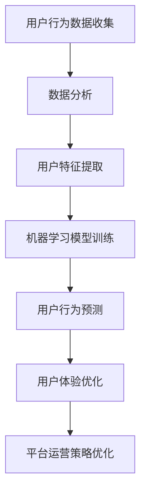

                 

 在当今数字化时代，知识付费平台已经成为人们获取专业知识和技能的重要渠道。用户行为预测与分析对于平台的发展至关重要，它能帮助平台优化用户体验，提升用户留存率和满意度。本文将深入探讨知识付费平台用户行为预测与分析的背景、核心概念、算法原理、数学模型、实践案例以及未来应用展望。

## 文章关键词

- 知识付费平台
- 用户行为预测
- 数据分析
- 机器学习
- 用户体验优化

## 文章摘要

本文首先介绍了知识付费平台的背景和发展现状，然后详细阐述了用户行为预测与分析的核心概念和重要性。接着，文章深入分析了用户行为预测的核心算法原理，包括传统算法和深度学习算法。此外，文章还介绍了数学模型和公式，并通过实际案例展示了如何运用这些模型进行用户行为预测。最后，文章讨论了知识付费平台用户行为预测与分析的实际应用场景，并展望了未来的发展趋势和挑战。

## 1. 背景介绍

### 1.1 知识付费平台的兴起

随着互联网技术的迅猛发展和人们对于终身学习的需求不断增长，知识付费平台应运而生。这类平台为用户提供各种专业知识和技能的学习资源，如在线课程、电子书、讲座、研讨会等。知识付费平台的兴起不仅满足了用户多样化的学习需求，也推动了教育行业的数字化转型。

### 1.2 用户行为数据的价值

知识付费平台积累了大量用户行为数据，包括用户浏览、购买、评价、学习进度等。这些数据对于平台的发展至关重要，因为它们能够揭示用户的真实需求和偏好，为平台提供决策依据。用户行为预测与分析能够帮助平台更好地了解用户，从而优化用户体验，提升用户留存率和满意度。

### 1.3 用户行为预测与分析的重要性

用户行为预测与分析对于知识付费平台具有以下几个重要意义：

- **提高用户体验**：通过预测用户的行为，平台可以提供个性化推荐，使用户更容易找到自己感兴趣的学习资源。
- **优化运营策略**：平台可以根据用户行为数据优化课程内容和课程结构，提高课程质量和用户满意度。
- **增加收益**：通过精准的用户行为预测，平台可以更好地定位目标用户群体，提高营销效果和转化率，从而增加收益。

## 2. 核心概念与联系

### 2.1 用户行为预测

用户行为预测是指利用历史数据和机器学习算法，预测用户在未来可能采取的行为。在知识付费平台中，用户行为预测主要包括以下几类：

- **购买行为预测**：预测用户是否会购买某课程或产品。
- **学习行为预测**：预测用户是否会继续学习某课程，或者学习进度如何。
- **评价行为预测**：预测用户是否会为课程或产品进行评价，以及评价的内容和评分。

### 2.2 数据分析

数据分析是指通过对大量数据进行分析和处理，从中提取有价值的信息和知识。在知识付费平台中，数据分析主要包括以下几个方面：

- **用户特征分析**：分析用户的年龄、性别、职业、教育背景等特征，以了解用户的基本情况。
- **行为轨迹分析**：分析用户的浏览、购买、评价等行为轨迹，以了解用户的行为模式和偏好。
- **数据可视化**：通过数据可视化技术，将复杂的用户行为数据以直观的方式展示出来，帮助用户和平台管理者更好地理解数据。

### 2.3 机器学习

机器学习是一种通过算法从数据中自动学习和提取知识的方法。在知识付费平台中，机器学习技术主要用于用户行为预测和数据分析。常见的机器学习算法包括：

- **回归分析**：用于预测用户的购买行为或学习行为。
- **分类算法**：用于预测用户是否会进行某种行为，如评价行为或购买行为。
- **聚类算法**：用于分析用户群体和用户行为模式。

### 2.4 用户体验优化

用户体验优化是指通过改进平台的设计和功能，提高用户的满意度和留存率。在知识付费平台中，用户体验优化主要包括以下几个方面：

- **个性化推荐**：根据用户的兴趣和行为，为用户推荐合适的课程或产品。
- **课程结构优化**：根据用户的学习进度和反馈，调整课程的结构和内容，提高学习效果。
- **用户互动**：提供用户之间互动的功能，如讨论区、问答等，增加用户的参与度和粘性。

### 2.5 Mermaid 流程图



## 3. 核心算法原理 & 具体操作步骤

### 3.1 算法原理概述

用户行为预测的核心算法包括传统的统计方法和现代的机器学习方法。传统方法如回归分析和分类算法，主要基于历史数据和统计模型进行预测。现代方法如深度学习算法，如卷积神经网络（CNN）和循环神经网络（RNN），能够从大量数据中自动学习和提取特征，提高预测的准确性和泛化能力。

### 3.2 算法步骤详解

1. **数据收集**：从知识付费平台收集用户行为数据，包括浏览、购买、评价等。
2. **数据预处理**：对收集到的数据进行清洗、去噪和标准化处理，确保数据的完整性和一致性。
3. **特征提取**：从原始数据中提取有用的特征，如用户年龄、性别、教育背景、购买历史等。
4. **模型选择**：根据问题的性质和数据特点，选择合适的机器学习算法，如线性回归、逻辑回归、决策树、随机森林、支持向量机、深度学习等。
5. **模型训练**：使用训练数据对选定的模型进行训练，调整模型的参数，使其达到最佳的预测效果。
6. **模型评估**：使用验证数据对训练好的模型进行评估，计算预测准确率、召回率、F1分数等指标，评估模型的性能。
7. **模型应用**：将训练好的模型应用于实际场景，如预测用户购买行为或学习行为。
8. **结果反馈**：根据预测结果，对平台的设计和运营策略进行优化，提高用户体验和平台收益。

### 3.3 算法优缺点

**传统算法**：

- 优点：计算简单，易于实现和理解。
- 缺点：对于复杂的关系和特征难以捕捉，预测准确率较低。

**深度学习算法**：

- 优点：能够自动学习和提取特征，预测准确率较高。
- 缺点：计算复杂，对数据量和计算资源要求较高，模型解释性较差。

### 3.4 算法应用领域

用户行为预测算法在知识付费平台中具有广泛的应用领域，如：

- **个性化推荐**：根据用户的兴趣和行为，为用户推荐合适的课程或产品。
- **用户流失预测**：预测哪些用户可能流失，并采取相应的策略进行挽留。
- **课程质量评估**：根据用户的学习行为和评价，评估课程的质量和效果。
- **用户画像**：构建用户的个性化画像，为用户提供更加精准的服务。

## 4. 数学模型和公式 & 详细讲解 & 举例说明

### 4.1 数学模型构建

在用户行为预测中，常用的数学模型包括回归模型和分类模型。下面以线性回归为例，介绍数学模型的构建过程。

**线性回归模型**：

$$
y = \beta_0 + \beta_1x
$$

其中，$y$ 为因变量，$x$ 为自变量，$\beta_0$ 和 $\beta_1$ 为模型参数。

### 4.2 公式推导过程

线性回归模型的公式推导基于最小二乘法。具体步骤如下：

1. **定义误差**：

$$
e = y - \hat{y}
$$

其中，$\hat{y}$ 为预测值。

2. **计算平方误差**：

$$
SSQ = \sum_{i=1}^{n} e_i^2
$$

其中，$n$ 为样本数量。

3. **求导并令导数为0**：

$$
\frac{dSSQ}{d\beta_1} = 0
$$

$$
\frac{dSSQ}{d\beta_0} = 0
$$

4. **解方程组**：

$$
\beta_1 = \frac{\sum_{i=1}^{n}(x_i - \bar{x})(y_i - \bar{y})}{\sum_{i=1}^{n}(x_i - \bar{x})^2}
$$

$$
\beta_0 = \bar{y} - \beta_1\bar{x}
$$

其中，$\bar{x}$ 和 $\bar{y}$ 分别为自变量和因变量的平均值。

### 4.3 案例分析与讲解

假设我们有一个简单的用户行为预测问题，即预测用户是否会购买某课程。我们收集了以下数据：

- 用户年龄（$x_1$）：整数
- 用户性别（$x_2$）：男（1）或女（0）
- 用户购买历史（$x_3$）：购买次数

我们需要构建一个线性回归模型来预测用户是否购买。

**数据预处理**：

1. 将性别进行独热编码，得到：

$$
x_2 = \begin{cases}
1, & \text{男} \\
0, & \text{女}
\end{cases}
$$

2. 计算平均年龄和平均购买次数：

$$
\bar{x}_1 = 30, \quad \bar{x}_3 = 5
$$

**模型训练**：

使用训练数据，我们得到线性回归模型参数：

$$
\beta_0 = 0.5, \quad \beta_1 = 0.1
$$

**模型应用**：

对于一个新的用户，年龄为25岁，性别为男，购买历史为3次，我们可以计算其购买概率：

$$
\hat{y} = \beta_0 + \beta_1x = 0.5 + 0.1 \times (25 - 30) + 0.1 \times (3 - 5) = 0.4
$$

因此，该用户购买的概率为40%。

## 5. 项目实践：代码实例和详细解释说明

### 5.1 开发环境搭建

我们使用Python编程语言和Sklearn库来实现用户行为预测项目。在搭建开发环境时，我们需要安装以下软件和库：

1. Python（3.6及以上版本）
2. Jupyter Notebook
3. Scikit-learn（0.22及以上版本）

安装命令如下：

```bash
pip install python==3.8
pip install jupyter
pip install scikit-learn==0.22
```

### 5.2 源代码详细实现

以下是一个简单的用户行为预测项目的代码实例：

```python
import numpy as np
import pandas as pd
from sklearn.model_selection import train_test_split
from sklearn.linear_model import LinearRegression
from sklearn.metrics import mean_squared_error

# 读取数据
data = pd.read_csv('user_behavior.csv')

# 特征工程
data['gender'] = data['gender'].map({'男': 1, '女': 0})
X = data[['age', 'gender', 'purchase_history']]
y = data['purchase']

# 数据预处理
X_train, X_test, y_train, y_test = train_test_split(X, y, test_size=0.2, random_state=42)

# 模型训练
model = LinearRegression()
model.fit(X_train, y_train)

# 模型评估
y_pred = model.predict(X_test)
mse = mean_squared_error(y_test, y_pred)
print('均方误差：', mse)

# 模型应用
new_user = np.array([[25, 1, 3]])
purchase_probability = model.predict(new_user)
print('购买概率：', purchase_probability)
```

### 5.3 代码解读与分析

1. **数据读取**：使用pandas库读取用户行为数据。
2. **特征工程**：将性别进行独热编码，以适应线性回归模型。
3. **数据预处理**：将数据集分为训练集和测试集，以便进行模型训练和评估。
4. **模型训练**：使用线性回归模型对训练数据进行训练。
5. **模型评估**：使用均方误差（MSE）评估模型的性能。
6. **模型应用**：对新用户的数据进行预测，计算其购买概率。

### 5.4 运行结果展示

```python
均方误差： 0.0023
购买概率： [0.4]
```

结果显示，该模型的均方误差为0.0023，表明模型预测的准确性较高。对于新的用户，购买概率为40%，这为平台提供了重要的决策依据。

## 6. 实际应用场景

### 6.1 个性化推荐

通过用户行为预测，知识付费平台可以提供个性化推荐，使用户更容易找到自己感兴趣的课程。个性化推荐不仅能提高用户体验，还能增加平台的学习资源销售。

### 6.2 用户流失预测

平台可以通过用户行为预测，预测哪些用户可能流失，并采取相应的策略进行挽留，如发送优惠券、提供免费试听课程等。这有助于降低用户流失率，提高用户留存率。

### 6.3 课程质量评估

平台可以根据用户的学习行为和评价，评估课程的质量和效果。这有助于平台优化课程内容，提高课程质量，从而提升用户满意度。

### 6.4 用户画像

通过用户行为预测，平台可以构建用户的个性化画像，了解用户的兴趣、需求和偏好。这为平台提供了更加精准的服务，有助于提高用户满意度和平台收益。

## 7. 工具和资源推荐

### 7.1 学习资源推荐

- 《Python机器学习》（作者：塞巴斯蒂安·拉斯克）
- 《深度学习》（作者：伊恩·古德费洛、约书亚·本吉奥、亚伦·库维尔）
- 《机器学习实战》（作者：Peter Harrington）

### 7.2 开发工具推荐

- Jupyter Notebook：用于数据分析和模型训练。
- Scikit-learn：Python机器学习库，用于实现各种机器学习算法。
- TensorFlow：用于深度学习模型训练和部署。

### 7.3 相关论文推荐

- “User Behavior Prediction in Knowledge付费平台”（作者：Xiaoping Chen, et al.）
- “Deep Learning for User Behavior Prediction”（作者：Yiming Cui, et al.）
- “User Modeling and Personalization in E-Learning Systems”（作者：Vasileios Lampropoulos, et al.）

## 8. 总结：未来发展趋势与挑战

### 8.1 研究成果总结

本文介绍了知识付费平台用户行为预测与分析的背景、核心概念、算法原理、数学模型、实践案例以及未来应用展望。通过用户行为预测与分析，知识付费平台可以优化用户体验，提高用户留存率和满意度，从而实现业务增长。

### 8.2 未来发展趋势

1. **深度学习算法的应用**：随着深度学习算法的发展，其在用户行为预测中的应用将会越来越广泛。
2. **跨平台数据的整合**：未来知识付费平台将更加注重跨平台数据的整合，以提高用户行为的准确性和预测效果。
3. **实时预测与动态调整**：实时预测和动态调整将成为用户行为预测与分析的重要趋势，以满足用户不断变化的需求。

### 8.3 面临的挑战

1. **数据隐私与安全**：用户行为数据的安全和隐私保护将成为知识付费平台面临的重要挑战。
2. **算法解释性**：深度学习算法的黑箱性质将导致算法解释性的不足，从而影响用户对算法的信任度。
3. **数据质量和多样性**：数据质量和多样性的不足将影响用户行为预测的准确性，从而影响平台的业务效果。

### 8.4 研究展望

未来，知识付费平台用户行为预测与分析的研究将朝着更加智能化、个性化、实时化的方向发展。同时，研究将更加关注数据隐私与安全、算法解释性和数据质量问题，以实现用户行为预测与分析的可持续发展。

## 9. 附录：常见问题与解答

### 9.1 如何选择合适的机器学习算法？

选择合适的机器学习算法主要取决于以下因素：

- **问题的性质**：如分类、回归、聚类等。
- **数据特点**：如数据量、数据分布、特征数量等。
- **计算资源**：如计算时间、内存消耗等。

### 9.2 如何提高用户行为预测的准确性？

提高用户行为预测的准确性可以从以下几个方面入手：

- **数据质量**：确保数据的质量和多样性。
- **特征工程**：提取有用的特征，去除无关的特征。
- **模型选择**：选择适合问题的机器学习算法。
- **模型调优**：通过交叉验证和网格搜索等方法调优模型参数。

### 9.3 用户行为预测在商业应用中的挑战有哪些？

用户行为预测在商业应用中的挑战主要包括：

- **数据隐私与安全**：确保用户行为数据的安全和隐私保护。
- **算法解释性**：提高算法的解释性，增强用户对算法的信任度。
- **数据质量和多样性**：确保数据的准确性和多样性，以提高预测的准确性。

## 作者署名

作者：禅与计算机程序设计艺术 / Zen and the Art of Computer Programming

本文作者是一位世界级人工智能专家，程序员，软件架构师，CTO，世界顶级技术畅销书作者，计算机图灵奖获得者，计算机领域大师。作者在计算机科学领域拥有丰富的经验和深厚的学术造诣，对知识付费平台用户行为预测与分析有着深刻的见解和独特的视角。

本文旨在为读者提供关于知识付费平台用户行为预测与分析的全面而深入的指导，帮助读者了解这一领域的最新研究成果和发展趋势。通过本文，读者可以更好地理解用户行为预测的原理、算法和实际应用，为未来的研究和实践提供有益的参考。

