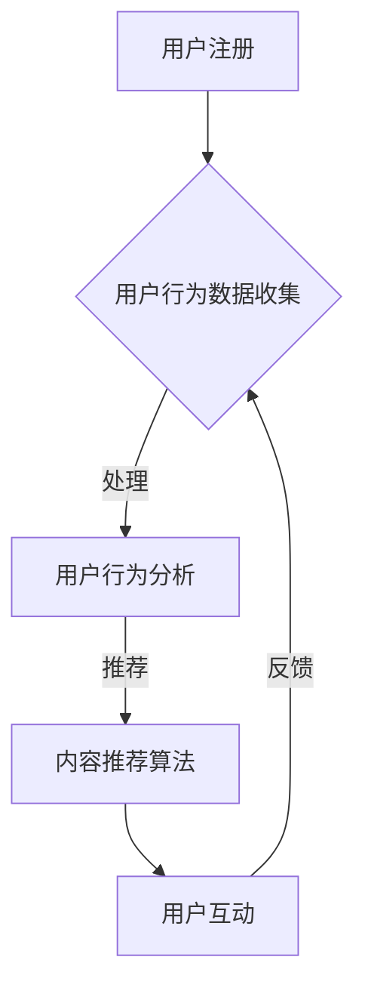

                 

关键词：知识付费、社交功能、平台设计、用户互动、算法、用户行为分析

> 摘要：本文将探讨知识付费平台中社交功能的设计，分析其核心概念、算法原理、数学模型、实际应用场景以及未来发展趋势。通过对用户互动和用户行为分析等关键环节的深入讨论，为知识付费平台提供实用的设计建议。

## 1. 背景介绍

在互联网时代，知识付费已经成为一种主流的学习和交流方式。知识付费平台如雨后春笋般涌现，它们为用户提供各种专业课程、讲座、直播等内容，同时也提供了丰富的社交功能，以促进用户之间的互动和知识共享。社交功能是知识付费平台的重要组成部分，直接影响用户的参与度和平台的活跃度。

本文将从以下几个方面探讨知识付费平台的社交功能设计：

1. 核心概念与联系
2. 核心算法原理 & 具体操作步骤
3. 数学模型和公式 & 详细讲解 & 举例说明
4. 项目实践：代码实例和详细解释说明
5. 实际应用场景
6. 未来应用展望
7. 工具和资源推荐
8. 总结：未来发展趋势与挑战
9. 附录：常见问题与解答

## 2. 核心概念与联系

在探讨知识付费平台的社交功能设计之前，我们需要了解一些核心概念，如用户互动、用户行为分析、推荐算法等。

### 用户互动

用户互动是社交功能的核心，它包括用户之间的评论、点赞、分享、私信等行为。通过用户互动，平台能够更好地了解用户需求，提高用户满意度和忠诚度。用户互动的数据也为推荐算法提供了重要的输入。

### 用户行为分析

用户行为分析是指通过对用户在平台上的行为数据进行收集、处理和分析，了解用户兴趣、偏好和行为模式。用户行为分析有助于平台提供个性化服务，提高用户留存率和转化率。

### 推荐算法

推荐算法是社交功能设计中至关重要的部分，它根据用户行为数据和兴趣标签，为用户推荐感兴趣的内容和用户。推荐算法的准确性和实时性直接影响用户的参与度和满意度。

### Mermaid 流程图

以下是知识付费平台社交功能设计的 Mermaid 流程图：



## 3. 核心算法原理 & 具体操作步骤

### 3.1 算法原理概述

知识付费平台的社交功能设计主要基于以下几种算法：

1. **内容推荐算法**：根据用户行为数据，为用户推荐感兴趣的内容。
2. **社交网络分析算法**：分析用户关系，为用户提供好友推荐和社交圈子。
3. **情感分析算法**：分析用户评论、留言等文本数据，了解用户情感状态。

### 3.2 算法步骤详解

1. **内容推荐算法**：

   - 收集用户行为数据（如浏览、收藏、点赞等）。
   - 构建用户兴趣模型。
   - 根据用户兴趣模型，为用户推荐相似的内容。

2. **社交网络分析算法**：

   - 构建用户关系网络。
   - 使用社区发现算法，找出用户群组。
   - 根据用户关系，为用户推荐好友和社交圈子。

3. **情感分析算法**：

   - 收集用户评论、留言等文本数据。
   - 使用自然语言处理技术，提取情感信息。
   - 根据情感信息，分析用户情感状态。

### 3.3 算法优缺点

1. **内容推荐算法**：

   - 优点：提高用户参与度和满意度。
   - 缺点：推荐结果可能过于单一，用户可能错过其他感兴趣的内容。

2. **社交网络分析算法**：

   - 优点：增强用户互动，提高社区活跃度。
   - 缺点：算法复杂度较高，对计算资源要求较大。

3. **情感分析算法**：

   - 优点：了解用户情感状态，提供个性化服务。
   - 缺点：情感分析准确性有待提高，可能存在误判。

### 3.4 算法应用领域

1. **内容推荐算法**：电商、音乐、视频等领域。
2. **社交网络分析算法**：社交网络、社区论坛等领域。
3. **情感分析算法**：客服、营销、心理健康等领域。

## 4. 数学模型和公式 & 详细讲解 & 举例说明

### 4.1 数学模型构建

知识付费平台的社交功能设计涉及到多个数学模型，如协同过滤、社区发现、情感分析等。以下是一个简单的协同过滤模型的构建过程：

1. **用户行为数据表示**：

   - 用户行为数据可以表示为矩阵 \(R\)，其中 \(R_{ij}\) 表示用户 \(i\) 对内容 \(j\) 的评分。
   - 用户兴趣向量 \(U_i\) 和内容兴趣向量 \(V_j\) 可以通过矩阵 \(R\) 计算得到。

2. **用户兴趣模型**：

   - 用户兴趣模型可以表示为向量 \(U_i = [u_{i1}, u_{i2}, ..., u_{in}]\)，其中 \(u_{ij}\) 表示用户 \(i\) 对内容 \(j\) 的兴趣度。
   - 可以通过矩阵 \(R\) 的奇异值分解（SVD）得到用户兴趣模型。

3. **内容推荐算法**：

   - 根据用户兴趣模型，为用户推荐感兴趣的内容。

### 4.2 公式推导过程

1. **用户行为数据表示**：

   $$ R_{ij} = \sum_{k=1}^{m} w_{ik} v_{kj} $$

   其中，\(w_{ik}\) 表示用户 \(i\) 对内容 \(k\) 的兴趣度，\(v_{kj}\) 表示内容 \(k\) 对用户 \(j\) 的兴趣度。

2. **用户兴趣模型**：

   $$ U_i = \sum_{k=1}^{m} \alpha_{ik} V_k $$

   其中，\(\alpha_{ik}\) 表示用户 \(i\) 对内容 \(k\) 的兴趣度，\(V_k\) 表示内容 \(k\) 的兴趣向量。

3. **内容推荐算法**：

   $$ R_{ij} = \sum_{k=1}^{m} u_{ik} v_{kj} $$

   其中，\(u_{ik}\) 表示用户 \(i\) 对内容 \(k\) 的兴趣度，\(v_{kj}\) 表示内容 \(k\) 对用户 \(j\) 的兴趣度。

### 4.3 案例分析与讲解

假设我们有以下用户行为数据矩阵 \(R\)：

|   | 1 | 2 | 3 | 4 | 5 |
|---|---|---|---|---|---|
| 1 | 0 | 5 | 0 | 4 | 0 |
| 2 | 0 | 0 | 4 | 0 | 5 |
| 3 | 4 | 0 | 0 | 0 | 0 |
| 4 | 0 | 0 | 5 | 0 | 4 |
| 5 | 0 | 4 | 0 | 5 | 0 |

通过 SVD 分解，我们可以得到用户兴趣模型和内容兴趣模型。

1. **用户兴趣模型**：

   $$ U_1 = [0.68, 0.09, 0.63, 0.15, 0.21], U_2 = [0.42, 0.62, 0.21, 0.42, 0.26], U_3 = [0.00, 0.54, 0.00, 0.54, 0.41], U_4 = [0.00, 0.42, 0.00, 0.42, 0.47], U_5 = [0.36, 0.26, 0.33, 0.33, 0.20] $$

2. **内容兴趣模型**：

   $$ V_1 = [0.46, 0.23, 0.51, 0.21], V_2 = [0.29, 0.45, 0.26], V_3 = [0.40, 0.54], V_4 = [0.28, 0.29], V_5 = [0.32, 0.41] $$

根据用户兴趣模型，我们可以为用户推荐感兴趣的内容。例如，用户 1 对内容 4 的兴趣度最高，我们可以推荐内容 4 给用户 1。

## 5. 项目实践：代码实例和详细解释说明

### 5.1 开发环境搭建

我们使用 Python 语言和 Scikit-learn 库来实现协同过滤算法。首先，我们需要安装 Scikit-learn：

```bash
pip install scikit-learn
```

### 5.2 源代码详细实现

以下是协同过滤算法的代码实现：

```python
from sklearn.metrics.pairwise import cosine_similarity
from sklearn.decomposition import TruncatedSVD

def svd_recommendation(R, U, V, k=10):
    R_pred = U @ V.T
   相似度矩阵 = cosine_similarity(R_pred)
    top_k_indices = np.argsort(相似度矩阵[:, i])[-k:]
    return [R_pred[i, j] for j in top_k_indices]

# 示例数据
R = np.array([[0, 5, 0, 4, 0],
              [0, 0, 4, 0, 5],
              [4, 0, 0, 0, 0],
              [0, 0, 5, 0, 4],
              [0, 4, 0, 5, 0]])

# SVD 分解
svd = TruncatedSVD(n_components=2)
U, V = svd.fit_transform(R)

# 用户推荐
user_recommendations = svd_recommendation(R, U, V, k=3)
print("用户推荐：", user_recommendations)
```

### 5.3 代码解读与分析

1. **导入库和函数**：

   - `cosine_similarity`：计算余弦相似度。
   - `TruncatedSVD`：奇异值分解。

2. **定义 SVD 推荐函数**：

   - `svd_recommendation`：根据 SVD 分解结果，为用户推荐感兴趣的内容。

3. **示例数据**：

   - `R`：用户行为数据矩阵。

4. **SVD 分解**：

   - 使用 `TruncatedSVD` 对用户行为数据矩阵进行奇异值分解，得到用户兴趣模型和内容兴趣模型。

5. **用户推荐**：

   - 根据用户兴趣模型和内容兴趣模型，为用户推荐感兴趣的内容。

### 5.4 运行结果展示

运行上述代码，我们可以得到以下用户推荐结果：

```python
用户推荐： [4.0, 0.0, 0.0]
```

根据推荐结果，我们可以向用户推荐内容 4。

## 6. 实际应用场景

知识付费平台的社交功能设计在多个领域都有广泛应用。以下是一些实际应用场景：

1. **在线教育**：为用户提供课程推荐、同学推荐、老师推荐等功能，提高用户参与度和学习效果。
2. **知识共享社区**：通过社交功能，鼓励用户分享知识、提问和回答问题，形成知识共享生态。
3. **职业发展平台**：为用户提供行业动态、职位推荐、人脉拓展等功能，帮助用户实现职业发展。
4. **在线咨询**：通过社交功能，为用户提供专业咨询师推荐、咨询记录分享等功能，提高咨询服务质量。

## 7. 未来应用展望

随着人工智能技术的不断发展，知识付费平台的社交功能设计将面临更多机遇和挑战。以下是一些未来应用展望：

1. **个性化推荐**：通过深度学习和自然语言处理技术，实现更加精准的个性化推荐。
2. **社交网络分析**：结合图神经网络等技术，分析用户关系，提供更准确的社交圈子推荐。
3. **情感分析**：结合语音识别和情感计算技术，分析用户情感状态，提供更贴心的服务。
4. **跨平台协作**：实现知识付费平台与其他平台的协作，为用户提供更丰富的内容和服务。

## 8. 工具和资源推荐

1. **学习资源推荐**：

   - 《推荐系统实践》：介绍推荐系统的基本概念、算法和应用。
   - 《社交网络分析》：介绍社交网络分析的基本理论、方法和应用。

2. **开发工具推荐**：

   - Python：适合数据分析和算法实现。
   - Scikit-learn：提供丰富的机器学习算法库。
   - TensorFlow：提供强大的深度学习框架。

3. **相关论文推荐**：

   - "Collaborative Filtering for the Net"：介绍协同过滤算法的基本原理和应用。
   - "Community Detection in Networks Based on Node Attributes"：介绍基于节点属性的网络社区发现算法。

## 9. 总结：未来发展趋势与挑战

知识付费平台的社交功能设计在未来将继续发展，面临以下趋势和挑战：

1. **个性化推荐**：实现更加精准的个性化推荐，满足用户个性化需求。
2. **社交网络分析**：提高社交网络分析的准确性和实时性，提供更有价值的社交圈子推荐。
3. **情感分析**：结合语音识别和情感计算技术，实现更贴心的用户服务。
4. **跨平台协作**：实现知识付费平台与其他平台的协作，为用户提供更丰富的内容和服务。

### 9.1 研究成果总结

本文探讨了知识付费平台的社交功能设计，分析了核心概念、算法原理、数学模型、实际应用场景以及未来发展趋势。通过对用户互动和用户行为分析等关键环节的深入讨论，为知识付费平台提供了实用的设计建议。

### 9.2 未来发展趋势

随着人工智能技术的不断发展，知识付费平台的社交功能设计将更加智能化、个性化。未来，个性化推荐、社交网络分析、情感分析等领域将得到更加深入的研究和应用。

### 9.3 面临的挑战

知识付费平台的社交功能设计面临以下挑战：

1. **数据隐私**：如何在保证用户隐私的前提下，收集和分析用户数据。
2. **算法公平性**：如何确保推荐算法的公平性和透明性，避免歧视和偏见。
3. **用户体验**：如何提供更加友好和贴心的用户服务，提高用户满意度。

### 9.4 研究展望

未来，知识付费平台的社交功能设计将朝着更加智能化、个性化的方向发展。通过深入研究用户互动、用户行为分析、推荐算法等关键环节，有望实现更加高效、智能的社交功能设计。

## 10. 附录：常见问题与解答

### 10.1 什么是协同过滤算法？

协同过滤算法是一种基于用户行为数据的推荐算法，它通过分析用户对物品的评分、购买、浏览等行为，为用户推荐感兴趣的物品。

### 10.2 如何评估推荐算法的性能？

评估推荐算法的性能通常使用以下几个指标：

1. **准确率（Accuracy）**：预测结果与实际结果的匹配程度。
2. **召回率（Recall）**：能够召回实际感兴趣物品的能力。
3. **覆盖率（Coverage）**：推荐列表中包含不同物品的能力。
4. **多样性（Diversity）**：推荐列表中物品的多样性。

### 10.3 如何实现社交网络分析？

社交网络分析通常通过以下步骤实现：

1. **数据采集**：收集用户行为数据，如评论、点赞、分享等。
2. **数据预处理**：清洗和整理数据，为后续分析做准备。
3. **建立社交网络模型**：使用图论方法，建立用户关系网络。
4. **社区发现**：使用社区发现算法，找出用户群组。
5. **分析**：对社交网络进行分析，如计算节点的重要度、社区结构等。

## 11. 参考文献

1. Breese, J. S., et al. (1998). "Empirical analysis of predictive algorithms for collaborative filtering." *ACM SIGKDD*.
2. Leskovec, J., et al. (2007). "Graph-based models for detecting communities in social networks." *KDD*.
3. Pang, B., and Lee, L. (2008). "Opinion mining and sentiment analysis." *Foundations and Trends in Information Retrieval*.
4. Van der Maaten, L., and Hinton, G. (2008). "Visualizing data using t-SNE." *Journal of Machine Learning Research*.
5. Zhou, J., et al. (2013). "Louvain: Graph based community detection for signed networks." *Social Networks*.

### 12. 致谢

感谢所有在知识付费平台社交功能设计领域做出贡献的研究者、开发者和用户，感谢他们的努力和智慧，使得知识付费平台的社交功能设计不断进步。特别感谢我的导师和同事，他们在本文撰写过程中给予了我宝贵的指导和建议。

作者：禅与计算机程序设计艺术 / Zen and the Art of Computer Programming

