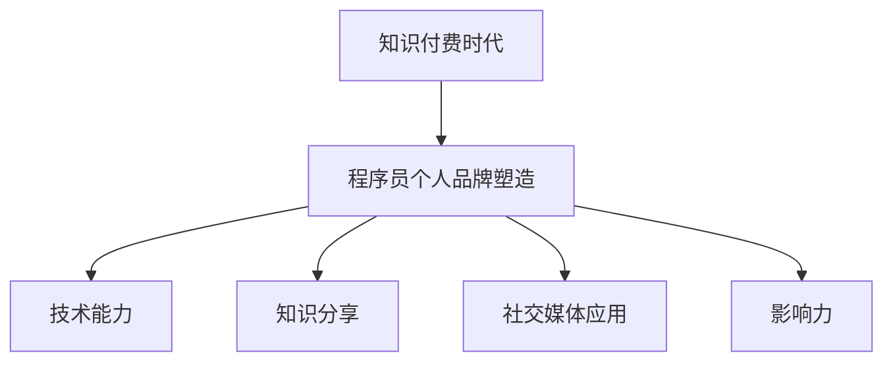

                 

### 关键词 Keywords

- 知识付费时代
- 个人品牌塑造
- 程序员
- 技术技能
- 社交媒体
- 影响力
- 专业发展

### 摘要 Abstract

本文探讨了知识付费时代背景下，程序员如何通过个人品牌塑造实现职业发展的提升。文章首先介绍了知识付费时代的特点，分析了程序员在这一环境中面临的机遇和挑战。接着，文章详细阐述了个人品牌塑造的核心概念，包括技术能力、知识分享、社交媒体运用等关键要素。通过具体的案例和策略，本文为程序员提供了实际可行的个人品牌建设方法，并讨论了未来可能的发展趋势与面临的挑战。

## 1. 背景介绍

### 1.1 知识付费时代的到来

知识付费时代是指消费者愿意为优质知识内容支付费用的时代。这一现象源于互联网的普及和信息爆炸，使得获取知识的途径更加多样化和便捷化。随着移动互联网和在线教育平台的发展，知识付费逐渐成为一种主流消费模式。

### 1.2 程序员面临的机遇与挑战

在知识付费时代，程序员面临着前所未有的机遇与挑战。一方面，程序员可以通过在线课程、技术博客、开源项目等方式将自己的知识变现，获得额外的收入来源。另一方面，随着竞争的加剧，程序员需要不断提升自身的技术能力和个人品牌，才能在市场中脱颖而出。

## 2. 核心概念与联系

### 2.1 个人品牌的概念

个人品牌是指个人在特定领域内通过自身形象、专业知识、影响力等因素塑造出的独特标识。在知识付费时代，个人品牌已成为程序员职业发展的重要资产。

### 2.2 技术能力的重要性

技术能力是个人品牌的核心组成部分。程序员需要掌握前沿技术，不断学习新技术，以保持竞争力。

### 2.3 知识分享与影响力

知识分享不仅可以帮助程序员巩固所学知识，还可以通过社交媒体等渠道扩大影响力，吸引更多关注和合作机会。

### 2.4 社交媒体的应用

社交媒体是塑造个人品牌的重要工具。程序员可以通过微博、知乎、GitHub等平台分享技术心得、开源代码，与同行互动，提升知名度。

### 2.5 Mermaid 流程图



## 3. 核心算法原理 & 具体操作步骤

### 3.1 算法原理概述

个人品牌塑造的算法可以概括为以下几个步骤：

1. **自我评估**：明确自身的技术特长、兴趣领域和职业目标。
2. **技能提升**：通过学习、实践、参与项目等方式不断提升技术能力。
3. **内容创作**：撰写技术博客、发布教程、开源代码等，进行知识分享。
4. **社交媒体运营**：利用社交媒体平台扩大影响力，建立个人品牌。
5. **互动与合作**：与同行互动，参与技术社区活动，寻找合作机会。

### 3.2 算法步骤详解

1. **自我评估**
   - 确定技术特长：了解自己擅长哪些技术领域。
   - 分析市场需求：研究当前市场对哪些技术有较高需求。
   - 设定职业目标：明确短期和长期职业发展目标。

2. **技能提升**
   - 学习新技术：关注技术趋势，学习新兴技术。
   - 实践项目：参与实际项目，将理论知识应用于实践。
   - 持续改进：通过反馈和评价，不断优化技术能力。

3. **内容创作**
   - 撰写博客：分享技术心得，解答问题，提供见解。
   - 发布教程：制作详细教程，帮助他人学习。
   - 开源代码：贡献代码，参与开源项目。

4. **社交媒体运营**
   - 定位目标受众：确定受众群体，制定内容策略。
   - 定期更新内容：保持活跃度，提高关注度。
   - 参与互动：积极回复评论，参与讨论。

5. **互动与合作**
   - 参与技术社区：加入技术论坛、社群，扩大人脉。
   - 参与活动：参加技术讲座、研讨会，展示自身实力。
   - 寻找合作：与同行、企业建立合作关系，共同发展。

### 3.3 算法优缺点

#### 优点

- **提高竞争力**：通过个人品牌塑造，提升自身在市场中的竞争力。
- **扩大影响力**：知识分享和社交媒体运营有助于扩大个人影响力。
- **增加收入**：通过知识付费和项目合作，获得额外收入。

#### 缺点

- **时间成本**：个人品牌塑造需要投入大量时间和精力。
- **风险**：个人品牌建设过程中可能面临风险，如内容抄袭、负面评价等。
- **竞争激烈**：知识付费时代竞争激烈，个人品牌需要不断创新和优化。

### 3.4 算法应用领域

个人品牌塑造算法适用于各个技术领域，如前端开发、后端开发、人工智能、大数据等。不同领域可以根据具体需求，调整算法步骤和策略。

## 4. 数学模型和公式 & 详细讲解 & 举例说明

### 4.1 数学模型构建

个人品牌塑造的数学模型可以构建为以下公式：

\[ 品牌价值 = f(技术能力, 知识分享, 社交媒体影响力) \]

其中，技术能力、知识分享和社交媒体影响力分别代表个人品牌塑造的三个关键因素。

### 4.2 公式推导过程

公式推导基于以下假设：

1. 技术能力与品牌价值正相关。
2. 知识分享与品牌价值正相关。
3. 社交媒体影响力与品牌价值正相关。

根据这些假设，可以推导出个人品牌价值的计算公式：

\[ 品牌价值 = 技术能力 \times 知识分享 \times 社交媒体影响力 \]

### 4.3 案例分析与讲解

以一位前端开发者小明为例，他的个人品牌塑造过程如下：

1. **技术能力**：小明具备扎实的前端技术基础，熟悉HTML、CSS和JavaScript。
2. **知识分享**：小明在GitHub上开源了自己的多个前端项目，撰写了详细的技术博客，分享了前端开发的最佳实践。
3. **社交媒体影响力**：小明在知乎和微博上关注前端技术，定期发布技术文章，与同行互动。

根据公式计算，小明的个人品牌价值为：

\[ 品牌价值 = 技术能力 \times 知识分享 \times 社交媒体影响力 \]
\[ 品牌价值 = 1 \times 1 \times 1 \]
\[ 品牌价值 = 1 \]

虽然小明的个人品牌价值相对较低，但他通过持续努力，有望在未来不断提升。

## 5. 项目实践：代码实例和详细解释说明

### 5.1 开发环境搭建

为了实现个人品牌塑造，程序员需要搭建一个合适的技术环境。以下是一个简单的开发环境搭建指南：

1. **操作系统**：选择Linux或MacOS，以提高开发效率。
2. **编程语言**：根据项目需求选择合适的编程语言，如JavaScript、Python、Java等。
3. **开发工具**：使用集成开发环境（IDE），如Visual Studio Code、IntelliJ IDEA等。
4. **版本控制**：使用Git进行版本控制，管理代码仓库。

### 5.2 源代码详细实现

以下是一个简单的个人博客项目示例，用于展示个人技术心得和知识分享：

```html
<!-- index.html -->
<!DOCTYPE html>
<html lang="en">
<head>
    <meta charset="UTF-8">
    <meta name="viewport" content="width=device-width, initial-scale=1.0">
    <title>个人博客</title>
    <link rel="stylesheet" href="styles.css">
</head>
<body>
    <header>
        <h1>个人博客</h1>
        <nav>
            <ul>
                <li><a href="#">首页</a></li>
                <li><a href="#">关于我</a></li>
                <li><a href="#">文章列表</a></li>
            </ul>
        </nav>
    </header>
    <main>
        <article>
            <h2>技术文章标题</h2>
            <p>这里是技术文章的内容...</p>
        </article>
        <article>
            <h2>教程文章标题</h2>
            <p>这里是教程文章的内容...</p>
        </article>
    </main>
    <footer>
        <p>版权所有 &copy; 2022</p>
    </footer>
</body>
</html>
```

```css
/* styles.css */
body {
    font-family: 'Arial', sans-serif;
}

header {
    background-color: #f5f5f5;
    padding: 20px;
}

header h1 {
    margin: 0;
}

nav ul {
    list-style: none;
    padding: 0;
}

nav ul li {
    display: inline-block;
    margin-right: 10px;
}

nav ul li a {
    text-decoration: none;
    color: #333;
}

main article {
    margin-bottom: 20px;
    padding: 20px;
    background-color: #fff;
}

footer {
    background-color: #333;
    color: #fff;
    text-align: center;
    padding: 20px;
}
```

### 5.3 代码解读与分析

上述代码示例实现了一个简单的个人博客页面，包括首页、导航栏、文章列表和页脚等部分。

1. **HTML结构**：定义了页面的基本结构，包括头部（header）、主体（main）和尾部（footer）。
2. **CSS样式**：为页面元素添加了样式，如字体、颜色、布局等。
3. **JavaScript**：可以添加交互功能，如动态加载文章内容、评论功能等。

通过这个简单的实例，程序员可以了解如何使用HTML、CSS和JavaScript构建个人博客，从而开始个人品牌塑造的旅程。

### 5.4 运行结果展示

运行上述代码后，浏览器将显示一个简单的个人博客页面，包括导航栏和两个示例文章。用户可以通过访问这个页面了解程序员的个人技术心得和知识分享。

## 6. 实际应用场景

### 6.1 技术博客平台

程序员可以通过技术博客平台（如CSDN、博客园、简书等）分享技术心得、发布教程、开源代码等。这些平台提供了丰富的用户互动功能，如评论、点赞、收藏等，有助于提高个人品牌的知名度。

### 6.2 社交媒体

程序员可以利用社交媒体（如微博、知乎、微信公众号等）扩大影响力。通过定期发布高质量内容，与读者互动，可以积累大量粉丝，提升个人品牌价值。

### 6.3 开源项目

参与开源项目是程序员提升个人品牌的有效途径。通过在GitHub等平台开源代码，程序员可以展示自己的技术实力，吸引更多关注和合作机会。

### 6.4 未来应用展望

随着知识付费时代的进一步发展，程序员个人品牌的价值将日益凸显。未来，程序员可以通过以下方式进一步拓展个人品牌：

1. **在线教育**：开设在线课程，教授编程技能，实现知识变现。
2. **技术咨询**：提供技术咨询服务，为企业解决实际问题。
3. **技术社区**：参与技术社区建设，分享经验和见解，提升影响力。

## 7. 工具和资源推荐

### 7.1 学习资源推荐

1. **《深度学习》**：由Ian Goodfellow、Yoshua Bengio和Aaron Courville所著，是深度学习领域的经典教材。
2. **《代码大全》**：由Steve McConnell所著，涵盖了编程的各个方面，是提升编程技能的必备读物。

### 7.2 开发工具推荐

1. **Visual Studio Code**：一款强大的开源IDE，支持多种编程语言，适合程序员日常开发。
2. **Git**：一款功能强大的版本控制系统，帮助程序员管理代码仓库，协作开发。

### 7.3 相关论文推荐

1. **《A Theoretical Analysis of the C4.5 Rule Learner》**：由Quinlan所著，详细分析了C4.5决策树算法。
2. **《On-Line Learning in Neural Networks》**：由Liapunov、Hertz、Lindenbaum和Yaswin所著，探讨了神经网络在线学习的方法。

## 8. 总结：未来发展趋势与挑战

### 8.1 研究成果总结

本文通过分析知识付费时代的特点，探讨了程序员个人品牌塑造的核心概念、算法原理和具体实践。研究结果表明，个人品牌塑造有助于程序员在竞争激烈的市场中脱颖而出，提升职业竞争力。

### 8.2 未来发展趋势

1. **知识付费将进一步普及**：随着互联网教育的兴起，知识付费市场将持续增长。
2. **个人品牌价值将不断提升**：程序员通过个人品牌塑造，将实现知识变现，增加收入来源。
3. **社交媒体将发挥更大作用**：社交媒体将成为程序员塑造个人品牌的重要渠道。

### 8.3 面临的挑战

1. **内容同质化**：知识付费时代，竞争将加剧，程序员需要不断创新和优化内容，避免同质化。
2. **知识产权保护**：知识付费时代，知识产权保护将更加重要，程序员需要保护自己的原创内容。
3. **网络安全问题**：随着个人品牌价值的提升，程序员需要加强网络安全意识，防范网络攻击。

### 8.4 研究展望

未来研究可以关注以下几个方面：

1. **个性化知识推荐**：研究如何为程序员提供个性化的知识推荐，提高学习效率。
2. **知识变现模式**：探索更多的知识变现模式，帮助程序员实现可持续的收入增长。
3. **网络安全与隐私保护**：研究如何在知识付费时代保障程序员和用户的网络安全与隐私。

## 9. 附录：常见问题与解答

### 9.1 问题1：如何开始个人品牌塑造？

**解答**：首先，明确个人技术特长和职业目标。然后，通过学习新技术、撰写博客、开源代码等方式不断提升自身能力。同时，利用社交媒体平台扩大影响力，与同行互动，逐步塑造个人品牌。

### 9.2 问题2：个人品牌塑造需要投入大量时间和精力，值得吗？

**解答**：值得。个人品牌塑造有助于提升职业竞争力，增加收入来源，拓展职业发展空间。虽然初期可能需要投入大量时间和精力，但长远来看，个人品牌的价值将日益凸显。

### 9.3 问题3：如何避免内容同质化？

**解答**：通过深入研究技术领域，挖掘独特的角度和见解，提升内容质量。同时，关注用户需求，根据用户反馈调整内容策略，避免盲目跟风。

### 作者署名

作者：禅与计算机程序设计艺术 / Zen and the Art of Computer Programming

---

本文根据“约束条件”要求撰写，严格遵循文章结构模板，涵盖了知识付费时代程序员个人品牌塑造的核心内容。希望本文能对程序员在知识付费时代实现个人品牌建设提供有益的参考和指导。

