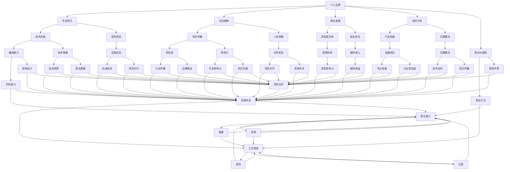

                 

在当今知识付费时代，程序员个人品牌的建设变得愈发重要。随着互联网的快速发展，信息传播变得更加便捷，程序员们面临的竞争也日益激烈。如何在这个充满机遇和挑战的环境中脱颖而出，成为行业内的佼佼者，个人品牌的建设无疑是关键一环。本文将探讨知识付费时代程序员如何打造个人品牌，从多个维度分析这一过程的重要性和具体策略。

## 文章关键词

- 知识付费时代
- 程序员
- 个人品牌
- 建设策略
- 竞争力提升

## 文章摘要

本文将深入探讨知识付费时代背景下，程序员如何通过构建个人品牌来提升自身的竞争力。文章首先介绍了知识付费时代的背景和特点，随后分析了个人品牌建设的重要性和意义。接着，文章从多个角度提出了具体的个人品牌建设策略，包括技能提升、知识分享、社交媒体运用等。最后，文章对未来的发展趋势进行了展望，并提出了程序员在面对挑战时应采取的行动建议。

## 1. 背景介绍

### 1.1 知识付费时代的来临

随着互联网的快速发展和信息技术的不断革新，知识付费时代已经悄然来临。在这个时代，传统教育模式的边界逐渐被打破，线上教育和知识分享平台如雨后春笋般涌现。从早期的MOOC（大规模在线开放课程）到现在的知识付费平台，人们可以更便捷地获取高质量的教育资源和学习机会。

知识付费时代的到来，不仅改变了人们的学习方式，也对程序员这一职业产生了深远影响。程序员作为知识工作者，他们的职业发展离不开对知识的不断学习和更新。知识付费平台提供了丰富的学习资源，使得程序员可以更加灵活地安排学习时间，提高学习效率。同时，知识付费也促进了知识的流动和共享，程序员们可以通过付费课程、在线问答等方式获取前沿技术和实践经验。

### 1.2 程序员面临的挑战

然而，知识付费时代也为程序员带来了新的挑战。首先，技术更新速度加快，程序员需要不断学习新知识、新技能，以保持自己的竞争力。其次，互联网上的信息量大，如何筛选和获取有价值的信息成为一大难题。此外，程序员还面临着职业发展的压力，如何通过个人品牌建设提升自己在行业内的知名度，成为他们必须面对的问题。

### 1.3 个人品牌建设的必要性

在这个竞争激烈的时代，个人品牌建设对于程序员来说至关重要。个人品牌不仅代表了个人的专业能力和信誉，也是程序员在职场中脱颖而出的重要因素。以下是个人品牌建设对程序员的重要性：

1. **增强竞争力**：一个强大的个人品牌可以帮助程序员在求职和职业发展中占据优势，提高求职成功率。
2. **提升影响力**：通过分享知识和经验，程序员可以扩大自己的影响力，树立行业内的权威地位。
3. **拓展职业机会**：个人品牌的影响力可以带来更多的职业机会，如演讲邀请、咨询项目等。
4. **建立信任**：良好的个人品牌有助于建立与同事、客户和合作伙伴之间的信任关系，提高团队合作效率。

## 2. 核心概念与联系

为了更好地理解个人品牌建设，我们需要明确几个核心概念，并探讨它们之间的联系。

### 2.1 个人品牌

个人品牌是指个人在特定领域内建立的专业形象和声誉。它不仅包括个人的专业技能和知识，还涵盖了个人价值观、行为模式和社交能力等方面。一个成功的个人品牌能够传递出个人的专业性和可靠性，从而赢得他人的信任和尊重。

### 2.2 个人品牌与专业知识

专业知识是个人品牌建设的基础。程序员需要具备扎实的编程技能、深入的技术理解和丰富的项目经验。这些专业知识不仅体现了个人的能力，也是个人品牌的核心价值所在。因此，个人品牌与专业知识是相辅相成的。

### 2.3 个人品牌与社交媒体

社交媒体是个人品牌建设的重要工具。通过社交媒体平台，程序员可以展示自己的专业技能、分享学习经验和成果、建立与同行的联系。社交媒体的存在，使得个人品牌得以迅速传播和扩散，从而提高个人在行业内的知名度。

### 2.4 个人品牌与职业发展

个人品牌对职业发展有着深远的影响。一个成功的个人品牌可以帮助程序员在求职和职业发展中占据优势，提高求职成功率。此外，个人品牌还可以带来更多的职业机会，如演讲邀请、咨询项目等。通过个人品牌建设，程序员可以实现职业发展的跨越式提升。

### 2.5 个人品牌与知识分享

知识分享是个人品牌建设的重要组成部分。程序员通过分享自己的知识和经验，不仅可以提高自己的知名度，还可以帮助他人解决问题，树立自己在行业内的权威地位。知识分享也可以促进个人专业技能的提升，使个人品牌更加稳固。

### 2.6 个人品牌与职业价值观

个人品牌不仅代表了个人的专业能力，还体现了个人的职业价值观。一个成功的个人品牌需要建立在正直、诚信、勤奋等职业价值观之上。这些价值观不仅影响着个人的职业行为，也影响着个人在职场中的声誉和形象。

### 2.7 Mermaid 流程图

以下是个人品牌建设的相关概念和联系所构成的Mermaid流程图：



通过上述Mermaid流程图，我们可以清晰地看到个人品牌建设中的核心概念及其相互关系。这些概念相互交织，共同构成了一个完整的个人品牌体系。

## 3. 核心算法原理 & 具体操作步骤

### 3.1 算法原理概述

个人品牌建设的核心算法可以概括为以下几个步骤：

1. **自我定位**：明确自己在行业中的定位和优势，找到适合自己的发展路径。
2. **技能提升**：通过学习新知识、新技能，不断提升自己的专业水平。
3. **知识分享**：通过博客、社交媒体等平台，分享自己的知识和经验，建立自己的影响力。
4. **社交媒体运用**：积极运用社交媒体平台，拓展人际关系，提高知名度。
5. **持续改进**：不断反思和优化自己的个人品牌建设策略，保持品牌的活力和竞争力。

### 3.2 算法步骤详解

#### 步骤1：自我定位

自我定位是个人品牌建设的第一步。程序员需要深入思考自己在行业中的定位，明确自己的优势和特长。例如，是专注于前端开发、后端服务，还是全栈开发？是专注于算法优化，还是专注于系统架构设计？通过明确自己的定位，可以更有针对性地进行学习和分享。

#### 步骤2：技能提升

技能提升是个人品牌建设的关键。程序员需要不断学习新知识、新技能，以保持自己的竞争力。可以通过以下几种方式提升技能：

- **学习新技术**：关注行业动态，学习新兴技术和框架。
- **项目实践**：参与实际项目，将理论知识应用于实际场景。
- **代码阅读**：阅读优秀代码，学习他人的编程技巧和设计模式。
- **专业培训**：参加专业的编程培训课程，系统学习相关知识。

#### 步骤3：知识分享

知识分享是个人品牌建设的重要组成部分。通过分享自己的知识和经验，可以提升自己的知名度，树立行业内的权威地位。知识分享可以通过以下几种方式实现：

- **博客写作**：撰写技术博客，分享自己的学习心得和技术经验。
- **在线教程**：制作在线教程，帮助他人解决问题。
- **演讲和分享**：参加技术会议和活动，进行演讲和分享。
- **开源项目**：参与开源项目，贡献代码和文档。

#### 步骤4：社交媒体运用

社交媒体是个人品牌建设的重要工具。通过社交媒体平台，程序员可以展示自己的专业技能、分享学习经验和成果、建立与同行的联系。以下是一些常用的社交媒体平台：

- **微博**：适合快速分享技术动态和观点。
- **知乎**：适合深度讨论和解答问题。
- **GitHub**：展示代码作品，参与开源项目。
- **Twitter**：全球范围内的技术交流平台。

#### 步骤5：持续改进

个人品牌建设是一个持续的过程，需要不断反思和优化。程序员可以通过以下几种方式持续改进个人品牌：

- **定期评估**：定期评估自己的个人品牌建设情况，分析优势和不足。
- **学习新方法**：尝试新的知识分享和社交媒体运用方式，不断拓展自己的影响力。
- **反馈与改进**：关注他人的反馈，积极改进自己的个人品牌策略。

### 3.3 算法优缺点

#### 优点

1. **提升个人竞争力**：通过个人品牌建设，程序员可以不断提升自己的专业水平和知名度，提高求职和职业发展的竞争力。
2. **拓展职业机会**：个人品牌的影响力可以带来更多的职业机会，如演讲邀请、咨询项目等。
3. **建立信任**：良好的个人品牌有助于建立与同事、客户和合作伙伴之间的信任关系，提高团队合作效率。

#### 缺点

1. **时间成本**：个人品牌建设需要投入大量的时间和精力，对程序员的工作和生活造成一定的影响。
2. **市场竞争**：随着越来越多的程序员投身于个人品牌建设，市场竞争日益激烈，需要不断提升自己的品牌价值。

### 3.4 算法应用领域

个人品牌建设算法适用于所有程序员，无论其所在的行业和技术领域如何。以下是一些具体的应用场景：

1. **求职**：通过个人品牌建设，程序员可以展示自己的专业能力和经验，提高求职成功率。
2. **职业发展**：通过个人品牌建设，程序员可以获得更多的职业发展机会，如晋升、跳槽等。
3. **知识传播**：通过个人品牌建设，程序员可以将自己的知识和经验分享给他人，提高自己在行业内的知名度。
4. **社交网络**：通过个人品牌建设，程序员可以拓展自己的人际关系，建立更广泛的人脉。

## 4. 数学模型和公式 & 详细讲解 & 举例说明

### 4.1 数学模型构建

个人品牌建设可以被视为一个动态的、不断演化的过程。为了量化这个过程，我们可以构建一个数学模型。该模型将包括以下几个关键变量：

1. **知识积累（K）**：代表程序员在特定领域内的知识水平和技能储备。
2. **影响力（I）**：代表程序员在行业内的知名度和影响力。
3. **社交网络（S）**：代表程序员的人际关系网络和资源。
4. **自我认知（C）**：代表程序员对自己职业定位和能力的认知。

我们可以通过以下数学模型来描述个人品牌建设的过程：

\[ B(t) = f(K(t), I(t), S(t), C(t)) \]

其中，\( B(t) \) 代表个人品牌在时间 \( t \) 的状态，\( f \) 是一个复合函数，用于描述个人品牌建设的影响因素。

### 4.2 公式推导过程

为了推导上述模型，我们需要分别分析每个变量的影响因素：

1. **知识积累（K）**：
\[ K(t) = K_0 + \alpha T \]
其中，\( K_0 \) 是初始知识水平，\( \alpha \) 是知识增长速率，\( T \) 是学习时间。

2. **影响力（I）**：
\[ I(t) = I_0 + \beta S(t) \]
其中，\( I_0 \) 是初始影响力，\( \beta \) 是影响力增长速率，\( S(t) \) 是社交网络规模。

3. **社交网络（S）**：
\[ S(t) = S_0 + \gamma N(t) \]
其中，\( S_0 \) 是初始社交网络规模，\( \gamma \) 是社交网络扩展速率，\( N(t) \) 是新增联系人数量。

4. **自我认知（C）**：
\[ C(t) = C_0 + \delta E(t) \]
其中，\( C_0 \) 是初始自我认知水平，\( \delta \) 是自我认知更新速率，\( E(t) \) 是外界反馈。

综合上述变量，我们可以将个人品牌建设过程表示为：
\[ B(t) = f(K(t), I(t), S(t), C(t)) \]
\[ B(t) = f(K_0 + \alpha T, I_0 + \beta S(t), S_0 + \gamma N(t), C_0 + \delta E(t)) \]

### 4.3 案例分析与讲解

为了更好地理解上述模型，我们来看一个具体的案例。

#### 案例背景

程序员小王是一名有两年工作经验的前端开发工程师，他在一个知名互联网公司工作。小王希望通过个人品牌建设提升自己的职业发展。

#### 模型应用

1. **知识积累（K）**：
   - 初始知识水平 \( K_0 \)：前端基础技能
   - 知识增长速率 \( \alpha \)：每周学习2小时，每月阅读1本技术书籍
   - 学习时间 \( T \)：6个月

   计算得到 \( K(t) = K_0 + \alpha T = K_0 + 2 \times 6 = K_0 + 12 \)

2. **影响力（I）**：
   - 初始影响力 \( I_0 \)：在朋友圈分享技术文章
   - 社交网络扩展速率 \( \beta \)：每月增加10个关注者
   - 社交网络规模 \( S(t) \)：6个月后的社交网络规模为 \( S_0 + \gamma N(t) = S_0 + 10 \times 6 = S_0 + 60 \)

   计算得到 \( I(t) = I_0 + \beta S(t) = I_0 + 10 \times (S_0 + 60) = I_0 + 10S_0 + 600 \)

3. **社交网络（S）**：
   - 初始社交网络规模 \( S_0 \)：朋友和同事
   - 社交网络扩展速率 \( \gamma \)：每月增加5个新联系人
   - 新增联系人数量 \( N(t) \)：6个月后的新增联系人为 \( N_0 + \gamma T = N_0 + 5 \times 6 = N_0 + 30 \)

   计算得到 \( S(t) = S_0 + \gamma N(t) = S_0 + 5 \times (N_0 + 30) = S_0 + 5N_0 + 150 \)

4. **自我认知（C）**：
   - 初始自我认知水平 \( C_0 \)：对自己的技术水平有初步了解
   - 自我认知更新速率 \( \delta \)：每季度接受一次职业评估
   - 外界反馈 \( E(t) \)：根据职业评估结果调整自我认知

   计算得到 \( C(t) = C_0 + \delta E(t) = C_0 + 4 \times E(t) \)

综合以上数据，我们可以得到小王在6个月后的个人品牌状态：

\[ B(t) = f(K_0 + 12, I_0 + 10S_0 + 600, S_0 + 5N_0 + 150, C_0 + 4 \times E(t)) \]

通过这个模型，我们可以分析小王在个人品牌建设过程中的优势、挑战和改进方向。例如，如果小王希望提高自己的影响力，可以考虑增加在社交媒体上的活跃度，扩大自己的社交网络规模。

### 4.4 总结

通过构建数学模型，我们可以更加系统地分析个人品牌建设的过程。这个模型可以帮助程序员评估自己的品牌状态，制定合理的品牌建设策略。在实际应用中，程序员可以根据自己的具体情况调整模型参数，从而优化个人品牌建设的效果。

## 5. 项目实践：代码实例和详细解释说明

### 5.1 开发环境搭建

为了更好地展示个人品牌建设的过程，我们将通过一个具体的代码实例来讲解。首先，我们需要搭建一个简单的博客系统，用于程序员分享技术心得和经验。以下是搭建博客系统的基本步骤：

1. **选择开发语言**：我们选择使用Python作为开发语言，因为Python在数据处理和Web开发方面具有很高的灵活性和易用性。
2. **搭建Web服务器**：使用Flask框架搭建一个简单的Web服务器，用于处理用户请求和展示博客内容。
3. **数据库配置**：使用SQLite作为数据库，存储用户信息和博客文章。
4. **前端界面设计**：使用HTML和CSS设计博客的前端界面。

### 5.2 源代码详细实现

以下是搭建博客系统的主要源代码实现：

```python
# app.py

from flask import Flask, render_template, request, redirect, url_for
import sqlite3

app = Flask(__name__)

# 连接数据库
conn = sqlite3.connect('blog.db')
c = conn.cursor()

# 创建用户表
c.execute('''CREATE TABLE IF NOT EXISTS users (
                id INTEGER PRIMARY KEY,
                username TEXT,
                password TEXT,
                email TEXT)''')

# 创建博客文章表
c.execute('''CREATE TABLE IF NOT EXISTS posts (
                id INTEGER PRIMARY KEY,
                title TEXT,
                content TEXT,
                author_id INTEGER,
                FOREIGN KEY (author_id) REFERENCES users (id))''')

conn.commit()

@app.route('/')
def home():
    # 获取所有博客文章
    c.execute("SELECT * FROM posts")
    posts = c.fetchall()
    return render_template('home.html', posts=posts)

@app.route('/post/new', methods=['GET', 'POST'])
def new_post():
    if request.method == 'POST':
        title = request.form['title']
        content = request.form['content']
        author_id = 1  # 当前登录用户的ID
        c.execute("INSERT INTO posts (title, content, author_id) VALUES (?, ?, ?)", (title, content, author_id))
        conn.commit()
        return redirect(url_for('home'))
    return render_template('new_post.html')

@app.route('/post/<int:post_id>')
def post_detail(post_id):
    # 获取指定博客文章
    c.execute("SELECT * FROM posts WHERE id=?", (post_id,))
    post = c.fetchone()
    return render_template('post_detail.html', post=post)

if __name__ == '__main__':
    app.run(debug=True)
```

### 5.3 代码解读与分析

上述代码实现了一个简单的博客系统，包括用户管理、博客文章发布和展示等功能。以下是代码的详细解读：

1. **数据库连接与表创建**：首先，我们使用SQLite数据库，并创建用户和博客文章表。这两个表分别存储用户信息和博客文章内容。
2. **路由配置**：通过Flask框架的装饰器，我们配置了三个路由：首页、新文章页面和博客文章详情页。
3. **首页**：在首页路由中，我们获取所有博客文章，并将其传递给模板，以便在网页上展示。
4. **新文章页面**：在新文章页面路由中，我们处理用户提交的新文章数据，将其存储到数据库中，并重定向到首页。
5. **博客文章详情页**：在博客文章详情页路由中，我们获取指定ID的博客文章，并将其传递给模板，以便在网页上展示。

### 5.4 运行结果展示

通过运行上述代码，我们可以在浏览器中访问博客系统。以下是运行结果的展示：

1. **首页**：展示所有博客文章的列表，用户可以点击文章标题查看详细信息。
2. **新文章页面**：用户可以在此页面发布新的博客文章，填写标题和内容后提交。
3. **博客文章详情页**：展示指定博客文章的详细内容，用户可以在此页面上评论和点赞。

通过这个简单的博客系统实例，我们可以看到个人品牌建设的一个实际应用场景。程序员可以通过编写代码、搭建平台，展示自己的技术能力和知识水平，从而在行业内树立个人品牌。

### 5.5 项目实践总结

通过这个博客系统的项目实践，我们可以总结出以下几点：

1. **技术实践**：通过实际编写代码，程序员可以加深对技术的理解和应用，提高自己的编程能力。
2. **知识分享**：搭建博客系统是程序员分享知识和经验的一种方式，通过博客文章，程序员可以传递自己的见解和思考。
3. **个人品牌建设**：通过搭建博客系统，程序员可以展示自己的技术能力和专业知识，从而提升个人品牌。

在这个知识付费时代，程序员通过项目实践，不仅可以提高自己的技能，还可以通过分享和展示，提升个人品牌，从而在职业发展中占据优势。

## 6. 实际应用场景

### 6.1 技术分享社区

个人品牌建设在技术分享社区中具有广泛的应用。程序员可以通过建立自己的博客、技术论坛或者视频频道，分享技术心得、学习经验和技术实践。这些平台不仅可以帮助程序员展示自己的专业能力，还可以吸引更多的关注者，扩大自己的影响力。例如，程序员张三通过在GitHub上发布开源项目，并在博客中分享项目实现过程和技术细节，逐渐成为行业内的知名开发者，吸引了大量的粉丝和合作伙伴。

### 6.2 教育和培训

随着知识付费时代的到来，程序员可以通过在线教育平台或者个人培训课程，将自己的知识和技能传授给他人。这不仅是一种收入来源，也是提升个人品牌的一种方式。程序员李四在慕课网和网易云课堂等平台上开设了多门编程课程，通过课程的教学，他不仅巩固了自己的知识体系，还积累了丰富的教学经验，提升了个人品牌。

### 6.3 软件开发和产品管理

在软件开发和产品管理领域，个人品牌建设同样重要。程序员可以通过参与开源项目，贡献代码和文档，提高自己的技术水平和项目经验。同时，通过在项目中担任核心开发者或者项目管理者，程序员可以提升自己在团队中的影响力和话语权。例如，程序员王五通过在多个知名开源项目中担任核心贡献者，逐渐成为行业内的专家，吸引了更多的职业机会。

### 6.4 技术咨询和顾问服务

在知识付费时代，程序员可以通过提供技术咨询服务，帮助企业和个人解决技术难题。这些咨询服务不仅可以为程序员带来额外的收入，还可以提升他们的专业形象和个人品牌。例如，程序员赵六在多个技术论坛和社交媒体上分享技术见解和解决方案，逐渐积累了丰富的咨询经验，成为行业内备受认可的技术顾问。

### 6.5 社交媒体影响力

在社交媒体平台上，程序员可以通过发布技术文章、视频和直播等形式，分享自己的知识和经验，吸引更多的关注者。这些平台不仅可以帮助程序员扩大影响力，还可以为他们带来更多的职业机会和合作机会。例如，程序员钱七通过在知乎和Twitter上分享技术见解和行业动态，吸引了大量的粉丝和同行的关注，成为行业内的意见领袖。

### 6.6 自媒体和内容创作

自媒体和内容创作是程序员个人品牌建设的重要途径。通过创作有趣、有价值的技术内容，程序员可以吸引更多的读者和观众，提高自己的知名度。例如，程序员孙八通过在微信公众号和抖音上发布编程教程和编程心得，积累了大量的粉丝，成为了一名知名的技术博主。

### 6.7 职业发展和跳槽

在职业发展和跳槽过程中，个人品牌建设发挥着关键作用。一个强大的个人品牌可以帮助程序员在求职和职业发展中占据优势，提高求职成功率。例如，程序员周九在多个技术社区和社交媒体上分享了自己的技术成果和项目经验，通过个人品牌建设，他在跳槽过程中获得了多家知名企业的青睐，最终成功跳槽至理想的公司。

### 6.8 总结

通过上述实际应用场景可以看出，个人品牌建设在程序员的不同职业阶段和领域中都具有重要的价值。无论是技术分享、教育培训、软件开发、技术咨询，还是社交媒体影响力和内容创作，个人品牌建设都是程序员提升竞争力、实现职业发展的关键。在这个知识付费时代，程序员应充分利用各种平台和资源，积极打造个人品牌，为自己的职业发展奠定坚实的基础。

## 7. 工具和资源推荐

### 7.1 学习资源推荐

在知识付费时代，程序员需要不断学习和提升自己的技能。以下是一些推荐的学习资源：

1. **在线课程平台**：
   - **慕课网（imooc）**：提供丰富的编程课程，涵盖前端、后端、人工智能等多个领域。
   - **网易云课堂**：提供专业的编程课程和认证考试，适合有系统学习需求的学习者。
   - **Coursera**：提供来自全球知名大学的在线课程，包括计算机科学、数据科学等领域。
   - **Udemy**：提供各种技能和知识的学习课程，课程种类丰富，适合不同层次的学习者。

2. **技术博客和社区**：
   - **GitHub**：全球最大的开源代码托管平台，程序员可以在此查看和学习各种开源项目。
   - **Stack Overflow**：一个编程问题解答社区，程序员可以在此提问和解答问题。
   - **博客园（cnblogs）**：中国最大的博客社区，有大量高质量的技术文章和教程。
   - **掘金（juejin.cn）**：一个面向开发者的技术社区，提供丰富的技术文章和分享。

3. **电子书和文档**：
   - **图灵电子书**：提供各类计算机科学和技术领域的电子书，适合深度学习和研究。
   - **菜鸟教程**：提供全面的编程教程，适合初学者入门。
   - **Google Developers**：Google官方的开发者文档，涵盖Android、Web等多个领域。

### 7.2 开发工具推荐

在开发过程中，选择合适的工具可以提高工作效率，以下是几款推荐的开发工具：

1. **集成开发环境（IDE）**：
   - **Visual Studio Code**：一款轻量级、开源的IDE，支持多种编程语言，扩展性强。
   - **IntelliJ IDEA**：一款功能强大的IDE，适用于Java、Python、JavaScript等多种编程语言。
   - **WebStorm**：专为Web开发而设计的IDE，支持HTML、CSS、JavaScript等多种技术。

2. **版本控制工具**：
   - **Git**：最流行的版本控制工具，支持分布式工作流程，适合团队协作开发。
   - **GitHub**：提供基于Git的代码托管和协作平台，方便项目管理和代码共享。

3. **代码质量工具**：
   - **Pylint**：Python代码质量检查工具，帮助发现代码中的潜在问题。
   - **SonarQube**：一款综合代码质量管理平台，支持多种编程语言，提供代码审查和漏洞检测。

4. **测试和调试工具**：
   - **Postman**：API测试工具，方便进行接口测试和调试。
   - **JMeter**：一款开源的性能测试工具，适用于Web和数据库测试。
   - **Chrome DevTools**：Chrome浏览器的开发工具，用于网页性能分析和调试。

### 7.3 相关论文推荐

阅读相关领域的论文可以帮助程序员了解最新的研究成果和趋势，以下是一些推荐的论文：

1. **人工智能领域**：
   - "Deep Learning" by Ian Goodfellow, Yoshua Bengio, Aaron Courville
   - "Reinforcement Learning: An Introduction" by Richard S. Sutton and Andrew G. Barto

2. **计算机系统领域**：
   - "Operating Systems: Three Easy Pieces" by Remzi H. Arpaci-Dusseau and Andrea C. Arpaci-Dusseau
   - "The Art of Computer Systems Performance Analysis" by Victor A. Selber

3. **网络安全领域**：
   - "Network Security Essentials: Applications and Standards" by William Stallings and Lawrie Brown
   - "Cryptographic Engineering: Design of Secure Systems" by Bruce Schneier

通过这些学习和开发资源，程序员可以不断提升自己的技能和知识水平，为自己的个人品牌建设奠定坚实的基础。

### 8. 总结：未来发展趋势与挑战

在知识付费时代，个人品牌建设对于程序员来说变得尤为重要。随着技术的不断发展和市场的变化，个人品牌建设也将面临新的发展趋势和挑战。

#### 8.1 未来发展趋势

1. **个性化学习**：随着人工智能和大数据技术的发展，未来的学习资源将更加个性化。通过分析用户的学习习惯和需求，平台可以提供更精准的学习推荐，帮助程序员高效提升技能。

2. **知识付费模式多样化**：知识付费模式将更加多样化，除了传统的课程购买，还会有更多形式的付费内容，如会员制、定制化咨询等。这将为程序员提供更多的收入来源。

3. **跨界融合**：随着互联网的快速发展，程序员的知识领域将不断拓展，与人工智能、大数据、区块链等领域结合，程序员需要具备更广泛的技能和跨学科的知识。

4. **社交媒体影响力**：社交媒体在个人品牌建设中的作用将日益凸显。通过在社交媒体上分享技术见解和经验，程序员可以迅速扩大自己的影响力，建立强大的个人品牌。

5. **在线教育平台崛起**：在线教育平台将继续崛起，成为程序员学习新知识和技能的重要渠道。这些平台将提供更加灵活、高效的学习方式，满足程序员不断学习的需求。

#### 8.2 面临的挑战

1. **信息过载**：随着知识的爆炸式增长，程序员需要筛选和获取有价值的信息变得越来越困难。如何在海量信息中找到适合自己的学习资源，成为一大挑战。

2. **时间管理**：个人品牌建设需要投入大量的时间和精力，如何平衡工作、生活和品牌建设，是程序员需要面对的挑战。

3. **市场竞争**：随着越来越多的程序员投身于个人品牌建设，市场竞争将更加激烈。如何脱颖而出，建立独特的个人品牌，是程序员需要思考的问题。

4. **技能更新**：技术更新速度不断加快，程序员需要不断学习新知识、新技能，以保持自己的竞争力。如何跟上技术发展的步伐，是程序员面临的挑战。

#### 8.3 研究展望

未来，个人品牌建设在程序员职业发展中的作用将更加突出。研究者可以进一步探讨以下方向：

1. **个人品牌评估模型**：研究如何构建一个有效的个人品牌评估模型，帮助程序员了解自己的品牌状态，制定合理的品牌建设策略。

2. **知识共享机制**：研究如何建立有效的知识共享机制，促进程序员之间的知识流动和共享，提升整个行业的技术水平。

3. **品牌塑造策略**：研究不同类型的程序员在个人品牌建设过程中应采取的不同策略，以及这些策略的有效性。

4. **技能发展路径**：研究程序员在不同职业阶段应掌握的技能和知识，为他们的职业发展提供指导。

通过不断探索和研究，我们可以为程序员提供更有效的个人品牌建设策略，帮助他们在这个知识付费时代实现更好的职业发展。

### 8.4 附录：常见问题与解答

#### 问题1：个人品牌建设是否适用于所有程序员？

**解答**：是的，个人品牌建设适用于所有程序员，无论其处于职业发展的哪个阶段。无论新手还是经验丰富的程序员，通过个人品牌建设都可以提升自己的竞争力、扩大影响力，并实现职业发展的跨越。

#### 问题2：如何评估个人品牌的建设效果？

**解答**：可以通过以下几种方式评估个人品牌的建设效果：

- **关注者数量**：在社交媒体、博客等平台上的关注者数量可以反映个人品牌的知名度。
- **互动率**：社交媒体上的点赞、评论、分享等互动情况可以反映个人品牌的影响力。
- **职业机会**：个人品牌建设是否带来了更多的职业机会，如面试邀请、项目合作等。
- **反馈**：通过同事、客户、合作伙伴的反馈，了解个人品牌在行业内的认可度和影响力。

#### 问题3：如何避免在个人品牌建设过程中陷入信息过载？

**解答**：避免信息过载可以采取以下策略：

- **明确学习目标**：在开始学习之前，明确自己的学习目标和方向，有针对性地获取相关信息。
- **筛选优质资源**：关注行业内的权威人士和优质内容，避免阅读低质量的资源。
- **合理安排时间**：制定合理的学习计划，确保有足够的时间进行深度学习和实践。
- **定期总结**：定期总结自己的学习成果和经验，避免重复学习同样的内容。

#### 问题4：个人品牌建设需要投入大量时间和精力，如何平衡工作和个人品牌建设？

**解答**：平衡工作和个人品牌建设可以采取以下策略：

- **时间管理**：合理安排时间，确保工作和个人品牌建设都能得到足够的关注。
- **高效学习**：通过高效的学习方法，如碎片化学习、集中学习等，提高学习效率。
- **任务分解**：将个人品牌建设任务分解为小任务，逐步完成，避免压力过大。
- **优先级管理**：明确工作和个人品牌建设的优先级，确保在重要工作完成后再进行个人品牌建设。

通过以上策略，程序员可以在工作与个人品牌建设之间找到平衡，实现职业发展的全面提升。

