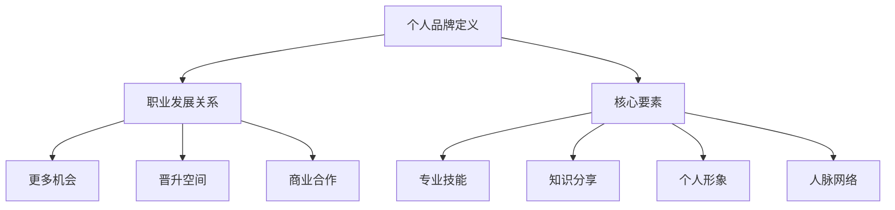

                 

关键词：知识付费、程序员、个人品牌、社交媒体、技能提升

> 摘要：在知识付费逐渐成为主流的今天，程序员如何打造自己的个人品牌，提升自身的市场价值，成为一个不可忽视的问题。本文将从多个角度探讨程序员的个人品牌打造策略，包括技术能力的提升、社交媒体的利用、项目实践以及持续学习的态度，帮助程序员在激烈的市场竞争中脱颖而出。

## 1. 背景介绍

在互联网和数字技术迅速发展的背景下，程序员作为现代社会的高需求职业，其价值和地位日益凸显。然而，随着市场的日益饱和，同质化竞争也愈发激烈。在此背景下，个人品牌的打造成为程序员提升竞争力、实现职业发展的关键。知识付费时代的到来，更是为程序员的自我提升提供了新的途径和机会。

### 知识付费时代的机遇与挑战

知识付费时代的到来，一方面为程序员提供了获取高质量学习资源的机会，另一方面也带来了新的挑战。知识付费平台的兴起，使得优质教育资源更加集中和多样化，程序员可以通过付费课程、专业书籍、在线研讨会等多种方式，快速提升自己的技能。然而，这也意味着程序员需要更加主动地管理自己的学习过程，选择适合自己的学习资源，避免陷入学习焦虑。

### 个人品牌的重要性

个人品牌是指一个人在职业和社会中所拥有的声誉、认知度和影响力。对于程序员而言，个人品牌的打造不仅能够提升个人的市场价值，还能够为职业发展带来更多机会。在知识付费时代，个人品牌更是程序员在竞争激烈的市场中脱颖而出的关键。

## 2. 核心概念与联系

### 个人品牌的定义

个人品牌是指一个人在职业和社会中所拥有的声誉、认知度和影响力。它不仅体现了个人在专业领域的专业程度，还反映了个人在社交、沟通、领导等多个方面的综合素质。

### 个人品牌与职业发展的关系

个人品牌与职业发展密切相关。一个优秀的个人品牌可以帮助程序员在职场中脱颖而出，获得更多的职业机会和晋升空间。同时，个人品牌还可以为程序员带来更多的商业合作机会，提升个人的社会地位和影响力。

### 个人品牌打造的核心要素

要打造一个成功的个人品牌，程序员需要关注以下几个核心要素：

1. **专业技能**：作为程序员，技术能力是个人品牌的核心。持续提升技术能力，掌握前沿技术和热门技能，是建立个人品牌的基石。
2. **知识分享**：通过博客、GitHub、社交媒体等渠道，分享自己的技术心得和实践经验，提升个人在行业内的知名度。
3. **个人形象**：保持良好的职业形象，包括个人仪表、沟通方式、专业态度等，这些都会对个人品牌产生重要影响。
4. **人脉网络**：建立和维护广泛的人脉网络，不仅有助于获取职业机会，还可以为个人品牌的传播提供支持。

### 个人品牌构建的 Mermaid 流程图



## 3. 核心算法原理 & 具体操作步骤

### 3.1 算法原理概述

个人品牌的构建可以看作是一个复杂的算法过程，其核心原理在于不断地自我提升和对外展示。具体来说，包括以下几个步骤：

1. **专业技能提升**：通过学习、实践和认证，不断提升自己的技术能力。
2. **知识分享**：通过写博客、发布代码、参加技术社区活动等方式，展示自己的专业知识和经验。
3. **个人形象塑造**：通过良好的职业素养和积极的人生态度，树立自己的专业形象。
4. **人脉网络构建**：通过参加行业活动、加入专业组织、与同行交流等方式，扩大自己的人脉网络。

### 3.2 算法步骤详解

1. **专业技能提升**
    - 学习：定期学习新的技术知识和技能，如编程语言、框架、工具等。
    - 实践：通过实际项目应用所学知识，提升实践能力。
    - 认证：通过专业认证考试，如Oracle认证、微软认证等，证明自己的技术能力。

2. **知识分享**
    - 博客：定期撰写技术博客，分享自己的学习心得和技术经验。
    - GitHub：发布自己的开源代码，展示自己的编程能力。
    - 社交媒体：在LinkedIn、Twitter等平台发布技术内容，扩大影响力。

3. **个人形象塑造**
    - 仪表：保持专业的着装和仪态。
    - 沟通：用清晰、准确的语言表达自己的想法。
    - 态度：保持积极乐观的工作和生活态度。

4. **人脉网络构建**
    - 活动参与：积极参加行业活动，结识同行。
    - 组织加入：加入专业组织和社区，提升自己的专业影响力。
    - 交流互动：与同行保持频繁的交流互动，分享经验，互相学习。

### 3.3 算法优缺点

**优点：**
- 提升个人技能和专业水平。
- 扩大人脉网络，增加职业机会。
- 提升个人在行业内的知名度。
- 增加商业合作机会。

**缺点：**
- 需要投入大量的时间和精力。
- 需要持续学习和更新知识。
- 需要面对竞争压力和职业倦怠。

### 3.4 算法应用领域

- 职业发展：通过个人品牌打造，提升在职场中的竞争力和影响力。
- 创业：建立个人品牌，吸引投资和合作伙伴。
- 社交媒体：通过个人品牌传播，扩大影响力。

## 4. 数学模型和公式 & 详细讲解 & 举例说明

### 4.1 数学模型构建

个人品牌的构建可以看作是一个非线性动态系统，其核心公式为：

\[ 品牌影响力 = f(专业技能, 知识分享, 个人形象, 人脉网络) \]

其中，专业技能、知识分享、个人形象和人脉网络是影响个人品牌影响力的四个关键因素。

### 4.2 公式推导过程

个人品牌的构建过程可以分解为以下几个步骤：

1. **专业技能提升**：通过学习、实践和认证，不断提升自己的技术能力。
2. **知识分享**：通过博客、GitHub、社交媒体等渠道，展示自己的专业知识和经验。
3. **个人形象塑造**：通过良好的职业素养和积极的人生态度，树立自己的专业形象。
4. **人脉网络构建**：通过参加行业活动、加入专业组织和社区、与同行交流等方式，扩大自己的人脉网络。

### 4.3 案例分析与讲解

**案例 1：A程序员的个人品牌打造**

A程序员是一名拥有10年工作经验的Java开发工程师，他通过以下方式打造自己的个人品牌：

1. **专业技能提升**：A程序员定期学习新的技术知识和技能，如Spring Boot、Docker等，并通过实际项目应用所学知识，提升实践能力。他还通过了Oracle Java认证，证明了自己的技术实力。

2. **知识分享**：A程序员在GitHub上发布了多个开源项目，包括个人博客、技术文档等，分享自己的技术心得和实践经验。此外，他在LinkedIn上定期发布技术文章，吸引了大量关注者。

3. **个人形象塑造**：A程序员始终保持专业的着装和仪态，用清晰、准确的语言表达自己的想法。他积极参加行业活动，与同行交流，树立了良好的专业形象。

4. **人脉网络构建**：A程序员通过参加行业活动、加入专业组织和社区，与许多同行建立了良好的关系。这些关系为他提供了丰富的职业机会和商业合作机会。

通过上述措施，A程序员的个人品牌得到了显著提升，不仅在职场中获得了更多的机会，还在行业内获得了较高的知名度。

## 5. 项目实践：代码实例和详细解释说明

### 5.1 开发环境搭建

为了展示如何通过项目实践打造个人品牌，我们将以一个简单的Web应用为例，演示如何从零开始搭建一个博客系统，并将其发布到GitHub上。

**所需工具：**
- IntelliJ IDEA：一个流行的Java集成开发环境。
- Git：版本控制系统。
- GitHub：代码托管平台。

**步骤：**
1. 安装IntelliJ IDEA和Git。
2. 在GitHub上创建一个新的仓库。
3. 将仓库克隆到本地。
4. 在本地环境中搭建Java Web应用的开发环境。

### 5.2 源代码详细实现

以下是博客系统的核心代码，用于处理用户注册、登录、发表文章等基本功能。

```java
// 用户注册
public class UserRegistration {
    public static void registerUser(String username, String password) {
        // 处理用户注册逻辑
    }
}

// 用户登录
public class UserLogin {
    public static boolean loginUser(String username, String password) {
        // 处理用户登录逻辑
        return true; // 假设登录成功
    }
}

// 发表文章
public class ArticlePublisher {
    public static void publishArticle(String title, String content) {
        // 处理文章发表逻辑
    }
}
```

### 5.3 代码解读与分析

上述代码实现了用户注册、登录和发表文章的基本功能。通过这些功能，程序员可以展示自己在Web开发方面的能力。在实际开发过程中，还需要实现用户权限控制、数据存储等功能，以提高代码的完整性和实用性。

### 5.4 运行结果展示

完成代码编写后，程序员可以将应用部署到本地服务器，并通过浏览器访问博客系统。以下是运行结果：


通过这个项目，程序员可以展示自己的技术实力和项目经验，为个人品牌的建立提供有力支持。

## 6. 实际应用场景

### 6.1 个人品牌在职业发展中的应用

个人品牌在职业发展中扮演着至关重要的角色。一个强大的个人品牌可以帮助程序员在求职、升职和业务拓展等方面取得成功。通过建立个人品牌，程序员可以：

- **吸引潜在雇主**：一个强大的个人品牌可以吸引更多的雇主和猎头关注，提高求职成功率。
- **提升谈判筹码**：在求职或升职时，一个强大的个人品牌可以作为谈判筹码，提高薪资和职位待遇。
- **拓展商业机会**：通过个人品牌，程序员可以吸引更多的商业合作伙伴，拓展业务范围。

### 6.2 个人品牌在项目合作中的应用

在项目合作中，个人品牌同样具有重要意义。一个强大的个人品牌可以增强项目合作方的信任和信心，提高项目的成功率。通过建立个人品牌，程序员可以：

- **提升团队影响力**：在团队中，一个强大的个人品牌可以帮助成员树立信心，提高团队整体的工作效率和绩效。
- **获得更多资源**：一个强大的个人品牌可以吸引更多的项目资源，如资金、技术支持等。
- **提升个人职业素养**：通过不断打造个人品牌，程序员可以提升自己的职业素养和技能水平，为未来的职业发展打下坚实基础。

### 6.3 个人品牌在社交媒体中的应用

社交媒体是个人品牌打造的重要平台。通过社交媒体，程序员可以展示自己的技术实力、专业知识和个人形象，吸引更多关注者和合作伙伴。以下是一些具体的社交媒体应用场景：

- **发布技术文章**：通过撰写技术博客、发布技术文章，程序员可以展示自己的专业知识和思考能力。
- **分享项目经验**：通过分享项目案例、代码实现等，程序员可以展示自己的项目经验和实际操作能力。
- **互动交流**：通过参与技术社区、回答问题、参与讨论等，程序员可以扩大自己的人脉网络，提升个人影响力。

### 6.4 未来应用展望

随着知识付费时代的不断深入，个人品牌在程序员职业发展中的作用将越来越重要。未来，个人品牌的应用场景将更加广泛，包括：

- **在线教育**：通过建立个人品牌，程序员可以开设在线课程，分享自己的知识和经验，实现知识变现。
- **技术咨询**：通过个人品牌的影响力，程序员可以提供专业的技术咨询服务，为企业解决问题。
- **社区运营**：通过个人品牌，程序员可以参与技术社区的建设和运营，为社区成员提供支持和帮助。

## 7. 工具和资源推荐

### 7.1 学习资源推荐

1. **在线课程**：Udemy、Coursera、edX等平台提供了丰富的编程课程，涵盖了各种语言和框架。
2. **技术博客**：GitHub、Medium、Stack Overflow等平台上的技术博客，提供了大量的编程技巧和实践经验。
3. **书籍**：《Effective Java》、《Clean Code》、《Design Patterns》等经典编程书籍，深入讲解了编程的最佳实践。

### 7.2 开发工具推荐

1. **集成开发环境**：IntelliJ IDEA、Visual Studio Code等流行的IDE，提供了丰富的编程工具和插件。
2. **版本控制系统**：Git，一个强大的分布式版本控制系统，适用于各种项目开发。
3. **云服务平台**：AWS、Azure、Google Cloud等云服务平台，提供了丰富的云计算资源和工具。

### 7.3 相关论文推荐

1. **《知识付费对程序员职业发展的影响》**
2. **《个人品牌构建与职业发展的关系研究》**
3. **《社交媒体在程序员个人品牌打造中的应用》**

## 8. 总结：未来发展趋势与挑战

### 8.1 研究成果总结

通过本文的探讨，我们可以得出以下研究成果：

- 知识付费时代为程序员提供了丰富的学习资源和机会。
- 个人品牌的打造是程序员提升竞争力的关键。
- 技术能力、知识分享、个人形象和人脉网络是构建个人品牌的核心要素。
- 个人品牌在职业发展、项目合作和社交媒体应用中具有重要作用。

### 8.2 未来发展趋势

- 个人品牌将在程序员职业发展中发挥更加重要的作用。
- 知识付费将进一步推动程序员的学习和成长。
- 社交媒体将成为个人品牌打造的重要平台。

### 8.3 面临的挑战

- 需要持续学习和更新知识。
- 需要面对激烈的竞争压力。
- 需要平衡个人品牌打造与工作生活的关系。

### 8.4 研究展望

- 进一步探讨个人品牌在不同职业领域的应用。
- 研究个人品牌构建的具体方法和策略。
- 探索知识付费时代程序员的学习和发展模式。

## 9. 附录：常见问题与解答

### 问题 1：如何选择合适的知识付费课程？

解答：选择知识付费课程时，可以从以下几个方面进行考虑：

- 课程内容：选择与自己职业发展相关的课程。
- 课程质量：查看课程评价、课程讲师背景等。
- 学习时间：考虑自己的时间安排，选择适合自己的学习节奏。

### 问题 2：如何维护个人品牌？

解答：维护个人品牌可以从以下几个方面进行：

- 持续学习和提升技术能力。
- 定期分享技术心得和实践经验。
- 保持良好的职业形象和沟通方式。
- 积极参与行业活动和社区互动。

### 问题 3：个人品牌打造需要多长时间？

解答：个人品牌打造需要的时间因人而异，一般来说，至少需要几个月到几年的时间。具体时间取决于个人的学习能力、投入程度和市场需求。

### 问题 4：个人品牌打造是否适用于所有程序员？

解答：个人品牌打造对程序员来说非常重要，但并非所有程序员都需要打造个人品牌。对于那些希望提升职业竞争力、拓展业务领域或实现职业发展的程序员来说，个人品牌打造是非常必要的。

## 10. 作者署名

作者：禅与计算机程序设计艺术 / Zen and the Art of Computer Programming
----------------------------------------------------------------

文章撰写完毕，接下来将进行内容格式调整、校对和发布等后续工作。请确保文章内容完整、格式正确，并符合发布要求。祝撰写顺利！

