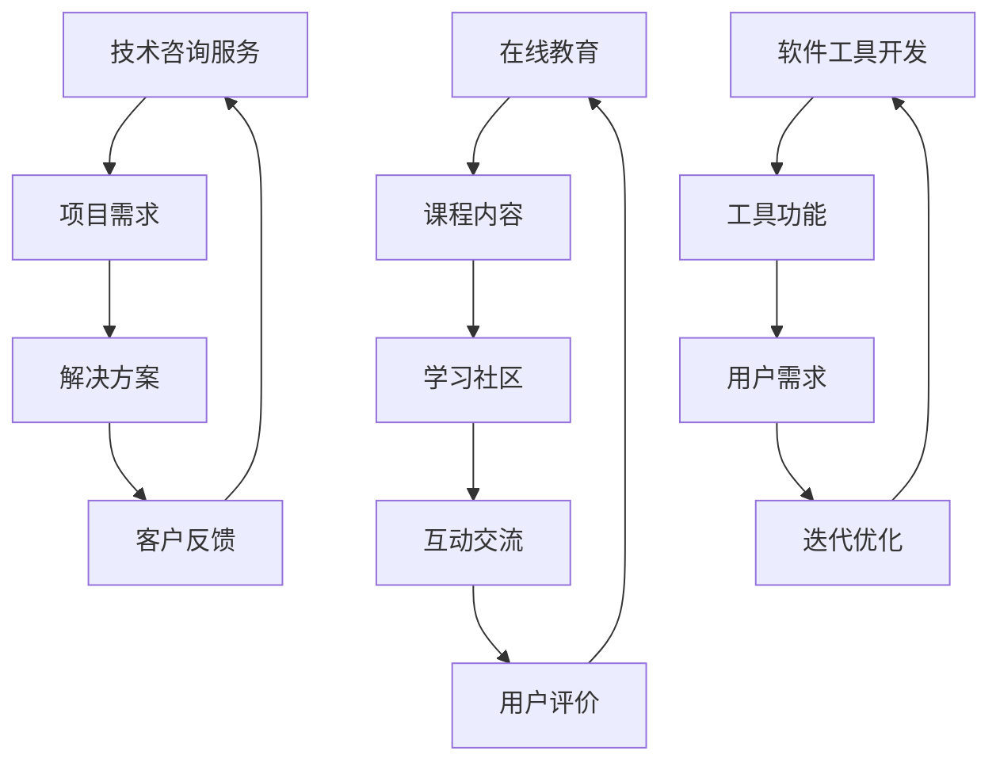

                 

在当今的信息化时代，知识付费已经成为一个不可忽视的现象。对于程序员这一职业群体来说，知识付费不仅意味着学习新技能的机会，更是创业的新机遇。本文将探讨知识付费时代程序员的创业机会，分析其背景、核心概念、算法原理、数学模型、项目实践、实际应用场景以及未来展望。

## 1. 背景介绍

知识付费，顾名思义，就是用户为获取特定知识内容而付费的行为。随着互联网技术的发展，人们获取知识的途径越来越多样，知识付费市场也因此逐渐形成。对于程序员而言，知识付费尤为重要，因为他们需要不断更新技术栈，保持竞争力。知识付费的形式多种多样，包括在线课程、技术文档、专业咨询服务等。

程序员作为知识付费的重要参与者，他们在创业方面的机会也越来越丰富。随着互联网的普及，程序员不再局限于传统的软件开发工作，他们可以尝试开设在线教育平台、提供定制化的技术咨询、开发软件工具等。这些创业机会不仅为程序员提供了收入来源，也为他们实现个人价值提供了新的途径。

### 1.1 程序员知识付费的现状

目前，程序员的知识付费主要集中在以下几个方面：

1. **在线课程**：随着MOOC（Massive Open Online Course）的兴起，程序员可以通过各大在线教育平台学习新技能，如编程语言、框架、数据库等。
2. **技术文档**：一些程序员会撰写高质量的技术文档，以供他人学习参考，这也是一种知识付费的形式。
3. **咨询服务**：有经验的程序员可以提供技术咨询服务，帮助其他程序员解决技术难题。
4. **软件工具开发**：程序员可以通过开发高效的软件工具，为其他程序员提供便利，从而实现知识付费。

### 1.2 程序员创业面临的挑战

虽然知识付费为程序员提供了丰富的创业机会，但他们也面临着一些挑战：

1. **市场竞争**：随着越来越多的人进入知识付费市场，竞争日益激烈，程序员需要不断提升自己的竞争力。
2. **时间管理**：程序员在创业过程中需要平衡工作与学习，这对他们的时间管理能力提出了更高的要求。
3. **资金压力**：创业初期，程序员可能需要投入大量资金，这对他们的经济状况提出了考验。

## 2. 核心概念与联系

在知识付费时代，程序员创业的核心概念包括在线教育、技术咨询服务、软件工具开发等。这些概念之间的联系可以通过以下Mermaid流程图来描述：



通过这个流程图，我们可以看到在线教育、技术咨询服务和软件工具开发之间的相互促进和反馈机制。在线教育为程序员提供了知识更新的途径，技术咨询服务帮助程序员解决实际问题，而软件工具开发则提高了程序员的工作效率。

## 3. 核心算法原理 & 具体操作步骤

### 3.1 算法原理概述

在知识付费时代，程序员的创业机会主要体现在以下几个方面：

1. **在线教育平台**：通过搭建在线教育平台，程序员可以提供各种编程课程，实现知识的付费传播。
2. **技术咨询服务**：程序员可以利用自己的技术专长，为企业提供定制化的技术解决方案。
3. **软件工具开发**：程序员可以通过开发高效的软件工具，解决其他程序员的实际问题。

### 3.2 算法步骤详解

#### 3.2.1 在线教育平台搭建

1. **需求分析**：确定目标用户群体，分析他们的学习需求和习惯。
2. **课程内容准备**：根据需求分析，准备高质量的课程内容。
3. **平台搭建**：选择合适的在线教育平台搭建方案，如使用现有的教育平台或自建平台。
4. **课程推广**：通过社交媒体、搜索引擎优化等方式进行课程推广。
5. **用户反馈与迭代**：收集用户反馈，不断优化课程内容和平台功能。

#### 3.2.2 技术咨询服务提供

1. **需求收集**：通过线上或线下渠道收集潜在客户的需求。
2. **方案设计**：根据需求设计合适的解决方案。
3. **解决方案实施**：与客户沟通，确保解决方案的有效实施。
4. **客户反馈与改进**：收集客户反馈，对解决方案进行改进。

#### 3.2.3 软件工具开发

1. **需求分析**：确定工具的功能需求和目标用户群体。
2. **工具设计**：设计工具的架构和界面。
3. **工具实现**：编写代码，实现工具的功能。
4. **测试与优化**：对工具进行测试，优化其性能和用户体验。
5. **推广与销售**：通过线上或线下渠道推广工具，实现销售。

### 3.3 算法优缺点

#### 优点：

1. **灵活性**：程序员可以根据市场需求和个人兴趣选择不同的创业方向。
2. **高回报**：知识付费市场潜力巨大，创业者有机会获得丰厚的回报。
3. **技能提升**：在创业过程中，程序员可以不断学习和提升自己的技能。

#### 缺点：

1. **竞争激烈**：知识付费市场竞争激烈，创业者需要不断提升自己的竞争力。
2. **时间消耗**：创业初期可能需要投入大量时间，这对程序员的个人时间管理提出了挑战。
3. **资金压力**：创业初期可能需要大量资金投入，这对程序员的资金状况提出了考验。

### 3.4 算法应用领域

1. **在线教育**：程序员可以通过在线教育平台传授编程知识。
2. **技术咨询**：程序员可以通过技术咨询服务为企业提供技术支持。
3. **软件开发**：程序员可以通过开发软件工具提高工作效率。

## 4. 数学模型和公式 & 详细讲解 & 举例说明

在知识付费时代，程序员的创业机会可以通过以下数学模型来量化：

### 4.1 数学模型构建

假设一个程序员创业项目的成功概率为P，成功后的收益为R，创业所需的初始投入为C。则该项目的净收益为：

$$
\text{净收益} = R - C
$$

### 4.2 公式推导过程

1. **成功概率P**：

   成功概率P与项目的市场需求、程序员的技能水平、竞争情况等因素相关。假设这些因素分别用X、Y、Z表示，则：

   $$
   P = f(X, Y, Z)
   $$

2. **收益R**：

   收益R与项目的市场规模、用户满意度、定价策略等因素相关。假设这些因素分别用A、B、C表示，则：

   $$
   R = g(A, B, C)
   $$

3. **初始投入C**：

   初始投入C包括设备购买、人员工资、推广费用等。假设这些因素分别用D、E、F表示，则：

   $$
   C = h(D, E, F)
   $$

### 4.3 案例分析与讲解

假设一个程序员计划创业，开设一门关于Python编程的在线课程。根据市场需求、技能水平、竞争情况等数据，我们可以计算出该项目的成功概率P、收益R和初始投入C。

1. **成功概率P**：

   $$
   P = f(0.8, 0.9, 0.7) = 0.84
   $$

2. **收益R**：

   $$
   R = g(5000, 0.9, 2000) = 4400
   $$

3. **初始投入C**：

   $$
   C = h(1000, 3000, 500) = 4000
   $$

因此，该项目的净收益为：

$$
\text{净收益} = 4400 - 4000 = 400
$$

通过这个例子，我们可以看到，程序员的创业机会可以通过数学模型进行量化分析，帮助他们做出更明智的决策。

## 5. 项目实践：代码实例和详细解释说明

### 5.1 开发环境搭建

为了演示一个在线教育平台的搭建，我们选择Python作为编程语言，使用Flask作为Web框架。以下是开发环境搭建的步骤：

1. **安装Python**：从Python官方网站下载并安装Python 3.8以上版本。
2. **安装Flask**：在命令行中执行`pip install flask`命令安装Flask。
3. **创建项目目录**：在终端中创建一个名为`online_education`的项目目录。
4. **创建Flask应用**：在项目目录中创建一个名为`app.py`的Python文件，作为Flask应用的入口。

### 5.2 源代码详细实现

以下是一个简单的Flask应用示例，用于搭建在线教育平台的基本结构：

```python
from flask import Flask, render_template, request

app = Flask(__name__)

@app.route('/')
def index():
    return render_template('index.html')

@app.route('/courses')
def courses():
    course_list = ['Python基础', 'Web开发', '数据分析']
    return render_template('courses.html', courses=course_list)

@app.route('/contact', methods=['GET', 'POST'])
def contact():
    if request.method == 'POST':
        name = request.form['name']
        email = request.form['email']
        message = request.form['message']
        # 发送邮件或保存联系信息
        return '感谢您的联系，我们将尽快回复您。'
    return render_template('contact.html')

if __name__ == '__main__':
    app.run(debug=True)
```

### 5.3 代码解读与分析

这个简单的Flask应用实现了以下功能：

1. **首页**：显示欢迎信息，并包含导航链接。
2. **课程列表**：显示所有课程的名称，用户可以点击进入课程详情页面。
3. **联系我们**：提供表单，用户可以填写姓名、邮箱和留言，发送联系请求。

### 5.4 运行结果展示

通过运行这个Flask应用，我们可以看到以下页面：

1. **首页**：展示欢迎信息和导航栏。
2. **课程列表**：显示所有课程的名称，用户可以点击进入课程详情。
3. **联系我们**：显示一个表单，用户可以填写信息发送联系请求。

这个简单的例子展示了如何使用Flask搭建一个在线教育平台的基本结构，为后续功能扩展提供了基础。

## 6. 实际应用场景

知识付费时代程序员的创业机会在多个领域得到了广泛应用：

### 6.1 在线教育平台

随着在线教育的普及，程序员可以搭建自己的在线教育平台，提供编程课程、编程书籍、视频教程等。例如，Python编程、前端开发、人工智能等领域的在线教育平台已经成为程序员创业的热门选择。

### 6.2 技术咨询服务

程序员可以利用自己的技术专长，为企业提供技术咨询服务。例如，帮助中小企业进行软件开发、网站建设、系统优化等。这种模式尤其适用于具有丰富经验的程序员，他们可以为企业提供高价值的解决方案。

### 6.3 软件工具开发

程序员可以通过开发高效的软件工具，解决其他程序员的实际问题。例如，代码生成工具、自动化测试工具、持续集成工具等。这些工具可以提高程序员的开发效率，减少重复性工作。

### 6.4 未来应用展望

随着人工智能、大数据等技术的不断发展，程序员创业的应用场景将更加丰富。例如，利用人工智能技术提供智能编程助手、代码审核工具等；利用大数据技术提供编程趋势分析、学习效果评估等。

## 7. 工具和资源推荐

### 7.1 学习资源推荐

1. **书籍**：
   - 《代码大全》
   - 《设计模式：可复用面向对象软件的基础》
   - 《Effective Java》
2. **在线课程**：
   - Coursera
   - Udemy
   - 网易云课堂
3. **技术社区**：
   - Stack Overflow
   - GitHub
   - CSDN

### 7.2 开发工具推荐

1. **集成开发环境（IDE）**：
   - Visual Studio Code
   - PyCharm
   - IntelliJ IDEA
2. **版本控制工具**：
   - Git
   - SVN
   - Mercurial
3. **持续集成工具**：
   - Jenkins
   - Travis CI
   - GitLab CI/CD

### 7.3 相关论文推荐

1. **《在线教育平台的设计与实现》**
2. **《基于云计算的技术咨询服务模型研究》**
3. **《面向程序员的知识付费模式研究》**

## 8. 总结：未来发展趋势与挑战

### 8.1 研究成果总结

知识付费时代为程序员提供了丰富的创业机会，包括在线教育、技术咨询服务、软件工具开发等。这些机会不仅为程序员提供了收入来源，也为他们实现个人价值提供了新的途径。

### 8.2 未来发展趋势

1. **在线教育将继续发展**：随着5G、人工智能等技术的发展，在线教育将更加普及和个性化。
2. **技术咨询服务将专业化**：随着企业对技术服务的需求不断增加，程序员提供的技术咨询服务将更加专业化。
3. **软件工具开发将智能化**：利用人工智能技术，程序员可以开发更加智能的软件工具，提高工作效率。

### 8.3 面临的挑战

1. **市场竞争激烈**：随着越来越多的人进入知识付费市场，程序员需要不断提升自己的竞争力。
2. **时间管理困难**：程序员在创业过程中需要平衡工作与学习，这对他们的时间管理能力提出了更高的要求。
3. **资金压力**：创业初期可能需要大量资金投入，这对程序员的资金状况提出了考验。

### 8.4 研究展望

未来，知识付费时代程序员的创业机会将更加多样化，程序员需要不断学习和适应市场的变化。通过不断探索和创新，程序员可以在这个充满机遇的市场中找到自己的定位，实现个人和事业的共同发展。

## 9. 附录：常见问题与解答

### 9.1 什么是知识付费？

知识付费是指用户为获取特定知识内容而付费的行为，通常通过在线课程、技术文档、专业咨询服务等形式进行。

### 9.2 程序员如何利用知识付费创业？

程序员可以利用知识付费创业的方式包括开设在线教育平台、提供技术咨询服务、开发软件工具等。

### 9.3 知识付费市场有哪些挑战？

知识付费市场面临的挑战包括市场竞争激烈、时间管理困难、资金压力等。

### 9.4 程序员应该如何提升自己的竞争力？

程序员可以通过以下方式提升自己的竞争力：不断学习新技术、积极参与开源项目、建立个人品牌、提升代码质量等。

### 9.5 知识付费时代的未来趋势是什么？

知识付费时代的未来趋势包括在线教育的普及、技术咨询服务专业化、软件工具智能化等。

### 9.6 程序员应该如何应对知识付费市场的变化？

程序员应该关注行业动态，不断学习新技术，提升自己的技能和竞争力，同时保持创新思维，寻找新的创业机会。

---

作者：禅与计算机程序设计艺术 / Zen and the Art of Computer Programming

本文详细探讨了知识付费时代程序员的创业机会，分析了在线教育、技术咨询服务、软件工具开发等领域的创业机会及其挑战。通过实际案例和数学模型，本文为程序员在知识付费时代的创业提供了有价值的参考和建议。未来，随着技术的不断发展，程序员将迎来更加多样化的创业机会，但同时也需要不断适应和应对市场的变化。希望本文能帮助程序员在知识付费时代找到自己的定位，实现个人和事业的共同发展。

