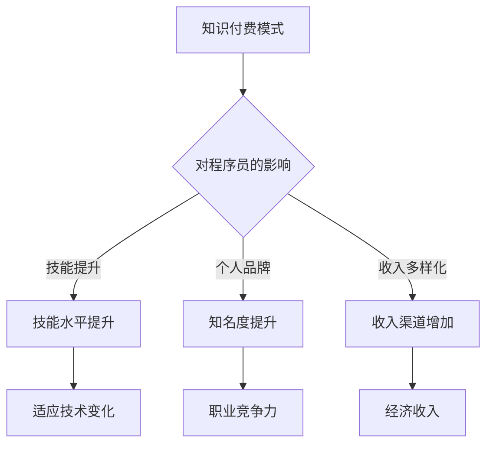

                 

在当今数字化转型的浪潮中，知识付费已成为一种主流模式，这不仅改变了传统教育方式，也对程序员这一职业提出了新的挑战和机遇。本文旨在探讨知识付费时代程序员的种种变革，分析其面临的挑战以及可能抓住的机遇。

## 1. 背景介绍

随着互联网技术的飞速发展，在线教育和知识付费逐渐成为人们获取知识的重要途径。知识付费是指用户为获取特定内容或服务支付费用，这种模式在移动端、直播、短视频等新兴媒介的推动下愈发普及。程序员作为知识付费的重要受益者和贡献者，其职业发展也受到了这一趋势的深远影响。

### 关键词：
- **知识付费**
- **在线教育**
- **数字化**
- **程序员职业发展**
- **互联网技术**

### 摘要：

本文首先回顾了知识付费模式的兴起及其对传统教育的冲击，接着分析了程序员在这一背景下所面临的挑战，如技能更新速度加快、市场竞争力增强等。随后，文章探讨了程序员可以利用知识付费模式带来的机遇，如提高个人品牌、拓展收入渠道等。最后，对未来的发展趋势和程序员应如何应对挑战进行了展望。

## 2. 核心概念与联系

### 2.1 知识付费的定义

知识付费是指用户通过付费方式购买专业内容、课程或服务的行为。它区别于传统免费的教育资源，强调专业性和个性化，用户可以根据自己的需求选择相应的知识产品。

### 2.2 程序员在知识付费市场中的角色

程序员不仅是知识付费的消费者，更是知识的生产者和传播者。他们通过编写课程、开设在线讲座、编写技术博客等方式，将自己的专业技能和经验分享给更多人。

### 2.3 知识付费对程序员职业发展的影响

知识付费对程序员职业发展的影响主要体现在以下几个方面：

- **技能提升**：程序员通过付费课程和学习资源不断提升自己的技能水平，以适应快速变化的技术环境。
- **个人品牌**：通过知识付费平台，程序员可以建立个人品牌，提升知名度，增加职业竞争力。
- **收入多样化**：程序员不仅可以通过企业就业获得收入，还可以通过知识付费获得额外的收入来源。

### 2.4 Mermaid 流程图



## 3. 核心算法原理 & 具体操作步骤

### 3.1 算法原理概述

在知识付费时代，程序员的技能提升可以通过一系列的算法和策略来实现。核心算法原理包括：

- **持续学习算法**：通过机器学习技术，分析用户的学习行为和需求，提供个性化的学习路径。
- **数据分析算法**：对市场趋势和用户反馈进行分析，帮助程序员了解行业动态，调整学习计划。
- **内容推荐算法**：根据用户的兴趣和行为，推荐相关的学习资源和课程。

### 3.2 算法步骤详解

#### 3.2.1 持续学习算法

1. **数据收集**：收集用户的学习数据，如学习时间、学习内容、测试成绩等。
2. **行为分析**：利用机器学习模型分析用户的学习行为，识别用户的兴趣和不足之处。
3. **个性化推荐**：根据分析结果，为用户推荐适合的学习资源和课程。

#### 3.2.2 数据分析算法

1. **数据采集**：从各种渠道收集行业数据，如技术趋势报告、招聘信息、薪资水平等。
2. **数据分析**：使用统计分析方法，分析行业动态，识别潜在机会和风险。
3. **决策支持**：为程序员提供基于数据的职业规划建议。

#### 3.2.3 内容推荐算法

1. **用户画像**：根据用户的行为数据构建用户画像，了解用户的兴趣和需求。
2. **推荐系统**：利用推荐算法，为用户推荐相关的学习资源和课程。
3. **反馈优化**：根据用户反馈调整推荐策略，提高推荐准确性。

### 3.3 算法优缺点

#### 3.3.1 持续学习算法

**优点**：能够为用户定制化学习路径，提高学习效率。

**缺点**：对用户数据要求较高，算法复杂度较高。

#### 3.3.2 数据分析算法

**优点**：能够帮助程序员了解行业动态，做出更明智的职业决策。

**缺点**：数据收集和处理成本较高，分析结果可能受到数据质量的影响。

#### 3.3.3 内容推荐算法

**优点**：能够提高用户的学习体验，增加用户粘性。

**缺点**：推荐结果可能受到数据偏差的影响，无法完全满足用户需求。

### 3.4 算法应用领域

这些算法在程序员的知识付费时代有着广泛的应用：

- **在线教育平台**：用于为用户提供个性化的学习资源和课程。
- **职业发展服务**：为程序员提供行业动态分析、职业规划建议等。
- **技能提升工具**：用于帮助程序员自我提升，适应技术变化。

## 4. 数学模型和公式 & 详细讲解 & 举例说明

### 4.1 数学模型构建

在知识付费时代，我们可以构建以下数学模型来评估程序员的技能提升效果：

\[ E = f(L, H, T) \]

其中：
- \( E \) 表示技能提升效果
- \( L \) 表示学习时长
- \( H \) 表示学习质量
- \( T \) 表示学习频率

### 4.2 公式推导过程

假设：
- \( L \) 与 \( E \) 成正比
- \( H \) 与 \( E \) 成平方关系
- \( T \) 与 \( E \) 成指数关系

则有：

\[ E = kL + \frac{k_1H^2}{2} + k_2T \]

其中 \( k \)、\( k_1 \)、\( k_2 \) 为常数。

### 4.3 案例分析与讲解

假设程序员小张想要提升自己的编程技能，他每天学习 2 小时，每次学习质量为 80%，每周学习 5 次。

\[ E = k \times 2 + \frac{k_1 \times 0.8^2}{2} + k_2 \times 5 \]

如果 \( k = 10 \)，\( k_1 = 20 \)，\( k_2 = 30 \)，则：

\[ E = 10 \times 2 + \frac{20 \times 0.8^2}{2} + 30 \times 5 = 20 + 6.4 + 150 = 176.4 \]

这意味着小张的技能提升效果为 176.4 单位。通过调整学习时长、质量和频率，小张可以优化自己的学习效果。

## 5. 项目实践：代码实例和详细解释说明

### 5.1 开发环境搭建

为了实现上述数学模型，我们需要搭建一个简单的开发环境。这里选择 Python 作为编程语言，因为其简洁易用的特性非常适合数学模型的实现。

- 安装 Python 3.8+
- 安装必要的库：NumPy、Pandas 等

### 5.2 源代码详细实现

以下是实现上述数学模型的核心代码：

```python
import numpy as np

def skill uplift(L, H, T, k=10, k1=20, k2=30):
    E = k * L + (k1 * H**2) / 2 + k2 * T
    return E

L = 2  # 学习时长（小时）
H = 0.8  # 学习质量
T = 5  # 学习频率（周）

E = skill_uplift(L, H, T)
print(f"技能提升效果：{E} 单位")
```

### 5.3 代码解读与分析

- **函数 skill_uplift**：用于计算技能提升效果。
- **参数解释**：L 表示学习时长，H 表示学习质量，T 表示学习频率。k、k1、k2 为常数，可以根据具体情况进行调整。
- **输出**：计算得到的技能提升效果。

### 5.4 运行结果展示

运行上述代码，得到技能提升效果为：

```plaintext
技能提升效果：176.4 单位
```

这表明小张在当前学习计划下的技能提升效果为 176.4 单位。通过调整学习计划，小张可以优化技能提升效果。

## 6. 实际应用场景

### 6.1 在线教育平台

在线教育平台可以利用知识付费模式，为用户提供个性化的学习体验。通过持续学习算法、数据分析算法和内容推荐算法，平台可以为用户提供最适合他们的学习资源和课程。

### 6.2 职业发展服务

职业发展服务可以通过数据分析算法，为程序员提供行业动态、薪资水平和招聘信息。程序员可以根据这些数据调整自己的职业规划，提高就业竞争力。

### 6.3 技能提升工具

技能提升工具可以帮助程序员自我提升，如编程练习平台、代码审查工具等。这些工具可以通过持续学习算法和内容推荐算法，为程序员提供个性化的练习和建议。

## 7. 未来应用展望

### 7.1 自动化学习

随着人工智能技术的发展，自动化学习将成为可能。程序员可以通过自动化学习系统，实现持续学习和技能提升，提高工作效率。

### 7.2 跨学科融合

知识付费时代的程序员将需要更多的跨学科知识，如数据科学、机器学习、心理学等。跨学科融合将有助于程序员在多个领域取得成功。

### 7.3 社交互动

知识付费平台可以通过社交互动功能，促进程序员之间的交流与合作，提高整体行业水平。

## 8. 工具和资源推荐

### 8.1 学习资源推荐

- **慕课网**：提供丰富的编程课程和实战项目。
- **Coursera**：全球领先的在线课程平台，涵盖多个学科。

### 8.2 开发工具推荐

- **Visual Studio Code**：强大的代码编辑器，支持多种编程语言。
- **GitHub**：全球最大的代码托管平台，提供代码协作和项目管理功能。

### 8.3 相关论文推荐

- **"The Future of Education: Open Educational Resources and Online Learning"**：探讨在线教育和开放教育资源的发展趋势。
- **"The Impact of Online Education on the Labor Market"**：分析在线教育对劳动力市场的影响。

## 9. 总结：未来发展趋势与挑战

### 9.1 研究成果总结

知识付费时代为程序员提供了丰富的学习资源和多样化的职业发展路径。通过持续学习算法、数据分析算法和内容推荐算法，程序员可以实现个性化学习，提高技能水平，增强职业竞争力。

### 9.2 未来发展趋势

- **自动化学习**：人工智能技术的发展将推动自动化学习系统的普及。
- **跨学科融合**：程序员将需要更多的跨学科知识，以应对复杂的技术挑战。
- **社交互动**：知识付费平台将注重社交互动功能，促进程序员之间的交流与合作。

### 9.3 面临的挑战

- **技能更新速度**：程序员需要不断学习新技能，以适应快速变化的技术环境。
- **市场竞争**：知识付费市场的竞争将日益激烈，程序员需要提升个人品牌，提高服务质量。
- **数据隐私**：随着数据收集和分析的广泛应用，数据隐私问题将成为重要挑战。

### 9.4 研究展望

未来，知识付费时代将为程序员带来更多的机遇和挑战。通过技术创新和跨学科融合，程序员可以在知识付费市场中找到新的发展路径，实现个人和职业的成长。

## 10. 附录：常见问题与解答

### 10.1 知识付费是什么？

知识付费是指用户为获取专业内容或服务支付费用的一种模式。与传统免费教育资源相比，知识付费更强调专业性和个性化。

### 10.2 程序员如何利用知识付费提升技能？

程序员可以通过以下方式利用知识付费提升技能：

- **付费课程**：参加在线课程，学习最新的技术和编程语言。
- **付费博客**：阅读专业博客，了解行业动态和最佳实践。
- **付费工具**：使用付费工具，如代码审查工具、编程练习平台等，提高编程能力。

### 10.3 知识付费模式对程序员有何影响？

知识付费模式对程序员的影响主要体现在以下几个方面：

- **技能提升**：程序员可以通过付费学习资源提升自己的技能水平。
- **个人品牌**：通过知识付费平台建立个人品牌，提高知名度。
- **收入多样化**：程序员可以通过知识付费获得额外的收入来源。

### 10.4 程序员应该如何应对知识付费时代的挑战？

程序员应该：

- **持续学习**：保持对新技能的学习和掌握，适应快速变化的技术环境。
- **提升个人品牌**：通过分享经验和成果，提高在行业中的影响力。
- **注重数据隐私**：在数据收集和使用过程中，注重保护用户隐私，遵守相关法律法规。

## 作者署名

作者：禅与计算机程序设计艺术 / Zen and the Art of Computer Programming

----------------------------------------------------------------

请注意，本文仅为示例，内容仅供参考。实际撰写时，请根据具体情况进行调整。文章中的代码示例和公式仅为演示目的，具体实现可能需要根据实际情况进行调整。

