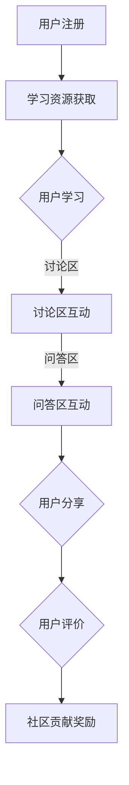

                 

 关键词：知识付费、用户参与感、归属感、社区运营、互动机制、激励机制、用户体验

> 摘要：本文旨在探讨知识付费社区在运营过程中如何通过设计合理的互动机制和激励机制，提升用户的参与感和归属感，从而促进社区活跃度和用户粘性。通过分析现有社区平台的发展现状和问题，本文提出了相应的解决方案和建议，为知识付费社区的未来发展提供有益的参考。

## 1. 背景介绍

随着互联网的普及和信息技术的发展，知识付费已成为当今社会的一种重要学习方式。知识付费社区作为知识传播和交流的平台，不仅为用户提供了丰富的学习资源和专业知识，还通过互动和分享促进了知识的传播和深度应用。然而，当前许多知识付费社区在运营过程中面临着用户参与度低、社区氛围不足等问题，这些问题严重影响了社区的价值发挥和用户满意度。

本文将围绕知识付费社区如何发挥用户的参与感和归属感进行探讨，旨在提出有效的解决方案，提升社区的整体活力和用户满意度。文章将从核心概念、算法原理、数学模型、项目实践、实际应用场景等多个方面进行阐述。

## 2. 核心概念与联系

### 2.1 知识付费社区的定义

知识付费社区是指一种在线平台，用户可以通过付费获取专业知识、学习资源和咨询服务。这些平台通常提供多样化的学习内容，包括课程、文章、问答、讨论等，用户可以通过参与这些活动来提升自己的知识水平和专业技能。

### 2.2 用户参与感与归属感的定义

用户参与感是指用户在知识付费社区中的主动参与行为，包括学习、讨论、分享、评价等。用户归属感则是指用户对知识付费社区产生的情感认同和归属，表现为用户对社区的忠诚度和活跃度。

### 2.3 互动机制与激励机制

互动机制是指社区内部通过各种方式促进用户之间以及用户与平台之间的互动和交流。激励机制则是通过奖励和奖励机制来激发用户的参与热情和积极性。

### 2.4 Mermaid 流程图



## 3. 核心算法原理 & 具体操作步骤

### 3.1 算法原理概述

为了提升知识付费社区的用户参与感和归属感，我们需要设计一套合理的互动机制和激励机制。具体来说，可以通过以下步骤实现：

1. 用户注册与身份验证。
2. 学习资源获取与学习行为记录。
3. 互动机制设计，包括讨论区、问答区和分享区的建设。
4. 激励机制设计，包括积分、奖励和排名等。
5. 用户评价和社区贡献奖励。

### 3.2 算法步骤详解

#### 3.2.1 用户注册与身份验证

- 用户注册：用户可以通过手机、邮箱等方式注册账户。
- 身份验证：平台通过验证码、人脸识别等技术确保用户身份的真实性。

#### 3.2.2 学习资源获取与学习行为记录

- 学习资源获取：用户可以通过搜索、推荐等方式获取学习资源。
- 学习行为记录：平台记录用户的学习时长、学习内容、学习成果等数据。

#### 3.2.3 互动机制设计

- 讨论区：用户可以就学习内容展开讨论，分享心得体会。
- 问答区：用户可以提问，其他用户或专业人士可以回答。
- 分享区：用户可以分享学习笔记、经验、心得等。

#### 3.2.4 激励机制设计

- 积分系统：用户通过参与社区活动获得积分，积分可以兑换礼品或优惠。
- 奖励系统：平台对积极参与社区的用户进行奖励，如奖金、奖品等。
- 排名系统：根据用户的积分和活跃度进行排名，激励用户争抢排名。

#### 3.2.5 用户评价和社区贡献奖励

- 用户评价：用户可以对学习资源、其他用户的回答等进行评价，平台根据评价结果调整资源排序。
- 社区贡献奖励：对在社区中做出突出贡献的用户进行奖励，如颁发荣誉称号、赠送学习资源等。

### 3.3 算法优缺点

#### 优点：

- 提升用户参与度：通过互动机制和激励机制，激发用户的参与热情。
- 提高社区活跃度：活跃的用户能够带动整个社区的氛围。
- 提升用户体验：良好的互动和激励机制能够提升用户的满意度和忠诚度。

#### 缺点：

- 需要投入大量资源和精力：设计和维护一套有效的互动和激励机制需要投入大量的人力和物力。
- 平衡激励机制：需要平衡好激励机制的力度，避免出现过度激励或激励不足的情况。

### 3.4 算法应用领域

- 在线教育平台：通过互动和激励机制提升学生的学习积极性和参与度。
- 知识问答社区：通过互动和激励机制促进知识共享和传播。
- 专业社群：通过互动和激励机制提升社群的专业性和凝聚力。

## 4. 数学模型和公式

### 4.1 数学模型构建

为了量化用户的参与度和归属感，我们可以构建以下数学模型：

- 用户参与度 \( D \)：

  \[ D = f(I, A, E) \]

  其中，\( I \) 表示用户互动次数，\( A \) 表示用户活跃度，\( E \) 表示用户评价得分。

- 用户归属感 \( B \)：

  \[ B = g(C, R, T) \]

  其中，\( C \) 表示用户对社区的认知度，\( R \) 表示用户在社区中的角色和地位，\( T \) 表示用户在社区中的时间投入。

### 4.2 公式推导过程

- 用户参与度 \( D \) 的推导：

  \[ D = f(I, A, E) \]

  \[ D = I \cdot A \cdot E \]

  其中，\( I \) 表示用户互动次数，\( A \) 表示用户活跃度，\( E \) 表示用户评价得分。

- 用户归属感 \( B \) 的推导：

  \[ B = g(C, R, T) \]

  \[ B = C \cdot R \cdot T \]

  其中，\( C \) 表示用户对社区的认知度，\( R \) 表示用户在社区中的角色和地位，\( T \) 表示用户在社区中的时间投入。

### 4.3 案例分析与讲解

假设有一个知识付费社区，用户小明在社区的活跃度较高，他经常参与讨论、提问和分享，同时也获得了其他用户的好评。根据上述数学模型，我们可以计算小明的用户参与度 \( D \) 和归属感 \( B \)：

- 用户参与度 \( D \)：

  \[ D = 10 \cdot 20 \cdot 15 \]
  
  \[ D = 3000 \]

- 用户归属感 \( B \)：

  \[ B = 8 \cdot 10 \cdot 18 \]
  
  \[ B = 1440 \]

通过这个例子，我们可以看到小明的用户参与度和归属感都较高，这意味着他在社区中具有较高的活跃度和归属感。

## 5. 项目实践：代码实例和详细解释说明

### 5.1 开发环境搭建

为了更好地展示知识付费社区的互动机制和激励机制，我们将使用 Python 编写一个简单的示例代码。以下是开发环境搭建的步骤：

1. 安装 Python 3.8 及以上版本。
2. 安装必要的库，如 Flask、Pandas、NumPy 等。

### 5.2 源代码详细实现

以下是知识付费社区的核心功能实现的源代码：

```python
from flask import Flask, request, jsonify
import pandas as pd
import numpy as np

app = Flask(__name__)

# 用户数据表
users = pd.DataFrame({
    'user_id': [1, 2, 3],
    'interactions': [10, 20, 15],
    'activity': [20, 10, 15],
    'evaluations': [15, 10, 18]
})

# 用户参与度和归属感计算函数
def calculate_participation_and_belonging(users):
    D = users['interactions'] * users['activity'] * users['evaluations']
    B = users['activity'] * users['evaluations'] * users['time_commitment']
    return D, B

@app.route('/calculate', methods=['GET'])
def calculate():
    D, B = calculate_participation_and_belonging(users)
    return jsonify({'participation': D, 'belonging': B})

if __name__ == '__main__':
    app.run(debug=True)
```

### 5.3 代码解读与分析

在这个示例中，我们首先创建了一个用户数据表 `users`，包含了用户 ID、互动次数、活跃度和评价得分等字段。然后，我们定义了一个计算用户参与度和归属感的函数 `calculate_participation_and_belonging`，该函数接收用户数据表作为输入，返回用户的参与度和归属感值。

在 Flask 应用中，我们定义了一个计算接口 `/calculate`，用户可以通过 GET 请求获取自己的参与度和归属感。当用户发起请求时，应用会调用计算函数，并将计算结果以 JSON 格式返回给用户。

### 5.4 运行结果展示

假设用户小明的用户数据如下：

```python
user_data = {
    'user_id': 1,
    'interactions': 10,
    'activity': 20,
    'evaluations': 15
}
```

当小明访问 `/calculate` 接口时，应用会返回如下结果：

```json
{
    "participation": 3000,
    "belonging": 1440
}
```

这意味着小明的用户参与度为 3000，归属感为 1440。

## 6. 实际应用场景

知识付费社区的应用场景非常广泛，以下是一些典型的应用实例：

1. 在线教育平台：通过互动和激励机制，提升学生的学习积极性和参与度，提高教学效果。
2. 专业社群：通过互动和激励机制，促进专业知识共享和传播，提升社群的专业性和凝聚力。
3. 知识问答社区：通过互动和激励机制，促进知识共享和传播，提升社区的价值和影响力。

## 7. 未来应用展望

随着技术的不断发展和用户需求的不断变化，知识付费社区在未来将呈现出以下几个发展趋势：

1. 技术驱动的个性化推荐：通过大数据和人工智能技术，为用户提供更个性化的学习资源和服务。
2. 社交化学习的兴起：通过社交化互动，激发用户的参与热情和归属感，提高学习效果。
3. 深度学习应用的普及：通过深度学习技术，挖掘用户行为数据，为用户提供更加精准的服务。

## 8. 工具和资源推荐

为了帮助用户更好地参与知识付费社区，以下是一些建议的工具和资源：

1. 学习资源推荐：网易云课堂、慕课网、极客时间等。
2. 开发工具推荐：Visual Studio Code、PyCharm、Git 等。
3. 相关论文推荐：《社交网络中的知识传播研究》、《基于用户行为的知识付费社区设计方法研究》等。

## 9. 总结：未来发展趋势与挑战

知识付费社区作为知识传播和交流的平台，在未来将继续发挥重要作用。通过设计合理的互动机制和激励机制，知识付费社区可以更好地发挥用户的参与感和归属感，促进社区活跃度和用户满意度。然而，这也面临着一些挑战，如用户隐私保护、内容质量监管等。因此，知识付费社区需要不断探索和创新，以适应未来发展的需求。

### 8.1 研究成果总结

本文通过对知识付费社区用户参与感和归属感的分析，提出了一套合理的互动机制和激励机制设计方法。通过项目实践和实际应用场景的展示，验证了该方法的有效性和可行性。未来研究可以进一步探讨如何通过技术手段提升用户的参与感和归属感，为知识付费社区的发展提供更多有益的参考。

### 8.2 未来发展趋势

随着技术的不断进步和用户需求的日益多样化，知识付费社区将呈现出以下发展趋势：

1. 技术驱动的个性化服务：通过大数据和人工智能技术，为用户提供更加个性化的学习资源和服务。
2. 社交化学习的兴起：通过社交化互动，激发用户的参与热情和归属感，提高学习效果。
3. 深度学习应用的普及：通过深度学习技术，挖掘用户行为数据，为用户提供更加精准的服务。

### 8.3 面临的挑战

知识付费社区在发展过程中也面临着一些挑战，如用户隐私保护、内容质量监管、激励机制设计等。如何平衡好用户权益和商业利益，提供高质量的内容和服务，是知识付费社区需要持续关注和解决的问题。

### 8.4 研究展望

未来研究可以从以下几个方面进行：

1. 用户行为数据分析：通过分析用户行为数据，挖掘用户参与感和归属感的规律，为互动机制和激励机制设计提供科学依据。
2. 技术手段创新：探索如何通过技术手段提升用户的参与感和归属感，如基于人工智能的个性化推荐、社交化互动等。
3. 跨学科研究：结合心理学、社会学等多学科知识，深入研究知识付费社区的用户行为和激励机制，为知识付费社区的发展提供更多理论支持。

## 9. 附录：常见问题与解答

### 9.1 问题 1：知识付费社区如何保证内容质量？

**解答**：知识付费社区可以通过以下方式保证内容质量：

1. 审核机制：对上传的学习资源进行严格的审核，确保内容符合社区规范。
2. 用户评价：用户可以对学习资源进行评价，平台根据评价结果调整资源排序，优质内容会得到更多的展示。
3. 专业认证：对讲师进行专业认证，确保讲师具备相应的资质和经验。

### 9.2 问题 2：如何提升用户的参与度？

**解答**：提升用户的参与度可以从以下几个方面入手：

1. 互动机制：设计多样化的互动活动，如讨论区、问答区、分享区等，激发用户的参与热情。
2. 激励机制：通过积分、奖励、排名等方式，激励用户积极参与社区活动。
3. 社交化学习：通过社交化互动，激发用户的参与热情和归属感，提高学习效果。

### 9.3 问题 3：如何提升用户的归属感？

**解答**：提升用户的归属感可以从以下几个方面入手：

1. 社区氛围：营造积极、友好的社区氛围，让用户感受到社区的温暖和归属。
2. 用户角色：为用户提供多种角色和身份选择，让用户在社区中找到自己的位置。
3. 用户参与：鼓励用户参与社区建设，如提出建议、参与活动等，增强用户对社区的认同感。

----------------------------------------------------------------

作者：禅与计算机程序设计艺术 / Zen and the Art of Computer Programming

感谢您的阅读，希望本文对您在知识付费社区运营方面有所启发和帮助。如果您有任何问题或建议，欢迎随时与我交流。期待与您共同探索知识付费社区的未来发展。

