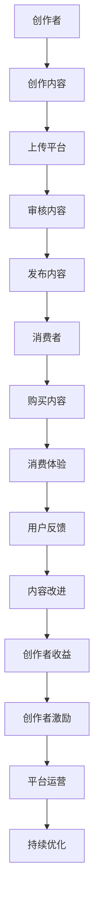

                 

关键词：知识付费、互信机制、创作者、消费者、信任、平台建设、数据安全、隐私保护、算法公平性、透明度、用户体验

> 摘要：本文深入探讨了知识付费领域中建立创作者与消费者互信机制的必要性和重要性，分析了现有平台存在的问题和挑战，并提出了一系列解决方案和未来发展方向。通过本文的阐述，旨在为知识付费平台提供有益的参考和指导。

## 1. 背景介绍

在当今数字化时代，知识付费已经成为了互联网产业中的一个重要分支。从在线教育、专业课程到付费问答、内容订阅，知识付费为创作者和消费者提供了一个双向互动的生态系统。然而，随着市场的快速发展和用户需求的日益多样，知识付费领域也面临着诸多挑战。

首先，创作者面临的问题包括版权保护、内容原创性、收益分配等。创作者希望通过平台获得公平的收益，但同时也需要保护自己的作品不被盗用或篡改。其次，消费者则关注内容的质量、实用性、价格合理性以及购买过程中的便捷性。此外，平台本身也面临着维护用户隐私、数据安全、算法公平性等问题。

建立创作者与消费者的互信机制，不仅是解决上述问题的关键，更是知识付费行业健康发展的基础。本文将围绕这一主题展开深入探讨，以期为知识付费领域的发展提供一些有价值的思考。

## 2. 核心概念与联系

### 2.1 互信机制

互信机制是指通过一系列技术和管理手段，确保创作者和消费者在知识付费过程中能够建立信任，从而实现双赢的局面。互信机制的核心包括以下几个要素：

- **数据透明度**：平台应确保创作者和消费者的数据透明，让用户清晰地了解内容创作和消费过程中的各个环节。
- **隐私保护**：平台需要采取措施保护用户的隐私，防止数据泄露。
- **收益公平**：平台应确保创作者能够获得合理的收益，同时消费者能够得到高质量的内容。
- **算法公平性**：平台使用的推荐算法应公平，避免算法偏见，影响用户的消费体验。
- **用户反馈**：平台应建立有效的用户反馈机制，及时处理用户的投诉和问题。

### 2.2 创作者与消费者的关系

在知识付费生态系统中，创作者和消费者之间的关系是至关重要的。创作者是知识内容的提供者，消费者则是知识的接受者。双方之间的信任关系直接影响整个生态系统的运行效率。

- **创作者**：他们希望通过平台获得合理的收益，同时保护自己的版权和原创性。他们需要平台提供稳定的创作环境和公平的收益分配机制。
- **消费者**：他们希望购买到高质量、实用的内容，同时享受便捷的消费体验。他们需要平台保证内容的安全性和可靠性。

### 2.3 Mermaid 流程图



## 3. 核心算法原理 & 具体操作步骤

### 3.1 算法原理概述

建立互信机制的核心算法主要包括以下几个方面：

- **推荐算法**：通过分析用户的消费行为和偏好，为消费者推荐符合其需求的内容。
- **收益分配算法**：根据创作者的贡献和内容的质量，为创作者分配合理的收益。
- **审核算法**：对上传的内容进行审核，确保内容的合法性和质量。
- **隐私保护算法**：对用户数据进行分析和处理，确保用户隐私不被泄露。

### 3.2 算法步骤详解

1. **推荐算法**：

   - **数据收集**：收集用户的消费记录、浏览历史、搜索关键词等数据。
   - **用户画像**：通过数据分析和机器学习技术，构建用户的个性化画像。
   - **内容分类**：根据用户画像，为用户推荐符合其兴趣的内容。
   - **效果评估**：通过用户点击率、购买率等指标，评估推荐效果，并进行调整。

2. **收益分配算法**：

   - **内容评级**：根据内容的受欢迎程度、质量等指标，对内容进行评级。
   - **收益计算**：根据内容评级和用户消费行为，计算创作者的收益。
   - **收益分配**：将计算出的收益按照一定的比例分配给创作者。

3. **审核算法**：

   - **内容检测**：使用自然语言处理、图像识别等技术，对上传的内容进行检测，确保内容合法。
   - **人工审核**：对于复杂的内容，由专业人员进行人工审核。
   - **结果反馈**：将审核结果反馈给创作者和消费者，并对违规内容进行处理。

4. **隐私保护算法**：

   - **数据加密**：对用户数据进行加密，确保数据在传输和存储过程中安全。
   - **匿名化处理**：对用户数据进行匿名化处理，防止用户隐私泄露。
   - **隐私策略**：制定明确的隐私保护策略，确保用户隐私得到保护。

### 3.3 算法优缺点

- **推荐算法**：优点在于能够为用户推荐高质量的内容，提高用户体验。缺点是可能存在推荐过度个性化的问题，导致用户视野狭窄。
- **收益分配算法**：优点在于能够确保创作者获得合理的收益，提高创作积极性。缺点是可能存在分配不公的问题，导致创作者之间的矛盾。
- **审核算法**：优点在于能够确保内容的合法性和质量，保障平台生态的健康发展。缺点是可能存在审核滞后的问题，影响用户体验。
- **隐私保护算法**：优点在于能够确保用户隐私不被泄露，提高用户信任度。缺点是可能增加平台的运营成本。

### 3.4 算法应用领域

- **在线教育**：通过推荐算法，为用户提供符合其学习需求的教育资源；通过收益分配算法，激励教育内容创作者持续产出高质量内容。
- **专业咨询**：通过推荐算法，为用户提供专业的咨询服务；通过收益分配算法，确保咨询师能够获得合理的收益。
- **内容订阅**：通过推荐算法，为用户提供个性化的订阅内容；通过收益分配算法，确保内容创作者能够持续产出高质量内容。

## 4. 数学模型和公式 & 详细讲解 & 举例说明

### 4.1 数学模型构建

在知识付费领域，建立互信机制需要考虑多个因素，包括用户行为、内容质量、收益分配等。以下是一个简化的数学模型：

\[ \text{互信指数} = f(\text{用户满意度}, \text{内容质量}, \text{收益公平性}, \text{隐私保护}) \]

### 4.2 公式推导过程

1. **用户满意度**：

   用户满意度取决于用户对内容的评价和购买体验。假设用户满意度与内容评分和购买体验成正比，可以表示为：

   \[ \text{用户满意度} = w_1 \times \text{内容评分} + w_2 \times \text{购买体验} \]

   其中，\( w_1 \) 和 \( w_2 \) 为权重系数。

2. **内容质量**：

   内容质量由多个指标共同决定，包括内容的原创性、准确性、实用性等。可以表示为：

   \[ \text{内容质量} = w_3 \times \text{原创性评分} + w_4 \times \text{准确性评分} + w_5 \times \text{实用性评分} \]

   其中，\( w_3 \)、\( w_4 \) 和 \( w_5 \) 为权重系数。

3. **收益公平性**：

   收益公平性取决于创作者的收益和消费者的支付意愿。可以表示为：

   \[ \text{收益公平性} = w_6 \times \text{创作者收益} + w_7 \times \text{消费者支付意愿} \]

   其中，\( w_6 \) 和 \( w_7 \) 为权重系数。

4. **隐私保护**：

   隐私保护程度由数据加密、匿名化处理等因素决定。可以表示为：

   \[ \text{隐私保护} = w_8 \times \text{数据加密程度} + w_9 \times \text{匿名化处理程度} \]

   其中，\( w_8 \) 和 \( w_9 \) 为权重系数。

### 4.3 案例分析与讲解

假设有一个知识付费平台，用户满意度、内容质量、收益公平性和隐私保护的具体指标如下：

- **用户满意度**：\( 80\% \)
- **内容质量**：\( 90\% \)
- **收益公平性**：\( 75\% \)
- **隐私保护**：\( 85\% \)

根据上述模型，可以计算出互信指数：

\[ \text{互信指数} = f(0.8, 0.9, 0.75, 0.85) \]

通过调整权重系数，可以优化互信指数，提高平台的互信水平。

## 5. 项目实践：代码实例和详细解释说明

### 5.1 开发环境搭建

在知识付费平台中，我们需要搭建一个后端服务，用于处理用户行为数据、内容质量评估、收益分配和隐私保护。以下是开发环境的基本配置：

- **开发语言**：Python
- **后端框架**：Flask
- **数据库**：MySQL
- **加密工具**：PyCryptoDome
- **自然语言处理库**：NLTK

### 5.2 源代码详细实现

以下是一个简化的代码实例，用于处理用户行为数据，并对内容进行质量评估和推荐：

```python
from flask import Flask, request, jsonify
from cryptodome.PublicKey import RSA
from nltk.tokenize import word_tokenize
import numpy as np
import pymysql

app = Flask(__name__)

# RSA 加密函数
def encrypt(message, public_key):
    encryptor = RSA.import_key(public_key)
    encrypted = encryptor.encrypt(message.encode())
    return encrypted

# 数据库连接函数
def connect_db():
    connection = pymysql.connect(host='localhost', user='root', password='password', database='knowledge')
    return connection

# 用户行为数据存储函数
def store_user_action(user_id, action, content_id):
    connection = connect_db()
    cursor = connection.cursor()
    cursor.execute("INSERT INTO user_actions (user_id, action, content_id) VALUES (%s, %s, %s)", (user_id, action, content_id))
    connection.commit()
    cursor.close()
    connection.close()

# 内容质量评估函数
def evaluate_content(content_id):
    connection = connect_db()
    cursor = connection.cursor()
    cursor.execute("SELECT * FROM content WHERE id = %s", (content_id,))
    content = cursor.fetchone()
    originality_score = content['originality']
    accuracy_score = content['accuracy']
    usefulness_score = content['usefulness']
    quality_score = 0.5 * (originality_score + accuracy_score + usefulness_score)
    cursor.close()
    connection.close()
    return quality_score

# 推荐内容函数
def recommend_content(user_id):
    connection = connect_db()
    cursor = connection.cursor()
    cursor.execute("SELECT content_id, COUNT(*) as action_count FROM user_actions WHERE user_id = %s GROUP BY content_id", (user_id,))
    user_actions = cursor.fetchall()
    action_counts = [action['action_count'] for action in user_actions]
    content_ids = [action['content_id'] for action in user_actions]
    quality_scores = [evaluate_content(content_id) for content_id in content_ids]
    combined_scores = [action_count * quality_score for action_count, quality_score in zip(action_counts, quality_scores)]
    recommended_content_ids = [content_id for content_id, combined_score in sorted(zip(content_ids, combined_scores), key=lambda x: x[1], reverse=True)[:5]]
    cursor.close()
    connection.close()
    return recommended_content_ids

@app.route('/user_action', methods=['POST'])
def handle_user_action():
    user_id = request.json['user_id']
    action = request.json['action']
    content_id = request.json['content_id']
    store_user_action(user_id, action, content_id)
    return jsonify({"status": "success"})

@app.route('/recommend_content', methods=['GET'])
def handle_recommend_content():
    user_id = request.args.get('user_id')
    recommended_content_ids = recommend_content(user_id)
    return jsonify({"content_ids": recommended_content_ids})

if __name__ == '__main__':
    app.run(debug=True)
```

### 5.3 代码解读与分析

- **加密函数**：使用 RSA 加密算法对用户数据进行加密，确保数据在传输过程中安全。
- **数据库连接函数**：连接 MySQL 数据库，用于存储用户行为数据和内容数据。
- **用户行为数据存储函数**：将用户的操作记录存储到数据库中。
- **内容质量评估函数**：根据内容数据库中的信息，计算内容的综合质量得分。
- **推荐内容函数**：根据用户的行为数据和内容质量得分，为用户推荐符合其兴趣的内容。

### 5.4 运行结果展示

1. **用户行为数据存储**：

   用户可以通过 POST 请求向 `/user_action` 接口发送用户 ID、操作类型（如浏览、购买等）和内容 ID，系统会将这些数据存储到数据库中。

2. **内容推荐**：

   用户可以通过 GET 请求向 `/recommend_content` 接口发送用户 ID，系统会根据用户的行为数据和内容质量得分，返回推荐的内容 ID 列表。

## 6. 实际应用场景

知识付费领域涵盖了众多应用场景，如在线教育、专业咨询、内容订阅等。以下是一些具体的实际应用场景：

- **在线教育**：通过知识付费平台，学生可以购买老师的课程，老师可以通过平台获得收益。平台需要建立互信机制，确保学生获得高质量的教育资源，同时老师能够获得公平的收益。
- **专业咨询**：专业人士可以通过知识付费平台为用户提供咨询服务，平台需要建立互信机制，确保用户能够获得专业的、高质量的咨询服务，同时专业人士能够获得合理的收益。
- **内容订阅**：用户可以通过知识付费平台订阅各种类型的内容，如电子书、杂志、文章等。平台需要建立互信机制，确保用户能够持续获得高质量的内容，同时内容创作者能够获得稳定的收益。

### 6.4 未来应用展望

随着人工智能技术的发展，知识付费领域将出现更多的创新和应用。例如，基于人工智能的内容推荐算法将更加精准，用户可以获得更加个性化的内容；基于区块链的技术将提高知识付费的安全性，确保创作者的权益得到更好的保护。

然而，知识付费领域也面临着一些挑战，如内容版权保护、数据隐私保护、算法公平性等。未来，知识付费平台需要不断完善互信机制，以应对这些挑战，实现可持续发展。

## 7. 工具和资源推荐

### 7.1 学习资源推荐

- **《数据科学入门》**：适合初学者，全面介绍了数据科学的基础知识。
- **《机器学习实战》**：通过实际案例，讲解了机器学习的基本算法和应用。
- **《深度学习》**：由深度学习领域权威作者出版，详细介绍了深度学习的基本原理和算法。

### 7.2 开发工具推荐

- **Flask**：轻量级的 Python Web 开发框架，适合快速搭建后端服务。
- **MySQL**：高性能的关系型数据库，适合存储大规模数据。
- **PyCryptoDome**：Python 加密库，提供多种加密算法。

### 7.3 相关论文推荐

- **《知识付费平台的互信机制研究》**：探讨了知识付费平台的互信机制设计和应用。
- **《基于区块链的知识付费系统设计与实现》**：介绍了基于区块链技术的知识付费系统设计。
- **《推荐系统的算法与应用》**：详细分析了推荐系统的算法和实际应用。

## 8. 总结：未来发展趋势与挑战

### 8.1 研究成果总结

本文通过对知识付费领域的研究，提出了一套互信机制的构建方案，包括推荐算法、收益分配算法、审核算法和隐私保护算法。这些算法旨在提高创作者和消费者的信任度，促进知识付费生态系统的健康发展。

### 8.2 未来发展趋势

随着人工智能和区块链技术的发展，知识付费领域将呈现出以下发展趋势：

- **个性化推荐**：基于大数据和人工智能技术，为用户推荐更加个性化的内容。
- **区块链应用**：利用区块链技术，提高知识付费的安全性，确保创作者的权益得到保护。
- **多元化服务**：知识付费平台将提供更加多元化的服务，如实时问答、一对一辅导等。

### 8.3 面临的挑战

知识付费领域在未来的发展过程中，将面临以下挑战：

- **内容版权保护**：如何有效保护创作者的版权，防止内容被侵权和盗用。
- **数据隐私保护**：如何保护用户的隐私，防止数据泄露和滥用。
- **算法公平性**：如何确保推荐算法和收益分配算法的公平性，避免算法偏见。

### 8.4 研究展望

未来的研究应重点关注以下几个方面：

- **算法优化**：提高推荐算法和收益分配算法的准确性，提高用户体验。
- **区块链技术**：深入研究区块链技术在知识付费领域的应用，提高系统的安全性和透明度。
- **用户行为分析**：通过用户行为数据，深入挖掘用户需求，提供更加个性化的服务。

## 9. 附录：常见问题与解答

### 问题 1：什么是知识付费？

知识付费是指用户为了获取特定知识或技能，支付一定费用的行为。在互联网时代，知识付费已经成为一个重要的商业模式，涵盖了在线教育、专业咨询、内容订阅等多个领域。

### 问题 2：为什么需要建立创作者与消费者的互信机制？

建立创作者与消费者的互信机制是保障知识付费生态系统健康发展的重要手段。通过互信机制，可以提高创作者的创作积极性，确保消费者能够获得高质量的内容，从而促进整个行业的繁荣。

### 问题 3：互信机制包含哪些核心要素？

互信机制的核心要素包括数据透明度、隐私保护、收益公平、算法公平性和用户反馈等。这些要素共同构成了一个完整的信任体系，确保创作者和消费者之间的信任关系得以建立和维护。

### 问题 4：如何保障创作者的收益公平？

保障创作者的收益公平可以通过以下几种方式实现：

- **科学合理的收益分配算法**：根据创作者的贡献和内容质量，为创作者分配合理的收益。
- **透明的收益分配机制**：确保创作者能够清晰地了解自己的收益来源和分配过程。
- **第三方监管**：引入第三方机构对收益分配进行监管，确保分配过程的公平和透明。

### 问题 5：如何保护消费者的隐私？

保护消费者的隐私可以通过以下几种方式实现：

- **数据加密**：对用户数据进行加密，确保数据在传输和存储过程中安全。
- **匿名化处理**：对用户数据进行匿名化处理，防止用户隐私泄露。
- **隐私保护策略**：制定明确的隐私保护策略，确保用户隐私得到保护。

### 问题 6：如何确保算法的公平性？

确保算法的公平性可以通过以下几种方式实现：

- **算法优化**：通过不断优化算法，提高推荐的准确性，减少算法偏见。
- **算法透明度**：提高算法的透明度，让用户了解推荐过程和结果。
- **用户反馈**：建立有效的用户反馈机制，及时调整和优化算法。

### 问题 7：如何提高用户满意度？

提高用户满意度可以通过以下几种方式实现：

- **个性化推荐**：根据用户的兴趣和行为，为用户推荐符合其需求的内容。
- **优质内容**：提供高质量、实用的内容，满足用户的知识需求。
- **良好的用户体验**：优化平台的交互设计，提高用户的操作便捷性和满意度。

### 问题 8：知识付费领域的发展趋势是什么？

知识付费领域的发展趋势包括：

- **个性化推荐**：通过大数据和人工智能技术，实现更加精准的内容推荐。
- **多元化服务**：提供更加多元化的服务，满足用户多样化的需求。
- **区块链应用**：利用区块链技术，提高知识付费的安全性和透明度。

### 问题 9：知识付费领域面临哪些挑战？

知识付费领域面临的挑战包括：

- **内容版权保护**：如何有效保护创作者的版权，防止内容被侵权和盗用。
- **数据隐私保护**：如何保护用户的隐私，防止数据泄露和滥用。
- **算法公平性**：如何确保推荐算法和收益分配算法的公平性，避免算法偏见。

### 问题 10：未来的研究方向有哪些？

未来的研究方向包括：

- **算法优化**：提高推荐算法和收益分配算法的准确性，提高用户体验。
- **区块链技术**：深入研究区块链技术在知识付费领域的应用，提高系统的安全性和透明度。
- **用户行为分析**：通过用户行为数据，深入挖掘用户需求，提供更加个性化的服务。

----------------------------------------------------------------

以上便是本文对于知识付费领域建立创作者与消费者互信机制的全景探讨。希望本文能为相关领域的研究和实践提供一些有益的启示和指导。感谢您的阅读！作者：禅与计算机程序设计艺术 / Zen and the Art of Computer Programming。

