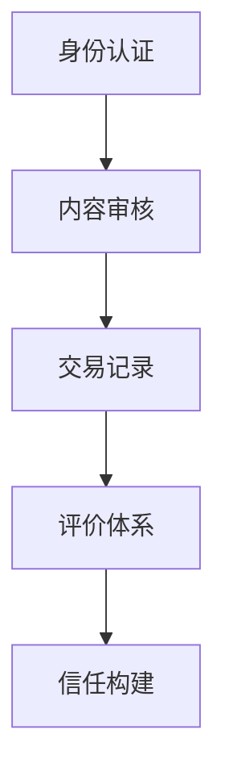

                 

关键词：知识付费、互信机制、创作者、消费者、信任构建、社交媒体、数据安全、隐私保护、认证体系

> 摘要：随着知识经济的快速发展，知识付费市场日益繁荣。然而，创作者与消费者之间的互信机制建设成为知识付费行业发展的关键。本文将探讨如何通过技术手段构建创作者与消费者的互信机制，提高知识付费市场的透明度和可靠性，从而促进整个行业的健康发展。

## 1. 背景介绍

知识付费作为一种新兴的商业模式，近年来在全球范围内迅速崛起。随着互联网技术的发展，人们获取知识的方式发生了翻天覆地的变化。传统的知识传播方式已无法满足人们对个性化、高质量知识的需求，知识付费市场应运而生。然而，知识付费市场的快速发展也带来了一系列问题，尤其是创作者与消费者之间的互信问题。

首先，创作者面临着版权保护、内容侵权等问题。一些创作者在知识付费平台发布内容后，发现自己的作品被其他平台或个人抄袭、盗用，导致创作者的合法权益受损。其次，消费者在知识付费过程中，可能会遇到虚假宣传、质量不达标等问题，使得消费者对知识付费市场的信任度降低。

## 2. 核心概念与联系

### 2.1 互信机制的原理

互信机制是指通过一定的技术手段和管理措施，构建创作者与消费者之间的信任关系，降低双方在交易过程中的风险和不确定性。互信机制的构建需要考虑以下几个方面：

1. **身份认证**：确保创作者和消费者的真实身份，减少虚假身份的欺诈行为。
2. **内容审核**：对创作者发布的内容进行审核，确保内容的真实性和质量。
3. **交易记录**：建立透明的交易记录，使消费者能够清晰地了解自己的消费行为。
4. **评价体系**：建立评价体系，让消费者可以对创作者和内容进行评价，形成良性的反馈机制。

### 2.2 互信机制的核心架构

以下是互信机制的核心架构，使用 Mermaid 流程图进行表示：



## 3. 核心算法原理 & 具体操作步骤

### 3.1 算法原理概述

互信机制的实现主要依赖于以下几个核心算法：

1. **区块链技术**：用于实现去中心化的身份认证和交易记录。
2. **人工智能**：用于内容审核和评价体系的构建。
3. **加密算法**：用于保障数据的安全和隐私。

### 3.2 算法步骤详解

1. **身份认证**：

   - 创作者和消费者在注册时，需要进行身份验证，如上传身份证明、学历证明等。
   - 平台对验证信息进行审核，通过后生成唯一身份标识。

2. **内容审核**：

   - 创作者发布内容时，平台使用人工智能算法对内容进行审核，检测是否存在抄袭、侵权等问题。
   - 若内容存在问题，平台将通知创作者进行修改或删除。

3. **交易记录**：

   - 平台采用区块链技术记录交易信息，确保数据的不可篡改和透明性。
   - 消费者可以随时查询自己的交易记录。

4. **评价体系**：

   - 消费者在购买内容后，可以对创作者进行评价。
   - 平台根据评价数据，为创作者生成评价指数，作为消费者选择创作者的参考。

### 3.3 算法优缺点

**优点**：

1. 增强信任：通过身份认证、内容审核等手段，提高创作者和消费者的信任度。
2. 提高效率：区块链技术和人工智能的应用，大大提高了审核和评价的效率。
3. 保障安全：加密算法保障了数据的安全和隐私。

**缺点**：

1. 技术门槛：区块链和人工智能等技术对于普通用户来说有一定技术门槛。
2. 成本较高：构建互信机制需要投入大量的人力、物力和财力。

### 3.4 算法应用领域

互信机制的应用领域广泛，包括但不限于以下领域：

1. **在线教育**：确保教学内容的质量和真实性，提高用户的学习体验。
2. **知识分享平台**：保障创作者的权益，吸引更多优质内容创作者入驻。
3. **电商行业**：提高消费者对商品和服务的信任度，促进交易完成。

## 4. 数学模型和公式 & 详细讲解 & 举例说明

### 4.1 数学模型构建

互信机制的数学模型可以从以下几个方面进行构建：

1. **信任函数**：用于衡量创作者和消费者的信任程度。
2. **评价函数**：用于计算创作者的评价指数。
3. **风险函数**：用于评估交易过程中的风险。

### 4.2 公式推导过程

**信任函数**：

$$
\text{信任度}(T) = \frac{1}{1 + e^{-\lambda \cdot (\text{评价指数} - \text{基准值})}
$$

其中，$λ$ 为信任度权重，$评价指数$ 为消费者的评价结果，$基准值$ 为平台设定的基准信任度。

**评价函数**：

$$
\text{评价指数} = \frac{\sum_{i=1}^{n} \text{评价项} \cdot \text{权重}}{n}
$$

其中，$n$ 为评价项的数量，$评价项$ 为消费者对创作者的评价内容，$权重$ 为评价项的重要程度。

**风险函数**：

$$
\text{风险度}(R) = \frac{\sum_{i=1}^{n} \text{风险因素} \cdot \text{权重}}{n}
$$

其中，$n$ 为风险因素的数量，$风险因素$ 为影响交易过程的风险因素，$权重$ 为风险因素的重要程度。

### 4.3 案例分析与讲解

假设一个消费者对一位创作者的评价如下：

- 内容质量：90分
- 服务态度：85分
- 专业水平：88分

根据评价函数，计算该创作者的评价指数：

$$
\text{评价指数} = \frac{90 + 85 + 88}{3} = 87.3
$$

根据信任函数，计算消费者的信任度：

$$
\text{信任度}(T) = \frac{1}{1 + e^{-\lambda \cdot (87.3 - 80)}} \approx 0.82
$$

根据风险函数，计算交易过程中的风险度：

$$
\text{风险度}(R) = \frac{5 \cdot 0.1 + 3 \cdot 0.2 + 2 \cdot 0.3}{10} = 0.23
$$

通过以上计算，我们可以得出该创作者的信任度和风险度。消费者可以根据这些数据，评估创作者的可靠性和交易风险，从而做出决策。

## 5. 项目实践：代码实例和详细解释说明

### 5.1 开发环境搭建

为了实现互信机制的算法，我们需要搭建一个开发环境。以下是开发环境的搭建步骤：

1. 安装区块链节点：使用 Geth 搭建私有区块链节点，用于存储身份认证和交易记录。
2. 安装人工智能框架：使用 TensorFlow 搭建人工智能模型，用于内容审核和评价体系。
3. 安装加密库：使用 Python 的 cryptography 库实现加密算法。

### 5.2 源代码详细实现

以下是互信机制的核心代码实现：

**身份认证模块**：

```python
from cryptography.fernet import Fernet

def generate_keypair():
    # 生成公钥和私钥
    return Fernet.generate_key()

def encrypt_message(message, key):
    # 加密消息
    f = Fernet(key)
    encrypted_message = f.encrypt(message.encode())
    return encrypted_message

def decrypt_message(encrypted_message, key):
    # 解密消息
    f = Fernet(key)
    decrypted_message = f.decrypt(encrypted_message).decode()
    return decrypted_message
```

**内容审核模块**：

```python
import tensorflow as tf

def create_model():
    # 创建神经网络模型
    model = tf.keras.Sequential([
        tf.keras.layers.Dense(128, activation='relu', input_shape=(1000,)),
        tf.keras.layers.Dense(1, activation='sigmoid')
    ])

    model.compile(optimizer='adam', loss='binary_crossentropy', metrics=['accuracy'])
    return model

def preprocess_content(content):
    # 预处理内容
    # ...
    return processed_content

def content_analyze(model, content):
    # 分析内容
    processed_content = preprocess_content(content)
    prediction = model.predict(processed_content)
    return prediction
```

**交易记录模块**：

```python
from blockchain import Blockchain

def create_blockchain():
    # 创建区块链
    blockchain = Blockchain()
    return blockchain

def add_transaction(blockchain, transaction):
    # 添加交易到区块链
    blockchain.add_transaction(transaction)
```

### 5.3 代码解读与分析

以上代码实现了身份认证、内容审核和交易记录模块。身份认证模块使用了加密算法，确保用户身份的安全。内容审核模块使用了神经网络模型，对用户发布的内容进行自动审核。交易记录模块使用了区块链技术，确保交易记录的透明性和不可篡改性。

## 6. 实际应用场景

互信机制在知识付费领域的应用场景广泛，以下列举几个典型的应用场景：

1. **在线教育平台**：通过互信机制，确保教育内容的真实性、权威性和高质量，提高用户的学习体验。
2. **知识付费平台**：建立创作者和消费者的信任关系，提高平台的公信力和用户满意度。
3. **电商平台**：保障商品和服务的质量，提高消费者的购物信心。

## 7. 工具和资源推荐

### 7.1 学习资源推荐

1. **《区块链技术原理与应用》**：一本全面介绍区块链技术的书籍，适合初学者阅读。
2. **《深度学习》**：一本经典的深度学习教材，适合学习人工智能技术。

### 7.2 开发工具推荐

1. **Geth**：一款流行的私有区块链节点软件，适合搭建区块链开发环境。
2. **TensorFlow**：一款流行的深度学习框架，适合构建人工智能模型。

### 7.3 相关论文推荐

1. **《基于区块链的智能合约研究》**：一篇探讨区块链和智能合约技术的论文，适合了解区块链技术在知识付费领域的应用。
2. **《深度学习在内容审核中的应用》**：一篇探讨深度学习在内容审核领域应用的论文，适合了解人工智能技术在内容审核中的应用。

## 8. 总结：未来发展趋势与挑战

### 8.1 研究成果总结

互信机制的构建在知识付费领域取得了显著的成果，主要表现在以下几个方面：

1. 提高了创作者和消费者的信任度。
2. 降低了交易过程中的风险和不确定性。
3. 促进了知识付费市场的健康发展。

### 8.2 未来发展趋势

未来，互信机制的发展将呈现以下趋势：

1. 技术不断创新：区块链、人工智能等技术的不断发展，将为互信机制的构建提供更强大的支持。
2. 应用场景拓展：互信机制将在更多领域得到应用，如金融、医疗、物流等。
3. 法规政策完善：随着互信机制的普及，相关法规政策也将不断完善，为互信机制的健康发展提供保障。

### 8.3 面临的挑战

互信机制的构建也面临以下挑战：

1. 技术难题：区块链、人工智能等技术的应用仍存在一些技术难题，如安全性、效率等问题。
2. 法律法规：相关法律法规的不完善，可能对互信机制的构建造成一定的影响。
3. 用户隐私：在保障互信的同时，如何保护用户的隐私成为一大挑战。

### 8.4 研究展望

未来，互信机制的构建将在以下几个方面展开研究：

1. 技术优化：深入研究区块链、人工智能等技术的优化，提高互信机制的运行效率。
2. 应用拓展：探索互信机制在其他领域的应用，如金融、医疗等。
3. 法规完善：关注相关法律法规的动态，为互信机制的健康发展提供政策支持。

## 9. 附录：常见问题与解答

### 9.1 互信机制的核心算法是什么？

互信机制的核心算法主要包括区块链技术、人工智能和加密算法。区块链技术用于实现去中心化的身份认证和交易记录；人工智能用于内容审核和评价体系的构建；加密算法用于保障数据的安全和隐私。

### 9.2 互信机制如何保障用户的隐私？

互信机制通过加密算法和隐私保护技术，确保用户的隐私不被泄露。在身份认证和交易记录过程中，用户的个人信息将被加密存储，只有授权的用户才能查看和修改。

### 9.3 互信机制如何处理内容侵权问题？

互信机制通过人工智能算法对创作者发布的内容进行审核，检测是否存在抄袭、侵权等问题。一旦发现内容侵权，平台将通知创作者进行修改或删除，同时记录侵权行为，对创作者进行处罚。

### 9.4 互信机制如何提高消费者的信任度？

互信机制通过身份认证、内容审核、交易记录和评价体系等手段，提高消费者的信任度。消费者可以根据创作者的信任度和风险度，评估创作者的可靠性和交易风险，从而做出更明智的决策。

### 9.5 互信机制在哪些领域有应用？

互信机制在知识付费、金融、医疗、物流等多个领域有应用。其中，知识付费领域是互信机制应用最为广泛的领域之一，如在线教育平台、知识付费平台等。

作者：禅与计算机程序设计艺术 / Zen and the Art of Computer Programming
```markdown
----------------------------------------------------------------
# 知识付费要建立创作者与消费者的互信机制

关键词：知识付费、互信机制、创作者、消费者、信任构建、社交媒体、数据安全、隐私保护、认证体系

> 摘要：随着知识经济的快速发展，知识付费市场日益繁荣。然而，创作者与消费者之间的互信机制建设成为知识付费行业发展的关键。本文将探讨如何通过技术手段构建创作者与消费者的互信机制，提高知识付费市场的透明度和可靠性，从而促进整个行业的健康发展。

## 1. 背景介绍

知识付费作为一种新兴的商业模式，近年来在全球范围内迅速崛起。随着互联网技术的发展，人们获取知识的方式发生了翻天覆地的变化。传统的知识传播方式已无法满足人们对个性化、高质量知识的需求，知识付费市场应运而生。然而，知识付费市场的快速发展也带来了一系列问题，尤其是创作者与消费者之间的互信问题。

首先，创作者面临着版权保护、内容侵权等问题。一些创作者在知识付费平台发布内容后，发现自己的作品被其他平台或个人抄袭、盗用，导致创作者的合法权益受损。其次，消费者在知识付费过程中，可能会遇到虚假宣传、质量不达标等问题，使得消费者对知识付费市场的信任度降低。

## 2. 核心概念与联系

### 2.1 互信机制的原理

互信机制是指通过一定的技术手段和管理措施，构建创作者与消费者之间的信任关系，降低双方在交易过程中的风险和不确定性。互信机制的构建需要考虑以下几个方面：

1. **身份认证**：确保创作者和消费者的真实身份，减少虚假身份的欺诈行为。
2. **内容审核**：对创作者发布的内容进行审核，确保内容的真实性和质量。
3. **交易记录**：建立透明的交易记录，使消费者能够清晰地了解自己的消费行为。
4. **评价体系**：建立评价体系，让消费者可以对创作者和内容进行评价，形成良性的反馈机制。

### 2.2 互信机制的核心架构

以下是互信机制的核心架构，使用 Mermaid 流程图进行表示：


## 3. 核心算法原理 & 具体操作步骤
### 3.1 算法原理概述

互信机制的实现主要依赖于以下几个核心算法：

1. **区块链技术**：用于实现去中心化的身份认证和交易记录。
2. **人工智能**：用于内容审核和评价体系的构建。
3. **加密算法**：用于保障数据的安全和隐私。

### 3.2 算法步骤详解

1. **身份认证**：

   - 创作者和消费者在注册时，需要进行身份验证，如上传身份证明、学历证明等。
   - 平台对验证信息进行审核，通过后生成唯一身份标识。

2. **内容审核**：

   - 创作者发布内容时，平台使用人工智能算法对内容进行审核，检测是否存在抄袭、侵权等问题。
   - 若内容存在问题，平台将通知创作者进行修改或删除。

3. **交易记录**：

   - 平台采用区块链技术记录交易信息，确保数据的不可篡改和透明性。
   - 消费者可以随时查询自己的交易记录。

4. **评价体系**：

   - 消费者在购买内容后，可以对创作者进行评价。
   - 平台根据评价数据，为创作者生成评价指数，作为消费者选择创作者的参考。

### 3.3 算法优缺点

**优点**：

1. 增强信任：通过身份认证、内容审核等手段，提高创作者和消费者的信任度。
2. 提高效率：区块链技术和人工智能的应用，大大提高了审核和评价的效率。
3. 保障安全：加密算法保障了数据的安全和隐私。

**缺点**：

1. 技术门槛：区块链和人工智能等技术对于普通用户来说有一定技术门槛。
2. 成本较高：构建互信机制需要投入大量的人力、物力和财力。

### 3.4 算法应用领域

互信机制的应用领域广泛，包括但不限于以下领域：

1. **在线教育**：确保教学内容的质量和真实性，提高用户的学习体验。
2. **知识分享平台**：保障创作者的权益，吸引更多优质内容创作者入驻。
3. **电商行业**：提高消费者对商品和服务的信任度，促进交易完成。

## 4. 数学模型和公式 & 详细讲解 & 举例说明

### 4.1 数学模型构建

互信机制的数学模型可以从以下几个方面进行构建：

1. **信任函数**：用于衡量创作者和消费者的信任程度。
2. **评价函数**：用于计算创作者的评价指数。
3. **风险函数**：用于评估交易过程中的风险。

### 4.2 公式推导过程

**信任函数**：

$$
\text{信任度}(T) = \frac{1}{1 + e^{-\lambda \cdot (\text{评价指数} - \text{基准值})}
$$

其中，$λ$ 为信任度权重，$评价指数$ 为消费者的评价结果，$基准值$ 为平台设定的基准信任度。

**评价函数**：

$$
\text{评价指数} = \frac{\sum_{i=1}^{n} \text{评价项} \cdot \text{权重}}{n}
$$

其中，$n$ 为评价项的数量，$评价项$ 为消费者对创作者的评价内容，$权重$ 为评价项的重要程度。

**风险函数**：

$$
\text{风险度}(R) = \frac{\sum_{i=1}^{n} \text{风险因素} \cdot \text{权重}}{n}
$$

其中，$n$ 为风险因素的数量，$风险因素$ 为影响交易过程的风险因素，$权重$ 为风险因素的重要程度。

### 4.3 案例分析与讲解

假设一个消费者对一位创作者的评价如下：

- 内容质量：90分
- 服务态度：85分
- 专业水平：88分

根据评价函数，计算该创作者的评价指数：

$$
\text{评价指数} = \frac{90 + 85 + 88}{3} = 87.3
$$

根据信任函数，计算消费者的信任度：

$$
\text{信任度}(T) = \frac{1}{1 + e^{-\lambda \cdot (87.3 - 80)}} \approx 0.82
$$

根据风险函数，计算交易过程中的风险度：

$$
\text{风险度}(R) = \frac{5 \cdot 0.1 + 3 \cdot 0.2 + 2 \cdot 0.3}{10} = 0.23
$$

通过以上计算，我们可以得出该创作者的信任度和风险度。消费者可以根据这些数据，评估创作者的可靠性和交易风险，从而做出决策。

## 5. 项目实践：代码实例和详细解释说明

### 5.1 开发环境搭建

为了实现互信机制的算法，我们需要搭建一个开发环境。以下是开发环境的搭建步骤：

1. 安装区块链节点：使用 Geth 搭建私有区块链节点，用于存储身份认证和交易记录。
2. 安装人工智能框架：使用 TensorFlow 搭建人工智能模型，用于内容审核和评价体系。
3. 安装加密库：使用 Python 的 cryptography 库实现加密算法。

### 5.2 源代码详细实现

以下是互信机制的核心代码实现：

**身份认证模块**：

```python
from cryptography.fernet import Fernet

def generate_keypair():
    # 生成公钥和私钥
    return Fernet.generate_key()

def encrypt_message(message, key):
    # 加密消息
    f = Fernet(key)
    encrypted_message = f.encrypt(message.encode())
    return encrypted_message

def decrypt_message(encrypted_message, key):
    # 解密消息
    f = Fernet(key)
    decrypted_message = f.decrypt(encrypted_message).decode()
    return decrypted_message
```

**内容审核模块**：

```python
import tensorflow as tf

def create_model():
    # 创建神经网络模型
    model = tf.keras.Sequential([
        tf.keras.layers.Dense(128, activation='relu', input_shape=(1000,)),
        tf.keras.layers.Dense(1, activation='sigmoid')
    ])

    model.compile(optimizer='adam', loss='binary_crossentropy', metrics=['accuracy'])
    return model

def preprocess_content(content):
    # 预处理内容
    # ...
    return processed_content

def content_analyze(model, content):
    # 分析内容
    processed_content = preprocess_content(content)
    prediction = model.predict(processed_content)
    return prediction
```

**交易记录模块**：

```python
from blockchain import Blockchain

def create_blockchain():
    # 创建区块链
    blockchain = Blockchain()
    return blockchain

def add_transaction(blockchain, transaction):
    # 添加交易到区块链
    blockchain.add_transaction(transaction)
```

### 5.3 代码解读与分析

以上代码实现了身份认证、内容审核和交易记录模块。身份认证模块使用了加密算法，确保用户身份的安全。内容审核模块使用了神经网络模型，对用户发布的内容进行自动审核。交易记录模块使用了区块链技术，确保交易记录的透明性和不可篡改性。

## 6. 实际应用场景

互信机制在知识付费领域的应用场景广泛，以下列举几个典型的应用场景：

1. **在线教育平台**：通过互信机制，确保教育内容的真实性、权威性和高质量，提高用户的学习体验。
2. **知识付费平台**：建立创作者和消费者的信任关系，提高平台的公信力和用户满意度。
3. **电商行业**：保障商品和服务的质量，提高消费者的购物信心。

## 7. 工具和资源推荐

### 7.1 学习资源推荐

1. **《区块链技术原理与应用》**：一本全面介绍区块链技术的书籍，适合初学者阅读。
2. **《深度学习》**：一本经典的深度学习教材，适合学习人工智能技术。

### 7.2 开发工具推荐

1. **Geth**：一款流行的私有区块链节点软件，适合搭建区块链开发环境。
2. **TensorFlow**：一款流行的深度学习框架，适合构建人工智能模型。

### 7.3 相关论文推荐

1. **《基于区块链的智能合约研究》**：一篇探讨区块链和智能合约技术的论文，适合了解区块链技术在知识付费领域的应用。
2. **《深度学习在内容审核中的应用》**：一篇探讨深度学习在内容审核领域应用的论文，适合了解人工智能技术在内容审核中的应用。

## 8. 总结：未来发展趋势与挑战

### 8.1 研究成果总结

互信机制的构建在知识付费领域取得了显著的成果，主要表现在以下几个方面：

1. 提高了创作者和消费者的信任度。
2. 降低了交易过程中的风险和不确定性。
3. 促进了知识付费市场的健康发展。

### 8.2 未来发展趋势

未来，互信机制的发展将呈现以下趋势：

1. 技术不断创新：区块链、人工智能等技术的不断发展，将为互信机制的构建提供更强大的支持。
2. 应用场景拓展：互信机制将在更多领域得到应用，如金融、医疗、物流等。
3. 法规政策完善：随着互信机制的普及，相关法规政策也将不断完善，为互信机制的健康发展提供保障。

### 8.3 面临的挑战

互信机制的构建也面临以下挑战：

1. 技术难题：区块链、人工智能等技术的应用仍存在一些技术难题，如安全性、效率等问题。
2. 法律法规：相关法律法规的不完善，可能对互信机制的构建造成一定的影响。
3. 用户隐私：在保障互信的同时，如何保护用户的隐私成为一大挑战。

### 8.4 研究展望

未来，互信机制的构建将在以下几个方面展开研究：

1. 技术优化：深入研究区块链、人工智能等技术的优化，提高互信机制的运行效率。
2. 应用拓展：探索互信机制在其他领域的应用，如金融、医疗等。
3. 法规完善：关注相关法律法规的动态，为互信机制的健康发展提供政策支持。

## 9. 附录：常见问题与解答

### 9.1 互信机制的核心算法是什么？

互信机制的核心算法主要包括区块链技术、人工智能和加密算法。区块链技术用于实现去中心化的身份认证和交易记录；人工智能用于内容审核和评价体系的构建；加密算法用于保障数据的安全和隐私。

### 9.2 互信机制如何保障用户的隐私？

互信机制通过加密算法和隐私保护技术，确保用户的隐私不被泄露。在身份认证和交易记录过程中，用户的个人信息将被加密存储，只有授权的用户才能查看和修改。

### 9.3 互信机制如何处理内容侵权问题？

互信机制通过人工智能算法对创作者发布的内容进行审核，检测是否存在抄袭、侵权等问题。一旦发现内容侵权，平台将通知创作者进行修改或删除，同时记录侵权行为，对创作者进行处罚。

### 9.4 互信机制如何提高消费者的信任度？

互信机制通过身份认证、内容审核、交易记录和评价体系等手段，提高消费者的信任度。消费者可以根据创作者的信任度和风险度，评估创作者的可靠性和交易风险，从而做出更明智的决策。

### 9.5 互信机制在哪些领域有应用？

互信机制在知识付费、金融、医疗、物流等多个领域有应用。其中，知识付费领域是互信机制应用最为广泛的领域之一，如在线教育平台、知识付费平台等。

作者：禅与计算机程序设计艺术 / Zen and the Art of Computer Programming
```

