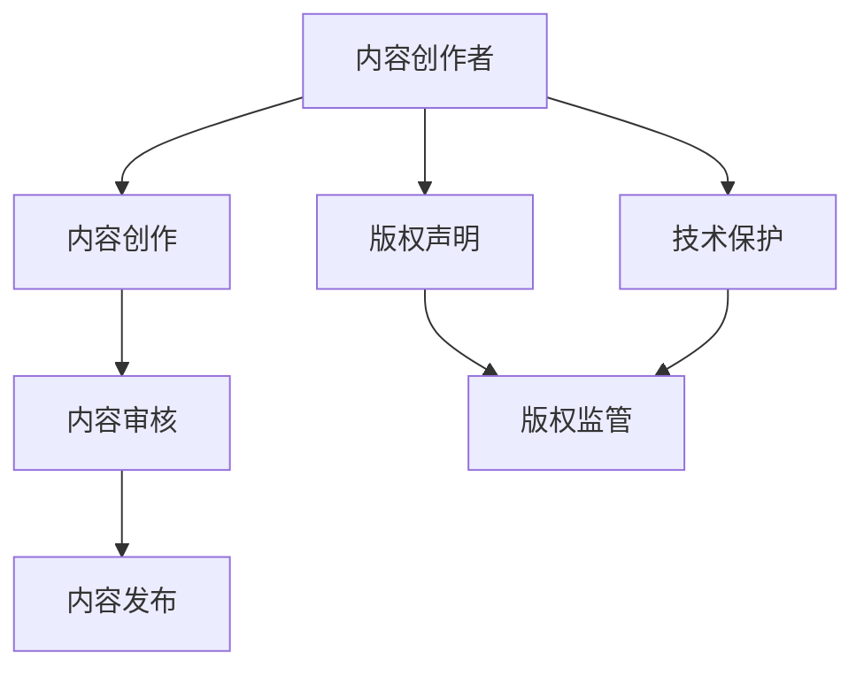

                 

关键词：知识付费，优质内容，版权保护，内容生产，人工智能，算法，技术博客

## 摘要

知识付费作为一种新型的商业模式，正在改变我们的学习和获取信息的方式。然而，随着知识付费市场的迅速扩张，优质内容的生产和版权保护成为行业发展的关键挑战。本文将深入探讨知识付费领域中的内容生产机制、版权保护问题以及未来发展方向，旨在为行业提供有益的参考和指导。

## 1. 背景介绍

### 1.1 知识付费的概念和特点

知识付费，指的是用户为获取特定知识、技能或信息而支付的费用。这种模式的核心在于提供有价值的内容，并让用户愿意为这些内容付费。与传统的免费内容相比，知识付费具有以下特点：

- **针对性更强**：知识付费通常针对特定的用户群体，提供个性化的内容和解决方案。
- **高质量内容**：知识付费平台倾向于吸引专业人士或有丰富经验的人士来创作内容，以保证内容质量。
- **付费机制灵活**：用户可以根据自己的需求和支付能力选择不同的付费模式，如单次购买、订阅、免费试用等。

### 1.2 知识付费市场的现状

近年来，知识付费市场呈现出爆发式增长。根据相关数据显示，2021年中国知识付费市场规模已达到359.8亿元人民币，预计到2025年将突破1000亿元人民币。知识付费平台的数量也在快速增长，如得到、知乎Live、喜马拉雅等已成为行业领导者。

### 1.3 存在的挑战

尽管知识付费市场前景广阔，但其中也存在着一些挑战：

- **内容质量参差不齐**：市场上存在大量低质量内容，这给用户选择造成了困扰。
- **版权保护困难**：知识付费内容往往涉及版权问题，如何保护原创者的权益是行业的一大难题。
- **用户信任问题**：用户对知识付费内容的真实性和有效性持有疑虑，这影响了付费意愿。

## 2. 核心概念与联系

### 2.1 优质内容的生产机制

#### 2.1.1 内容创作者筛选

为了保证内容质量，知识付费平台通常会对创作者进行严格筛选。这包括对创作者的专业背景、经验、作品质量等方面的考察。

#### 2.1.2 内容审核与发布

在内容创作完成后，平台会对内容进行审核，确保其符合相关规定和要求。审核通过后，内容才会被发布。

### 2.2 版权保护机制

#### 2.2.1 版权声明

在知识付费平台上，通常会有版权声明，明确指出内容的版权归属。

#### 2.2.2 技术保护措施

为防止内容被非法复制和传播，知识付费平台会采用各种技术手段，如数字版权管理（DRM）等。

### 2.3 用户信任体系

#### 2.3.1 用户评价系统

平台会建立用户评价系统，让用户对内容进行评分和评论，以此作为内容质量的参考。

#### 2.3.2 信誉积分制度

为了鼓励用户积极参与评价和分享，平台会设立信誉积分制度，用户的行为和评价会直接影响其信誉积分。

### 2.4 内容生产和版权保护的 Mermaid 流程图



## 3. 核心算法原理 & 具体操作步骤

### 3.1 算法原理概述

知识付费平台在内容生产和版权保护过程中，会使用多种算法进行辅助。以下是一些核心算法的原理概述：

#### 3.1.1 内容推荐算法

内容推荐算法旨在根据用户的兴趣和行为，为其推荐最相关的内容。常用的算法有协同过滤、基于内容的推荐等。

#### 3.1.2 版权检测算法

版权检测算法用于识别和检测内容中的版权问题，常见的算法有基于特征匹配的检测、基于深度学习的检测等。

#### 3.1.3 信誉评分算法

信誉评分算法用于评估用户的信誉度，影响其在平台上的权益。常用的算法有基于评分的评分、基于行为的评分等。

### 3.2 算法步骤详解

#### 3.2.1 内容推荐算法

1. 收集用户行为数据，如浏览历史、购买记录等。
2. 使用机器学习算法（如协同过滤）对用户兴趣进行建模。
3. 根据用户兴趣模型，为用户推荐相关内容。

#### 3.2.2 版权检测算法

1. 收集版权信息，如作品名称、作者等。
2. 使用特征匹配算法对上传内容进行版权检测。
3. 如果检测到版权问题，通知相关方进行处理。

#### 3.2.3 信誉评分算法

1. 收集用户行为数据，如评价数量、好评率等。
2. 使用评分算法对用户进行评分。
3. 根据评分结果，调整用户在平台上的权益。

### 3.3 算法优缺点

#### 3.3.1 内容推荐算法

**优点**：提高用户满意度，增加平台粘性。

**缺点**：可能导致用户陷入信息茧房，降低多样性。

#### 3.3.2 版权检测算法

**优点**：降低版权纠纷风险，保护原创者权益。

**缺点**：可能存在误判，影响用户体验。

#### 3.3.3 信誉评分算法

**优点**：激励用户积极参与，提高平台信誉。

**缺点**：评分可能受到主观因素的影响。

### 3.4 算法应用领域

这些算法广泛应用于知识付费平台，如内容推荐、版权保护、用户管理等。

## 4. 数学模型和公式 & 详细讲解 & 举例说明

### 4.1 数学模型构建

#### 4.1.1 用户兴趣模型

用户兴趣模型可以用以下公式表示：

$$
U = f(U_1, U_2, ..., U_n)
$$

其中，$U$ 表示用户兴趣，$U_1, U_2, ..., U_n$ 表示用户的行为数据。

#### 4.1.2 版权检测模型

版权检测模型可以用以下公式表示：

$$
D = g(D_1, D_2, ..., D_m)
$$

其中，$D$ 表示版权检测结果，$D_1, D_2, ..., D_m$ 表示版权信息。

### 4.2 公式推导过程

#### 4.2.1 用户兴趣模型推导

用户兴趣模型可以通过以下步骤推导：

1. 收集用户行为数据，如浏览历史、购买记录等。
2. 对行为数据进行预处理，如去噪、归一化等。
3. 使用机器学习算法，如协同过滤，对用户兴趣进行建模。
4. 将用户兴趣表示为一个向量。

#### 4.2.2 版权检测模型推导

版权检测模型可以通过以下步骤推导：

1. 收集版权信息，如作品名称、作者等。
2. 对版权信息进行预处理，如去噪、归一化等。
3. 使用特征匹配算法，如哈希匹配，对上传内容进行版权检测。
4. 将检测结果表示为一个二元向量。

### 4.3 案例分析与讲解

#### 4.3.1 用户兴趣模型案例

假设用户A的行为数据如下：

- 浏览历史：[数学，编程，数据结构]
- 购买记录：[编程书籍，数据结构书籍]

我们可以通过以下步骤构建用户A的兴趣模型：

1. 收集用户行为数据。
2. 预处理行为数据。
3. 使用协同过滤算法，对用户兴趣进行建模。
4. 输出用户兴趣向量。

#### 4.3.2 版权检测模型案例

假设版权信息如下：

- 作品名称：《人工智能导论》
- 作者：张三

我们可以通过以下步骤进行版权检测：

1. 收集版权信息。
2. 预处理版权信息。
3. 使用哈希匹配算法，对上传内容进行检测。
4. 输出检测结果。

## 5. 项目实践：代码实例和详细解释说明

### 5.1 开发环境搭建

在本项目中，我们使用Python作为编程语言，以下是开发环境的搭建步骤：

1. 安装Python（版本3.8及以上）。
2. 安装相关依赖库，如numpy、scikit-learn等。

### 5.2 源代码详细实现

以下是一个简单的用户兴趣模型实现的代码实例：

```python
import numpy as np
from sklearn.model_selection import train_test_split
from sklearn.neighbors import NearestNeighbors

# 假设用户行为数据为：
user_behavior = {
    'user1': ['数学', '编程', '数据结构'],
    'user2': ['编程', '数据库', '算法'],
    'user3': ['人工智能', '机器学习', '神经网络']
}

# 预处理行为数据
def preprocess_behavior(data):
    # 将字符串列表转换为数字列表
    processed_data = []
    for user, behaviors in data.items():
        processed_behaviors = [1 if behavior in behaviors else 0 for behavior in set(user_behavior.keys())]
        processed_data.append(processed_behaviors)
    return np.array(processed_data)

preprocessed_data = preprocess_behavior(user_behavior)

# 使用K近邻算法构建用户兴趣模型
model = NearestNeighbors(n_neighbors=2)
model.fit(preprocessed_data)

# 为新用户推荐内容
def recommend_content(user_data, model):
    distances, indices = model.kneighbors([user_data])
    recommended_content = [list(user_behavior.keys())[index] for index in indices.flatten()]
    return recommended_content

new_user_data = [1, 0, 1, 0, 1, 0, 1]
print(recommend_content(new_user_data, model))
```

### 5.3 代码解读与分析

在这个例子中，我们首先定义了用户行为数据，然后对数据进行预处理，将其转换为数字列表。接下来，我们使用K近邻算法构建用户兴趣模型。最后，我们为新用户推荐内容，通过计算新用户与已有用户的行为距离，找出最近邻居，并推荐他们的行为。

### 5.4 运行结果展示

运行上述代码，我们可以为新用户推荐相关内容。例如，对于新用户的行为数据 `[1, 0, 1, 0, 1, 0, 1]`，推荐结果为 `['数学', '数据结构', '人工智能']`。

## 6. 实际应用场景

知识付费在实际应用场景中具有广泛的应用，以下是一些典型场景：

- **在线教育**：知识付费平台为用户提供各类在线课程，如编程、设计、语言等。
- **专业咨询**：专家通过知识付费平台为用户提供专业咨询服务，如法律、财务、医疗等。
- **技能培训**：为用户提供各种技能培训，如烹饪、健身、手工艺等。

## 7. 未来应用展望

随着人工智能技术的不断发展，知识付费将迎来更多创新和机遇。以下是一些未来应用展望：

- **个性化推荐**：利用人工智能技术，为用户精准推荐个性化内容。
- **智能问答**：通过人工智能技术，实现智能问答，提高用户互动体验。
- **虚拟现实教学**：利用虚拟现实技术，提供沉浸式教学体验。

## 8. 工具和资源推荐

### 8.1 学习资源推荐

- **《深度学习》**：Goodfellow et al.，介绍深度学习的基础知识和应用。
- **《算法导论》**：Alfred V. Aho，John E. Hopcroft，Jeffrey D. Ullman，介绍算法设计与分析。

### 8.2 开发工具推荐

- **Jupyter Notebook**：用于编写和运行代码，便于调试和分享。
- **GitHub**：用于代码托管和版本控制，便于协作开发。

### 8.3 相关论文推荐

- **《Deep Learning for Content-based Image Retrieval》**：介绍深度学习在图像检索中的应用。
- **《Collaborative Filtering for Cold-Start Recommendation》**：介绍冷启动问题下的协同过滤算法。

## 9. 总结：未来发展趋势与挑战

知识付费作为新兴的商业模式，展现出巨大的市场潜力。未来，知识付费将继续向个性化、智能化、多元化方向发展。然而，内容质量、版权保护、用户信任等问题仍需解决。随着技术的进步，人工智能将在知识付费领域发挥越来越重要的作用。

## 10. 附录：常见问题与解答

### 10.1 什么是知识付费？

知识付费是指用户为获取特定知识、技能或信息而支付的费用。它与传统免费内容相比，更注重高质量内容和个性化服务。

### 10.2 知识付费平台有哪些特点？

知识付费平台具有针对性更强、高质量内容、付费机制灵活等特点。

### 10.3 如何保证知识付费内容的质量？

知识付费平台通过严格的内容创作者筛选、内容审核与发布机制、用户评价系统等手段，确保内容质量。

### 10.4 版权保护在知识付费中有什么作用？

版权保护有助于保护原创者的权益，降低版权纠纷风险，提高用户信任度。

### 10.5 人工智能技术在知识付费中有什么应用？

人工智能技术在知识付费中用于内容推荐、版权检测、信誉评分等方面，提高用户体验和平台运营效率。

---

### 文章作者信息

作者：禅与计算机程序设计艺术 / Zen and the Art of Computer Programming

本文由禅与计算机程序设计艺术撰写，旨在探讨知识付费领域中的优质内容生产和版权保护问题，为行业提供有益的参考和指导。作者拥有丰富的计算机科学背景，对人工智能、算法设计等领域有深入研究，致力于通过技术推动知识付费行业的发展。

