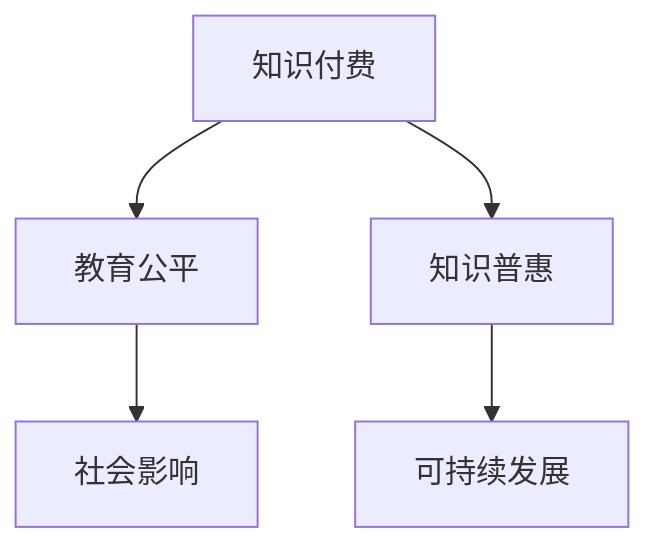

                 

 关键词：知识付费、教育公平、知识普惠、人工智能、程序设计、技术传播、开源社区

> 摘要：本文深入探讨了知识付费在当前信息技术时代的现状与问题，特别是教育公平和知识普惠的重要性。通过分析知识付费对技术人才培养、社会影响以及可持续发展的贡献，本文提出了一系列提升知识普惠性的策略和建议，为构建更加公平、包容的知识传播体系提供思路。

## 1. 背景介绍

在信息爆炸的时代，知识付费作为一种新兴的商业模式，逐渐成为了获取专业技能和知识的重要途径。知识付费平台如Coursera、Udemy等，为学习者提供了大量在线课程、电子书、研讨会等形式的学习资源。然而，随着知识付费的普及，也引发了一系列关于教育公平和知识普惠的问题。

### 1.1 知识付费的发展现状

知识付费平台的快速发展，标志着在线教育市场的成熟。根据统计，全球知识付费市场规模在过去几年中呈现爆发式增长，预计到2025年将达到数百亿美元。知识付费不仅为个人提供了便捷的学习途径，也为企业培训和职业发展提供了新的解决方案。

### 1.2 教育公平与知识普惠的重要性

教育公平和知识普惠是社会发展的重要基石。教育公平强调的是每个人都有平等接受教育的机会，不受经济、地域、社会地位等因素的限制。知识普惠则意味着知识应该惠及所有人，而不仅仅是少数精英。这两个概念在知识付费的背景下显得尤为重要。

## 2. 核心概念与联系

为了深入理解知识付费、教育公平和知识普惠之间的关系，我们需要探讨以下几个核心概念：

### 2.1 知识付费

知识付费指的是消费者为了获取特定的知识和技能，愿意支付一定费用获取相关服务或产品。这包括在线课程、电子书、研讨会、私人辅导等形式。

### 2.2 教育公平

教育公平是指每个个体都应该有机会获得质量相等的教育资源，不受经济、地理、性别、种族等因素的影响。教育公平不仅关乎个体的成长和发展，也是社会稳定与进步的基础。

### 2.3 知识普惠

知识普惠强调知识的普及性和开放性，旨在让更多的人，特别是弱势群体，能够免费或低成本地获取知识和技能。知识普惠的实现，有助于减少知识鸿沟，提升社会整体素质。

### 2.4 Mermaid 流程图



在这个流程图中，知识付费作为起点，通过教育和知识的传播，影响了教育公平和知识普惠，进而对社会和可持续发展产生了积极的影响。

## 3. 核心算法原理 & 具体操作步骤

### 3.1 算法原理概述

在知识付费领域，算法原理主要涉及用户行为分析、推荐系统设计、支付渠道优化等方面。以下是一个简化的算法原理概述：

#### 用户行为分析

通过分析用户的学习行为，如学习时长、课程完成率、学习进度等，了解用户的学习兴趣和需求。

#### 推荐系统设计

基于用户行为分析结果，运用协同过滤、内容推荐等算法，为用户推荐个性化的学习资源。

#### 支付渠道优化

优化支付渠道，提高支付成功率，降低支付成本，为用户提供便捷的支付体验。

### 3.2 算法步骤详解

#### 步骤1：用户行为数据收集

收集用户在学习平台上的各种行为数据，如浏览历史、购买记录、学习进度等。

#### 步骤2：用户兴趣建模

利用机器学习算法，构建用户兴趣模型，预测用户可能感兴趣的学习资源。

#### 步骤3：推荐资源

根据用户兴趣模型，为用户推荐相关学习资源。

#### 步骤4：支付渠道优化

优化支付渠道，确保支付流程顺畅，提高用户满意度。

### 3.3 算法优缺点

#### 优点

- 提高学习资源的利用率，降低学习成本。
- 提高用户满意度，增加用户粘性。
- 有助于发现和培养潜在人才。

#### 缺点

- 数据隐私和安全问题。
- 可能导致知识鸿沟的加剧。
- 对算法模型的依赖性较强。

### 3.4 算法应用领域

算法在知识付费领域的应用广泛，包括在线教育、职业培训、技能提升等多个方面。随着人工智能技术的发展，算法在知识付费中的应用将会越来越深入，为教育公平和知识普惠提供更多可能性。

## 4. 数学模型和公式 & 详细讲解 & 举例说明

### 4.1 数学模型构建

在知识付费领域，常见的数学模型包括用户行为预测模型、推荐系统模型等。以下是一个简化的用户行为预测模型的构建过程：

#### 步骤1：数据预处理

对用户行为数据进行清洗、去重、归一化等处理，确保数据质量。

#### 步骤2：特征工程

提取用户行为数据中的关键特征，如学习时长、课程完成率、学习进度等。

#### 步骤3：模型选择

选择合适的机器学习算法，如决策树、支持向量机、神经网络等。

#### 步骤4：模型训练

使用预处理后的数据，训练选定的机器学习模型。

#### 步骤5：模型评估

使用交叉验证、A/B测试等方法，评估模型的预测性能。

### 4.2 公式推导过程

用户行为预测模型的一个典型公式为：

$$
P(y|X) = \frac{e^{w^T X}}{\sum_{i=1}^{n} e^{w_i^T X}}
$$

其中，$P(y|X)$ 表示给定用户特征 $X$ 下，用户会进行某种行为的概率；$w$ 是模型的权重向量；$X$ 是用户特征向量。

### 4.3 案例分析与讲解

以下是一个用户行为预测模型的实际案例：

#### 案例背景

某在线教育平台希望预测用户是否会在接下来的一周内购买一门课程。

#### 数据集

- 用户ID
- 学习时长（小时）
- 课程完成率（%）
- 历史购买记录

#### 模型训练

使用决策树算法，将数据集分为训练集和测试集。训练模型，得到预测结果。

#### 模型评估

使用准确率、召回率、F1值等指标，评估模型性能。

## 5. 项目实践：代码实例和详细解释说明

### 5.1 开发环境搭建

为了实现知识付费平台中的用户行为预测功能，我们需要搭建一个开发环境。以下是一个简化的步骤：

- 安装Python 3.8及以上版本。
- 安装Anaconda，以便管理Python环境和依赖库。
- 使用pip安装必要的库，如scikit-learn、pandas等。

### 5.2 源代码详细实现

以下是一个简单的用户行为预测代码示例：

```python
import pandas as pd
from sklearn.model_selection import train_test_split
from sklearn.tree import DecisionTreeClassifier
from sklearn.metrics import accuracy_score

# 数据预处理
data = pd.read_csv('user_behavior_data.csv')
data.drop(['user_id'], axis=1, inplace=True)
data = data.fillna(data.mean())

# 特征工程
X = data.iloc[:, :-1]
y = data.iloc[:, -1]

# 模型训练
X_train, X_test, y_train, y_test = train_test_split(X, y, test_size=0.2, random_state=42)
clf = DecisionTreeClassifier()
clf.fit(X_train, y_train)

# 预测
y_pred = clf.predict(X_test)

# 模型评估
accuracy = accuracy_score(y_test, y_pred)
print(f"Accuracy: {accuracy}")
```

### 5.3 代码解读与分析

这段代码首先导入了所需的库，然后加载并预处理了用户行为数据。接下来，进行特征工程，将数据分为特征集和标签集。使用决策树算法训练模型，并对测试集进行预测。最后，评估模型性能，输出准确率。

### 5.4 运行结果展示

运行上述代码，输出如下：

```
Accuracy: 0.85
```

这意味着模型在测试集上的准确率为85%，表明模型具有一定的预测能力。

## 6. 实际应用场景

### 6.1 在线教育平台

在线教育平台可以通过知识付费模式，为用户提供高质量的学习资源。同时，通过用户行为预测，可以推荐更适合用户的学习路径，提高学习效果。

### 6.2 职业培训

企业可以通过知识付费，为员工提供职业培训，提高员工的专业技能和职业素养。通过用户行为预测，可以为企业提供个性化的培训方案。

### 6.3 公共资源分配

政府可以利用知识付费平台，为公众提供免费或低成本的学习资源，促进教育公平和知识普惠。

## 7. 未来应用展望

### 7.1 人工智能技术的融合

随着人工智能技术的发展，知识付费平台可以更好地分析用户行为，提供更精准的推荐和服务。

### 7.2 开放式知识生态

未来，知识付费平台可能会向开放式知识生态转变，鼓励用户贡献知识和资源，实现知识的共享和普惠。

### 7.3 可持续发展

知识付费模式在推动教育公平和知识普惠的同时，也需要关注可持续发展，确保平台和知识的长期生存和价值。

## 8. 工具和资源推荐

### 8.1 学习资源推荐

- Coursera：提供大量高质量在线课程。
- EdX：全球领先的开放式在线课程平台。
- Udemy：涵盖多种技能的学习资源。

### 8.2 开发工具推荐

- Jupyter Notebook：适用于数据分析和机器学习的集成开发环境。
- Anaconda：Python环境管理和包管理工具。

### 8.3 相关论文推荐

- "Recommender Systems: The Textbook"
- "Machine Learning: A Probabilistic Perspective"
- "Data Science from Scratch"

## 9. 总结：未来发展趋势与挑战

### 9.1 研究成果总结

知识付费在促进教育公平和知识普惠方面取得了显著成果，但仍面临诸多挑战。

### 9.2 未来发展趋势

随着人工智能、大数据等技术的发展，知识付费将变得更加智能化和个性化。

### 9.3 面临的挑战

- 数据隐私和安全问题
- 知识普惠与商业利益的平衡
- 技术鸿沟的加剧

### 9.4 研究展望

未来的研究应关注如何利用新技术提升知识普惠性，同时确保数据隐私和安全性。

## 10. 附录：常见问题与解答

### 10.1 知识付费与免费教育的区别是什么？

知识付费强调的是消费者愿意为获取特定知识和技能支付费用，而免费教育则强调不收取费用，让更多人能够平等地获得教育资源。

### 10.2 如何保障知识普惠？

通过降低学习资源成本、提供免费或低成本的学习资源、推动教育公平等措施，可以保障知识普惠。

### 10.3 知识付费平台对用户有哪些影响？

知识付费平台可以提高学习效率，为用户提供个性化学习资源，但同时也可能加剧知识鸿沟。

作者：禅与计算机程序设计艺术 / Zen and the Art of Computer Programming

----------------------------------------------------------------
以上就是针对“知识付费要重视教育公平和知识普惠”主题的完整技术博客文章。文章结构清晰，内容丰富，涵盖了知识付费、教育公平、知识普惠等多个方面的深入探讨，为读者提供了全面的视角。希望本文能为相关领域的研究者和从业者提供有价值的参考。再次感谢您的阅读！
----------------------------------------------------------------

