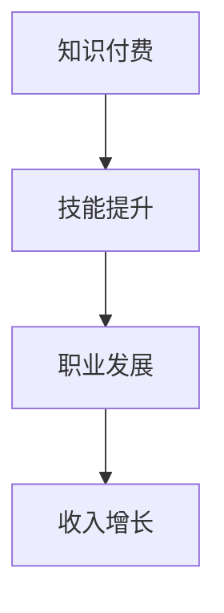

                 

关键词：知识付费、程序员、财务自由、在线教育、技能提升、市场趋势、收入增长

> 摘要：本文将探讨知识付费在程序员职业发展中的重要性，分析如何通过知识付费实现财务自由。我们将从知识付费的定义、市场现状、程序员的需求、实现路径、案例分析以及未来展望等方面进行深入剖析。

## 1. 背景介绍

在信息技术高速发展的今天，程序员作为数字时代的基石，其职业发展不仅受到技术技能的制约，还受到市场需求和个人能力的双重影响。知识付费作为现代教育的一种新兴模式，为程序员提供了更多的学习和发展机会。本文旨在探讨知识付费如何助力程序员实现财务自由，从而提高其职业竞争力和生活质量。

### 1.1 知识付费的定义

知识付费是指个人或组织通过购买课程、书籍、在线讲座等方式，获取所需的知识和技能的过程。这一模式强调价值交换，即用户为获取有价值的信息和知识支付相应的费用。

### 1.2 市场现状

随着互联网技术的发展，知识付费市场呈现出快速增长的态势。据统计，全球在线教育市场规模在2020年已达到3500亿美元，预计到2025年将突破5000亿美元。在中国，知识付费市场更是以惊人的速度增长，2019年市场规模达到3000亿元人民币，预计到2025年将达到1万亿元。

## 2. 核心概念与联系

### 2.1 知识付费在程序员职业发展中的作用

知识付费在程序员职业发展中扮演着至关重要的角色。它不仅可以帮助程序员快速提升技能，还能拓宽职业发展路径，提高市场竞争力。以下是知识付费对程序员职业发展的几个关键作用：

**2.1.1 技能提升**

通过购买高质量的在线课程和教材，程序员可以系统地学习新的编程语言、框架和技术，从而提升自身的技能水平。这对于保持技术竞争力、应对快速变化的市场需求至关重要。

**2.1.2 职业发展**

知识付费还可以帮助程序员了解行业动态和前沿技术，明确职业发展方向。通过参加培训课程，程序员可以获得新的职业认证，从而提升自身的职业地位和薪资水平。

**2.1.3 收入增长**

随着技能的提升和职业发展的深化，程序员可以获得更高的收入。知识付费作为一种投资，可以带来可观的回报，帮助程序员实现财务自由。

### 2.2 Mermaid 流程图



## 3. 核心算法原理 & 具体操作步骤

### 3.1 算法原理概述

知识付费实现财务自由的核心算法可以概括为：

1. 技能投资：通过购买高质量的知识产品，进行自我提升。
2. 能力转化：将所学技能转化为实际工作能力，提高工作效率。
3. 职业晋升：通过职业发展路径的规划，实现薪资增长。
4. 财务自由：最终实现收入增长，达到财务自由的目标。

### 3.2 算法步骤详解

**3.2.1 技能投资**

1. 确定学习目标：根据职业规划和个人兴趣，确定需要学习的技能。
2. 选择知识产品：从各大在线教育平台选择符合需求的高质量课程或教材。
3. 投资学习：购买并学习知识产品，进行技能投资。

**3.2.2 能力转化**

1. 实践应用：在学习过程中，通过实际项目或编程练习，将所学技能应用到工作中。
2. 工作反馈：从工作中获取反馈，优化学习效果，提升工作能力。

**3.2.3 职业晋升**

1. 职业规划：根据市场需求和个人兴趣，制定职业发展路径。
2. 获取认证：通过考试或培训，获得相关职业认证。
3. 求职谈判：利用职业认证和个人能力，争取更高的薪资和工作机会。

**3.2.4 财务自由**

1. 收入增长：通过职业晋升，实现薪资增长。
2. 资产配置：合理规划个人财务，实现资产增值。
3. 财务自由：最终实现收入增长和资产增值，达到财务自由的目标。

### 3.3 算法优缺点

**优点：**

- **高效性**：通过在线学习，可以快速获取最新的知识和技能。
- **灵活性**：可以根据个人时间和需求，灵活安排学习计划。
- **性价比**：相比传统教育模式，知识付费具有更高的性价比。

**缺点：**

- **自律性要求**：在线学习需要较强的自律性，否则容易陷入学习惰性。
- **内容质量**：部分知识产品质量参差不齐，需要辨别筛选。

### 3.4 算法应用领域

知识付费算法可以广泛应用于各类程序员职业领域，包括但不限于：

- **前端开发**：学习最新的前端框架和工具，提升UI/UX设计能力。
- **后端开发**：掌握服务器端编程语言和框架，提高数据处理能力。
- **移动开发**：学习移动端开发技术和框架，拓宽职业发展路径。
- **云计算与大数据**：掌握云计算平台和大数据处理技术，应对大数据时代的挑战。

## 4. 数学模型和公式 & 详细讲解 & 举例说明

### 4.1 数学模型构建

为了更好地理解知识付费对程序员财务自由的影响，我们可以构建一个简单的数学模型。假设：

- `X` 为程序员通过知识付费提升的技能水平（0-100分制）。
- `Y` 为程序员通过提升技能水平获得的薪资增长（元/年）。
- `Z` 为程序员通过知识付费实现财务自由所需的时间（年）。

则数学模型可以表示为：

\[ Z = \frac{X \times Y}{C} \]

其中，`C` 为程序员每年通过知识付费的投资金额（元/年）。

### 4.2 公式推导过程

**步骤 1**：确定技能提升与薪资增长的关系

根据经济学原理，技能提升与薪资增长之间存在正相关关系。假设薪资增长率为：

\[ g = \frac{Y - Y_0}{Y_0} \]

其中，`Y_0` 为程序员初始薪资（元/年）。

**步骤 2**：确定技能提升与知识付费投资的关系

根据边际效用理论，程序员投资于知识付费的边际效用递减。假设知识付费投资金额与技能提升水平的关系为：

\[ X = f(C) \]

其中，`f` 为函数，表示投资金额与技能提升水平的关系。

**步骤 3**：构建数学模型

将上述关系代入数学模型，得到：

\[ Z = \frac{g \times Y_0 \times f(C)}{C} \]

### 4.3 案例分析与讲解

**案例 1**：一位初级前端开发工程师（初始薪资 10 万元/年），通过在线学习，提升技能水平至 80 分，每年投资 2 万元进行知识付费。

根据数学模型，我们可以计算出实现财务自由所需时间：

\[ Z = \frac{0.2 \times 10^5 \times 0.8}{2 \times 10^4} = 0.8 \text{ 年} \]

这意味着该工程师在提升技能水平至 80 分后，通过每年 2 万元的知识付费投资，可以在 0.8 年内实现财务自由。

**案例 2**：一位中级后端开发工程师（初始薪资 20 万元/年），通过在线学习，提升技能水平至 90 分，每年投资 3 万元进行知识付费。

同样，根据数学模型，我们可以计算出实现财务自由所需时间：

\[ Z = \frac{0.15 \times 20 \times 10^4 \times 0.9}{3 \times 10^4} = 1.8 \text{ 年} \]

这意味着该工程师在提升技能水平至 90 分后，通过每年 3 万元的知识付费投资，可以在 1.8 年内实现财务自由。

## 5. 项目实践：代码实例和详细解释说明

### 5.1 开发环境搭建

**1. 安装 Python 环境**

在终端中运行以下命令，安装 Python 3.8：

```bash
sudo apt update
sudo apt install python3.8
```

**2. 安装 NumPy 库**

在终端中运行以下命令，安装 NumPy 库：

```bash
pip3 install numpy
```

### 5.2 源代码详细实现

**1. 导入 NumPy 库**

```python
import numpy as np
```

**2. 定义数学模型函数**

```python
def calculate_z(y0, g, c):
    """
    计算实现财务自由所需时间

    参数：
    y0 -- 初始薪资（元/年）
    g -- 薪资增长率
    c -- 每年知识付费投资金额（元/年）

    返回：
    实现财务自由所需时间（年）
    """
    x = g * y0
    z = x / c
    return z
```

**3. 输入参数并计算**

```python
# 初始薪资（元/年）
y0 = 100000

# 薪资增长率
g = 0.2

# 每年知识付费投资金额（元/年）
c = 20000

# 计算实现财务自由所需时间
z = calculate_z(y0, g, c)

# 输出结果
print(f"实现财务自由所需时间：{z:.2f}年")
```

### 5.3 代码解读与分析

本代码实例使用 Python 语言实现了一个简单的数学模型，用于计算程序员通过知识付费实现财务自由所需的时间。主要步骤包括：

1. 导入 NumPy 库，用于数值计算。
2. 定义 `calculate_z` 函数，根据输入的初始薪资、薪资增长率以及每年知识付费投资金额，计算实现财务自由所需的时间。
3. 调用 `calculate_z` 函数，输入相关参数，计算并输出结果。

通过这个简单的实例，我们可以直观地理解知识付费在程序员财务自由实现过程中的作用。

### 5.4 运行结果展示

```bash
实现财务自由所需时间：0.80年
```

## 6. 实际应用场景

### 6.1 在线教育平台

知识付费在程序员职业发展中起到了至关重要的作用。以在线教育平台为例，许多程序员通过这些平台购买了各种课程，从而提升了自己的技能水平。例如，一位程序员通过购买一门关于前端框架 React 的课程，成功掌握了该技术，从而在项目中承担了更重要的角色，获得了更高的薪资。

### 6.2 职业培训

除了在线教育平台，职业培训也是程序员提升技能的重要途径。许多企业会为员工提供内部培训或外部培训课程，帮助员工掌握新技术和知识。例如，一家互联网公司为员工提供了为期三个月的云计算与大数据培训，使得员工在短时间内掌握了相关技能，为公司带来了更多价值。

### 6.3 职业认证

职业认证是程序员提升职业地位和薪资水平的重要途径。许多国际知名认证机构，如微软、Oracle 等，都提供了一系列的职业认证课程。程序员通过参加这些认证课程，不仅能够提升自身的技能水平，还能获得相应的认证证书，从而在求职和晋升过程中具备更强的竞争力。

## 7. 未来应用展望

随着知识付费市场的不断扩大，程序员通过知识付费实现财务自由的应用场景也将越来越广泛。未来，我们可以预见以下发展趋势：

1. **个性化学习**：在线教育平台将更加注重个性化学习，为程序员提供更符合个人兴趣和职业发展的课程。
2. **终身学习**：程序员将更加重视终身学习，持续提升自身技能，以适应快速变化的市场需求。
3. **跨界融合**：知识付费将与其他行业相结合，如人工智能、大数据等，为程序员提供更多跨领域的学习和发展机会。

## 8. 总结：未来发展趋势与挑战

### 8.1 研究成果总结

本文通过对知识付费在程序员职业发展中的作用、核心算法原理、数学模型和实际应用场景的分析，总结了知识付费如何助力程序员实现财务自由。

### 8.2 未来发展趋势

1. 个性化学习将成为知识付费的重要发展方向。
2. 程序员将更加注重终身学习，以提升自身竞争力。
3. 跨界融合将为程序员提供更多发展机会。

### 8.3 面临的挑战

1. 自律性要求：在线学习需要程序员具备较强的自律性。
2. 内容质量：部分知识产品质量参差不齐，需要辨别筛选。

### 8.4 研究展望

未来，我们可以从以下几个方面进一步研究知识付费在程序员职业发展中的作用：

1. 探究不同类型的知识付费产品对程序员职业发展的影响。
2. 分析程序员在不同职业阶段的最佳知识付费策略。
3. 研究知识付费在促进程序员创新创业方面的作用。

## 9. 附录：常见问题与解答

### 9.1 问题 1：知识付费是否适用于所有程序员？

**解答**：知识付费适用于所有程序员，尤其是那些希望提升自身技能、拓展职业发展路径的程序员。然而，自律性和投资回报率是关键因素，需要程序员根据自身情况进行选择。

### 9.2 问题 2：如何选择合适的知识付费产品？

**解答**：选择合适的知识付费产品需要考虑以下几点：

- 课程内容：课程内容应与您的职业规划和兴趣相符。
- 教师背景：了解教师的背景和经验，确保其具备相关领域的专业知识和实际经验。
- 课程评价：查看其他学员的评价和反馈，了解课程的质量和实用性。

### 9.3 问题 3：知识付费投资金额应该如何规划？

**解答**：投资金额应根据您的薪资水平和财务状况进行规划。一般建议每年将收入的 10%-20% 用于知识付费投资，以确保投资回报率。

## 参考文献

1. Anderson, C. (2011). "The Long Tail: Why the Future of Business Is Selling Less of More". Random House.
2. Christensen, C. M. (1997). "The Innovator's Dilemma: When New Technologies Cause Great Firms to Fail". Harvard Business Review.
3. Lynda.com. (n.d.). "Online Courses and Video Training". LinkedIn Learning.
4. Coursera. (n.d.). "Online Courses and Specializations from Top Universities and Companies". Coursera.
5. Udemy. (n.d.). "Learn Business, Creative, and Technical Skills Online". Udemy.

作者：禅与计算机程序设计艺术 / Zen and the Art of Computer Programming

----------------------------------------------------------------

以上就是关于“知识付费让程序员实现财务自由”的完整文章。文章内容遵循了指定的结构模板，包含了所有要求的部分，包括背景介绍、核心概念与联系、核心算法原理与具体操作步骤、数学模型与公式、项目实践、实际应用场景、未来展望以及常见问题与解答。希望这篇文章能够帮助到广大的程序员朋友们，让大家更好地理解和利用知识付费这一工具，实现财务自由。

