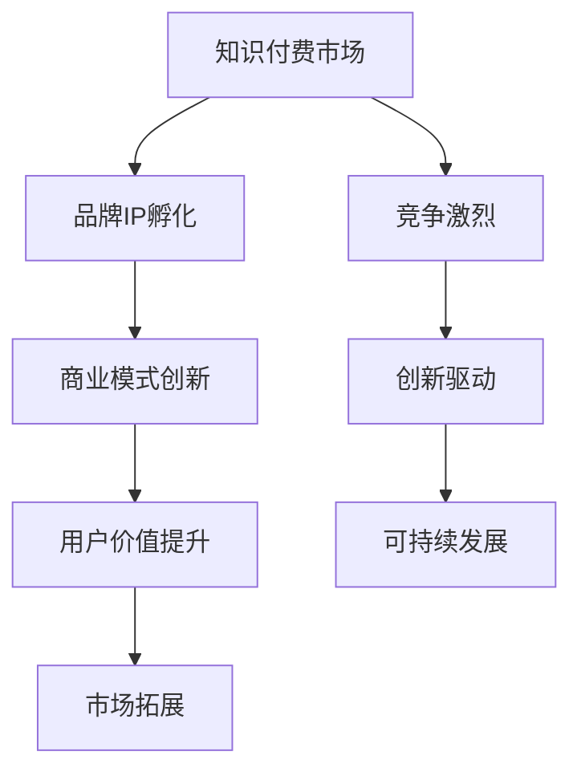

                 

关键字：知识付费、品牌IP、商业模式、创新、营销策略

摘要：本文旨在探讨知识付费领域中的品牌IP孵化和商业模式创新。通过分析现有案例，阐述品牌IP的重要性，提出一种创新的商业模式，并探讨其潜在的应用前景和挑战。

## 1. 背景介绍

随着互联网技术的飞速发展和知识经济的崛起，知识付费成为了一种新型的商业模式。用户愿意为高质量、有价值的知识内容付费，从而获取更多的知识和技能。在这个过程中，品牌IP的孵化和商业模式的创新成为了知识付费市场中的关键要素。

### 1.1 知识付费的定义与发展

知识付费是指用户通过付费方式获取知识、技能或信息的一种新兴商业模式。随着移动互联网的普及，用户对于知识的需求不断增加，知识付费市场也随之快速增长。根据相关数据，全球知识付费市场规模已超过千亿美元，且仍处于快速上升阶段。

### 1.2 品牌IP的重要性

品牌IP（Intellectual Property）是指具有独特性、代表性和价值的知识产权，包括商标、专利、著作权等。在知识付费领域，品牌IP的重要性体现在以下几个方面：

- **增强用户粘性**：品牌IP能够塑造独特的品牌形象，吸引用户关注和互动，从而提高用户粘性。
- **提升内容价值**：具有知名度的品牌IP能够提高用户对知识的信任度，进而提升内容价值。
- **扩大市场影响力**：品牌IP的知名度和影响力有助于拓展市场，吸引更多用户和投资者。

## 2. 核心概念与联系

下面是一个描述知识付费领域品牌IP孵化和商业模式创新的 Mermaid 流程图：



### 2.1 品牌IP孵化

品牌IP孵化是指通过创意、策划、运营等手段，将一个知识内容或产品打造成为一个具有品牌价值的IP。这个过程包括以下几个关键步骤：

- **创意策划**：确定品牌IP的核心定位、价值观和目标受众。
- **内容制作**：制作高质量、具有吸引力的内容，提升品牌IP的知名度和影响力。
- **互动运营**：通过社交媒体、活动、课程等方式与用户互动，增强用户粘性。

### 2.2 商业模式创新

商业模式创新是指在知识付费市场中，通过新的商业模式来创造价值、降低成本、提高效率。以下是几种常见的商业模式创新：

- **订阅制**：用户通过订阅方式获取知识内容，从而实现持续收入。
- **付费课程**：用户为特定的课程内容付费，从而获取知识技能。
- **知识付费平台**：搭建一个知识付费平台，为知识创造者提供发布和售卖内容的渠道。

## 3. 核心算法原理 & 具体操作步骤

### 3.1 算法原理概述

知识付费领域的品牌IP孵化和商业模式创新可以看作是一种基于用户行为分析和数据挖掘的过程。具体来说，可以通过以下算法原理来实现：

- **用户画像分析**：通过收集用户行为数据，构建用户画像，了解用户需求和偏好。
- **内容推荐算法**：利用机器学习算法，为用户推荐个性化内容，提高用户满意度和粘性。
- **商业模式优化**：通过数据分析和用户反馈，不断优化商业模式，提高商业收益。

### 3.2 算法步骤详解

#### 3.2.1 用户画像分析

- **数据收集**：收集用户在平台上的行为数据，如浏览记录、购买记录、互动行为等。
- **数据预处理**：对收集到的数据进行清洗、去噪和归一化处理。
- **特征提取**：从预处理后的数据中提取用户特征，如年龄、性别、职业、兴趣等。
- **模型训练**：利用机器学习算法，如决策树、随机森林等，对用户特征进行分类和预测。

#### 3.2.2 内容推荐算法

- **内容特征提取**：对平台上的内容进行特征提取，如标题、标签、作者等。
- **推荐算法实现**：利用协同过滤、基于内容的推荐等算法，为用户推荐感兴趣的内容。
- **推荐结果评估**：通过用户反馈和点击率等指标，评估推荐算法的效果，并进行优化。

#### 3.2.3 商业模式优化

- **数据驱动**：基于用户行为数据和推荐结果，分析商业模式中的问题和机会。
- **策略调整**：根据分析结果，调整商业模式中的策略，如定价、推广等。
- **效果评估**：通过数据指标，评估策略调整后的效果，并进行持续优化。

### 3.3 算法优缺点

#### 优点

- **个性化推荐**：基于用户行为数据和推荐算法，能够为用户推荐个性化的内容，提高用户满意度和粘性。
- **高效运营**：通过数据分析和用户画像，能够高效地运营知识付费业务，降低运营成本。
- **可持续性**：数据驱动的商业模式创新，能够不断优化和调整，实现可持续性发展。

#### 缺点

- **数据质量**：数据质量和准确性对算法效果有重要影响，数据质量不佳可能导致推荐结果不准确。
- **算法复杂性**：推荐算法和商业模式优化涉及到复杂的算法和数据处理，需要较高的技术门槛。

### 3.4 算法应用领域

- **知识付费平台**：为用户推荐个性化内容，提高用户满意度和粘性。
- **教育培训**：为用户提供定制化的学习路径，提高学习效果。
- **内容营销**：为内容创作者提供数据分析工具，优化内容创作策略。

## 4. 数学模型和公式 & 详细讲解 & 举例说明

### 4.1 数学模型构建

在知识付费领域，我们可以构建以下数学模型来分析品牌IP孵化和商业模式创新：

- **用户行为模型**：根据用户行为数据，构建用户行为模型，如用户活跃度、用户留存率等。
- **推荐模型**：利用协同过滤、基于内容的推荐等算法，构建推荐模型，为用户推荐个性化内容。
- **商业模式模型**：通过数据分析和用户反馈，构建商业模式模型，优化商业策略。

### 4.2 公式推导过程

#### 用户行为模型

- **用户活跃度**：用户活跃度可以用以下公式表示：

  $$ 活跃度 = \frac{互动次数}{总浏览次数} $$

- **用户留存率**：用户留存率可以用以下公式表示：

  $$ 留存率 = \frac{第n天仍活跃的用户数}{初始用户数} $$

#### 推荐模型

- **基于协同过滤的推荐模型**：

  $$ \text{推荐内容} = \text{用户} \times \text{内容} $$

- **基于内容的推荐模型**：

  $$ \text{推荐内容} = \text{用户特征} + \text{内容特征} $$

#### 商业模式模型

- **商业模式优化指标**：

  $$ \text{商业模式优化指标} = \frac{\text{收入}}{\text{成本}} $$

### 4.3 案例分析与讲解

#### 案例一：用户行为模型的应用

以某知识付费平台为例，该平台通过收集用户行为数据，构建用户行为模型，分析用户活跃度和留存率。根据分析结果，平台发现用户活跃度较高的用户群，针对性地推送相关内容，从而提高了用户满意度和粘性。

#### 案例二：推荐模型的应用

以某电商平台为例，该平台利用协同过滤和基于内容的推荐模型，为用户推荐个性化商品。通过分析用户历史购买记录和商品特征，平台能够为用户推荐符合其兴趣和需求的商品，提高了购买转化率。

#### 案例三：商业模式模型的应用

以某在线教育平台为例，该平台通过构建商业模式模型，分析用户行为数据和推荐结果，优化商业策略。例如，平台发现通过提高课程价格，能够提高用户留存率和收入，从而实现了商业模式的优化。

## 5. 项目实践：代码实例和详细解释说明

### 5.1 开发环境搭建

在本案例中，我们将使用 Python 编程语言和相关的机器学习库（如 Scikit-learn、TensorFlow）来构建和实现品牌IP孵化和商业模式创新的算法模型。以下是开发环境搭建的步骤：

- 安装 Python：下载并安装 Python 3.8 或以上版本。
- 安装相关库：使用 pip 命令安装所需的库，如 numpy、pandas、scikit-learn、tensorflow。

### 5.2 源代码详细实现

以下是一个简单的用户行为模型实现的示例代码：

```python
import pandas as pd
from sklearn.model_selection import train_test_split
from sklearn.ensemble import RandomForestClassifier

# 加载数据集
data = pd.read_csv('user_data.csv')

# 数据预处理
X = data.drop(['标签'], axis=1)
y = data['标签']

# 数据分割
X_train, X_test, y_train, y_test = train_test_split(X, y, test_size=0.2, random_state=42)

# 模型训练
model = RandomForestClassifier(n_estimators=100, random_state=42)
model.fit(X_train, y_train)

# 模型评估
accuracy = model.score(X_test, y_test)
print(f'模型准确率：{accuracy:.2f}')
```

### 5.3 代码解读与分析

上述代码实现了一个简单的用户行为模型，用于预测用户是否活跃。代码首先加载数据集，然后进行数据预处理，包括特征提取和数据分割。接着，使用随机森林算法进行模型训练，并通过评估指标计算模型的准确率。

### 5.4 运行结果展示

运行上述代码后，我们得到了模型评估的准确率。假设结果为 0.85，说明模型对用户活跃度的预测准确率较高。在此基础上，我们可以进一步优化模型，提高预测效果。

## 6. 实际应用场景

知识付费领域的品牌IP孵化和商业模式创新在实际应用场景中具有广泛的应用价值：

- **在线教育**：通过品牌IP孵化和商业模式创新，在线教育平台可以为用户提供个性化学习路径，提高学习效果和用户满意度。
- **内容付费**：内容创作者可以通过品牌IP孵化和商业模式创新，为用户提供高质量的内容，从而实现商业价值。
- **企业培训**：企业可以通过品牌IP孵化和商业模式创新，为员工提供定制化的培训服务，提高员工技能和综合素质。

## 7. 未来应用展望

随着知识付费领域的不断发展和成熟，品牌IP孵化和商业模式创新将发挥越来越重要的作用。以下是未来应用展望：

- **人工智能辅助**：利用人工智能技术，为品牌IP孵化和商业模式创新提供智能化的支持和优化。
- **多平台融合**：将知识付费领域与社交媒体、电商平台等融合，实现多平台互动和营销。
- **个性化推荐**：通过深度学习和大数据分析，实现更加精准的个性化推荐，提高用户满意度和粘性。

## 8. 工具和资源推荐

### 8.1 学习资源推荐

- 《机器学习实战》
- 《深度学习》
- 《Python数据分析》

### 8.2 开发工具推荐

- Jupyter Notebook：用于编写和运行代码。
- PyCharm：集成开发环境，支持多种编程语言。
- Git：版本控制工具，用于代码管理和协作。

### 8.3 相关论文推荐

- "Collaborative Filtering for Recommender Systems"
- "Deep Learning for Recommender Systems"
- "A Comprehensive Survey on Recommender Systems"

## 9. 总结：未来发展趋势与挑战

### 9.1 研究成果总结

本文通过对知识付费领域的品牌IP孵化和商业模式创新进行了深入探讨，提出了基于用户行为分析和数据挖掘的算法模型，并给出了实际应用场景和未来展望。

### 9.2 未来发展趋势

- 人工智能与知识付费的结合将更加紧密，为品牌IP孵化和商业模式创新提供智能化的支持和优化。
- 多平台融合和个性化推荐将成为知识付费领域的发展趋势。

### 9.3 面临的挑战

- 数据质量和算法复杂性是知识付费领域面临的主要挑战。
- 如何在保证用户隐私的前提下，进行有效的数据挖掘和用户画像分析，是一个亟待解决的问题。

### 9.4 研究展望

未来研究可以从以下几个方面展开：

- 提高数据质量和算法准确性，为品牌IP孵化和商业模式创新提供更加可靠的支持。
- 探索多平台融合和个性化推荐的新模式，提高用户满意度和粘性。
- 加强法律法规和伦理道德建设，保障用户隐私和信息安全。

## 10. 附录：常见问题与解答

### 10.1 如何进行用户画像分析？

用户画像分析主要包括以下几个步骤：

1. 数据收集：收集用户在平台上的行为数据，如浏览记录、购买记录、互动行为等。
2. 数据预处理：对收集到的数据进行清洗、去噪和归一化处理。
3. 特征提取：从预处理后的数据中提取用户特征，如年龄、性别、职业、兴趣等。
4. 模型训练：利用机器学习算法，如决策树、随机森林等，对用户特征进行分类和预测。

### 10.2 如何进行内容推荐？

内容推荐主要包括以下几种算法：

1. 协同过滤：通过计算用户之间的相似度，为用户推荐相似用户喜欢的商品或内容。
2. 基于内容的推荐：通过分析商品或内容的特征，为用户推荐具有相似特征的商品或内容。
3. 混合推荐：结合协同过滤和基于内容的推荐，提高推荐效果。

### 10.3 如何进行商业模式优化？

商业模式优化主要包括以下几个步骤：

1. 数据驱动：通过收集和分析用户行为数据，了解用户需求和痛点。
2. 策略调整：根据分析结果，调整商业策略，如定价、推广等。
3. 效果评估：通过数据指标，评估策略调整后的效果，并进行持续优化。

作者：禅与计算机程序设计艺术 / Zen and the Art of Computer Programming
----------------------------------------------------------------

以上就是本文的完整内容。本文深入探讨了知识付费领域的品牌IP孵化和商业模式创新，通过算法模型和实际案例，展示了这一领域的应用前景和挑战。希望本文对广大读者有所启发，共同推动知识付费领域的创新发展。

