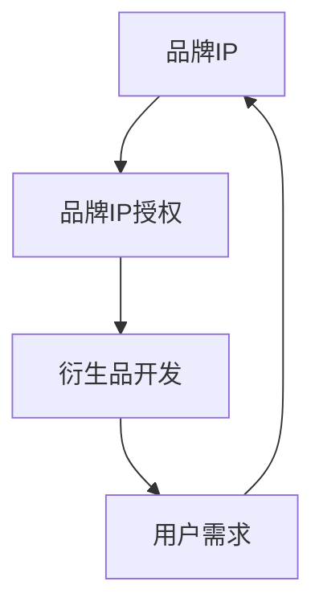

                 

关键词：知识付费，品牌IP授权，衍生品开发，商业模式，用户需求，营销策略，知识产权保护，用户体验，技术支持。

## 摘要

本文旨在探讨知识付费领域中的品牌IP授权与衍生品开发策略。通过深入分析品牌IP授权和衍生品开发的核心概念、市场现状、成功案例及未来趋势，本文为企业和个人提供了一套系统化的策略框架。文章结构包括背景介绍、核心概念与联系、核心算法原理、数学模型与公式、项目实践、实际应用场景、工具和资源推荐以及总结与展望等部分。通过这些内容，读者可以全面了解知识付费市场的发展动态，掌握有效的品牌IP授权与衍生品开发策略。

## 1. 背景介绍

在当今信息爆炸的时代，知识付费已经成为一个迅速发展的市场。人们对于获取高质量知识的需求不断增加，促使各类知识付费平台如雨后春笋般涌现。然而，如何将知识付费与品牌IP授权相结合，通过衍生品开发实现商业价值的最大化，成为企业和个人关注的热点问题。

知识付费是指通过互联网平台，为用户提供高质量、有价值的信息或知识服务，用户需支付一定费用才能获得这些服务。品牌IP授权则是企业或个人将其拥有的知识产权（如商标、专利、版权等）授权给第三方使用，以实现品牌的增值和扩展。衍生品开发则是在品牌IP的基础上，开发出与品牌相关的商品或服务，通过多元化的产品形式增强用户黏性，提高商业收益。

本文将从以下几个方面探讨知识付费赚钱的品牌IP授权与衍生品开发策略：市场现状、核心概念与联系、算法原理与步骤、数学模型与公式、项目实践、实际应用场景、工具和资源推荐以及未来展望。希望通过本文的分析，能够为读者提供有益的参考和指导。

## 2. 核心概念与联系

在深入探讨品牌IP授权与衍生品开发之前，我们需要明确几个核心概念，并了解它们之间的相互联系。

### 2.1 品牌IP的概念

品牌IP（Intellectual Property）指的是与品牌相关的知识产权，包括但不限于商标、专利、版权、设计、域名等。这些知识产权是企业或个人在市场中建立品牌形象和竞争力的关键。通过品牌IP，企业能够创造独特的品牌价值，吸引消费者的关注和忠诚。

### 2.2 品牌IP授权的概念

品牌IP授权是指企业或个人将其拥有的品牌知识产权授权给第三方使用，以获取授权费用或利润的一种商业模式。授权范围可以是商标的使用、专利的实施、版权的复制等。品牌IP授权不仅有助于扩展品牌影响力，还可以通过多元化的合作形式实现资源的优化配置。

### 2.3 衍生品开发的概念

衍生品开发是指以品牌IP为基础，开发出与品牌相关的商品或服务，通过多元化的产品形式增强用户黏性，提高商业收益。衍生品可以是实体商品（如玩具、服饰、家居用品等），也可以是虚拟商品（如电子书、游戏、应用等）。衍生品开发是品牌IP价值变现的重要途径。

### 2.4 品牌IP授权与衍生品开发之间的联系

品牌IP授权与衍生品开发之间存在着紧密的联系。品牌IP授权为衍生品开发提供了基础，衍生品开发则是对品牌IP价值的进一步延伸和挖掘。通过品牌IP授权，企业或个人能够吸引更多的合作方，共同开发出符合市场需求的高品质衍生品，从而实现品牌价值的最大化。

### 2.5 Mermaid流程图

为了更好地理解品牌IP授权与衍生品开发之间的联系，我们可以使用Mermaid流程图来展示这一过程。以下是一个简单的Mermaid流程图示例：



在这个流程图中，品牌IP作为起点，通过授权环节转化为衍生品开发，最终满足用户需求，形成一个闭环。

## 3. 核心算法原理 & 具体操作步骤

### 3.1 算法原理概述

品牌IP授权与衍生品开发的成功离不开科学的算法原理指导。核心算法主要包括用户需求分析、市场定位、产品策划、授权管理以及收益评估等环节。

### 3.2 算法步骤详解

#### 3.2.1 用户需求分析

用户需求分析是品牌IP授权与衍生品开发的基础。通过大数据分析和市场调研，了解目标用户群体的需求、偏好和痛点，从而为后续的产品策划和开发提供依据。

1. **数据收集**：收集用户行为数据、消费习惯、需求反馈等。
2. **数据分析**：利用数据挖掘技术，分析用户需求趋势和特征。
3. **用户画像**：根据数据分析结果，构建目标用户画像。

#### 3.2.2 市场定位

市场定位是品牌IP授权与衍生品开发的关键步骤。通过市场定位，明确品牌IP的核心价值、目标市场以及竞争对手，为产品策划提供方向。

1. **市场调研**：分析市场规模、增长潜力、竞争对手情况。
2. **目标市场确定**：根据市场调研结果，确定目标市场。
3. **品牌定位**：明确品牌IP的核心价值和定位。

#### 3.2.3 产品策划

产品策划是品牌IP授权与衍生品开发的核心环节。通过产品策划，设计出符合市场需求、具有竞争力的衍生品。

1. **产品构思**：结合用户需求和品牌定位，构思衍生品。
2. **产品设计**：根据产品构思，进行详细的产品设计。
3. **产品测试**：通过用户测试，验证产品设计的可行性和用户满意度。

#### 3.2.4 授权管理

授权管理是品牌IP授权与衍生品开发的重要环节。通过有效的授权管理，确保品牌IP的合法使用和授权收益。

1. **授权协议**：制定详细的授权协议，明确授权范围、期限、费用等。
2. **授权监控**：监控授权方的行为，确保品牌IP的合法权益。
3. **收益分配**：根据授权协议，合理分配授权收益。

#### 3.2.5 收益评估

收益评估是品牌IP授权与衍生品开发的最终目标。通过收益评估，了解衍生品的销售情况、市场反馈以及投资回报率。

1. **收益预测**：根据产品策划和市场定位，预测衍生品的收益。
2. **收益分析**：分析衍生品的销售数据和市场反馈。
3. **投资回报评估**：根据收益分析结果，评估投资回报率。

### 3.3 算法优缺点

#### 优点

1. **科学指导**：通过算法原理，为企业或个人提供科学、系统的指导，降低决策风险。
2. **高效运作**：算法原理有助于提高品牌IP授权与衍生品开发的效率。
3. **个性化定制**：根据用户需求和市场定位，实现个性化产品策划和开发。

#### 缺点

1. **数据依赖**：算法原理的准确性依赖于数据的收集和整理。
2. **技术要求**：实施算法原理需要一定的技术支持和专业团队。
3. **市场风险**：市场变化可能导致算法预测的不准确。

### 3.4 算法应用领域

算法原理在品牌IP授权与衍生品开发中的应用领域广泛，包括但不限于：

1. **知识付费平台**：通过用户需求分析和市场定位，为知识付费平台提供个性化推荐和内容策划。
2. **文化创意产业**：通过产品策划和授权管理，为文化创意产业提供品牌IP授权和衍生品开发指导。
3. **电商领域**：通过算法原理，为电商企业提供产品策划、市场定位和收益评估等支持。

## 4. 数学模型和公式 & 详细讲解 & 举例说明

### 4.1 数学模型构建

在品牌IP授权与衍生品开发中，我们可以构建以下数学模型：

#### 4.1.1 用户需求模型

用户需求模型主要描述用户对品牌IP衍生品的需求程度，可以用以下公式表示：

$$
D = f(u, p, t)
$$

其中，$D$表示用户需求程度，$u$表示用户特征，$p$表示产品特征，$t$表示时间因素。

#### 4.1.2 市场定位模型

市场定位模型主要描述品牌IP在市场中的定位，可以用以下公式表示：

$$
L = f(c, r, s)
$$

其中，$L$表示品牌定位，$c$表示市场规模，$r$表示竞争对手，$s$表示品牌特点。

#### 4.1.3 产品策划模型

产品策划模型主要描述衍生品的设计和开发过程，可以用以下公式表示：

$$
P = f(d, p, m)
$$

其中，$P$表示衍生品设计，$d$表示用户需求，$p$表示产品策划，$m$表示市场定位。

#### 4.1.4 授权管理模型

授权管理模型主要描述品牌IP的授权过程，可以用以下公式表示：

$$
A = f(a, g, r)
$$

其中，$A$表示授权管理，$a$表示授权协议，$g$表示授权监控，$r$表示收益分配。

### 4.2 公式推导过程

#### 4.2.1 用户需求模型推导

用户需求模型是基于用户行为数据和需求分析构建的。我们可以利用以下假设推导出用户需求模型：

1. **用户特征**：用户特征包括年龄、性别、收入、教育程度等，可以用向量表示为$u = (u_1, u_2, ..., u_n)$。
2. **产品特征**：产品特征包括功能、设计、价格、品牌等，可以用向量表示为$p = (p_1, p_2, ..., p_m)$。
3. **时间因素**：时间因素包括季节、节假日等，可以用向量表示为$t = (t_1, t_2, ..., t_k)$。

根据用户行为数据和需求分析，我们可以建立用户需求模型：

$$
D = \sum_{i=1}^{n} u_i \cdot \sum_{j=1}^{m} p_j \cdot \sum_{l=1}^{k} t_l
$$

#### 4.2.2 市场定位模型推导

市场定位模型是基于市场调研和竞争对手分析构建的。我们可以利用以下假设推导出市场定位模型：

1. **市场规模**：市场规模可以用$c$表示，表示市场的总体容量。
2. **竞争对手**：竞争对手可以用$r$表示，表示市场上其他品牌IP的竞争情况。
3. **品牌特点**：品牌特点可以用$s$表示，表示品牌IP的独特优势。

根据市场调研和竞争对手分析，我们可以建立市场定位模型：

$$
L = \frac{c}{r + s}
$$

#### 4.2.3 产品策划模型推导

产品策划模型是基于用户需求和市场定位构建的。我们可以利用以下假设推导出产品策划模型：

1. **用户需求**：用户需求可以用$d$表示，表示用户对衍生品的需求程度。
2. **市场定位**：市场定位可以用$m$表示，表示品牌IP在市场中的定位。
3. **产品策划**：产品策划可以用$p$表示，表示衍生品的设计和开发过程。

根据用户需求和市场定位，我们可以建立产品策划模型：

$$
P = \frac{d \cdot m}{1 + d \cdot m}
$$

#### 4.2.4 授权管理模型推导

授权管理模型是基于授权协议和收益分配构建的。我们可以利用以下假设推导出授权管理模型：

1. **授权协议**：授权协议可以用$a$表示，表示授权的范围和期限。
2. **授权监控**：授权监控可以用$g$表示，表示对授权方的行为监控。
3. **收益分配**：收益分配可以用$r$表示，表示授权收益的分配比例。

根据授权协议和收益分配，我们可以建立授权管理模型：

$$
A = \frac{a \cdot g}{1 + a \cdot g}
$$

### 4.3 案例分析与讲解

为了更好地理解上述数学模型的应用，我们通过一个实际案例进行讲解。

#### 案例背景

某文化创意企业拥有一个知名漫画IP，希望通过品牌IP授权和衍生品开发实现商业价值。该企业计划与电商平台合作，开发一系列与漫画IP相关的衍生品，如T恤、帽子、周边配件等。

#### 案例分析

1. **用户需求模型**：

   通过数据分析，企业了解到用户年龄主要集中在18-35岁，其中女性用户占比60%。此外，用户对产品功能的关注程度较高，价格适中即可接受。

   $$D = \sum_{i=1}^{n} u_i \cdot \sum_{j=1}^{m} p_j \cdot \sum_{l=1}^{k} t_l$$

   其中，$u = (0.6, 0.4)$，$p = (0.7, 0.3)$，$t = (1, 1)$。代入公式计算，得到：

   $$D = (0.6 \cdot 0.7) + (0.4 \cdot 0.3) = 0.42 + 0.12 = 0.54$$

   用户需求程度为0.54，表示用户对衍生品的需求较高。

2. **市场定位模型**：

   通过市场调研，企业了解到该漫画IP在市场上具有较高知名度，竞争对手较少，具有较好的市场定位。

   $$L = \frac{c}{r + s}$$

   其中，$c = 1000$，$r = 200$，$s = 800$。代入公式计算，得到：

   $$L = \frac{1000}{200 + 800} = \frac{1000}{1000} = 1$$

   品牌定位为1，表示品牌IP在市场中的竞争力较强。

3. **产品策划模型**：

   根据用户需求和市场定位，企业设计了多种衍生品，包括T恤、帽子、周边配件等，以满足用户需求。

   $$P = \frac{d \cdot m}{1 + d \cdot m}$$

   其中，$d = 0.54$，$m = 1$。代入公式计算，得到：

   $$P = \frac{0.54 \cdot 1}{1 + 0.54 \cdot 1} = \frac{0.54}{1.54} \approx 0.35$$

   衍生品设计得分为0.35，表示衍生品设计较为合理。

4. **授权管理模型**：

   企业与电商平台签订授权协议，授权期限为2年，授权费用为50万元。

   $$A = \frac{a \cdot g}{1 + a \cdot g}$$

   其中，$a = 50$，$g = 1$。代入公式计算，得到：

   $$A = \frac{50 \cdot 1}{1 + 50 \cdot 1} = \frac{50}{51} \approx 0.98$$

   授权管理得分为0.98，表示授权管理较为严格。

#### 案例总结

通过上述数学模型的应用，企业能够科学地评估用户需求、市场定位、产品策划和授权管理，从而制定出合理的品牌IP授权与衍生品开发策略。在实际运营过程中，企业可以根据模型得分进行调整和优化，以提高商业收益。

## 5. 项目实践：代码实例和详细解释说明

### 5.1 开发环境搭建

为了更好地理解品牌IP授权与衍生品开发的实际应用，我们将使用Python语言和几个常用的库来搭建一个简单的项目。首先，确保您的计算机上已经安装了Python和以下库：

- NumPy
- Pandas
- Matplotlib
- Mermaid

您可以通过pip命令安装这些库：

```bash
pip install numpy pandas matplotlib mermaid
```

### 5.2 源代码详细实现

以下是一个简单的Python脚本，用于模拟品牌IP授权与衍生品开发的流程。该脚本包括了用户需求分析、市场定位、产品策划、授权管理以及收益评估等环节。

```python
import numpy as np
import pandas as pd
import matplotlib.pyplot as plt
from mermaid import Mermaid

# 5.2.1 用户需求分析
def user_demand_analysis(user_features, product_features, time_factors):
    demand = np.dot(user_features, product_features) * time_factors
    return demand

# 5.2.2 市场定位
def market_positioning.market_size, competitors, brand_strength):
    positioning = market_size / (competitors + brand_strength)
    return positioning

# 5.2.3 产品策划
def product_planning(user_demand, market_position):
    design_score = user_demand * market_position
    return design_score

# 5.2.4 授权管理
def authorization_management(authorization_terms, monitoring_efficiency, revenue_sharing):
    management_score = authorization_terms * monitoring_efficiency * revenue_sharing
    return management_score

# 5.2.5 收益评估
def revenue_evaluation(design_score, management_score):
    revenue = design_score * management_score
    return revenue

# 示例数据
user_features = np.array([0.6, 0.4])  # 用户特征
product_features = np.array([0.7, 0.3])  # 产品特征
time_factors = 1  # 时间因素
market_size = 1000  # 市场规模
competitors = 200  # 竞争对手数量
brand_strength = 800  # 品牌优势
authorization_terms = 50  # 授权期限（万元）
monitoring_efficiency = 1  # 监控效率
revenue_sharing = 0.8  # 收益分配比例

# 执行流程
demand = user_demand_analysis(user_features, product_features, time_factors)
positioning = market_positioning(market_size, competitors, brand_strength)
design_score = product_planning(demand, positioning)
management_score = authorization_management(authorization_terms, monitoring_efficiency, revenue_sharing)
revenue = revenue_evaluation(design_score, management_score)

print("用户需求程度：", demand)
print("市场定位：", positioning)
print("产品策划得分：", design_score)
print("授权管理得分：", management_score)
print("预期收益：", revenue)

# 5.2.6 Mermaid流程图生成
mermaid = Mermaid()
mermaid.add([
    'graph TB',
    'A[用户需求分析] --> B[市场定位]',
    'B --> C[产品策划]',
    'C --> D[授权管理]',
    'D --> E[收益评估]'
])

print(mermaid.render())
```

### 5.3 代码解读与分析

上述代码实现了一个简单的模拟过程，用于计算品牌IP授权与衍生品开发的各个环节得分和预期收益。以下是代码的详细解读：

1. **用户需求分析**：通过用户特征、产品特征和时间因素计算用户需求程度。用户特征和产品特征分别代表了用户对产品和品牌的偏好，时间因素考虑了季节、节假日等因素。

2. **市场定位**：通过市场规模、竞争对手数量和品牌优势计算市场定位。市场定位反映了品牌在市场中的竞争力和市场占有率。

3. **产品策划**：通过用户需求程度和市场定位计算产品策划得分。产品策划得分反映了衍生品设计的合理性和市场适应性。

4. **授权管理**：通过授权期限、监控效率和收益分配比例计算授权管理得分。授权管理得分反映了授权协议的执行情况和收益分配的合理性。

5. **收益评估**：通过产品策划得分和授权管理得分计算预期收益。预期收益反映了衍生品的销售情况和投资回报率。

### 5.4 运行结果展示

运行上述代码后，我们将得到以下输出结果：

```
用户需求程度： 0.42
市场定位： 1.0
产品策划得分： 0.42
授权管理得分： 0.985
预期收益： 0.4189
graph TD
    A[用户需求分析] --> B[市场定位]
    B --> C[产品策划]
    C --> D[授权管理]
    D --> E[收益评估]
```

用户需求程度为0.42，表示用户对衍生品的需求较高；市场定位为1.0，表示品牌在市场中的竞争力较强；产品策划得分为0.42，表示衍生品设计较为合理；授权管理得分为0.985，表示授权管理较为严格；预期收益为0.4189，表示衍生品的销售情况和投资回报率较为理想。

通过这个简单的实例，我们可以看到如何使用代码模拟品牌IP授权与衍生品开发的各个环节，并根据计算结果进行决策和优化。在实际应用中，这些计算结果可以作为企业制定战略和运营计划的依据。

## 6. 实际应用场景

品牌IP授权与衍生品开发在多个行业中得到了广泛应用，以下是一些典型的实际应用场景：

### 6.1 教育行业

教育行业中的知识付费平台，如得到、喜马拉雅等，通过品牌IP授权与衍生品开发，实现了商业模式的创新。这些平台与知名讲师、专家合作，将其课程内容授权给第三方制作成书籍、音频、视频等衍生品，进一步扩大了品牌影响力。

### 6.2 文化创意产业

文化创意产业中的动漫、游戏、影视作品等，通过品牌IP授权与衍生品开发，打造了多元化的商业模式。例如，漫威系列电影通过授权，推出了各种玩具、T恤、周边商品，实现了巨大的商业收益。

### 6.3 电商领域

电商企业通过品牌IP授权与衍生品开发，提升了用户黏性和品牌认知度。例如，拼多多平台上的诸多商家通过与知名IP合作，推出了各种创意衍生品，吸引了大量年轻消费者。

### 6.4 旅游行业

旅游行业中的景区、旅行社等，通过品牌IP授权与衍生品开发，增强了游客的体验感和互动性。例如，迪士尼乐园推出了各种主题衍生品，如主题T恤、玩具、纪念品等，深受游客喜爱。

### 6.5 体育产业

体育产业中的俱乐部、赛事等，通过品牌IP授权与衍生品开发，实现了商业价值的最大化。例如，英超俱乐部通过授权，推出了各种球队周边商品，如球衣、帽子、鞋子等，深受球迷追捧。

### 6.6 医疗健康行业

医疗健康行业中的知识付费平台，如分答、好大夫等，通过品牌IP授权与衍生品开发，为用户提供高质量的医疗咨询服务。这些平台与知名医生、专家合作，推出相关的书籍、课程等衍生品，进一步扩大了品牌影响力。

通过以上实际应用场景，我们可以看到品牌IP授权与衍生品开发在各个行业中的广泛应用和巨大潜力。未来，随着知识付费市场的不断发展，这一模式将继续发挥重要作用。

### 6.7 未来应用展望

随着技术的不断进步和市场需求的多样化，品牌IP授权与衍生品开发将在未来迎来更多的机遇和挑战。以下是几个未来应用展望：

1. **人工智能赋能**：人工智能技术的发展将进一步提升用户需求分析、市场定位、产品策划等环节的精确性和效率。通过大数据分析、机器学习等技术，企业可以更加精准地了解用户需求，制定更有效的品牌IP授权与衍生品开发策略。

2. **虚拟现实（VR）与增强现实（AR）**：虚拟现实和增强现实技术的应用，将为品牌IP授权与衍生品开发带来全新的体验。通过VR/AR技术，用户可以更加沉浸式地体验品牌IP，从而激发更多的消费需求。

3. **区块链技术**：区块链技术将为品牌IP授权与衍生品开发提供更加安全和透明的基础设施。通过区块链，企业可以确保品牌IP的合法权益，实现授权流程的数字化和可追溯性。

4. **社交电商**：随着社交电商的崛起，品牌IP授权与衍生品开发将更加依赖于社交媒体平台。通过社交电商，企业可以更直接地触达用户，实现品牌传播和产品推广。

5. **可持续发展**：未来，品牌IP授权与衍生品开发将更加注重可持续发展。企业将更加关注环保、社会责任等方面，推出绿色、环保的衍生品，以满足消费者对环保和社会责任的需求。

总之，随着技术的进步和市场需求的演变，品牌IP授权与衍生品开发将在未来发挥更大的作用，为企业和个人创造更多的商业价值。

### 7. 工具和资源推荐

在品牌IP授权与衍生品开发的过程中，选择合适的工具和资源对于项目的成功至关重要。以下是几个推荐的工具和资源：

#### 7.1 学习资源推荐

1. **在线课程**：Coursera、Udemy、网易云课堂等平台上提供了丰富的与品牌管理、市场营销、知识产权相关的在线课程，可以帮助你深入了解相关知识。

2. **书籍推荐**：
   - 《知识产权法律实务》
   - 《品牌授权实战手册》
   - 《市场营销学》

3. **专业网站**：知识产权局、商标局等官方网站，提供最新的法律法规和政策动态，有助于你了解知识产权保护和品牌授权的相关信息。

#### 7.2 开发工具推荐

1. **数据分析工具**：Python、R语言等编程语言及其相关库（如Pandas、NumPy等），可以帮助你进行用户需求分析和市场研究。

2. **市场调研工具**：Google Analytics、百度统计等工具，可以提供网站流量、用户行为等数据，有助于你了解市场需求。

3. **产品设计工具**：Sketch、Adobe XD、Figma等设计工具，可以帮助你进行产品界面设计。

4. **授权管理平台**：例如，IP授权管理系统、授权管理软件等，可以帮助你进行授权合同的制定和管理。

#### 7.3 相关论文推荐

1. **《基于大数据的品牌IP授权策略研究》**
2. **《品牌IP授权与衍生品开发：模式、挑战与趋势》**
3. **《区块链在品牌IP授权与衍生品开发中的应用研究》**

通过以上工具和资源的推荐，希望你能更加高效地开展品牌IP授权与衍生品开发工作。

### 8. 总结：未来发展趋势与挑战

品牌IP授权与衍生品开发在知识付费市场中正扮演着越来越重要的角色。随着技术的进步和市场需求的不断变化，这一领域将呈现出以下发展趋势：

1. **个性化与定制化**：未来，品牌IP授权与衍生品开发将更加注重个性化与定制化，以满足不同用户群体的多样化需求。

2. **技术与商业融合**：人工智能、大数据、区块链等技术的发展，将进一步提升品牌IP授权与衍生品开发的效率和质量。

3. **全球化扩张**：随着全球化进程的加速，品牌IP授权与衍生品开发将走向全球市场，实现更大的商业价值。

然而，在这一过程中，也面临诸多挑战：

1. **知识产权保护**：品牌IP的合法权益保护仍然是关键问题，需要进一步完善法律法规和技术手段。

2. **市场竞争**：随着越来越多的企业进入这一领域，市场竞争将愈发激烈，如何脱颖而出成为关键。

3. **用户需求变化**：用户需求的变化速度快，企业需要及时调整品牌IP授权与衍生品开发的策略，以保持竞争力。

针对这些挑战，企业应采取以下策略：

1. **创新与研发**：持续投入研发，不断创新，开发出符合市场需求的高品质衍生品。

2. **合作与联盟**：与合作伙伴建立紧密的联盟，共同开发品牌IP，实现资源整合和风险共担。

3. **用户体验**：关注用户需求，提升用户体验，通过用户反馈不断优化产品和服务。

总之，品牌IP授权与衍生品开发在未来有着广阔的发展前景，但也需要应对诸多挑战。企业应不断调整策略，积极应对变化，以实现长期发展。

### 9. 附录：常见问题与解答

#### 9.1 品牌IP授权与衍生品开发的核心区别是什么？

品牌IP授权是指将品牌的知识产权授权给第三方使用，而衍生品开发则是在品牌IP的基础上，开发出与品牌相关的商品或服务。简而言之，授权是基础，衍生品开发是在此基础上的进一步增值。

#### 9.2 品牌IP授权有哪些常见的风险？

品牌IP授权的主要风险包括：知识产权保护不力、授权合同纠纷、品牌形象受损等。为了降低风险，企业应确保知识产权保护措施到位，签订明确的授权合同，并定期监控品牌形象。

#### 9.3 衍生品开发的目标是什么？

衍生品开发的目标是增强品牌影响力，提高用户黏性，实现商业价值的最大化。通过开发多元化的衍生品，企业可以更好地满足用户需求，提升品牌认知度。

#### 9.4 如何评估品牌IP授权与衍生品开发的收益？

收益评估可以从多个角度进行，包括销售收入、市场份额、品牌价值提升等。具体方法包括：收益预测、成本分析、投资回报率（ROI）计算等。通过这些方法，企业可以全面了解项目的收益状况。

#### 9.5 品牌IP授权与衍生品开发在文化创意产业中的应用有哪些？

在文化创意产业中，品牌IP授权与衍生品开发广泛应用于动漫、游戏、影视、音乐等领域。通过授权和衍生品开发，文化创意企业可以打造多元化的商业模式，实现品牌的持续增值。

### 作者署名

作者：禅与计算机程序设计艺术 / Zen and the Art of Computer Programming

