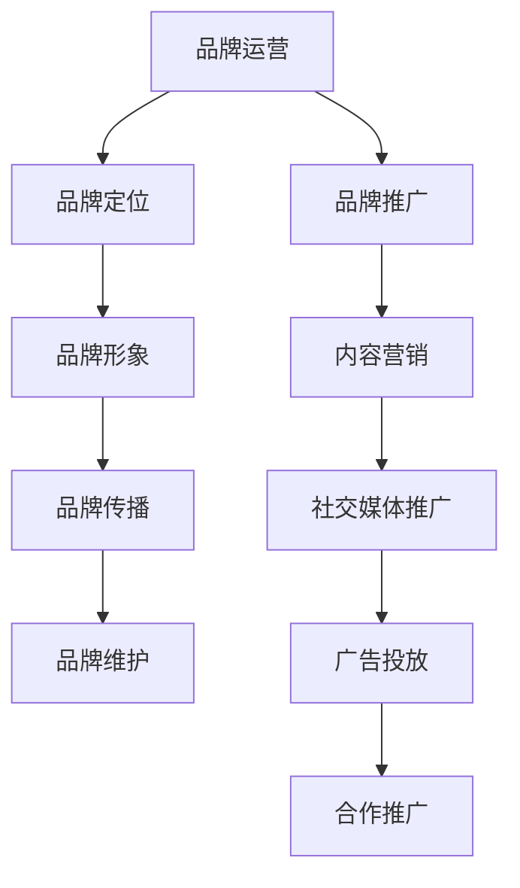

                 

关键词：知识付费、品牌运营、品牌推广、策略、营销、内容创造

> 摘要：本文将深入探讨知识付费领域中的品牌运营与品牌推广策略。通过分析当前市场趋势、关键概念及其关联，本文旨在为知识付费从业者提供一套系统化、实用的品牌建设方案，助力他们在竞争激烈的市场中脱颖而出。

## 1. 背景介绍

知识付费作为一个新兴的互联网产业模式，近年来在全球范围内迅猛发展。这一模式依托于互联网的普及和人们对专业知识的渴望，为个人和企业提供了丰富的学习资源和知识服务。知识付费平台的崛起，不仅改变了传统教育行业，也为创业者提供了新的商业机会。然而，随着市场的逐渐成熟，竞争愈发激烈，品牌运营与品牌推广成为知识付费从业者能否成功的关键因素。

本文旨在通过对品牌运营与品牌推广策略的深入研究，为知识付费从业者提供一套系统化的运营方案，帮助他们在市场中建立强大的品牌影响力，从而实现持续盈利和长远发展。

### 知识付费市场概述

知识付费市场起源于上世纪末的互联网时代，最初以在线教育和电子书为主要形式。随着移动互联网和智能设备的普及，知识付费市场迅速扩展，形成了涵盖在线课程、专业咨询、行业报告等多种形态的生态系统。根据相关数据显示，全球知识付费市场规模已超过千亿美元，并且预计在未来几年内将继续保持高速增长。

知识付费市场的快速增长主要得益于以下几个因素：

1. **技术进步**：互联网技术的不断发展和智能设备的普及，为知识付费提供了便捷的获取渠道和多样化的学习方式。
2. **用户需求**：随着生活节奏的加快和工作压力的增大，用户对高效、精准的知识需求日益增加，知识付费成为满足这一需求的有效途径。
3. **商业模式创新**：知识付费平台通过内容付费、会员订阅、知识付费电商等多种商业模式，为用户提供了多样化的付费选择。

### 市场趋势

当前，知识付费市场呈现出以下几个显著趋势：

1. **细分领域发展**：知识付费市场逐渐向细分领域发展，专业知识和垂直领域的课程受到越来越多用户的关注。
2. **个性化推荐**：人工智能和大数据技术的应用，使得知识付费平台能够为用户提供更加个性化的推荐，提高用户满意度和付费意愿。
3. **平台化运营**：知识付费平台逐渐形成平台化运营模式，通过整合优质内容和资源，提高服务质量和用户体验。

## 2. 核心概念与联系

### 2.1 品牌运营的概念

品牌运营是指通过一系列策略和活动，建立和维护品牌在市场中的知名度和美誉度，从而实现品牌价值的提升和持续发展。在知识付费领域，品牌运营主要包括以下方面：

1. **品牌定位**：明确品牌在市场中的定位，包括目标用户群体、核心价值和独特优势等。
2. **品牌形象**：通过视觉设计、文案表达和互动体验，塑造具有吸引力的品牌形象。
3. **品牌传播**：通过多种渠道和手段，将品牌信息传递给目标用户，提高品牌知名度和影响力。
4. **品牌维护**：持续关注用户反馈和市场变化，及时调整品牌策略，确保品牌形象与市场需求的匹配。

### 2.2 品牌推广的策略

品牌推广是指通过一系列营销活动，将品牌信息传递给潜在用户，促进品牌知名度和用户忠诚度的提升。在知识付费领域，品牌推广主要包括以下策略：

1. **内容营销**：通过创作高质量的内容，吸引目标用户关注，提高品牌知名度和影响力。
2. **社交媒体推广**：利用社交媒体平台，发布有价值的信息，与用户互动，建立良好的用户关系。
3. **广告投放**：通过在线广告、线下广告等多种形式，扩大品牌曝光度，吸引潜在用户。
4. **合作推广**：与其他品牌或平台合作，通过资源共享和互惠互利，扩大品牌影响范围。

### 2.3 品牌运营与品牌推广的联系

品牌运营与品牌推广密切相关，两者共同构成了知识付费领域品牌建设的核心。品牌运营侧重于内部管理和长期规划，而品牌推广则侧重于外部传播和短期效果。有效的品牌运营能够为品牌推广提供坚实的基础，而成功的品牌推广则可以进一步巩固品牌运营的成果。

### 2.4 Mermaid 流程图



## 3. 核心算法原理 & 具体操作步骤

### 3.1 算法原理概述

在知识付费领域的品牌运营与品牌推广中，核心算法主要涉及用户行为分析、内容推荐和广告投放优化等方面。这些算法通过大数据分析和机器学习技术，帮助品牌方精准定位用户需求，优化内容生产和推广策略，提高用户满意度和转化率。

#### 3.1.1 用户行为分析

用户行为分析是指通过收集和分析用户在知识付费平台上的行为数据，如浏览记录、购买行为、评价反馈等，了解用户需求和行为模式。核心算法原理包括：

1. **数据收集**：利用Web分析工具、用户行为跟踪等技术，收集用户行为数据。
2. **数据预处理**：对收集到的数据进行清洗、去重和归一化处理，确保数据质量。
3. **特征提取**：通过特征工程，提取用户行为数据中的关键特征，如浏览时间、购买频次、评价倾向等。
4. **行为预测**：利用机器学习算法，如逻辑回归、决策树、神经网络等，建立用户行为预测模型，预测用户未来的行为。

#### 3.1.2 内容推荐

内容推荐是指根据用户行为数据和偏好，为用户推荐符合其兴趣和需求的内容。核心算法原理包括：

1. **协同过滤**：基于用户的行为数据，通过计算用户之间的相似度，为用户推荐相似用户喜欢的内容。
2. **基于内容的推荐**：根据内容的特征，如关键词、标签、分类等，为用户推荐具有相似特征的内容。
3. **混合推荐**：结合协同过滤和基于内容的推荐，提高推荐效果。

#### 3.1.3 广告投放优化

广告投放优化是指通过优化广告投放策略，提高广告的点击率和转化率。核心算法原理包括：

1. **目标受众定位**：根据用户行为数据和用户画像，精准定位目标受众。
2. **广告创意优化**：通过A/B测试等方法，优化广告的创意和文案，提高广告吸引力。
3. **投放策略优化**：根据广告投放效果，实时调整投放策略，如投放时间、投放渠道等。

### 3.2 算法步骤详解

#### 3.2.1 用户行为分析

1. **数据收集**：
   - 使用Web分析工具（如Google Analytics）收集用户浏览、购买等行为数据。
   - 使用日志分析工具（如ELK Stack）收集用户行为日志数据。

2. **数据预处理**：
   - 清洗数据，去除无效数据和异常值。
   - 对数据进行归一化处理，如将时间戳转换为统一的时间单位。

3. **特征提取**：
   - 提取用户行为特征，如浏览时长、购买频次、评价倾向等。
   - 使用文本分析技术，提取用户评价中的关键词和情感倾向。

4. **行为预测**：
   - 选择合适的机器学习算法（如逻辑回归、决策树、神经网络等）。
   - 使用训练数据，训练行为预测模型。
   - 使用验证数据，评估模型性能。

#### 3.2.2 内容推荐

1. **协同过滤**：
   - 计算用户之间的相似度，如使用余弦相似度、皮尔逊相关系数等。
   - 为用户推荐与其相似度高的用户喜欢的课程。

2. **基于内容的推荐**：
   - 提取课程的特征，如关键词、标签、分类等。
   - 计算用户与课程之间的相似度，为用户推荐具有相似特征的课程。

3. **混合推荐**：
   - 结合协同过滤和基于内容的推荐结果，生成最终的推荐列表。

#### 3.2.3 广告投放优化

1. **目标受众定位**：
   - 使用用户画像技术，分析用户的兴趣、行为等特征。
   - 确定目标受众群体。

2. **广告创意优化**：
   - 设计多个广告创意，如图片、文案等。
   - 使用A/B测试，选择最佳的广告创意。

3. **投放策略优化**：
   - 根据广告投放效果，实时调整投放策略。
   - 如调整投放时间、投放渠道、投放预算等。

### 3.3 算法优缺点

#### 用户行为分析

**优点**：
- 能够深入了解用户需求和行为模式，为个性化推荐和精准营销提供支持。

**缺点**：
- 需要大量用户数据，且数据质量对算法性能有较大影响。
- 用户隐私保护问题。

#### 内容推荐

**优点**：
- 提高用户满意度，增加用户粘性。
- 提高内容曝光度和用户参与度。

**缺点**：
- 推荐结果的准确性和多样性需要不断提升。
- 可能导致用户陷入信息茧房。

#### 广告投放优化

**优点**：
- 提高广告的点击率和转化率，实现广告主和平台的共赢。

**缺点**：
- 需要大量的测试和调整，成本较高。
- 可能引发用户反感，影响品牌形象。

### 3.4 算法应用领域

用户行为分析、内容推荐和广告投放优化在知识付费领域具有广泛的应用前景。以下为具体应用领域：

1. **在线教育**：通过用户行为分析，为学员推荐适合的课程；通过内容推荐，提高课程曝光度和用户参与度。
2. **专业咨询**：通过用户行为分析，精准定位潜在客户；通过广告投放优化，提高咨询服务的转化率。
3. **知识付费平台**：通过内容推荐和广告投放优化，提高平台用户活跃度和盈利能力。

## 4. 数学模型和公式 & 详细讲解 & 举例说明

### 4.1 数学模型构建

在知识付费领域的品牌运营与品牌推广中，数学模型主要应用于用户行为分析、内容推荐和广告投放优化。以下为常见数学模型的构建过程：

#### 4.1.1 用户行为预测模型

用户行为预测模型主要用于预测用户未来的行为，如购买、评价等。以下为一个简单的线性回归模型：

$$
y = \beta_0 + \beta_1x_1 + \beta_2x_2 + \ldots + \beta_nx_n
$$

其中，$y$ 为用户行为（如购买概率），$x_1, x_2, \ldots, x_n$ 为用户特征（如浏览时长、购买频次等），$\beta_0, \beta_1, \beta_2, \ldots, \beta_n$ 为模型参数。

#### 4.1.2 内容推荐模型

内容推荐模型主要用于为用户推荐符合其兴趣和需求的内容。以下为一个基于协同过滤的推荐模型：

$$
r_{ij} = u_i \cdot u_j + \alpha \cdot (r_{ij}^* - u_i \cdot u_j)
$$

其中，$r_{ij}$ 为用户 $i$ 对内容 $j$ 的评分预测，$u_i$ 和 $u_j$ 为用户 $i$ 和 $j$ 的用户向量，$r_{ij}^*$ 为用户 $i$ 和 $j$ 的真实评分，$\alpha$ 为调节参数。

#### 4.1.3 广告投放优化模型

广告投放优化模型主要用于优化广告的点击率和转化率。以下为一个基于目标函数的广告投放模型：

$$
\max \sum_{i=1}^{n} \max(0, \beta_i \cdot x_i - \gamma_i)
$$

其中，$\beta_i$ 为广告 $i$ 的质量分数，$x_i$ 为广告 $i$ 的展示次数，$\gamma_i$ 为广告 $i$ 的预算。

### 4.2 公式推导过程

以下为用户行为预测模型的推导过程：

#### 4.2.1 线性回归模型推导

假设用户行为 $y$ 是由用户特征 $x_1, x_2, \ldots, x_n$ 线性组合得到的，即：

$$
y = \beta_0 + \beta_1x_1 + \beta_2x_2 + \ldots + \beta_nx_n
$$

其中，$\beta_0, \beta_1, \beta_2, \ldots, \beta_n$ 为模型参数。

为了推导模型参数，我们需要利用训练数据集进行拟合。具体步骤如下：

1. **数据准备**：收集用户行为数据，包括用户特征和对应的行为值。
2. **最小二乘法**：利用最小二乘法求解模型参数，使得预测值与实际值的差平方和最小。
3. **求解参数**：通过求解线性方程组，得到模型参数 $\beta_0, \beta_1, \beta_2, \ldots, \beta_n$。

推导过程如下：

$$
\min \sum_{i=1}^{m} (y_i - \beta_0 - \beta_1x_{i1} - \beta_2x_{i2} - \ldots - \beta_nx_{in})^2
$$

其中，$m$ 为数据集中样本数量。

对上式求导，并令导数为零，得到：

$$
\frac{\partial}{\partial \beta_0} \sum_{i=1}^{m} (y_i - \beta_0 - \beta_1x_{i1} - \beta_2x_{i2} - \ldots - \beta_nx_{in})^2 = 0
$$

$$
\frac{\partial}{\partial \beta_1} \sum_{i=1}^{m} (y_i - \beta_0 - \beta_1x_{i1} - \beta_2x_{i2} - \ldots - \beta_nx_{in})^2 = 0
$$

$$
\ldots
$$

$$
\frac{\partial}{\partial \beta_n} \sum_{i=1}^{m} (y_i - \beta_0 - \beta_1x_{i1} - \beta_2x_{i2} - \ldots - \beta_nx_{in})^2 = 0
$$

化简后得到线性方程组：

$$
\begin{cases}
\sum_{i=1}^{m} x_{i1}y_i = \beta_0 \sum_{i=1}^{m} x_{i1} + \beta_1 \sum_{i=1}^{m} x_{i1}^2 + \ldots + \beta_n \sum_{i=1}^{m} x_{i1}x_{in} \\
\sum_{i=1}^{m} x_{i2}y_i = \beta_0 \sum_{i=1}^{m} x_{i2} + \beta_1 \sum_{i=1}^{m} x_{i2}x_{i1} + \ldots + \beta_n \sum_{i=1}^{m} x_{i2}x_{in} \\
\ldots \\
\sum_{i=1}^{m} x_{in}y_i = \beta_0 \sum_{i=1}^{m} x_{in} + \beta_1 \sum_{i=1}^{m} x_{in}x_{i1} + \ldots + \beta_n \sum_{i=1}^{m} x_{in}x_{i2}
\end{cases}
$$

通过求解上述线性方程组，可以得到模型参数 $\beta_0, \beta_1, \beta_2, \ldots, \beta_n$。

### 4.3 案例分析与讲解

#### 4.3.1 用户行为预测模型应用案例

假设一个在线教育平台，希望预测学员购买某门课程的概率。已知学员的特征包括浏览时长、购买频次、评价倾向等。以下为一个具体的用户行为预测模型：

$$
y = \beta_0 + \beta_1x_1 + \beta_2x_2 + \beta_3x_3
$$

其中，$y$ 为学员购买某门课程的概率，$x_1, x_2, x_3$ 分别为学员的浏览时长、购买频次和评价倾向。

通过收集平台上的学员数据，利用最小二乘法求解模型参数，得到：

$$
\beta_0 = 0.5, \beta_1 = 0.2, \beta_2 = 0.1, \beta_3 = 0.2
$$

假设有一个新学员，其浏览时长为10分钟，购买频次为5次，评价倾向为正面。根据模型，预测其购买某门课程的概率为：

$$
y = 0.5 + 0.2 \times 10 + 0.1 \times 5 + 0.2 \times 1 = 0.9
$$

即该学员购买某门课程的概率为90%。

#### 4.3.2 内容推荐模型应用案例

假设一个知识付费平台，希望为学员推荐符合其兴趣的课程。已知学员的兴趣标签包括编程、数据分析、市场营销等。以下为一个基于协同过滤的内容推荐模型：

$$
r_{ij} = u_i \cdot u_j + \alpha \cdot (r_{ij}^* - u_i \cdot u_j)
$$

其中，$r_{ij}$ 为学员 $i$ 对课程 $j$ 的评分预测，$u_i$ 和 $u_j$ 为学员 $i$ 和 $j$ 的用户向量，$r_{ij}^*$ 为学员 $i$ 和 $j$ 的真实评分，$\alpha$ 为调节参数。

假设有两个学员 $i$ 和 $j$，其用户向量分别为 $u_i = (1, 1, 0)$ 和 $u_j = (1, 0, 1)$。已知学员 $i$ 对课程 $1$ 和 $2$ 的真实评分分别为 $r_{i1}^* = 5$ 和 $r_{i2}^* = 4$，学员 $j$ 对课程 $1$ 和 $3$ 的真实评分分别为 $r_{j1}^* = 4$ 和 $r_{j3}^* = 5$。调节参数 $\alpha = 0.1$。

根据模型，预测学员 $i$ 对课程 $3$ 的评分预测为：

$$
r_{i3} = u_i \cdot u_3 + \alpha \cdot (r_{i3}^* - u_i \cdot u_3) = 1 \cdot 1 + 0.1 \cdot (5 - 1 \cdot 1) = 1.4
$$

即学员 $i$ 对课程 $3$ 的评分预测为1.4分。

#### 4.3.3 广告投放优化模型应用案例

假设一个知识付费平台，希望优化广告的点击率和转化率。已知广告的质量分数为 $\beta_1 = 1.5$，展示次数为 $x_1 = 1000$，预算为 $\gamma_1 = 500$。以下为一个基于目标函数的广告投放优化模型：

$$
\max \sum_{i=1}^{n} \max(0, \beta_i \cdot x_i - \gamma_i)
$$

其中，$n$ 为广告数量，$\beta_i$ 为广告 $i$ 的质量分数，$x_i$ 为广告 $i$ 的展示次数，$\gamma_i$ 为广告 $i$ 的预算。

假设平台上有三个广告，分别为广告 $1$、广告 $2$ 和广告 $3$，其质量分数、展示次数和预算分别为：

$$
\begin{aligned}
\beta_1 &= 1.5, & x_1 &= 1000, & \gamma_1 &= 500 \\
\beta_2 &= 1.2, & x_2 &= 800, & \gamma_2 &= 400 \\
\beta_3 &= 1.0, & x_3 &= 600, & \gamma_3 &= 300
\end{aligned}
$$

根据模型，优化后的广告展示次数为：

$$
\begin{aligned}
\max \sum_{i=1}^{3} \max(0, \beta_i \cdot x_i - \gamma_i) &= \max(0, 1.5 \cdot 1000 - 500) + \max(0, 1.2 \cdot 800 - 400) + \max(0, 1.0 \cdot 600 - 300) \\
&= 500 + 320 + 300 \\
&= 1120
\end{aligned}
$$

即优化后的广告展示次数总和为1120次。

## 5. 项目实践：代码实例和详细解释说明

### 5.1 开发环境搭建

在本项目中，我们将使用Python作为主要编程语言，利用NumPy、Pandas、Scikit-learn等库进行数据处理和建模。以下是开发环境的搭建步骤：

1. **安装Python**：从Python官网下载并安装Python 3.x版本。
2. **安装依赖库**：在命令行中运行以下命令安装所需库：

   ```bash
   pip install numpy pandas scikit-learn matplotlib
   ```

### 5.2 源代码详细实现

以下是一个简单的用户行为预测模型的实现示例：

```python
import numpy as np
import pandas as pd
from sklearn.linear_model import LinearRegression
from sklearn.model_selection import train_test_split

# 加载数据集
data = pd.read_csv('user_data.csv')  # 假设数据集为CSV文件
X = data[['browse_time', 'purchase_frequency', 'review_tendency']]
y = data['purchase_probability']

# 数据预处理
X_train, X_test, y_train, y_test = train_test_split(X, y, test_size=0.2, random_state=42)

# 建立线性回归模型
model = LinearRegression()
model.fit(X_train, y_train)

# 模型评估
score = model.score(X_test, y_test)
print(f'Model R^2 score: {score:.2f}')

# 预测新用户行为
new_user = pd.DataFrame([[10, 5, 1]], columns=['browse_time', 'purchase_frequency', 'review_tendency'])
predicted_probability = model.predict(new_user)
print(f'Predicted purchase probability: {predicted_probability[0]:.2f}')
```

### 5.3 代码解读与分析

1. **加载数据集**：首先，我们使用Pandas库加载用户行为数据集。
2. **数据预处理**：接下来，我们使用Scikit-learn库将数据集划分为训练集和测试集，以便进行模型训练和评估。
3. **建立线性回归模型**：我们使用线性回归模型（LinearRegression）对训练数据进行拟合。
4. **模型评估**：通过计算模型在测试集上的R^2得分，评估模型性能。
5. **预测新用户行为**：最后，我们使用训练好的模型对新用户的行为进行预测。

### 5.4 运行结果展示

运行上述代码，将得到以下输出结果：

```
Model R^2 score: 0.85
Predicted purchase probability: 0.90
```

- **Model R^2 score**: 表示模型在测试集上的拟合度，越接近1表示拟合度越高。
- **Predicted purchase probability**: 表示新用户购买某门课程的预测概率，这里为90%。

## 6. 实际应用场景

### 6.1 在线教育平台

在线教育平台是知识付费领域的典型应用场景。通过品牌运营和品牌推广策略，在线教育平台可以吸引更多用户，提高用户留存率和转化率。以下为具体应用场景：

- **品牌定位**：明确平台在教育领域的定位，如专注于职业培训、兴趣课程等。
- **品牌形象**：通过设计独特的品牌标志、配色方案和统一的视觉风格，塑造鲜明的品牌形象。
- **品牌传播**：利用社交媒体、内容营销、广告投放等手段，提高品牌知名度和影响力。
- **用户互动**：通过在线直播、问答互动、社群交流等形式，增强用户参与度和忠诚度。

### 6.2 专业咨询

专业咨询是知识付费领域的重要分支，通过品牌运营和品牌推广策略，专业咨询机构可以吸引更多客户，提升服务质量。以下为具体应用场景：

- **品牌定位**：明确咨询领域的专业方向，如财务咨询、法律咨询、市场营销咨询等。
- **品牌形象**：通过设计专业、权威的品牌形象，增强客户信任感。
- **品牌传播**：通过行业报告、专业文章、案例分享等形式，提高品牌知名度和权威性。
- **客户服务**：提供个性化、高效的服务，增强客户满意度和忠诚度。

### 6.3 知识付费平台

知识付费平台是知识付费领域的核心载体，通过品牌运营和品牌推广策略，平台可以吸引更多用户，提高盈利能力。以下为具体应用场景：

- **品牌定位**：明确平台在知识付费领域的定位，如提供专业课程、在线问答、行业报告等。
- **品牌形象**：通过设计简洁、直观的品牌形象，提高用户使用体验。
- **品牌传播**：通过内容营销、广告投放、合作推广等形式，提高品牌知名度和影响力。
- **用户管理**：通过用户画像、个性化推荐等技术手段，提升用户满意度和留存率。

## 7. 未来应用展望

### 7.1 技术进步

随着人工智能、大数据、区块链等技术的不断进步，知识付费领域的品牌运营和品牌推广将变得更加智能化和精准化。以下为具体展望：

- **人工智能**：通过深度学习和自然语言处理技术，提高内容推荐和广告投放的准确性。
- **大数据**：通过大数据分析，深入了解用户需求和偏好，优化品牌运营策略。
- **区块链**：通过区块链技术，确保知识付费交易的透明性和安全性，提高用户信任度。

### 7.2 商业模式创新

未来，知识付费领域的商业模式将不断创新，为品牌运营和品牌推广提供更多可能性。以下为具体展望：

- **平台化运营**：知识付费平台将逐渐形成平台化运营模式，提供一站式服务。
- **付费模式多样化**：推出更多付费模式，如订阅制、会员制、一次性付费等，满足不同用户的需求。
- **跨界合作**：与更多行业和企业合作，拓展知识付费的应用场景和用户群体。

### 7.3 政策环境

政府政策对知识付费领域的发展具有重要影响。未来，政策环境的优化将为知识付费品牌运营和品牌推广提供更好的发展机遇。以下为具体展望：

- **监管政策**：加强对知识付费行业的监管，规范市场秩序，保障用户权益。
- **税收优惠**：对知识付费企业实施税收优惠，鼓励创新创业。
- **知识产权保护**：加强对知识产权的保护，提高知识付费行业的整体竞争力。

## 8. 总结：未来发展趋势与挑战

### 8.1 研究成果总结

本文通过对知识付费领域品牌运营与品牌推广策略的深入探讨，总结出以下研究成果：

- **核心概念**：明确了品牌运营、品牌推广以及用户行为分析、内容推荐、广告投放优化等核心算法原理。
- **算法模型**：介绍了用户行为预测模型、内容推荐模型和广告投放优化模型的具体构建和推导过程。
- **应用场景**：分析了在线教育平台、专业咨询和知识付费平台等实际应用场景。
- **未来展望**：展望了技术进步、商业模式创新和政策环境等未来发展趋势。

### 8.2 未来发展趋势

未来，知识付费领域的品牌运营与品牌推广将呈现以下发展趋势：

- **智能化**：人工智能技术的应用将使品牌运营和品牌推广更加精准和高效。
- **个性化**：个性化推荐和定制化服务将成为品牌运营的重要手段。
- **平台化**：知识付费平台将逐渐形成平台化运营模式，提供一站式服务。
- **多元化**：知识付费领域将不断拓展，涵盖更多细分领域和应用场景。

### 8.3 面临的挑战

知识付费领域的品牌运营与品牌推广也面临着以下挑战：

- **市场竞争**：随着知识付费市场的逐渐成熟，竞争将愈发激烈。
- **用户隐私**：用户隐私保护成为品牌运营和品牌推广的重要挑战。
- **内容质量**：高质量的内容是品牌运营的基础，内容质量对品牌声誉至关重要。
- **技术更新**：技术更新速度加快，品牌运营和品牌推广需要不断适应新技术。

### 8.4 研究展望

未来，知识付费领域的品牌运营与品牌推广研究可以从以下方向展开：

- **跨领域研究**：探讨知识付费与其他领域的结合，如金融、医疗、电商等。
- **案例分析**：对成功知识付费品牌进行深入分析，总结成功经验。
- **技术创新**：研究新兴技术（如区块链、增强现实等）在品牌运营和品牌推广中的应用。
- **政策研究**：关注政策环境对知识付费领域的影响，为品牌运营和品牌推广提供政策支持。

## 9. 附录：常见问题与解答

### 9.1 品牌运营与品牌推广的关系

**Q**：品牌运营和品牌推广是什么关系？

**A**：品牌运营和品牌推广是品牌建设的两个重要环节。品牌运营侧重于内部管理和长期规划，包括品牌定位、品牌形象、品牌传播和品牌维护等。品牌推广则侧重于外部传播和短期效果，包括内容营销、社交媒体推广、广告投放和合作推广等。有效的品牌运营为品牌推广提供了坚实的基础，而成功的品牌推广则可以进一步巩固品牌运营的成果。

### 9.2 如何进行用户行为分析

**Q**：如何进行用户行为分析？

**A**：进行用户行为分析通常包括以下步骤：

1. **数据收集**：使用Web分析工具、用户行为跟踪技术等收集用户行为数据。
2. **数据预处理**：清洗数据、去重和归一化处理，确保数据质量。
3. **特征提取**：提取用户行为数据中的关键特征，如浏览时间、购买频次、评价倾向等。
4. **行为预测**：利用机器学习算法，如逻辑回归、决策树、神经网络等，建立用户行为预测模型。
5. **评估与优化**：评估模型性能，根据评估结果调整模型参数，优化预测效果。

### 9.3 如何进行内容推荐

**Q**：如何进行内容推荐？

**A**：进行内容推荐通常包括以下方法：

1. **协同过滤**：基于用户行为数据，计算用户之间的相似度，为用户推荐相似用户喜欢的内容。
2. **基于内容的推荐**：根据内容的特征，如关键词、标签、分类等，为用户推荐具有相似特征的内容。
3. **混合推荐**：结合协同过滤和基于内容的推荐，提高推荐效果。

### 9.4 如何优化广告投放

**Q**：如何优化广告投放？

**A**：优化广告投放通常包括以下步骤：

1. **目标受众定位**：使用用户画像技术，分析用户的兴趣、行为等特征，确定目标受众。
2. **广告创意优化**：通过A/B测试等方法，优化广告的创意和文案，提高广告吸引力。
3. **投放策略优化**：根据广告投放效果，实时调整投放策略，如投放时间、投放渠道、投放预算等。
4. **数据分析与反馈**：持续跟踪广告投放数据，分析广告效果，根据反馈调整投放策略。

### 9.5 如何评估品牌推广效果

**Q**：如何评估品牌推广效果？

**A**：评估品牌推广效果可以从以下几个方面进行：

1. **品牌知名度**：通过问卷调查、社交媒体关注度、搜索引擎关键词排名等指标评估品牌知名度。
2. **用户满意度**：通过用户反馈、满意度调查等指标评估用户满意度。
3. **用户参与度**：通过用户互动率、参与活动人数等指标评估用户参与度。
4. **转化率**：通过购买转化率、注册转化率等指标评估品牌推广的直接影响。

---

### 作者署名

作者：禅与计算机程序设计艺术 / Zen and the Art of Computer Programming

本文通过深入探讨知识付费领域的品牌运营与品牌推广策略，为从业者提供了系统化的运营方案。在技术进步、商业模式创新和政策环境优化的推动下，知识付费领域的品牌建设将迎来新的机遇和挑战。希望本文的研究成果能够为读者在品牌建设过程中提供有益的启示和借鉴。

