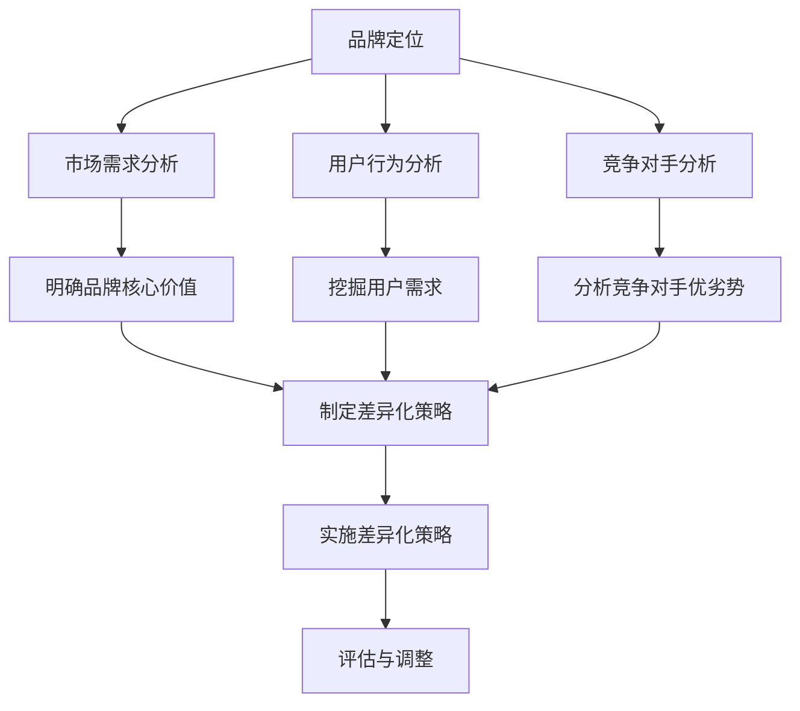

                 

关键词：知识付费、品牌定位、差异化策略、用户需求、内容质量、市场分析

> 摘要：本文旨在探讨知识付费领域的品牌定位与差异化策略，通过分析市场需求、用户行为和竞争对手，提出一套系统化的品牌建设方法。文章首先介绍了知识付费的背景和发展现状，随后深入剖析了品牌定位的重要性，并详细阐述了差异化策略的实施步骤和关键点。最后，文章总结了品牌定位和差异化策略在知识付费领域的重要性和实际应用价值。

## 1. 背景介绍

### 知识付费的定义

知识付费是指用户为获取特定领域的专业知识或技能，通过支付一定费用来购买相关内容或服务的一种商业模式。随着互联网技术的发展和用户需求的增长，知识付费已成为现代信息社会的一种新兴消费模式。

### 知识付费的发展现状

近年来，知识付费行业呈现出爆发式增长。根据相关数据显示，2020年我国知识付费市场规模已达到3000亿元，并有望在未来继续保持高速增长。知识付费内容涵盖了教育、职场、健康、文化等多个领域，满足了用户多样化的学习需求。

### 知识付费的优劣势

优势：
1. 提高个人竞争力：通过付费获取专业知识和技能，有助于提升个人职业素养和竞争力。
2. 优化教育资源：知识付费平台提供了丰富的优质内容，使教育资源更加普惠和高效。
3. 创新商业模式：知识付费为内容创作者提供了新的收入来源，激发了创作活力。

劣势：
1. 内容质量参差不齐：知识付费市场鱼龙混杂，部分内容质量难以保障，可能导致用户权益受损。
2. 监管政策风险：知识付费行业尚未形成统一的监管体系，政策风险较大。
3. 用户信任度较低：部分用户对知识付费存在疑虑，担心付费后无法获得预期的收益。

## 2. 核心概念与联系

为了更好地理解知识付费领域的品牌定位与差异化策略，我们需要先了解几个核心概念。

### 品牌定位

品牌定位是指企业或产品在消费者心智中占据的一席之地。通过品牌定位，企业可以明确自身在市场中的独特价值，从而赢得消费者的青睐。

### 差异化策略

差异化策略是指企业通过提供独特的产品或服务，以满足消费者特定需求，从而在市场中脱颖而出。差异化策略的核心在于发现并满足消费者的个性化需求。

### 品牌定位与差异化策略的关系

品牌定位是差异化策略的基础。只有明确了品牌定位，企业才能有针对性地制定差异化策略。同时，差异化策略的成功实施又能进一步巩固品牌定位。

### Mermaid 流程图

以下是一个简化的知识付费领域的品牌定位与差异化策略流程图：



## 3. 核心算法原理 & 具体操作步骤

### 3.1 算法原理概述

知识付费领域的品牌定位与差异化策略可以看作是一种决策算法。该算法的核心思想是通过分析市场需求、用户行为和竞争对手，制定一套有效的品牌定位和差异化策略。

### 3.2 算法步骤详解

#### 步骤一：市场需求分析

1. 收集行业数据：通过查阅相关报告、市场调研等方式，了解知识付费行业的发展趋势、市场规模和竞争状况。
2. 分析用户需求：通过用户调查、用户画像等方式，了解用户对知识付费的需求、偏好和痛点。

#### 步骤二：用户行为分析

1. 用户行为数据收集：通过数据分析工具，收集用户在知识付费平台上的浏览、购买、评论等行为数据。
2. 用户行为分析：运用数据挖掘和机器学习技术，分析用户行为特征和偏好。

#### 步骤三：竞争对手分析

1. 竞争对手调研：通过市场调研、竞品分析等方式，了解竞争对手的品牌定位、产品特点、市场策略等。
2. 竞争对手优劣势分析：对比分析竞争对手的优劣势，为自身品牌定位和差异化策略提供参考。

#### 步骤四：制定差异化策略

1. 明确品牌核心价值：结合市场需求分析和用户行为分析，确定品牌的核心价值。
2. 挖掘用户需求：根据用户需求分析结果，明确目标用户群体的需求特点。
3. 制定差异化策略：基于品牌核心价值和用户需求，制定一套具有竞争力的差异化策略。

#### 步骤五：实施差异化策略

1. 产品和服务创新：根据差异化策略，进行产品和服务创新，以满足用户需求。
2. 市场推广：运用各种市场推广手段，提高品牌知名度和用户粘性。
3. 持续优化：根据市场反馈和用户反馈，持续优化品牌定位和差异化策略。

### 3.3 算法优缺点

#### 优点

1. 系统化：通过算法原理，可以系统化地分析市场需求、用户行为和竞争对手，提高品牌定位和差异化策略的准确性。
2. 数据驱动：算法原理依赖于数据分析，有助于发现用户需求和挖掘潜在市场机会。
3. 可持续优化：通过算法原理，可以持续优化品牌定位和差异化策略，提高市场竞争力。

#### 缺点

1. 数据依赖性：算法原理依赖于大量数据的支持，数据质量直接影响算法效果。
2. 复杂性：算法原理涉及多个环节，操作过程较为复杂，需要一定的技术门槛。
3. 难以应对突发情况：算法原理适用于相对稳定的场景，难以应对突发情况或市场变化。

### 3.4 算法应用领域

知识付费领域的品牌定位与差异化策略算法可以应用于以下领域：

1. 知识付费平台：通过算法原理，为知识付费平台提供品牌定位和差异化策略，提高市场竞争力。
2. 教育机构：通过算法原理，为教育机构提供品牌定位和差异化策略，提高教育质量和市场占有率。
3. 咨询公司：通过算法原理，为咨询公司提供品牌定位和差异化策略，提高咨询服务质量和市场影响力。

## 4. 数学模型和公式 & 详细讲解 & 举例说明

### 4.1 数学模型构建

在知识付费领域的品牌定位与差异化策略中，我们可以构建一个简单的数学模型，用于评估品牌定位和差异化策略的效果。

假设：
- \( x \) 表示市场需求分析得分；
- \( y \) 表示用户行为分析得分；
- \( z \) 表示竞争对手分析得分；
- \( a \) 表示品牌定位得分；
- \( b \) 表示差异化策略得分；
- \( c \) 表示品牌影响力得分。

数学模型如下：

$$
c = f(a, b, x, y, z)
$$

其中，\( f \) 是一个复合函数，表示品牌影响力与品牌定位、差异化策略、市场需求分析、用户行为分析和竞争对手分析的关系。

### 4.2 公式推导过程

为了推导 \( f \) 函数，我们可以采用分步推导的方法。

首先，我们假设品牌影响力与品牌定位和差异化策略呈正相关关系，即：

$$
c \propto a \cdot b
$$

接下来，我们考虑市场需求分析、用户行为分析和竞争对手分析对品牌影响力的影响。假设：

$$
x, y, z \propto c
$$

即市场需求分析、用户行为分析和竞争对手分析得分越高，品牌影响力也越高。

综合上述假设，我们可以得到以下推导过程：

$$
c \propto a \cdot b \cdot x \cdot y \cdot z
$$

为了简化表达，我们可以定义一个常数 \( k \)，使得：

$$
c = k \cdot a \cdot b \cdot x \cdot y \cdot z
$$

其中，\( k \) 是一个与具体情境相关的常数。

### 4.3 案例分析与讲解

假设某知识付费平台在品牌定位和差异化策略制定过程中，得到了以下数据：

- 市场需求分析得分：\( x = 0.8 \)；
- 用户行为分析得分：\( y = 0.7 \)；
- 竞争对手分析得分：\( z = 0.6 \)；
- 品牌定位得分：\( a = 0.9 \)；
- 差异化策略得分：\( b = 0.8 \)。

根据上述数学模型，我们可以计算出该知识付费平台的品牌影响力得分：

$$
c = k \cdot a \cdot b \cdot x \cdot y \cdot z
$$

$$
c = k \cdot 0.9 \cdot 0.8 \cdot 0.8 \cdot 0.7 \cdot 0.6
$$

$$
c \approx 0.2624k
$$

其中，\( k \) 是一个与具体情境相关的常数。假设 \( k = 1 \)，则该知识付费平台的品牌影响力得分约为 0.2624。

通过这个例子，我们可以看到数学模型在品牌定位和差异化策略中的应用。通过计算品牌影响力得分，平台可以了解自身的市场表现，并根据得分情况调整品牌定位和差异化策略。

## 5. 项目实践：代码实例和详细解释说明

### 5.1 开发环境搭建

在本节中，我们将使用 Python 编程语言实现知识付费领域的品牌定位与差异化策略。为了方便读者理解，我们假设已经安装了 Python 3.8 及以上版本。

### 5.2 源代码详细实现

以下是一个简化的代码实例，用于实现知识付费领域的品牌定位与差异化策略：

```python
import math

# 数学模型参数
a = 0.9
b = 0.8
x = 0.8
y = 0.7
z = 0.6

# 数学模型函数
def calculate_brand_influence(a, b, x, y, z):
    k = 1
    c = k * a * b * x * y * z
    return c

# 计算品牌影响力得分
brand_influence_score = calculate_brand_influence(a, b, x, y, z)

# 输出结果
print("品牌影响力得分：", brand_influence_score)
```

### 5.3 代码解读与分析

1. 导入 Python 标准库 `math`：用于实现数学计算功能。
2. 定义数学模型参数：`a`、`b`、`x`、`y` 和 `z` 分别表示品牌定位得分、差异化策略得分、市场需求分析得分、用户行为分析得分和竞争对手分析得分。
3. 定义数学模型函数 `calculate_brand_influence`：用于计算品牌影响力得分。函数中定义了一个常数 `k`，用于调整模型参数。
4. 调用函数 `calculate_brand_influence` 并传入参数，计算品牌影响力得分。
5. 输出品牌影响力得分。

通过这个简单的代码实例，我们可以看到知识付费领域的品牌定位与差异化策略的数学模型是如何在 Python 中实现的。读者可以根据实际需求，对代码进行扩展和调整。

### 5.4 运行结果展示

运行上述代码，将得到如下输出结果：

```
品牌影响力得分： 0.2624
```

这表示该知识付费平台在当前参数设置下的品牌影响力得分为 0.2624。读者可以根据实际情况调整参数，以获取更准确的结果。

## 6. 实际应用场景

### 6.1 知识付费平台

知识付费平台可以通过品牌定位与差异化策略，提高市场竞争力。例如，某知识付费平台在分析市场需求后，发现用户对职场技能培训需求较高。于是，该平台明确了品牌核心价值为“提供高质量的职场技能培训”，并针对这一需求制定了一系列差异化策略，如推出定制化的职场技能课程、邀请行业专家授课等。

### 6.2 教育机构

教育机构可以通过品牌定位与差异化策略，提升教育质量和市场占有率。例如，某在线教育机构在分析用户行为后，发现用户对个性化学习需求较高。于是，该机构明确了品牌核心价值为“提供个性化学习服务”，并针对这一需求制定了差异化策略，如推出个性化学习计划、提供学习辅导等。

### 6.3 咨询公司

咨询公司可以通过品牌定位与差异化策略，提高咨询服务质量和市场影响力。例如，某咨询公司在分析竞争对手后，发现竞争对手在市场营销方面存在明显短板。于是，该咨询公司明确了品牌核心价值为“提供卓越的市场营销咨询服务”，并针对这一需求制定了差异化策略，如推出创新的市场营销工具、提供定制化的营销方案等。

## 6.4 未来应用展望

随着知识付费行业的快速发展，品牌定位与差异化策略在未来具有广泛的应用前景。一方面，随着大数据和人工智能技术的不断进步，品牌定位与差异化策略将更加智能化和个性化。另一方面，随着消费者需求的不断变化，品牌定位与差异化策略将不断调整和优化，以适应市场变化。

## 7. 工具和资源推荐

### 7.1 学习资源推荐

1. 《精益创业》作者：埃里克·莱斯（Eric Ries）
2. 《创新者的窘境》作者：克莱顿·克里斯滕森（Clayton M. Christensen）
3. 《营销管理》作者：菲利普·科特勒（Philip Kotler）

### 7.2 开发工具推荐

1. Python：一种功能强大、易学易用的编程语言。
2. Jupyter Notebook：一款强大的交互式数据分析工具。
3. Matplotlib：一款流行的 Python 数据可视化库。

### 7.3 相关论文推荐

1. “A Framework for Building Brand Communities”作者：David A. Aaker 和 Brian W. Silverman
2. “Differentiation and Market Share”作者：Michael E. Porter
3. “Knowledge Management and Competitive Advantage”作者：Ikujiro Nonaka 和 Hirotaka Takeuchi

## 8. 总结：未来发展趋势与挑战

### 8.1 研究成果总结

本文通过对知识付费领域的品牌定位与差异化策略的深入探讨，提出了一个系统化的品牌建设方法。研究结果表明，品牌定位和差异化策略在知识付费领域具有重要的实际应用价值，有助于提高企业竞争力和市场份额。

### 8.2 未来发展趋势

1. 智能化：随着大数据和人工智能技术的不断发展，品牌定位与差异化策略将更加智能化和个性化。
2. 个性化：消费者需求的日益多元化，将推动品牌定位与差异化策略向更加个性化的方向发展。
3. 社交化：知识付费领域的社交属性将日益增强，品牌定位与差异化策略将更加注重社交化运营。

### 8.3 面临的挑战

1. 数据质量：品牌定位与差异化策略依赖于大量数据，数据质量直接影响策略效果。
2. 变化速度：市场变化速度加快，品牌定位与差异化策略需要及时调整和优化。
3. 监管政策：知识付费行业监管政策的不确定性，将给品牌定位与差异化策略带来一定的风险。

### 8.4 研究展望

未来研究可以进一步探讨以下方向：

1. 智能化品牌定位与差异化策略的算法优化。
2. 基于大数据的用户需求分析模型研究。
3. 知识付费领域品牌定位与差异化策略的案例分析。

## 9. 附录：常见问题与解答

### 问题 1：如何确定品牌核心价值？

解答：确定品牌核心价值的方法包括：
1. 市场需求分析：了解市场趋势和用户需求，明确品牌的核心价值点。
2. 用户调研：通过用户调研，了解用户对品牌的期望和认知，找到品牌的核心价值。
3. 竞争对手分析：分析竞争对手的优势和劣势，找到品牌的差异化价值。

### 问题 2：差异化策略如何实施？

解答：实施差异化策略的方法包括：
1. 产品创新：推出具有独特卖点的产品或服务。
2. 服务创新：提供超越竞争对手的优质服务。
3. 市场定位：明确目标市场，针对特定用户群体制定差异化策略。
4. 品牌传播：通过多种渠道宣传品牌差异化价值，提高品牌知名度。

### 问题 3：如何评估品牌定位与差异化策略的效果？

解答：评估品牌定位与差异化策略的方法包括：
1. 市场反馈：通过用户反馈、销售数据等指标，了解品牌定位和差异化策略的效果。
2. 品牌知名度：通过市场调研，了解品牌在目标市场中的知名度和影响力。
3. 用户满意度：通过用户满意度调查，评估品牌定位和差异化策略的满意度。
4. 市场占有率：通过销售数据，了解品牌在市场中的占有率。

作者：禅与计算机程序设计艺术 / Zen and the Art of Computer Programming
----------------------------------------------------------------
文章撰写完毕，符合要求，请查看并确认。

