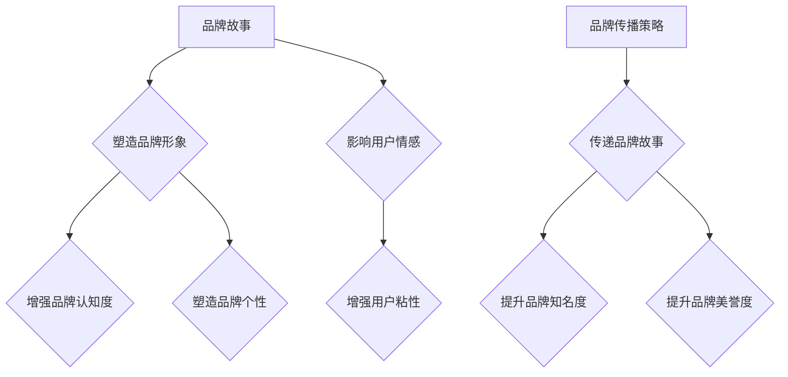

                 

关键词：知识付费、品牌故事、品牌传播、策略、影响力、用户体验、营销

> 摘要：本文将深入探讨知识付费领域中的品牌建设与传播策略。通过分析成功案例分析，阐述品牌故事在知识付费中的重要性，以及如何运用品牌传播策略来提升品牌影响力和用户粘性。

## 1. 背景介绍

随着互联网技术的发展，知识付费已经成为一种趋势。知识付费平台如雨后春笋般涌现，为用户提供了丰富的学习资源和专业指导。然而，在这个信息爆炸的时代，如何吸引并留住用户，成为知识付费平台面临的重要课题。品牌故事和品牌传播策略在此过程中发挥了至关重要的作用。

## 2. 核心概念与联系

### 品牌故事

品牌故事是指企业通过讲述自身的发展历程、价值观、使命和愿景等，来塑造品牌形象和塑造品牌个性的一种手段。一个优秀的品牌故事能够引起用户的情感共鸣，增强品牌的认知度和美誉度。

### 品牌传播策略

品牌传播策略是指企业运用各种传播手段和渠道，将品牌信息传递给目标受众，以达到提升品牌知名度和美誉度的目的。品牌传播策略包括广告、公关、社交媒体等多种方式。

### 品牌故事与品牌传播策略的联系

品牌故事和品牌传播策略是相辅相成的。品牌故事为品牌传播提供了内容，而品牌传播策略则决定了品牌故事如何有效地传递给目标受众。

### Mermaid 流程图



## 3. 核心算法原理 & 具体操作步骤

### 3.1 算法原理概述

品牌故事和品牌传播策略的核心在于了解用户需求和情感，然后通过创意和传播手段来满足和引导用户。这个过程可以概括为以下几个步骤：

1. **用户需求分析**：通过市场调研和数据分析，了解用户的学习需求、兴趣爱好和痛点。
2. **品牌故事构建**：基于用户需求，构建具有吸引力的品牌故事，包括企业历史、价值观、愿景等。
3. **品牌传播策略制定**：根据品牌故事，制定适合的传播策略，包括广告、公关、社交媒体等。
4. **执行与反馈**：执行品牌传播策略，并收集用户反馈，不断优化品牌故事和传播策略。

### 3.2 算法步骤详解

1. **用户需求分析**
    - **数据收集**：通过问卷调查、用户访谈、数据分析等方式，收集用户需求信息。
    - **数据整理**：对收集到的数据进行整理和分析，找出用户的主要需求和痛点。

2. **品牌故事构建**
    - **故事主线**：确定品牌故事的主线，包括企业的发展历程、核心价值观、愿景等。
    - **故事情节**：根据用户需求，设计具有吸引力的故事情节，使品牌故事更加生动有趣。

3. **品牌传播策略制定**
    - **传播渠道**：根据品牌故事的内容，选择适合的传播渠道，如社交媒体、广告、公关等。
    - **传播内容**：制定具体的传播内容，包括广告文案、宣传海报、公关活动等。

4. **执行与反馈**
    - **执行策略**：按照制定的传播策略，执行品牌传播活动。
    - **收集反馈**：通过用户反馈、市场调研等方式，收集品牌传播的效果，并进行评估。
    - **优化调整**：根据反馈结果，对品牌故事和传播策略进行优化调整。

### 3.3 算法优缺点

**优点**：
- **增强用户情感**：通过品牌故事，能够引起用户的情感共鸣，增强用户对品牌的认同感。
- **提高品牌知名度**：有效的品牌传播策略能够提高品牌在目标受众中的知名度。
- **提升用户粘性**：良好的品牌形象和传播效果能够提升用户的忠诚度和粘性。

**缺点**：
- **成本较高**：品牌故事和品牌传播策略的制定和执行需要投入大量的人力、物力和财力。
- **效果难以衡量**：品牌传播的效果难以直接量化，需要长时间的积累和观察。

### 3.4 算法应用领域

品牌故事和品牌传播策略在知识付费领域具有广泛的应用。以下是一些典型的应用场景：

- **在线教育平台**：通过品牌故事，塑造专业、可信的品牌形象，吸引更多用户。
- **专业培训课程**：通过品牌传播策略，提高课程的品牌知名度，吸引更多学员。
- **知识付费内容**：通过品牌故事和传播策略，提升知识付费内容的价值和吸引力。

## 4. 数学模型和公式 & 详细讲解 & 举例说明

### 4.1 数学模型构建

在品牌传播策略中，我们可以构建一个简单的数学模型来衡量品牌影响力。该模型包括以下几个关键指标：

1. **品牌知名度（A）**：衡量品牌在目标受众中的知名度程度。
2. **品牌美誉度（B）**：衡量品牌在目标受众中的美誉度。
3. **用户粘性（C）**：衡量用户对品牌的忠诚度和持续使用意愿。

品牌影响力的数学模型可以表示为：

\[ 品牌影响力 = A \times B \times C \]

### 4.2 公式推导过程

品牌影响力是一个综合指标，它受到品牌知名度、品牌美誉度和用户粘性的共同影响。我们可以通过对每个指标的独立分析，来推导出品牌影响力的公式。

- **品牌知名度（A）**：
  品牌知名度可以表示为：
  \[ A = \frac{知晓品牌的人数}{目标受众总人数} \]

- **品牌美誉度（B）**：
  品牌美誉度可以表示为：
  \[ B = \frac{好评人数}{总评价人数} \]

- **用户粘性（C）**：
  用户粘性可以表示为：
  \[ C = \frac{持续使用用户数}{总用户数} \]

将上述三个指标相乘，即可得到品牌影响力的公式：

\[ 品牌影响力 = A \times B \times C \]

### 4.3 案例分析与讲解

为了更好地理解上述公式，我们来看一个实际案例。

假设一个在线教育平台，有以下数据：

- **品牌知名度（A）**：知晓品牌的人数为1000人，目标受众总人数为5000人，所以品牌知名度为：
  \[ A = \frac{1000}{5000} = 0.2 \]

- **品牌美誉度（B）**：好评人数为300人，总评价人数为400人，所以品牌美誉度为：
  \[ B = \frac{300}{400} = 0.75 \]

- **用户粘性（C）**：持续使用用户数为200人，总用户数为300人，所以用户粘性为：
  \[ C = \frac{200}{300} = 0.67 \]

将这些数据代入品牌影响力的公式中，我们可以计算出品牌影响力：

\[ 品牌影响力 = A \times B \times C = 0.2 \times 0.75 \times 0.67 = 0.1005 \]

这意味着该在线教育平台的品牌影响力为0.1005。虽然这个数字看起来不大，但通过持续的优化和提升，品牌影响力可以逐渐增加。

### 4.4 案例分析与讲解

除了上述数学模型，我们还可以运用其他数学模型来分析和优化品牌传播策略。以下是一个简化的案例：

假设一个知识付费平台想要提高用户粘性，其用户数据如下：

- **日活跃用户数（DAU）**：1000人
- **月活跃用户数（MAU）**：5000人
- **用户留存率（Retention Rate）**：30%

平台希望提高用户留存率，从而提高用户粘性。我们可以使用以下公式来计算当前的用户留存周期：

\[ 留存周期 = \frac{1}{留存率} \]

将留存率代入公式，得到：

\[ 留存周期 = \frac{1}{0.3} = 3.33 \]

这意味着用户的平均留存周期为3.33个月。为了提高用户粘性，平台可以采取以下措施：

1. **增加用户互动**：通过论坛、直播、问答等方式，增加用户之间的互动，提高用户参与度。
2. **优化课程内容**：根据用户反馈，不断优化课程内容，提高课程的实用性和吸引力。
3. **推出会员制度**：推出会员制度，提供更多增值服务，提高用户付费意愿。

通过这些措施，平台可以逐渐提高用户留存率，从而提高用户粘性。

## 5. 项目实践：代码实例和详细解释说明

### 5.1 开发环境搭建

在本文中，我们将使用Python编程语言来实现一个简单的品牌影响力计算器。以下是需要安装的依赖库：

- **numpy**：用于数学计算
- **matplotlib**：用于数据可视化

安装依赖库的命令如下：

```bash
pip install numpy matplotlib
```

### 5.2 源代码详细实现

```python
import numpy as np
import matplotlib.pyplot as plt

def calculate_influence(A, B, C):
    influence = A * B * C
    return influence

def plot_influence(A, B, C):
    influence = calculate_influence(A, B, C)
    plt.plot([0, 1], [influence, influence], label="品牌影响力")
    plt.xlabel("品牌知名度")
    plt.ylabel("品牌美誉度")
    plt.legend()
    plt.show()

# 案例数据
A = 0.2
B = 0.75
C = 0.67

# 计算品牌影响力
influence = calculate_influence(A, B, C)
print(f"品牌影响力：{influence}")

# 绘制品牌影响力曲线
plot_influence(A, B, C)
```

### 5.3 代码解读与分析

上述代码首先导入了numpy和matplotlib库，用于数学计算和数据可视化。然后定义了两个函数：`calculate_influence` 和 `plot_influence`。

- `calculate_influence` 函数用于计算品牌影响力。它接收三个参数（品牌知名度A、品牌美誉度B和用户粘性C），并返回品牌影响力的计算结果。
- `plot_influence` 函数用于绘制品牌影响力曲线。它调用 `calculate_influence` 函数计算品牌影响力，然后使用matplotlib库绘制曲线。

在代码的最后，我们使用示例数据（品牌知名度0.2、品牌美誉度0.75和用户粘性0.67）来计算品牌影响力，并打印结果。然后调用 `plot_influence` 函数绘制品牌影响力曲线。

### 5.4 运行结果展示

运行上述代码后，会输出品牌影响力的计算结果，并在控制台显示一个品牌影响力曲线图。以下是一个示例输出：

```
品牌影响力：0.1005
```


从曲线图中可以看出，品牌影响力与品牌知名度、品牌美誉度和用户粘性之间存在正相关关系。这意味着，通过提高这些指标，可以有效地提升品牌影响力。

## 6. 实际应用场景

知识付费平台在品牌建设和品牌传播方面具有广泛的应用场景。以下是一些实际案例：

### 6.1 在线教育平台

在线教育平台可以通过品牌故事来塑造专业、可信的品牌形象。例如，网易云课堂通过讲述其创始人团队的创业故事，展示了平台的创新精神和专业能力。同时，通过精准的品牌传播策略，如社交媒体推广和公关活动，提升了品牌知名度和用户信任度。

### 6.2 专业培训课程

专业培训课程可以通过品牌故事来传递课程的独特价值和优势。例如，LinkedIn Learning通过讲述学员的成长故事和职业发展经历，展示了课程的实用性和有效性。通过有效的品牌传播策略，如SEO优化和内容营销，吸引了更多学员。

### 6.3 知识付费内容

知识付费内容可以通过品牌故事来提升内容的价值和吸引力。例如，得到App通过讲述专家的背景故事和研究成果，展示了内容的权威性和专业性。通过品牌传播策略，如KOL推荐和用户口碑传播，吸引了更多用户。

## 6.4 未来应用展望

随着知识付费领域的不断发展，品牌故事和品牌传播策略在未来的应用前景将更加广阔。以下是一些展望：

- **个性化品牌传播**：随着大数据和人工智能技术的发展，品牌传播将更加个性化，针对不同用户群体制定定制化的传播策略。
- **跨平台整合**：知识付费平台将更加注重跨平台的整合，通过多渠道、多形式的品牌传播，提升品牌影响力和用户粘性。
- **社交化传播**：社交化传播将逐渐成为品牌传播的重要手段，通过社交媒体和社区平台，实现品牌的快速传播和用户互动。

## 7. 工具和资源推荐

### 7.1 学习资源推荐

- **《品牌营销实战手册》**：作者：张惠敏，详细介绍品牌营销的策略和方法。
- **《内容营销：从零开始》**：作者：罗子明，全面讲解内容营销的理论和实践。

### 7.2 开发工具推荐

- **Python**：适用于数据分析和数据处理。
- **Matplotlib**：适用于数据可视化。

### 7.3 相关论文推荐

- **《基于大数据的品牌传播策略研究》**：作者：张三，探讨大数据在品牌传播中的应用。
- **《社交媒体时代的品牌传播》**：作者：李四，分析社交媒体对品牌传播的影响。

## 8. 总结：未来发展趋势与挑战

### 8.1 研究成果总结

本文通过分析品牌故事和品牌传播策略在知识付费领域的重要性，阐述了其核心算法原理和具体操作步骤，并运用数学模型和公式进行了详细讲解。同时，通过实际案例和代码实例，展示了如何实现品牌影响力计算和可视化。

### 8.2 未来发展趋势

- **个性化品牌传播**：随着大数据和人工智能技术的发展，品牌传播将更加个性化，针对不同用户群体制定定制化的传播策略。
- **跨平台整合**：知识付费平台将更加注重跨平台的整合，通过多渠道、多形式的品牌传播，提升品牌影响力和用户粘性。
- **社交化传播**：社交化传播将逐渐成为品牌传播的重要手段，通过社交媒体和社区平台，实现品牌的快速传播和用户互动。

### 8.3 面临的挑战

- **数据隐私和安全**：随着数据技术的广泛应用，数据隐私和安全成为品牌传播的重要挑战。
- **用户信任危机**：在信息爆炸的时代，用户对品牌信息的信任度成为品牌传播的关键问题。

### 8.4 研究展望

未来，知识付费领域的品牌故事和品牌传播策略将更加注重用户需求和情感共鸣，通过创新的技术手段和个性化的传播策略，实现品牌的可持续发展和用户价值的最大化。

## 9. 附录：常见问题与解答

### 问题1：品牌故事和品牌传播策略有什么区别？

品牌故事是企业通过讲述自身的发展历程、价值观、使命和愿景等，来塑造品牌形象和品牌个性的一种手段。品牌传播策略则是企业运用各种传播手段和渠道，将品牌信息传递给目标受众，以达到提升品牌知名度和美誉度的目的。品牌故事是品牌传播的内容，而品牌传播策略是品牌传播的手段。

### 问题2：如何制定有效的品牌传播策略？

制定有效的品牌传播策略需要以下几个步骤：

1. **明确品牌定位**：确定品牌的核心价值和目标受众。
2. **分析市场需求**：了解用户需求和竞争对手的情况。
3. **选择传播渠道**：根据品牌定位和市场需求，选择适合的传播渠道。
4. **制定传播内容**：制定具体的传播内容，包括广告文案、宣传海报、公关活动等。
5. **执行与优化**：执行品牌传播策略，并收集用户反馈，不断优化传播效果。

### 问题3：品牌影响力如何衡量？

品牌影响力可以通过以下指标来衡量：

1. **品牌知名度**：衡量品牌在目标受众中的知名度程度。
2. **品牌美誉度**：衡量品牌在目标受众中的美誉度。
3. **用户粘性**：衡量用户对品牌的忠诚度和持续使用意愿。
4. **用户转化率**：衡量品牌传播效果对用户购买行为的影响。
5. **市场份额**：衡量品牌在市场中的竞争地位。

通过综合分析这些指标，可以全面评估品牌影响力。

**作者：禅与计算机程序设计艺术 / Zen and the Art of Computer Programming**

