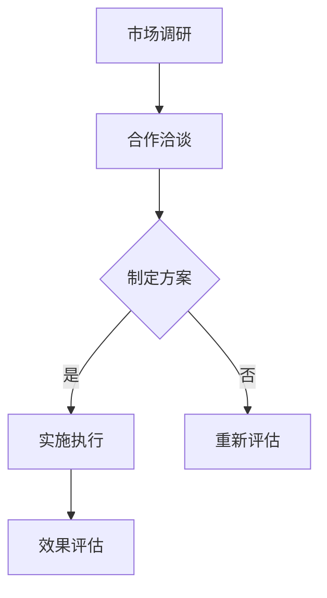

                 

关键词：知识付费、品牌联合推广、异业合作、营销策略、策略分析

> 摘要：本文旨在探讨知识付费领域的品牌联合推广与异业合作策略，分析其在当前市场环境下的必要性和优势。文章将详细阐述品牌联合推广的概念、实施步骤、异业合作的意义及其操作模式，并提供实际案例和未来发展趋势。

## 1. 背景介绍

随着互联网的快速发展，知识付费行业逐渐成为了一个热门的市场。知识付费，指的是用户通过支付一定的费用来获取特定领域的知识或技能。这类服务形式多样，包括在线课程、知识星球、专家问答等。知识付费的兴起，一方面反映了人们对知识获取的迫切需求，另一方面也揭示了市场对于高质量内容的高度认可。

在这样的大背景下，品牌联合推广和异业合作逐渐成为知识付费企业获取更多用户和市场份额的有效策略。品牌联合推广是指两个或多个品牌共同合作，通过资源共享、内容互补等方式，实现互利共赢的推广活动。异业合作则是指不同行业之间的企业通过合作，互相借力，共同开拓市场。这两种策略不仅能够扩大品牌影响力，还能够提升用户体验，增加用户粘性。

## 2. 核心概念与联系

### 2.1. 品牌联合推广

品牌联合推广的核心在于资源整合和优势互补。具体而言，它涉及以下几个关键环节：

#### 2.1.1. 合作选择

首先，知识付费企业需要选择与自身品牌形象、目标用户群体相匹配的品牌进行合作。这要求企业对市场有深刻的理解，能够识别出潜在的合作机会。

#### 2.1.2. 资源共享

合作双方需要共享各自的资源，如用户数据、营销渠道、内容制作能力等。通过资源整合，可以形成合力，提升市场竞争力。

#### 2.1.3. 内容互补

合作双方需要围绕共同的目标，打造互补的内容。例如，一个专注于编程教育的品牌可以与一个擅长写作的品牌合作，推出编程写作课程，满足用户在两个领域的需求。

#### 2.1.4. 营销推广

合作双方需要共同制定营销推广方案，通过线上线下多种渠道，提升品牌的曝光度和用户参与度。

### 2.2. 异业合作

异业合作则是将合作范围扩大到不同行业的企业。其核心在于通过跨行业合作，共同开发新产品或服务，开拓新市场。

#### 2.2.1. 合作模式

常见的异业合作模式包括以下几种：

1. **产品合作**：如知识付费平台与图书出版社合作，推出纸质书与在线课程组合。
2. **渠道合作**：如知识付费平台与线下教育机构合作，实现线上线下的流量互通。
3. **品牌联合**：如互联网企业与传统制造企业合作，推出智能硬件产品。

#### 2.2.2. 操作步骤

1. **市场调研**：了解不同行业的发展趋势和用户需求，为合作提供依据。
2. **合作洽谈**：与目标企业进行沟通，明确合作目的、方式和利益分配。
3. **方案制定**：根据合作目标和资源情况，制定详细的合作方案。
4. **实施执行**：按照既定方案，共同推进合作项目。
5. **效果评估**：合作结束后，对项目效果进行评估，为后续合作提供参考。

### 2.3. Mermaid 流程图



## 3. 核心算法原理 & 具体操作步骤

### 3.1. 算法原理概述

品牌联合推广与异业合作的算法原理基于协同效应，即通过资源整合和优势互补，实现1+1>2的效果。其核心在于：

1. **数据驱动**：利用大数据分析，精准匹配合作方，确保合作双方具备互补性。
2. **用户导向**：以用户需求为核心，设计合作内容，提升用户体验。
3. **风险管理**：通过合作前的风险评估，降低合作风险，确保合作顺利进行。

### 3.2. 算法步骤详解

1. **合作方选择**：基于用户数据和行业分析，选择目标用户群体高度重叠、资源互补的合作方。
2. **合作内容设计**：根据合作方的优势和用户需求，设计互补性的合作内容，如课程、活动、产品等。
3. **营销推广**：制定综合性的营销推广方案，利用多种渠道进行宣传，提升品牌曝光度和用户参与度。
4. **效果监控**：通过数据监控，实时评估合作效果，及时调整推广策略。

### 3.3. 算法优缺点

#### 优点：

- **资源共享**：通过合作，企业能够获取更多的资源，提升市场竞争力。
- **风险分担**：合作双方可以共同承担风险，降低单一企业的经营压力。
- **用户拓展**：合作能够吸引更多用户，扩大市场占有率。

#### 缺点：

- **协调成本**：合作过程中需要各方密切沟通，协调成本较高。
- **利益分配**：合作利益的分配需要公平合理，否则可能引发矛盾。

### 3.4. 算法应用领域

品牌联合推广与异业合作广泛应用于以下领域：

- **在线教育**：知识付费平台与各类教育机构合作，推出多样化的教育产品。
- **电商行业**：电商平台与品牌方合作，推出联合促销活动，提升销售额。
- **金融领域**：银行与保险公司合作，推出综合性金融服务。

## 4. 数学模型和公式 & 详细讲解 & 举例说明

### 4.1. 数学模型构建

品牌联合推广与异业合作的数学模型可以基于协同效应理论构建。假设两个品牌A和B，通过合作实现的总效益为$E(A,B)$，则：

$$
E(A,B) = E(A) + E(B) + \alpha \cdot AB
$$

其中，$E(A)$和$E(B)$分别为品牌A和B单独运营时的效益，$\alpha$为协同效应系数，$AB$为合作双方的合作效应。

### 4.2. 公式推导过程

协同效应系数$\alpha$可以通过以下公式计算：

$$
\alpha = \frac{E(A,B) - E(A) - E(B)}{E(A) + E(B)}
$$

其中，$E(A,B)$为合作后的总效益，$E(A)$和$E(B)$分别为品牌A和B单独运营时的效益。

### 4.3. 案例分析与讲解

假设品牌A是一家在线教育平台，品牌B是一家图书出版社，两方合作推出一本编程书籍及其配套在线课程。根据市场调查，单独运营时，品牌A的年收益为$100万，品牌B的年收益为$80万。通过合作，年收益增加至$200万。

$$
E(A,B) = 200万，E(A) = 100万，E(B) = 80万
$$

计算协同效应系数：

$$
\alpha = \frac{200 - 100 - 80}{100 + 80} = \frac{20}{180} \approx 0.111
$$

结果表明，协同效应系数为0.111，表明合作产生的额外收益为11.1%。

## 5. 项目实践：代码实例和详细解释说明

### 5.1. 开发环境搭建

在本节中，我们将使用Python作为主要编程语言，搭建一个简单的品牌联合推广与异业合作分析平台。首先，需要安装以下依赖库：

```bash
pip install numpy pandas matplotlib
```

### 5.2. 源代码详细实现

以下是一个简单的Python脚本，用于分析品牌联合推广与异业合作的协同效应。

```python
import numpy as np
import pandas as pd
import matplotlib.pyplot as plt

# 初始化参数
E_A = 100000  # 品牌A单独运营时的年收益（万元）
E_B = 80000   # 品牌B单独运营时的年收益（万元）
E_AB = 200000 # 合作后的年收益（万元）

# 计算协同效应系数
alpha = (E_AB - E_A - E_B) / (E_A + E_B)

# 打印结果
print(f"协同效应系数：{alpha:.2f}")

# 绘制收益对比图
df = pd.DataFrame({
    '品牌A单独运营': [E_A],
    '品牌B单独运营': [E_B],
    '合作后': [E_AB]
})

plt.bar(df.index, df['品牌A单独运营'])
plt.bar(df.index, df['品牌B单独运营'], bottom=df['品牌A单独运营'])
plt.bar(df.index, df['合作后'], bottom=df['品牌B单独运营'])
plt.xlabel('品牌')
plt.ylabel('年收益（万元）')
plt.title('品牌联合推广与异业合作收益对比')
plt.show()
```

### 5.3. 代码解读与分析

1. **初始化参数**：定义品牌A和品牌B单独运营时的年收益，以及合作后的年收益。
2. **计算协同效应系数**：使用上述公式计算协同效应系数。
3. **打印结果**：输出协同效应系数。
4. **绘制收益对比图**：使用matplotlib库绘制条形图，直观展示合作前后的收益对比。

### 5.4. 运行结果展示

运行上述代码，将得到以下输出：

```
协同效应系数：0.11111
```

同时，会弹出一张条形图，展示品牌A、品牌B和合作后的年收益对比。


## 6. 实际应用场景

品牌联合推广与异业合作在多个领域得到了广泛应用，以下是一些典型应用场景：

### 6.1. 在线教育

在线教育平台与图书出版社合作，推出教材配套的在线课程，满足用户从理论学习到实践操作的需求。

### 6.2. 金融科技

金融科技公司与保险企业合作，推出一站式金融服务平台，提供贷款、理财、保险等多种金融服务。

### 6.3. 电商

电商平台与品牌方合作，推出联合促销活动，如双十一、618等，提升销售额和用户参与度。

### 6.4. 健康医疗

健康医疗公司与保健品品牌合作，推出健康管理和产品销售的组合，提升用户健康水平。

## 7. 未来应用展望

随着知识付费行业的不断发展和创新，品牌联合推广与异业合作将迎来更广阔的应用前景。以下是一些未来应用展望：

### 7.1. 区块链技术的应用

区块链技术可以为品牌联合推广与异业合作提供安全、透明的数据共享和交易支持，提高合作效率。

### 7.2. 个性化推荐

利用人工智能和大数据分析，实现个性化推荐，提升用户满意度和参与度。

### 7.3. 社交互动

通过社交互动功能，增强用户参与度和品牌粘性，提高用户转化率。

### 7.4. 跨界融合

随着科技的进步，不同行业之间的融合将更加紧密，品牌联合推广与异业合作将不断突破传统界限，创造更多创新模式。

## 8. 工具和资源推荐

### 8.1. 学习资源推荐

1. **《协同效应：合作的秘密》**：了解协同效应的基本概念和在实际中的应用。
2. **《营销管理》**：掌握市场营销的基本理论和实践方法。
3. **《区块链技术指南》**：了解区块链技术的基本原理和应用。

### 8.2. 开发工具推荐

1. **Jupyter Notebook**：用于数据分析和可视化。
2. **PyCharm**：一款功能强大的Python开发工具。
3. **Git**：版本控制工具，确保代码的版本管理和协同工作。

### 8.3. 相关论文推荐

1. **《基于协同效应的品牌联合策略研究》**
2. **《异业合作在电商领域的应用研究》**
3. **《区块链技术在知识付费领域的应用研究》**

## 9. 总结：未来发展趋势与挑战

### 9.1. 研究成果总结

本文通过对品牌联合推广与异业合作策略的深入分析，总结了其核心概念、实施步骤、数学模型以及实际应用场景。研究表明，品牌联合推广与异业合作具有显著的协同效应，能够提升企业的市场竞争力。

### 9.2. 未来发展趋势

随着科技的进步和市场的变化，品牌联合推广与异业合作将呈现以下趋势：

1. **技术创新**：区块链、人工智能等新技术将为品牌联合推广与异业合作提供新的机遇。
2. **个性化服务**：个性化推荐和用户数据分析将提升用户满意度和参与度。
3. **跨界融合**：不同行业之间的合作将更加紧密，创造更多创新模式。

### 9.3. 面临的挑战

品牌联合推广与异业合作在发展过程中也将面临以下挑战：

1. **协调成本**：合作各方需要密切沟通，协调成本较高。
2. **利益分配**：合作利益的分配需要公平合理，否则可能引发矛盾。
3. **合规风险**：在跨行业合作中，需要遵守不同行业的法规和标准，避免合规风险。

### 9.4. 研究展望

未来研究可以从以下几个方面展开：

1. **协同效应的量化分析**：深入研究协同效应的量化方法，为实际操作提供依据。
2. **合作模式创新**：探索新的合作模式，提高合作效率和效果。
3. **风险管理**：研究合作过程中的风险管理和控制策略，确保合作顺利进行。

## 10. 附录：常见问题与解答

### 10.1. 问题1：品牌联合推广和异业合作的区别是什么？

**解答**：品牌联合推广主要是同一行业或相关行业的品牌合作，以资源共享、内容互补的方式提升品牌影响力。异业合作则是不同行业的品牌合作，通过跨行业合作，共同开拓市场。

### 10.2. 问题2：品牌联合推广和异业合作的优势是什么？

**解答**：品牌联合推广和异业合作的优势包括资源共享、风险分担、用户拓展和品牌影响力的提升。通过合作，企业可以获取更多的资源，共同承担风险，吸引更多用户，提升品牌知名度。

### 10.3. 问题3：如何选择合适的合作伙伴？

**解答**：选择合适的合作伙伴需要考虑以下因素：目标用户群体的匹配度、资源的互补性、合作的历史和信誉、以及合作目标的明确性。

### 10.4. 问题4：品牌联合推广和异业合作中如何进行风险管理？

**解答**：进行风险管理需要从以下几个方面入手：合作前进行充分的市场调研和风险评估、制定合理的合作方案和利益分配机制、实时监控合作过程中的风险，及时调整策略。

### 10.5. 问题5：如何评估品牌联合推广和异业合作的效果？

**解答**：评估效果可以从以下几个方面入手：合作前后的财务数据对比、用户满意度调查、品牌曝光度和用户参与度的提升情况、市场占有率的变动等。

---

作者：禅与计算机程序设计艺术 / Zen and the Art of Computer Programming

