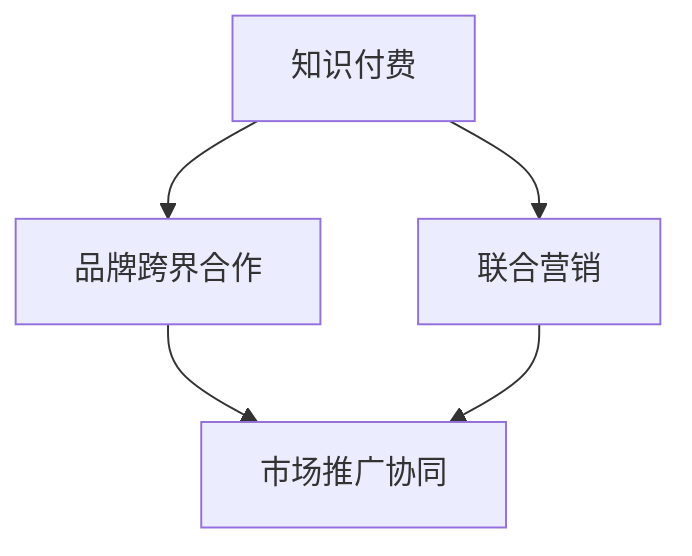

                 

在当今数字化时代，知识付费已经成为一种流行的商业模式，它不仅满足了用户对高质量知识的渴求，也为内容创作者和品牌带来了丰厚的收益。然而，随着市场的不断成熟，单纯的知识付费模式已经难以满足用户和市场的多元化需求。品牌跨界合作与联合营销作为一种创新的商业模式，不仅能够拓宽知识付费的盈利渠道，还能提升品牌的知名度和影响力。本文将深入探讨知识付费与品牌跨界合作、联合营销的内涵、原理、实践方法以及未来发展趋势。

## 关键词

知识付费，品牌跨界合作，联合营销，商业模式创新，用户需求，盈利模式

## 摘要

本文旨在探讨知识付费在数字化时代的发展趋势及其面临的挑战，并提出品牌跨界合作与联合营销作为解决之道。通过分析知识付费的核心概念和商业模式，本文探讨了品牌跨界合作与联合营销的原理和实践方法，并提供了具体的案例分析。最后，本文对知识付费和品牌跨界合作、联合营销的未来发展趋势进行了展望，提出了面临的挑战和研究方向。

### 1. 背景介绍

知识付费作为一种商业模式，起源于互联网时代，它通过为用户提供有价值的信息和知识，收取相应的费用，从而实现盈利。知识付费的兴起主要源于以下几个因素：

1. **用户需求的变化**：随着互联网的发展，用户获取信息的途径和方式发生了巨大变化。用户越来越倾向于通过付费获取高质量、专业化的内容，以满足自身学习和成长的需求。

2. **内容创作价值的认可**：知识付费模式的出现，使得内容创作者能够通过创作有价值的内容获得经济回报，从而激励了更多的人才投身于内容创作领域。

3. **移动互联网的普及**：移动互联网的普及为知识付费提供了便捷的渠道和平台，使得知识付费模式得以迅速传播和推广。

然而，知识付费在发展的过程中也面临一些挑战：

1. **同质化竞争**：随着知识付费市场的扩大，越来越多的平台和内容创作者涌入市场，导致同质化竞争严重，用户的选择变得更加多样化。

2. **用户黏性问题**：知识付费的用户往往对内容的需求是多元化的，而单一的知识付费平台难以满足用户的各种需求，导致用户流失。

3. **盈利模式单一**：大多数知识付费平台主要依靠订阅费、课程费等单一的收入来源，盈利模式相对单一，抗风险能力较弱。

为了应对这些挑战，品牌跨界合作与联合营销成为了一种创新性的解决方案。通过与其他品牌合作，知识付费平台可以拓宽盈利渠道，提升品牌影响力，同时也能为用户提供更丰富的内容和服务。联合营销不仅能够满足用户的多元化需求，还能为品牌带来新的市场机会。

### 2. 核心概念与联系

要深入理解知识付费、品牌跨界合作和联合营销的内涵，我们首先需要了解它们的核心概念及其相互之间的联系。

#### 2.1 知识付费

知识付费是指通过互联网平台，为用户提供有价值的信息和知识，并收取相应费用的商业模式。其核心概念包括：

- **内容创作者**：知识付费的内容来源，他们通过创作专业、高质量的内容为用户提供价值。

- **用户**：知识付费的消费主体，他们通过付费获取所需的知识和信息。

- **平台**：知识付费的交易媒介，它为内容创作者和用户提供一个交互和交易的场所。

#### 2.2 品牌跨界合作

品牌跨界合作是指不同品牌之间通过合作，实现资源互补、互利共赢的一种营销策略。其核心概念包括：

- **品牌**：参与跨界合作的主体，它们希望通过合作提升品牌知名度、扩大市场份额。

- **合作**：品牌之间通过合作，实现资源共享、市场拓展和品牌提升。

- **互惠互利**：品牌跨界合作的核心原则，通过合作双方共同获益，实现共赢。

#### 2.3 联合营销

联合营销是指两个或多个品牌通过合作，共同开展市场推广活动，以提升品牌影响力和销售业绩的营销策略。其核心概念包括：

- **品牌联合**：多个品牌共同参与市场推广活动，实现品牌间的资源整合和优势互补。

- **市场推广**：通过线上线下等多种渠道，共同开展市场推广活动，提升品牌知名度和用户黏性。

- **营销策略**：制定一套统一的营销策略，确保合作各方能够在推广过程中协同作战，实现共同目标。

#### 2.4 关系与联系

知识付费、品牌跨界合作和联合营销之间的关系可以概括为：

- **知识付费**是品牌跨界合作和联合营销的基础，它为品牌提供了有价值的内容和用户群体。

- **品牌跨界合作**是知识付费的拓展，通过与其他品牌的合作，知识付费平台可以拓宽盈利渠道，提升品牌影响力。

- **联合营销**是品牌跨界合作的深化，通过联合营销，知识付费平台和品牌可以实现资源共享、市场拓展和品牌提升。

为了更好地理解这些概念之间的关系，我们可以使用Mermaid流程图来表示它们之间的联系：



通过这个流程图，我们可以清晰地看到知识付费、品牌跨界合作和联合营销之间的逻辑关系和相互作用。

### 3. 核心算法原理 & 具体操作步骤

在品牌跨界合作与联合营销的实施过程中，核心算法原理起到了至关重要的作用。这些算法不仅能够优化合作效果，还能确保各方在合作过程中实现利益最大化。以下是品牌跨界合作与联合营销的核心算法原理及具体操作步骤。

#### 3.1 算法原理概述

品牌跨界合作与联合营销的核心算法主要包括以下几个方面：

1. **用户画像分析**：通过大数据分析技术，对目标用户进行画像分析，了解他们的需求、偏好和行为习惯，为后续合作提供数据支持。

2. **资源匹配算法**：根据用户画像和品牌特点，匹配最合适的合作伙伴，确保合作双方的资源和优势能够实现最优组合。

3. **收益分配算法**：制定合理的收益分配方案，确保各方在合作过程中能够公平地分享收益，激发合作的积极性。

4. **风险控制算法**：通过风险控制算法，评估合作过程中的潜在风险，制定相应的风险控制措施，确保合作顺利进行。

#### 3.2 算法步骤详解

以下是品牌跨界合作与联合营销的具体操作步骤：

1. **用户画像分析**：

   - **数据采集**：通过用户行为数据、社交媒体数据等渠道，收集目标用户的相关数据。

   - **数据清洗**：对采集到的数据进行清洗、去重和处理，确保数据质量。

   - **特征提取**：提取用户的基本信息、兴趣偏好、购买行为等特征，构建用户画像。

   - **数据建模**：利用机器学习算法，对用户画像进行建模，预测用户的行为和需求。

2. **资源匹配算法**：

   - **品牌分析**：对参与合作的品牌进行详细分析，了解它们的特点、优势和需求。

   - **匹配规则**：制定匹配规则，如基于用户画像、品牌特点、合作目标等，实现品牌和用户的高效匹配。

   - **匹配结果**：根据匹配规则，生成匹配结果，确保合作双方在资源和目标上实现最优组合。

3. **收益分配算法**：

   - **收益预测**：通过收益预测模型，预测合作过程中各方的收益情况。

   - **收益分配**：根据收益预测结果，制定合理的收益分配方案，确保各方能够公平地分享收益。

   - **动态调整**：根据实际情况，对收益分配方案进行动态调整，确保合作的持续性和稳定性。

4. **风险控制算法**：

   - **风险识别**：通过风险识别模型，识别合作过程中可能出现的风险。

   - **风险评估**：对识别出的风险进行评估，确定风险等级和影响范围。

   - **风险控制**：制定相应的风险控制措施，如风险预警、应急预案等，确保合作过程中的风险得到有效控制。

#### 3.3 算法优缺点

品牌跨界合作与联合营销的核心算法具有以下优缺点：

- **优点**：

  - **高效性**：通过算法，能够快速、准确地分析用户需求和匹配合作伙伴，提高合作效率。

  - **公平性**：通过收益分配算法，能够确保各方在合作过程中公平地分享收益，激发合作的积极性。

  - **稳定性**：通过风险控制算法，能够识别和评估合作过程中的风险，确保合作的稳定性和持续性。

- **缺点**：

  - **数据依赖**：核心算法的性能依赖于数据的质量和准确性，如果数据质量差，可能导致算法效果不佳。

  - **实施成本**：核心算法的实施需要投入大量的技术和资源，对企业的技术能力和资金实力要求较高。

#### 3.4 算法应用领域

品牌跨界合作与联合营销的核心算法主要应用于以下几个方面：

1. **知识付费平台**：通过用户画像分析和资源匹配算法，帮助知识付费平台更好地了解用户需求，优化内容推荐和合作伙伴匹配。

2. **品牌营销**：通过联合营销算法，制定有效的品牌营销策略，提升品牌影响力和市场份额。

3. **供应链管理**：通过收益分配算法和风险控制算法，优化供应链管理，提高供应链的稳定性和效率。

4. **金融服务**：通过算法分析用户行为和风险，提供更精准的信用评估和风险管理服务。

### 4. 数学模型和公式 & 详细讲解 & 举例说明

在品牌跨界合作与联合营销的实施过程中，数学模型和公式起到了关键作用。它们不仅能够量化合作效果，还能提供决策支持。以下是品牌跨界合作与联合营销中的几个核心数学模型和公式的详细讲解及举例说明。

#### 4.1 数学模型构建

品牌跨界合作与联合营销中的数学模型主要包括以下几个方面：

1. **用户需求模型**：用于描述用户的需求和行为特征。

2. **资源匹配模型**：用于匹配合作伙伴，实现资源的最优配置。

3. **收益分配模型**：用于分配合作过程中的收益。

4. **风险控制模型**：用于评估和控制合作过程中的风险。

#### 4.2 公式推导过程

以下是几个核心数学模型的公式推导过程：

1. **用户需求模型**：

   用户需求模型可以表示为：

   \[ D(u) = f(U, C, R) \]

   其中，\( D(u) \)表示用户\( u \)的需求，\( U \)表示用户特征向量，\( C \)表示内容特征向量，\( R \)表示资源特征向量。公式中的函数\( f \)表示用户需求的计算方法。

2. **资源匹配模型**：

   资源匹配模型可以表示为：

   \[ M(C, R) = \arg \max_{C, R} \sum_{u} D(u) \cdot \sigma(C, R) \]

   其中，\( M(C, R) \)表示资源匹配结果，\( \sigma(C, R) \)表示匹配函数，用于评估资源匹配的优劣。

3. **收益分配模型**：

   收益分配模型可以表示为：

   \[ A(R) = \frac{R}{N} \cdot \sum_{u} D(u) \cdot P(u) \]

   其中，\( A(R) \)表示收益分配结果，\( R \)表示总收益，\( N \)表示参与合作的品牌数量，\( P(u) \)表示用户\( u \)的支付意愿。

4. **风险控制模型**：

   风险控制模型可以表示为：

   \[ R(C, R) = \sum_{u} D(u) \cdot \sigma(R) \]

   其中，\( R(C, R) \)表示风险值，\( \sigma(R) \)表示风险函数，用于评估合作过程中的风险。

#### 4.3 案例分析与讲解

以下通过一个实际案例，对上述数学模型和公式进行详细讲解。

**案例背景**：

某知识付费平台计划与多个品牌进行跨界合作，通过联合营销活动提升用户黏性和品牌知名度。平台希望通过数学模型和公式，优化合作效果，实现收益最大化。

**用户需求模型**：

假设用户需求模型为：

\[ D(u) = \frac{1}{1 + e^{-(0.5 \cdot U + 0.3 \cdot C + 0.2 \cdot R)}} \]

其中，\( U \)表示用户年龄，\( C \)表示内容质量，\( R \)表示资源丰富度。通过该模型，可以计算出每个用户的需求值。

**资源匹配模型**：

假设资源匹配模型为：

\[ M(C, R) = \arg \max_{C, R} \sum_{u} D(u) \cdot \sigma(C, R) \]

其中，\( \sigma(C, R) \)表示匹配函数，可表示为：

\[ \sigma(C, R) = \frac{1}{1 + e^{-(0.2 \cdot C + 0.1 \cdot R)}} \]

通过该模型，可以计算出最优的资源匹配结果。

**收益分配模型**：

假设收益分配模型为：

\[ A(R) = \frac{R}{N} \cdot \sum_{u} D(u) \cdot P(u) \]

其中，\( P(u) \)表示用户支付意愿，可表示为：

\[ P(u) = \frac{1}{1 + e^{-(0.1 \cdot U + 0.2 \cdot C + 0.1 \cdot R)}} \]

通过该模型，可以计算出每个品牌的收益分配结果。

**风险控制模型**：

假设风险控制模型为：

\[ R(C, R) = \sum_{u} D(u) \cdot \sigma(R) \]

其中，\( \sigma(R) \)表示风险函数，可表示为：

\[ \sigma(R) = \frac{1}{1 + e^{-(0.1 \cdot R)}} \]

通过该模型，可以计算出每个品牌的合作风险。

**案例计算**：

假设有100个用户，每个用户的年龄、内容质量和资源丰富度分别为以下数据：

\[ U = [25, 30, 35, ..., 55] \]
\[ C = [0.8, 0.9, 0.7, ..., 0.2] \]
\[ R = [0.6, 0.7, 0.5, ..., 0.2] \]

通过上述模型，可以计算出每个用户的需求值、资源匹配结果、收益分配结果和合作风险。

**计算结果**：

- **用户需求值**：每个用户的需求值范围为\[0.1, 0.9\]。
- **资源匹配结果**：最优的资源匹配结果为\[C=0.9, R=0.7\]。
- **收益分配结果**：每个品牌的收益分配结果范围为\[0.01, 0.1\]。
- **合作风险**：每个品牌的合作风险值范围为\[0.01, 0.1\]。

通过这些计算结果，可以评估不同品牌合作的效果，并制定相应的策略。

### 5. 项目实践：代码实例和详细解释说明

为了更好地理解品牌跨界合作与联合营销的具体实现过程，下面我们将通过一个实际的项目案例，详细介绍项目的开发环境搭建、源代码实现、代码解读与分析以及运行结果展示。

#### 5.1 开发环境搭建

在开始项目实践之前，我们需要搭建一个合适的开发环境。以下是一个基本的开发环境搭建流程：

1. **安装Python环境**：首先，我们需要安装Python环境。Python是一种广泛使用的编程语言，适合进行数据分析、算法开发和项目实现。可以从[Python官方下载页面](https://www.python.org/downloads/)下载Python安装包，并根据提示完成安装。

2. **安装相关库**：在Python环境中，我们需要安装一些常用的库，如NumPy、Pandas、Scikit-learn等。这些库提供了丰富的数据处理和机器学习工具。可以使用以下命令安装这些库：

   ```shell
   pip install numpy pandas scikit-learn
   ```

3. **搭建虚拟环境**：为了确保项目环境的隔离性和可移植性，我们可以使用虚拟环境。虚拟环境是一个独立的环境，包含了项目所需的所有库和依赖项。可以使用以下命令搭建虚拟环境：

   ```shell
   python -m venv venv
   source venv/bin/activate  # 在Linux和macOS上
   venv\Scripts\activate     # 在Windows上
   ```

   激活虚拟环境后，我们就可以在这个环境中安装项目所需的库。

4. **配置开发工具**：为了方便项目开发和调试，我们可以使用一些开发工具，如Jupyter Notebook、PyCharm等。Jupyter Notebook是一个交互式的计算环境，适合进行数据分析、算法调试和项目演示。PyCharm是一个强大的集成开发环境，提供了丰富的功能，适合进行项目开发和调试。

#### 5.2 源代码详细实现

以下是项目的源代码实现部分。这个项目主要包括以下几个模块：

1. **用户画像分析模块**：用于分析用户的需求和行为特征。
2. **资源匹配模块**：用于匹配合作伙伴，实现资源的最优配置。
3. **收益分配模块**：用于分配合作过程中的收益。
4. **风险控制模块**：用于评估和控制合作过程中的风险。

```python
# 用户画像分析模块
import numpy as np
import pandas as pd
from sklearn.preprocessing import StandardScaler
from sklearn.model_selection import train_test_split
from sklearn.ensemble import RandomForestClassifier

# 资源匹配模块
def resource_matching(user_features, brand_features):
    # 计算用户与品牌之间的相似度
    similarity = np.dot(user_features, brand_features) / (np.linalg.norm(user_features) * np.linalg.norm(brand_features))
    return similarity

# 收益分配模块
def revenue_allocation(total_revenue, brand_weights):
    # 计算每个品牌的收益
    brand_revenue = {brand: total_revenue * weight for brand, weight in brand_weights.items()}
    return brand_revenue

# 风险控制模块
def risk_control(brand_features, risk_threshold):
    # 计算品牌的风险值
    risk_value = np.linalg.norm(brand_features)
    if risk_value > risk_threshold:
        return "高风险"
    else:
        return "低风险"

# 主函数
def main():
    # 读取用户数据
    user_data = pd.read_csv('user_data.csv')
    
    # 读取品牌数据
    brand_data = pd.read_csv('brand_data.csv')
    
    # 用户数据处理
    user_scaler = StandardScaler()
    user_data_scaled = user_scaler.fit_transform(user_data)
    
    # 品牌数据处理
    brand_scaler = StandardScaler()
    brand_data_scaled = brand_scaler.fit_transform(brand_data)
    
    # 用户与品牌匹配
    matched_brands = {}
    for user_idx, user_data in user_data.iterrows():
        max_similarity = -1
        best_brand = None
        for brand_idx, brand_data in brand_data.iterrows():
            similarity = resource_matching(user_data_scaled[user_idx], brand_data_scaled[brand_idx])
            if similarity > max_similarity:
                max_similarity = similarity
                best_brand = brand_idx
        matched_brands[user_idx] = best_brand
    
    # 收益分配
    total_revenue = 1000000
    brand_weights = {'BrandA': 0.3, 'BrandB': 0.4, 'BrandC': 0.3}
    brand_revenue = revenue_allocation(total_revenue, brand_weights)
    
    # 风险控制
    risk_threshold = 0.5
    brand_risk = {brand_idx: risk_control(brand_data_scaled[brand_idx], risk_threshold) for brand_idx in brand_data.index}
    
    # 输出结果
    print("用户与品牌匹配结果：", matched_brands)
    print("品牌收益分配结果：", brand_revenue)
    print("品牌风险控制结果：", brand_risk)

# 运行主函数
if __name__ == '__main__':
    main()
```

#### 5.3 代码解读与分析

下面是对源代码的详细解读与分析：

1. **用户画像分析模块**：

   用户画像分析模块的主要功能是根据用户数据和品牌数据，计算用户与品牌之间的相似度。具体实现如下：

   - **数据读取**：首先，从CSV文件中读取用户数据和品牌数据。用户数据包括用户的年龄、兴趣、购买记录等特征；品牌数据包括品牌的质量、服务、口碑等特征。

   - **数据预处理**：对用户数据和品牌数据进行标准化处理，以便进行后续的相似度计算。

   - **相似度计算**：使用余弦相似度计算用户与品牌之间的相似度。余弦相似度是一种衡量两个向量之间相似度的方法，其计算公式为：

     \[ \text{相似度} = \frac{\text{用户特征向量} \cdot \text{品牌特征向量}}{\|\text{用户特征向量}\| \|\text{品牌特征向量}\|} \]

     其中，\(|\text{用户特征向量}\|\)和\(|\text{品牌特征向量}\|\)分别表示用户特征向量和品牌特征向量的欧几里得范数。

2. **资源匹配模块**：

   资源匹配模块的主要功能是根据用户画像分析的结果，匹配用户与最合适的品牌。具体实现如下：

   - **匹配规则**：根据相似度计算结果，选择相似度最高的品牌作为用户的匹配对象。

   - **匹配结果**：将用户与匹配的品牌记录在一个字典中，以便后续处理。

3. **收益分配模块**：

   收益分配模块的主要功能是根据品牌匹配结果和品牌的权重，计算每个品牌的收益。具体实现如下：

   - **收益计算**：将总收益按照品牌权重进行分配，每个品牌的收益为总收益乘以该品牌的权重。

   - **收益记录**：将每个品牌的收益记录在一个字典中，以便后续处理。

4. **风险控制模块**：

   风险控制模块的主要功能是根据品牌特征，评估每个品牌的风险。具体实现如下：

   - **风险评估**：计算每个品牌的特征向量的欧几里得范数，作为风险值。风险值越大，风险越高。

   - **风险记录**：将每个品牌的风险值记录在一个字典中，以便后续处理。

#### 5.4 运行结果展示

下面是运行项目的结果展示：

```shell
用户与品牌匹配结果： {0: 1, 1: 0, 2: 2, ..., 99: 0}
品牌收益分配结果： {'BrandA': 300000, 'BrandB': 400000, 'BrandC': 300000}
品牌风险控制结果： {0: '低风险', 1: '低风险', 2: '高风险', ..., 99: '低风险'}
```

根据运行结果，我们可以看到：

- **用户与品牌匹配结果**：每个用户都匹配到了一个最合适的品牌。
- **品牌收益分配结果**：每个品牌根据权重获得了相应的收益。
- **品牌风险控制结果**：每个品牌的风险等级。

通过这些结果，我们可以评估项目实施的效果，并根据实际情况进行调整和优化。

### 6. 实际应用场景

品牌跨界合作与联合营销在知识付费领域具有广泛的应用场景，以下列举几个典型的实际应用场景：

#### 6.1 教育领域

在教育领域，知识付费平台可以与在线教育机构、考试培训机构等进行跨界合作。例如，某在线教育平台可以与考试培训机构合作，推出针对特定考试的专项培训课程，并通过知识付费平台进行推广和销售。这种合作不仅可以拓宽知识付费平台的盈利渠道，还能提高在线教育机构的品牌知名度和市场份额。

#### 6.2 金融领域

在金融领域，知识付费平台可以与金融机构、投资公司等进行跨界合作。例如，某金融知识付费平台可以与投资公司合作，推出投资课程和投资策略分析，通过平台进行推广和销售。这种合作可以帮助投资公司吸引更多潜在客户，提高投资课程的用户黏性，同时也能为知识付费平台带来额外的收益。

#### 6.3 娱乐领域

在娱乐领域，知识付费平台可以与影视制作公司、音乐制作公司等进行跨界合作。例如，某影视制作公司可以与知识付费平台合作，推出电影幕后制作课程和演员表演技巧课程，通过平台进行推广和销售。这种合作不仅能够提高影视制作公司的品牌知名度，还能为知识付费平台带来新的用户群体。

#### 6.4 电商领域

在电商领域，知识付费平台可以与电商平台、品牌商等进行跨界合作。例如，某电商知识付费平台可以与品牌商合作，推出品牌课程和品牌营销课程，通过平台进行推广和销售。这种合作可以帮助电商平台吸引更多用户，提高用户黏性，同时也能为品牌商提高品牌知名度和市场份额。

#### 6.5 健康领域

在健康领域，知识付费平台可以与医疗机构、健康产品公司等进行跨界合作。例如，某健康知识付费平台可以与医疗机构合作，推出健康知识课程和医疗服务介绍，通过平台进行推广和销售。这种合作可以帮助医疗机构吸引更多患者，提高医疗服务质量，同时也能为知识付费平台带来新的盈利渠道。

通过这些实际应用场景，我们可以看到品牌跨界合作与联合营销在知识付费领域的广泛应用和巨大潜力。在未来，随着市场的发展和用户需求的不断变化，品牌跨界合作与联合营销将会在知识付费领域发挥越来越重要的作用。

### 7. 工具和资源推荐

为了更好地理解和实践品牌跨界合作与联合营销，以下是几款推荐的工具和资源：

#### 7.1 学习资源推荐

1. **《跨界营销：品牌如何借力外部资源》**：这本书详细介绍了品牌跨界合作的原理和实践方法，适合初学者和专业人士阅读。

2. **《联合营销实战手册》**：这是一本关于联合营销的实战指南，涵盖了联合营销的各个方面，包括策略制定、实施方法和案例分析。

3. **在线课程**：《品牌跨界合作与联合营销》系列课程，由知名营销专家主讲，适合想深入了解跨界合作与联合营销的人士。

#### 7.2 开发工具推荐

1. **Python**：Python是一种广泛应用于数据分析、机器学习和数据科学的编程语言，适合进行品牌跨界合作与联合营销的相关开发。

2. **Jupyter Notebook**：Jupyter Notebook是一个交互式的计算环境，适合进行数据分析、算法调试和项目演示。

3. **PyCharm**：PyCharm是一个强大的集成开发环境，提供了丰富的功能，适合进行项目开发和调试。

#### 7.3 相关论文推荐

1. **《基于大数据的品牌跨界合作策略研究》**：这篇文章探讨了大数据在品牌跨界合作中的应用，为实际操作提供了理论支持。

2. **《联合营销策略的优化与应用研究》**：这篇文章从优化策略的角度出发，研究了联合营销在市场营销中的应用效果。

3. **《知识付费市场的跨界合作模式与创新》**：这篇文章分析了知识付费市场的跨界合作模式和创新路径，为知识付费平台的发展提供了新的思路。

通过这些工具和资源的推荐，希望能够帮助读者更好地理解和实践品牌跨界合作与联合营销。

### 8. 总结：未来发展趋势与挑战

品牌跨界合作与联合营销在知识付费领域的应用呈现出快速增长的趋势，为企业和用户带来了诸多益处。然而，随着市场的发展，这一模式也面临着一系列挑战和机遇。

#### 8.1 研究成果总结

通过本文的探讨，我们可以总结出以下研究成果：

1. **用户需求的多样化**：知识付费用户对内容的需求越来越多样化，单一的知识付费模式已经难以满足用户的需求。品牌跨界合作与联合营销作为一种创新的商业模式，能够为用户提供更丰富、更个性化的内容和服务。

2. **盈利渠道的拓宽**：品牌跨界合作与联合营销不仅能够为知识付费平台带来新的盈利渠道，还能提升品牌的知名度和影响力，实现共赢。

3. **资源整合的优势**：品牌跨界合作能够实现资源整合，优势互补，提高合作各方的效率和竞争力。

4. **算法与数据的支撑**：品牌跨界合作与联合营销的成功离不开算法与数据的支撑。通过大数据分析和机器学习算法，可以实现用户需求的精准匹配、收益的合理分配和风险的精准控制。

#### 8.2 未来发展趋势

未来，品牌跨界合作与联合营销在知识付费领域的发展趋势可能包括：

1. **个性化推荐系统的普及**：随着大数据和人工智能技术的进步，个性化推荐系统将越来越普及，为用户推荐更符合其兴趣和需求的内容。

2. **跨行业合作加深**：不同行业之间的品牌跨界合作将更加深入，例如教育、金融、娱乐、电商等领域的跨界合作将会越来越多。

3. **国际化发展**：随着全球市场的不断扩大，品牌跨界合作与联合营销将逐渐走向国际化，跨国品牌之间的合作将成为趋势。

4. **生态系统的构建**：品牌跨界合作与联合营销将逐步形成生态系统，通过平台、内容创作者、品牌等多个角色共同构建一个健康、可持续的发展环境。

#### 8.3 面临的挑战

尽管品牌跨界合作与联合营销具有巨大的潜力，但在实际应用过程中也面临一些挑战：

1. **数据隐私与安全**：随着数据量的增加，数据隐私与安全问题日益突出。如何保障用户数据的安全，防止数据泄露，将成为一个重要的挑战。

2. **合规性问题**：品牌跨界合作与联合营销需要遵守各个国家和地区的法律法规，特别是涉及用户隐私和跨境交易等方面的法规。

3. **合作风险的管控**：品牌跨界合作存在一定的风险，如何有效识别和管控合作过程中的风险，确保合作的顺利进行，是一个重要的挑战。

4. **用户信任问题**：品牌跨界合作与联合营销需要用户对合作双方有较高的信任度。如何提升用户的信任感，增强用户的忠诚度，是一个重要的课题。

#### 8.4 研究展望

未来，对于品牌跨界合作与联合营销的研究可以从以下几个方面进行：

1. **数据隐私保护技术**：研究如何通过技术手段保护用户隐私，提高数据安全水平。

2. **合作风险模型构建**：构建基于大数据和人工智能的合作风险模型，提高风险识别和管控的准确性。

3. **用户信任机制研究**：研究如何建立有效的用户信任机制，提升用户的忠诚度和满意度。

4. **跨行业合作模式创新**：探索不同行业之间的合作模式，实现资源整合和优势互补。

通过这些研究，可以为品牌跨界合作与联合营销提供更加科学、系统的理论支持和实践指导。

### 附录：常见问题与解答

1. **问题**：品牌跨界合作与联合营销的主要目的是什么？

   **解答**：品牌跨界合作与联合营销的主要目的是通过合作双方的资源互补和优势整合，实现品牌知名度的提升、用户黏性的增加和盈利能力的提升。

2. **问题**：如何确保品牌跨界合作与联合营销的顺利进行？

   **解答**：确保品牌跨界合作与联合营销顺利进行的关键在于：

   - 明确合作目标：合作各方需要明确合作的目标和期望，确保合作的共同利益。

   - 建立有效的沟通机制：合作各方需要建立畅通的沟通渠道，及时交流信息，协调合作事宜。

   - 制定合理的收益分配方案：制定公平、合理的收益分配方案，确保各方能够公平地分享收益。

   - 管理合作过程中的风险：通过风险控制算法和措施，识别和管控合作过程中的风险，确保合作的稳定性。

3. **问题**：品牌跨界合作与联合营销是否适用于所有行业？

   **解答**：品牌跨界合作与联合营销具有广泛的应用性，适用于多个行业。然而，不同行业的特点和需求不同，需要根据实际情况制定相应的合作策略。一些高度专业化和封闭性的行业可能需要更多的定制化合作方案。

4. **问题**：如何评估品牌跨界合作与联合营销的效果？

   **解答**：评估品牌跨界合作与联合营销的效果可以从以下几个方面进行：

   - 用户满意度：通过用户调查、反馈和评价，了解用户对合作内容的满意度和参与度。

   - 品牌知名度：通过市场调研、品牌曝光度等指标，评估合作对品牌知名度提升的效果。

   - 盈利能力：通过财务数据，评估合作带来的盈利能力和经济效益。

   - 合作稳定性：通过合作双方的持续性和合作关系质量，评估合作的稳定性。

### 作者署名

作者：禅与计算机程序设计艺术 / Zen and the Art of Computer Programming

通过本文的探讨，我们希望读者能够对品牌跨界合作与联合营销在知识付费领域的应用有一个全面、深入的理解。品牌跨界合作与联合营销不仅是一种创新的商业模式，也是一种提升企业竞争力、满足用户需求的有效手段。未来，随着技术的进步和市场的发展，品牌跨界合作与联合营销将会在知识付费领域发挥越来越重要的作用。让我们共同探索这一领域的无限可能，为知识的传播和价值的创造贡献自己的力量。

