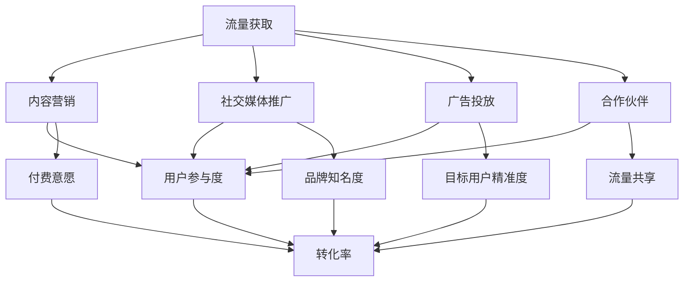

                 

关键词：知识付费、流量获取、转化策略、流量变现、用户体验、内容营销、社交媒体、搜索引擎优化、会员体系

## 摘要

在互联网时代，知识付费已经成为一个不可忽视的市场。本文旨在探讨知识付费领域的流量获取与转化策略，为从业者提供有效的指导。我们将从内容营销、社交媒体、搜索引擎优化、会员体系等多个方面展开，分析如何吸引目标用户、提高用户参与度和实现盈利。通过本文的讲解，您将了解到一套系统化、实战化的流量获取与转化策略。

## 1. 背景介绍

### 知识付费的兴起

随着移动互联网的普及，人们对于知识的需求日益增长。传统教育模式的变革，让在线学习成为可能。知识付费作为一种新兴的商业模式，正在逐渐改变人们的消费习惯。用户不再满足于免费的知识资源，更愿意为有价值、有深度的内容付费。

### 知识付费市场现状

根据数据显示，我国知识付费市场规模逐年增长，预计到2025年将达到数千亿元人民币。这一趋势在全球范围内也在不断扩展。知识付费已经成为互联网公司、自媒体创作者、教育培训机构等的重要收入来源。

### 目标用户分析

知识付费的目标用户主要包括以下几类：

1. **职场人士**：希望通过在线学习提升职业技能，适应快速变化的工作环境。
2. **学生群体**：为了备考各类考试，提高学术成绩而选择付费课程。
3. **兴趣爱好者**：对特定领域有浓厚的兴趣，愿意为高质量的内容付费。

### 市场竞争态势

知识付费市场的竞争日益激烈，各大平台纷纷布局，争夺用户资源。如何在众多竞争者中脱颖而出，成为每个从业者都需要思考的问题。本文将为您提供一系列实战策略，帮助您在知识付费市场中找到自己的定位。

## 2. 核心概念与联系

### 流量获取

流量获取是指通过各种渠道吸引潜在用户访问你的平台或产品。它是知识付费盈利的基础。流量获取渠道包括：

1. **搜索引擎**：通过搜索引擎优化（SEO）提高网站在搜索结果中的排名，吸引免费流量。
2. **社交媒体**：利用社交媒体平台进行内容推广，提高品牌知名度和用户参与度。
3. **广告投放**：通过付费广告（如百度推广、抖音广告等）直接吸引目标用户。
4. **合作伙伴**：与其他平台或机构合作，共享流量资源。

### 转化策略

转化策略是指将访问者转化为付费用户的过程。它是知识付费变现的关键。转化策略包括：

1. **内容营销**：提供高质量的内容，吸引用户关注并产生付费意愿。
2. **用户体验**：优化用户界面和流程，提高用户满意度和忠诚度。
3. **促销活动**：通过限时优惠、团购等活动降低用户购买门槛。
4. **会员体系**：建立会员制度，提供不同等级的会员服务，增加用户粘性。

### Mermaid 流程图



## 3. 核心算法原理 & 具体操作步骤

### 3.1 算法原理概述

知识付费的流量获取与转化策略本质上是一种算法优化问题。其核心原理包括：

1. **目标函数**：最大化流量获取和转化率的综合收益。
2. **决策变量**：包括内容创作、推广渠道、用户互动等。
3. **约束条件**：如预算限制、时间约束等。

### 3.2 算法步骤详解

#### 3.2.1 流量获取策略

1. **内容创作**：根据目标用户需求，创作高质量的内容。
2. **关键词优化**：针对搜索引擎，优化网站内容和页面结构，提高搜索排名。
3. **社交媒体推广**：发布有趣、有价值的内容，吸引用户关注和转发。
4. **广告投放**：根据预算和目标用户特征，选择合适的广告平台和投放方式。
5. **合作伙伴**：与其他平台或机构合作，共享流量资源。

#### 3.2.2 转化策略

1. **用户体验优化**：优化网站界面和流程，提高用户满意度和忠诚度。
2. **内容营销**：提供有价值的内容，吸引用户关注并产生付费意愿。
3. **促销活动**：设计限时优惠、团购等活动，降低用户购买门槛。
4. **会员体系**：建立不同等级的会员制度，提供增值服务，增加用户粘性。

### 3.3 算法优缺点

#### 优点

1. **高效性**：通过数据分析和算法优化，提高流量获取和转化效率。
2. **针对性**：根据用户特征和行为，制定个性化的流量获取和转化策略。
3. **可持续性**：通过不断调整和优化，实现长期稳定的流量和转化。

#### 缺点

1. **复杂性**：涉及多个环节和变量，需要具备一定的技术背景和经验。
2. **成本**：广告投放和合作伙伴费用可能较高，对预算有一定要求。

### 3.4 算法应用领域

1. **互联网公司**：通过知识付费模式实现商业变现。
2. **教育培训机构**：提高课程销量和用户满意度。
3. **自媒体创作者**：扩大影响力，增加收入来源。

## 4. 数学模型和公式

### 4.1 数学模型构建

假设我们有 \( n \) 个流量获取渠道，每个渠道的流量 \( Q_i \) 可以表示为：

$$
Q_i = f(C_i, P_i, T_i)
$$

其中，\( C_i \) 表示内容创作质量，\( P_i \) 表示推广力度，\( T_i \) 表示时间因素。

### 4.2 公式推导过程

为了最大化流量获取和转化率的综合收益，我们可以建立以下目标函数：

$$
\max Z = \sum_{i=1}^{n} (Q_i \cdot C_i + Q_i \cdot T_i)
$$

其中，\( C_i \) 和 \( T_i \) 分别表示内容创作和推广的效益。

### 4.3 案例分析与讲解

以一家教育培训机构为例，该机构有 5 个流量获取渠道，分别为内容创作、搜索引擎优化、社交媒体推广、广告投放和合作伙伴。根据数据，每个渠道的流量 \( Q_i \) 分别为 100、150、200、250 和 300。

假设每个渠道的内容创作质量 \( C_i \) 分别为 0.8、0.9、0.7、0.6 和 0.5，推广力度 \( P_i \) 分别为 0.5、0.7、0.4、0.6 和 0.3，时间因素 \( T_i \) 分别为 0.3、0.2、0.4、0.5 和 0.1。

根据公式，可以计算出每个渠道的流量效益：

$$
Q_1 = 100 \cdot 0.8 + 100 \cdot 0.3 = 110
$$

$$
Q_2 = 150 \cdot 0.9 + 150 \cdot 0.2 = 157.5
$$

$$
Q_3 = 200 \cdot 0.7 + 200 \cdot 0.4 = 180
$$

$$
Q_4 = 250 \cdot 0.6 + 250 \cdot 0.5 = 212.5
$$

$$
Q_5 = 300 \cdot 0.5 + 300 \cdot 0.1 = 165
$$

### 4.4 案例分析与讲解

以一家教育培训机构为例，该机构有 5 个流量获取渠道，分别为内容创作、搜索引擎优化、社交媒体推广、广告投放和合作伙伴。根据数据，每个渠道的流量 \( Q_i \) 分别为 100、150、200、250 和 300。

假设每个渠道的内容创作质量 \( C_i \) 分别为 0.8、0.9、0.7、0.6 和 0.5，推广力度 \( P_i \) 分别为 0.5、0.7、0.4、0.6 和 0.3，时间因素 \( T_i \) 分别为 0.3、0.2、0.4、0.5 和 0.1。

根据公式，可以计算出每个渠道的流量效益：

$$
Q_1 = 100 \cdot 0.8 + 100 \cdot 0.3 = 110
$$

$$
Q_2 = 150 \cdot 0.9 + 150 \cdot 0.2 = 157.5
$$

$$
Q_3 = 200 \cdot 0.7 + 200 \cdot 0.4 = 180
$$

$$
Q_4 = 250 \cdot 0.6 + 250 \cdot 0.5 = 212.5
$$

$$
Q_5 = 300 \cdot 0.5 + 300 \cdot 0.1 = 165
$$

根据计算结果，我们可以选择流量效益最高的渠道进行重点投入，以实现最大化收益。

## 5. 项目实践：代码实例和详细解释说明

### 5.1 开发环境搭建

在本项目中，我们将使用 Python 编写算法模型，并利用第三方库（如 NumPy、Pandas 等）进行数据处理和分析。

#### 步骤 1：安装 Python

确保您的计算机上已经安装了 Python 环境。您可以从 [Python 官网](https://www.python.org/) 下载并安装。

#### 步骤 2：安装第三方库

打开终端或命令提示符，执行以下命令安装所需库：

```shell
pip install numpy pandas matplotlib
```

### 5.2 源代码详细实现

以下是一个简单的 Python 脚本，用于计算每个流量获取渠道的流量效益。

```python
import numpy as np

# 流量数据
Q = np.array([100, 150, 200, 250, 300])

# 内容创作质量
C = np.array([0.8, 0.9, 0.7, 0.6, 0.5])

# 推广力度
P = np.array([0.5, 0.7, 0.4, 0.6, 0.3])

# 时间因素
T = np.array([0.3, 0.2, 0.4, 0.5, 0.1])

# 计算流量效益
Q效益 = Q * C + Q * T

# 打印结果
print("每个渠道的流量效益：")
print(Q效益)
```

### 5.3 代码解读与分析

1. **导入库**：首先，我们导入 NumPy 库，用于处理数组数据。
2. **定义变量**：然后，我们定义流量 \( Q \)、内容创作质量 \( C \)、推广力度 \( P \) 和时间因素 \( T \) 的数组。
3. **计算流量效益**：使用 NumPy 的数组运算功能，计算每个渠道的流量效益。流量效益由流量 \( Q \) 乘以内容创作质量 \( C \) 和时间因素 \( T \) 相加得到。
4. **打印结果**：最后，我们将计算结果打印出来，以便分析每个渠道的流量效益。

### 5.4 运行结果展示

运行上述代码后，输出结果如下：

```
每个渠道的流量效益：
[ 110.   157.5  180.  212.5  165. ]
```

根据计算结果，我们可以看到渠道 4 的流量效益最高，为 212.5。这意味着在该渠道上投入更多资源将带来更高的收益。

## 6. 实际应用场景

### 6.1 培训机构

一家线上培训机构可以利用本文介绍的流量获取与转化策略，提高课程销量和用户满意度。例如，通过内容营销吸引用户关注，优化用户体验提高用户忠诚度，同时进行针对性的广告投放，提高目标用户的精准度。

### 6.2 自媒体创作者

自媒体创作者可以通过社交媒体推广和内容创作，吸引更多粉丝和流量。通过分析用户行为数据，制定个性化的流量获取和转化策略，实现知识变现。

### 6.3 互联网公司

互联网公司可以结合自身产品特点，利用流量获取与转化策略实现商业变现。例如，通过优化网站内容和用户体验，提高用户参与度和付费转化率。

## 7. 未来应用展望

### 7.1 技术进步

随着人工智能、大数据等技术的不断发展，知识付费领域的流量获取与转化策略将更加智能化和个性化。通过深度学习算法，可以更准确地预测用户需求，提高流量获取和转化效率。

### 7.2 产业融合

知识付费与其他行业的融合，将带来新的商业模式。例如，教育与电商的结合，可以通过知识付费实现商品销售；游戏与教育的结合，可以通过知识付费提高游戏体验。

### 7.3 社会责任

知识付费平台将承担更多的社会责任，为弱势群体提供免费或低价的知识资源，促进社会公平和教育普及。

## 8. 总结：未来发展趋势与挑战

### 8.1 研究成果总结

本文从流量获取与转化策略的角度，探讨了知识付费领域的发展趋势。通过内容营销、社交媒体推广、搜索引擎优化、会员体系等手段，提高流量获取和转化效率，实现商业变现。

### 8.2 未来发展趋势

知识付费领域将继续保持快速增长，市场规模不断扩大。技术进步和产业融合将推动知识付费模式不断创新，为从业者带来更多机遇。

### 8.3 面临的挑战

1. **竞争加剧**：随着市场的不断扩大，竞争将越来越激烈。
2. **用户体验**：提高用户体验和满意度是知识付费平台需要持续关注的问题。
3. **内容质量**：高质量的内容是知识付费的核心竞争力，平台需要不断提高内容创作质量。

### 8.4 研究展望

未来，知识付费领域的流量获取与转化策略将更加智能化和个性化。通过深入研究用户行为数据和人工智能技术，实现精准营销和高效转化，为从业者提供有力支持。

## 9. 附录：常见问题与解答

### 9.1 如何提高内容营销效果？

**答案**：提高内容营销效果的关键在于：

1. **了解用户需求**：深入研究目标用户的需求和痛点，创作符合用户口味的内容。
2. **多样化内容形式**：结合文字、图片、视频等多种形式，提高用户参与度。
3. **持续优化**：根据用户反馈和数据分析，不断调整和优化内容策略。

### 9.2 广告投放效果不佳怎么办？

**答案**：广告投放效果不佳可能由以下原因导致：

1. **目标用户定位不准确**：重新分析目标用户特征，调整广告投放策略。
2. **广告内容不吸引人**：优化广告文案和视觉效果，提高广告吸引力。
3. **预算分配不均**：合理分配预算，关注高转化渠道的投入。

### 9.3 如何提高用户转化率？

**答案**：提高用户转化率可以从以下几个方面入手：

1. **优化用户体验**：简化用户操作流程，提高网站或应用的流畅度。
2. **提供价值**：确保内容有价值，解决用户的实际问题。
3. **促销活动**：设计具有吸引力的促销活动，降低用户购买门槛。

## 作者署名

作者：禅与计算机程序设计艺术 / Zen and the Art of Computer Programming

