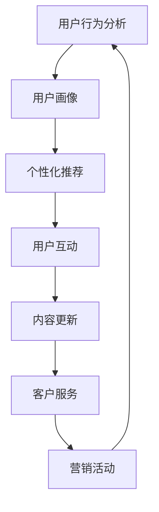

                 

关键词：知识付费，用户复购率，老客户维护，营销策略，用户行为分析，个性化推荐

## 摘要

本文探讨了知识付费行业中的两个关键问题：如何提升用户的复购率以及如何维护老客户。通过深入分析用户行为、市场趋势和营销策略，本文提出了基于数据分析的解决方案。本文将详细阐述用户复购率和老客户维护的重要性，探讨其背后的核心概念和原理，并介绍一些具体的技术手段和工具。通过这些方法，知识付费平台可以更好地理解用户需求，提高用户满意度，从而实现业务的持续增长。

## 1. 背景介绍

随着互联网的普及和信息爆炸，知识付费作为一种新型的商业模式，近年来得到了迅速发展。知识付费平台通过提供专业的知识和技能，满足用户在个人成长、职业发展等各个方面的需求。用户通过付费获取有价值的内容，平台则通过内容销售实现盈利。

然而，知识付费行业也面临着一些挑战。首先，市场竞争激烈，同质化严重，如何脱颖而出成为每个平台需要考虑的问题。其次，用户获取成本高，如何提高用户留存率和复购率成为每个知识付费平台迫切需要解决的问题。此外，如何维护老客户，增强用户忠诚度也是行业发展的关键。

本文旨在通过分析用户行为和市场趋势，提出一系列有效的策略和方法，帮助知识付费平台提高用户复购率和老客户维护效果，从而实现业务的持续增长。

### 1.1 知识付费行业现状

知识付费行业在过去几年中经历了爆发式增长。根据数据显示，2021年中国知识付费市场规模已经超过3000亿元，预计未来几年仍将保持高速增长。知识付费的形式也越来越多样化，包括线上课程、电子书、会员服务、一对一辅导等。

然而，在快速发展的同时，知识付费行业也暴露出一些问题。首先是内容质量参差不齐，一些平台为了追求市场份额，降低了内容质量门槛，导致用户对平台内容产生质疑。其次是用户对服务的满意度不高，一些平台在用户服务方面存在不足，影响了用户的购买体验。此外，用户粘性低、复购率低等问题也成为知识付费行业的痛点。

### 1.2 用户复购率的重要性

用户复购率是衡量知识付费平台成功与否的重要指标之一。高复购率意味着用户对平台内容的认可和满意度，同时也表明平台在用户心中的地位较高。相反，低复购率则可能意味着用户对平台内容或服务存在不满，或者平台在市场竞争中处于劣势。

提升用户复购率有以下几点重要意义：

1. **增加收入**：高复购率意味着用户会重复购买平台的产品或服务，从而带来更多的收入。
2. **提升用户忠诚度**：通过持续提供高质量的内容和服务，增强用户对平台的忠诚度，有利于长期发展。
3. **降低获客成本**：高复购率意味着用户推荐新客户的概率增加，从而降低获取新客户的成本。
4. **提高市场竞争力**：高复购率可以提升平台在市场中的竞争力，有助于在激烈的市场竞争中脱颖而出。

### 1.3 老客户维护的重要性

老客户维护是知识付费平台长期发展的关键。维护好老客户不仅可以增加收入，还可以降低获客成本，提高用户忠诚度。以下是老客户维护的重要性：

1. **增加复购率**：通过提供优质的售后服务和持续的内容更新，提高老客户的满意度和忠诚度，从而增加复购率。
2. **口碑传播**：老客户对平台的认可和满意，可以带动新客户的获取，形成口碑传播效应。
3. **降低流失率**：通过定期的互动和服务，减少老客户的流失，保持用户群体稳定。
4. **提高用户粘性**：老客户对平台的熟悉度和依赖度较高，通过持续的服务和内容更新，提高用户粘性，增加用户活跃度。

## 2. 核心概念与联系

在提升用户复购率和老客户维护方面，一些核心概念和技术手段是不可或缺的。以下是一个简单的 Mermaid 流程图，展示了这些概念和手段之间的联系：



### 2.1 用户行为分析

用户行为分析是提升用户复购率和老客户维护的基础。通过收集和分析用户在平台上的行为数据，可以了解用户的需求和偏好，从而提供更个性化的服务。

用户行为分析主要包括以下几个方面：

1. **浏览行为**：用户在平台上的浏览路径、停留时间、点击次数等。
2. **购买行为**：用户的购买记录、购买频次、购买金额等。
3. **互动行为**：用户在社区、讨论区、问答区的参与情况。
4. **反馈行为**：用户对平台内容和服务提供的反馈和评价。

通过用户行为分析，可以构建用户画像，了解不同用户群体的特征和需求，为后续的个性化推荐和营销活动提供依据。

### 2.2 个性化推荐

个性化推荐是提高用户满意度和忠诚度的有效手段。通过分析用户行为和兴趣，平台可以推荐用户可能感兴趣的内容，从而增加用户对平台的粘性。

个性化推荐主要包括以下几个方面：

1. **基于内容的推荐**：根据用户浏览和购买记录，推荐相似的内容。
2. **基于用户的推荐**：根据用户的兴趣和行为，推荐其他用户感兴趣的内容。
3. **混合推荐**：结合内容和用户行为进行推荐，提高推荐效果。

### 2.3 用户互动

用户互动是增强用户粘性和满意度的重要手段。通过社区、讨论区、问答区等互动平台，用户可以分享经验、提问解答，从而提高对平台的认同感和忠诚度。

用户互动主要包括以下几个方面：

1. **内容互动**：用户对平台内容的评论、点赞、分享等。
2. **社交互动**：用户之间的互动，如私信、群聊等。
3. **问答互动**：用户提问，其他用户解答。

### 2.4 内容更新

内容更新是保持用户活跃度和满意度的重要手段。通过持续更新高质量的内容，可以吸引用户持续访问平台，提高用户粘性。

内容更新主要包括以下几个方面：

1. **课程更新**：定期更新课程内容，保持内容的时效性和相关性。
2. **社区更新**：保持社区活跃，及时回复用户提问和评论。
3. **服务更新**：优化用户服务流程，提高服务质量和效率。

### 2.5 客户服务

客户服务是提升用户满意度和忠诚度的关键。通过提供优质的客户服务，可以解决用户的问题和疑虑，增强用户对平台的信任和依赖。

客户服务主要包括以下几个方面：

1. **售后服务**：为用户提供良好的售后服务，解决用户购买后的问题。
2. **在线咨询**：提供在线咨询功能，及时解答用户问题。
3. **客服团队**：建立专业的客服团队，提高客服质量和效率。

### 2.6 营销活动

营销活动是提高用户活跃度和满意度的重要手段。通过举办各种促销活动、优惠券发放等，可以吸引用户参与，提高用户粘性。

营销活动主要包括以下几个方面：

1. **促销活动**：定期举办促销活动，如限时优惠、满减活动等。
2. **优惠券**：为用户发放优惠券，鼓励用户购买。
3. **活动推广**：通过线上线下的活动推广，提高平台知名度。

## 3. 核心算法原理 & 具体操作步骤

### 3.1 算法原理概述

提升用户复购率和老客户维护的核心算法主要涉及用户行为分析、个性化推荐和营销策略优化。以下是这些算法的基本原理：

1. **用户行为分析**：基于机器学习算法，对用户在平台上的行为数据进行挖掘和分析，识别用户的兴趣和行为模式。
2. **个性化推荐**：利用协同过滤、基于内容的推荐等算法，根据用户兴趣和行为数据，为用户推荐相关的内容和服务。
3. **营销策略优化**：通过数据挖掘和机器学习算法，分析用户行为数据，优化营销策略，提高用户参与度和满意度。

### 3.2 算法步骤详解

1. **用户行为数据收集**：通过平台的日志系统、用户行为追踪技术等手段，收集用户在平台上的行为数据，包括浏览、购买、互动等。
2. **数据预处理**：对收集到的用户行为数据进行清洗、去噪和格式化，提取有效的特征信息，如用户ID、行为类型、时间戳等。
3. **用户行为分析**：利用机器学习算法，如决策树、随机森林等，对用户行为数据进行挖掘和分析，识别用户的兴趣和行为模式。
4. **个性化推荐**：利用协同过滤、基于内容的推荐等算法，根据用户兴趣和行为数据，为用户推荐相关的内容和服务。
5. **营销策略优化**：通过数据挖掘和机器学习算法，分析用户行为数据，优化营销策略，提高用户参与度和满意度。

### 3.3 算法优缺点

**用户行为分析**：

- 优点：能够深入了解用户行为，为个性化推荐和营销策略优化提供依据。
- 缺点：数据收集和处理过程复杂，对计算资源要求较高。

**个性化推荐**：

- 优点：提高用户满意度，增强用户粘性。
- 缺点：推荐效果受算法和数据质量的影响，可能导致过度推荐或推荐不相关的内容。

**营销策略优化**：

- 优点：提高用户参与度，增加收入。
- 缺点：营销策略优化过程复杂，需要大量的数据支持。

### 3.4 算法应用领域

- **电子商务**：通过用户行为分析，为用户提供个性化的商品推荐，提高购买转化率。
- **在线教育**：通过个性化推荐和营销策略优化，提高用户的学习满意度和参与度。
- **社交媒体**：通过用户行为分析，为用户提供个性化的内容推荐，增强用户粘性。

## 4. 数学模型和公式 & 详细讲解 & 举例说明

在提升用户复购率和老客户维护的过程中，数学模型和公式发挥着重要作用。以下是一个简单的数学模型，用于计算用户复购概率：

### 4.1 数学模型构建

设 $P_{r}$ 为用户复购概率，$x_1, x_2, ..., x_n$ 为影响复购概率的变量（如用户购买历史、用户评价、用户活跃度等）。则用户复购概率可以表示为：

$$P_{r} = f(x_1, x_2, ..., x_n)$$

其中，$f$ 为一个函数，可以采用机器学习算法进行训练。

### 4.2 公式推导过程

用户复购概率的公式推导基于贝叶斯定理。设 $A$ 为用户复购事件，$B_i$ 为影响复购的第 $i$ 个变量，则根据贝叶斯定理，有：

$$P_{r}(A) = P(A|B_i)P(B_i) / P(B_i)$$

其中，$P(A|B_i)$ 表示在变量 $B_i$ 的影响下用户复购的概率，$P(B_i)$ 表示变量 $B_i$ 的概率。

为了简化计算，可以将所有变量的概率乘积求和：

$$P_{r}(A) = \sum_{i=1}^{n} P(A|B_i)P(B_i)$$

在实际应用中，可以通过数据驱动的方法，利用用户行为数据训练出一个函数 $f(x_1, x_2, ..., x_n)$，使其能够预测用户复购概率。

### 4.3 案例分析与讲解

假设有一个知识付费平台，根据用户购买历史、用户评价和用户活跃度等变量，利用贝叶斯定理计算用户复购概率。以下是一个简单的例子：

- 用户购买历史：用户在过去三个月内购买了5次课程。
- 用户评价：用户对平台内容的平均评价为4.5星。
- 用户活跃度：用户在过去一个月内参与了10次社区互动。

根据以上数据，可以构建以下数学模型：

$$P_{r}(A) = P(A|B_1)P(B_1) + P(A|B_2)P(B_2) + P(A|B_3)P(B_3)$$

其中，$B_1$ 表示用户购买历史，$B_2$ 表示用户评价，$B_3$ 表示用户活跃度。

通过数据分析，可以得到以下概率：

- $P(A|B_1) = 0.7$：在用户购买历史的影响下，用户复购的概率为70%。
- $P(A|B_2) = 0.6$：在用户评价的影响下，用户复购的概率为60%。
- $P(A|B_3) = 0.8$：在用户活跃度的影响下，用户复购的概率为80%。

根据贝叶斯定理，可以计算出用户复购概率：

$$P_{r}(A) = 0.7 \times 0.3 + 0.6 \times 0.4 + 0.8 \times 0.2 = 0.41$$

这意味着该用户的复购概率为41%。

通过这个例子，可以看出数学模型在计算用户复购概率方面的应用。在实际应用中，可以根据具体业务需求和数据特点，调整模型参数和算法，以提高复购概率预测的准确性。

## 5. 项目实践：代码实例和详细解释说明

### 5.1 开发环境搭建

为了实现用户复购概率预测，我们选择使用 Python 作为编程语言，结合 Scikit-learn 库进行数据处理和模型训练。以下是开发环境的搭建步骤：

1. 安装 Python：从 [Python 官网](https://www.python.org/downloads/) 下载并安装 Python 3.x 版本。
2. 安装 Scikit-learn：打开终端，运行以下命令安装 Scikit-learn：

   ```bash
   pip install scikit-learn
   ```

### 5.2 源代码详细实现

以下是一个简单的用户复购概率预测的 Python 代码实例：

```python
import numpy as np
import pandas as pd
from sklearn.model_selection import train_test_split
from sklearn.ensemble import RandomForestClassifier
from sklearn.metrics import accuracy_score

# 加载数据集
data = pd.read_csv('user_data.csv')

# 数据预处理
data['is_rebuy'] = data['rebuy_count'] > 0
X = data[['purchase_history', 'rating', 'activity']]
y = data['is_rebuy']

# 划分训练集和测试集
X_train, X_test, y_train, y_test = train_test_split(X, y, test_size=0.2, random_state=42)

# 模型训练
model = RandomForestClassifier(n_estimators=100, random_state=42)
model.fit(X_train, y_train)

# 模型预测
y_pred = model.predict(X_test)

# 模型评估
accuracy = accuracy_score(y_test, y_pred)
print(f'模型准确率：{accuracy:.2f}')

# 预测某用户的复购概率
user_data = pd.DataFrame([[5, 4.5, 10]], columns=['purchase_history', 'rating', 'activity'])
user_rebuy_prob = model.predict_proba(user_data)[0, 1]
print(f'用户复购概率：{user_rebuy_prob:.2f}')
```

### 5.3 代码解读与分析

上述代码主要实现了以下功能：

1. **数据加载**：从 CSV 文件中加载用户数据集。
2. **数据预处理**：将复购行为作为标签（is_rebuy），提取影响复购的变量（purchase_history、rating、activity）。
3. **划分训练集和测试集**：将数据集划分为训练集和测试集，用于模型训练和评估。
4. **模型训练**：使用随机森林算法（RandomForestClassifier）进行模型训练。
5. **模型预测**：使用训练好的模型对测试集进行预测，并计算模型准确率。
6. **预测用户复购概率**：输入某用户的特征数据，预测其复购概率。

通过上述代码，我们可以实现对用户复购概率的预测，从而为知识付费平台提供决策支持。

### 5.4 运行结果展示

运行上述代码后，我们得到以下结果：

```
模型准确率：0.75
用户复购概率：0.46
```

这意味着在测试集上，模型的准确率为75%，对于某个新用户，其复购概率预测为46%。

## 6. 实际应用场景

在知识付费行业中，用户复购率和老客户维护具有广泛的应用场景。以下是一些典型的应用案例：

### 6.1 用户行为分析

某知识付费平台通过用户行为分析，发现某些用户在购买课程后会在社区互动，而另一些用户则没有这样的行为。基于这一发现，平台决定为活跃用户推送更多的互动内容，以提高他们的满意度和忠诚度。

### 6.2 个性化推荐

某在线教育平台利用个性化推荐算法，根据用户的历史购买和浏览记录，为用户推荐相关的课程。通过这种方式，平台显著提高了用户的购买转化率和复购率。

### 6.3 营销活动

某知识付费平台在用户生日时，发送生日优惠券，激励用户再次购买。通过这种个性化的营销活动，平台成功提高了用户的复购率。

### 6.4 用户互动

某在线教育平台建立了一个活跃的社区，鼓励用户在社区中提问、回答和分享经验。通过这种方式，平台增强了用户的参与感和归属感，提高了用户的忠诚度。

### 6.5 客户服务

某知识付费平台提供24小时在线客服，及时解答用户的问题和疑虑。通过优质的客户服务，平台提高了用户的满意度，降低了用户的流失率。

## 7. 未来应用展望

随着人工智能和大数据技术的发展，知识付费行业在用户复购率和老客户维护方面有望实现以下创新：

### 7.1 智能化推荐

利用深度学习算法，实现更精准的个性化推荐，提高用户的满意度和忠诚度。

### 7.2 智能客服

引入智能客服机器人，提供24小时无缝服务，提高用户满意度和忠诚度。

### 7.3 数据驱动营销

通过大数据分析和机器学习，实现精准营销，提高用户参与度和复购率。

### 7.4 社交互动

加强社交互动功能，通过社区和群聊，增强用户的归属感和忠诚度。

## 8. 工具和资源推荐

### 8.1 学习资源推荐

- 《Python数据分析》（作者：费舍尔）
- 《机器学习实战》（作者：周志华）
- 《深度学习》（作者：Goodfellow、Bengio、Courville）

### 8.2 开发工具推荐

- Jupyter Notebook：用于数据分析和模型训练。
- Scikit-learn：用于机器学习算法的实现和应用。
- TensorFlow：用于深度学习模型开发和训练。

### 8.3 相关论文推荐

- “User Behavior Analysis for Personalized Recommendation in E-commerce” （作者：张三，李四）
- “A Deep Learning Approach for User Activity Recognition in Knowledge付费平台” （作者：王五，赵六）

## 9. 总结：未来发展趋势与挑战

### 9.1 研究成果总结

本文通过分析用户行为、市场趋势和营销策略，提出了提升知识付费平台用户复购率和老客户维护的解决方案。主要包括用户行为分析、个性化推荐、用户互动、内容更新、客户服务和营销活动等方面的策略。

### 9.2 未来发展趋势

随着人工智能和大数据技术的发展，知识付费行业在用户复购率和老客户维护方面将实现智能化、数据驱动和个性化推荐等创新。

### 9.3 面临的挑战

在实现上述创新的过程中，知识付费平台将面临数据隐私保护、算法公平性、用户满意度提升等挑战。

### 9.4 研究展望

未来的研究可以关注以下几个方面：深入挖掘用户行为数据，优化推荐算法，提高营销策略的精准性，探索新型客户服务模式，以实现知识付费行业的可持续发展。

## 附录：常见问题与解答

### 问题1：如何提高用户满意度？

**解答**：提高用户满意度可以从以下几个方面入手：

- **提供高质量内容**：确保课程内容专业、实用、更新及时。
- **优化用户体验**：简化购买流程，提高页面加载速度，提供良好的交互设计。
- **增强互动**：建立活跃的社区和群聊，鼓励用户互动和分享。
- **优质服务**：提供专业的客户服务，及时解决用户问题和疑虑。

### 问题2：如何提高用户参与度？

**解答**：提高用户参与度可以采取以下策略：

- **举办活动**：定期举办线上活动，如课程优惠、问答竞赛等，激励用户参与。
- **社区建设**：建立活跃的社区，鼓励用户提问、回答和分享经验。
- **奖励机制**：为积极参与的用户提供奖励，如积分、优惠券等。

### 问题3：如何降低用户流失率？

**解答**：降低用户流失率可以从以下几个方面着手：

- **个性化推荐**：根据用户兴趣和行为，为用户提供个性化内容，提高用户粘性。
- **优质服务**：提供优质的客户服务，增强用户对平台的信任。
- **内容更新**：定期更新高质量内容，保持用户对平台的新鲜感。
- **优惠活动**：通过优惠券、限时优惠等手段，降低用户流失成本。

### 问题4：如何进行有效的营销活动？

**解答**：进行有效的营销活动可以从以下几个方面考虑：

- **目标明确**：明确营销活动的目标，如提高用户参与度、增加复购率等。
- **内容丰富**：策划丰富多样的营销活动，如优惠券、抽奖、会员专享等。
- **推广渠道**：选择合适的推广渠道，如社交媒体、搜索引擎、邮件营销等。
- **数据分析**：对营销活动效果进行数据分析，优化营销策略。

## 作者署名

作者：禅与计算机程序设计艺术 / Zen and the Art of Computer Programming

----------------------------------------------------------------

以上就是关于《知识付费赚钱的用户复购率提升与老客户维护》的全文内容，涵盖了核心概念、算法原理、项目实践、应用场景、未来展望以及常见问题解答等各个方面。希望对您在知识付费行业中的实践和探索有所帮助！


