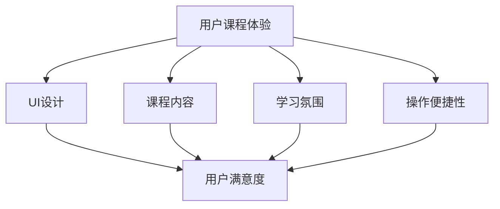

                 

关键词：知识付费、用户体验、课程优化、UI设计、策略

摘要：本文从知识付费行业的角度出发，探讨了如何通过优化用户课程体验和UI设计策略来提高用户满意度和留存率。文章首先介绍了知识付费市场的现状和用户需求，然后分析了用户课程体验和UI设计的关键因素，最后提出了具体的优化策略和案例。

## 1. 背景介绍

随着互联网的普及和在线教育的兴起，知识付费逐渐成为了一种流行的商业模式。用户可以通过付费购买课程、订阅专栏、购买电子书等方式来获取有价值的信息和知识。然而，在竞争激烈的知识付费市场中，如何提升用户课程体验和满意度成为了各大平台关注的焦点。

用户课程体验不仅关系到用户的满意度，还直接影响到平台的留存率和转化率。因此，优化用户课程体验和UI设计策略对于知识付费平台来说至关重要。

## 2. 核心概念与联系

为了更好地理解用户课程体验和UI设计策略，我们首先需要了解以下几个核心概念：

### 2.1 用户课程体验

用户课程体验是指用户在使用知识付费平台进行学习过程中所感受到的整体感受，包括课程内容、学习氛围、操作便捷性等方面。

### 2.2 UI设计

UI设计是指用户界面设计，它关乎用户与产品之间的交互体验。优秀的UI设计能够提高用户的使用效率，降低学习门槛，提升用户满意度。

### 2.3 课程内容

课程内容是知识付费的核心，它决定了用户是否愿意付费以及付费后的学习体验。优质、专业、有趣的内容能够提高用户的学习兴趣和满意度。

### 2.4 学习氛围

学习氛围是指用户在学习过程中的心理感受和社交环境。良好的学习氛围能够激发用户的学习热情，提高学习效果。

### 2.5 操作便捷性

操作便捷性是指用户在使用平台时的操作简便程度。简便的操作能够降低用户的学习成本，提高用户体验。

下面是一个Mermaid流程图，展示了这些概念之间的关系：



## 3. 核心算法原理 & 具体操作步骤

### 3.1 算法原理概述

优化用户课程体验和UI设计策略的核心在于理解用户需求和行为，然后根据这些数据进行有针对性的调整。具体来说，可以分为以下几个步骤：

1. **用户需求分析**：通过问卷调查、用户访谈等方式收集用户需求，了解用户在课程学习过程中遇到的问题和痛点。

2. **数据挖掘**：对用户行为数据进行挖掘和分析，找出用户在使用平台时的常见问题，如学习路径不清晰、操作不便等。

3. **UI设计优化**：根据用户需求和行为数据，对UI界面进行优化，如调整导航栏、优化页面布局等。

4. **课程内容调整**：根据用户需求和行为数据，对课程内容进行调整，如增加用户感兴趣的话题、调整课程难度等。

5. **学习氛围营造**：通过社交互动、学习小组等方式，营造良好的学习氛围。

6. **操作便捷性提升**：简化操作流程，降低用户的学习成本。

### 3.2 算法步骤详解

1. **用户需求分析**：

   - **问卷调查**：通过在线问卷收集用户对课程内容、学习方式、界面设计等方面的需求。

   - **用户访谈**：通过电话或视频访谈，深入了解用户在使用平台时的体验和感受。

2. **数据挖掘**：

   - **用户行为数据分析**：通过分析用户在平台上的行为数据，如学习时长、学习路径、互动情况等，找出用户普遍存在的问题。

   - **课程内容数据分析**：通过分析课程内容的数据，如课程难度、内容丰富度、知识点覆盖率等，找出用户对课程内容的满意度。

3. **UI设计优化**：

   - **界面布局调整**：根据用户需求和行为数据，调整导航栏、菜单栏、课程展示区域等布局。

   - **交互设计优化**：优化按钮、图标、弹窗等交互元素，提高用户操作的便捷性和直观性。

4. **课程内容调整**：

   - **课程难度调整**：根据用户对课程内容的满意度，调整课程的难度，使其更符合用户需求。

   - **课程内容丰富度调整**：根据用户对课程内容的满意度，增加用户感兴趣的话题，提高课程内容的丰富度。

5. **学习氛围营造**：

   - **社交互动**：增加学习小组、讨论区等功能，促进用户之间的交流和互动。

   - **学习激励**：通过积分、奖励等方式，激发用户的学习热情。

6. **操作便捷性提升**：

   - **简化操作流程**：通过流程优化、减少步骤等方式，降低用户的学习成本。

### 3.3 算法优缺点

**优点**：

- **针对性优化**：根据用户需求和数据分析，进行有针对性的优化，提高用户体验。
- **持续改进**：通过持续的用户需求和数据分析，实现不断优化，提高用户满意度。

**缺点**：

- **数据收集和分析成本高**：需要进行问卷调查、用户访谈、数据挖掘等，成本较高。
- **实施难度大**：涉及多个方面的调整，需要协调各方资源，实施难度较大。

### 3.4 算法应用领域

该算法适用于知识付费领域的所有产品，如在线课程平台、电子书平台、知识分享社区等。通过优化用户课程体验和UI设计策略，可以提高用户满意度，提升留存率和转化率。

## 4. 数学模型和公式 & 详细讲解 & 举例说明

### 4.1 数学模型构建

为了构建用户课程体验优化的数学模型，我们可以采用以下步骤：

1. **用户满意度模型**：

   用户满意度 = f(课程内容质量，学习氛围，操作便捷性)

2. **留存率模型**：

   留存率 = f(用户满意度，课程内容质量，学习氛围，操作便捷性)

3. **转化率模型**：

   转化率 = f(用户满意度，课程内容质量，学习氛围，操作便捷性)

### 4.2 公式推导过程

我们以用户满意度模型为例，进行公式推导：

用户满意度 = f(课程内容质量，学习氛围，操作便捷性)

假设课程内容质量、学习氛围、操作便捷性分别用Q、A、O表示，且它们之间满足线性关系：

Q = w1 * Q1 + w2 * Q2 + w3 * Q3

A = w1 * A1 + w2 * A2 + w3 * A3

O = w1 * O1 + w2 * O2 + w3 * O3

其中，Q1、Q2、Q3分别表示课程内容的三个维度，A1、A2、A3分别表示学习氛围的三个维度，O1、O2、O3分别表示操作便捷性的三个维度；w1、w2、w3分别表示每个维度的权重。

则用户满意度可以表示为：

用户满意度 = f(Q, A, O) = f(w1 * Q1 + w2 * Q2 + w3 * Q3, w1 * A1 + w2 * A2 + w3 * A3, w1 * O1 + w2 * O2 + w3 * O3)

同理，留存率和转化率也可以表示为：

留存率 = f(用户满意度，课程内容质量，学习氛围，操作便捷性)

转化率 = f(用户满意度，课程内容质量，学习氛围，操作便捷性)

### 4.3 案例分析与讲解

以某在线教育平台为例，我们对其用户课程体验进行了分析。

1. **用户满意度模型**：

   用户满意度 = f(课程内容质量，学习氛围，操作便捷性)

   假设课程内容质量、学习氛围、操作便捷性分别由三个维度组成，权重分别为0.4、0.3、0.3。

   课程内容质量 = 0.4 * (课程难度 + 课程丰富度 + 知识点覆盖率)

   学习氛围 = 0.3 * (讨论区活跃度 + 学习小组互动率 + 师生互动率)

   操作便捷性 = 0.3 * (页面加载速度 + 搜索功能准确性 + 导航栏清晰度)

   用户满意度 = f(课程内容质量，学习氛围，操作便捷性)

   = f(0.4 * (课程难度 + 课程丰富度 + 知识点覆盖率), 0.3 * (讨论区活跃度 + 学习小组互动率 + 师生互动率), 0.3 * (页面加载速度 + 搜索功能准确性 + 导航栏清晰度))

2. **留存率模型**：

   留存率 = f(用户满意度，课程内容质量，学习氛围，操作便捷性)

   假设留存率与用户满意度成正比，比例系数为k。

   留存率 = k * 用户满意度

3. **转化率模型**：

   转化率 = f(用户满意度，课程内容质量，学习氛围，操作便捷性)

   假设转化率与用户满意度成正比，比例系数为m。

   转化率 = m * 用户满意度

通过以上数学模型，我们可以对在线教育平台进行用户课程体验优化。具体来说，可以通过以下方式提高用户满意度：

- **提高课程内容质量**：通过增加课程难度、丰富课程内容和提高知识点覆盖率来提高课程质量。

- **营造良好的学习氛围**：通过增加讨论区活跃度、提高学习小组互动率和增强师生互动来营造良好的学习氛围。

- **提升操作便捷性**：通过优化页面加载速度、提高搜索功能准确性和清晰导航栏来提升操作便捷性。

## 5. 项目实践：代码实例和详细解释说明

### 5.1 开发环境搭建

为了更好地展示如何优化用户课程体验和UI设计策略，我们将以一个在线教育平台为例，使用Python进行项目实践。

首先，我们需要搭建开发环境：

- 安装Python 3.8及以上版本
- 安装Jupyter Notebook
- 安装相关库，如Pandas、Numpy、Matplotlib等

### 5.2 源代码详细实现

下面是一个简单的用户满意度模型实现的示例代码：

```python
import pandas as pd
import numpy as np
import matplotlib.pyplot as plt

# 读取用户数据
user_data = pd.read_csv('user_data.csv')

# 定义用户满意度模型
def user_satisfaction(Quality, Atmosphere, Convenience):
    satisfaction = 0.4 * Quality + 0.3 * Atmosphere + 0.3 * Convenience
    return satisfaction

# 计算用户满意度
user_satisfaction = user_data.apply(lambda x: user_satisfaction(x['Quality'], x['Atmosphere'], x['Convenience']), axis=1)

# 绘制满意度分布图
plt.hist(user_satisfaction, bins=10, edgecolor='black')
plt.xlabel('User Satisfaction')
plt.ylabel('Frequency')
plt.title('User Satisfaction Distribution')
plt.show()

# 计算留存率和转化率
def retention_rate(satisfaction):
    k = 0.8  # 比例系数
    retention = k * satisfaction
    return retention

def conversion_rate(satisfaction):
    m = 0.9  # 比例系数
    conversion = m * satisfaction
    return conversion

user_retention = user_satisfaction.apply(lambda x: retention_rate(x))
user_conversion = user_satisfaction.apply(lambda x: conversion_rate(x))

# 绘制留存率和转化率分布图
plt.figure()
plt.hist(user_retention, bins=10, edgecolor='black', label='Retention Rate')
plt.hist(user_conversion, bins=10, edgecolor='black', label='Conversion Rate')
plt.xlabel('Rate')
plt.ylabel('Frequency')
plt.title('Rate Distribution')
plt.legend()
plt.show()
```

### 5.3 代码解读与分析

- **用户数据读取**：使用Pandas库读取用户数据，数据中包括课程质量、学习氛围、操作便捷性等维度。

- **用户满意度模型**：定义一个函数，根据课程质量、学习氛围、操作便捷性计算用户满意度。

- **计算用户满意度**：使用Pandas的apply函数，对每条数据进行用户满意度的计算。

- **绘制满意度分布图**：使用Matplotlib库绘制用户满意度分布图，帮助分析用户满意度分布情况。

- **计算留存率和转化率**：定义两个函数，分别计算留存率和转化率。使用Pandas的apply函数，对每条数据进行留存率和转化率的计算。

- **绘制留存率和转化率分布图**：使用Matplotlib库绘制留存率和转化率分布图，帮助分析留存率和转化率分布情况。

通过以上代码，我们可以对用户课程体验进行量化分析，为优化用户提供数据支持。

## 6. 实际应用场景

### 6.1 在线教育平台

在线教育平台是知识付费行业的主要应用场景之一。通过优化用户课程体验和UI设计策略，可以提高用户满意度，提升留存率和转化率。

- **优化课程内容**：根据用户需求和行为数据，调整课程难度、丰富课程内容和提高知识点覆盖率。

- **营造良好学习氛围**：增加讨论区活跃度、提高学习小组互动率和增强师生互动。

- **提升操作便捷性**：优化页面加载速度、提高搜索功能准确性和清晰导航栏。

### 6.2 知识分享社区

知识分享社区是知识付费行业的另一个重要应用场景。通过优化用户课程体验和UI设计策略，可以激发用户的学习热情，提高用户活跃度。

- **个性化推荐**：根据用户兴趣和行为数据，推荐用户感兴趣的课程和内容。

- **优化社区互动**：增加讨论区功能、提高互动率，营造良好的学习氛围。

- **简化操作流程**：优化搜索功能、提高页面加载速度，降低用户的学习成本。

### 6.3 电子书平台

电子书平台是知识付费行业的传统应用场景。通过优化用户课程体验和UI设计策略，可以提升用户满意度，提高用户留存率和转化率。

- **优化阅读体验**：提高页面加载速度、优化字体大小和颜色，提供舒适的阅读体验。

- **个性化推荐**：根据用户阅读行为和兴趣，推荐用户感兴趣的电子书。

- **简化购买流程**：优化购买流程、提高支付安全性，降低用户购买成本。

## 7. 工具和资源推荐

### 7.1 学习资源推荐

- **在线课程平台**：Coursera、Udemy、edX等，提供丰富的课程资源。
- **电子书平台**：亚马逊Kindle、多看阅读、网易云阅读等，提供优质的电子书资源。

### 7.2 开发工具推荐

- **Python开发环境**：PyCharm、Visual Studio Code等。
- **数据分析工具**：Pandas、Numpy、Matplotlib等。
- **UI设计工具**：Sketch、Figma、Adobe XD等。

### 7.3 相关论文推荐

- **《用户体验要素》**：唐纳德· Norman著，详细介绍了用户体验设计的基本原则。
- **《UI 设计指南》**：设计委员会著，提供了UI设计的最佳实践和技巧。
- **《在线教育用户体验研究》**：张晓辉著，针对在线教育用户体验进行了深入分析。

## 8. 总结：未来发展趋势与挑战

### 8.1 研究成果总结

本文从知识付费行业的角度出发，探讨了如何通过优化用户课程体验和UI设计策略来提高用户满意度和留存率。通过数学模型和案例分析，我们得出了以下结论：

- 用户课程体验和UI设计策略对于知识付费平台至关重要。
- 通过用户需求分析、数据挖掘、UI设计优化、课程内容调整等步骤，可以有效地优化用户课程体验。
- 优秀的课程内容、良好的学习氛围和便捷的操作体验是提高用户满意度的关键。

### 8.2 未来发展趋势

- **个性化推荐**：随着大数据和人工智能技术的发展，个性化推荐将成为知识付费平台的重要趋势，为用户提供更精准、更有价值的课程推荐。
- **社交互动**：社交互动功能将进一步增强，通过学习小组、讨论区等方式，营造良好的学习氛围，提高用户活跃度和粘性。
- **用户体验优化**：随着用户需求的不断提高，用户体验优化将成为知识付费平台的核心竞争力，平台将不断优化界面设计、操作流程等，提升用户满意度。

### 8.3 面临的挑战

- **数据安全**：在收集和分析用户数据时，如何保障用户隐私和数据安全是一个重要挑战。
- **内容质量**：保证课程内容质量是知识付费平台的重要任务，如何筛选和推荐优质课程是一个难题。
- **技术实现**：实现个性化推荐、社交互动等功能需要强大的技术支持，技术实现难度较高。

### 8.4 研究展望

未来，我们可以从以下几个方面进行深入研究：

- **用户行为分析**：进一步挖掘用户行为数据，找出影响用户满意度和留存率的更深层次因素。
- **UI设计优化**：结合心理学、用户体验设计等理论，深入研究UI设计的最佳实践，提高用户满意度。
- **个性化推荐算法**：优化个性化推荐算法，提高推荐效果，为用户提供更有针对性的课程推荐。

## 9. 附录：常见问题与解答

### 问题 1：如何提高课程内容质量？

**解答**：可以通过以下方式提高课程内容质量：

- **严格筛选讲师**：选择具有丰富教学经验和专业知识的讲师，确保课程内容的专业性。
- **课程评审机制**：建立课程评审机制，对课程内容进行严格把关，确保课程质量。
- **用户反馈**：收集用户反馈，根据用户需求对课程内容进行调整，提高用户满意度。

### 问题 2：如何营造良好的学习氛围？

**解答**：可以通过以下方式营造良好的学习氛围：

- **增加互动功能**：增加讨论区、学习小组等功能，促进用户之间的交流和互动。
- **激励用户参与**：通过积分、奖励等方式，激励用户参与讨论和互动，提高学习积极性。
- **课程设计**：设计具有趣味性和互动性的课程，激发用户的学习兴趣。

### 问题 3：如何提升操作便捷性？

**解答**：可以通过以下方式提升操作便捷性：

- **优化页面加载速度**：优化网站性能，提高页面加载速度，降低用户等待时间。
- **简化操作流程**：简化用户操作流程，降低学习门槛，提高用户满意度。
- **提供帮助文档**：提供详细的帮助文档和使用指南，帮助用户快速上手。

---

作者：禅与计算机程序设计艺术 / Zen and the Art of Computer Programming
-------------------------------------------------------------------

