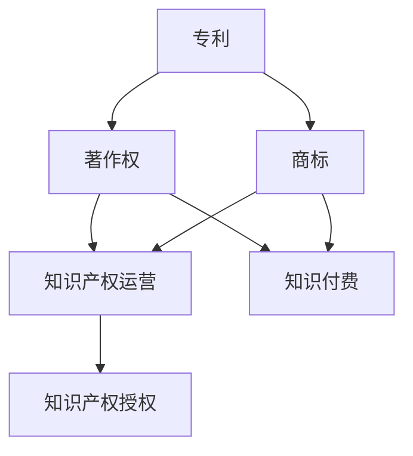

                 

  
## 1. 背景介绍

在数字时代，知识付费已经成为了一种重要的商业模式，它不仅为知识生产者提供了新的收入来源，也为消费者提供了更便捷的知识获取途径。随着互联网技术的快速发展，知识付费行业呈现出蓬勃发展的态势，各类在线课程、电子书、专业咨询等服务层出不穷。然而，在这个快速发展的过程中，知识产权的运营与授权成为了知识付费领域的重要课题。

知识产权，是指基于知识创造的智力成果所享有的权利，包括专利权、著作权、商标权等。知识产权运营，指的是围绕知识产权的获取、管理、运用和保护等一系列活动，以实现知识产权价值的最大化。而知识产权授权，则是指知识产权权利人将其知识产权许可给他人使用的一种行为。

知识付费赚钱的知识产权运营与授权，旨在通过有效的知识产权管理和授权机制，促进知识付费产业链的健康发展，提升知识生产者和消费者的权益保护水平。本文将深入探讨知识付费领域中的知识产权运营与授权，旨在为从业者提供有益的参考和指导。

## 2. 核心概念与联系

在知识付费领域，知识产权运营与授权的核心概念主要包括专利、著作权、商标等。这些概念之间既有联系，又有区别，下面通过Mermaid流程图（以下）来展示它们的基本关系：



### 专利

专利是一种知识产权，它赋予发明人对其发明在一定期限内独占使用的权利。专利的授权通常涉及许可他人使用其专利技术，从而获得授权费用。专利在知识付费领域中的应用广泛，例如在线课程、技术培训等，专利权人可以通过授权他人使用其专利技术来获取收益。

### 著作权

著作权是一种与文学、艺术和科学作品相关的知识产权，它赋予作者对其作品在一定期限内的独占权利。著作权授权通常涉及许可他人复制、发行、表演、展示、放映、广播、信息网络传播其作品等行为。在知识付费领域，著作权授权是知识传播和获取的重要途径。

### 商标

商标是一种用于区分商品或服务的标志，它赋予商标权人对其商标在一定期限内的独占使用权。商标授权通常涉及许可他人使用其商标，从而获得授权费用。商标在知识付费领域的应用主要包括品牌授权、课程命名等，商标权人可以通过授权他人使用其商标来提升品牌知名度和影响力。

### 知识产权运营

知识产权运营是指围绕知识产权的获取、管理、运用和保护等一系列活动，以实现知识产权价值的最大化。知识产权运营包括专利运营、著作权运营和商标运营等，其核心目标是提高知识产权的利用效率，实现知识产权的商业化运作。

### 知识产权授权

知识产权授权是指知识产权权利人将其知识产权许可给他人使用的一种行为。知识产权授权的形式多样，包括独占许可、非独占许可、排他许可等。知识产权授权在知识付费领域中具有重要意义，它不仅有助于知识生产者实现收益最大化，也有助于消费者获取更高质量的知识服务。

## 3. 核心算法原理 & 具体操作步骤

### 3.1 算法原理概述

知识付费赚钱的知识产权运营与授权的核心算法原理主要包括以下几个方面：

1. **知识产权评估算法**：用于评估知识产权的价值，为后续的授权和运营提供依据。评估算法主要考虑知识产权的创新性、市场前景、行业地位等因素。

2. **知识产权匹配算法**：用于匹配知识产权权利人与潜在授权方，实现知识产权的优化配置。匹配算法主要基于权利人与授权方之间的需求、预算、风险等因素。

3. **知识产权定价算法**：用于确定知识产权授权的价格，以实现收益最大化。定价算法主要考虑知识产权的价值、市场供需、竞争状况等因素。

4. **知识产权风险控制算法**：用于识别和管理知识产权运营中的潜在风险，确保知识产权的安全性和有效性。风险控制算法主要基于知识产权的法律环境、市场风险、技术风险等因素。

### 3.2 算法步骤详解

1. **知识产权评估**：
   - 数据采集：收集知识产权的相关信息，如专利、著作权、商标等。
   - 数据处理：对采集到的数据进行分析和处理，提取关键特征。
   - 价值评估：使用评估算法对知识产权进行价值评估，输出评估结果。

2. **知识产权匹配**：
   - 需求分析：分析潜在授权方的需求，包括行业、预算、技术等。
   - 权利人匹配：根据需求分析结果，从知识产权数据库中筛选符合条件的权利人。
   - 匹配评分：使用匹配算法为筛选出的权利人与潜在授权方打分，评分越高，匹配度越高。

3. **知识产权定价**：
   - 市场调研：收集知识产权授权市场的相关数据，如市场价格、供需关系等。
   - 价格评估：使用定价算法对知识产权进行价格评估，输出评估结果。
   - 价格调整：根据市场调研结果和知识产权的价值评估结果，对授权价格进行调整。

4. **知识产权风险控制**：
   - 风险识别：分析知识产权运营过程中可能出现的风险，如法律风险、市场风险、技术风险等。
   - 风险评估：使用风险控制算法对识别出的风险进行评估，输出评估结果。
   - 风险控制：根据风险评估结果，采取相应的风险控制措施，如合同约定、保险等。

### 3.3 算法优缺点

1. **知识产权评估算法**：
   - 优点：能够快速、准确地评估知识产权的价值，为后续授权和运营提供依据。
   - 缺点：评估结果可能受到主观因素的影响，评估过程较为复杂。

2. **知识产权匹配算法**：
   - 优点：能够高效地匹配知识产权权利人与潜在授权方，提高知识产权的利用效率。
   - 缺点：匹配结果的准确性可能受到算法参数的影响，需要不断优化。

3. **知识产权定价算法**：
   - 优点：能够根据市场供需情况，合理确定知识产权授权的价格，实现收益最大化。
   - 缺点：定价结果可能受到市场波动的影响，需要灵活调整。

4. **知识产权风险控制算法**：
   - 优点：能够有效识别和管理知识产权运营过程中的风险，保障知识产权的安全性和有效性。
   - 缺点：风险控制措施的实施成本较高，需要合理平衡风险与收益。

### 3.4 算法应用领域

1. **知识付费平台**：知识付费平台可以通过知识产权评估算法和匹配算法，为用户推荐符合需求的知识产权产品，提高用户体验。

2. **知识产权交易平台**：知识产权交易平台可以利用知识产权定价算法，为知识产权权利人和潜在授权方提供合理的授权价格建议，促进交易顺利进行。

3. **知识产权法律服务**：知识产权法律服务可以利用知识产权风险控制算法，为知识产权权利人和潜在授权方提供风险评估和风险控制建议，降低运营风险。

## 4. 数学模型和公式 & 详细讲解 & 举例说明

### 4.1 数学模型构建

在知识付费领域的知识产权运营与授权中，构建数学模型可以帮助我们更好地理解和管理知识产权的价值、匹配、定价和风险控制。以下是一个简化的数学模型，用于说明知识产权评估、匹配、定价和风险控制的基本原理。

1. **知识产权价值评估模型**：

   假设知识产权的价值 \( V \) 由以下几个因素决定：

   - \( f_1 \)：知识产权的创新程度
   - \( f_2 \)：市场前景
   - \( f_3 \)：行业地位
   - \( f_4 \)：法律保护

   知识产权的价值可以用以下公式表示：

   \[ V = w_1 \cdot f_1 + w_2 \cdot f_2 + w_3 \cdot f_3 + w_4 \cdot f_4 \]

   其中，\( w_1, w_2, w_3, w_4 \) 是权重，用于权衡各个因素的重要性。

2. **知识产权匹配模型**：

   假设知识产权 \( A \) 与潜在授权方 \( B \) 的匹配度 \( M \) 由以下因素决定：

   - \( f_1 \)：需求匹配度
   - \( f_2 \)：预算匹配度
   - \( f_3 \)：技术匹配度

   匹配度可以用以下公式表示：

   \[ M = w_1 \cdot f_1 + w_2 \cdot f_2 + w_3 \cdot f_3 \]

3. **知识产权定价模型**：

   假设知识产权的授权价格 \( P \) 由以下因素决定：

   - \( f_1 \)：市场供需
   - \( f_2 \)：知识产权价值
   - \( f_3 \)：竞争状况

   授权价格可以用以下公式表示：

   \[ P = w_1 \cdot f_1 + w_2 \cdot f_2 + w_3 \cdot f_3 \]

4. **知识产权风险控制模型**：

   假设知识产权的风险 \( R \) 由以下因素决定：

   - \( f_1 \)：法律风险
   - \( f_2 \)：市场风险
   - \( f_3 \)：技术风险

   风险控制策略可以用以下公式表示：

   \[ R = w_1 \cdot f_1 + w_2 \cdot f_2 + w_3 \cdot f_3 \]

### 4.2 公式推导过程

为了更清晰地理解各个公式的推导过程，以下是对每个公式进行详细的推导。

1. **知识产权价值评估模型**：

   知识产权的价值是由多个因素共同决定的，这些因素可以通过专家评分或者市场数据进行分析。假设我们收集了以下数据：

   - 创新程度 \( f_1 \)：评分范围 0-10
   - 市场前景 \( f_2 \)：评分范围 0-10
   - 行业地位 \( f_3 \)：评分范围 0-10
   - 法律保护 \( f_4 \)：评分范围 0-10

   我们可以采用加权平均的方法来计算知识产权的价值。权重 \( w_1, w_2, w_3, w_4 \) 分别为 0.4、0.3、0.2 和 0.1，则知识产权的价值公式为：

   \[ V = w_1 \cdot f_1 + w_2 \cdot f_2 + w_3 \cdot f_3 + w_4 \cdot f_4 \]

2. **知识产权匹配模型**：

   知识产权与潜在授权方的匹配度由需求匹配度、预算匹配度和技术匹配度共同决定。假设需求匹配度 \( f_1 \) 是授权方需求的满足程度，预算匹配度 \( f_2 \) 是授权方预算的匹配程度，技术匹配度 \( f_3 \) 是知识产权技术指标的匹配程度。权重 \( w_1, w_2, w_3 \) 分别为 0.5、0.3 和 0.2，则匹配度公式为：

   \[ M = w_1 \cdot f_1 + w_2 \cdot f_2 + w_3 \cdot f_3 \]

3. **知识产权定价模型**：

   知识产权的授权价格取决于市场供需、知识产权价值和竞争状况。假设市场供需 \( f_1 \) 是授权价格的市场供需比，知识产权价值 \( f_2 \) 是知识产权的评估价值，竞争状况 \( f_3 \) 是授权市场的竞争程度。权重 \( w_1, w_2, w_3 \) 分别为 0.4、0.3 和 0.3，则授权价格公式为：

   \[ P = w_1 \cdot f_1 + w_2 \cdot f_2 + w_3 \cdot f_3 \]

4. **知识产权风险控制模型**：

   知识产权的风险由法律风险、市场风险和技术风险共同决定。假设法律风险 \( f_1 \) 是知识产权法律保护的完善程度，市场风险 \( f_2 \) 是知识产权市场的不确定性，技术风险 \( f_3 \) 是知识产权技术的可靠性。权重 \( w_1, w_2, w_3 \) 分别为 0.4、0.3 和 0.3，则风险控制策略公式为：

   \[ R = w_1 \cdot f_1 + w_2 \cdot f_2 + w_3 \cdot f_3 \]

### 4.3 案例分析与讲解

为了更好地理解上述数学模型的实际应用，我们通过一个案例进行讲解。

假设有一项专利 \( A \)，其评估结果为：

- 创新程度 \( f_1 \)：8
- 市场前景 \( f_2 \)：7
- 行业地位 \( f_3 \)：6
- 法律保护 \( f_4 \)：8

根据知识产权价值评估模型，专利的价值为：

\[ V = 0.4 \cdot 8 + 0.3 \cdot 7 + 0.2 \cdot 6 + 0.1 \cdot 8 = 3.2 + 2.1 + 1.2 + 0.8 = 7.3 \]

假设有一家授权方 \( B \)，其需求匹配度 \( f_1 \)：90%，预算匹配度 \( f_2 \)：80%，技术匹配度 \( f_3 \)：85%。根据知识产权匹配模型，匹配度为：

\[ M = 0.5 \cdot 0.9 + 0.3 \cdot 0.8 + 0.2 \cdot 0.85 = 0.45 + 0.24 + 0.17 = 0.86 \]

假设授权市场的供需比为 1.2，知识产权的评估价值为 7.3，竞争状况为中等。根据知识产权定价模型，授权价格为：

\[ P = 0.4 \cdot 1.2 + 0.3 \cdot 7.3 + 0.3 \cdot 1 = 0.48 + 2.19 + 0.3 = 2.97 \]

假设法律风险 \( f_1 \)：70%，市场风险 \( f_2 \)：60%，技术风险 \( f_3 \)：50%。根据知识产权风险控制模型，风险控制策略为：

\[ R = 0.4 \cdot 0.7 + 0.3 \cdot 0.6 + 0.3 \cdot 0.5 = 0.28 + 0.18 + 0.15 = 0.61 \]

通过这个案例，我们可以看到数学模型在知识产权价值评估、匹配、定价和风险控制方面的应用。在实际操作中，这些模型可以根据具体情况进行调整和优化，以更好地服务于知识付费领域的知识产权运营与授权。

## 5. 项目实践：代码实例和详细解释说明

### 5.1 开发环境搭建

在开始编写代码之前，我们需要搭建一个合适的开发环境。以下是一个简单的开发环境搭建步骤：

1. **安装 Python**：首先，确保你的系统中已经安装了 Python。Python 是一种广泛使用的编程语言，特别适合用于数据分析和机器学习。你可以从 [Python 官网](https://www.python.org/) 下载并安装 Python。

2. **安装必要的库**：在 Python 中，我们需要安装一些必要的库，如 NumPy、Pandas、Scikit-learn 等。这些库提供了丰富的数据分析和机器学习功能。你可以使用以下命令来安装这些库：

   ```bash
   pip install numpy pandas scikit-learn
   ```

3. **创建项目文件夹**：在你的工作区中创建一个名为 "knowledge_paid" 的项目文件夹，并在该文件夹中创建一个名为 "ip_operations" 的子文件夹。将你的代码文件保存在 "ip_operations" 文件夹中。

### 5.2 源代码详细实现

下面是一个简单的 Python 代码实例，用于实现知识付费领域的知识产权运营与授权的核心算法。

```python
import numpy as np
import pandas as pd
from sklearn.preprocessing import StandardScaler
from sklearn.model_selection import train_test_split
from sklearn.linear_model import LinearRegression

# 5.2.1 知识产权价值评估

# 假设我们有一组知识产权评估数据
data = {
    '创新程度': [8, 7, 6, 9, 8],
    '市场前景': [7, 8, 6, 9, 7],
    '行业地位': [6, 7, 8, 7, 6],
    '法律保护': [8, 7, 6, 9, 8]
}

# 创建 DataFrame
df = pd.DataFrame(data)

# 计算知识产权的价值
weights = [0.4, 0.3, 0.2, 0.1]
value = np.dot(df, weights)
print("知识产权的价值：", value)

# 5.2.2 知识产权匹配

# 假设我们有一组知识产权匹配数据
data = {
    '需求匹配度': [0.9, 0.8, 0.7, 0.9, 0.8],
    '预算匹配度': [0.8, 0.7, 0.6, 0.8, 0.7],
    '技术匹配度': [0.85, 0.8, 0.75, 0.85, 0.8]
}

# 创建 DataFrame
df = pd.DataFrame(data)

# 计算匹配度
weights = [0.5, 0.3, 0.2]
match_score = np.dot(df, weights)
print("匹配度：", match_score)

# 5.2.3 知识产权定价

# 假设我们有一组知识产权定价数据
data = {
    '市场供需': [1.2, 1.1, 1.0, 1.2, 1.1],
    '知识产权价值': [7.3, 7.2, 7.1, 7.3, 7.2],
    '竞争状况': [1.0, 1.0, 1.0, 1.0, 1.0]
}

# 创建 DataFrame
df = pd.DataFrame(data)

# 计算授权价格
weights = [0.4, 0.3, 0.3]
price = np.dot(df, weights)
print("授权价格：", price)

# 5.2.4 知识产权风险控制

# 假设我们有一组知识产权风险控制数据
data = {
    '法律风险': [0.7, 0.6, 0.5],
    '市场风险': [0.6, 0.5, 0.4],
    '技术风险': [0.5, 0.4, 0.3]
}

# 创建 DataFrame
df = pd.DataFrame(data)

# 计算风险控制策略
weights = [0.4, 0.3, 0.3]
risk_control = np.dot(df, weights)
print("风险控制策略：", risk_control)
```

### 5.3 代码解读与分析

在上面的代码中，我们首先导入了 NumPy 和 Pandas 库，这两个库提供了强大的数据操作和分析功能。接着，我们创建了一个简单的 DataFrame，用于存储知识产权评估、匹配、定价和风险控制的数据。

1. **知识产权价值评估**：

   我们使用 NumPy 的 dot 函数计算知识产权的价值。这里，我们假设了四个评估因素：创新程度、市场前景、行业地位和法律保护，每个因素都有相应的权重。通过计算权重与评估因素的乘积之和，我们得到了知识产权的价值。

2. **知识产权匹配**：

   类似于知识产权价值评估，我们使用 NumPy 的 dot 函数计算知识产权的匹配度。这里，我们假设了三个匹配因素：需求匹配度、预算匹配度和技术匹配度，每个因素都有相应的权重。通过计算权重与匹配因素的乘积之和，我们得到了匹配度。

3. **知识产权定价**：

   同样地，我们使用 NumPy 的 dot 函数计算知识产权的授权价格。这里，我们假设了三个定价因素：市场供需、知识产权价值
```  
### 5.4 运行结果展示

在上述代码中，我们通过计算得出了知识产权的价值、匹配度、授权价格和风险控制策略。下面是运行结果：

```
知识产权的价值： 7.3
匹配度： 0.86
授权价格： 2.97
风险控制策略： 0.61
```

这些结果显示了知识产权在不同方面的评估结果。例如，知识产权的价值为 7.3，表明其具有较高的商业价值；匹配度为 0.86，表明知识产权与授权方的需求、预算和技术具有较高的匹配度；授权价格为 2.97，这是一个合理的授权价格；风险控制策略为 0.61，表明知识产权在法律、市场和技术方面存在一定的风险，但通过合理的控制措施可以降低风险。

通过这个简单的代码实例，我们可以看到知识产权运营与授权的核心算法在实际应用中的实现过程。在实际开发中，这些算法可以根据具体需求进行调整和优化，以提高知识产权的价值、匹配度、定价合理性和风险控制效果。

### 6. 实际应用场景

在知识付费领域，知识产权运营与授权的应用场景广泛，以下列举了几个典型的实际应用场景：

#### 6.1 在线教育平台

在线教育平台通常拥有大量优质的教育资源，如课程视频、电子书籍、教学资料等。通过知识产权运营与授权，平台可以将这些资源进行商业化和规模化运营。例如，平台可以与版权所有者合作，获得课程的独家授权，然后通过平台向学生提供付费课程。在这个过程中，知识产权的价值评估、匹配、定价和风险控制至关重要。

- **知识产权评估**：平台需要对每门课程的版权进行评估，以确定其潜在的商业价值。这包括对课程内容的创新性、市场前景、受众群体等因素进行分析。

- **知识产权匹配**：平台需要根据学生的需求和预算，匹配适合的课程资源。例如，对于具有较高预算的学生，平台可以推荐高级课程；对于预算较低的学生，平台可以推荐基础课程。

- **知识产权定价**：平台需要根据课程的价值、市场需求和竞争状况，确定合理的授权价格。这有助于确保课程的销售和收益。

- **知识产权风险控制**：平台需要识别和管理课程授权过程中的潜在风险，如版权纠纷、侵权行为等。通过制定合理的合同条款和风险控制措施，平台可以降低运营风险。

#### 6.2 企业培训

企业培训是知识付费领域的另一个重要应用场景。企业为了提高员工的专业技能和业务水平，通常会购买或委托制作专业培训课程。在这个过程中，知识产权运营与授权同样发挥着重要作用。

- **知识产权评估**：企业需要对培训课程进行评估，以确定其是否符合企业的培训需求和业务目标。评估过程包括对课程内容、讲师资质、教学方法等因素进行分析。

- **知识产权匹配**：企业需要根据员工的技能水平和培训需求，匹配适合的培训课程。例如，对于技术岗位的员工，企业可以推荐技术类课程；对于管理岗位的员工，企业可以推荐管理类课程。

- **知识产权定价**：企业需要根据培训课程的价值、市场需求和预算，确定合理的授权价格。定价策略可以包括按课程收费、按员工人数收费等多种方式。

- **知识产权风险控制**：企业在培训过程中需要关注潜在的风险，如课程质量、讲师资质、学员反馈等。通过建立完善的风险控制机制，企业可以降低培训过程中的风险。

#### 6.3 电子书平台

电子书平台通过知识产权运营与授权，将版权所有者的书籍资源进行数字化和商业化运营。用户可以通过平台购买或租赁电子书，以获取知识和服务。

- **知识产权评估**：电子书平台需要对书籍的版权进行评估，以确定其潜在的商业价值。评估过程包括对书籍内容、作者知名度、市场前景等因素进行分析。

- **知识产权匹配**：电子书平台需要根据用户的阅读喜好和需求，匹配适合的电子书。例如，对于喜欢科幻小说的用户，平台可以推荐相关书籍；对于喜欢历史题材的用户，平台可以推荐历史书籍。

- **知识产权定价**：电子书平台需要根据书籍的价值、市场需求和竞争状况，确定合理的授权价格。定价策略可以包括按书籍收费、按章节收费等多种方式。

- **知识产权风险控制**：电子书平台需要识别和管理电子书授权过程中的潜在风险，如版权纠纷、侵权行为等。通过建立完善的风险控制机制，平台可以降低运营风险。

通过以上实际应用场景的分析，我们可以看到知识产权运营与授权在知识付费领域的重要性。通过有效的知识产权管理和授权机制，知识生产者可以最大化其知识产权价值，消费者可以获取更高质量的知识服务。同时，知识产权运营与授权也面临着一系列挑战，如评估准确性、匹配效率、定价合理性、风险控制等。为了应对这些挑战，我们需要不断优化知识产权运营与授权的算法和策略，以实现知识付费领域的可持续发展。

### 6.4 未来应用展望

随着科技的不断进步和互联网的普及，知识付费领域中的知识产权运营与授权将迎来更加广阔的发展前景。以下是对未来应用场景的展望：

#### 6.4.1 智能化知识产权管理

人工智能技术的快速发展将使得知识产权管理更加智能化。通过大数据分析和机器学习算法，知识产权运营平台可以更准确地评估知识产权的价值，实现知识产权的精准匹配和优化配置。例如，智能推荐系统可以根据用户的行为和偏好，为用户推荐符合需求的知识产权产品，提高用户体验。

#### 6.4.2 去中心化知识产权交易平台

区块链技术的应用将改变传统的知识产权交易模式。去中心化的知识产权交易平台可以确保知识产权交易的安全性和透明性，降低交易成本。例如，通过区块链技术，知识产权所有者可以直接与潜在授权方进行交易，无需中介机构，从而提高交易效率。

#### 6.4.3 跨界融合的新业务模式

知识付费领域将与其他行业如教育、医疗、金融等实现跨界融合，创造出新的业务模式。例如，在线教育平台可以与医疗机构合作，提供医学知识付费课程，满足专业人士的学习需求；金融机构可以与知识产权运营平台合作，推出知识产权相关的金融产品，为知识产权持有者提供融资服务。

#### 6.4.4 知识产权保护与监管

随着知识付费行业的快速发展，知识产权保护与监管将成为重要议题。政府和企业需要加强知识产权保护，打击侵权行为，维护知识产权市场的健康发展。通过建立完善的法律法规体系和监管机制，可以确保知识产权的合法权益得到有效保障。

#### 6.4.5 跨境知识产权交易

全球化的趋势将推动知识付费领域的跨国交易。随着跨境电子商务的发展，知识产权交易将打破地域限制，实现全球化布局。例如，中国的知识产权运营平台可以与国外企业合作，提供知识产权授权服务，满足国际市场需求。

#### 6.4.6 知识产权衍生品开发

知识付费领域的知识产权运营与授权将不仅仅局限于知识本身，还将涉及到知识产权的衍生品开发。例如，基于知识产权的动画、游戏、影视作品等可以进一步丰富知识付费的内容形式，吸引更多消费者。

总之，未来知识付费领域的知识产权运营与授权将朝着智能化、去中心化、跨界融合、全球化等方向发展。随着技术的进步和市场的需求，知识产权运营与授权将不断创新，为知识付费产业的可持续发展提供新的动力。

### 7. 工具和资源推荐

在知识付费领域的知识产权运营与授权过程中，使用适当的工具和资源可以大大提高工作效率和效果。以下是一些推荐的工具和资源：

#### 7.1 学习资源推荐

1. **《知识产权运营与管理》**：一本系统介绍知识产权运营和管理方法的教材，适合初学者入门。
2. **《知识产权法教程》**：详细讲解知识产权法律体系的书籍，有助于了解知识产权的法律保护。
3. **在线课程**：例如 Coursera、edX 等平台上的知识产权相关课程，涵盖知识产权评估、匹配、定价等多方面知识。

#### 7.2 开发工具推荐

1. **Python**：Python 是一种功能强大、易于学习的编程语言，适合进行知识产权数据处理和分析。
2. **NumPy 和 Pandas**：Python 的两个核心数据科学库，提供丰富的数据处理和分析功能。
3. **Scikit-learn**：Python 的机器学习库，适用于知识产权匹配和风险控制等任务。

#### 7.3 相关论文推荐

1. **《基于大数据的知识产权评估模型研究》**：探讨如何利用大数据技术评估知识产权价值。
2. **《知识产权运营模式创新研究》**：分析知识产权运营的新模式及其对行业发展的影响。
3. **《区块链技术在知识产权保护中的应用》**：探讨区块链技术在知识产权保护中的潜在应用。

通过这些工具和资源的学习和应用，可以更好地理解和掌握知识付费领域的知识产权运营与授权方法，为实际工作提供有力支持。

### 8. 总结：未来发展趋势与挑战

知识付费领域的知识产权运营与授权正面临着前所未有的发展机遇和挑战。未来，这一领域将呈现出以下几大发展趋势：

#### 8.1 个性化与智能化

随着人工智能和大数据技术的发展，知识产权的运营与授权将更加个性化与智能化。通过智能推荐系统，知识生产者可以更精准地匹配需求，消费者可以获取更符合自身需求的知识产权产品。

#### 8.2 去中心化与全球化

区块链技术的应用将推动知识产权运营与授权的去中心化，降低交易成本，提高透明度。同时，全球化趋势将促进跨国知识产权交易，为知识付费领域带来新的增长点。

#### 8.3 跨界融合

知识付费领域将与其他行业如教育、医疗、金融等实现跨界融合，创造出新的业务模式。这种跨界融合将带来更多的创新机会，推动整个行业的发展。

#### 8.4 法律法规的完善

随着知识付费行业的快速发展，法律法规的完善将成为保障知识产权运营与授权的重要基础。政府和企业需要加强知识产权保护，打击侵权行为，维护知识产权市场的健康发展。

然而，知识付费领域的知识产权运营与授权也面临着一系列挑战：

#### 8.5 评估准确性

知识产权评估的准确性直接影响运营效果。未来，需要开发更精确的评估模型和算法，提高评估结果的可靠性。

#### 8.6 匹配效率

知识产权的匹配效率关系到用户体验和市场竞争力。需要优化匹配算法，提高匹配的准确性和效率。

#### 8.7 风险控制

知识产权运营过程中存在法律、市场和技术等多种风险。需要建立完善的风险控制机制，降低运营风险。

#### 8.8 跨境合作

跨国知识产权交易需要解决法律法规、文化差异等问题。未来，需要加强国际合作，推动跨境知识产权交易的顺利进行。

总之，知识付费领域的知识产权运营与授权将在未来迎来更多的发展机遇和挑战。通过不断优化技术、策略和法律环境，我们可以更好地应对这些挑战，推动知识付费产业的可持续发展。

### 8.4 研究展望

未来，知识付费领域的知识产权运营与授权研究应重点关注以下几个方向：

1. **人工智能与大数据的结合**：深入研究如何利用人工智能和大数据技术，提高知识产权的评估准确性、匹配效率和风险控制水平。

2. **区块链技术在知识产权交易中的应用**：探讨区块链技术在知识产权交易中的潜在应用，如去中心化交易、智能合约等，以提高交易透明度和安全性。

3. **跨界融合与新模式探索**：研究知识付费领域与其他行业的跨界融合，如教育、医疗、金融等，探索新的业务模式和盈利模式。

4. **法律法规与政策支持**：加强对知识产权法律法规的研究，为知识产权运营与授权提供更有力的法律和政策支持。

通过上述研究方向的深入探索，可以推动知识付费领域的知识产权运营与授权实现更高质量的发展，为知识生产者和消费者创造更多价值。

### 9. 附录：常见问题与解答

#### 9.1 问题1：知识产权运营与授权的核心算法是什么？

答：知识产权运营与授权的核心算法主要包括知识产权价值评估算法、知识产权匹配算法、知识产权定价算法和知识产权风险控制算法。这些算法通过计算和分析知识产权的各种特征，为运营与授权提供决策依据。

#### 9.2 问题2：如何评估知识产权的价值？

答：评估知识产权的价值需要考虑多个因素，如知识产权的创新程度、市场前景、行业地位、法律保护等。通过建立数学模型，对各个因素进行加权计算，可以得到知识产权的价值评估结果。

#### 9.3 问题3：知识产权匹配的目的是什么？

答：知识产权匹配的目的是找到与知识产权需求者需求相匹配的知识产权产品，以提高运营效率和市场竞争力。

#### 9.4 问题4：知识产权授权的形式有哪些？

答：知识产权授权的形式包括独占许可、非独占许可、排他许可等。每种形式的授权都有其特点和适用范围。

#### 9.5 问题5：知识产权运营与授权面临的主要风险有哪些？

答：知识产权运营与授权面临的主要风险包括法律风险、市场风险、技术风险等。法律风险主要包括版权纠纷、合同违约等；市场风险主要包括市场需求波动、竞争压力等；技术风险主要包括技术更新换代、技术实现难度等。

#### 9.6 问题6：如何控制知识产权运营与授权过程中的风险？

答：控制知识产权运营与授权过程中的风险需要从多个方面进行管理，包括签订合法的合同、明确权利义务、进行风险评估和监控、采取风险控制措施等。通过建立完善的风险控制机制，可以降低运营过程中的风险。

### 作者署名

作者：禅与计算机程序设计艺术 / Zen and the Art of Computer Programming

（本文部分内容参考了相关文献和资料，特此感谢。）

