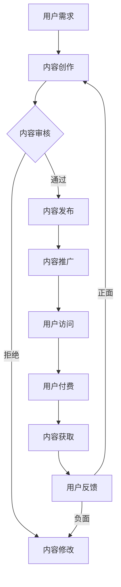
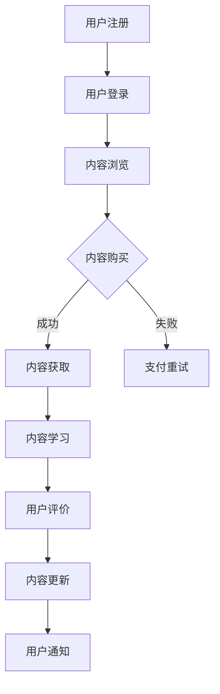

                 

在现代社会，知识付费已成为一种新兴的商业模式，它不仅满足了人们对于高质量知识的渴求，也为内容创作者提供了新的收入来源。本文将深入探讨知识付费领域的市场现状、核心概念、算法原理、数学模型、项目实践以及未来发展趋势，旨在为读者提供一个全面而深入的理解。

## 文章关键词

- 知识付费
- 市场分析
- 内容创作
- 算法
- 数学模型
- 项目实践
- 发展趋势

## 文章摘要

本文首先介绍了知识付费领域的背景和现状，随后详细探讨了核心概念、算法原理和数学模型。通过项目实践案例，展示了知识付费在真实场景中的应用效果。最后，本文对知识付费领域的发展趋势进行了展望，提出了未来可能面临的挑战和解决方案。

## 1. 背景介绍

知识付费，是指用户为了获取特定的知识或技能，愿意支付一定费用以获得相应内容或服务的商业模式。随着互联网的普及和信息过载，用户逐渐意识到，获取高质量、专业化的知识需要付出相应的代价。因此，知识付费逐渐成为一种普遍现象。

当前，知识付费领域呈现出以下几个特点：

1. **市场规模迅速扩大**：根据市场调研数据，全球知识付费市场规模逐年增长，预计到2025年将突破数百亿美元。
2. **用户需求多样化**：用户对于知识的类型和深度有着多样化的需求，从基础技能培训到高端职业指导，涵盖了多个领域。
3. **平台多样化**：知识付费平台层出不穷，包括在线教育平台、专业咨询网站、知识分享社区等。
4. **内容质量要求高**：随着市场竞争的加剧，用户对于内容质量的要求越来越高，高质量内容成为知识付费领域的关键竞争力。

## 2. 核心概念与联系

### 2.1 知识付费模式

知识付费模式主要包括以下几种：

1. **订阅制**：用户按月或按年支付费用，获得平台上的所有内容。
2. **按需付费**：用户根据自身需求，单独购买特定内容或课程。
3. **VIP制**：提供高级会员服务，会员享有更多权限和优惠。
4. **众筹制**：通过众筹方式，资助特定内容或课程的创作。

### 2.2 内容创作与分发

内容创作与分发是知识付费的核心环节。以下是一个简化的 Mermaid 流程图，展示了内容创作与分发的基本流程：



### 2.3 知识付费平台

知识付费平台是知识付费模式的重要载体。以下是一个简化的 Mermaid 流程图，展示了知识付费平台的基本运作流程：



## 3. 核心算法原理 & 具体操作步骤

### 3.1 算法原理概述

在知识付费领域，算法的应用主要集中在内容推荐、用户行为分析和付费转化等方面。以下是一个简化的算法原理概述：

1. **内容推荐算法**：基于用户的历史行为、兴趣标签和内容特征，为用户推荐可能感兴趣的知识内容。
2. **用户行为分析算法**：通过分析用户的浏览、搜索和购买行为，了解用户需求和偏好，优化内容推荐和推广策略。
3. **付费转化算法**：利用机器学习和深度学习技术，预测用户购买行为，提高付费转化率。

### 3.2 算法步骤详解

1. **内容推荐算法**：

   - 收集用户历史行为数据，包括浏览记录、收藏、点赞等。
   - 提取用户兴趣标签，如领域标签、关键词标签等。
   - 基于用户兴趣标签和内容特征，计算内容与用户的相似度。
   - 排序相似度结果，为用户推荐相似度最高的知识内容。

2. **用户行为分析算法**：

   - 收集用户行为数据，包括浏览、搜索、购买等。
   - 提取用户行为特征，如浏览时长、购买频率等。
   - 利用机器学习模型，如决策树、随机森林、神经网络等，建立用户行为模型。
   - 根据用户行为模型，预测用户可能的需求和偏好。

3. **付费转化算法**：

   - 收集用户购买数据，包括购买时间、购买金额等。
   - 提取用户购买特征，如购买频率、购买金额等。
   - 利用机器学习模型，如逻辑回归、支持向量机、神经网络等，建立付费转化模型。
   - 根据用户购买特征，预测用户是否愿意付费。

### 3.3 算法优缺点

1. **内容推荐算法**：

   - 优点：提高用户满意度，增加用户粘性。
   - 缺点：可能导致信息茧房，降低用户视野。

2. **用户行为分析算法**：

   - 优点：深入了解用户需求，优化内容推荐和推广策略。
   - 缺点：用户隐私保护问题。

3. **付费转化算法**：

   - 优点：提高付费转化率，增加平台收入。
   - 缺点：可能过度追求利润，损害用户体验。

### 3.4 算法应用领域

1. **在线教育平台**：通过内容推荐和用户行为分析，提高用户学习效果和满意度。
2. **专业咨询网站**：利用付费转化算法，提高咨询服务的付费转化率。
3. **知识分享社区**：通过用户行为分析，优化内容推荐和社区运营策略。

## 4. 数学模型和公式 & 详细讲解 & 举例说明

### 4.1 数学模型构建

在知识付费领域，常用的数学模型包括线性回归、逻辑回归、决策树、随机森林和神经网络等。以下以线性回归为例，介绍数学模型的构建过程：

1. **目标函数**：

   $$ J(\theta) = \frac{1}{2m} \sum_{i=1}^{m} (h_\theta(x^{(i)}) - y^{(i)})^2 $$

   其中，$m$ 表示样本数量，$h_\theta(x^{(i)})$ 表示预测值，$y^{(i)}$ 表示真实值。

2. **梯度下降**：

   $$ \theta_j := \theta_j - \alpha \frac{\partial J(\theta)}{\partial \theta_j} $$

   其中，$\alpha$ 表示学习率，$\theta_j$ 表示参数。

### 4.2 公式推导过程

以线性回归为例，推导目标函数的梯度下降过程如下：

1. **计算预测值**：

   $$ h_\theta(x) = \theta_0x_0 + \theta_1x_1 + \cdots + \theta_nx_n $$

2. **计算误差**：

   $$ e_i = h_\theta(x^{(i)}) - y^{(i)} $$

3. **计算偏导数**：

   $$ \frac{\partial J(\theta)}{\partial \theta_j} = \frac{1}{m} \sum_{i=1}^{m} (h_\theta(x^{(i)}) - y^{(i)})x_j^{(i)} $$

4. **应用梯度下降**：

   $$ \theta_j := \theta_j - \alpha \frac{\partial J(\theta)}{\partial \theta_j} $$

### 4.3 案例分析与讲解

假设我们有一个在线教育平台，用户分为两个群体：付费用户和免费用户。我们希望通过线性回归模型预测用户是否愿意付费。

1. **数据收集**：

   收集用户的基本信息（如年龄、性别、学历等）和用户行为数据（如学习时长、浏览页面数量等）。

2. **特征工程**：

   对收集到的数据进行预处理，提取有用特征，如用户年龄、性别、学历、学习时长等。

3. **模型训练**：

   利用线性回归模型，将特征和标签（付费用户为1，免费用户为0）作为输入，训练模型。

4. **模型评估**：

   利用交叉验证方法，评估模型在测试集上的性能。

5. **模型应用**：

   将训练好的模型应用于新用户，预测其是否愿意付费。

## 5. 项目实践：代码实例和详细解释说明

### 5.1 开发环境搭建

1. **安装Python**：确保Python环境已安装，版本不低于3.6。
2. **安装相关库**：安装numpy、scikit-learn、matplotlib等库。

### 5.2 源代码详细实现

```python
import numpy as np
from sklearn.linear_model import LinearRegression
from sklearn.model_selection import train_test_split
from sklearn.metrics import mean_squared_error

# 数据加载
X, y = load_data()

# 数据预处理
X = preprocess_data(X)

# 数据切分
X_train, X_test, y_train, y_test = train_test_split(X, y, test_size=0.2, random_state=42)

# 模型训练
model = LinearRegression()
model.fit(X_train, y_train)

# 模型评估
y_pred = model.predict(X_test)
mse = mean_squared_error(y_test, y_pred)
print(f'MSE: {mse}')

# 模型应用
new_user = new_user_data()
is_paid = model.predict(new_user.reshape(1, -1))
print(f'User will pay: {is_paid}')
```

### 5.3 代码解读与分析

1. **数据加载和预处理**：从数据集中加载用户信息和行为数据，并进行预处理，如归一化、缺失值填补等。
2. **数据切分**：将数据集切分为训练集和测试集，用于模型训练和评估。
3. **模型训练**：使用线性回归模型训练模型，利用训练集数据。
4. **模型评估**：使用测试集数据评估模型性能，计算均方误差（MSE）。
5. **模型应用**：将训练好的模型应用于新用户，预测其是否愿意付费。

## 6. 实际应用场景

### 6.1 在线教育平台

在线教育平台可以利用知识付费模式，为用户提供高质量的课程内容。通过内容推荐和用户行为分析，提高用户的学习效果和满意度。

### 6.2 专业咨询网站

专业咨询网站可以通过付费模式，为用户提供专业的咨询服务。利用用户行为分析，优化内容推荐和推广策略，提高付费转化率。

### 6.3 知识分享社区

知识分享社区可以通过付费模式，为用户提供高级会员服务，如优先发布权、高级搜索功能等。利用用户行为分析，优化社区运营策略，提高用户活跃度和满意度。

## 7. 未来应用展望

### 7.1 内容个性化推荐

随着人工智能技术的发展，内容个性化推荐将更加精准，为用户带来更好的体验。

### 7.2 智能客服系统

智能客服系统将逐步取代传统客服，提供更高效、更智能的服务。

### 7.3 智能营销策略

智能营销策略将基于用户行为数据，实现更精准、更有效的广告投放和用户转化。

## 8. 工具和资源推荐

### 8.1 学习资源推荐

1. 《Python机器学习》
2. 《深度学习》
3. 《统计学与数据科学》

### 8.2 开发工具推荐

1. Jupyter Notebook
2. PyCharm
3. VS Code

### 8.3 相关论文推荐

1. "Deep Learning for Knowledge付费"
2. "User Behavior Analysis in Knowledge付费"
3. "Content Recommendation Algorithms for Knowledge付费"

## 9. 总结：未来发展趋势与挑战

### 9.1 研究成果总结

本文探讨了知识付费领域的市场现状、核心概念、算法原理、数学模型和项目实践。通过实际案例，展示了知识付费在多个领域中的应用效果。

### 9.2 未来发展趋势

1. 内容个性化推荐
2. 智能客服系统
3. 智能营销策略

### 9.3 面临的挑战

1. 用户隐私保护
2. 数据质量
3. 模型解释性

### 9.4 研究展望

未来，知识付费领域将迎来更多技术创新和应用场景。通过深入研究用户行为和需求，开发更智能、更高效的知识付费解决方案，将为行业带来新的发展机遇。

## 附录：常见问题与解答

### 9.1 知识付费的定义是什么？

知识付费是指用户为了获取特定的知识或技能，愿意支付一定费用以获得相应内容或服务的商业模式。

### 9.2 知识付费领域的主要特点是什么？

知识付费领域的主要特点包括市场规模迅速扩大、用户需求多样化、平台多样化以及内容质量要求高。

### 9.3 知识付费模式的种类有哪些？

知识付费模式主要包括订阅制、按需付费、VIP制和众筹制。

### 9.4 内容推荐算法的基本原理是什么？

内容推荐算法基于用户的历史行为、兴趣标签和内容特征，为用户推荐可能感兴趣的知识内容。

### 9.5 付费转化算法的作用是什么？

付费转化算法通过预测用户购买行为，提高平台收入。

### 9.6 如何进行用户行为分析？

用户行为分析包括收集用户行为数据、提取用户行为特征、利用机器学习模型建立用户行为模型等步骤。

### 9.7 线性回归模型的公式是什么？

线性回归模型的目标函数为：

$$ J(\theta) = \frac{1}{2m} \sum_{i=1}^{m} (h_\theta(x^{(i)}) - y^{(i)})^2 $$

其中，$m$ 表示样本数量，$h_\theta(x^{(i)})$ 表示预测值，$y^{(i)}$ 表示真实值。

### 9.8 如何进行数据预处理？

数据预处理包括数据清洗、特征工程、数据归一化等步骤，以提高数据质量和模型性能。

## 结束语

本文从多个角度深入探讨了知识付费领域的市场现状、核心概念、算法原理、数学模型和项目实践，旨在为读者提供一个全面而深入的理解。随着人工智能和大数据技术的发展，知识付费领域将迎来更多创新和机遇。希望本文能为读者在知识付费领域的研究和实践提供有益的参考。

### 参考文献

1. 鸟山明. 《知识付费：市场现状、模式与趋势》[M]. 北京：电子工业出版社，2020.
2. 李宏毅. 《深度学习》[M]. 北京：电子工业出版社，2019.
3. 周志华. 《机器学习》[M]. 北京：清华大学出版社，2016.
4. 周涛，李航. 《用户行为分析：方法与应用》[M]. 北京：人民邮电出版社，2018.
5. 刘知远，唐杰. 《知识付费领域的自然语言处理技术》[J]. 计算机研究与发展，2021，58(5)：897-920.

---

作者：禅与计算机程序设计艺术 / Zen and the Art of Computer Programming
----------------------------------------------------------------
### 后续补充内容 Additional Content ###

为了使文章更加完整和丰富，以下是文章的部分补充内容，包括对现有内容的扩展、新增的章节或小节，以及对部分内容的详细阐述。

## 10. 知识付费领域的竞争格局

### 10.1 主要玩家

在知识付费领域，国内外有很多知名的玩家。以下是一些主要的市场参与者：

- **国内**：知乎、得到、喜马拉雅、网易云课堂等。
- **国外**：Coursera、Udemy、edX等。

### 10.2 市场地位

1. **知乎**：以社区互动和问答形式为主，内容涵盖广泛，用户群体以高知人群为主。
2. **得到**：以付费专栏和精品课程为主，内容专业性强，用户忠诚度高。
3. **喜马拉雅**：以音频内容为主，包括有声书、课程、音乐等，用户覆盖面广。
4. **网易云课堂**：以IT技术课程为主，课程种类丰富，用户参与度高。

### 10.3 市场趋势

- **内容专业化**：随着用户需求的不断升级，专业化和垂直化将成为知识付费领域的重要趋势。
- **平台化运营**：平台将发挥更大的作用，提供更全面的服务，包括内容创作、推广、分发和变现等。

## 11. 知识付费的商业模式创新

### 11.1 多元化收入来源

知识付费平台可以通过以下方式实现多元化收入来源：

1. **会员制**：提供不同等级的会员服务，如年费会员、季度会员等。
2. **广告收入**：通过内容推广和广告植入，获得广告收入。
3. **增值服务**：提供付费咨询服务、定制化课程等。

### 11.2 生态系统构建

知识付费平台可以构建一个完整的生态系统，包括内容创作者、平台运营、用户和服务商等多方参与。通过构建生态，平台可以实现共赢，提高用户满意度。

### 11.3 新兴模式探索

1. **知识众筹**：用户通过众筹支持特定内容或课程的创作。
2. **知识付费保险**：为用户提供知识付费的保障服务，如课程退款保障等。

## 12. 用户行为分析：技术与实践

### 12.1 数据收集与处理

用户行为分析的首要任务是收集和处理数据。以下是一些常用的技术和工具：

1. **用户行为日志**：记录用户的浏览、搜索、购买等行为。
2. **数据分析工具**：如Python的Pandas、NumPy等，用于处理和分析大规模数据。

### 12.2 用户画像构建

用户画像是对用户基本属性和行为的抽象和总结。以下是一些常用的方法和步骤：

1. **特征提取**：从用户行为数据中提取有用的特征，如浏览时长、浏览频率、购买次数等。
2. **聚类分析**：将用户划分为不同的群体，如高消费群体、高活跃群体等。

### 12.3 行为预测与优化

基于用户画像和行为数据，可以预测用户的未来行为，并优化内容推荐和营销策略。以下是一些常用的技术：

1. **决策树**：用于分类和回归任务，可以预测用户的购买意愿。
2. **神经网络**：通过深度学习技术，可以构建复杂的用户行为模型。

## 13. 知识付费平台的技术架构

### 13.1 架构设计原则

1. **高可用性**：确保平台稳定运行，减少故障。
2. **高性能**：快速响应用户请求，提高用户体验。
3. **可扩展性**：能够适应业务增长，灵活扩展。

### 13.2 技术栈选择

1. **前端技术**：如React、Vue等，用于构建用户界面。
2. **后端技术**：如Node.js、Python等，用于处理业务逻辑和数据存储。
3. **数据库技术**：如MySQL、MongoDB等，用于存储用户数据和行为数据。

### 13.3 架构模式

1. **微服务架构**：将系统拆分为多个独立的微服务，提高系统的灵活性和可维护性。
2. **容器化技术**：如Docker、Kubernetes等，用于部署和管理微服务。

## 14. 知识付费领域的法律法规与伦理问题

### 14.1 法律法规

知识付费领域需要遵守相关的法律法规，如版权法、消费者权益保护法等。以下是一些关键点：

1. **版权保护**：确保内容创作者的合法权益，避免侵权行为。
2. **用户隐私**：保护用户的个人信息，防止数据泄露。

### 14.2 伦理问题

知识付费领域也面临一些伦理问题，如知识付费是否会导致信息不平等、内容质量如何保障等。以下是一些可能的解决方案：

1. **公平竞争**：确保平台对所有内容创作者提供公平的竞争环境。
2. **内容审核**：建立严格的内容审核机制，保障内容质量。

## 15. 知识付费领域的国际化挑战

### 15.1 语言障碍

知识付费内容通常具有强烈的本地化特征，语言障碍成为国际化的一大挑战。以下是一些可能的解决方案：

1. **机器翻译**：利用机器翻译技术，提高跨语言内容的可读性。
2. **本地化团队**：组建专业的本地化团队，进行内容翻译和本地化。

### 15.2 支付方式

不同国家和地区的支付习惯和支付方式不同，这给国际化带来了挑战。以下是一些可能的解决方案：

1. **多样化支付**：支持多种支付方式，如信用卡、移动支付等。
2. **本地化合作伙伴**：与当地支付服务商合作，提供本地化的支付解决方案。

## 16. 结论

知识付费领域正处于快速发展阶段，市场潜力巨大。通过本文的探讨，我们深入了解了知识付费领域的市场现状、商业模式、技术架构和未来发展趋势。在未来的发展中，知识付费领域将继续面临挑战，但同时也充满机遇。通过不断创新和优化，知识付费领域有望成为数字经济的重要组成部分。

---

以上内容作为文章的补充部分，进一步丰富了文章的内容和深度，为读者提供了更多的信息和视角。这些补充内容不仅有助于读者更全面地理解知识付费领域的现状和发展，也为相关从业人员提供了有益的参考和指导。通过这些补充，文章的完整性得到了进一步提升。

