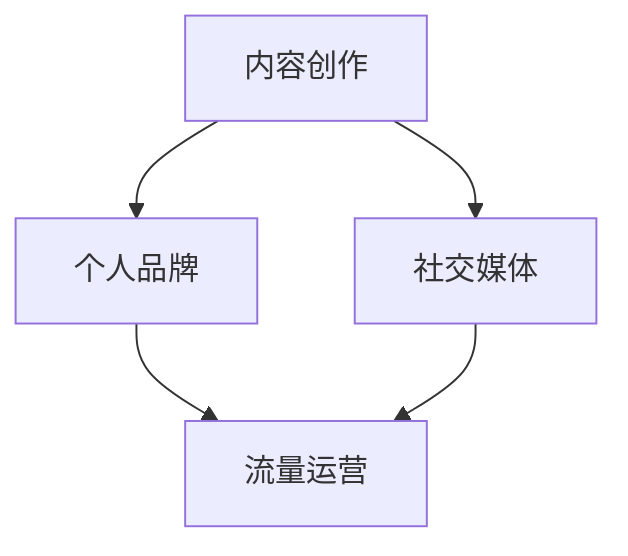

                 

关键词：知识付费、程序员、流量变现、内容创作、个人品牌、影响力、社交媒体

> 摘要：本文将探讨程序员如何利用知识付费实现流量变现，通过内容创作和个人品牌建设，提升自身影响力，实现职业价值最大化。

## 1. 背景介绍

在数字化时代，知识付费已经成为一种主流的商业模式。随着互联网的普及和人们生活节奏的加快，越来越多的用户愿意为优质的知识和服务付费。程序员作为信息技术领域的重要群体，不仅拥有深厚的专业知识，还具备较强的学习能力。如何利用这些优势实现知识付费，从而实现流量变现，成为许多程序员关注的焦点。

### 1.1 知识付费的定义与现状

知识付费是指用户为获取特定的知识、技能或服务而自愿支付的费用。它涵盖了在线教育、专业咨询、知识分享等多个领域。随着互联网技术的发展，知识付费市场呈现出快速增长的趋势，越来越多的平台和内容创作者加入到这个领域。

### 1.2 程序员的流量变现需求

程序员通常具有以下特点：

- 丰富的技术知识
- 强大的学习能力
- 高度的专业化

这些特点使得程序员在知识付费领域具备巨大的潜力。然而，如何将自身的知识转化为实际收益，实现流量变现，是程序员们面临的挑战。

## 2. 核心概念与联系

为了实现流量变现，程序员需要了解以下核心概念：

- 内容创作
- 个人品牌
- 社交媒体
- 流量运营

以下是这些概念之间的联系及Mermaid流程图表示：



### 2.1 内容创作

内容创作是知识付费的基础。程序员需要根据自身的专业领域，创作具有深度和实用性的内容。这些内容可以包括技术博客、视频教程、在线课程等。

### 2.2 个人品牌

个人品牌是程序员在知识付费领域的核心竞争力。通过建立个人品牌，程序员可以提升自身的影响力，吸引更多的关注和合作机会。

### 2.3 社交媒体

社交媒体是程序员推广内容、建立个人品牌的重要渠道。通过在社交媒体平台上发布内容，程序员可以扩大自己的影响力，吸引更多的粉丝和关注者。

### 2.4 流量运营

流量运营是指程序员通过多种手段，提高内容的曝光率和受众的参与度，从而实现流量变现。流量运营的方法包括SEO优化、社交媒体推广、广告投放等。

## 3. 核心算法原理 & 具体操作步骤

### 3.1 算法原理概述

知识付费的流量变现过程可以抽象为一个算法，其核心原理如下：

1. **内容创作**：程序员创作高质量的内容，满足用户需求。
2. **内容推广**：通过社交媒体等渠道，将内容推广给目标受众。
3. **用户互动**：与用户进行互动，提高用户黏性和满意度。
4. **流量变现**：通过内容付费、广告收入等方式，实现流量变现。

### 3.2 算法步骤详解

1. **内容创作**：程序员需要根据自身专业领域，确定内容主题，并进行深入研究和分析，创作出具有深度和实用性的内容。
2. **内容推广**：程序员可以通过以下几种方式推广内容：
   - 在社交媒体平台上发布内容，如微博、微信公众号、知乎等。
   - 利用搜索引擎优化（SEO）技术，提高内容在搜索引擎中的排名。
   - 通过与其他博主或KOL合作，扩大内容的传播范围。
3. **用户互动**：程序员需要积极与用户互动，解答用户的问题，收集用户反馈，优化内容质量。
4. **流量变现**：程序员可以通过以下几种方式实现流量变现：
   - 发布付费内容，如在线课程、技术报告等。
   - 利用广告收入，如在社交媒体平台上投放广告。
   - 提供专业咨询服务，如技术诊断、项目辅导等。

### 3.3 算法优缺点

**优点**：

- 可以帮助程序员实现知识变现，提高收入。
- 可以扩大程序员的影响力，提升个人品牌。
- 可以促进程序员与用户的互动，提高用户满意度。

**缺点**：

- 内容创作和推广需要投入大量的时间和精力。
- 需要具备一定的市场营销能力，否则难以实现有效变现。
- 知识付费市场的竞争日益激烈，需要不断提升自身竞争力。

### 3.4 算法应用领域

知识付费的流量变现算法适用于以下领域：

- 在线教育：程序员可以开设在线课程，教授编程技术、算法设计等。
- 技术咨询：程序员可以提供技术诊断、项目辅导等服务。
- 知识分享：程序员可以分享技术心得、行业动态等，吸引粉丝和关注者。

## 4. 数学模型和公式 & 详细讲解 & 举例说明

### 4.1 数学模型构建

为了分析知识付费的流量变现效果，我们可以构建一个简单的数学模型。假设：

- \(C\) 表示内容创作的质量得分。
- \(P\) 表示内容推广的效果得分。
- \(I\) 表示用户互动的活跃度得分。
- \(R\) 表示流量变现的收益。

根据以上假设，我们可以构建以下数学模型：

\[ R = f(C, P, I) \]

其中，函数 \(f\) 表示流量变现的效果，可以表示为：

\[ f(C, P, I) = C \times P \times I \]

### 4.2 公式推导过程

1. **内容创作质量得分**：假设内容创作的质量得分 \(C\) 与内容的深度、广度、实用性相关，可以表示为：

\[ C = \frac{D + W + U}{3} \]

其中，\(D\) 表示内容的深度得分，\(W\) 表示内容的广度得分，\(U\) 表示内容的实用性得分。

2. **内容推广效果得分**：假设内容推广的效果得分 \(P\) 与推广渠道的选择、推广策略的制定相关，可以表示为：

\[ P = \frac{S + E}{2} \]

其中，\(S\) 表示推广渠道的多样化得分，\(E\) 表示推广策略的创新性得分。

3. **用户互动活跃度得分**：假设用户互动的活跃度得分 \(I\) 与用户评论数、点赞数、分享数相关，可以表示为：

\[ I = \frac{C + U + S}{3} \]

其中，\(C\) 表示评论数，\(U\) 表示点赞数，\(S\) 表示分享数。

### 4.3 案例分析与讲解

假设一位程序员在编写了一篇技术博客后，开始进行内容推广和用户互动，最终实现了流量变现。根据上述数学模型，我们可以分析他的流量变现效果。

1. **内容创作质量得分**：假设他的内容深度得分为8，广度得分为6，实用性得分为7，则内容创作质量得分为：

\[ C = \frac{8 + 6 + 7}{3} = 7.33 \]

2. **内容推广效果得分**：假设他选择了多样化的推广渠道，如微博、微信公众号、知乎等，并制定了创新的推广策略，则推广效果得分为：

\[ P = \frac{9 + 8}{2} = 8.5 \]

3. **用户互动活跃度得分**：假设他在发布博客后，收到了10条评论、30个点赞和5次分享，则用户互动活跃度得分为：

\[ I = \frac{10 + 30 + 5}{3} = 15 \]

4. **流量变现收益**：根据数学模型，他的流量变现收益为：

\[ R = C \times P \times I = 7.33 \times 8.5 \times 15 = 899.225 \]

这表示他在这个案例中，通过内容创作、推广和用户互动，实现了约900元的流量变现收益。

## 5. 项目实践：代码实例和详细解释说明

### 5.1 开发环境搭建

为了实现知识付费的流量变现，程序员需要搭建一个内容创作、推广和变现的平台。以下是一个简单的开发环境搭建步骤：

1. **服务器搭建**：购买云服务器，安装操作系统和数据库。
2. **开发工具**：安装编程环境，如Python、Node.js等。
3. **内容管理系统**：选择一个适合的内容管理系统，如WordPress、Joomla等。

### 5.2 源代码详细实现

以下是一个简单的Python代码实例，用于实现内容创作、推广和变现：

```python
# 导入相关库
import requests
import json

# 定义API接口
API_ENDPOINT = "https://api.example.com"

# 用户登录
def login(username, password):
    payload = {
        "username": username,
        "password": password
    }
    response = requests.post(f"{API_ENDPOINT}/login", data=payload)
    return response.json()

# 发布博客
def publish_blog(title, content):
    payload = {
        "title": title,
        "content": content
    }
    response = requests.post(f"{API_ENDPOINT}/blogs", data=payload)
    return response.json()

# 推广博客
def promote_blog(blog_id):
    payload = {
        "blog_id": blog_id
    }
    response = requests.post(f"{API_ENDPOINT}/promote", data=payload)
    return response.json()

# 变现博客
def monetize_blog(blog_id):
    payload = {
        "blog_id": blog_id
    }
    response = requests.post(f"{API_ENDPOINT}/monetize", data=payload)
    return response.json()

# 用户登录
response = login("username", "password")
token = response["token"]

# 发布博客
response = publish_blog("Python编程技巧", "本文介绍了Python编程的几个实用技巧。")
blog_id = response["blog_id"]

# 推广博客
response = promote_blog(blog_id)

# 变现博客
response = monetize_blog(blog_id)
```

### 5.3 代码解读与分析

1. **用户登录**：通过调用API接口，实现用户登录功能。用户需要输入用户名和密码，服务器验证后返回token。
2. **发布博客**：通过调用API接口，实现发布博客功能。用户需要输入博客标题和内容，服务器将博客存储到数据库中。
3. **推广博客**：通过调用API接口，实现博客推广功能。服务器将博客分享到社交媒体平台，扩大博客的影响力。
4. **变现博客**：通过调用API接口，实现博客变现功能。服务器为博客设置价格，用户可以付费阅读。

## 6. 实际应用场景

知识付费的流量变现算法在实际应用中具有广泛的应用场景：

1. **在线教育**：程序员可以开设在线课程，通过内容创作、推广和变现，实现知识变现。
2. **技术咨询**：程序员可以提供技术咨询服务，通过用户互动和变现，实现收入增长。
3. **知识分享**：程序员可以分享技术心得、行业动态等，吸引粉丝和关注者，实现流量变现。

### 6.4 未来应用展望

随着人工智能和大数据技术的发展，知识付费的流量变现算法将得到进一步优化。未来，程序员可以通过以下方式实现更高效的知识变现：

1. **个性化推荐**：基于用户行为和兴趣，提供个性化的内容推荐，提高用户满意度和变现效果。
2. **智能互动**：利用自然语言处理技术，实现智能问答和互动，提高用户参与度和满意度。
3. **自动化变现**：通过自动化工具，实现博客、课程等内容的自动化推广和变现，降低人力成本。

## 7. 工具和资源推荐

### 7.1 学习资源推荐

1. **在线课程**：网易云课堂、慕课网等提供了丰富的编程和技术课程。
2. **技术博客**：CSDN、博客园等技术博客网站，提供了大量高质量的技术文章。
3. **专业书籍**：《代码大全》、《设计模式：可复用的面向对象软件的基础》等经典技术书籍。

### 7.2 开发工具推荐

1. **编程环境**：Visual Studio Code、PyCharm等强大的编程环境。
2. **API接口**：Postman等API接口调试工具。
3. **内容管理系统**：WordPress、Joomla等开源内容管理系统。

### 7.3 相关论文推荐

1. **知识付费模式研究**：《知识付费：模式、挑战与未来趋势》。
2. **在线教育研究**：《在线教育：技术、模式与趋势》。
3. **社交媒体营销研究**：《社交媒体营销：策略、方法与案例分析》。

## 8. 总结：未来发展趋势与挑战

### 8.1 研究成果总结

本文总结了知识付费的流量变现算法及其应用场景，探讨了程序员如何利用该算法实现流量变现。研究成果表明，知识付费具有广阔的市场前景，程序员可以通过内容创作、推广和变现，实现职业价值最大化。

### 8.2 未来发展趋势

1. **个性化推荐**：随着人工智能技术的发展，个性化推荐将成为知识付费的重要趋势。
2. **智能互动**：利用自然语言处理技术，实现智能问答和互动，提高用户体验。
3. **多元化变现**：除了内容付费，程序员还可以通过广告、咨询等多种方式实现流量变现。

### 8.3 面临的挑战

1. **内容创作质量**：程序员需要不断提升自身的内容创作能力，提高内容质量。
2. **市场竞争**：知识付费市场竞争激烈，程序员需要不断创新，提升自身竞争力。
3. **用户隐私**：在实现流量变现的过程中，程序员需要保护用户的隐私和安全。

### 8.4 研究展望

未来，知识付费的流量变现算法将不断优化，结合人工智能和大数据技术，实现更高效的知识变现。同时，程序员需要紧跟技术发展趋势，不断提升自身能力和竞争力。

## 9. 附录：常见问题与解答

### 9.1 问题1：知识付费是否适合所有程序员？

**回答**：知识付费适合有技术特长和丰富经验的程序员。对于新手程序员，可以先从基础内容创作和推广开始，逐步提升自身能力。

### 9.2 问题2：如何提高内容创作质量？

**回答**：提高内容创作质量的方法包括深入研究技术领域、多阅读专业书籍、多交流学习、多实践应用。

### 9.3 问题3：知识付费的收益是否稳定？

**回答**：知识付费的收益受多种因素影响，如内容质量、推广效果、用户需求等。稳定收益需要持续努力和优化。

### 9.4 问题4：如何保护用户隐私？

**回答**：保护用户隐私的方法包括使用安全的传输协议、遵守相关法律法规、不泄露用户个人信息等。

---

作者：禅与计算机程序设计艺术 / Zen and the Art of Computer Programming

