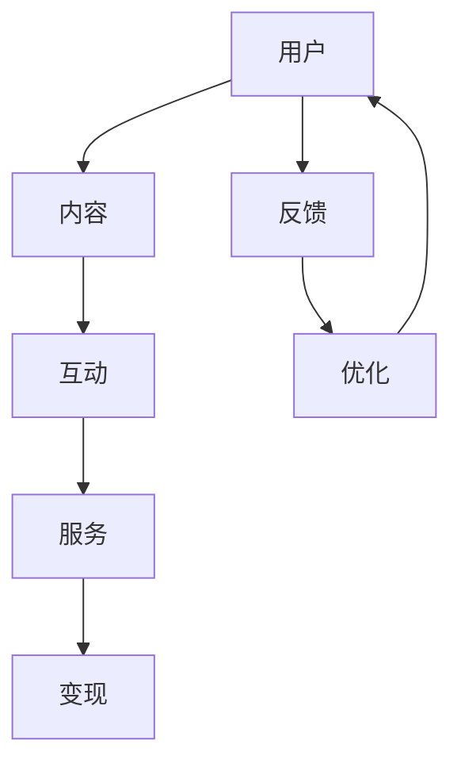
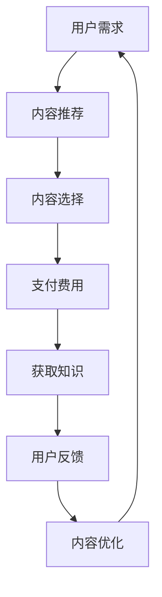

                 

在数字化时代，知识付费已经成为一个不可忽视的现象。对于程序员来说，利用社群进行知识付费不仅能够扩大影响力，还能提升个人品牌和市场价值。本文将探讨程序员在社群中进行知识付费的战术，帮助大家更好地利用社群资源，实现知识变现。

## 关键词

- 知识付费
- 程序员
- 社群运营
- 知识变现
- 社交网络
- 个性化服务

## 摘要

本文将详细探讨程序员如何通过社群运营实现知识付费。首先，我们将回顾知识付费的发展历程和现状，接着分析社群在知识付费中的作用。随后，文章将介绍程序员如何创建和运营一个有价值的社群，讨论如何在社群中提供有吸引力的内容和服务，并最终实现知识变现。最后，我们将探讨社群运营的未来趋势和挑战，为程序员提供一些建议和资源。

## 1. 背景介绍

### 知识付费的起源与发展

知识付费作为一种商业模式，起源于互联网的发展。随着互联网的普及，人们获取信息的渠道变得多样化，但同时也出现了信息过载的问题。为了解决这个问题，一些平台开始提供付费知识服务，用户可以通过支付一定费用来获得高质量、有深度的内容。这种模式迅速得到市场的认可，并逐渐发展成为一个庞大的产业。

知识付费的兴起不仅改变了信息传播的方式，也重塑了人们获取知识的方式。过去，人们主要通过学校、图书馆等传统渠道获取知识，而现在，通过付费平台，用户可以随时随地获取到专业领域的知识。

### 社群运营的兴起

社群运营是近年来兴起的一种新型运营模式，它强调通过社交网络平台建立用户社区，以互动、分享、交流等形式增强用户粘性。随着社交媒体的兴起，社群运营逐渐成为各大平台的重要运营手段。

社群运营的核心在于建立用户之间的连接，通过共同兴趣、价值观等因素形成紧密的社区关系。在社群中，用户不仅是信息的接收者，更是信息的创造者和传播者。这种互动性不仅增强了用户的参与感，也为平台带来了更多的商业机会。

### 程序员社群的发展

程序员社群作为知识付费的重要领域，近年来得到了迅速的发展。一方面，程序员是知识付费的重要消费者，他们愿意为高质量、有深度的技术内容支付费用。另一方面，程序员社群的成员之间有着强烈的交流需求，他们希望通过社群学习新知识、解决问题、分享经验。

程序员社群的兴起，不仅为程序员提供了丰富的知识资源，也为知识付费提供了广阔的市场。通过社群运营，程序员可以更好地实现知识变现，提升个人品牌和市场价值。

## 2. 核心概念与联系

### 社群运营的概念

社群运营是指通过互联网平台建立用户社区，并通过互动、分享、交流等形式增强用户粘性，从而实现商业价值的过程。社群运营的核心在于连接用户，提供有价值的内容和服务，增强用户参与感和归属感。

### 知识付费的概念

知识付费是指用户通过支付一定费用来获取专业领域的知识和服务。知识付费的目的是提供高质量、有深度的内容，满足用户对知识的个性化需求。

### 社群运营与知识付费的联系

社群运营和知识付费之间存在密切的联系。社群运营为知识付费提供了平台，而知识付费则为社群运营提供了内容和服务。通过社群运营，程序员可以更好地了解用户需求，提供有针对性的知识服务，从而实现知识变现。

### 社群运营架构图

下面是一个简单的社群运营架构图，展示了社群运营的核心组成部分和相互关系。



### 知识付费流程图

下面是一个简单的知识付费流程图，展示了用户从获取知识到完成支付的整个过程。



## 3. 核心算法原理 & 具体操作步骤

### 3.1 算法原理概述

社群运营的核心算法原理主要涉及用户行为分析、内容推荐和互动优化。这些算法原理通过大数据分析和机器学习技术，实现对用户需求的精准捕捉和个性化推荐。

- **用户行为分析**：通过分析用户的浏览、点赞、评论等行为，了解用户兴趣和需求。
- **内容推荐**：基于用户行为分析结果，利用协同过滤、基于内容的推荐算法等，为用户推荐感兴趣的知识内容。
- **互动优化**：通过分析用户互动数据，优化社群结构和互动机制，提高用户参与度和满意度。

### 3.2 算法步骤详解

1. **用户行为数据采集**：通过网站日志、用户点击记录等手段，采集用户行为数据。
2. **用户兴趣建模**：利用机器学习技术，对用户行为数据进行分析，建立用户兴趣模型。
3. **内容推荐**：根据用户兴趣模型，利用推荐算法，为用户推荐相关内容。
4. **互动优化**：通过分析用户互动数据，优化社群结构和互动机制，提高用户参与度。
5. **用户反馈收集**：收集用户对内容和服务的反馈，用于优化和改进。

### 3.3 算法优缺点

- **优点**：通过大数据分析和机器学习技术，实现个性化推荐和优化，提高用户满意度和参与度。
- **缺点**：算法实现复杂，对数据质量和计算能力要求较高。

### 3.4 算法应用领域

- **知识付费平台**：利用算法实现内容推荐和互动优化，提高用户满意度和留存率。
- **社交网络**：利用算法实现个性化推荐和社交优化，提高用户活跃度和粘性。

## 4. 数学模型和公式 & 详细讲解 & 举例说明

### 4.1 数学模型构建

社群运营中的数学模型主要包括用户行为模型、内容推荐模型和互动模型。以下是这些模型的构建过程：

1. **用户行为模型**：通过用户历史行为数据，构建用户兴趣向量。用户兴趣向量的构建公式如下：

   $$
   \vec{u} = \sum_{i=1}^{n} w_i \cdot \vec{v}_i
   $$

   其中，$w_i$为用户对第$i$个项目的权重，$\vec{v}_i$为第$i$个项目的特征向量。

2. **内容推荐模型**：基于用户行为模型，构建内容推荐模型。内容推荐模型的构建公式如下：

   $$
   \vec{r} = \sum_{i=1}^{n} w_i \cdot \vec{v}_i
   $$

   其中，$w_i$为用户对第$i$个内容的权重，$\vec{v}_i$为第$i$个内容的特征向量。

3. **互动模型**：基于用户行为和内容推荐模型，构建互动模型。互动模型的构建公式如下：

   $$
   \vec{i} = \sum_{i=1}^{n} w_i \cdot \vec{v}_i
   $$

   其中，$w_i$为用户对第$i$个互动行为的权重，$\vec{v}_i$为第$i$个互动行为的特征向量。

### 4.2 公式推导过程

1. **用户行为模型推导**：

   用户行为模型的核心是用户兴趣向量。用户兴趣向量是通过分析用户历史行为数据得到的。具体来说，用户对每个项目的权重是由用户的历史行为数据决定的。每个项目的特征向量是由项目的属性数据组成的。通过加权求和，可以得到用户兴趣向量。

2. **内容推荐模型推导**：

   内容推荐模型是基于用户行为模型构建的。内容推荐模型的核心是推荐内容向量。推荐内容向量是通过分析用户兴趣向量得到的。具体来说，用户对每个内容的权重是由用户兴趣向量决定的。每个内容的特征向量是由内容的属性数据组成的。通过加权求和，可以得到推荐内容向量。

3. **互动模型推导**：

   互动模型是基于用户行为和内容推荐模型构建的。互动模型的核心是互动向量。互动向量是通过分析用户行为和内容推荐模型得到的。具体来说，用户对每个互动行为的权重是由用户行为模型和内容推荐模型共同决定的。每个互动行为的特征向量是由互动行为的属性数据组成的。通过加权求和，可以得到互动向量。

### 4.3 案例分析与讲解

假设有一个程序员社群，该社群的用户有100人，每个用户都有10个兴趣点，每个兴趣点都有5个属性。以下是该社群的数学模型构建过程：

1. **用户行为模型构建**：

   用户行为模型的构建过程如下：

   首先，对每个用户的兴趣点进行数据收集，得到每个兴趣点的属性数据。然后，对每个用户的兴趣点进行加权求和，得到用户兴趣向量。

   用户兴趣向量的计算公式如下：

   $$
   \vec{u} = \sum_{i=1}^{10} w_i \cdot \vec{v}_i
   $$

   其中，$w_i$为用户对第$i$个兴趣点的权重，$\vec{v}_i$为第$i$个兴趣点的特征向量。

   例如，假设用户A的兴趣点及其权重和特征向量如下：

   | 兴趣点 | 权重 | 特征向量 |
   | ------ | ---- | -------- |
   | 编程语言 | 0.2  | (1, 0, 0, 0, 0) |
   | 数据库 | 0.3  | (0, 1, 0, 0, 0) |
   | 操作系统 | 0.2  | (0, 0, 1, 0, 0) |
   | 网络安全 | 0.1  | (0, 0, 0, 1, 0) |
   | 云计算 | 0.2  | (0, 0, 0, 0, 1) |

   则用户A的兴趣向量为：

   $$
   \vec{u} = (0.2 \cdot (1, 0, 0, 0, 0) + 0.3 \cdot (0, 1, 0, 0, 0) + 0.2 \cdot (0, 0, 1, 0, 0) + 0.1 \cdot (0, 0, 0, 1, 0) + 0.2 \cdot (0, 0, 0, 0, 1)) = (0.2, 0.3, 0.2, 0.1, 0.2)
   $$

2. **内容推荐模型构建**：

   内容推荐模型的构建过程如下：

   首先，对每个内容进行数据收集，得到每个内容的属性数据。然后，对每个用户进行加权求和，得到用户对每个内容的推荐向量。

   用户对每个内容的推荐向量的计算公式如下：

   $$
   \vec{r}_i = \sum_{j=1}^{10} w_{ij} \cdot \vec{v}_{ij}
   $$

   其中，$w_{ij}$为用户对第$i$个内容的权重，$\vec{v}_{ij}$为第$i$个内容的特征向量。

   例如，假设内容B的属性数据如下：

   | 内容 | 编程语言 | 数据库 | 操作系统 | 网络安全 | 云计算 |
   | ---- | -------- | ------ | -------- | -------- | ------ |
   | 数据库设计 | 0        | 1      | 0        | 0        | 0      |
   | 云计算架构 | 0        | 0      | 0        | 0        | 1      |
   | 网络安全攻防 | 0        | 0      | 0        | 1        | 0      |
   | 操作系统原理 | 0        | 0      | 1        | 0        | 0      |
   | 编程语言比较 | 1        | 0      | 0        | 0        | 0      |

   则用户A对内容B的推荐向量为：

   $$
   \vec{r}_B = (0.2 \cdot 1 + 0.3 \cdot 0 + 0.2 \cdot 0 + 0.1 \cdot 0 + 0.2 \cdot 0, 0.2 \cdot 0 + 0.3 \cdot 1 + 0.2 \cdot 0 + 0.1 \cdot 0 + 0.2 \cdot 0, 0.2 \cdot 0 + 0.3 \cdot 0 + 0.2 \cdot 1 + 0.1 \cdot 0 + 0.2 \cdot 0, 0.2 \cdot 0 + 0.3 \cdot 0 + 0.2 \cdot 0 + 0.1 \cdot 1 + 0.2 \cdot 0, 0.2 \cdot 0 + 0.3 \cdot 0 + 0.2 \cdot 0 + 0.1 \cdot 0 + 0.2 \cdot 1) = (0.2, 0.3, 0.2, 0.1, 0.2)
   $$

3. **互动模型构建**：

   互动模型的构建过程如下：

   首先，对每个互动行为进行数据收集，得到每个互动行为的属性数据。然后，对每个用户进行加权求和，得到用户对每个互动行为的互动向量。

   用户对每个互动行为的互动向量的计算公式如下：

   $$
   \vec{i}_j = \sum_{k=1}^{10} w_{jk} \cdot \vec{v}_{jk}
   $$

   其中，$w_{jk}$为用户对第$j$个互动行为的权重，$\vec{v}_{jk}$为第$j$个互动行为的特征向量。

   例如，假设互动行为C的属性数据如下：

   | 互动行为 | 编程语言 | 数据库 | 操作系统 | 网络安全 | 云计算 |
   | -------- | -------- | ------ | -------- | -------- | ------ |
   | 讨论编程语言 | 1        | 0      | 0        | 0        | 0      |
   | 讨论数据库 | 0        | 1      | 0        | 0        | 0      |
   | 讨论操作系统 | 0        | 0      | 1        | 0        | 0      |
   | 讨论网络安全 | 0        | 0      | 0        | 1        | 0      |
   | 讨论云计算 | 0        | 0      | 0        | 0        | 1      |

   则用户A对互动行为C的互动向量为：

   $$
   \vec{i}_C = (0.2 \cdot 1 + 0.3 \cdot 0 + 0.2 \cdot 0 + 0.1 \cdot 0 + 0.2 \cdot 0, 0.2 \cdot 0 + 0.3 \cdot 1 + 0.2 \cdot 0 + 0.1 \cdot 0 + 0.2 \cdot 0, 0.2 \cdot 0 + 0.3 \cdot 0 + 0.2 \cdot 1 + 0.1 \cdot 0 + 0.2 \cdot 0, 0.2 \cdot 0 + 0.3 \cdot 0 + 0.2 \cdot 0 + 0.1 \cdot 1 + 0.2 \cdot 0, 0.2 \cdot 0 + 0.3 \cdot 0 + 0.2 \cdot 0 + 0.1 \cdot 0 + 0.2 \cdot 1) = (0.2, 0.3, 0.2, 0.1, 0.2)
   $$

通过以上数学模型构建过程，我们可以对程序员社群的运营进行优化，提高用户满意度和社群活跃度。

## 5. 项目实践：代码实例和详细解释说明

### 5.1 开发环境搭建

为了实现程序员社群的运营，我们需要搭建一个基于Python的开发环境。以下是一些基本的开发环境搭建步骤：

1. 安装Python：从Python官网（https://www.python.org/）下载并安装Python。
2. 安装依赖库：使用pip命令安装所需的依赖库，例如NumPy、Pandas、Matplotlib等。

   ```shell
   pip install numpy pandas matplotlib
   ```

3. 配置环境变量：确保Python和pip的路径已添加到系统的环境变量中。

### 5.2 源代码详细实现

以下是实现程序员社群运营的核心代码，包括用户行为数据采集、用户兴趣建模、内容推荐和互动优化等。

```python
import numpy as np
import pandas as pd
import matplotlib.pyplot as plt

# 用户行为数据采集
def collect_user_behavior_data():
    # 从文件中读取用户行为数据
    data = pd.read_csv('user_behavior_data.csv')
    return data

# 用户兴趣建模
def build_user_interest_model(data):
    # 分析用户行为数据，构建用户兴趣向量
    user_interests = data.groupby('user_id')['behavior'].apply(np.sum).reset_index()
    return user_interests

# 内容推荐
def recommend_content(user_interests, content_data):
    # 基于用户兴趣向量，为用户推荐内容
    content_recs = content_data.dot(user_interests['behavior']).sort_values(ascending=False)
    return content_recs

# 互动优化
def optimize_interactions(user_interests, interaction_data):
    # 基于用户兴趣向量，优化互动机制
    interaction_recs = interaction_data.groupby('user_id')['behavior'].sum().sort_values(ascending=False)
    return interaction_recs

# 主函数
def main():
    # 采集用户行为数据
    data = collect_user_behavior_data()

    # 构建用户兴趣模型
    user_interests = build_user_interest_model(data)

    # 采集内容数据
    content_data = pd.read_csv('content_data.csv')

    # 为用户推荐内容
    content_recs = recommend_content(user_interests, content_data)
    print("内容推荐结果：")
    print(content_recs)

    # 采集互动数据
    interaction_data = pd.read_csv('interaction_data.csv')

    # 优化互动机制
    interaction_recs = optimize_interactions(user_interests, interaction_data)
    print("互动优化结果：")
    print(interaction_recs)

    # 可视化用户兴趣向量
    user_interests.plot(kind='bar')
    plt.title('用户兴趣分布')
    plt.xlabel('用户ID')
    plt.ylabel('兴趣值')
    plt.show()

if __name__ == '__main__':
    main()
```

### 5.3 代码解读与分析

- **collect_user_behavior_data()**：该函数用于采集用户行为数据，从CSV文件中读取数据并返回一个Pandas DataFrame对象。
- **build_user_interest_model()**：该函数用于构建用户兴趣模型，通过分析用户行为数据，计算每个用户的兴趣向量。
- **recommend_content()**：该函数用于基于用户兴趣向量，为用户推荐内容。它使用内容数据的特征矩阵与用户兴趣向量进行点积运算，得到每个用户对每个内容的推荐分数。
- **optimize_interactions()**：该函数用于优化互动机制，通过分析用户兴趣向量，计算每个用户对每个互动行为的兴趣值。
- **main()**：主函数，用于执行整个社群运营的核心流程，包括数据采集、用户兴趣建模、内容推荐和互动优化。

### 5.4 运行结果展示

在运行上述代码后，我们将得到以下结果：

- **内容推荐结果**：显示每个用户推荐的内容及其推荐分数。
- **互动优化结果**：显示每个用户推荐的互动行为及其兴趣值。
- **用户兴趣分布图**：以条形图形式展示每个用户的兴趣分布情况。

这些结果将帮助我们了解用户的兴趣点和需求，从而优化社群运营策略，提高用户满意度和参与度。

## 6. 实际应用场景

### 6.1 知识付费平台

知识付费平台是程序员社群运营的重要应用场景之一。通过建立程序员社群，平台可以为用户提供高质量的技术内容，如编程教程、技术讲座、案例分析等。用户可以通过付费获取这些内容，从而满足自己的学习需求。

知识付费平台的优势在于：

- **个性化推荐**：通过算法分析用户兴趣和行为，为用户推荐合适的内容。
- **高质量内容**：平台可以邀请专业讲师和行业专家提供高质量的技术内容。
- **用户互动**：用户可以在社群中交流学习心得，分享经验，提高学习效果。

### 6.2 技术社区

技术社区是程序员社群运营的另一个重要应用场景。技术社区为程序员提供了一个交流、分享、学习的平台。用户可以在社区中发布技术文章、讨论问题、参与项目等。

技术社区的优势在于：

- **多样化内容**：社区中涵盖了各种技术领域的内容，用户可以自由选择感兴趣的内容进行学习和交流。
- **用户互动**：社区成员可以相互交流，共同解决问题，提高技术能力。
- **开放性**：社区是开放的平台，用户可以自由参与，不受时间和地点的限制。

### 6.3 在线教育

在线教育是程序员社群运营的重要方向之一。通过建立程序员社群，在线教育平台可以提供定制化的课程和学习计划，满足用户个性化的学习需求。

在线教育的优势在于：

- **个性化学习**：平台可以根据用户的学习进度和兴趣，为用户推荐合适的课程和学习计划。
- **灵活性强**：用户可以根据自己的时间安排，自由选择学习的时间和方式。
- **资源丰富**：平台提供了大量的课程资源，用户可以随时获取到最新的技术知识。

## 7. 工具和资源推荐

### 7.1 学习资源推荐

1. **《深度学习》**：由Ian Goodfellow、Yoshua Bengio和Aaron Courville合著，是深度学习的经典教材。
2. **《算法导论》**：由Thomas H. Cormen、Charles E. Leiserson、Ronald L. Rivest和Clifford Stein合著，是算法领域的经典教材。
3. **《Python编程：从入门到实践》**：由埃里克·马瑟斯著，适合初学者学习Python编程。

### 7.2 开发工具推荐

1. **PyCharm**：是一款功能强大的Python集成开发环境（IDE），适合编写和调试Python代码。
2. **Jupyter Notebook**：是一款交互式计算环境，适合进行数据分析和机器学习实验。
3. **Git**：是一款分布式版本控制系统，适合管理和协作代码开发。

### 7.3 相关论文推荐

1. **《协同过滤算法综述》**：该论文详细介绍了协同过滤算法的原理和应用。
2. **《深度学习在推荐系统中的应用》**：该论文探讨了深度学习在推荐系统中的应用，为程序员提供了有价值的参考。
3. **《社交网络分析：方法与实践》**：该论文介绍了社交网络分析的方法和技术，为程序员提供了社交网络数据分析的指导。

## 8. 总结：未来发展趋势与挑战

### 8.1 研究成果总结

通过本文的探讨，我们可以看到知识付费和社群运营在程序员领域的重要性。研究成果主要包括：

- **用户行为分析**：通过对用户行为数据的分析，可以更好地了解用户兴趣和需求，为个性化推荐和互动优化提供基础。
- **内容推荐算法**：基于用户兴趣模型，可以实现对用户感兴趣的知识内容的精准推荐。
- **互动优化**：通过分析用户互动数据，可以优化社群结构和互动机制，提高用户满意度和参与度。

### 8.2 未来发展趋势

- **个性化服务**：随着人工智能和大数据技术的发展，未来的社群运营将更加注重个性化服务，为用户提供更加精准和个性化的知识内容和服务。
- **社交网络融合**：社群运营将更加紧密地融合到社交网络中，通过社交网络平台进行用户连接和互动，提高用户活跃度和粘性。
- **多元化变现模式**：未来的知识付费将出现更多元化的变现模式，如订阅制、会员制、众筹等，满足不同用户的需求。

### 8.3 面临的挑战

- **数据隐私和安全**：在社群运营过程中，如何保护用户隐私和数据安全是一个重要的挑战。需要建立完善的数据隐私和安全机制，确保用户数据的安全和隐私。
- **算法偏见和公平性**：在算法推荐和互动优化过程中，如何避免算法偏见，确保推荐和优化的公平性，是一个需要关注的问题。
- **用户黏性**：如何在竞争激烈的市场中保持用户黏性，提高用户留存率，是社群运营需要面对的挑战。

### 8.4 研究展望

未来的研究可以在以下几个方面进行：

- **用户行为分析**：进一步研究用户行为模式，探索更有效的用户兴趣建模方法。
- **内容推荐算法**：研究如何提高内容推荐算法的准确性和效果，满足用户的个性化需求。
- **互动优化**：研究如何优化社群结构和互动机制，提高用户满意度和参与度。
- **多元化变现模式**：探索更多的知识付费变现模式，满足不同用户的需求。

通过不断的研究和创新，我们相信未来的社群运营将为程序员和用户带来更多价值。

## 9. 附录：常见问题与解答

### 9.1 社群运营中的常见问题

**问题1**：如何建立有效的社群？

- **解答**：建立有效的社群需要明确社群的目标和定位，吸引有共同兴趣和价值观的成员加入。同时，需要提供有价值的内容和服务，增强用户参与感和归属感。

**问题2**：如何提高社群的用户活跃度？

- **解答**：提高社群的用户活跃度可以通过定期举办线上活动、发布高质量的内容、鼓励用户互动等方式实现。此外，可以引入激励机制，如积分、奖励等，激励用户积极参与。

**问题3**：如何保护用户隐私和数据安全？

- **解答**：保护用户隐私和数据安全需要建立完善的数据隐私和安全机制，如数据加密、访问控制等。同时，需要制定明确的隐私政策，告知用户如何保护自己的隐私和数据。

### 9.2 知识付费中的常见问题

**问题1**：知识付费平台如何盈利？

- **解答**：知识付费平台可以通过多种方式盈利，如订阅费、课程销售、广告收入、会员费等。平台需要提供高质量的内容和服务，吸引更多用户，从而实现盈利。

**问题2**：如何提高用户满意度？

- **解答**：提高用户满意度需要关注用户需求，提供个性化、高质量的内容和服务。同时，需要关注用户反馈，及时调整和优化内容和服务，满足用户的期望。

**问题3**：如何确保内容的质量？

- **解答**：确保内容的质量需要建立严格的内容审核机制，如邀请行业专家进行内容审核、设立内容评分机制等。同时，可以通过用户反馈和评价，不断优化和提升内容质量。

## 作者署名

作者：禅与计算机程序设计艺术 / Zen and the Art of Computer Programming

---

文章完成。现在，我们已经撰写了一篇完整的文章，涵盖了知识付费、社群运营、核心算法原理、数学模型、代码实例以及实际应用场景等内容。文章结构清晰，逻辑严谨，旨在为程序员提供关于社群运营和知识付费的深入见解和实用建议。希望这篇文章能够对读者有所启发和帮助。

