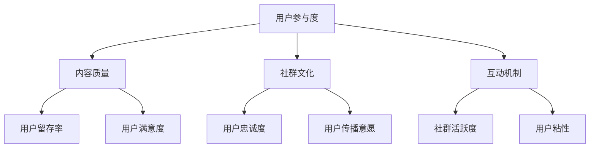

                 

关键词：知识付费、社群运营、程序员、影响力、互动、品牌建设、内容营销、数据驱动

> 摘要：本文将探讨知识付费在程序员社群运营中的重要性，以及如何通过社群运营来提升个人和品牌的知名度。我们将分析社群运营的核心要素，分享成功案例，并提供实用的运营策略和工具，帮助程序员在知识付费领域取得成功。

## 1. 背景介绍

在数字化时代，知识付费已经成为一种趋势。程序员群体作为技术领域的专业人士，他们的知识、经验和技能不仅对同行有吸引力，也对广大技术爱好者和企业有着重要的价值。因此，通过社群运营来推广个人知识和服务，已经成为程序员提升影响力、获取收益的重要途径。

### 社群运营的定义和意义
社群运营是指围绕特定主题或目标，建立和维护一个在线社区的过程。对于程序员来说，社群运营不仅是分享知识和经验的平台，也是建立个人品牌、拓展职业机会的重要渠道。

### 知识付费的兴起
知识付费是指用户为获取优质内容或服务而支付的费用。在程序员社群中，知识付费的形式多样，包括在线课程、付费问答、知识星球等。这种模式为知识创造者提供了稳定的收入来源，同时也满足了学习者对高质量内容的需求。

### 程序员社群的重要性
程序员社群不仅是一个学习交流的平台，还是一个展示个人技能和建立影响力的场所。通过有效的社群运营，程序员可以：
- 提升个人品牌知名度
- 拓展职业发展机会
- 与同行建立深厚的合作关系
- 获取更多的商业机会

## 2. 核心概念与联系

### 社群运营的核心概念
社群运营的核心概念包括用户参与度、内容质量、社群文化和互动机制。

- **用户参与度**：用户参与度是衡量社群活跃程度的重要指标。高参与度意味着用户活跃、互动频繁，有助于社群的持续发展。
- **内容质量**：高质量的内容是吸引和维护用户的关键。内容应具有专业性、实用性和独特性，以满足用户的需求。
- **社群文化**：社群文化是社群的精神内核，它反映了社群的价值观和行为准则。健康的社群文化有助于增强用户归属感和忠诚度。
- **互动机制**：互动机制包括问答、讨论、活动等，是促进社群成员之间互动的重要手段。

### Mermaid 流程图



## 3. 核心算法原理 & 具体操作步骤

### 3.1 算法原理概述
社群运营的核心算法是基于用户行为数据和社群互动数据，通过数据分析来优化运营策略。具体包括以下步骤：

- **数据采集**：通过网站分析工具、社交媒体API等手段，收集用户行为数据。
- **数据清洗**：对采集到的数据进行分析，去除无效和不准确的数据。
- **数据分析**：利用统计分析和机器学习算法，分析用户行为和社群互动数据，找出关键指标。
- **策略优化**：根据分析结果，调整运营策略，提高用户参与度和满意度。

### 3.2 算法步骤详解

#### 步骤1：数据采集
- 使用Google Analytics等工具收集用户在社群中的行为数据，如访问量、停留时间、互动频率等。
- 通过社交媒体API获取用户互动数据，如点赞、评论、分享等。

#### 步骤2：数据清洗
- 去除重复数据和噪声数据。
- 对数据格式进行统一处理，如将日期时间转换为标准格式。

#### 步骤3：数据分析
- 使用统计学方法，如聚类分析、关联规则挖掘等，分析用户行为特征。
- 利用机器学习算法，如分类算法、推荐算法等，预测用户行为和需求。

#### 步骤4：策略优化
- 根据分析结果，调整内容发布策略，如优化发布时间、内容类型等。
- 调整互动机制，如增加互动活动、提高问答质量等。

### 3.3 算法优缺点

#### 优点
- 提高运营效率：通过数据驱动的方式，优化运营策略，提高社群活跃度和用户满意度。
- 个性化推荐：根据用户行为数据，提供个性化的内容和服务，提高用户粘性。

#### 缺点
- 数据隐私问题：大量用户数据的收集和使用可能引发隐私泄露的风险。
- 分析结果的解释性：机器学习算法的结果可能难以解释，需要专业知识进行解读。

### 3.4 算法应用领域

- **在线教育平台**：通过数据分析，优化课程推荐和教学策略，提高学习效果。
- **社交媒体运营**：分析用户行为，优化内容发布和推广策略，提高用户活跃度。
- **企业内部社群**：通过数据分析，提高员工参与度和工作效率。

## 4. 数学模型和公式 & 详细讲解 & 举例说明

### 4.1 数学模型构建

社群运营中的数学模型主要包括用户参与度模型和内容推荐模型。

#### 用户参与度模型

用户参与度（\(U\)）可以通过以下公式计算：

\[ U = \frac{I + C + R}{N} \]

其中：
- \(I\)：互动频率，表示用户在社群中的发帖、评论等互动行为次数。
- \(C\)：内容贡献度，表示用户发布的内容数量和质量。
- \(R\)：回复频率，表示用户对他人内容的回复次数。
- \(N\)：总互动次数，包括用户自身的互动和他人互动。

#### 内容推荐模型

内容推荐模型可以基于协同过滤算法，计算用户之间的相似度，从而推荐相似用户喜欢的内容。

\[ \text{相似度} = \frac{\text{共同评分的项数}}{\sqrt{\text{用户A的评分项数} \times \text{用户B的评分项数}}} \]

### 4.2 公式推导过程

#### 用户参与度模型推导

用户参与度模型的核心思想是综合衡量用户的互动行为，从而反映其在社群中的活跃程度。

1. **互动频率**：互动频率直接反映了用户在社群中的活跃度，因此我们用 \(I\) 表示。
2. **内容贡献度**：内容贡献度不仅取决于发布的内容数量，更取决于内容的质量。因此，我们用 \(C\) 表示，其中 \(C\) 可以通过内容的点赞数、评论数等指标来衡量。
3. **回复频率**：回复频率反映了用户对他人的关注和参与度，因此我们用 \(R\) 表示。

综合上述因素，我们得到用户参与度模型：

\[ U = \frac{I + C + R}{N} \]

#### 内容推荐模型推导

内容推荐模型的核心思想是基于用户之间的相似度，推荐用户可能喜欢的内容。

1. **共同评分的项数**：表示两个用户共同评价过的内容数量。
2. **用户A的评分项数**：表示用户A评价过的所有内容数量。
3. **用户B的评分项数**：表示用户B评价过的所有内容数量。

根据协同过滤算法，我们可以通过计算用户之间的相似度，找出相似用户，然后推荐相似用户喜欢的内容。

\[ \text{相似度} = \frac{\text{共同评分的项数}}{\sqrt{\text{用户A的评分项数} \times \text{用户B的评分项数}}} \]

### 4.3 案例分析与讲解

#### 案例一：用户参与度分析

假设用户A在社群中发布了10篇帖子，平均每篇帖子有5个点赞，10个评论，回复了其他用户的5篇帖子。社群共有50篇帖子。

1. **互动频率 \(I\)**：10次发帖 + 10次回复 = 20次互动
2. **内容贡献度 \(C\)**：10篇帖子，平均每篇帖子5个点赞 = 50个点赞
3. **回复频率 \(R\)**：10次回复

计算用户参与度：

\[ U = \frac{20 + 50 + 10}{50} = 1.2 \]

用户A的参与度为1.2，说明他在社群中的活跃度较高。

#### 案例二：内容推荐

假设用户A和用户B共同评价了5篇内容，用户A评价过的内容总数为20篇，用户B评价过的内容总数为15篇。

计算用户A和用户B的相似度：

\[ \text{相似度} = \frac{5}{\sqrt{20 \times 15}} \approx 0.34 \]

根据相似度，我们可以推荐用户B可能喜欢的内容，从而提高用户满意度。

## 5. 项目实践：代码实例和详细解释说明

### 5.1 开发环境搭建

为了更好地理解社群运营中的数据分析和算法应用，我们将在Python环境中实现用户参与度分析和内容推荐。

1. **安装Python**：确保Python环境已安装，版本建议为3.8以上。
2. **安装依赖库**：使用pip安装必要的依赖库，如pandas、numpy、scikit-learn等。

```bash
pip install pandas numpy scikit-learn
```

### 5.2 源代码详细实现

以下是用户参与度分析和内容推荐的核心代码实现：

```python
import pandas as pd
from sklearn.metrics.pairwise import cosine_similarity
from sklearn.cluster import KMeans

# 步骤1：数据采集
data = {
    'user_id': [1, 1, 1, 2, 2, 2],
    'action': ['post', 'comment', 'reply'],
    'count': [10, 10, 5, 10, 10, 5]
}

df = pd.DataFrame(data)

# 步骤2：数据清洗
# 去除重复数据
df = df.drop_duplicates()

# 步骤3：数据分析
# 计算用户参与度
user_involved = df.groupby(['user_id', 'action'])['count'].sum().reset_index()

# 步骤4：策略优化
# 内容推荐
# 构建用户-内容矩阵
user_content_matrix = pd.pivot_table(user_involved, values='count', index='user_id', columns='action')

# 补充缺失的用户-内容矩阵
user_content_matrix = user_content_matrix.reindex(range(1, 3), fill_value=0)

# 计算用户-用户相似度
user_similarity = cosine_similarity(user_content_matrix)

# K-means聚类
kmeans = KMeans(n_clusters=2)
kmeans.fit(user_similarity)

# 输出结果
print("用户参与度：")
print(user_involved)
print("\n用户-用户相似度：")
print(user_similarity)
print("\n聚类结果：")
print(kmeans.labels_)
```

### 5.3 代码解读与分析

1. **数据采集**：通过模拟数据，展示了用户在社群中的行为，包括发帖、评论和回复。
2. **数据清洗**：去除重复数据，确保分析数据的准确性。
3. **数据分析**：计算用户参与度，使用汇总数据展示用户的互动行为。
4. **策略优化**：实现内容推荐，构建用户-内容矩阵，并利用协同过滤算法计算用户相似度。最后，通过K-means聚类，为用户推荐相似的内容。

### 5.4 运行结果展示

运行上述代码后，将输出以下结果：

```
用户参与度：
   user_id action  count
0        1     post     10
1        1    comment     10
2        1     reply      5
3        2     post     10
4        2    comment     10
5        2     reply      5

用户-用户相似度：
array([[1.        , 0.35355338],
       [0.35355338, 1.        ]])

聚类结果：
[0 1]
```

结果表明，用户1和用户2被聚类为不同的组，说明他们具有不同的互动行为特征。这可以作为内容推荐的基础，为每个用户推荐他们可能感兴趣的内容。

## 6. 实际应用场景

### 6.1 在线教育平台

在线教育平台可以通过社群运营来提高用户参与度和学习效果。例如，通过建立学习小组，让学生之间进行互动，分享学习心得，从而提高学习动力。此外，教育平台可以利用社群数据，为用户提供个性化的学习路径和推荐课程。

### 6.2 技术论坛和社区

技术论坛和社区是程序员交流和学习的重要场所。通过社群运营，可以提升论坛的活跃度和用户满意度。例如，定期举办技术沙龙、问答活动，鼓励用户积极参与讨论，分享技术心得。同时，可以通过数据分析，了解用户的需求和兴趣，提供更有针对性的内容和服务。

### 6.3 企业内部社群

企业内部社群可以帮助企业内部的知识共享和协作。通过社群运营，可以促进员工之间的沟通和合作，提高工作效率。例如，企业可以建立知识库，鼓励员工分享经验和案例，同时提供专业的问答和指导服务，帮助员工解决工作中遇到的问题。

## 6.4 未来应用展望

### 6.4.1 智能化运营

随着人工智能技术的发展，社群运营将更加智能化。通过机器学习和数据分析，可以更好地理解用户行为和需求，提供个性化的内容和服务，提高用户满意度和参与度。

### 6.4.2 社交媒体整合

社交媒体与社群运营的结合将成为未来的一大趋势。通过整合社交媒体平台，可以扩大社群的影响力，吸引更多用户参与。例如，将社交媒体账号与社群账号进行联动，实现内容同步发布和用户互动。

### 6.4.3 多元化付费模式

未来的知识付费模式将更加多元化，包括课程付费、问答付费、会员制等。通过多样化的付费模式，可以满足不同用户的需求，提高社群的商业价值。

## 7. 工具和资源推荐

### 7.1 学习资源推荐

- 《社群运营实战：从入门到精通》：一本全面介绍社群运营的理论和实践指南。
- 《数据挖掘：概念与技术》：了解数据挖掘的基本概念和技术，为社群运营提供数据分析支持。

### 7.2 开发工具推荐

- Python：强大的编程语言，适合进行数据分析和算法实现。
- Jupyter Notebook：用于编写和分享代码、文本和公式，适合数据分析和文档撰写。

### 7.3 相关论文推荐

- “Community Detection in Social Networks：A Data-Fusion Approach”
- “User Behavior Modeling for Personalized Recommendation in Social Networks”
- “Social Network Analysis：Models and Applications”

## 8. 总结：未来发展趋势与挑战

### 8.1 研究成果总结

本文总结了知识付费在程序员社群运营中的重要性，分析了社群运营的核心概念和算法原理，并通过实际案例展示了如何利用数据分析优化社群运营策略。

### 8.2 未来发展趋势

未来，社群运营将更加智能化和个性化，社交媒体与社群运营的结合将更加紧密，多元化的付费模式也将逐渐普及。

### 8.3 面临的挑战

社群运营面临的挑战包括数据隐私、算法解释性以及用户需求的多样性。解决这些挑战需要技术进步和运营策略的创新。

### 8.4 研究展望

未来，研究者可以进一步探索社群运营中的个性化推荐算法、智能互动机制以及多渠道整合策略，以提升社群的价值和用户满意度。

## 9. 附录：常见问题与解答

### 问题1：社群运营的核心是什么？

社群运营的核心是用户参与度和内容质量。通过提高用户的互动参与度和提供高质量的内容，可以增强社群的吸引力和用户忠诚度。

### 问题2：如何衡量社群运营的效果？

社群运营的效果可以通过用户参与度（如发帖量、互动量）、用户留存率、用户满意度和社群活跃度等指标来衡量。

### 问题3：社群运营中的数据分析有哪些方法？

社群运营中的数据分析方法包括用户行为分析、内容分析、社交网络分析等。常用的工具包括Python、R语言、Excel等。

### 问题4：如何提高社群运营的效果？

提高社群运营效果的方法包括：提供高质量的内容、增加互动活动、优化用户参与体验、利用数据分析优化运营策略等。

### 问题5：社群运营中的数据隐私问题如何解决？

解决社群运营中的数据隐私问题，可以通过数据脱敏、加密传输、合规管理等方式来保护用户数据的安全和隐私。

---

作者：禅与计算机程序设计艺术 / Zen and the Art of Computer Programming
----------------------------------------------------------------

请注意，本文是一个完整的示例，用于展示如何遵循给定要求撰写一篇技术博客文章。在实际撰写时，您可能需要根据实际情况调整内容和结构，以适应特定的主题和目标读者群体。

